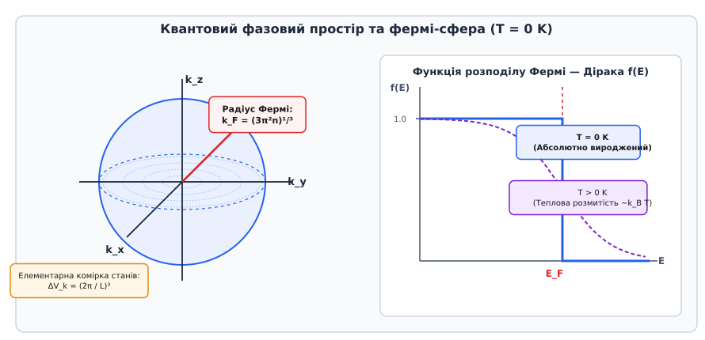
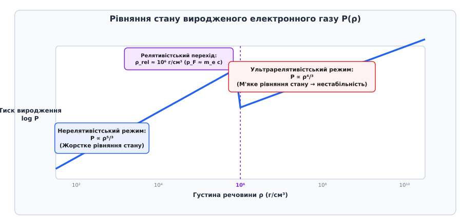
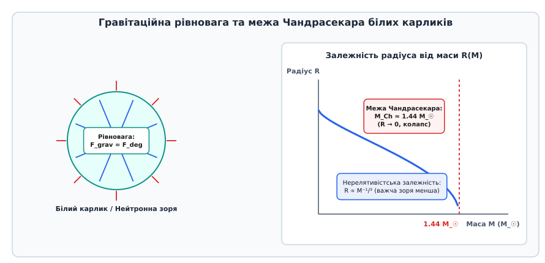

# Тиск виродженого фермі-газу

<preknowlist>
- [Принцип заборони Паулі](root:ph-quantum/pauli-exclusion) — два тотожні ферміони не можуть одночасно перебувати в одному квантовому стані.
- [Статистика Фермі — Дірака](root:ph-thermodynamics/fermi-dirac-statistics) — квантовий розподіл частинок із півцілим спіном за енергетичними рівнями.
- [Тривимірна потенціальна яма](root:ph-quantum/particle-in-a-box) — квантування хвильових векторів та енергетичних рівнів у обмеженому об'ємі.
- [Спін електрона](root:ph-quantum/electron-spin) — власний квантовий момент імпульсу частинок та спінове виродження.
- [Принцип невизначеності Гайзенберга](root:ph-quantum/uncertainty-principle) — фундаментальне обмеження на одночасне вимірювання координати та імпульсу частинки.
</preknowlist>

Коли класичний газ із нейтральних атомів або молекул охолоджується до температур, близьких до абсолютного нуля (`T = 0 K`), хаотичний тепловий рух частинок зупиняється. Молекули втрачають кінетичну енергію, і класичний термодинамічний тиск `P = n k_B T` прямує до нуля. За законами класичної фізики такий газ мав би повністю втратити пружність і стиснутися у нескінченно тонкий шар або впасти під дією найменшого зовнішнього стиску. Проте якщо система складається з ферміонів — частинок із півцілим спіном (таких як електрони, протони, нейтрони чи кварки) — природа поводиться принципово інакше. Навіть при повному відсутності теплового руху за абсолютного нуля виникає гігантський внутрішній тиск, який чинить непохитний опір зовнішньому стисненню.

Цей тиск не залежить від температури середовища і визначається виключно числовою концентрацією частинок та фундаментальними квантовими законами. Саме цей квантовий тиск виродження підтримує стабільність електронів у звичайних металах при кімнатній температурі, утримує згаслі зорі — білі карлики — від гравітаційного колапсу, а при ще більших густинах не дає нейтронним зорям стиснутися в чорні дири.

Детальний аналіз історичного шляху від кризи класичної електронної теорії до відкриття зверхгустих зірок викладено у вставці [📜 Історія відкриття квантового виродження та астрофізичних застосувань](root:ph-thermodynamics/degeneracy-pressure/hist-fermi-dirac.md).

## 1. Квантовомеханічна природа та принцип заборони Паулі

В основі існування тиску виродження лежить квантова нерозрізність тотожних частинок та принцип заборони Паулі. Оскільки ферміони мають півцілий спін (`s = 1/2, 3/2, ...`), хвильова функція системи двох або більше тотожних ферміонів є строго антисиметричною відносно перестановки координат і спінових змінних будь-якої пари частинок:

```
Ψ(r_1, s_1; r_2, s_2) = - Ψ(r_2, s_2; r_1, s_1)
```

З цієї антисиметрії безпосередньо випливає, що якщо спробувати помістити дві частинки в один і той самий квантовий стан (`r_1 = r_2` та `s_1 = s_2`), хвильова функція тотожно обнуляється `Ψ = -Ψ ➔ Ψ = 0`. Імовірність виявити два ферміони в абсолютно однаковому квантовому стані є строго нульовою.

Ця математична властивість створює фундаментальне квантове відштовхування між тотожними ферміонами, яке називається ефективною квантовою кореляцією заперечення. Навіть якщо між частинками немає жодних силових полів взаємодії (ідеальний фермі-газ), принцип заборони Паулі змушує частинки уникати перебування в однакових просторових та імпульсних станах.

У класичній статистичній механіці стан кожної частинки описується точкою у шестивимірному фазовому просторі координат та імпульсів `(x, y, z, p_x, p_y, p_z)`. У квантовій механіці через співвідношення невизначеностей Гейзенберга `Δx Δp_x ≥ ℏ / 2` фазовий простір принципово не може бути розділений на нескінченно малі елементи. Найменшим об'ємом фазового простору, який відповідає одному квантовому стану для частинки без спіну, є осередкова комірка об'ємом `h³ = (2π ℏ)³`. Якщо частинка має спін `s`, то завдяки наявності `g_s = 2s + 1` орієнтацій спінового моменту кожна фазова комірка `h³` може містити не більше ніж `g_s` частинок. Для електронів, протонів та нейтронів зі спіном `s = 1/2` фазовий фактор дорівнює `g_s = 2`, що дозволяє перебувати в одній осередковій комірці не більше ніж двом частинкам із протилежно орієнтованими спінами.


*Сфера Фермі радіуса k_F у k-просторі та сходинкова функція розподілу Фермі — Дірака при абсолютному нулю температур.*

При абсолютному нулю температур система прагне мінімізувати свою повну енергію. Якби частинки були бозонами (із цілим спіном `s = 0, 1, 2`), усі `N` частинок осіли б у найнижчому квантовому стані з імпульсом `p = 0`, утворюючи бозе-ейнштейнівський конденсат без жодного кінетичного тиску. Однак для ферміонів такий сценарій строго заборонений принципом Паулі. Лише перші дві частинки можуть зайняти найнижчий енергетичний рівень із мінімальним імпульсом. Наступна пара частинок змушена зайняти вищий енергетичний рівень, четверта пара — ще вищий, і так далі.

У результаті `N` ферміонів, замкнених у кубічному об'ємі `V`, послідовно «замощують» фазовий простір імпульсів від `p = 0` до певного максимального граничного значення `p_F`, яке називається імпульсом Фермі. Геометрично у тривимірному імпульсному `k`-просторі заповнені квантові стани утворюють суцільну сферичну область — сферу Фермі.

## 2. Квантувальний радіус Фермі та енергія Фермі

Знайдемо математичний зв'язок між кількістю ферміонів `N`, об'ємом системи `V` та граничним хвильовим вектором Фермі `k_F`. Об'єм однієї комірки у хвильовому `k`-просторі для кубічного об'єму `V = L³` дорівнює `(2π / L)³ = 8 π³ / V`. Об'єм сфери Фермі радіуса `k_F` становить `(4/3) π k_F³`.

Множачи об'єм сфери Фермі на спіновий фактор `g_s = 2` для електронів та ділячи на об'єм однієї комірки `8 π³ / V`, отримуємо повну кількість частинок у системі:

```
N = 2 · ((4/3) π k_F³) / (8 π³ / V)
= (V · k_F³) / (3 π²)               [скорочення співмножників 8π / 8π³ = 1 / π²]
```

Виразивши граничний хвильовий вектор `k_F` через числову концентрацію частинок `n = N / V`, отримуємо основоположне співвідношення квантового виродження:

```
k_F = (3 π² · n)¹/³
```

Відповідно, граничний імпульс Фермі дорівнює:

```
p_F = ℏ · (3 π² · n)¹/³
```

Для нерелятивістських частинок маси `m` (коли `p_F ≪ m c`) гранична кінетична енергія найвищого заповненого рівня називається енергією Фермі `E_F`:

```
E_F = p_F² / (2 m) = (ℏ² / (2 m)) · (3 π² · n)²/³
```

З цього виразу випливає фундаментальна квантова властивість виродженого газу: чим щільніше стиснутий газ (чим більша концентрація `n`), тим вищим стає імпульс Фермі `p_F` та гранична кінетична енергія `E_F`. Частинки у зтиснутому газі змушені рухатися з високими швидкостями не через нагрів, а виключно через брак вільного місця у фазовому просторі.

Густина квантових станів `g(E) = dN / dE` для нерелятивістського газу зростає як корінь з енергії `g(E) ∝ √E`. На самій поверхні сфери Фермі густина станів виражається простою формулою:

```
g(E_F) = (3 N) / (2 E_F)
```

Детальний математичний вивід густини станів та квантових інтегралів викладено у вставці [🧮 Квантовомеханічне та термодинамічне виведення тиску виродженого фермі-газу](root:ph-thermodynamics/degeneracy-pressure/math-fermi-gas.md).

## 3. Нерелятивістське рівняння стану виродженого газу

Щоб знайти тиск, який створює абсолютно вироджений нерелятивістський фермі-газ при `T = 0 K`, обчислимо спочатку його повну внутрішню кінетичну енергію `U_0`. Інтегруванням енергії `E(k) = ℏ² k² / (2m)` по всіх квантових станах всередині сфери Фермі радіуса `k_F` отримуємо:

```
U_0 = ∫₀^{k_F} (ℏ² k² / (2m)) · (V / π²) k² dk
= (V ℏ² / (2 m π²)) · (k_F⁵ / 5)     [інтегрування k⁴ dk = k⁵/5]
= (3/5) · N · E_F                     [підстановка E_F та N = V k_F³ / 3π²]
```

Середня кінетична енергія частинки у виродженому нерелятивістському газі становить `3/5` від максимальної енергії Фермі `E_F`. Це означає, що попри нульову температуру середня швидкість руху частинок є величезною.

За законами термодинаміки при абсолютному нулю тиск `P` дорівнює від'ємній похідній від внутрішньої енергії за об'ємом системи при фіксованому числі частинок `N`:

```
P = - (∂U_0 / ∂V)_N
```

Оскільки `U_0 ∝ V · (N / V)⁵/³ ∝ V⁻²/³`, беремо похідну за об'ємом:

```
P = - (∂ / ∂V) [ C · V⁻²/³ ] = (2/3) · (U_0 / V)
```

Підставляючи вираз для `U_0 / V = (3/5) n E_F`, отримуємо рівняння стану нерелятивістського виродженого фермі-газу:

```
P = (2/3) · (3/5) · n · E_F
= ((3 π²)²/³ · ℏ²) / (5 m) · n⁵/³
```

Записуючи концентрацію через масову густину речовини `ρ = μ_e m_u n` (де `μ_e` — середня кількість маси речовини на один електрон, `m_u` — атомна одиниця маси), отримуємо жорстку степеневу залежність нерелятивістського тиску від густини:

```
P ∝ ρ⁵/³
```

Цей тиск називається **жорстким рівнянням стану**. При стисненні об'єму газу вдвічі густина `ρ` зростає у 2 рази, а тиск виродження зростає у `2⁵/³ ≈ 3.17` раза. Така надлінійна реакція створює колосальну пружність квантового середовища.


*Залежність тиску виродження від густини речовини з переходом від нерелятивістського закону P ∝ ρ⁵/³ до релятивістського P ∝ ρ⁴/³.*

Фізичний механізм виникнення цього тиску можна зрозуміти безпосередньо з принципу невизначеності. При зміні об'єму `V ➔ V / 2` просторовий розмір комірки `Δx` зменшується в `2¹/³` раза. Відповідно, мінімальний розмах імпульсу частинок `Δp_x` зростає в `2¹/³` раза, а кінетична енергія частинки `E ∝ p²` зростає у `2²/³` раза. Помноживши зростання енергії однієї частинки на подвоєння їхньої просторової концентрації, отримуємо зростання густини енергії в `2⁵/³` раза, що тотожно дає тиск `P ∝ ρ⁵/³`.

## 4. Релятивістський режим та «пом'якшення» рівняння стану

При подальшому збільшенні густини речовини концентрація частинок `n` зростає, а імпульс Фермі `p_F = ℏ (3π²n)¹/³` стає сумірним або більшим за релятивістську масу спокою частинки `m c`. Для електронів це перехідне значення густини досягається при:

```
ρ_rel ≈ 10⁶ g/cm³ = 10⁹ kg/m³
```

Коли імпульс частинок перевищує `m_e c`, класична формули кінетичної енергії `E = p² / 2m` втрачає чинність, і необхідно застосовувати релятивістський закон дисперсії Ейнштейна:

```
E(p) = √(p² c² + m² c⁴) - m c²
```

В ультрарелятивістській границі (`p_F ≫ m c`), коли швидкість частинок на поверхні сфери Фермі наближається до швидкості світла `v ≈ c`, енергія зв'язана з імпульсом лінійно:

```
E(p) ≈ c · p = ℏ c k
```

Обчислимо повну внутрішню енергію ультрарелятивістського фермі-газу `U_{0,UR}`:

```
U_{0,UR} = ∫₀^{k_F} (ℏ c k) · (V / π²) k² dk
= (V ℏ c / π²) · (k_F⁴ / 4)          [інтегрування k³ dk = k⁴/4]
= (3/4) · N · E_{F,UR}               [де E_{F,UR} = ℏ c k_F]
```

Знайдемо тиск ультрарелятивістського виродженого газу як похідну за об'ємом:

```
U_{0,UR} ∝ V · (N / V)⁴/³ ∝ V⁻¹/³
```

```
P_UR = - (∂U_{0,UR} / ∂V)_N = (1/3) · (U_{0,UR} / V)
```

Підставляючи вираз для `U_{0,UR} / V = (3/4) n E_{F,UR}`:

```
P_UR = (1/3) · (3/4) · n · (ℏ c (3 π² n)¹/³)
= ((3 π²)¹/³ · ℏ c) / 4 · n⁴/³
```

У масовій формі ультрарелятивне рівняння стану набуває вигляду:

```
P ∝ ρ⁴/³
```

Зміна показника ступеня з `5/3` на `4/3` являє собою фундаментальне явище фізики виродженого газу — **пом'якшення рівняння стану**. У релятивістському режимі при збільшенні густини в 2 рази тиск виродження зростає лише у `2⁴/³ ≈ 2.52` раза (проти 3.17 рази у нерелятивістському випадку).

Причина цього полягає в тому, що релятивістські частинки не можуть нарощувати свою швидкість понад швидкість світла `c`. Зростання їхньої кінетичної енергії відбувається лише за рахунок маси та імпульсу, а не збільшення швидкості переносу тиску. Це пом'якшення має катастрофічні наслідки для стабільності надмасивних зірок.

## 5. Астрофізичні застосування: Білі карлики та межа Чандрасекара

Головним природним полігоном, де тиск виродженого електронного газу відіграє вирішальну роль, є білі карлики — компактні зоряні залишки масою порядку маси Сонця `M ∝ M_☉` та радіусом порядку радіуса Землі `R ≈ 10⁴ km`.

Коли зоря малої або середньої маси (до `8 M_☉`) вичерпує запаси водню та гелію у своєму ядрі, вона скидає зовнішню оболонку (утворюючи планетарну туманність), а її вуглецево-кисневе ядро стискається під дією власного тяжіння. Стиснення триває доти, доки густина електронного газу в ядрі не досягне `10⁵ – 10⁶ g/cm³`, і тиск виродженого електронного газу не зупинить гравітаційний колапс.


*Баланс між сил гравітаційного стиснення та квантового тиску виродження у білому карлику та залежність радіуса зорі від її маси R(M).*

Розглянемо спрощену оцінку рівноваги білого карлика масою `M` та радіусом `R`. Гравітаційний тиск стиснення зорі оцінюється як:

```
P_grav ≈ (G · M²) / R⁴
```

Середня масова густина зорі дорівнює `ρ ≈ M / R³`. Підставимо нерелятивістське рівняння стану `P_deg ∝ ρ⁵/³ ∝ M⁵/³ / R⁵` у умову рівноваги `P_grav = P_deg`:

```
(G · M²) / R⁴ ∝ M⁵/³ / R⁵
```

Помноживши обидві частини на `R⁵ / M²`, отримуємо дивовижне масово-радіусне співвідношення для білих карликів:

```
R ∝ M⁻¹/³
```

Цей результат виявляє парадоксальну квантову властивість білих карликів: **чим масивнішою є зоря, тим меншим є її фізичний радіус**. Додавання маси до білого карлика підсилює гравітаційне поле, змушуючи електрони стискатися до ще вищих імпульсів Фермі, що призводить до зменшення об'єму зорі. Для білого карлика масою `0.4 M_☉` радіус становить близько `11 000 km`, тоді як для масивного карлика `1.3 M_☉` радіус зменшується до `3 000 km`.

Однак при збільшенні маси `M` густина в центрі зорі зростає, імпульс електронів наближається до `m_e c`, і рівняння стану переходить у релятивістський режим `P_deg ∝ ρ⁴/³`. Підставимо ультрарелятивістський тиск у умову рівноваги:

```
(G · M²) / R⁴ ∝ M⁴/³ / R⁴
```

Зверніть увагу: радіус `R` повністю скорочується з обох частин рівняння! Гравітаційний тиск та ультрарелятивістський тиск виродження мають однакову залежність від радіуса `1 / R⁴`.

Це означає, що рівновага можлива лише при строго визначеній унікальній масі зорі, яка називається **межею Чандрасекара** `M_Ch`:

```
M_Ch = (ω₃⁰ / (μ_e m_u)²) · ((ℏ c / G)³/²) ≈ 1.44 M_☉
```

де `ω₃⁰ ≈ 2.018` — числовий коефіцієнт розв'язку політропи Лейна — Емдена для `n = 3`.

Якщо маса білого карлика перевищує межу Чандрасекара `M > 1.44 M_☉`, тиск вироджених електронів принципово не здатний зупинити гравітацію при жодному радіусі. Зоря втрачає стійкість і зазнає незворотного гравітаційного колапсу або вибухає як термоядерна наднова типу Ia. Наднові типу Ia слугують у сучасній космології «стандартними свічками» для вимірювання віддалей до далеких галактик, завдяки чому було відкрито прискорене розширення Всесвіту.

Програмну реалізацію чисельного інтегрування масово-радіусного профілю білого карлика наведено у вставці [⚙️ Числовий розрахунок рівняння стану та масово-радіусного профілю білого карлика](root:ph-thermodynamics/degeneracy-pressure/proj-white-dwarf-mass.md).

## 6. Нейтронні зорі та межа Толмена — Оппенгеймера — Волкова

Якщо маса колапсуючого ядра перевищує межу Чандрасекара, стиснення продовжується доти, доки енергія Фермі електронів `E_F` не перевищить різницю мас між нейтроном і протоном (`m_n - m_p ≈ 1.293 MeV`). При досягненні густини `ρ ≈ 10¹¹ g/cm³` електрони стають настільки енергійними, що вимушено захоплюються протонами атомних ядер у процесі зворотного бета-розпаду (нейтронізація речовини):

```
e⁻ + p ➔ n + ν_e
```

Протони перетворюються на нейтрони, випромінюючи електронні нейтрино. При густині `ρ_n ≈ 2.8 × 10¹⁴ g/cm³` (густина ядерної матерії) речовина зорі перетворюється на суцільну нейтронну рідину з невеликою домішкою протонів та електронів.

Оскільки нейтрони є ферміонами зі спіном `s = 1/2`, при досягненні ядерної густини вмикається **тиск виродженого нейтронного газу**. Маса нейтрона `m_n` майже у 1836 разів більша за масу електрона `m_e`. Згідно з формулою `P_deg ∝ 1 / m`, при тій самій концентрації тиск виродженого нейтронного газу значно менший за електронний, однак за рахунок колосального стиснення густини радіус нейтронної зорі становить лише `10 – 12 km` при масі `1.4 – 2.1 M_☉`.

У нейтронних зорях крім чистого тиску виродження важливу роль відіграють сильні ядерні взаємодії (відштовхування між нуклонами на малих відстанях `r < 0.8 fm`) та ефекти загальної теорії відносності Ейнштейна. Верхня межа маси нейтронної зорі описується рівнянням Толмена — Оппенгеймера — Волкова і становить:

```
M_TOV ≈ 2.0 – 2.3 M_☉
```

Якщо маса згаслого ядра перевищує межу `M_TOV`, жодні квантові тиски виродження чи ядерні сили не здатні протистояти гравітації, і об'єкт колапсує у чорну диру. Злиття нейтронних зірок є джерелом гравітаційних хвиль (події GW170817), зареєстрованих детекторами LIGO та Virgo.

## 7. Електрони провідності в металах та фізика конденсованого стану

Попри те, що тиск виродження асоціюється перш за все з екзотичними астрофізичними об'єктами, він діє всередині кожного шматка металу при кімнатній температурі.

У кристалічній ґратці металу (наприклад, Міді `Cu`, Натрію `Na` або Алюмінію `Al`) валентні електрони відриваються від атомних кістяків і утворюють газ вільних електронів провідності з високою концентрацією `n ≈ 10²8 – 10²⁹ m⁻³`.

Обчислимо енергію Фермі для електронів провідності у Міді (`n = 8.5 × 10²⁸ m⁻³`):

```
E_F = (ℏ² / (2 m_e)) · (3 π² · 8.5 × 10²⁸)²/³
≈ 1.13 × 10⁻¹⁸ J ≈ 7.0 eV
```

Знайдемо відповідну характеристичну температуру Фермі `T_F = E_F / k_B`:

```
T_F = (7.0 eV × 1.602 × 10⁻¹⁹ J/eV) / (1.38 × 10⁻²³ J/K) ≈ 80 000 K
```

Оскільки кімнатна температура `T ≈ 300 K` становить менше 0.4% від температури Фермі `T_F`, електронний газ у металах при звичайних умовах є **глибоко виродженим** (`T ≪ T_F`). Його функція розподілу майже не відрізняється від ідеальної сходинки при `T = 0 K`.

Обчислимо тиск виродження електронів провідності у Міді:

```
P_deg = (2/5) · n · E_F
≈ (2/5) · (8.5 × 10²⁸ m⁻³) · (1.13 × 10⁻¹⁸ J)
≈ 3.8 × 10¹⁰ Pa ≈ 380 000 atm
```

Електронний газ у звичайному шматку мідного дроту перебуває під квантовим тиском близько 380 тисяч атмосфер! Метал не розлітається на шматки під дією цього тиску лише тому, що вироджені електрони утримуються колосальними електростатичними силами Кулонівського притягання з боку позитивно заряджених іонів кристалічної ґратки. Баланс між квантовим тиском виродження електронів та кулонівським притяганням іонів визначає рівноважний період кристалічної ґратки, модуль стискуваності та густину твердих металів.

Модуль об'ємного стиснення електронного газу `K` виражається безпосередньо через тиск виродження:

```
K = - V · (dP / dV) = (5/3) · P_deg
```

Цей результат пояснює, чому метали є важкостискуваними твердими тілами із високим модулем пружності.

> 🔧 **Навіщо це.**
> Розуміння тиску виродженого фермі-газу є критично важливим у сучасних фізико-технічних галузях:
> 1. **Фізика напівпровідників та мікроелектроніка:** у сильно легованих напівпровідниках (doped semiconductors) носії заряду стають виродженими. Це враховується при проектуванні диодів Есакі (тунельних діодів), напівпровідникових лазерів та контактів метал-напівпровідник.
> 2. **Ядерна фізика та керований термоядерний синтез:** під час інерційного термоядерного синтезу (лазерного стиснення мішеней із дейтерієм та тритієм) речовина стискається до стан виродженого газу. Урахування рівняння стану `P ∝ ρ⁵/³` є необхідним для розрахунку порогу запалювання синтезу.
> 3. **Релятивістська астрофізика та космологія:** тиск виродження визначає верхню межу мас білих карликів (`M_Ch = 1.44 M_☉`), що використовується астрономами як «стандартні свічки» (наднові типу Ia) для вимірювання прискореного розширення Всесвіту та темної енергії.
