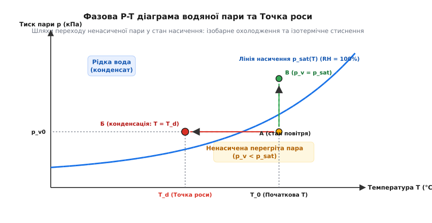
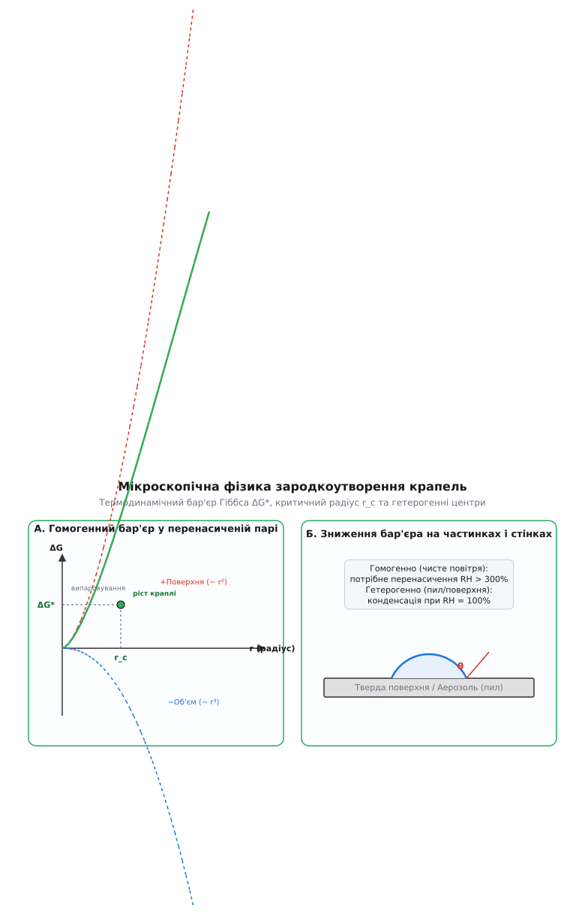
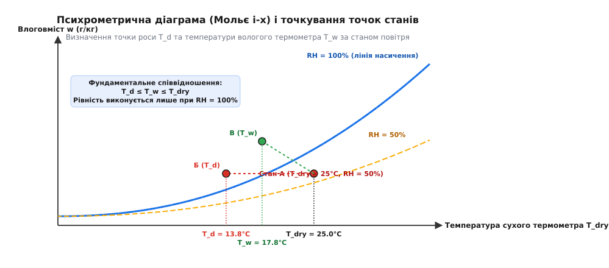
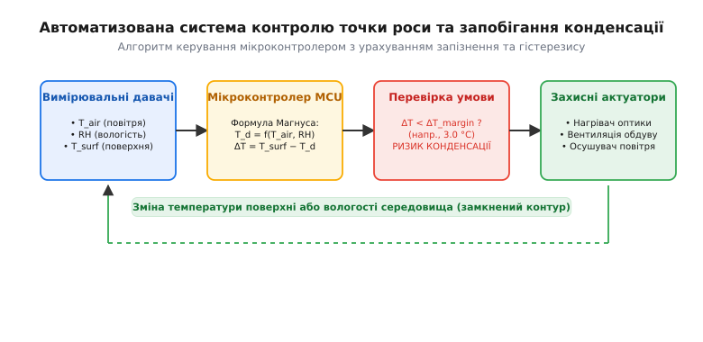

# Точка роси і конденсація

<preknowlist>
- [Рівняння стану ідеального газу](root:ph-thermodynamics/ideal-gas-law) — зв'язок між тиском, об'ємом та температурою газу.
- [Тиск](root:ph-mechanics/pressure) — визначення скалярного тиску та парціального тиску складників газів.
- [Відносна вологість повітря](root:ph-thermodynamics/relative-humidity) — відношення поточного тиску пари до тиску насичення при даній температурі.
</preknowlist>

Коли на прохолодній поверхні скляної лінзи оптичного прицілу, мідній трубі аварійного теплообмінника або некорпусованій друкованій платі автомобільного контролера раптово осідає туман із мікроскопічних крапель води, прилад миттєво втрачає прозорість, електричний опір ізоляції падає на кілька порядків, а металеві елементи піддаються прискореній електрохімічній корозії. Цей фазовий перехід відбувається не довільно, а в точний термодинамічний момент — коли поверхня охолоджується до температури, за якої парціальний тиск водяної пари дорівнює тиску її насичення.

Ця критична температура називається **точкою роси**. Вона є однією з фундаментальних величин термодинаміки вологого повітря і визначає абсолютну межу між ненасиченим станом пари та початком масового зародкоутворення рідкої фази.

## 1. Фізичний механізм конденсації та термодинамічна суть точки роси

На мікроскопічному рівні атмосферне повітря є багатокомпонентною сумішшю азоту, кисню, аргону, вуглекислого газу та водяної пари. Згідно із законом Дальтона, загальний атмосферний тиск `p_total` дорівнює сумі парціальних тисків усіх складників суміші. Парціальний тиск водяної пари `p_v` визначається числовою концентрацією молекул `H₂O` в одиниці об'єму та їхньою середньою кінетичною енергією теплового руху.

У рідкій фазі молекули води утримуються разом міжмолекулярними водневими зв'язками з енергією зв'язку близько 0.2–0.4 еВ на молекулу (що відповідає молярній теплоті випаровування `L_v ≈ 40.65` кДж/моль при 100 °C або `44.0` кДж/моль при 25 °C). Проте завдяки максвеллівському розподілу молекул за швидкостями завжди існує певна фракція молекул поблизу поверхні рідини, чия кінетична енергія перевищує роботу виходу з рідкої фази. Ці молекули долають потенціальний бар'єр міжмолекулярного притягання і вилітають у навколишній газ. Цей процес називається випаровуванням. Одночасно молекули водяної пари з газу у ході хаотичних теплових зіткнень вдаряються об поверхню рідини і захоплюються нею — відбувається зворотний процес конденсації (від лат. *condensatio* — згущення, ущільнення).

Випливаючи з молекулярно-кінетичної теорії, сумарний масовий потік молекул через міжфазну поверхню описується рівнянням Герца — Кнудсена:

```
J_net = α_c · (p_v - p_sat(T)) / √(2 · π · m · k_B · T)   [рівняння Герца — Кнудсена]
```

де `α_c` — коефіцієнт конденсації (частка молекул, що захоплюються рідиною при зіткненні), `m` — маса молекули води, `k_B` — стала Больцмана, `p_sat(T)` — тиск насиченої пари.

Якщо водяна пара перебуває у замкненому об'ємі над поверхнею рідкої води при сталій температурі `T`, у системі швидко встановлюється стан динамічної термодинамічної рівноваги. Потік молекул `J_evap`, які випаровуються з одиниці площі рідини за одиницю часу, точно врівноважується зворотним потоком конденсації `J_cond`, який пропорційний парціальному тиску пари. Парціальний тиск водяної пари за умов такої фазової рівноваги називається **тиском насиченої пари** `p_sat(T)`.

```
J_evap(T) = J_cond(p_sat)             [умова динамічної фазової рівноваги]
```

Молекулярно-кінетична теорія показує, що потік випаровування стрімко зростає з температурою за експоненційним законом Больцмана:

```
J_evap(T) ~ exp(- E_b / (k_B · T))     [потік випаровування за Больцманом]
```

де `E_b` — енергія зв'язку молекули у рідкій фазі. Через це тиск насиченої пари `p_sat(T)` є строго монотонно зростаючою експоненційною функцією температури. При підвищенні температури повітря від 0 °C до +30 °C тиск насиченої пари зростає майже у сім разів — від 0.611 кПа до 4.24 кПа.

При фазовому переході другого роду (зміна агрегатного стану пара → рідина) відбувається виділення прихованої теплоти фазового переходу `L_v`. Ця теплота вивільняється за рахунок зменшення потенціальної енергії взаємодії молекул при формуванні водневих зв'язків у рідкій фазі. З термодинамічної точки зору конденсація є екзотермічним процесом, що зменшує ентропію системи на величину `ΔS_cond = - L_v / T`. Однак це зменшення ентропії у рідкій фазі з надлишком компенсується зростанням ентропії навколишнього середовища за рахунок передачі вивільненого тепла `L_v`, що повністю відповідає другому закону термодинаміки.

На термодинамічній фазовій P-T діаграмі води крива `p_sat(T)` розмежовує область існування перегрітої ненасиченої пари та область рідкої води. Вона бере початок у потрійній точці води (температура 0.01 °C, тиск 611.65 Па), де у рівновазі співіснують лід, рідка вода та пара, і простягається до критичної точки води (температура 373.94 °C, тиск 22.064 МПа), вище якої зникає будь-яка відмінність між рідкою та газоподібною фазами.

В умовах підвищених тисків у промислових компресорних системах чи хімічних колонних апаратах відхилення водяної пари від моделі ідеального газу описується коефіцієнтом стисливості `Z = p · v / (R · T)` та коефіцієнтом фугітивності `ϕ_v`. Для реальних сумішей тиск насичення коригується фактором збагачення вологого повітря `f(p, T)`, який враховує розчинення газу у рідині та міжмолекулярне притягання між молекулами `H₂O` та `N₂/O₂`.

Відносна вологість повітря `RH` (від англ. *Relative Humidity*) визначає ступінь відносного насичення середовища водяною парою при даній температурі `T`:

```
RH = (p_v / p_sat(T)) · 100%          [визначення відносної вологості]
```

Якщо нерухому масу вологого повітря з початковою температурою `T_0` та парціальним тиском пари `p_v0` охолоджувати при сталому тиску, кількість молекул води у газовому об'ємі залишається незмінною, а отже, парціальний тиск `p_v0` зберігає своє значення. Однак величина гранично можливого тиску насичення `p_sat(T)` експоненційно падає у ході охолодження. На певному температурному порозі `T_d` значення `p_sat(T_d)` знижується до величини поточного парціального тиску `p_v0`:

```
p_sat(T_d) = p_v0                     [умова досягнення точки роси]
```

Ця температура `T_d` і називається **точкою роси**. У точці роси відносна вологість повітря досягає межі 100% (`RH = 100%`). Повітря більше не здатне утримувати наявну кількість вологи у газоподібному стані без порушення термодинамічної рівноваги. Будь-яке подальше найменше вилучення тепла робить пару перенасиченою (`p_v > p_sat`), спричиняючи масову конденсацію — виділення рідких крапель у вигляді роси, туману або інею.


*Фазова P-T діаграма водяної пари. Траєкторія А → Б відповідає ізобарному охолодженню повітря до точки роси T_d на лінії насичення p_sat(T). Траєкторія А → В показує ізотермічне стиснення пари до досягнення стану насичення.*

Термодинамічний перехід ненасиченої пари у стан насичення може здійснюватися двома основними фізичними шляхами:
1. **Ізобарне охолодження (траєкторія А → Б):** Температура суміші падає при сталому парціальному тиску пари `p_v = const`. Це головний природний механізм утворення вечірньої та нічної роси, радіаційного туману над ґрунтом, а також виділення вологи на холодних стінках приладових корпусів, склі вікон та автомобільних фарах.
2. **Ізотермічне стиснення (траєкторія А → В):** Повітря піддається механічному стисненню при сталій температурі `T = const`. Оскільки парціальний тиск водяної пари зростає прямо пропорційно загальному тиску суміші (`p_v = p_total · x_v`, де `x_v` — мольна частка пари), при досягненні значення `p_v = p_sat(T)` розпочинається конденсація. Цей ефект є визначальним чинником у промислових компресорних станціях, де при стисненні повітря виділяються галони рідкого конденсату.

Історичний шлях відкриття законів вологості, від перших механічних гігроскопів Леонардо да Вінчі та знежиреної волосини де Соссюра до закону Дальтона та приладу Даніелла, детально висвітлено у вставці [📜 Історія гігрометрії](root:ph-thermodynamics/dew-point/hist-dew-point.md).

## 2. Фізика зародкоутворення крапель: гомогенна та гетерогенна конденсація

Хоча досягнення точки роси (`RH = 100%`) є необхідною термодинамічною умовою для конденсації, безпосереднє перетворення газоподібної пари на рідку фазу вимагає подолання енергетичного бар'єра зародкоутворення. Утворення нової рідкої фази усередині газового середовища називається нуклеацією (від лат. *nucleus* — ядро).

Зміна вільної енергії Гіббса `ΔG(r)` при формуванні сферичного зародка рідкої води радіуса `r` складається з двох конкуруючих внесків різного знака:
1. **Об'ємний внесок (виграш енергії):** Перехід молекул із ненасиченої або перенасиченої пари у впорядкованішу рідку фазу є термодинамічно вигідним і супроводжується зменшенням вільної енергії, пропорційним об'єму краплі `-(4/3)·π·r³·ΔG_v`. Тут `ΔG_v = (ρ · R · T / M) · ln(p_v / p_sat)` — об'ємна густина зміни вільної енергії, `ρ` — густина води, `M` — молярна маса.
2. **Поверхневий внесок (затрата енергії):** Створення нової міжфазної межі розділу «рідина–газ» вимагає виконання роботи проти сил поверхневого натягу `γ`, що дає додатній внесок, пропорційний площі поверхні краплі `+4·π·r²·γ`.

```
ΔG(r) = - (4/3) · π · r³ · ΔG_v + 4 · π · r² · γ    [вільна енергія зародка]
```

Оскільки об'ємний доданок зростає як куб радіуса `r³`, а поверхневий — як квадрат `r²`, при дуже малих значеннях `r` перемагає поверхнева енергія. Залежність `ΔG(r)` має чіткий максимум при **критичному радіусі зародка** `r_c`.


*Мікроскопічний механізм зародкоутворення крапель. Ліворуч: залежність вільної енергії Гіббса ΔG(r) від радіуса зародка та критичний бар'єр ΔG*. Праворуч: зниження енергетичного бар'єра гетерогенного зародкоутворення на твердій підкладці з кутом змочування θ.*

Щоб знайти критичний радіус `r_c`, продиференціюємо вираз для `ΔG(r)` по `r` і прирівняємо похідну до нуля:

```
d(ΔG) / dr = - 4 · π · r² · ΔG_v + 8 · π · r · γ = 0
4 · π · r · (2 · γ - r · ΔG_v) = 0
r_c = 2 · γ / ΔG_v                                   [критичний радіус]
```

Підставивши вираз для `ΔG_v`, отримуємо класичне рівняння Кельвіна (відоме також як рівняння Томсона):

```
r_c = (2 · γ · V_m) / (R · T · ln S)   [критичний радіус зародка Кельвіна]
```

де `S = p_v / p_sat` — коефіцієнт перенасичення пари, `V_m = M / ρ` — молярний об'єм рідкої води, `γ` — коефіцієнт поверхневого натягу, `R` — універсальна газова стала.

Максимальна висота термодинамічного бар'єра гомогенного зародкоутворення `ΔG* = ΔG(r_c)` становить:

```
ΔG* = (4/3) · π · γ · r_c² = (16 · π · γ³ · V_m²) / (3 · (R · T · ln S)²)  [активаційний бар'єр]
```

З рівняння Кельвіна випливає фундаментальний мікроскопічний висновок: якщо зародкоутворення відбувається у абсолютно чистому повітрі без сторонніх домішок (**гомогенна конденсація**), виникнення мікроскопічних асоціацій із кількох молекул води вимагає гігантського перенасичення. У абсолютно чистому середовищі зародки радіуса менше 1 нм володіють величезним внутрішнім капілярним тиском Лапласа `ΔP = 2γ/r`, через що тиск насиченої пари над їхньою поверхнею `p_r` в рази перевищує `p_sat`. Спонтанна гомогенна конденсація у чистому газі вимагає відносної вологості `RH > 300–400%` (що спостерігається лише у спеціальних лабораторних камерах Вільсона).

У реальних земних умовах конденсація майже завжди протікає за механізмом **гетерогенної конденсації**. Роль готових зародків фазового переходу виконують:
- **Аерозольні частинки (ядра конденсації):** Мікроскопічні пилинки, частинки морської солі, сульфати, продукти згоряння.
- **Тверді підкладки та стінки:** Металеві, скляні або полімерні поверхні конструкцій.

При гетерогенній конденсації крапля формується у вигляді сферичного сегмента на поверхні підкладки з крайовим кутом змочування `θ` (кут Юнга). Механічна рівновага сил поверхневого натягу на лінії трифазного контакту описується рівнянням Юнга — Дюпре:

```
γ_sv = γ_sl + γ_lv · cos θ             [рівняння Юнга — Дюпре]
```

де `γ_sv`, `γ_sl`, `γ_lv` — поверхневі натяги на межах «тверде тіло–пара», «тверде тіло–рідина» та «рідина–пара» відповідно.

Термодинамічний бар'єр утворення зародка при гетерогенній нуклеації знижується у `f(θ)` разів порівняно з гомогенним випадком:

```
ΔG*_het = ΔG*_hom · f(θ)              [бар'єр гетерогенного зародкоутворення]
f(θ) = (2 + cos θ) · (1 - cos θ)² / 4  [фактор Юнга — Дюпре]
```

Для повністю змочуваної гідрофільної поверхні (`θ → 0`) коефіцієнт `f(θ)` прямує до нуля. Це означає, що енергетичний бар'єр утворення рідкої плівки на гідрофільній стінці повністю зникає, і конденсація розпочинається негайно при досягненні точки роси (`RH = 100%`, `S = 1`), без жодного перенасичення.

В атмосферній метеорології виділяють чотири основні режими утворення туману залежно від способу досягнення точки роси:
1. **Радіаційний туман:** Виникає уночі при безхмарному небі завдяки довгохвильовому випромінювальному охолодженню підстильної поверхні землі.
2. **Адвективний туман:** Утворюється при горизонтальному переміщенні (адвекції) теплого вологого повітря над холоднішою поверхнею суходолу чи моря.
3. **Фронтальний туман:** Виникає на межі теплого й холодного атмосферних фронтів при змішуванні двох мас повітря з різною температурою.
4. **Туман випаровування:** Спостерігається восени, коли тепла вода озер чи річок випаровується у холодне повітря, створюючи місцеве перенасичення пари.

Для розчинних гігроскопічних аерозольних частинок (наприклад, кристаликів морської солі `NaCl`) діє теорія Кьолера. Сольове ядро розчиняється у первинній водяній плівці, що за законами розчинів знижує тиск пари над розчином. Це ефект розчинення компенсує капілярне підвищення тиску Кельвіна, завдяки чому в атмосфері конденсація на хмарних ядрах розпочинається вже при відносній вологості `RH = 99.5...100%`.

Детальніший розгляд термодинаміки фазових переходів подано у статтях про [правило фаз Гіббса](root:ph-thermodynamics/gibbs-phase-rule) та [зародкоутворення](root:ph-thermodynamics/nucleation).

## 3. Математичні моделі та термодинамічні формули точки роси

Точний кількісний розрахунок точки роси вимагає надійних математичних моделей для тиску насиченої пари `p_sat(T)`.

### Рівняння Клапейрона — Клаузіуса та напівемпіричні апроксимації

Строге термодинамічне диференціальне рівняння фазової рівноваги Клапейрона — Клаузіуса зв'язує похідну тиску насичення по температурі з прихованою теплотою випаровування `L_v`:

```
dp_sat / dT = L_v / (T · (v_gas - v_liq))  [рівняння Клапейрона — Клаузіуса]
```

Знехтувавши молярним об'ємом рідини `v_liq` порівняно з об'ємом газу `v_gas` та припустивши, що пара описується рівнянням ідеального газу `v_gas = R_v · T / p_sat`, отримуємо:

```
d(ln p_sat) / dT = L_v / (R_v · T²)   [диференціальна форма]
```

Інтегрування цього рівняння привадить до експоненційного закону `ln p_sat ~ -L_v / (R_v · T)`. Задля досягнення високої точності в інженерних розрахунках застосовують напівемпіричну **формулу Магнуса — Тетенса**:

```
p_sat(T) = a · exp( (b · T) / (c + T) ) [формула Магнуса — Тетенса]
```

де `T` — температура повітря у °C, тиск `p_sat` виражено у кілопаскалях (кПа). Для рідкої води Всесвітня метеорологічна організація (WMO) рекомендує наступні значення констант:
- `a = 0.61078` кПа (610.78 Па);
- `b = 17.27`;
- `c = 237.3` °C.

Якщо конденсація відбувається при температурі нижче 0 °C у формі кристалічного інею (точка інею), використовуються сублімаційні коефіцієнти для льоду: `b_ice = 21.875`, `c_ice = 265.5` °C.

При субнульових температурах рідка вода може існувати у метастабільному переохолодженому стані (Supercooled Liquid Water) аж до -40 °C (межа гомогенного заморожування). Тиск насиченої пари над переохолодженою водою `p_sat_water` вищий за тиск насичення над кристалічним льодом `p_sat_ice`. Ця різниця тисків спричиняє важливий метеорологічний ефект Бержерона — Фіндейзена: у змішаних хмарах кристалики льоду швидко зростають за рахунок випаровування переохолоджених крапель води, що призводить до випадання опадів.

Для лабораторних досліджень та аерокосмічного розрахунку висотної авіодинаміки застосовують високоточне рівняння Ардена Бака (Arden Buck, 1996), яке враховує барометричну корекцію `f(p)` для вологого повітря під тиском `p_atm`:

```
p_sat_buck(T) = 0.61121 · exp( (18.678 - T / 234.5) · T / (257.14 + T) )
p_v_real = p_sat_buck(T) · f(p_atm)   [модель Ардена Бака]
```

де `f(p_atm) = 1.0007 + 3.46 · 10⁻⁶ · p_atm` (при тиску `p_atm` у гектопаскалях).

При високих тисках у хімічних реакторах чи глибоких свердловинах реальний газ відхиляється від моделі ідеального газу. У таких умовах замість прямого тиску застосовують фугітивність (летючість) водяної пари `f_v = ϕ_v · p_v`, де `ϕ_v` — коефіцієнт фугітивності, обчислений за рівняннями стану Редліха — Квонга або Пенга — Робінсона.

### Точне аналітичне обернення для обчислення точки роси `T_d`

Для практичних обчислень за відомими температурою повітря `T` та відносною вологістю `RH` парціальний тиск пари становить `p_v = (RH / 100) · p_sat(T)`. Оскільки за означенням точки роси `p_sat(T_d) = p_v`, отримуємо рівняння:

```
a · exp( (b · T_d) / (c + T_d) ) = (RH / 100) · a · exp( (b · T) / (c + T) )
```

Скоротивши константу `a` та логарифмуючи обидві частини, маємо:

```
(b · T_d) / (c + T_d) = (b · T) / (c + T) + ln(RH / 100)
```

Увівши проміжний безрозмірний параметр `α(T, RH)`:

```
α(T, RH) = (b · T) / (c + T) + ln(RH / 100)  [допоміжний параметр α]
```

Отримуємо лінійне алгебраїчне рівняння відносно `T_d`:

```
b · T_d = α · (c + T_d)
b · T_d - α · T_d = c · α
T_d = (c · α(T, RH)) / (b - α(T, RH))        [точна формула точки роси]
```

Ця аналітична формула забезпечує похибку розрахунку точки роси не більше ±0.1 °C у широкому діапазоні температур від -40 °C до +50 °C.

Строге математичне виведення термодинамічних виразів, розгляд рівнянь Ардена Бака та порівняльний аналіз похибок наведено у вставці [🧮 Математичний апарат точки роси](root:ph-thermodynamics/dew-point/math-dew-point.md).

## 4. Психрометрія, вологий термометр та діаграма Мольє

Вимірювання вологості та визначення точки роси в експериментальній фізиці та метеорології здійснюється за допомогою психрометрів або оптичних конденсаційних гігрометрів.

### Фізика вологого термометра та формула Ферреля

Психрометр складається з двох ідентичних термометрів: **сухого** (показує температуру повітря `T_dry`) та **вологого** (`T_wet`), колба якого обгорнута тканинним ґнотом, зануреним у дистильовану воду.

При обдуванні психрометра повітрям вода з ґнота безперервно випаровується. Процес випаровування поглинає приховану теплоту фазового переходу `L_v`, внаслідок чого вологий термометр охолоджується нижче температури довкілля. На поверхні ґнота встановлюється стаціонарний стан тепломасообміну, за якого конвективний приплив тепла з повітря точно компенсує витрату енергії на випаровування:

```
h · (T_dry - T_wet) = k_m · L_v · (q_sat(T_wet) - q_air)  [баланс психрометра]
```

де `h` — коефіцієнт тепловіддачі, `k_m` — коефіцієнт масовіддачі, `q` — питома вологість.

Співвідношення між коефіцієнтами тепловіддачі та масовіддачі описується безрозмірним числом Льюїса `Le = α / D_v`, де `α` — температуропровідність повітря, `D_v` — коефіцієнт дифузії водяної пари. Оскільки для вологого повітря число Льюїса близьке до одиниці (`Le ≈ 0.9...1.0`), у ламінарному примежовому шарі встановлюється аналогія Рейнольдса між переносом тепла та маси.

Завдяки цьому показання вологого термометра з високою точністю описуються психрометричною формулою Ферреля:

```
p_v = p_sat(T_wet) - A · p_atm · (T_dry - T_wet)   [формула Ферреля]
```

де `A` — психрометрична стала (`A ≈ 0.000662 K⁻¹` при примусовій вентиляції зі швидкістю понад 2.5 м/с), `p_atm` — барометричний тиск.

### Психрометрична діаграма (Мольє i-x)

Взаємозв'язок усіх параметрів вологого повітря унаочнює психрометрична діаграма (у європейській науковій школі — діаграма Мольє `i-x` або `h-w`).


*Психрометрична діаграма вологого повітря. Для стану А (T_dry = 25 °C, RH = 50%): горизонтальний перехід до лінії насичення RH = 100% визначає точку роси T_d = 13.8 °C; похилий адіабатний перехід визначає температуру вологого термометра T_w = 17.8 °C.*

На психрометричній діаграмі стан повітря описується точкою у координатах «Температура сухого термометра `T_dry` — Влоговміст `w`». Для будь-якого термодинамічного стану середовища виконується фундаментальне співвідношення між трьома температурами:

```
T_d  ≤  T_wet  ≤  T_dry               [фундаментальна нерівність температур]
```

1. `T_dry` (температура сухого термометра) — фактична кінетична температура повітря.
2. `T_wet` (температура вологого термометра) — межа охолодження випаровуванням у даний потік повітря.
3. `T_d` (температура точки роси) — температура, до якої треба охолодити повітря без зміни влоговмісту для початку конденсації.

Рівність `T_d = T_wet = T_dry` досягається виключно за умов повного насичення повітря вологою (`RH = 100%`).

Польна питома ентальпія вологого повітря `h` (у кДж/кг сухого повітря) обчислюється як сума ентальпій сухого повітря та водяної пари:

```
h = c_pa · T + w · (L_0 + c_pv · T)   [питома ентальпія вологого повітря]
```

де `c_pa = 1.006` кДж/(кг·К) — питома теплоємність сухого повітря, `c_pv = 1.86` кДж/(кг·К) — питома теплоємність водяної пари, `L_0 = 2501` кДж/кг — прихована теплота випаровування при 0 °C, `w` — влоговміст у кг води на кг сухого повітря.

Психрометрична діаграма дає змогу швидко розраховувати процеси змішування повітряних потоків у вентиляційних системах, адіабатне зволоження (охолодження випаровуванням води) та процеси осушення при охолодженні нижче точки роси.

### Прилади для вимірювання точки роси

У сучасній вимірювальній техніці застосовують чотири основні класи інструментів:
1. **Первинні еталонні гігрометри з охолоджуваним дзеркалом (Chilled Mirror Hygrometers):** Дзеркальна поверхня охолоджується напівпровідниковим модулем Пельтьє. Оптична пара з світлодіода та фотодіода реєструє момент виникнення матовості дзеркала при конденсації. Прецизійний платиновий термометр (Pt100) зчитує температуру дзеркала у момент фазового переходу. Ці прилади забезпечують найвищу точність (похибка до ±0.05 °C) і є національними первинними еталонами вологості.
2. **Ємнісні тонкоплівкові давачі (Capacitive Polymer Sensors):** Мікроелектронні елементи, у яких полімерний діелектрик поглинає водяну пару, змінюючи свою діелектричну проникність `ε_r` та ємність конденсатора. Мікроконтролер обчислює точку роси за інтегрованими математичними формулами.
3. **Психрометри з примусовою вентиляцією (аспіраційні психрометри Ассмана):** Надійні інструменти, у яких сталий потік повітря створюється вентиляційним мотором, усуваючи вплив випадкових протягів.
4. **Кварцові мікроваги (Quartz Crystal Microbalance, QCM):** П'єзоелектричний резонатор, вкритий гігроскопічною плівкою. Маса сконденсованої вологи вимірюється за зсувом резонансної частоти кварцового кристала.

## 5. Інженерні застосування, запобігання конденсації та автоматичне керування

Розрахунок і контроль точки роси є критично важливим чинником при проектуванні сучасних технічних систем.

### Основні технічні ризики конденсації

1. **Оптичні прилади та авіоніка:** При зміні температури або висоти польоту лінзи оптичних прицілів, об'єктиви бортових камер та сканери LiDAR охолоджуються нижче точки роси. Затуманення скляних поверхонь (англ. *lens fogging*) робить оптичні прилади повністю непрацездатними.
2. **Мікроелектроніка та друковані плати:** Утворення мікроскопічної водяної плівки на друкованих платах знижує опір міжпровідникової ізоляції на кілька порядків. Це викликає витікання струму, корозію та зростання металевих голок — дендритів (електрохімічна міграція), що призводит до коротких замикань і виходу обладнання з ладу. Особливо вразливими є високошарові плати серверних систем та автомобільних блоків ECU.
3. **Промислові компресори та стиснене повітря:** Стиснення повітря збільшує парціальний тиск водяної пари `p_v` пропорційно ступеню стиснення. Якщо стиснене повітря не осушувати, точка роси під тиском (англ. *Pressure Dew Point*, PDP) досягає +30...+40 °C. При охолодженні у пневмолініях виділяються десятки літрів рідкої води, що спричиняє корозію труб, руйнування пневмоінструменту та гідроудари.
4. **Будівельна фізика:** Якщо точка роси опиняється всередині багатошарової стіни будинку, волога конденсується в товщі утеплителя, погіршуючи його теплоізоляційні властивості та створюючи умови для розвитку плісняви.

### Схема автоматизованої системи запобігання конденсації

Для надійного захисту відповідального обладнання застосовують мікроконтролерні автоматичні системи керування з замкненим контуром.


*Структурна схема автоматизованої системи запобігання конденсації. Давачі вимірюють параметри середовища та поверхні, мікроконтролер обчислює T_d і через логіку гістерезису керує актуаторами нагрівання чи вентиляції.*

Алгоритм функціонування захисної автоматики:
1. **Зчитування параметрів:** Цифровий давач середовища (напр., SHT40 або BME280) вимірює температуру повітря `T_air` та відносну вологість `RH`. Давач поверхні (NTC-термистор чи ІЧ-пірометр) зчитує температуру захищуваного елемента `T_surf`.
2. **Обчислення точки роси:** Мікроконтролер виконує розрахунок `T_d = f(T_air, RH)` за формулою Магнуса.
3. **Розрахунок температурного запасу:** Обчислюється поточна різниця `ΔT = T_surf - T_d`.
4. **Керування з гістерезисом:** Якщо запас `ΔT` зменшується до порогового значення `ΔT_margin_on` (наприклад, 2.0 °C), мікроконтролер вмикає прозорий плівковий нагрівач на склі (покриття з оксиду індію-олова, ITO) або вентилятор обдуву. Вимкнення нагрівача відбувається при досягненні `ΔT >= ΔT_margin_off` (наприклад, 4.0 °C), що виключає драння реле.

Захист корпусів обладнання включає застосування конформних силіконових або акрилових лаків на друкованих платах, використання мембранних осушувачів та заповнення герметичних відсіків сухим азотом. У гідофільних оптичних систем застосовують гідрофобні фторполімерні самоочисні покриття, що збільшують кут змочування `θ > 110°`, перешкоджаючи утворенню суцільної матової водяної плівки.

Для промислового осушення повітря у приміщеннях чи пневматичних мережах застосовують три основні типи осушувальних установок:
- **Рефрижераторні осушувачі:** Охолоджують повітря у фреоновому випарнику нижче точки роси, збирають і зливають конденсат, після чого підігрівають вихідне повітря. Забезпечують точку роси під тиском близько +3 °C.
- **Адсорбційні осушувачі роторного типу:** Повітря продувається крізь обертовий ротор з ніздрюватим силікагелем або цеолітом, який активне поглинає молекули води. Другий гарячий потік повітря регенерує адсорбент. Забезпечують точку роси до -40...-70 °C.
- **Мембранні осушувачі:** Використовують порожнисті полімерні волокна із селективною проникністю для молекул водяної пари.

У випробувальних лабораторних комплексах за вимогами міжнародних стандартів (ISO 9001, IEC 60068-2-30) прилади піддаються випробуванням на циклічну дію вологого тепла (климатичний випробувальний цикл «Continuous Damp Heat»). Перевіряється працездатність пристроїв у кліматичних камерах при температурі +40 °C та відносній вологості 93–95%, де найменший температурний град є критичним джерелом конденсації на внутрішніх платах.

Практичний програмний модуль мовами C, C++ та Python з повним кодом та тестами подано у вставці [⚙️ Програмний модуль обчислення точки роси](root:ph-thermodynamics/dew-point/proj-dew-point-calc.md), а специфікацію API — у вставці [📋 Інтерфейс психометричних розрахунків](root:ph-thermodynamics/dew-point/api-psychrometrics.md).

> 🔧 **Навіщо це.**
> У практичній інженерії кліматичних систем та захисту електроніки точка роси є єдиним об'єктивним критерієм наявності ризику виділення вологи. Помилкова орієнтація лише на відносну вологість `RH` часто призводить до катастрофічних помилок: повітря з `RH = 90%` при 0 °C має точку роси -1.4 °C і є абсолютно безпечним для приладу з температурою +10 °C. Натомість повітря з `RH = 60%` при +35 °C має точку роси +25.8 °C — і прилад, охолоджений до +20 °C (наприклад, подачею холодної води), миттєво вкриється рясним конденсатом. Завжди розраховуйте запаси по температурі поверхні `T_surf - T_d >= 3.0 °C`.
