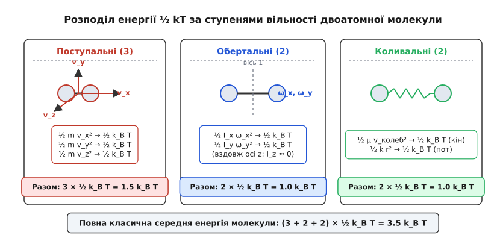
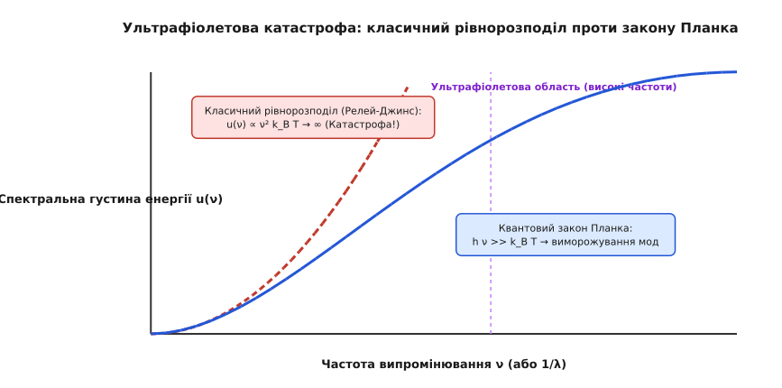
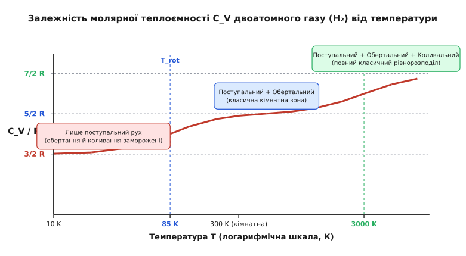

# Теорема рівнорозподілу енергії: чому тепло ділить енергію порівну між ступенями вільності

<preknowlist>
- [Кінетична енергія](topic:ph-mechanics/kinetic-energy) — енергія руху тіла та її залежність від маси й швидкості.
- [Больцманівський фактор](topic:ph-thermodynamics/boltzmann-factor) — ймовірність перебування системи у стані з енергією E при температурі T.
- [Фазовий простір](topic:physics/phase-space) — простір обобщених координат та імпульсів класичної механіки.
- [Гамільтонів формалізм](topic:physics/hamiltonian-mechanics) — канонічні рівняння руху та функція Гамільтона.
</preknowlist>

Коли закрита посудина з двоатомним газом нагрівається, теплова енергія не падає хаотично на випадкові атоми й не вибирає якусь одну улюблену форма руху. Вона самочинно та з математичною прецизійністю розподіляється між усіма можливими каналами механічного руху: поступальним зміщенням молекули у трьох вимірах, її обертанням навколо різних осей та взаємним коливанням атомів уздовж хімічного зв'язку. Дивовижний факт класичної фізики полягає у тому, що на кожен незалежний квадрат змінної в виразі для енергії припадає абсолютно однакова середня енергія, що дорівнює **½ k_B T**. Це фундаментальне твердження називається **теоремою рівнорозподілу енергії** (*theorem of equipartition of energy*, від латинського *aequus* — рівний та *partitio* — ділення).

Вона пояснює, чому молярна теплоємність одноатомного газу дорівнює 1.5 R, чому кристалічна ґратка міді чи заліза за кімнатної температури поглинає 3 R теплоти на кожен моль атомів, і чому у чутливих електричних кола напруга на конденсаторі або струм у котушці шумують із середньою енергією ½ k_B T. Водночас саме суперечність цієї теореми з експериментом наприкінці XIX століття змусила фізиків визнати, що класична механіка нездатна описувати мікросвіт, і відкрила шлях до квантової революції.

---

## Загадка теплового порівну: чому природа не має улюблених рухів

Уявімо тривимірну систему, що складається з мільярдів хаотично рухомих частинок. Кожна частинка неперервно зіштовхується зі своїми сусідами та зі стінками посудини. Під час кожного зіткнення відбувається обмін імпульсом та енергією: швидша частинка може підштовхнути повільнішу, поступальний поштовх може закрутити молекулу навколо її осі, а обертальний удар може розхитати міжміжатомну пружину хімічного зв'язку.

Здавалося б, у такому нескінченному вирі хаотичних ударів розподіл енергії між різними видами руху має бути складним і заплутаним, залежним від маси частинок, їхньої форми чи жорсткості зв'язку. Проте статистична физика дає дивовижно простий результат: у стані теплової рівноваги хаос вирівнює середні енергії всіх незалежних способів руху.

Причина такого безстороннього розподілу ховається у статистичній природі теплового руху. Температура `T` виступає не просто показником «наскільки тіло гаряче», а одиничним мірилом енергетичного масштабу `k_B T`, де `k_B ≈ 1.38×10⁻²³ Дж/К` — стала Больцмана. Оскільки зіткнення між частинками є обратними у часі та підпорядковуються канонічним рівнянням Гамільтона, хаотичні поштовхи перекачують енергію з тих ступенів вільності, де її надлишок, у ті, де її бракує, доки середня енергія на кожну квадратичну змінну не зрівняється з величиною **½ k_B T**.

```
⟨E_i⟩ = ½ k_B T
```

Це означає, що тепловий рух не віддає переваги ні легким електронам, ні важким ядрам, ні поступальному зсуву, ні обертанню: якщо канал руху може накопичувати енергію квадратично, він отримує свою рівну частку ½ k_B T. Завдяки цій рівності мікроскопічна кінетична теорія пов'язує механічний хаос атомарних зіткнень із фундаментальними поняттями абсолютної температури та ентропії. Універсальність цього принципу є однією з найглибших рис класичної статистичної механіки.

---

## Ступені вільності та квадратичні термодинамічні змінні

Щоб строго застосовувати теорему рівнорозподілу, необхідно чітко розрізняти, що саме вважається **ступенем вільності** (*degree of freedom*, DOF) та які з них є **квадратичними**.

У класичній механіці кількість ступенів вільності системи — це мінімальне число незалежних координат `q = (q₁, q₂, ..., q_N)`, необхідне для однозначного фіксування положення всіх її частинок у просторі. Для опису динаміки до кожної координати додається відповідний канонічний імпульс `p = (p₁, p₂, ..., p_N)`. Разом вони утворюють `2N`-вимірний фазовий простір.

Повна механічна енергія системи описується функцією Гамільтона `H(q, p)`. Теорема рівнорозподілу стосується тих змінних фазового простору, які входять у функцію Гамільтона у вигляді **квадратичного додатка**:

```
H_i(x_i) = A · x_i²
```

де `x_i` — це або координата `q_i`, або імпульс `p_i`, а `A` — додатна стала.

Розглянемо, як підраховуються квадратичні ступені вільності для різних типів молекул:

1. **Одноатомний газ (гелій He, аргон Ar):**
   Атом моделюється матеріальною точкою масою `m`. Він має 3 поступальні ступені вільності (координати `x, y, z`). Його гамільтоніан містить 3 квадратичні терми за імпульсами:
   ```
   H = (p_x² + p_y² + p_z²) / (2m)
   ```
   Усі 3 терми є квадратичними імпульсами. Квадратичних координат немає (потенціальна енергія взаємодії між атомами ідеального газу дорівнює нулю). Отже, маємо **3 квадратичні ступені вільності**.

2. **Двоатомна молекула (водень H₂, кисень O₂):**
   Молекула складається з двох атомів масами `m₁` та `m₂`.
   - **Поступальний рух (3 терми):** рух центру мас дає `(p_cx² + p_cy² + p_cz²) / (2M)`, де `M = m₁ + m₂` — 3 квадратичні терми.
   - **Обертальний рух (2 терми):** молекула має дві взаємно перпендикулярні осі обертання, перпендикулярні до лінії хімічного зв'язку. Вздовж самої осі зв'язку момент інерції `I_z` практично дорівнює нулю (маса зосереджена у ядрах зникомого радіуса), тому обертання навколо осі зв'язку не накопичує енергію. Обертальна енергія містить 2 квадратичні терми: `L_x² / (2I) + L_y² / (2I)`.
   - **Коливальний рух (2 терми):** атоми можуть коливатися вздовж лінії зв'язку. Коливання включає як кінетичну енергію відносного руху `p_rel² / (2μ)` (де `μ` — зведена маса), так і потенціальну енергію деформації зв'язку `k (r − r₀)² / 2`. Це дає ще 2 квадратичні терми.


*Розподіл енергії ½ k_B T за ступенями вільності двоатомної молекули. Поступальний рух за трьома осями дає 1.5 k_B T, обертання навколо двох осей дає 1.0 k_B T, а коливання вздовж зв'язку містить як кінетичну, так і потенціальну енергію, даючи ще 1.0 k_B T. Загальна класична середня енергія становить 3.5 k_B T.*

Підсумовуючи, двоатомна молекула у загальному класичному випадку має **7 квадратичних термів** у функції Гамільтона: 3 поступальні + 2 обертальні + 2 коливальні.

3. **Багатоатомні молекули (вуглекислий газ CO₂, вода H₂O, метан CH₄):**
   - **Лінійні багатоатомні молекули (CO₂):** Усі 3 атоми лежать на одній прямій. Молекула має 3 поступальні ступені вільності, 2 обертальні та `3N − 5 = 4` нормальні коливальні моди (симетрична валентна, асиметрична валентна та дві вироджені деформаційні згинальні моди). Оскільки кожна коливальна мода вносить 2 квадратичні терми (кінетичний + потенціальний), загальна кількість квадратичних термів у класичному граничному випадку дорівнює `3 + 2 + 2 × 4 = 13`.
   - **Нелінійні об'ємні молекули (H₂O, CH₄):** Молекула має 3 поступальні ступені, 3 обертальні (навколо трьох головних осей інерції) та `3N − 6` коливальних мод (наприклад, для H₂O: 3 коливальні моди → 6 квадратичних термів). Загальна класична теплоємність пара води без виморожування мод дорівнювала б `C_V = ½ · (3 + 3 + 6) · R = 6 R`.

4. **Макромолекули та полімери (модель Рауса):**
   У фізиці полімерів довгий гнучкий білок або молекула ДНК моделюється ланцюжком із `N` броунівських сегментів (субчастинок), з'єднаних гармонічними пружинами (модель Рауса). Оскільки кожен внутрішній сегмент має 3 поступальні координати та 3 потенціальні пружинні зв'язки, середня конфігураційна енергія теплового розбухання полімерного клубка строго підпорядковується теоремі рівнорозподілу, що дає класичний середній радіус інерції полімеру.

---

## Статистичний механізм: звідки беруться пів-kT

Щоб зрозуміти математичне джерело появи множника **½**, звернемося до канонічного ансамблю Гіббса. Ймовірність того, що система перебуває у фазовому об'ємі `dx = dq dp` навколо стану `x`, пропорційна больцманівському фактору `exp(−H(x) / (k_B T))`.

Якщо функція Гамільтона розділяється на додаток `A x_i²`, що залежить лише від однієї змінної `x_i`, та решту гамільтоніана `H'(x')`, то больцманівський фактор розпадається на добуток двох незалежних множників:

```
exp(−H / (k_B T)) = exp(−A · x_i² / (k_B T)) · exp(−H' / (k_B T))
```

Для обчислення середнього значення енергії цього конкретного ступеня вільності `⟨E_i⟩ = ⟨A x_i²⟩` необхідно обчислити відношення двох інтегралів у фазовому просторі:

```
⟨A · x_i²⟩ = ∫ A · x_i² · exp(−A · x_i² / (k_B T)) dx_i / ∫ exp(−A · x_i² / (k_B T)) dx_i
```

Усі інші інтеграли за рештою фазових координат `x'` у чисельнику та знаменнику абсолютно однакові й повністю скорочуються! Здійснимо заміну змінної у гаусових інтегралах. Позначимо `u = x_i · √(A / (k_B T))`. Тоді `x_i = u · √(k_B T / A)` та `dx_i = du · √(k_B T / A)`:

```
∫ A · x_i² · exp(−A · x_i² / (k_B T)) dx_i
= A · (k_B T / A)^(3/2) · ∫ u² · exp(−u²) du
```

Знаменник перетворюється на стандартний гаусіан:

```
∫ exp(−A · x_i² / (k_B T)) dx_i
= (k_B T / A)^(1/2) · ∫ exp(−u²) du
```

Використовуючи відомі значення табличних гаусових інтегралів `∫ exp(−u²) du = √π` та `∫ u² exp(−u²) du = √π / 2`, підставимо їх у відношення:

```
⟨A · x_i²⟩
= [ A · (k_B T / A)^(3/2) · (√π / 2) ] / [ (k_B T / A)^(1/2) · √π ]
= (A · (k_B T / A) · (1 / 2))
= ½ · k_B T
```

Коефіцієнт `A`, що характеризує жорсткість пружини чи масу частинки, повністю скоротився! Ось де ховається глибинний фізичний зміст теореми: **середня енергія квадратичного ступеня вільності взагалі не залежить від маси чи жорсткості**, а визначається виключно температурою термостата `T`. 

Строге виведення узагальненої форми теореми рівнорозподілу `⟨x_i (∂H / ∂x_j)⟩ = δ_ij k_B T` для довільного фазового простору методом інтегрування частинами наведено у вставці [Математичне виведення теореми рівнорозподілу](topic:ph-thermodynamics/equipartition-theorem/math-equipartition-derivation.md).

---

## Максвелл-больцманівський розподіл за швидкостями

Безпосереднім наслідком застосування теореми рівнорозподілу до поступальних ступенів вільності частинок газу є класичний розподіл Максвелла за швидкостями.

Оскільки кожна з трьох просторових компонент швидкості `v_x, v_y, v_z` входить у кінетичну енергію квадратично `½ m v_i²`, середня квадратична швидкість уздовж однієї осі становить:

```
½ m ⟨v_x²⟩ = ½ k_B T  →  ⟨v_x²⟩ = k_B T / m
```

Оскільки три ові напрямки `X, Y, Z` є абсолютно рівноправними та статистично незалежними, повна середня квадратична швидкість молекули `v = √(v_x² + v_y² + v_z²)` обчислюється шляхом додавання трьох внесків:

```
⟨v²⟩ = ⟨v_x²⟩ + ⟨v_y²⟩ + ⟨v_z²⟩ = (k_B T / m) + (k_B T / m) + (k_B T / m) = 3 · k_B T / m
```

Звідси отримуємо знамениту формулу для середньої квадратичної швидкості теплового руху частинки масою `m`:

```
v_rms = √(⟨v²⟩) = √(3 k_B T / m)
```

Для молекули азоту N₂ (`m ≈ 4.65×10⁻²⁶ кг`) за кімнатної температури `T = 300 K` ця середня квадратична швидкість становить близько **517 м/с** — що перевищує швидкість звуку в повітрі (343 м/с). Для легких молекул водню H₂ середня квадратична швидкість сягає **1930 м/с**, що пояснює, чому водень легко дифундує та вислизає з атмосфери планет (явище дисипації атмосфери).

Найімовірніша швидкість `v_p`, що відповідає максимуму функції розподілу Максвелла, зв'язана з середньою квадратичною співвідношенням `v_p = √(2 k_B T / m)`. Усі ці характеристики є прямим проявом того, що на кожну з трьох осерних компонент руху припадає рівно по `½ k_B T`.

Для практичних розрахунків газової динаміки знання середньоквадратичної швидкості дозволяє оцінювати коефіцієнти теплопровідності та в'язкості газів у межах кінетичної теорії Енскога — Чепмена.

---

## Від газових законів до кристалічної ґратки: де працює теорема

Теорема рівнорозподілу є потужним інструментом для розрахунку термодинамічних властивостей найрізноманітніших фізичних систем.

### 1. Молярна теплоємність газів

Внутрішня теплова енергія `U` одного моля газу (що містить `N_A` молекул, де `N_A ≈ 6.022×10²³ моль⁻¹` — число Авогадро) обчислюється як сума середніх енергій усіх її квадратичних ступенів вільності `f_quad`:

```
U_mol = N_A · f_quad · (½ k_B T) = ½ · f_quad · R · T
```

де `R = N_A · k_B ≈ 8.314 Дж/(моль·К)` — універсальна газова стала.

Молярна теплоємність газу при постійному об'ємі `C_V` за означенням є похідною від внутрішньої енергії за температурою:

```
C_V = dU_mol / dT = ½ · f_quad · R
```

Звідси негайно випливають класичні значення теплоємностей:
- **Одноатомний газ (`f_quad = 3`):**
  ```
  C_V = 1.5 R ≈ 12.47 Дж/(моль·К)
  C_P = C_V + R = 2.5 R
  γ = C_P / C_V = 5 / 3 ≈ 1.67
  ```
- **Двоатомний газ при кімнатній температурі (`f_quad = 5`, коливання заморожені):**
  ```
  C_V = 2.5 R ≈ 20.79 Дж/(моль·К)
  C_P = C_V + R = 3.5 R
  γ = C_P / C_V = 7 / 5 = 1.40
  ```
- **Багатоатомний нелінійний газ (пара води H₂O чи метан CH₄, `f_trans = 3`, `f_rot = 3`):**
  ```
  C_V_class = (3 + 3) / 2 · R = 3.0 R  (без урахування коливань)
  ```

Ці результати лежать в основі розрахунку розширення газів у теплових двигунах та адіабатичних процесів в атмосфері.

### 2. Закон Дюлонга — Пті для твердих тіл

У кристалічній ґратці твердого тіла (наприклад, у кристалі міді, алюмінію чи заліза) кожен з `N` атомів здійснює малі коливання навколо свого положення рівноваги у трьох вимірах.

Кожен напрямок коливань моделюється тривимірним гармонічним осцилятором. Він має 3 квадратичні терми кінетичної енергії `p_i² / (2m)` та 3 квадратичні терми потенціальної енергії `k x_i² / 2`. Разом кожен атом має **6 квадратичних термів**.

Отже, внутрішня енергія одного моля кристала дорівнює:

```
U_mol = N_A · 6 · (½ k_B T) = 3 · R · T
```

Диференціюючи за температурою, отримуємо **закон Дюлонга — Пті**:

```
C_V = 3 · R ≈ 24.94 Дж/(моль·К)
```

Це дивовижне співвідношення показує, що за достатньо високих температур молярна теплоємність практично всіх простих кристалічних речовин однакова і дорівнює близько 25 Дж/(моль·К), незалежно від маси атома.

### 3. Броунівський рух, флуктуації та шум Джонсона — Найквіста

Теорема рівнорозподілу застосовується не лише до окремих атомів, а й до макроскопічних об'єктів та електричних кіл, що перебувають у тепловому контакті з середовищем.

- **Броунівська частинка:**
  Масивна частинка пилу або пилку у воді здійснює хаотичний броунівський рух під ударами молекул рідини. Її середня кінетична енергія поступального руху за кожною віссю строго дорівнює `½ k_B T`:
  ```
  ½ m ⟨v_x²⟩ = ½ k_B T  →  ⟨v_x²⟩ = k_B T / m
  ```
- **Тепловий шум у електричних колах (формула Найквіста):**
  Розглянемо електричний конденсатор ємністю `C`, підключений до резистора з опором `R` при температурі `T`. Напруга на конденсаторі `V` флуктуює через хаотичний теплове тремтіння електронів провідності. Потенціальна енергія електричного поля в конденсаторі є квадратичною функцією напруги `E_cap = ½ C V²`. За теоремою рівнорозподілу:
  ```
  ½ C ⟨V²⟩ = ½ k_B T  →  V_rms = √(⟨V²⟩) = √(k_B T / C)
  ```
  Для котушки індуктивності `L` середня енергія магнітного поля `E_ind = ½ L I²` дає аналогичні флуктуації струму `I_rms = √(k_B T / L)`. Інтегруючи спектральну густину шуму резистора `S_v(f) = 4 k_B T R` по всіх частотах в інтервалі `Δf`, маємо фундаментальну формулу шуму Найквіста:
  ```
  ⟨e_n²⟩ = 4 · k_B · T · R · Δf
  ```

Детальний історичний шлях відкриття теореми та суперечностей із дослідами висвітлено у вставці [Історія теореми рівнорозподілу](topic:ph-thermodynamics/equipartition-theorem/hist-equipartition-history.md).

---

## Рівнорозподіл у астрофізиці та фізиці плазми

У високотемпературній плазмі (наприклад, у надрах зірок, сонячній короні чи акреційних дисках чорних дир) речовина перебуває у повністю іонізованому стані, утворюючи суміш вільних електронів та іонів.

Попри те, що маса протона або ядра гелію у тисячі разів більша за масу електрона (`m_p ≈ 1836 m_e`), за теоремою рівнорозподілу середня кінетична енергія теплового руху електронів та іонів абсолютно однакова:

```
½ m_e ⟨v_e²⟩ = ½ m_i ⟨v_i²⟩ = 1.5 k_B T
```

Звідси випливає фундаментальний астрофізичний висновок: теплова швидкість електронів у плазмі у `√(m_p / m_e) ≈ 43` рази більша за теплову швидкість іонів при тій самій температурі! Це визначає високу електронну електропровідність та електронну теплопровідність плазми, а також швидкі електромагнітні осциляції (плазмові хвилі).

Крім того, у магнітогідродинаміці припускають рівнорозподіл енергії між турбулентним кінетичним рухом плазми та енергією вихрового магнітного поля `B² / (8π) ≈ ½ ρ v²`, що дозволяє оцінювати напруженість магнітних полів у міжзоряному середовищі та туманностях. Цей принцип рівнорозподілу турбулентної та магнітної енергій широко застосовується при симуляціях зореутворення та еволюції галактичних магнітних полів.

---

## Флуктуаційно-дисипативна теорема та фундаментальні межі вимірювань

Теорема рівнорозподілу є окремим рівноважним випадком більш загального принципу статистичної фізики — **флуктуаційно-дисипативної теореми** (*fluctuation-dissipation theorem*, FDT), сформульованої Гербертом Калленом та Тібором Вельтоном у 1951 році.

Суть цього принципу полягає в тому, що будь-яка фізична система, яка дисипує енергію (наприклад, резистор із опором `R`, що виділяє теплоту Джоуля, або в'язке середовище з коефіцієнтом тертя `γ`), неминуче є джерелом спонтанних теплових флуктуацій у стані рівноваги. 

Розглянемо макроскопічний механічний осцилятор — наприклад, мікроскопічну кремнієву консоль (кантилевер) атомно-силового мікроскопа (АФМ) масою `m` та жорсткістю `k`. Навіть у повній темряві та за відсутності зовнішніх сил кантилевер не зупиняється непорушно: хаотичні удари молекул навколишнього газу або внутрішні фононні флуктуації матеріалу розгойдують його. За теоремою рівнорозподілу, середня потенціальна енергія теплового зсуву консолі дорівнює:

```
½ · k · ⟨x²⟩ = ½ · k_B · T  →  x_rms = √(⟨x²⟩) = √(k_B T / k)
```

Для типового кантилевера АФМ із жорсткістю `k = 0.1 Н/м` за кімнатної температури `T = 300 K`:

```
x_rms = √(1.38×10⁻²³ × 300 / 0.1) ≈ 0.203 нм = 2.03 Å
```

Це теплове тремтіння амплітудою близько 2 ангстремів визначає фундаментальну межу роздільної здатності АФМ при вимірюванні сил міжмолекулярної взаємодії. Щоб зменшити цей шум і виміряти менші сили, експериментатори змушені або охолоджувати систему до гелієвих температур (зменшуючи `T`), або застосовувати більш жорсткі консолі (збільшуючи `k`).

---

## Ультрафіолетова катастрофа та межі класичної фізики

Наприкінці XIX століття спроба застосувати теорему рівнорозподілу до електромагнітного поля виявила глибоку кризу класичної фізики.

Якщо розглянути замкнену порожнину з дзеркальними стінками при температурі `T`, електромагнітне поле всередині можна розкласти на суму стоячих хвиль (мод випромінювання). Кожна мода з частотою `ν` математично еквівалентна гармонічному осцилятору, який має 2 квадратичні ступені вільності (електричне та магнітне поле). За теоремою рівнорозподілу, на кожну моду випромінювання має припадати середня енергія:

```
⟨E_mode⟩ = 2 · (½ k_B T) = k_B T
```

Підрахунок кількості стоячих хвиль в інтервалі частот від `ν` до `ν + dν` у порожнині об'ємом `V` дає `N(ν) dν = (8 π ν² / c³) V dν`. Помноживши кількість мод на середню енергію однієї моди `k_B T`, лорд Релей та сер Джеймс Джинс отримали закон спектральної густини випромінювання чорного тіла:

```
u(ν) dν = (8 π ν² / c³) · k_B T dν
```


*Ультрафіолетова катастрофа. Класична формула Релея — Джинса (червона пунктирна крива) передбачає необмежене зростання спектральної густини випромінювання пропорційно ν², що дає нескінченну повну енергію. Квантовий закон Планка (синя крива) узгоджується з експериментом завдяки виморожуванню високочастотних мод при h ν >> k_B T.*

Оскільки частота `ν` може бути як завгодно великою, інтегрування густини випромінювання `u(ν)` по всьому спектру від `0` до `∞` дає нескінченність:

```
U_total = ∫₀^∞ (8 π ν² / c³) k_B T dν = ∞
```

Цей результат означав, що будь-яке нагріте тіло має миттєво випромінити всю свою внутрішню енергію у високочастотному ультрафіолетовому та гамма-діапазоні. Отриманий парадокс дістав назву **ультрафіолетової катастрофи** (*ultraviolet catastrophe*). Вона показала, що класична теорема рівнорозподілу принципово не працює для систем з нескінченним числом ступенів вільності.

---

## Квантове виморожування: як природа рятує рівнорозподіл

Вихід із парадокса ультрафіолетової катастрофи та пояснення аномалій теплоємностей газів і твердих тіл дала квантова механіка.

У квантовій фізиці енергія осцилятора частотою `ω` не може змінюватися безперервно — вона квантується дискретними порціями (квантами) `ΔE = ℏ ω`, де `ℏ = h / (2π)` — зведена стала Планка.

Якщо характерна квантова порція енергії `ℏ ω` значно більша за доступний тепловий масштаб `k_B T` (`ℏ ω >> k_B T`), імовірність того, що випадковий тепловий поштовх зможе збудити систему на перший збуджений рівень, спадає за больцманівським фактором `exp(−ℏ ω / (k_B T)) << 1`.

У такому разі ступінь вільності не приймає теплової енергії й залишається в основному стані. Це явище називається **квантовим виморожуванням ступенів вільності** (*quantum freezing of degrees of freedom*).

Середня енергія квантового осцилятора описується формулою Планка:

```
⟨E_quantum⟩ = (ℏ ω / 2) + [ ℏ ω / (exp(ℏ ω / (k_B T)) − 1) ]
```

Зауважимо, що перший додаток `ℏ ω / 2` являє собою нульову енергію осцилятора (*zero-point energy*). Оскільки ця нульова енергія не залежить від температури `T`, її похідна за температурою дорівнює нулю (`d(ℏω/2)/dT = 0`), тому нульові коливання вакууму принципово не роблять внеску у теплоємність речовини.

Розглянемо дві граничні області формули Планка:

1. **Високі температури (`k_B T >> ℏ ω`):**
   Розкладаючи експоненту у ряд Тейлора `exp(x) ≈ 1 + x`, маємо:
   ```
   ⟨E_quantum⟩ ≈ ℏ ω / (1 + ℏ ω / (k_B T) − 1) = k_B T
   ```
   Квантова формула тотожно переходить у класичну теорему рівнорозподілу!

2. **Низькі температури (`k_B T << ℏ ω`):**
   Експонента у знаменнику стає величезною, і середня енергія збудження стрімко прямує до нуля:
   ```
   ⟨E_quantum⟩ ≈ ℏ ω · exp(−ℏ ω / (k_B T)) → 0
   ```
   Ступінь вільності повністю «виморожується» і більше не робить внеску у теплоємність.


*Залежність молярної теплоємності C_V двоатомного газу від температури. При T < 85 K обертальні та коливальні ступені вільності виморожені, і C_V = 1.5 R. При кімнатній температурі збуджуються обертання (C_V = 2.5 R). Лише при T > 1000 K розморожуються коливання, виводячи теплоємність на класичний рівень 3.5 R.*

Саме квантовим виморожуванням пояснюється ступенчаста залежність теплоємності двоатомного водню `H₂`:
- При `T < 85 K`: теплова енергія `k_B T` менша за квант обертання `ℏ² / (2I)`. Обертання й коливання заморожені, активні лише 3 поступальні ступені (`C_V = 1.5 R`).
- При `85 K < T < 1000 K`: розморожуються 2 обертальні ступені вільності (`C_V = 2.5 R`). Це класична «кімнатна» область.
- При `T > 1000 K`: теплова енергія долає квант коливань `ℏ ω_vib`, розморожуючи коливальний рух (`C_V = 3.5 R`).

### Квантові моделі твердих тіл: Ейнштейн та Дебай

Для твердих тіл квантова теорія також розв'язала суперечність із законом Дюлонга — Пті при низьких температурах:
- **Модель Ейнштейна (1907):** Всі атоми вважаються незалежними осциляторами з однаковою характеристичною частотою `ω_E`. Молярна теплоємність дається формулою `C_V = 3 R · (Θ_E / T)² · exp(Θ_E / T) / [exp(Θ_E / T) − 1]²`. При `T → 0` теплоємність спадає за експоненціальним законом, що якісно пояснило експерименти.
- **Модель Дебая (1912):** Ураховує колективні акустичні фонони зі спектром частот від `0` до граничної частоти Дебая `ω_D`. При кріогенних температурах (`T << Θ_D`) модель Дебая дає точний закон кубу температури `C_V = (12 π⁴ / 5) · R · (T / Θ_D)³`, що ідеально збігається з дослідами для усіх неметалевих кристалів.

Для обчислення термодинамічних параметрів газів із урахуванням температури розморожування створено бібліотечний інтерфейс, описаний у вставці [Інтерфейс обчислення термодинамічних властивостей за рівнорозподілом](topic:ph-thermodynamics/equipartition-theorem/api-equipartition-calc.md).

---

## Чисельне моделювання та релятивістські узагальнення

### Чисельна перевірка у молекулярній динаміці

У класичних обчислювальних експериментах методом молекулярної динаміки теорема рівнорозподілу виконує роль головного індикатора досягнення термодинамічної рівноваги та коректності часового інтегрування.

Якщо початковий стан системи задано штучно (наприклад, уся енергія вкладена лише у поступальний рух, а обертання й коливання зупинені), то в ході чисельного інтегрування рівнянь руху за допомогою симплектичних алгоритмів (таких як Velocity Verlet) взаємодія між атомами перерозподіляє енергію. Через час релаксації `τ_rel` середні енергії за різними компонентами вирівнюються, підтверджуючи теорему рівнорозподілу.

Алгоритм та готові реалізації моделювання молекулярної динаміки для перевірки рівнорозподілу мовами C, C++ та Python наведено у вставці [Моделювання рівнорозподілу енергії у молекулярній динаміці](topic:ph-thermodynamics/equipartition-theorem/proj-equipartition-sim.md).

### Межі застосування теореми

Теорема рівнорозподілу має чітко окреслені межі застосовності:

1. **Неквадратичні потенціали:**
   Якщо потенціальна енергія залежить від координати не квадратично, а, наприклад, як `U(q) = A |q|^n`, то середня енергія ступеня вільності дорівнює:
   ```
   ⟨U⟩ = (1 / n) · k_B T
   ```
   Зокрема, для прямокутної потенціальної ями з нескінченно жорсткими стінками (`n → ∞`) потенціальна енергія всередині дорівнює 0, і внесок координати у теплоємність зникає.

2. **Релятивістський газ:**
   Для ультрарелятивістських частинок (наприклад, високотемпературного електронного газу або фотонів), енергія яких лінійно залежить від модуля імпульсу `E = c |p|`, кожна просторова координата дає внесок **k_B T** замість `½ k_B T`. Отже, середня кінетична енергія ультрарелятивістського одноатомного газу дорівнює `⟨E⟩ = 3 k_B T`, а молярна теплоємність `C_V = 3 R`.

3. **Квантовий режим та низькі температури:**
   При `k_B T ≤ ℏ ω` класична теорема втрачає силу через квантове виморожування мод.

---

## Практичне значення: навіщо це інженеру та физику

> 🔧 **Навіщо це.** 
> Теорема рівнорозподілу енергії — це головний міст між мікроскопічним світом атомних зіткнень та макроскопічними вимірюваними величинами (температурою, теплоємністю, флуктуаціями).
> 
> 1. **Інженерія чутливих датчиків та МЕМС:** У мікроелектромеханічних системах (акселерометрах, гіроскопах, атомно-силових мікроскопах) рухома кремнієва консоль масою `m` із жорсткістю `k` здійснює теплове тремтіння з амплітудою `⟨x²⟩ = k_B T / k`. Це визначає фундаментальний поріг чутливості приладу, який неможливо обійти без охолодження.
> 2. **Обчислення теплового шуму (Найквіста — Джонсона):** Вхідні каскади малошумних підсилювачів та радіоприймачів обмежуються шумом опору `e_n² = 4 k_B T R Δf`, джерелом якого є саме рівнорозподіл енергії між вільними електронами провідника.
> 3. **Перевірка симуляцій молекулярної динаміки:** Під час розрахунку білків, полімерів чи наноматеріалів рівномірність розподілу `½ k_B T` за всіма градусами вільності є головним тестом того, що симуляція не має чисельних артефактів («катастрофи гарячої води» чи збоїв інтегрування).

Отже, теорема рівнорозподілу енергії показує глибинну симетрію природи: у класичній термодинамічній рівновазі тепловий хаос є абсолютно безстороннім суддею, який виділяє кожному квадратичному каналу руху рівну порцію енергії **½ k_B T**. А там, де ця симетрія ламається, починаються квантові закони будови матерії. У сучасній квантовій статистиці теорема виступає точним класичним лімітом. Вона лишається фундаментальним орієнтиром теоретичної фізики.
