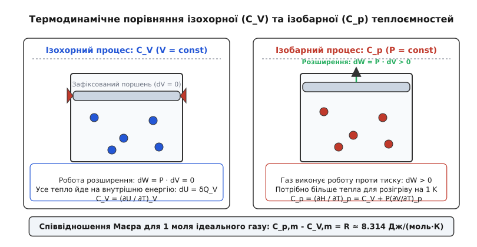

# Теплоємність: квантові канавки енергії, термодинамічні потенціали та теплова інерція матерії

<preknowlist>
- [Температура та термодинамічна рівновага](root:ph-thermodynamics/temperature-and-thermal-equilibrium) — визначення температури як міри середньої кінетичної енергії.
- [Перше начало термодинаміки](root:ph-thermodynamics/first-law-thermodynamics) — баланс внутрішньої енергії, теплоти та роботи.
- [Теорема рівнорозподілу енергії](root:ph-thermodynamics/equipartition-theorem) — розподіл енергії ½ k_B T по квадратичних ступенях вільності.
- [Квантовий гармонічний осцилятор](root:ph-quantum/quantum-harmonic-oscillator) — дискретні рівні енергії коливань атомів.
</preknowlist>

Щоб підняти температуру 1 кілограма рідкої води на 1 кельвін, необхідно передати їй 4184 джоулі теплової енергії, тоді як для нагрівання 1 кілограма мідного бруска на той самий 1 кельвін потрібно лише 385 джоулів — понад ніж у 10 разів менше. Ця велетенська відмінність у термодинамічній інерції формує глобальний клімат Землі (океани виступають гігантськими планетарними тепловими буферами) і водночас робить металевий посуд здатним миттєво обпікати руки при контакті з вогнем. **Теплоємність** (*heat capacity*, від латинського *calor* — тепло та *capacitas* — місткість) — це фундаментальна макроскопічна термодинамічна величина `C = lim (ΔQ / ΔT)`, яка визначає кількість теплоти, яку необхідно надати фізичній системі для підвищення її температури на один градус.

На мікроскопічному рівні теплоємність є чутливим індикатором того, як саме енергія розподіляється між внутрішніми ступенями вільності речовини — поступальним рухом атомів, обертанням молекул, коливанням кристалічної ґратки та хаотичним тремтінням електронів провідності. Саме дослідження аномалій теплоємності наприкінці XIX та початку XX століть змусило фізиків визнати обмеженість класичної механіки та поклало початок квантовій революції.

---

## Термодинамічний механізм: чому ізобарна теплоємність завжди більша за ізохорну

З точки зору термодинаміки кількість теплоти `δQ`, отримана системою, не є функцією стану, оскільки вона залежить від шляху та умов проведення фізичного процесу. Тому значення теплоємності однозначно визначається тим, які саме макроскопічні параметри (об'єм чи тиск) підтримуються сталими під час нагрівання.

Розглянемо дві основні умови нагрівання речовини:

1. **Ізохорна теплоємність (`C_V`):** Нагрівання відбувається при строго фіксованому об'ємі системи (`V = const`, `dV = 0`). Згідно з першим началом термодинаміки `δQ = dU + dW`, де `dU` — зміна внутрішньої енергії, а `dW = P · dV` — механічна робота розширення. Оскільки об'єм не змінюється, робота розширення дорівнює нулю (`dW = 0`). Усе підведене тепло повністю витрачається на збільшення внутрішньої енергії речовини:
   ```
   C_V = (∂U / ∂T)_V
   ```
   Ізохорна теплоємність вимірює безпосередню швидкість зростання внутрішньої енергії системи при підвищенні температури.

2. **Ізобарна теплоємність (`C_p`):** Нагрівання відбувається при сталому зовнішньому тиску (`P = const`, `dP = 0`). Під час нагрівання речовина розширюється (`dV > 0`) і виконує додатну механічну роботу проти зовнішнього тиску `dW = P · dV`. Отже, щоб нагріти тіло на той самий 1 кельвін при сталому тиску, потрібно надати йому додаткове тепло для виконання цієї роботи розширення. Використовуючи термодинамічний потенціал ентальпії `H = U + P · V`, ізобарна теплоємність виражається як часткова похідна ентальпії:
   ```
   C_p = (∂H / ∂T)_p
   ```


*Термодинамічне порівняння ізохорного та ізобарного процесів нагрівання газу. При сталому об'ємі все тепло Q_V йде на підвищення внутрішньої енергії dU, тоді як при сталому тиску газ виконує роботу розширення dW = P dV, що вимагає більшої кількості теплоти Q_p для досягнення тієї самої температури.*

Зв'язок між теплоємностями та дужими другі похідні термодинамічних потенціалів встановлюється через вільну енергію Гельмгольца `F = U - T · S` та вільну енергію Гіббса `G = H - T · S`. Використовуючи співвідношення Максвелла та вираз для диференціала ентропії `dS = (C_V / T) dT + (∂P / ∂T)_V dV`, можна виразити теплоємності через від'ємні другі похідні потенціалів по температурі:

```
C_V = - T · (∂²F / ∂T²)_V,     C_p = - T · (∂²G / ∂T²)_p
```

Загальне точне термодинамічне співвідношення між `C_p` та `C_V` для будь-якої однорідної речовини виводиться з математичних властивостей повного диференціала внутрішньої енергії `U(T, V)` та рівняння стану `P(T, V)`:

```
C_p - C_V = T · (∂P / ∂T)_V · (∂V / ∂T)_p
```

Застосовуючи математичні тотожності якобіанів, цей вираз переписують через стандартні коефіцієнти речовини — ізобарний коефіцієнт об'ємного розширення `α = (1 / V) · (∂V / ∂T)_p` та ізотермічний коефіцієнт стискалості `κ_T = - (1 / V) · (∂V / ∂P)_T`:

```
C_p - C_V = (T · V · α²) / κ_T
```

Оскільки термодинамічна стійкість речовини вимагає додатності стискалості (`κ_T > 0`), а абсолютна температура `T > 0` та об'єм `V > 0`, то квадрат коефіцієнта розширення `α² ≥ 0` гарантує строго виконання нерівності `C_p ≥ C_V`.

Для одного моля ідеального газу рівняння стану Менделєєва — Клапейрона `P · V_m = R · T` дає `(∂V_m / ∂T)_p = R / P` та `(∂P / ∂T)_V = R / V_m`. Підстановка цих похідних приводить до класичного **співвідношення Маєра** (*Mayer's relation*, сформульованого німецьким лікарем та фізиком Юліусом Робертом фон Маєром у 1842 році):

```
C_p,m - C_V,m = R ≈ 8.314 Дж / (моль · К)
```

Для реальних газів, описаних рівнянням Ван дер Ваальса `(P + a / V_m²) · (V_m - b) = R · T`, міжмолекулярні сили притягання (поправка `a`) вимагають додаткових витрат енергії на подолання внутрішнього тиску при розширенні, що приводить до модифікованого співвідношення Маєра:

```
C_p,m - C_V,m ≈ R · [ 1 + (2 a) / (R · T · V_m) ]
```

У флуктуаційній термодинаміці та статистичній фізиці ізохорна теплоємність безпосередньо пов'язана з дисперсією (флуктуаціями) внутрішньої енергії канонічного ансамблю Гіббса:

```
⟨ (ΔU)² ⟩ = ⟨ U² ⟩ - ⟨ U ⟩² = k_B · T² · C_V
```

Це фундаментальне співвідношення свідчить, що теплоємність є мірою теплової сприйнятливості системи: чим більша теплоємність тіла, тим сильнішими є мікроскопічні флуктуації його внутрішньої енергії при фіксованій температурі.

При розгляді адіабатного процесу (`δQ = 0`), де зміна об'єму супроводжується зміною температури `dT = - (T · α / (ρ · c_p)) · dP`, саме показник адіабати `γ = C_p / C_V` визначає швидкість звуку в середовищі `v_s = √(γ · P / ρ)` та ступінь стискання газу у двигунах внутрішнього згоряння.

У самогравітуючих астрофізичних системах (зоряних скупченнях та чорних дірах) теорема віріалу `2 K + U_pot = 0` дає повну енергію `E = K + U_pot = -K`. Оскільки температура пропорційна кінетичній енергії `T ∝ K`, віддача енергії зорею збільшує її кінетичну енергію, що описується **негативною теплоємністю** (`C < 0`). У звичайних термодинамічних системах негативна теплоємність заборонена другою засадою термодинаміки, але в гравітуючих об'єктах вона викликає гравітермальну катастрофу та стискання ядер зір.

---

## Молекулярно-кінетичний механізм та квантове виморожування мод

Класична статистична механіка описує тепловий рух речовини на основі **теореми рівнорозподілу енергії**: у стані теплової рівноваги на кожен незалежний квадратичний ступінь вільності у функції Гамільтона припадає середня кінетична енергія `½ k_B T`, де `k_B ≈ 1.38×10⁻²³ Дж/К` — стала Больцмана.

1. **Одноатомні ідеальні гази (гелій He, аргон Ar):**
   Атом масою `m` рухається у тривимірному просторі і має 3 поступальні ступені вільності (кінетична енергія `(p_x² + p_y² + p_z²) / (2m)`). Молярна внутрішня енергія дорівнює `U_m = 3 · (½ R T) = 1.5 R T`. Диференціювання дає сталу молярну теплоємність:
   ```
   C_V,m = 1.5 R ≈ 12.47 Дж / (моль · К),     C_p,m = 2.5 R ≈ 20.79 Дж / (моль · К)
   ```

2. **Двоатомні гази (водень H₂, азот N₂, кисень O₂):**
   Жорстка двоатомна молекула крім 3 поступальних ступенів має 2 обертальні ступені вільності (навколо двох осей, перпендикулярних до осі зв'язку). Класична теорія передбачає:
   ```
   C_V,m = (3 + 2) · ½ R = 2.5 R ≈ 20.79 Дж / (моль · К)
   ```
   Якщо врахувати пружинні коливання атомів вздовж лінії зв'язку (які додають 1 квадратичний терм кінетичної та 1 терм потенціальної енергії), то класична молярна теплоємність мала б дорівнювати `3.5 R`.


*Температурна залежність молярної теплоємності C_V двоатомного газу (H₂). Послідовне квантове розморожування ступенів вільності формує трьохетапну сходинкову криву: від 1.5 R при кріогенних температурах до 2.5 R при кімнатних умовах та 3.5 R при високотемпературному збудженні міжатомного зв'язку.*

Проте експерименти з охолодженням двоатомного газу водню `H₂` нижче кімнатної температури виявили глибоку суперечність із класичною фізикою. При зниженні температури нижче 100 К молярна теплоємність `C_V` починала плавно спадати від `2.5 R` до `1.5 R`, перетворюючись при температурі нижче 50 К на теплоємність одноатомного газу. Обертальний рух молекули повністю зникав.

Пояснення цьому аномальному явищу надав квантово-механічний механізм **виморожування ступенів вільності** (*freezing of degrees of freedom*). Енергетичний спектр обертального руху молекули є дискретним і квантується за формулою:

```
E_J = J(J + 1) · (ℏ² / (2 I)) = J(J + 1) · k_B T_rot
```

де `J = 0, 1, 2, ...` — обертальне квантове число, `I` — момент інерції молекули, а `T_rot = ℏ² / (2 I k_B)` — характеристична **обертальна температура**.

Якщо середня кінетична енергія теплових зіткнень є набагато меншою за відстань між першим збудженим та основним обертальним рівнем (`k_B T << k_B T_rot`), то хаотичні поштовхи сусідніх молекул просто не мають достатньо енергії, щоб перекинути молекулу зі стану `J = 0` у стан `J = 1`. Ймовірність збудження Больцмана `exp(-2 T_rot / T)` прямує до нуля, і обертальний канал поглинання тепла вимикається («заморожується»).

Для гомоядерних двоатомних молекул із однаковими ядрами (таких як водень `H₂`) додатково виникає квантовий ефект спінової ізомерії ядер:
- **Пара-водень (para-H₂):** Ядерні спіни двох протонів антипаралельні (загальний ядерний спін `I_n = 0`, синглетний стан). Правила симетрії хвильової функції вимагають лише парних обертальних чисел `J = 0, 2, 4, ...`.
- **Орто-водень (ortho-H₂):** Ядерні спіни паралельні (`I_n = 1`, триплетний стан). Дозволені лише непарні обертальні числа `J = 1, 3, 5, ...`.

Оскільки засадничий стан орто-водню відповідає `J = 1` з мінімальною обертальною енергією `E_1 = 2 k_B T_rot`, орто-водень при кріогенних температурах не може повністю віддати свою обертальну енергію без спінової конверсії, що створює характерну аномалію теплоємності рідкого водню.

Аналогічно, для коливального руху відстань між дискретними квантовими рівнями дорівнює `ΔE = ℏ ω_vib = k_B T_vib`, де `T_vib` — **коливальна температура** (для `H₂` `T_vib ≈ 6100 К`, для `N₂` `T_vib ≈ 3370 К`). Оскільки при кімнатній температурі (`T ≈ 300 К`) `T << T_vib`, коливальний рух більшості двоатомних газів є повністю замороженим, і молекули поводяться як жорсткі гантелі з 5 ступенями вільності.

Для багатоатомних нелінійних молекул із `N` атомами існує `3N - 6` нормальних коливальних мод (і `3N - 5` для лінійних молекул). Наприклад, молекула вуглекислого газу CO₂ (`N = 3`, лінійна) має `3(3) - 5 = 4` нормальні коливальні моди:
1. Симетрична валентна мода (`ν_1`, `T_vib,1 = 1980 К`).
2. Дві вироджені деформаційні згинальні моди (`ν_2`, `T_vib,2 = 960 К`).
3. Асиметрична валентна мода (`ν_3`, `T_vib,3 = 3380 К`).

Оскільки деформаційні моди мають малу характеристичну температуру 960 К, вони частково розморожуються вже при кімнатній температурі 300 К, що робить теплоємність CO₂ помітно вищою за значення жорсткої ротаційної моделі (`C_V,m ≈ 3.47 R`).

Детальний перебіг наукових суперечок, досліди Джозефа Блека, відкриття закону Дюлонга — Пті та квантовий прорив Альберта Ейнштейна 1907 року викладено у вставці [📜 Від теплороду та закону Дюлонга — Пті до квантових революцій Ейнштейна й Дебая](root:ph-thermodynamics/heat-capacity/hist-heat-capacity.md).

---

## Теплоємність твердих тіл: Дюлонг — Пті, Ейнштейн та Дебай

У твердому тілі атоми здійснюють малі коливання навколо фіксованих вузлів кристалічної ґратки.

1. **Класичний закон Дюлонга — Пті (1819 рік):**
   У класичному наближенні ґратка з `N` атомів моделюється як сукупність `3N` незалежних тривимірних гармонічних осциляторів. Оскільки кожен осцилятор володіє 1 кінетичним та 1 потенціальним квадратичним термом у виразі для енергії, середня енергія атома дорівнює `3 k_B T`. Для одного моля речовини (`N = N_A`) внутрішня енергія становить `U_m = 3 R T`, що дає сталу молярну теплоємність:
   ```
   C_V,m = 3 R ≈ 24.94 Дж / (моль · К)
   ```
   Цей закон добре справджується для більшості важких металів при кімнатній температурі. Проте при зниженні температури теплоємність усіх кристалів падає до нуля, а для алмазу `C_V,m` становить всього `6.1 Дж/(моль·К)` навіть при 300 К.

2. **Модель Ейнштейна (1907 рік):**
   Альберт Ейнштейн припустив, що всі `3N` осциляторів ґратки коливаються з однаковою квантованою частотою `ω_E`. Застосовуючи статистичну суму квантового осцилятора Планка, Ейнштейн вивів формулу молярної теплоємності:
   ```
   C_V^E = 3 R · (T_E / T)² · exp(T_E / T) / [ exp(T_E / T) - 1 ]²
   ```
   де `T_E = ℏ ω_E / k_B` — **температура Ейнштейна**. При високих температурах (`T >> T_E`) формула прагне до класичної межі `3 R`. При низьких температурах (`T << T_E`) теплоємність спадає за експоненційним законом `C_V^E ∝ exp(-T_E / T)` через квантове виморожування моночастотних осциляторів.

3. **Модель Дебая (1912 рік):**
   Петер Дебай покращив модель Ейнштейна, врахувавши, що атоми в кристалі зв'язані між собою і коливаються колективно, утворюючи спектр акустичних фононів (звукових хвиль) із дисперсією `ω = v · k`. Ввівши параболічну густину станів `g(ω) ∝ ω²` та граничну частоту зрізання `ω_D`, Дебай отримав точний інтегральний вираз.


*Нормована температурна залежність теплоємності твердих тіл C_V / 3R від T / Θ_D. Класичний закон Дюлонга — Пті (червона лінія) дає сталу величину 1.0, модель Ейнштейна (синій пунктир) занадто стрімко падає за експоненційним законом при низьких температурах, тоді як модель Дебая (зелена крива) точна відтворює реальну кубічну залежність C_V ∝ T³ через наявність акустичних фононів.*

У низькотемпературній межі (`T << Θ_D`, де `Θ_D = ℏ ω_D / k_B` — **температура Дебая**) дебаївський інтеграл обчислюється аналітично і приводить до фундаментального **закону куба температури Дебая**:

```
C_V,m^D = (12 π⁴ / 5) · R · (T / Θ_D)³ ≈ 233.8 · R · (T / Θ_D)³
```

Закон куба температури показує, що при наближенні до абсолютного нуля теплоємність диелектричних кристалів спадає не експоненційно, а за степеневим законом `T³`, оскільки довгохвильові акустичні фонони з малими частотами `ω -> 0` залишаються термодинамічно збудженими при як завгодно малих температурах.

Для складних кристалічних ґраток, що містять `s` атомів у елементарній комірці (наприклад, NaCl або високотемпературні купратні надпровідники), фононний спектр містить 3 акустичні гілки та `3s - 3` оптичні гілки. У таких матеріалах застосовується комбінована модель Дебая — Ейнштейна: акустичні фонони описуються дебаївським інтегралом із температурою `Θ_D`, а оптичні фонони з високими та майже плоскими частотами дисперсії — сумою декількох внесків Ейнштейна з відповідними температурами `T_{E,i}`.

Зв'язок між фононною теплоємністю та тепловим розширенням твердого тіла встановлюється через **параметр Грюнайзена** (*Grüneisen parameter* `γ_G`):

```
γ_G = ( V · α · K_T ) / C_V = - d ln(ω) / d ln(V)
```

Параметр Грюнайзена відображає ангармонізм міжатомного потенціалу: якби міжатомні сили були строго гармонічними, то частоти фононів `ω` не змінювалися б при стисканні кристала (`dω / dV = 0`), що давало б нульове теплове розширення (`α = 0`).

Анізотропія розмірності кристалічної ґратки суттєво змінює закон спаду теплоємності при низьких температурах:
- **Двовимірні кристали (два шари, графен, дихалькогеніди):** Густина фононних станів пропорційна першому степеню частоти `g(ω) ∝ ω`, що дає квадратичну залежність теплоємності `C_V ∝ T²`.
- **Одновимірні структури (вуглецеві нанотрубки, полімерні ланцюжки):** Константна густина станів `g(ω) = const` приводить до лінійної залежності теплоємності `C_V ∝ T`.

У неупорядкованих аморфних речовинах та стеклах при наднизьких температурах (`T < 1 К`) спостерігається аномальна лінійна теплоємність `C_V ∝ T`, яка пояснюється моделлю Двохрівневих систем (Two-Level Systems - TLS) Андерсона, Галперіна, Варми та Філліпса: окремі атоми або групи атомів у склі можуть тунелювати між двома близькими мінімумами потенціального рельєфу.

Строге математичне виведення фононної густини станів, обчислення дебаївського інтеграла та розклад у ряд Тейлора наведено у вставці [🧮 Статистична теорія та квантове виведення моделей Ейнштейна й Дебая](root:ph-thermodynamics/heat-capacity/math-debye-model.md).

---

## Електронний вклад у металах та низькотемпературна теплоємність

У металевих провідниках крім фононів кристалічної ґратки присутній газ вільних електронів. Класична теорія Друде передбачала, що електрони мають давати додатковий внесок `1.5 R` у теплоємність, що суперечило дослідам.

Арнольд Зоммерфельд розв'язав цей парадокс, застосувавши квантову статистику Фермі — Дірака для електронів зі спіном `½`. Через принцип заборони Паулі при `T = 0` електрони заповнюють усі енергетичні рівні від 0 до високої енергії Фермі `E_F = k_B T_F` (де `T_F ~ 50 000 К`). При підвищенні температури від 0 до `T` теплове збудження розмиває розподіл Фермі лише у вузькому енергетичному шарі `k_B T` поблизу поверхні Фермі.

Частка електронів, здатних поглинати теплоту, становить всього `T / T_F`, що приводить до **лінійного електронного внеску Зоммерфельда**:

```
C_e = γ · T = (π² / 3) · k_B² · g(E_F) · T
```

де `γ` — **коефіцієнт Зоммерфельда** (*Sommerfeld coefficient*), пропорційний електронній густині станів на рівні Фермі `g(E_F)`.

Отже, повна молярна теплоємність металу при наднизьких температурах (`T < 10 К`) є сумою лінійного електронного та кубічного фононного внесків:

```
C_m(T) = γ · T + A · T³
```

Для експериментального розділення цих двох внесків калориметричні дані будують у координатах `(C_m / T)` від `T²`:

```
C_m(T) / T = γ + A · T²
```

На цьому графіку експериментальні точки лягають на пряму лінію: точка перетину цієї прямої з віссю ординат відтинає значення коефіцієнта Зоммерфельда `γ`, а тангенс кута нахилу прямої дає коефіцієнт `A`, з якого за формулою `Θ_D = (1944 / A)^(1/3)` обчислюється температура Дебая.

Окрім фононної та електронної складових, у твердих тілах при низьких температурах можуть виникати додаткові специфічні внески у теплоємність:

1. **Системи з важкими ферміонами (Heavy Fermion Systems):** У міжметалевих сполуках рідкоземельних елементів (наприклад, `CeCu₆`, `UPt₃`) сильна спіноводіагональна `f-d` гібридизаційна взаємодія створює ефективну масу електронів `m* ~ 1000 m_e`. Це приводить до гігантських значень коефіцієнта Зоммерфельда `γ ~ 1000 мДж/(моль·К²)`.

2. **Надпровідний стан:** При переході металу в надпровідний стан при `T = T_c` утворюється електронна енергетична щілина `Δ`. Нижче `T_c` електронна теплоємність падає не лінійно, а за експоненційним законом `C_es ∝ exp(-Δ / (k_B T))` через експоненційне виморожування одночастинкових куперівських збуджень. Завдяки цій властивості вимірювання електронної теплоємності стало одним із перших експериментальних доказів існування електронної щілини в надпровідниках.

3. **Магнітна теплоємність (магнони):** У впорядкованих магнетиках спінові хвилі (магнони) дають власний температурний внесок. Для феромагнетиків із квадратичним законом дисперсії магнонів теплоємність становить `C_mag ∝ T^(3/2)`, а для антиферомагнетиків із лінійним законом дисперсії — `C_mag ∝ T³`.

4. **Аномалія Шотткі (Schottky anomaly):** Виникає у системах із дискретним двохатомним або багатоатомним виродженим рівнем енергії (наприклад, ядерні спінові рівні в зовнішньому магнітному полі або йони рідкоземельних елементів у кристалічному полі). Аномалія Шотткі має вигляд широкого симетричного піка теплоємності `C_{Sch}(T)` при температурі `T_Sch ≈ ΔE / (2.4 k_B)`.

Програмну реалізацію чисельного моделювання моделей Ейнштейна, Дебая та алгоритму лінійної регресії МНК мовами C та C++ винесено у практичний проект [⚙️ Чисельне моделювання та термодинамічний розрахунок теплоємностей](root:ph-thermodynamics/heat-capacity/proj-heat-capacity-sim.md).

---

## Теплоємність квантових рідин та макроскопічних квантових станів

Особливою категорією фізичних систем є квантові рідини — ізотопи гелію He-4 та He-3, які завдяки малій масі атома та квантовим флуктуаціям залишаються рідкими аж до абсолютного нуля при атмосферному тиску:

1. **Рідкий Гелій-3 (Фермі-рідина Ландау):**
   Атом He-3 має спін `I_n = 1/2` і підкоряється статистиці Фермі — Дірака. При температурах вище 2.5 мК рідкий He-3 описується теорією Фермі-рідини Ландау: теплоємність зростає строго лінійно з температурою `C_V = γ_{He3} · T`, де ефективна маса квазічастинок `m* ≈ 3 m_{He3}` підсилена міжчастинковою взаємодією. При `T_c ≈ 2.49 мК` у рідкому He-3 відбувається триплетне p-хвильове надплинне спарювання (фази He-3-A та He-3-B), що супроводжується стрибком теплоємності `ΔC / C_n ≈ 1.9`.

2. **Бозе-Ейнштейнівський конденсат (БЕК) ультрахолодних атомів:**
   У розріджених газах лужних металів (рубідій-87, натрій-23), охолоджених методом лазерного та випаровувального охолодження до нанокельвінових температур, виникає макроскопічний БЕК-конденсат. Нижче температури конденсації `T_c` теплоємність газу спадає за законом `C_V ∝ T³` через колективні збудження Боголюбова (бозевські квазічастинки).

---

## Фазові переходи, критичні аномалії та калориметрія

При фазових переходах термодинамічні потенціали речовини зазнають математичних особенностей, що безпосередньо відображається на кривих теплоємності:

1. **Фазові переходи першого роду (танення, кипіння, структурна перекристалізація):**
   Супроводжуються стрибкоподібною зміною перших похідних вільної енергії — ентропії `S` та об'єму `V`. Під час фазового переходу підведення теплоти відбувається при абсолютно сталій температурі (`dT = 0`), оскільки усе тепло витрачається на перебудову міжмолекулярних зв'язків. Оскільки `C = δQ / dT`, формально теплоємність у точці переходу першого роду прямує до нескінченності (має дельта-подібний сплеск), а площа під піком дорівнює **прихованій теплоті переходу** `L = T · ΔS`.

2. **Фазові переходи другого роду та критичні явища:**
   Відбуваються безперервно без виділення прихованої теплоти (`L = 0`), але супроводжуються аномаліями або стрибками другої похідної вільної енергії — теплоємності `C_p = - T (∂²F / ∂T²)`.
   Прикладами є перехід металу в надпровідний стан (де теорія БКШ передбачає стрибок `ΔC / C_n = 1.43`), феромагнітний перехід в точці Кюрі та знаменитий **лямбда-перехід** у рідкому гелії-4.


*Температурна залежність ізобарної теплоємності C_p(T) рідкого гелію-4 в околі лямбда-точки T_λ = 2.17 K. Гострий логарифмічний сплеск розділяє область нормальної в'язкої рідини (He-I) та квантового надплинного стану (He-II).*

При температурі `T_λ = 2.172 К` рідкий гелій-4 здійснює фазовий перехід з нормального стану (He-I) у квантовий надплинний стан (He-II). Графік теплоємності `C_p(T)` має гострий асиметричний пік, що формою нагадує грецьку літеру `λ`. Поблизу критичної точки теплоємність розходиться за степеневим або логарифмічним законом `C_p ∝ |T - T_λ|^(-α)`, де `α` — критичний індекс теплоємності.

Сучасна теорія критичних явищ та феноменологічна теорія Ландау описують стрибок ізобарної теплоємності при фазових переходах другого роду через параметр порядку `η`:

```
ΔC_p = T_c · (a² / (2 b))
```

де `a` та `b` — коефіцієнти розкладу вільної енергії Ландау `F(T, η) = F_0 + ½ a (T - T_c) η² + ¼ b η⁴`.

В інженерній практиці та фізичних лабораторних дослідженнях вимірювання теплоємності здійснюється за допомогою трьох основних калориметричних методів:
- **Диференціальна скануюча калориметрія (ДСК, Differential Scanning Calorimetry):** Зразок та еталон нагріваються з однаковою постійною швидкістю `dT/dt`, а вимірювальна система фіксує компенсаційну теплову потужність `ΔP(T)`.
- **Релаксаційна калориметрія (Relaxation Calorimetry):** До зразка малої маси подається короткий імпульс потужності, після чого реєструється експоненційний закон остигання зразка через тепловий місток. Метод дозволяє вимірювати теплоємність мікрограмів речовини при кріогенних температурах до 0.05 К.
- **Модульована калориметрія (Modulated DSC):** На синусоїдальний температурний графік накладаються дрібні коливання, що дозволяє відокремити реверсивну теплоємність від нереверсивних кінетичних процесів релаксації.

---

## Планетарна кліматологія та інженерні застосування теплоємності

Практичне значення теплоємності охоплює масштаби від міжпланетної кліматології до нанорозмірної мікроелектроніки:

1. **Планетарний тепловий буфер Світового океану:**
   Загальна маса рідкої води у Світовому океані Землі становить приблизно `M_ocean ≈ 1.37 × 10²¹ кг`. При питомій теплоємності `c_p ≈ 3993 Дж/(кг·К)` повна теплоємність океанів становить `C_ocean ≈ 5.5 × 10²⁴ Дж/К`. Порівняємо це із теплоємністю усієї земної атмосфери: маса атмосфери `m_atm ≈ 5.15 × 10¹⁸ кг`, а питома теплоємність повітря `c_p ≈ 1005 Дж/(кг·К)`, що дає `C_atm ≈ 5.18 × 10²¹ Дж/К`.
   Повна теплоємність Світового океану в 1060 разів перевищує теплоємність усього атмосферного повітря. Верхній 3-метровий шар океану містить стільки ж теплової енергії, скільки вся атмосфера Землі. Саме ця колосальна теплова інерція пом'якшує сезонні коливання температури на континентах і поглинає понад 90% надлишкової теплоти глобального потепління. Для порівняння, на Марсі через розріджену атмосферу з малою тепловою масою та відсутність рідких океанів добовий перепад температур на екваторі досягає понад 80 градусів.

2. **Теплова масивність у теплотехніці та будівництві:**
   Об'ємна теплоємність матеріалів `C_vol = ρ · c_p` є ключовим параметром при проектуванні енергоефективних будинків. Висока теплова маса бетону (`2024 кДж/(м³·К)`) та цегли дозволяє будівлі поглинати денне сонячне тепло без істотного підвищення внутрішньої температури та повільно віддавати його вночі, знижуючи витрати на кондиціонування повітря.

3. **Захист силової напівпровідникової електроніки від імпульсного пробою:**
   У мікропроцесорах та силових транзисторах (IGBT/MOSFET) при імпульсних сплесках струму тривалістю десятки мікросекунд тепловідвідний радіатор не встигає включитися в роботу через обмежену швидкість теплопровідності. Весь стрибок енергії `Q_pulse` акумулюється у внутрішній теплоємності кремнієвого кристала `C_th = m · c_p`. Розрахунок теплової маси дозволяє точно підбирати масу мідної підкладки для запобігання критичному локальному перегріву `T > 150 °C` та структурному руйнуванню p-n переходів.

Вивчення термодинамічних параметрів матеріалів дозволяє конструювати нові теплоізоляційні покриття для аерокосмічних апаратів, оптимізувати параметри кріогенних охолоджувачів та будувати ефективні сонячні колектори. Глибоке розуміння фізичних механізмів формування теплоємності відкриває нові можливості для створення наноматеріалів із наперед заданими характеристиками, що є критично важливим для термоелектрики та альтернативної енергетики.

Довідкові таблиці питомих та молярних теплоємностей металів, газів, рідин, будівельних матеріалів, поліномів Шомейта та одиниць вимірювання зведені у вставці [📋 Довідник теплоємностей матеріалів, газових констант та термодинамічних параметрів](root:ph-thermodynamics/heat-capacity/api-heat-capacity-table.md).
