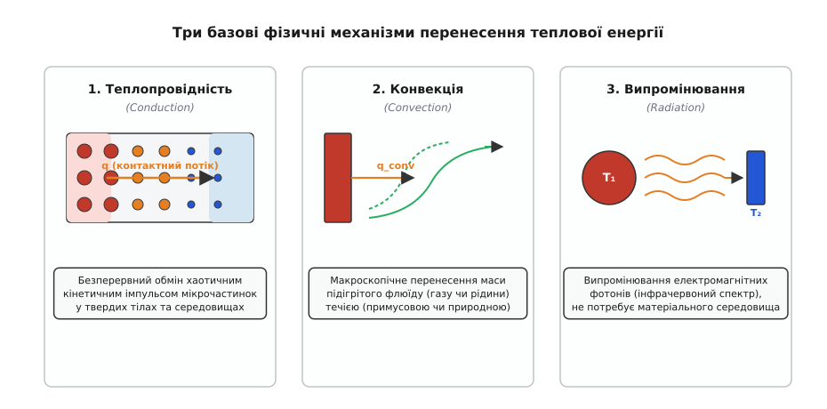
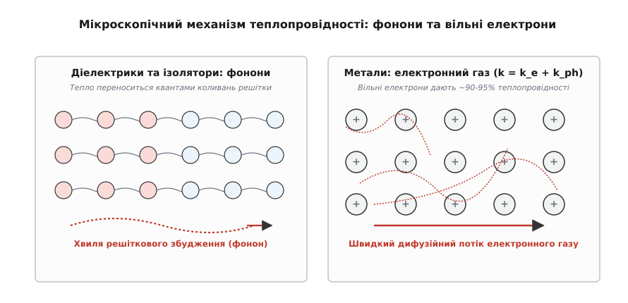
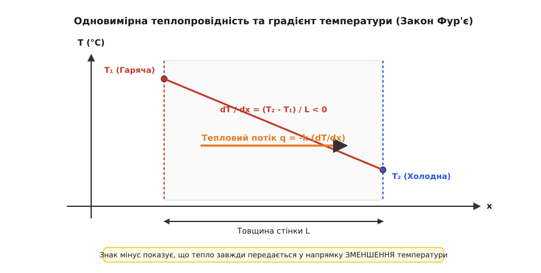
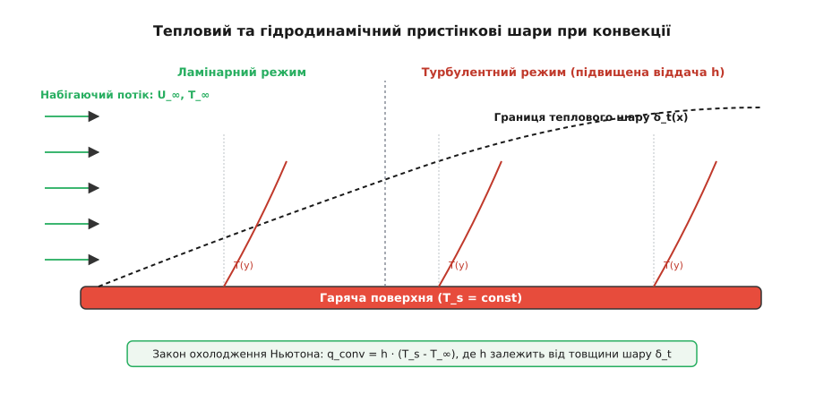
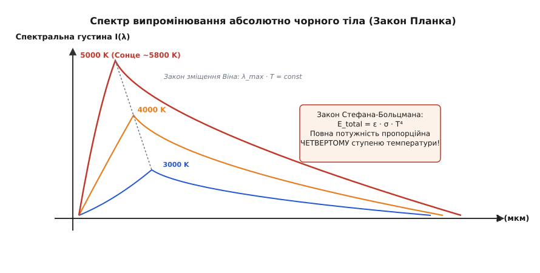
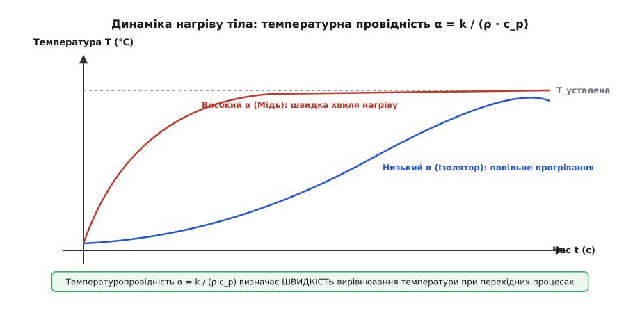

# Теплопередача: як і чому тепло тече від гарячого до холодного

<preknowlist>
- [Тепловий опір і радіатор](topic:ph-thermodynamics/thermal-resistance) — нагрів деталі за заданої потужності, аналогія з електричним опором.
- [Джоулеве нагрівання](topic:ph-electromagnetism/joule-heating) — перетворення електричної потужності в теплове розсіювання у провіднику.
- [Електричний опір](topic:ph-condensed/resistance) — протидія матеріалу проходженням носіїв заряду.
</preknowlist>

Гаряча праска, вимкнена з розетки, неминуче остигає до кімнатної температури, віддаючи енергію довкіллю, але жодна праска у світі ще самочинно не нагрілася, зібравши тепло з навколишнього повітря. Якщо притиснути мідний брусок із температурою 100 °C до такого ж бруска при 0 °C, теплова енергія почне нестримно перетікати від гарячого тіла до холодного, поки обидва не досягнуть рівноважних 50 °C. Цей напрямок руху не є випадковим: він диктується другим законом термодинаміки та прагненням фізичної системи до максимального хаосу (зростання ентропії). Перенесення теплової енергії в просторі під дією просторового градієнта температури називається **теплопередачею** (*heat transfer*).


*Три класичні режими теплопередачі: контактна теплопровідність у твердому тілі, конвекційне перенесення масою макроскопічного флюїду та фотонне випромінювання у вакуумі.*

Розуміння механізмів теплопередачі — це межа між працюючим пристроєм і розплавленим кремнієм. Сучасний процесор виділяє понад 200 ват потужності з кристала площею всього 2 см² — це рекордна густина теплового потоку (~100 Вт/см²), порівняна з поверхнею ядерного реактора. Якщо тепловий шлях від кристала до довкілля розраховано неправильно, деталь згорає за частки секунди. Щоб уміти керувати цим потоком, необхідно розібратися в трьох фундаментальних каналах передачі тепла — теплопровідності, конвекції та випромінюванні.

### 1. Мікроскопічна картина: термодинаміка, статистична фізика та кінетична теорія

На мікроскопічному рівні температура є мірою середньої кінетичної енергії хаотичного руху частинок речовини (атомів, молекул, вільних електронів). У гарячій зоні тіла частинки коливаються й рухаються зі значно більшими середньоквадратичними швидкостями, ніж у холодній зоні.

Коли гаряче й холодне тіло вступають у контакт, частинки на межі починають безперервно зіштовхуватися. Швидкі частинки гарячого тіла під час пружних та непружних зіткнень передають частину свого кінетичного імпульсу повільнішим частинкам холодного тіла. У результаті хаотична кінетична енергія перерозподіляється по всьому доступному об'єму.


*Мікроскопічний механізм теплопровідності: у діелектриках тепло розноситься квантами коливань решітки (фононами), а в металах — швидким дифузійним потоком вільних електронів.*

Статистична фізика дає глибше пояснення цієї односторонньості через кількість мікростанів. Відповідно до формули Больцмана, ентропія системи дорівнює `S = k_B · ln W`, де `W` — кількість мікроскопічних способів, якими можна розподілити наявну енергію між частинками. Однорідний розподіл енергії між усіма частинками відповідає астрономічно величезній кількості можливих мікроскопічних комбінацій (максимальна ентропія). Стан, у якому вся теплова енергія самочинно сконцентрувалася б в одному кутку тіла, теоретично можливий, але його ймовірність настільки мізерна, що у макроскопічному світі вона практично дорівнює нулю. Тепло тече від гарячого до холодного просто тому, що рівномірний розподіл енергії статистично в незліченну кількість разів імовірніший за нерівномірний.

У газах кінетична теорія пояснює теплопровідність через середню довжину вільного пробігу молекул `λ = 1 / (√2 · π · d² · n)`, де `d` — ефективний діаметр молекули, а `n` — числова концентрація частинок. Коефіцієнт теплопровідності газу описується формулою:

```
k = (1/3) · ρ · c_v · v_mean · λ
```
де `v_mean = √(8·k_B·T / (π·m))` — середня швидкість теплового руху молекул масою `m`, а `c_v` — питома теплоємність за постійного об'єму.

Цікавий наслідок цієї формули: за звичайного атмосферного тиску теплопровідність газу майже не залежить від тиску, оскільки при розрідженні газу його густина `ρ` падає, але довжина вільного пробігу `λ` зростає у стільки ж разів. Однак коли тиск падає настільки сильно, що довжина вільного пробігу `λ` стає більшою за характерний геометричний розмір судини `L` (число Кнудсена `Kn = λ / L > 10` — режим вільномолекулярної течії), молекули перестають зіштовхуватися одна з одною і літають від стінки до стінки. У цьому режимі теплопровідність газу стає прямо пропорційною тиску. Саме на цьому принципі працює вакуумна ізоляція (термоси та вакуумні ізоляційні панелі VIP): видалення повітря створює високий вакуум, знижуючи теплопровідність газу практично до нуля.

У твердих тілах перенесення кінетичної енергії відбувається двома основними квазічастинковими носіями:
1. **Фононами** — квантованими хвилями коливань кристалічної решітки. Гарячий кінець решітки інтенсивно занурює сусідні атоми в коливальний рух, поширюючи пружну хвилю вглиб матеріалу. Це єдиний механізм теплопровідності в електричних ізоляторах (алмаз, кераміка, скло, пластик). При високих температурах фонони починають інтенсивно розсіюватися один на одному у трифононних процесах з перекиданням імпульсу (так звані Umklapp-процеси), через що теплопровідність діелектриків із нагріванням падає як `1/T`. За низьких температур фонони розсіюються лише на межах кристала та дефектах решітки, що описується правилом Маттейссена для теплового опору: `1/k = 1/k_electron + 1/k_phonon + 1/k_defect`.
2. **Вільними електронами** — у металах електрони відірвані від своїх атомів і утворюють електронний газ. Отримавши додаткову кінетичну енергію на гарячому кінці, швидкі електрони вільно дифундують крізь решітку зі швидкостями Фермі порядку сотень кілометрів на секунду, миттєво переносячи тепло на холодний кінець.

Оскільки електрони переносять одночасно і електричний заряд, і теплову енергію, між електричною провідністю `σ` та теплопровідністю `k` металів існує прямий зв'язок — **закон Відемана–Франца**:

```
k / (σ · T) = L_W
```
де `L_W` — число Лоренца, фундаментальна константа для всіх металів (`L_W = (π²/3) · (k_B / e)² ≈ 2.44 × 10⁻⁸ Вт·Ом/К²`). Саме тому мідь, срібло та алюміній є чудовими провідниками як струму, так і тепла, тоді як пластмаси й повітря — погані провідники в обох відношеннях.

### 2. Теплопровідність: Закон Фур'є та контактний опір

Теплопровідність (*thermal conduction*) — це перенесення теплової енергії між суміжними частинками речовини за відсутності макроскопічного руху маси. Вона діє у твердих тілах, нерухомих рідинах та газах.

У 1822 році французький математик і фізик Жозеф Фур'є сформулював емпіричний закон: густина теплового потоку `q` [Вт/м²] прямо пропорційна градієнту температури `dT/dx` [К/м].

📜 Детальніше про те, як ця робота створила сучасний математичний аналіз, описано в історичній довідці [як Жозеф Фур'є відкрив математику тепла](topic:ph-thermodynamics/heat-transfer/hist-fourier.md).


*Одновимірна теплопровідність крізь стінку товщиною L. Тепловий потік спрямований у бік спадання температури, що задається знаком мінус у законі Фур'є.*

Математично закон Фур'є в одновимірному випадку записується так:

```
q = - k · (dT / dx)
```

де:
- `q` — густина теплового потоку [Вт/м²] (потужність, що проходить через одиницю площі `A`);
- `k` — коефіціент теплопровідності матеріалу [Вт/(м·К)];
- `dT / dx` — просторова похідна (градієнт) температури вздовж осі `x`;
- Знак мінус показує, що вектор потоку тепла спрямований протилежно до градієнта — у бік **зменшення** температури.

Повна теплова потужність `P` [Вт], що проходить крізь плоску стінку площею `A` і товщиною `L` за постійних температур на межах `T_1` та `T_2`, обчислюється шляхом інтегрування закону Фур'є:

```
P = q · A
P = - k · A · (T_2 - T_1) / L
P = k · A · (T_1 - T_2) / L            [зміна знаку різниці температур]
```

Перегрупувавши цей вираз, ми дістаємо знайому формулу для [теплового опору](topic:ph-thermodynamics/thermal-resistance) стінки `R_th` [°C/Вт]:

```
P = (T_1 - T_2) / R_th
R_th = L / (k · A)
```

Звідси видно геометрію ідеального тепловідводу: щоб зменшити тепловий опір `R_th`, шар матеріалу мусить бути якомога **тоншим** (`L → 0`), площа контакта — якомога **ширшою** (`A → ∞`), а матеріал — володіти максимальним коефіцієнтом теплопровідності `k`.

#### Контактний тепловий опір (Thermal Contact Resistance)
На практиці при з'єднанні двох металевих деталей (наприклад, корпуса транзистора та алюмінієвого радіатора) поверхні торкаються лише у виступаючих точках шорсткості (мікроконтакти асперитетів). Решта площі (до 90–98%) заповнена мікроскопічними повітряними кишенями.

Оскільки повітря має мізерну теплопровідність (`k ≈ 0.026 Вт/(м·К)`), на стику виникає великий **контактний тепловий опір** `R_contact`. На цій межі виникає температурний стрибок `ΔT_contact = P · R_contact`. Лінії теплового потоку в металі змушені звужуватися до вузьких точок фактичного контакту (ефект констрікції), що створює додатковий опір звуження (*constriction resistance*).

Щоб ліквідувати повітряні кишені, використовують термоінтерфейсні матеріали (TIM — Thermal Interface Materials):
- **Термопасти** (силіконові або синтетичні оливи з наповнювачем із оксиду алюмінію, нітриду бору або мікрочастинок срібла): `k ≈ 1.5 – 8.5 Вт/(м·К)`. Вони виганяють повітря, заповнюючи мікропори;
- **Фазозмінні матеріали (PCM)**: тверді при кімнатній температурі, але плавляться при 45–55 °C, заповнюючи всі зазори під тиском;
- **Рідкий метал** (евтектичні сплави галію, індію та олова, наприклад Gallinstan): `k ≈ 20 – 40 Вт/(м·К)`. Надає мінімальний опір, але є електропровідним і агресивним до алюмінію.

Збільшення сили механічного притискання деталей гвинтами чи пружинними кліпсами деформує мікровиступи поверхні, збільшуючи фактичну площу контакту металу з металом і додатково знижуючи `R_contact`.

#### Діапазон коефіцієнтів теплопровідності `k`
Матеріали навколо нас різняться за теплопровідністю більш ніж у 100 000 разів:
- **Алмаз**: `k ≈ 2000 Вт/(м·К)` — абсолютний чемпіон завдяки жорсткій легкій решітці вуглецю;
- **Графен**: `k ≈ 3000 – 5000 Вт/(м·К)` — двовимірний вуглецевий матеріал із надвисокою температуропровідністю;
- **Мідь**: `k ≈ 390 Вт/(м·К)` — стандартний матеріал для підошов радіаторів та теплових трубок;
- **Алюміній**: `k ≈ 205 Вт/(м·К)` — легкий і дешевий матеріал для фрезерованих і екструдованих ребер;
- **Кремній**: `k ≈ 140 Вт/(м·К)` — напівпровідниковий кристал;
- **Сталь**: `k ≈ 15 – 50 Вт/(м·К)` — конструкційний матеріал із помірною теплопровідністю;
- **Скло, бетон, цегла**: `k ≈ 0.8 – 1.3 Вт/(м·К)` — будівничі матеріали;
- **Вода**: `k ≈ 0.6 Вт/(м·К)` — слабкий провідник тепла у нерухомому стані;
- **Дерево, пластик (FR-4)**: `k ≈ 0.15 – 0.3 Вт/(м·К)` — теплові ізолятори;
- **Нерухоме повітря**: `k ≈ 0.026 Вт/(м·К)` — чудовий ізолятор, якщо зупинити його конвекційний рух;
- **Аерогель**: `k ≈ 0.013 Вт/(м·К)` — рекордний твердий ізолятор, що затримує повітря у нанопорах.

🧮 Повний математичний виведення диференціального рівняння теплопровідності у 3D просторі `∂T/∂t = α ∇²T` та аналіз граничних умов Діріхле, Неймана і Робіна наведено у вставці [виведення рівняння теплопровідності](topic:ph-thermodynamics/heat-transfer/math-heat-equation.md).

### 3. Конвекція: Гідродинамічний та тепловий пристінкові шари

Конвекція (*convection*) — це процес теплообміну між твердою поверхнею та рухомим флюїдом (газом або рідиною), який поєднує в собі контактну теплопровідність та макроскопічне перенесення маси речовини.

Коли повітря або вода торкаються гарячої поверхні, безпосередньо прилеглий молекулярний шар липне до стінки (умова прилипання в гідродинаміці) і нагрівається шляхом чистої теплопровідності. Передавши це тепло пристінковому шару, флюїд починає рухатися і зносить підігріті маси геть, поступаючись місцем новим холодним порціям.


*Формування теплового пристінкового шару товщиною δ_t під час обтікання гарячої пластини. У ламінарному режимі шар товстіший і опір вищий, у турбулентному — змивається, підвищуючи коефіцієнт h.*

Існує два режими конвекції:
1. **Природна (вільна) конвекція**: виникає самочинно під дією сили тяжіння. Нагрітий біля стінки флюїд розширюється, його густина падає, і за законом Архімеда він спливає вгору. На його місце знизу підтікає важкий холодний флюїд. Це класична робота кімнатного радіатора опалення або пасивного радіатора процесора. При проектуванні ребристих радіаторів природної конвекції існує оптимальна відстань між ребрами `s_opt ≈ 2.71 · (g·β·ΔT / (ν·α))^(-1/4) · L^(1/4)`: якщо ребра розташовані занадто близько, їхні пристінкові шари перекриваються і блокують підйомний потік; якщо занадто далеко — втрачається корисна площа поверхні.
2. **Примусова конвекція**: потік флюїду женеться зовнішнім механічним приводом — вентилятором, насосом або набігаючим вітром. Швидкість потоку при цьому в рази вища, а тепловий пристінковий шар змивається і стоншується, що різко прискорює відведення тепла.

Тепловий потік при конвекції описується **законом охолодження Ньютона (Ньютона–Ріхмана)**:

```
q_conv = h · (T_s - T_∞)
```

де:
- `q_conv` — густина конвективного теплового потоку [Вт/м²];
- `h` — коефіцієнт конвективної тепловіддачі [Вт/(м²·К)];
- `T_s` — температура поверхні твердого тіла [°C];
- `T_∞` — температура набігаючого потоку флюїду вдалині від поверхні [°C].

На відміну від теплопровідності `k`, коефіцієнт тепловіддачі `h` **не є фізичною константою матеріалу**. Він визначається товщиною теплового пристінкового шару `δ_t`: `h ≈ k_fluid / δ_t`.

#### Безрозмірні критерії гідродинаміки та теплообміну
Для розрахунку коефіцієнта тепловіддачі `h` в інженерії використовують безрозмірні критерії подібності:
- **Число Прандтля (`Pr = ν / α`)**: співвідношення між в'язкісною та тепловою дифузією у флюїді, де `ν` — кінематична в'язкість. Для повітря `Pr ≈ 0.7`, для води `Pr ≈ 2 – 7`, для моторних олив `Pr > 1000`, а для рідких металів (ртуть, натрій) `Pr << 0.01`. Товщина гідродинамічного шару `δ` та теплового `δ_t` пов'язані як `δ_t ≈ δ / Pr^(1/3)`.
- **Число Нуссельта (`Nu = h · L / k_fluid`)**: безрозмірний коефіцієнт тепловіддачі, що показує, у скільки разів конвективний теплообмін ефективніший за чисту теплопровідність нерухомого шару флюїду товщиною `L`.
- **Число Рейнольдса (`Re = u · L / ν`)**: визначає режим течії при примусовій конвекції (ламінарний чи турбулентний). При `Re > 5 × 10⁵` на плоскій пластині течія стає турбулентною, пристінковий шар інтенсивно перемішується і коефіцієнт `h` стрибком зростає в рази.
- **Число Ґрасгофа (`Gr = g · β · ΔT · L³ / ν²`) та Рейлея (`Ra = Gr · Pr`)**: визначають виникнення турбулентності при природній конвекції під дією підйомної сили Архімеда (`β` — коефіцієнт об'ємного розширення). Критичне значення переходу до турбулентності для вертикальної пластини становить `Ra_cr ≈ 10⁹`.

#### Методи інтенсифікації конвективного теплообміну
Для збільшення відведення тепла інженери застосовують кілька класичних прийомів:
- **Оребрення поверхні**: збільшення площі `A` у 10–50 разів за допомогою тонких алюмінієвих або мідних ребер, пінів чи мікроканалів;
- **Турбулізація потоку**: використання шорсткості, виступів або генераторів вихорів (*vortex generators*) для руйнування ламінарного пристінкового шару;
- **Струминне охолодження (Impinging Jets)**: спрямування високошвидкісного струменя рідини або газу перпендикулярно до гарячої поверхні, що знижує товщину пристінкового шару до мікронів у точці гальмування;
- **Занурювальне рідинне охолодження (Immersion Cooling)**: повне занурення плат серверів або Майнерів у диелектричну рідину (флуорорганічні суміші Novec або спеціальні синтетичні оливи), що знімає сотні кіловатної потужності без вентиляторів.

#### Типові значення коефіцієнта тепловіддачі `h`:
- **Природна конвекція у повітрі**: `h = 2 – 25 Вт/(м²·К)` (повільний рух повітря зі швидкістю < 0.5 м/с);
- **Примусова конвекція у повітрі**: `h = 25 – 250 Вт/(м²·К)` (обдув вентилятором зі швидкістю 2–10 м/с);
- **Природна конвекція у воді**: `h = 100 – 1000 Вт/(м²·К)`;
- **Примусова конвекція у воді (водяне охолодження)**: `h = 1000 – 15 000 Вт/(м²·К)`;
- **Кипіння води або конденсація пари (двофазний режим)**: `h = 2500 – 100 000 Вт/(м²·К)`.

Зі зіставлення цих чисел видно, чому примусове рідинне охолодження (СРО) або двофазні системи набагато ефективніші за повітряні: заміна повітря на воду з вентилятором піднімає коефіцієнт `h` майже на два порядки.

🔌 Про будову двофазних систем охолодження та ліміти dry-out читайте у вставці про [загальний клас теплообмінників та теплових трубок](topic:ph-thermodynamics/heat-transfer/comp-heat-exchanger.md).

### 4. Випромінювання: Закон Стефана-Больцмана та углові коефіцієнти

Теплове випромінювання (*thermal radiation*) — це перенесення енергії за допомогою електромагнітних хвиль (фотонів), що випромінюються атомно-молекулярними структурами речовини за рахунок її внутрішньої теплової енергії.

Випромінювання володіє трьома фундаментальними відмінностями від теплопровідності та конвекції:
1. Для нього **не потрібна матерія**: воно без перешкод поширюється у абсолютному вакуумі (саме так тепло Сонця долає 150 мільйонів кілометрів порожнечі до Землі);
2. Воно відбувається **завжди і всіма тілами**, температура яких вища за абсолютний нуль (0 К);
3. Його потужність пропорційна **четвертому ступеню** абсолютної температури, тому при високих температурах воно стає головним каналом втрати тепла.


*Спектр випромінювання абсолютно чорного тіла за законом Планка. Зі зростанням температури площа під кривою (повна енергія) зростає пропорційно T⁴, а пік випромінювання зміщується в короткохвильову область (закон Віна).*

Повна спектральна потужність ідеального випромінювача (абсолютно чорного тіла) описується законами Планка та Стефана–Больцмана. Спектральна інтенсивність випромінювання `I(λ, T)` задається формулою Планка:

```
I(λ, T) = (2 · h_P · c² / λ⁵) / [ exp( (h_P · c) / (λ · k_B · T) ) - 1 ]
```
де `h_P` — стала Планка, `c` — швидкість світла, а `k_B` — стала Больцмана.

Інтегрування спектральної густини по всьому діапазону довжин хвиль `λ` від 0 до `∞` дає повну інтегральну густину випромінюваної потужності — **закон Стефана–Больцмана**:

```
E_b = σ · T⁴
```

де:
- `σ` — стала Стефана–Больцмана (`σ = (2·π⁵·k_B⁴) / (15·c²·h_P³) ≈ 5.6704 × 10⁻⁸ Вт/(м²·К⁴)`);
- `T` — термодинамічна температура у **кельвінах** [К] (`T = t_C + 273.15`).

Довжина хвилі `λ_max`, на яку припадає максимуми випромінювання, описується **законом зміщення Віна**: `λ_max · T = 2898 мкм·К`. Для тіла при кімнатній температурі (300 К) пік випромінювання припадає на інфрачервону область `λ_max ≈ 9.6 мкм`. Для Сонця (`T ≈ 5800 К`) пік лежить у видимому зеленому спектрі `λ_max ≈ 0.5 мкм`.

Реальні тіла випромінюють гірше за абсолютно чорне тіло. Для врахування цього вводиться безрозмірний коефіцієнт — **ступінь чорноти (випромінювальна здатність)** `ε` (від 0.0 для ідеального дзеркала до 1.0 для абсолютно чорного тіла). Згідно з законом Кірхгофа для теплового випромінювання, поглинальна здатність тіла на даній довжині хвилі дорівнює його випромінювальні здатності `α(λ) = ε(λ)`.

```
E = ε · σ · T⁴
```

Результуючий теплообмін випромінюванням між малим тілом з температурою `T_1` та поверхнею `S_1` і навколишнім великим середовищем з температурою `T_2` виражається формулою:

```
P_rad = ε · σ · A · ( T_1⁴ - T_2⁴ )
```

Для двох поверхонь довільної орієнтації вводять **кутовий коефіцієнт випромінювання (View Factor)** `F_12` — частку енергії, випромінюваної поверхнею 1, яка потрапляє безпосередньо на поверхню 2. Кутові коефіцієнти задовольняють теорему взаємності `A_1 · F_12 = A_2 · F_21` та теорему замкненості `∑ F_1j = 1`.

Для двох паралельних сірих пластин великої площі результуючий потік враховує багаторазове відбиття між ними:

```
q_12 = σ · ( T_1⁴ - T_2⁴ ) / ( 1/ε_1 + 1/ε_2 - 1 )
```

Якщо між пластинами встановити тонкий відбиваючий **екран (ширму)** з однаковим ступенем чорноти `ε`, потік випромінювання зменшується рівно втричі (у 2 рази для 1 екрана, у `N + 1` разів для `N` екранів). На цьому принципі побудована багатошарова вакуумно-ізоляційна фольга (ЕКІ — екранно-вакуумна теплоізоляція космічних апаратів).

#### Практичне значення ступеня чорноти `ε` в інженерії
- **Анодований алюміній (чорний або кольоровий)**: `ε ≈ 0.85 – 0.90`. Анодування створює пористий оксидний шар, який чудово випромінює в інфрачервоній області (довжина хвилі ~10 мкм при кімнатних температурах).
- **Полірований голий алюміній або мідь**: `ε ≈ 0.04 – 0.08`. Блискучий метал відбиває 95% інфрачервоних хвиль і майже не віддає тепло випромінюванням.
- **Паяльна маска на платі (зелена, чорна)**: `ε ≈ 0.90`.
- **Чорна матова фарба**: `ε ≈ 0.95`.

Ось чому радіатори для пасивного охолодження (без вентилятора) майже завжди роблять **чорними анодованими**: у нерухомому повітрі природна конвекція слабка (`h` мале), і випромінювання забезпечує до 25–30% загального відведення тепла. Якщо ж радіатор обдувається потужним вентилятором, частка випромінювання падає до 1–2%, і колір анодування вже не має значення.

### 5. Динаміка, теплова інерція та перехідні процеси

Досі ми розглядали стаціонарний режим, коли розподіл температури не змінюється в часі (`∂T/∂t = 0`). Проте при вмиканні пристрою, стрибку електричної потужності або зміні навантаження виникає **перехідний (нестаціонарний) тепловий процес**.

Під час нестаціонарного нагріву частина тепла витрачається на підвищення температури самого тіла (акумуляція енергії), а частина транспортується далі. Швидкість цього процесу визначається не лише теплопровідністю `k`, а й об'ємною теплоємністю матеріалу `C_vol = ρ · c_p` [Дж/(м³·К)].


*Порівняння швидкості поширення температурної хвилі в матеріалах із високою температуропровідністю (мідь) та низькою (ізоляційна цегла).*

Відношення здатності проводити тепло до здатності його накопичувати називається **коефіцієнтом температуропровідності (термічною дифузійністю)** `α` [м²/с]:

```
α = k / (ρ · c_p)
```

Фізичний зміст `α` — це швидкість вирівнювання температури всередині матеріалу при нестаціонарних процесах:
- **Мідь**: `α ≈ 1.12 × 10⁻⁴ м²/с` — висока температуропровідність, теплова хвиля пробігає металеву деталь за частки секунди;
- **Алюміній**: `α ≈ 8.4 × 10⁻⁵ м²/с` — також дуже швидке вирівнювання;
- **Вода**: `α ≈ 1.4 × 10⁻⁷ м²/с` — повільне поширення температурного фронту;
- **Цегла / Склотекстоліт**: `α ≈ 3 × 10⁻⁷ м²/с` — висока теплова інерція, деталь повільно прогрівається і повільно остигає.

Характерний час `τ` [с] прогрівання шару матеріалу товщиною `L` оцінюється співвідношенням:

```
τ ≈ L² / α
```

Ця формулювання показує принципову річ: час прогріву залежить від **квадрата товщини**. Якщо збільшити товщину теплової ізоляції у 3 рази, вона триматиме перепад температур у стаціонарному режимі в 3 рази краще, але прогреється до нового стаціонарного стану в `3² = 9` разів довше. Безрозмірний час називається **числом Фур'є (`Fo = α · t / L²`)**.

#### Динамічний імпеданс `Z_th(t)` та еквівалентні RC-ланцюги
У силовій електроніці (наприклад, для IGBT-транзисторів або імпульсних диодів) імпульсне навантаження триває частки мілісекунди. За цей короткий час тепло не встигає дійти до зовнішнього радіатора, і його поглинає теплоємність самого кристала та мідної підкладки корпуса.

Для опису нестаціонарного нагріву використовують **динамічний тепловий імпеданс** `Z_th(t)` [°C/Вт]:

```
Z_th(t) = ( T_junction(t) - T_ambient ) / P_pulse
```

На малих часах (`t < 1 мс`) `Z_th(t)` прямує до нуля, оскільки теплоємність кристала стримує зростання температури. При тривалому впливі (`t > 10 с`) `Z_th(t)` досягає свого стаціонарного значення `R_th`. Для моделювання цього процесу тепловий шлях замінюють еквівалентною RC-схемою Фостера або Кауера, де теплові опори `R_th` поєднуються з тепловими ємностями `C_th = m · c_p`.

⚙️ Готову числову реалізацію розв'язувача нестаціонарного 1D рівняння теплопровідності мовами C та C++ з аналізом умови стійкості Куранта (CFL) дивіться у вставці [чисельне моделювання теплопередачі на сітці](topic:ph-thermodynamics/heat-transfer/proj-heat-simulation.md).

### 6. Число Біо та системні межі розрахунку

Під час аналізу охолодження деталі часто виникає питання: чи можна вважати температуру всередині деталі однаковою в усіх точках (модель із зосередженими параметрами, *lumped capacitance model*), чи необхідно враховувати просторовий градієнт температури від центру до поверхні?

Відповідь дає безрозмірний критерій — **число Біо (`Bi`)**:

```
Bi = R_cond / R_conv
Bi = (L_char / k) / (1 / h)
Bi = (h · L_char) / k
```

де `L_char = V / A` — характерний розмір тіла (відношення об'єму до площі поверхні).

Число Біо порівнює внутрішній опір теплопровідності тіла з зовнішнім опором конвекції на межі:
1. **`Bi < 0.1`**: внутрішній тепловий опір матеріалу мізерно малий порівняно із зовнішнім конвективним опором (`k` дуже велике або деталь дуже тонка). Температура всередині тіла практично миттєво вирівнюється. Усю деталь можна описати **єдиною температурою `T(t)`**, а її остигання описується простою експонентою:

```
T(t) = T_∞ + (T_0 - T_∞) · exp(-t / τ_th)
```
де теплова стала часу `τ_th = (ρ · c_p · V) / (h · A) = R_conv · C_th`.

2. **`Bi > 0.1`**: внутрішній опір теплопровідності матеріалу співмірний із зовнішнім або перевищує його. Центр деталі гарячий, а поверхня вже вистигла. Необхідно розв'язувати повне диференціальне рівняння теплопровідності в частинних похідних.

📋 Огляд структур даних, коефіцієнтів та сигнатур розв'язувачів подано у специфікації [параметрів теплофізичних властивостей та розв'язувача](topic:ph-thermodynamics/heat-transfer/api-thermal-solver.md).

При виборі термоінтерфейсів для масового виробництва інженери враховують не лише `k`, а й механічну стисканість матеріал (Compressibility): надто тверда термопрокладка при затисканні гвинтами може деформувати друковану плату чи сколоти кут тендітного кремнієвого кристала. Оптимальний вибір — фазозмінні матеріали на основі парафінових сумішей із керамічним наповнювачем, які при нагріванні розм'якшуються і розтікаються тонким шаром товщиною до 15–20 мкм під мінімальним тиском.

У сучасних системах штучного інтелекту та електромобілях теплопередача стала визначальним фактором продуктивності. Серверні прискорювачі обчислень споживають понад 1000 ват на кожен чип, що робить повітряне охолодження фізично неможливим і змушує переходити на пряме рідинне охолодження кристала (Direct-to-Chip Liquid Cooling). У тягових акумуляторних батареях електромобілів тисячі літій-іонних осередків упаковано в обмеженому об'ємі. Якщо один осередок перегрівається через внутрішнє коротке замикання, виділене тепло може спричинити ланцюгову реакцію теплового розгону (Thermal Runaway). Для запобігання пожежам між акумуляторними чарунками встановлюють аерогелеві або керамічні теплові бар'єри, які блокують поширення тепла в сусідні блоки, а знизу монтують алюмінієві охолоджувальні плити з внутрішніми мікроканалами для прокачування антифризу.

> 🔧 **Навіщо це.** Рівняння теплопередачі — це не формальні формули з підручника, а робочий інструмент проектування реальних систем. Коли розробник компонує друковану плату, він обирає товщину мідних шарів (`k` міді vs `k` FR-4), розраховує кількість теплових перехідних отворів (*thermal vias*), обирає площу ребер радіатора для забезпечення потрібного коефіцієнта конвекції `h`, підбирає термопасту з мінімальною товщиною `L` і високим `k` та визначає колір анодування для випромінювання `ε`. Усі ці рішення спираються на єдиний ланцюг теплопередачі, де тепло неухильно тече від гарячого кристала до холодного довкілля.
