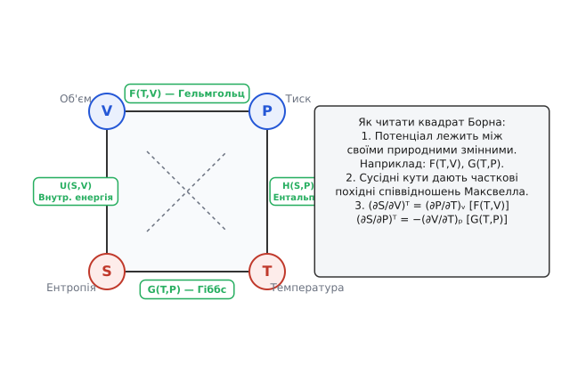
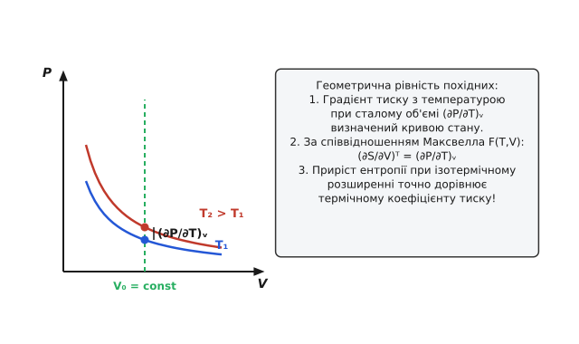
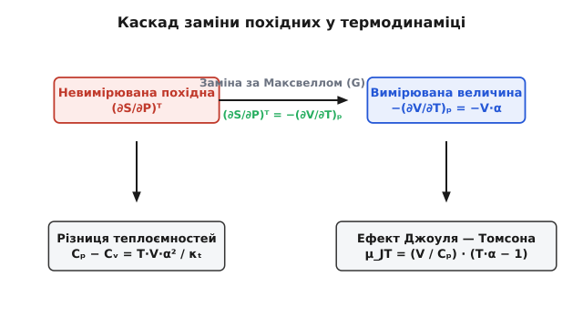

<preknowlist>
- [Перше начало термодинаміки](topic:ph-thermodynamics/first-law-thermodynamics) — збереження енергії, зв'язок між теплотою, внутрішньою енергією та роботою.
- [Ентропія та друге начало термодинаміки](topic:ph-thermodynamics/second-law-thermodynamics) — незворотність процесів та канонічні формулювання ентропії.
- [Термодинамічні потенціали](topic:physics/thermodynamics/thermodynamic-potentials) — фундаментальні функції стану та перетворення Лежандра.
</preknowlist>

# Співвідношення Максвелла в термодинаміці

При вимірюванні термодинамічних параметрів стисненого газу у лабораторії манометр показує тиск `P`, термопара — температуру `T`, а градуйований циліндр — об'єм `V`. Проте жоден фізичний прилад не здатний безпосередньо виміряти ентропію системи `S` або приріст її внутрішньої енергії при ізотермічному розширенні `(∂U/∂V)ₜ`. Співвідношення Максвелла є фундаментальним математичним містком у термодинаміці: вони перетворюють фундаментальні невимірювані калоричні величини (похідні ентропії та внутрішньої енергії) у строгі комбінації безпосередньо вимірюваних термічних параметрів (похідних тиску, об'єму та температури).

### 1. Проблема невимірювальних калоричних величин та точні диференціали

Перше і друге начала термодинаміки для зворотних процесів у закритій системі об'єднуються у фундаментальне термодинамічне рівняння, яке описує диференціал внутрішньої енергії `U`:

```
dU = T dS − P dV
```

У цьому рівнянні температура `T` виступає як інтенсивний термодинамічний потенціал, спряжений з екстенсивною координатою ентропії `S`, а тиск `-P` є потенціалом, спряженим з екстенсивним об'ємом `V`. 

Слід підкреслити фундаментальну відмінність між елементарною теплотою `δQ = T dS` та елементарною роботою `δW = P dV` з одного боку, і внутрішньою енергією `dU` з іншого. Елементарна робота та елементарна теплота **не є точними диференціалами**: їхні інтеграли по замкненому контуру не дорівнюють нулю `∮ δQ ≠ 0`, `∮ δW ≠ 0`, оскільки передана теплота й виконана робота суттєво залежать від конкретного шляху (траєкторії) процесу в площині параметрів. Натомість внутрішня енергія `U` є **функцією стану**, значення якої однозначно визначається поточним мікроскопічним станом системи. Тому її повний диференціал `dU` є точним диференціалом, а приріст у будь-якому замкненому циклі строго дорівнює нулю:

```
∮ dU = 0
```

З аналізу багатьох змінних випливає, що якщо функція `U(S, V)` належить до класу `C²` (має неперервні часткові похідні второго порядку), то за теоремою Шварца про рівність мішаних похідних порядок диференціювання за ентропією та об'ємом не впливає на кінцевий результат:

```
∂²U / (∂V ∂S) = ∂²U / (∂S ∂V)
```

Саме ця чисто математична симетрія гладких скалярних полів на повернях стану створює фундаментальну систему тотожностей, яку Джеймс Клерк Максвелл сформулював у 1871 році.

### 2. Історично-концептуальна ретроспектива

Формулювання співвідношень Максвелла стало поворотним моментом у переході від феноменологічного «напівінтуїтивного» опису теплоти (який оперував невизначеними тепловими флюїдами чи емпіричними таблицями) до строгого математичного формалізму термодинамічних потенціалів.

Максвелл спирався на геометричні ідеї Еміля Клапейрона та Вільяма Томсона (лорда Кельвіна), проте саме він першим усвідомив, що фундаментальні диференціальні форми термодинаміки задовольняють умови точності. Згодом Джозая Віллард Ґіббс узагальнив цей підхід, створивши теорію термодинамічних поверхонь та фазових рівноваг. Історичний шлях відкриття цих співвідношень, роль 3D-гіпсової модели Ґіббса та їхній подальший розвитку Ларсом Онсагером детально висвітлено в [історичному нарисі](topic:ph-thermodynamics/maxwell-relations/hist-maxwell-thermodynamics.md).

### 3. Чотири фундаментальні потенціали та Перетворення Лежандра

Внутрішня енергія `U(S, V)` описує систему у природних змінних ентропії `S` та об'єму `V`. Однак експериментально контролювати ентропію в ізотермічних або ізобарних умовах вкрай важко — значно зручніше оперувати температурою `T` або тиском `P`.

Щоб змінити незалежні змінні без втрати геометричної інформації про поверхню стану, застосовують математичне **перетворення Лежандра**. Перетворення Лежандра замінює вихідну змінну на похідну функції за цією змінною, зберігаючи при цьому повну інформацію про вихідну функцію у формі огинаючої родини дотичних прямих. Строге математичне виведення формалізму Лежандра, якобіанів та Гессіанів наведено у [математичній вставці](topic:ph-thermodynamics/maxwell-relations/math-legendre-transform.md).

Завдяки перетворенню Лежандра з вихідної внутрішньої енергії побудовано чотири класичні термодинамічні потенціали:

#### 1. Внутрішня енергія U(S, V)
Вихідний потенціал системи у природних змінних ентропії `S` та об'єму `V`:
```
dU = T dS − P dV
```
Звідси часткові похідні потенціалу виражають інтенсивні параметри:
```
(∂U / ∂S)ᵥ = T
(∂U / ∂V)ₛ = −P
```

#### 2. Ентальпія H(S, P)
Отримується перетворенням Лежандра внутрішньої енергії за об'ємом `V`: `H = U − (−P)·V = U + P·V`. Природними змінними є ентропія `S` та тиск `P`:
```
dH = T dS + V dP
```
Звідси часткові похідні потенціалу дорівнюють:
```
(∂H / ∂S)ₚ = T
(∂H / ∂P)⛛ = V
```

#### 3. Вільна енергія Гельмгольца F(T, V)
Отримується перетворенням Лежандра внутрішньої енергії за ентропією `S`: `F = U − T·S`. Природними змінними є температура `T` та об'єм `V`:
```
dF = −S dT − P dV
```
Звідси часткові похідні дорівнюють:
```
(∂F / ∂T)ᵥ = −S
(∂F / ∂V)ₜ = −P
```

#### 4. Енергія Гіббса G(T, P)
Отримується подвійним перетворенням Лежандра внутрішньої енергії за обома змінними `S` та `V`: `G = H − T·S = U + P·V − T·S`. Природними змінними є температура `T` та тиск `P`:
```
dG = −S dT + V dP
```
Звідси часткові похідні дорівнюють:
```
(∂G / ∂T)ₚ = −S
(∂G / ∂P)ₜ = V
```

### 4. Строге виведення чотирьох співвідношень Максвелла

Застосовуючи теорему Шварца про рівність мішаних похідних `∂²Z / (∂x ∂y) = ∂²Z / (∂y ∂x)` до кожного з чотирьох фундаментальних потенціалів, отримуємо канонічну систему **чотирьох співвідношень Максвелла**:

#### Перше співвідношення Максвелла (з потенціалу U)
Застосовуємо рівність мішаних похідних `∂²U / (∂V ∂S) = ∂²U / (∂S ∂V)` до диференціала `dU = T dS − P dV`:
```
∂/∂V [ (∂U / ∂S)ᵥ ]ₛ = ∂/∂S [ (∂U / ∂V)ₛ ]ᵥ
```
Підставляючи `(∂U/∂S)ᵥ = T` та `(∂U/∂V)ₛ = −P`, отримуємо **перше співвідношення**:
```
(∂T / ∂V)ₛ = −(∂P / ∂S)ᵥ
```
*Фізичний зміст:* Зміна температури системи при її адіабатичному розширенні за об'ємом із протилежним знаком дорівнює зміні тиску при ізохорному підведенні ентропії (теплоти).

#### Друге співвідношення Максвелла (з потенціалу H)
Застосовуємо рівність мішаних похідних `∂²H / (∂P ∂S) = ∂²H / (∂S ∂P)` до диференціала `dH = T dS + V dP`:
```
∂/∂P [ (∂H / ∂S)ₚ ]⛛ = ∂/∂S [ (∂H / ∂P)⛛ ]ₚ
```
Підставляючи `(∂H/∂S)ₚ = T` та `(∂H/∂P)⛛ = V`, отримуємо **друге співвідношення**:
```
(∂T / ∂P)⛛ = (∂V / ∂S)ₚ
```
*Фізичний зміст:* Температурний коефіцієнт тиску при адіабатичному стисканні дорівнює зміні об'єму при ізобарному підведенні ентропії.

#### Третє співвідношення Максвелла (з потенціалу F)
Застосовуємо рівність мішаних похідних `∂²F / (∂V ∂T) = ∂²F / (∂T ∂V)` до диференціала `dF = −S dT − P dV`:
```
∂/∂V [ (∂F / ∂T)ᵥ ]ₜ = ∂/∂T [ (∂F / ∂V)ₜ ]ᵥ
```
Підставляючи `(∂F/∂T)ᵥ = −S` та `(∂F/∂V)ₜ = −P` і множачи обидві частини на `-1`, отримуємо **третє співвідношення**:
```
(∂S / ∂V)ₜ = (∂P / ∂T)ᵥ
```
*Фізичний зміст:* Невимірювана швидкість зміни ентропії при ізотермічному розширенні об'єму строго дорівнює термічному коефіцієнту тиску при сталому об'ємі. Це співвідношення є найбільш вживаним у фізиці реальних газів.

#### Четверте співвідношення Максвелла (з потенціалу G)
Застосовуємо рівність мішаних похідних `∂²G / (∂P ∂T) = ∂²G / (∂T ∂P)` до диференціала `dG = −S dT + V dP`:
```
∂/∂P [ (∂G / ∂T)ₚ ]ₜ = ∂/∂T [ (∂G / ∂P)ₜ ]ₚ
```
Підставляючи `(∂G/∂T)ₚ = −S` та `(∂G/∂P)ₜ = V`, отримуємо **четверте співвідношення**:
```
(∂S / ∂P)ₜ = −(∂V / ∂T)ₚ
```
*Фізичний зміст:* Зміна ентропії при ізотермічному підвищенні тиску дорівнює об'ємному коефіцієнту температурного розширення речовини, взятому з протилежним знаком.

### 5. Метод Якобіанів та алгебраїчний розрахунок похідних

Окрім прямого диференціювання потенціалів, надзвичайно потужним алгебраїчним інструментом термодинамічного аналізу є **метод Якобіанів** (визначників Якобі).

Для двох довільних функцій `u(x, y)` та `v(x, y)` визначник Якобі визначається як:

```
∂(u, v) / ∂(x, y) = (∂u / ∂x)ᵧ · (∂v / ∂y)ₓ − (∂u / ∂y)ₓ · (∂v / ∂x)ᵧ
```

Головна перевага Якобіанів полягає у тому, що будь-яка термодинамічна часткова похідна виражається у вигляді відношення двох Якобіанів:

```
(∂u / ∂x)ᵧ = ∂(u, y) / ∂(x, y)
```

Завдяки властивості антисиметричності `∂(u, v)/∂(x, y) = −∂(v, u)/∂(x, y)` та ланцюговому правилу `[∂(u, v)/∂(t, w)] · [∂(t, w)/∂(x, y)] = ∂(u, v)/∂(x, y)`, площа канонічної чарунки у площині `(T, S)` дорівнює площі у площині `(P, V)`:

```
∂(T, S) / ∂(P, V) = 1
```

Використовуючи цю фундаментальну інваріантність, виведення співвідношень Максвелла зводиться до одного алгебраїчного рядка. Наприклад, обираючи незалежними змінними `(T, V)`:

```
∂(T, S) / ∂(T, V) = (∂S / ∂V)ₜ
∂(P, V) / ∂(T, V) = (∂P / ∂T)ᵥ
⇒ (∂S / ∂V)ₜ = (∂P / ∂T)ᵥ
```

Метод Якобіанів автоматизує заміну будь-якої складної часткової похідної (наприклад, `(∂H/∂V)ₜ` чи `(∂U/∂P)⛛`) через стандартні вимірювані величини `Cₚ`, `α` та `κₜ`.

### 6. Геометрична інтерпретація та Мнемонічний квадрат Борна

Для легкого запам'ятовування чотирьох співвідношень Максвелла Макс Борн у 1929 році запропонував графічну мнемонічну схему, відому як **квадрат Борна**.


*Мнемонічний квадрат Борна для виведення співвідношень Максвелла.*

На вершинах квадрата розташовані канонічні змінні `V`, `T`, `P`, `S`, а на його гранях — термодинамічні потенціали `F`, `G`, `H`, `U`.

#### Правила побудови співвідношень за квадратом Борна:
1. Обирають дві сусідні вершини на одній стороні квадрата (наприклад, `V` та `T`).
2. Записують часткові похідні за протилежними вершинами (наприклад, `(∂S/∂V)ₜ` та `(∂P/∂T)ᵥ`).
3. Знак `−` з'являється тоді, коли напрямок диференціювання перетинає стрілку, що вказує на від'ємний потенціал (стрілки вказують від `S` до `T` та від `V` до `P`).

Геометричний зміст співвідношень Максвелла полягає у тотожності перехресних кривизн гладкої двовимірної поверхні стану у багатовимірному просторі.


*Геометричний зміст термодинамічної поверхні P-V-T.*

Якщо розглянути термодинамічну поверхню стану `P(V, T)`, то третє співвідношення Максвелла `(∂S/∂V)ₜ = (∂P/∂T)ᵥ` означає, що площа замкненого елементарного циклу на площині `(T, S)` строго дорівнює площі цього самого циклу на площині `(P, V)`. Це гарантує збереження фазового об'єму та інваріантність термодинамічних процесів у відповідних канонічних змінних.

### 7. Калоричні рівняння стану та внутрішній тиск

Найважливішим практичним застосуванням 3-го співвідношення Максвелла `(∂S/∂V)ₜ = (∂P/∂T)ᵥ` є виведення **калоричного рівняння стану**, яке пов'язує внутрішню енергію `U` з тиском, об'ємом та температурою.

Розкладемо диференціал внутрішньої енергії `dU(T, V)` у змінних `(T, V)`:

```
dU = (∂U / ∂T)ᵥ dT + (∂U / ∂V)ₜ dV
```

За визначенням, часткова похідна за температурою при сталому об'ємі є ізохорною теплоємністю: `(∂U/∂T)ᵥ = Cᵥ`. 

Для другої часткової похідної `(∂U/∂V)ₜ` (яка називається **внутрішнім тиском** або калоричним тиском) скористаємося першим началом `dU = T dS − P dV` і розділимо його на `dV` при сталій температурі `T`:

```
(∂U / ∂V)ₜ = T · (∂S / ∂V)ₜ − P
```

Підставляючи 3-тє співвідношення Максвелла `(∂S/∂V)ₜ = (∂P/∂T)ᵥ`, отримуємо остаточну формулу для внутрішнього тиску:

```
(∂U / ∂V)ₜ = T · (∂P / ∂T)ᵥ − P
```

Ця формула дозволяє обчислити внутрішній тиск будь-якої речовини, знаючи лише термічне рівняння стану `P(T, V)`.

#### Аналіз для різних фізичних моделей:

1. **Ідеальний газ (`P·V = R·T`):**
   Обчислимо похідну: `(∂P/∂T)ᵥ = R / V`.
   Підставляємо у калоричне рівняння: `(∂U/∂V)ₜ = T · (R/V) − P = P − P = 0`.
   *Висновок:* У внутрішній енергії ідеального газу відсутні міжмолекулярні сили притягання — вона залежить **виключно від температури** (`U = U(T)`), що строго доводить закон Джоуля.

2. **Газ Ван-дер-Ваальса (`P = R·T / (V − b) − a / V²`):**
   Обчислимо похідну за температурою: `(∂P/∂T)ᵥ = R / (V − b)`.
   Підставляємо у калоричне рівняння:
   `(∂U / ∂V)ₜ = T · [ R / (V − b) ] − [ R·T / (V − b) − a / V² ] = a / V²`
   *Висновок:* Внутрішній тиск реального газу дорівнює `a / V²`. Це прямо підтверджує, що при ізотермічному розширенні реального газу молекули віддаляються одна від одної, подолаючи сили міжмолекулярного притягання `a`, що викликає зростання внутрішньої потенціальної енергії.

3. **Газ Редліха — Квонга (`P = R·T / (V − b) − a / ( √T · V · (V + b) )`):**
   Похідна тиску за температурою містить додатковий температурний член:
   `(∂P / ∂T)ᵥ = [ R / (V − b) ] + [ a / ( 2 · T^(3/2) · V · (V + b) ) ]`
   Тоді внутрішній тиск дорівнює:
   `(∂U / ∂V)ₜ = [ (3 · a) / ( 2 · √T · V · (V + b) ) ]`

4. **Конденсовані середовища (рідини та тверді тіла):**
   Виразимо `(∂P/∂T)ᵥ` через вимірювані термодинамічні коефіцієнти: ізобарний коефіцієнт розширення `α = (1/V)·(∂V/∂T)ₚ` та ізотермічну стисливість `κₜ = −(1/V)·(∂V/∂P)ₜ`. За тотожністю циклічної перестановки:
   `(∂P / ∂T)ᵥ = α / κₜ`
   Тоді внутрішній тиск твердого тіла чи рідини дорівнює:
   `(∂U / ∂V)ₜ = (T · α / κₜ) − P`
   Для рідкої води при кімнатній температурі (`T = 298 К`, `α ≈ 2.1 × 10⁻⁴ К⁻¹`, `κₜ ≈ 4.5 × 10⁻¹⁰ Па⁻¹`) величина `T · α / κₜ` сягає майже `1.4 × 10⁸ Па` (близько `1400 атм`). Це описує гігантські внутрішні сили міжмолекулярного притягання, які утримують молекули рідини у конденсованому стані.

5. **Вода при температурі аномалії розширення (4 °C):**
   При температурі `T = 3.98 °C` коефіцієнт розширення води дорівнює нулю `α = 0`. Звідси `(∂P/∂T)ᵥ = 0`, і внутрішній тиск стає рівним від'ємному зовнішньому тиску `(∂U/∂V)ₜ = −P`. Розширення води при цій критичній точці не вимагає затрат енергії на розрив міжмолекулярних зв'язків.

6. **Фотонний газ (рівноважне випромінювання чорного тіла):**
   Густина енергії фотонного газу залежить лише від температури `u = u(T)`, тож `U = V · u(T)`, а тиск світла дорівнює `P = u(T) / 3`.
   За 3-м співвідношенням Максвелла `(∂U/∂V)ₜ = T·(∂P/∂T)ᵥ − P`:
   `u(T) = T · (1/3) · (du/dT) − u(T)/3  ⇒  (4/3)·u = (T/3)·(du/dT)  ⇒  du/u = 4 dT/T`
   Інтегруючи це рівняння, отримуємо закон Стефана — Больцмана:
   `u(T) = a · T⁴`
   *Висновок:* Співвідношення Максвелла дозволяють вивести точний температурний закон випромінювання чорного тіла `T⁴` з чисто термодинамічних міркувань без використання мікроскопічної квантової статистики!

### 8. Строгий вивід різниці теплоємностей Cₚ − Cᵥ

У класичній термодинаміці відомо, що ізобарна теплоємність `Cₚ` завжди більша за ізохорну `Cᵥ`, оскільки при ізобарному нагріванні система не лише збільшує внутрішню енергію, але й виконує роботу розширення проти зовнішнього тиску.

За визначенням:
```
Cₚ = T · (∂S / ∂T)ₚ
Cᵥ = T · (∂S / ∂T)ᵥ
```

Розкладемо ентропію як функцію `S(T, V)` з повним диференціалом:
```
dS = (∂S / ∂T)ᵥ dT + (∂S / ∂V)ₜ dV
```

Розділимо цей вираз на `dT` при сталому тиску `P`:
```
(∂S / ∂T)ₚ = (∂S / ∂T)ᵥ + (∂S / ∂V)ₜ · (∂V / ∂T)ₚ
```

Помножимо обидві частини рівняння на температуру `T`:
```
T · (∂S / ∂T)ₚ = T · (∂S / ∂T)ᵥ + T · (∂S / ∂V)ₜ · (∂V / ∂T)ₚ
Cₚ = Cᵥ + T · (∂S / ∂V)ₜ · (∂V / ∂T)ₚ
```

Підставимо 3-тє співвідношення Максвелла `(∂S/∂V)ₜ = (∂P/∂T)ᵥ`:

```
Cₚ − Cᵥ = T · (∂P / ∂T)ᵥ · (∂V / ∂T)ₚ
```

Застосовуючи тотожність `(∂P/∂T)ᵥ = α / κₜ` та `(∂V/∂T)ₚ = V · α`:

```
Cₚ − Cᵥ = (T · V · α²) / κₜ
```

Оскільки абсолютна температура `T > 0`, об'єм `V > 0`, а ізотермічна стисливість стійкої речовини за критеріями стабільності Гессе завжди додатно визначена `κₜ > 0`, квадрат коефіцієнта розширення `α² ≥ 0` доводить фундаментальну термодинамічну нерівність:

```
Cₚ ≥ Cᵥ
```

Для нестисливих рідин та твердих тіл при низьких температурах `α → 0`, тому `Cₚ ≈ Cᵥ`. Для ідеального газу `α = 1/T`, `κₜ = 1/P`, що дає класичну **формулу Майєра**: `Cₚ − Cᵥ = R`.

Також із співвідношень Максвелла випливає зв'язок адіабатичної стисливості `κ⛥ = −(1/V)·(∂V/∂P)⛛` з ізотермічною `κₜ`:

```
κₜ / κ⛥ = Cₚ / Cᵥ = γ
```

Оскільки `γ > 1`, ізотермічна стисливість завжди більша за адіабатичну `κₜ > κ⛥`: при адіабатичному стисканні речовина нагрівається, що створює додатковий опір стисканню через теплове розширення.

### 9. Ефект Джоуля — Томсона та кріогенна техніка

Процес дроселювання (адіабатичне продавлювання газу через пористу перегородку зі зниженням тиску) відбувається при сталій ентальпії `H = const`. Зміна температури при такому процесі характеризується **коефіцієнтом Джоуля — Томсона**:

```
μ_JT = (∂T / ∂P)ₕ
```

Обчислимо цей коефіцієнт за допомогою 4-го співвідношення Максвелла `(∂S/∂P)ₜ = −(∂V/∂T)ₚ`. 


*Каскадна схема перетворень часткових похідних.*

Записуємо диференціал ентальпії `dH(T, P) = Cₚ dT + (∂H/∂P)ₜ dP`. Оскільки `dH = 0`:

```
μ_JT = (∂T / ∂P)ₕ = − (1 / Cₚ) · (∂H / ∂P)ₜ
```

Знайдемо часткову похідну `(∂H/∂P)ₜ`. Використовуючи диференціал `dH = T dS + V dP` при `T = const`:

```
(∂H / ∂P)ₜ = T · (∂S / ∂P)ₜ + V
```

Підставляючи 4-те співвідношення Максвелла `(∂S/∂P)ₜ = −(∂V/∂T)ₚ`:

```
(∂H / ∂P)ₜ = − T · (∂V / ∂T)ₚ + V
```

Підставляємо це у вираз для `μ_JT`:

```
μ_JT = (1 / Cₚ) · [ T · (∂V / ∂T)ₚ − V ]
```

Виражаючи `(∂V/∂T)ₚ = V · α`, отримуємо остаточну математичну формулу ефекту Джоуля — Томсона:

```
μ_JT = (V / Cₚ) · (T · α − 1)
```

#### Фізичні наслідки формули Джоуля — Томсона:

1. **Ідеальний газ:** `α = 1/T  ⇒  T·α − 1 = 0  ⇒  μ_JT = 0`. Ідеальний газ при дроселюванні не змінює температури.
2. **Охолодження (`μ_JT > 0`):** Якщо `T·α > 1`, при зниженні тиску (`dP < 0`) температура газу знижується (`dT < 0`). Це явище лежить в основі промислового зрідження повітря, азоту та кисню у машинних циклах Лінде — Гемпсона.
3. **Нагрівання (`μ_JT < 0`):** Якщо `T·α < 1`, газ при дроселюванні нагрівається (наприклад, водень та гелій при кімнатній температурі). Щоб зрідзити гелій, його необхідно попередньо охолодити нижче температури інверсії (`T_inv ≈ 40 К`).

Для газу Ван-дер-Ваальса температура інверсії обчислюється розв'язанням рівняння `T · (∂V/∂T)ₚ − V = 0`, що дає криву інверсії в площині `(P, T)`:

```
T_inv = (2 · a / (R · b)) · (1 − b/V)²
```

### 10. Вищі часткові похідні та коефіцієнти стійкості

Застосовуючи теорему Шварца до других похідних потенціалів Гельмгольца `F(T, V)` та Гіббса `G(T, P)`, можна отримати співвідношення Максвелла для вищих похідних калоричних величин.

Диференціюємо теплоємність при сталому об'ємі `Cᵥ = T · (∂S / ∂T)ᵥ` за об'ємом `V`:

```
(∂Cᵥ / ∂V)ₜ = ∂/∂V [ T · (∂S / ∂T)ᵥ ]ₜ = T · ∂²S / (∂V ∂T) = T · ∂/∂T [ (∂S / ∂V)ₜ ]ᵥ
```

Підставляючи третє співвідношення Максвелла `(∂S / ∂V)ₜ = (∂P / ∂T)ᵥ`:

```
(∂Cᵥ / ∂V)ₜ = T · (∂²P / ∂T²)ᵥ
```

*Фізичний зміст:* Для ідеального газу `(∂P/∂T)ᵥ = R/V`, тому друга похідна `(∂²P/∂T²)ᵥ = 0`. Звідси `(∂Cᵥ/∂V)ₜ = 0` — теплоємність ідеального газу не залежить від об'єму! Натомість для реальних газів або рідин залежність теплоємності від об'єму виражається кривиною ізохори на кривій тиску.

Аналогічно, диференціюючи ізобарну теплоємність `Cₚ = T · (∂S / ∂T)ₚ` за тиском `P`:

```
(∂Cₚ / ∂P)ₜ = ∂/∂P [ T · (∂S / ∂T)ₚ ]ₜ = T · ∂²S / (∂P ∂T) = T · ∂/∂T [ (∂S / ∂P)ₜ ]ₚ
```

Підставляючи четверте співвідношення Максвелла `(∂S / ∂P)ₜ = −(∂V / ∂T)ₚ`:

```
(∂Cₚ / ∂P)ₜ = − T · (∂²V / ∂T²)ₚ
```

Ці вищі тотожності Максвелла показують, як залежність теплоємності від тиску й об'єму виражається через другу температурну похідну об'єму та тиску. Вони активно використовуються у прикладній термодинаміці для побудови високоточних фундаментальних рівнянь стану речовин (таких як IAPWS-IF97 для води та пари).

### 11. Узагальнення на магнітні, пружні, надпровідні та відкриті системи

Формалізм Максвелла не обмежується простими газами і легко узагальнюється на фізичні системи з іншими ступенями вільності.

#### Магнітні системи та магнітокалоричний ефект
Для магнітного середовища у зовнішньому полі `H` з намагніченістю `M` елементарна робота дорівнює `dW_mag = −H dM`. Магнітний потенціал Гіббса `dG_mag = −S dT − M dH` дає **магнітне співвідношення Максвелла**:

```
(∂S / ∂H)ₜ = (∂M / ∂T)ₕ
```

Це співвідношення є основою **магнітокалоричного ефекту**: зміна зовнішнього магнітного поля в ізотермічних умовах викликає зміну ентропії, яка пропорційна температурному коефіцієнту намагніченості `(∂M/∂T)ₕ`. На цьому ефекті працюють кріоагрегати адіабатичного розмагнічування, що дозволяють отримувати наднизькі температури поблизу абсолютного нуля (порядку кількох мілікельвінів).

#### Пружні тіла та одновимірні деформації
Для деформованого стержня з механічним напруженням `σ` та відносною деформацією `ε` потенціал `dG_el = −S dT − ε dσ` визначає **п'єзотермічне співвідношення Максвелла**:

```
(∂S / ∂σ)ₜ = (∂ε / ∂T)ᵱ
```

Швидкість зміни ентропії при механічному напруженні дорівнює коефіцієнту лінійного теплового розширення стержня. Це пояснює ефект Гоулі — Джоуля: гумовий джгут при розтягуванні виділяє теплоту, оскільки його коефіцієнт теплового розширення від'ємний.

#### Поверхневий натяг рідких плівок
Для рідкої плівки з площею поверхні `A` та коефіцієнтом поверхневого натягу `γ_surf` елементарна робота дорівнює `dW_surf = − γ_surf dA`. Диференціал вільної енергії Гельмгольца `dF_surf = −S dT + γ_surf dA` дає поверхневе співвідношення Максвелла:

```
(∂S / ∂A)ₜ = − (∂γ_surf / ∂T)ₐ
```

Оскільки для більшості рідин поверхневий натяг зменшується при підвищенні температури `(∂γ_surf/∂T) < 0`, площа плівки при ізотермічному розтягуванні супроводжується поглинанням теплоти (зростанням ентропії).

#### Фазові переходи другого роду та Рівняння Еренфеста
У фазових переходах другого роду (наприклад, перехід металу в надпровідний стан або феромагнетика у парамагнітний стан в точці Кюрі) перші похідні енергії Гіббса `S` та `V` неперервні, проте другі похідні `Cₚ`, `α`, `κₜ` зазнають стрибка. Застосування дифперетворень Максвелла до лінії критичних температур `T_c(P)` дає **рівняння Еренфеста**:

```
dT_c / dP = (V · T_c · Δα) / ΔCₚ = Δκₜ / Δα
```

де `Δα`, `ΔCₚ`, `Δκₜ` — стрибки відповідних фізичних величин у точці фазового переходу.

#### Відкриті системи із змінною кількістю частинок N
Якщо система обмінюється речовиною, диференціал Великого канонічного потенціалу `dΩ = −S dT − P dV − N dμ` дає **перехресні співвідношення відкритих систем**:

```
(∂S / ∂μ)ₜ,ᵥ = (∂N / ∂T)ᵥ,ᵤ
(∂P / ∂μ)ₜ,ᵥ = (∂N / ∂V)ₜ,ᵤ
```

Зміна ентропії при зміні хімічного потенціалу `μ` дорівнює температурному коефіцієнту кількості частинок у системі.

#### Нерівноважна термодинаміка та Співвідношення Онсагера
У нерівноважній термодинаміці Ларс Онсагер у 1931 році узагальнив симетрію співвідношень Максвелла на кінетичні явища переносу. Для перехресних процесів (наприклад, термоелектричний ефект Зеєбека та Пельтьє чи термодифузійні ефекти Соре та Дюфура) матриця кінетичних коефіцієнтів `L_ik` виявляється симетричною:

```
L_ik = L_ki
```

Ця фундаментальна симетрія нерівноважного переносу є прямою мікроскопічною наслідком часової реверсивності рівнянь руху та макроскопічної симетрії Максвелла.

### 12. Швидкість звуку у стисливих середовищах

Іншим фундаментальним застосуванням співвідношень Максвелла є обчислення швидкості поширення акустичних хвиль (звуку) у газах та рідинах. За теорією Лапласа, акустичні коливання відбуваються настільки швидко, що між стисненнями та розрядженнями газу немає теплообміну, тож процес є строго адіабатичним `(S = const)`.

Швидкість звуку `cₛ` визначається адіабатичним модулем стисливості `κ⛥`:

```
cₛ² = (∂P / ∂ρ)⛛ = − (V² / M_molar) · (∂P / ∂V)⛛
```

Застосовуючи зв'язок адіабатичної стисливості з ізотермічною `κₜ = γ · κ⛥`:

```
cₛ² = (γ / (ρ · κₜ)) = (γ / M_molar) · [ − V · (∂P / ∂V)ₜ ]
```

Для ідеального газу `(∂P/∂V)ₜ = −P/V`, що дає класичну формулу Лапласа:

```
cₛ = √[ (γ · R · T) / M_molar ]
```

Акустичні вимірювання швидкості звуку `cₛ(T, P)` дозволяють зворотним шляхом обчислювати ізобарну теплоємність `Cₚ` та інші похідні Максвелла з прецизійною точністю без застосування калориметрів.

### 13. Виведення рівняння Клапейрона — Клаузіуса з 4-го співвідношення Максвелла

При фазовому переході першого роду (випаровування рідини, плавлення твердого тіла, сублімація) дві фази перебувають у термодинамічній рівновазі вздовж лінії насичення `P_sat(T)`. 

Застосуємо 4-те співвідношення Максвелла `(∂S/∂P)ₜ = −(∂V/∂T)ₚ` до фазового переходу. При зміні тиску вздовж лінії насичення прихована теплота фазового переходу `L_phase` пов'язана зі стрибком ентропії `ΔS = S₂ − S₁`:

```
ΔS = L_phase / T
```

Замінюючи часткову похідну `(∂S/∂P)ₜ` на відношення скінченних стрибків `ΔS / ΔP`, а похідну розширення `(∂V/∂T)ₚ` на `− ΔV / dT_sat`:

```
ΔS / ΔP = − ( − ΔV / dT_sat )  ⇒  L_phase / (T · ΔP) = ΔV / dT_sat
```

Звідси негайно маємо **рівняння Клапейрона — Клаузіуса**:

```
dP_sat / dT = L_phase / [ T · (V_gas − V_liquid) ]
```

Це доводить, що 4-те співвідношення Максвелла лежить в основі розрахунку тиску насиченої пари та діаграм фазових станів речовин.

### 14. Граничні термодинамічні умови при T → 0 K (Третє начало Нернста)

Згідно з третім началом термодинаміки (теоремою Нернста), при наближенні абсолютної температури до нуля `T → 0 K` ентропія будь-якої рівноважної системи прямує до сталої величини `S₀`, яка не залежить від тиску, об'єму чи інших зовнішніх параметрів:

```
lim(T→0) (∂S / ∂P)ₜ = 0
lim(T→0) (∂S / ∂V)ₜ = 0
```

Застосовуючи 3-тє та 4-те співвідношення Максвелла до цих граничних умов:

1. З 4-го співвідношення `(∂S/∂P)ₜ = −(∂V/∂T)ₚ` випливає, що ізобарний коефіцієнт об'ємного розширення будь-яких речовин прямує до нуля при наближенні до абсолютного нуля:
   `lim(T→0) α = lim(T→0) (1/V)·(∂V/∂T)ₚ = 0`
2. З 3-го співвідношення `(∂S/∂V)ₜ = (∂P/∂T)ᵥ` випливає, що термічний коефіцієнт тиску також прямує до нуля:
   `lim(T→0) (∂P / ∂T)ᵥ = 0`

Цей фундаментальний висновок пояснює, чому усі квантові рідини (рідкий `⁴He` та `³He`) та тверді тіла при кріогенних температурах перестають розширюватись при нагріванні, а їхні атоми виявляють стисливість виключно за рахунок нулевих квантових коливань.

### 15. Термодинаміка надплинного гелію та термомеханічний ефект

При охолодженні рідкого гелію `⁴He` нижче `T_λ = 2.17 K` він переходить у фазу надплинного гелію (He II). Згідно з дворідинною моделлю Тіци — Ландау, He II складається з двох компонентів: нормального (який переносить усю ентропію `S` та має в'язкість) та надплинного (ентропія якого дорівнює нулю `S_super = 0`, і який рухається без тертя).

Застосуємо 2-ге співвідношення Максвелла `(∂T/∂P)⛛ = (∂V/∂S)ₚ` до квантового капіляра, що з'єднує дві посудини з надплинним гелієм. Оскільки надплинний компонент вільно протікає через капіляр, ентропія переносу дорівнює питомій ентропії гелію `S_spec`.

Рівняння 2-го співвідношення Максвелла дає відношення градієнта тиску до градієнта температури:

```
dP / dT = ρ · S_spec
```

Це рівняння описує **фонтанний ефект** (термомеханічний ефект Гелаза — Лондона): при локальному нагріванні однієї з посудин у ній виникає надлишковий тиск `dP = ρ · S_spec · dT`, який змушує надплинний гелій випорскувати через вертикальний капіляр у вигляді яскравісного кріогенного фонтана заввишки до 30 см!

### 16. Розрахунок хімічної рівноваги газових реакцій за допомогою потенціалу G

У хімічній термодинаміці співвідношення Максвелла виступають інструментом розрахунку констант рівноваги нелінійних газових реакцій.

За 4-м співвідношенням Максвелла та визначенням потенціалу Гіббса `(∂G/∂P)ₜ = V`. Для одного моля ідеального газу `V = R·T / P`. Інтегруючи це співвідношення за тиском від стандартного тиску `P⁰ = 10⁵ Па` до поточного тиску `P`:

```
G(T, P) = G⁰(T) + R·T · ln(P / P⁰)
```

Для хімічної реакції `ν_A A + ν_B B ⇄ ν_C C + ν_D D` зміна енергії Гіббса `ΔG_reaction` дорівнює:

```
ΔG_reaction = ΔG⁰(T) + R·T · ln( K_p )
```

де `K_p` — парціальна константа рівноваги. Оскільки у стані хімічної рівноваги `ΔG_reaction = 0`, співвідношення Максвелла дозволяють обчислити константу рівноваги реакції виключно через стандартні ентальпії та ентропії утворення речовин:

```
K_p = exp( − ΔG⁰(T) / (R·T) )
```

### 17. Термоелектричні явища та співвідношення Кельвіна (Томсона)

Термоелектричні ефекти (Зеєбека, Пельтьє та Томсона) описують пряме перетворення теплової енергії в електричну у провідниках та напівпровідниках.

- **Ефект Зеєбека:** виникнення термо-ЕРС `E = S_Seebeck · ΔT` при наявності градієнта температур.
- **Ефект Пельтьє:** виділення чи поглинання теплоти `Q = Π · I` при проходженні струму через контакт двох провідників.

Лорд Кельвін у 1854 році застосував максвеллівський потенціальний підхід до термоелектричного «флюїду» (електронів) та вивів **перше та друге співвідношення Томсона**:

```
Π = T · S_Seebeck
τ_Thomson = T · (dS_Seebeck / dT)
```

де `τ_Thomson` — коефіцієнт Томсона. Ці тотожності доводять, що коефіцієнт Пельтьє `Π` прямо виражається через коефіцієнт Зеєбека `S_Seebeck`, помножений на абсолютну температуру `T`. Цей вивід став класичним прикладом застосування максвеллівських термодинамічних методів до електронних властивостей твердого тіла.

### 18. Вільне адіабатичне розширення газу у вакуум (Дослід Джоуля — Ґей-Люссака)

Розглянемо процес розширення газу з одного судини в іншу порожню евакуйовану судину без передачі теплоти навколишньому середовищу (`dQ = 0`) та без виконання зовнішньої механічної роботи (`dW = 0`). За першим началом термодинаміки внутрішня енергія газу залишається сталою `dU = 0` (ізоенергетичний процес).

Зміна температури при вільному розширенні описується частковою похідною `(∂T/∂V)ᵤ`. Скористаємося тотожністю циклічної перестановки та 3-м співвідношенням Максвелла:

```
(∂T / ∂V)ᵤ = − (∂U / ∂V)ₜ / (∂U / ∂T)ᵥ = − (1 / Cᵥ) · [ T · (∂P / ∂T)ᵥ − P ]
```

Підставляючи вираз калоричного тиску `(∂U/∂V)ₜ` для різних моделей:

1. **Ідеальний газ:** `T · (∂P/∂T)ᵥ − P = 0  ⇒  (∂T/∂V)ᵤ = 0`. При вільному розширенні ідеального газу у вакуум його температура **не змінюється**.
2. **Газ Ван-дер-Ваальса:** `(∂U/∂V)ₜ = a / V²  ⇒  (∂T/∂V)ᵤ = − a / (Cᵥ · V²)`.
   Оскільки `a > 0` та `Cᵥ > 0`, часткова похідна є від'ємною `(∂T/∂V)ᵤ < 0`. Це означає, що при вільному розширенні реального газу у вакуум його температура **завжди знижується**! Газ витрачає кінетичну енергію хаотичного руху молекул на подолання міжмолекулярних сил притягання `a`.

### 19. Зведена таблиця чотирьох співвідношень Максвелла

Для швидкої орієнтації зведемо канонічні співвідношення Максвелла, їхні вихідні потенціали та сферу практичного використання у єдину порівняльну таблицю:

| № | Базовий потенціал | Диференціал 1-форми | Співвідношення Максвелла | Практична сфера застосування |
| :--- | :--- | :--- | :--- | :--- |
| 1 | **Внутрішня енергія** `U(S, V)` | `dU = T dS − P dV` | `(∂T/∂V)⛥ = −(∂P/∂S)ᵥ` | Адіабатичні процеси у циліндрах двигунів |
| 2 | **Ентальпія** `H(S, P)` | `dH = T dS + V dP` | `(∂T/∂P)⛥ = (∂V/∂S)ₚ` | Розрахунок компресорів та адіабатичних турбін |
| 3 | **Вільна енергія** `F(T, V)` | `dF = −S dT − P dV` | `(∂S/∂V)ₜ = (∂P/∂T)ᵥ` | Внутрішній тиск реальних газів та рідин |
| 4 | **Енергія Гіббса** `G(T, P)` | `dG = −S dT + V dP` | `(∂S/∂P)ₜ = −(∂V/∂T)ₚ` | Ефект Джоуля — Томсона та кріогенна техніка |

### 20. Чисельне моделювання та обчислювальна верифікація

У сучасних інженерних пакетах (таких як Aspen Plus, ANSYS Fluent або NIST REFPROP) співвідношення Максвелла лежать в основі числового диференціатора. Оскільки безпосередньо виміряти ентропійні сітки неможливо, обчислювальні модулі будують часткові похідні тиску `(∂P/∂T)ᵥ` методом центральних скінченних різниць `O(h²)` і через 3-тє співвідношення Максвелла розраховують калоричні характеристики реального флюїду.

Детальний вихідний код числового симулятора мовами C++, C та Python, який верифікує співвідношення Максвелла та обчислює ефект Джоуля — Томсона для азоту, наведено у [практичній вставці](topic:ph-thermodynamics/maxwell-relations/proj-thermo-derivatives.md). Алгоритм дозволяє автоматично перетворювати макроскопічні вимірювання `P-V-T` на точні карти ентропій та ентальпій для розрахунку довільних енергетичних систем, гарантуючи виконання Першого та Другого начал термодинаміки у кожній точці обчислювальної сітки. Це робить обчислювальний інжиніринг термодинамічних процесів математично строгим, фізично узгодженим та стійким до похибок чисельних розрахунків.

### 21. Підсумковий синтез

Співвідношення Максвелла демонструють глибоку внутрішню єдність термодинаміки: вони доводять, що макроскопічні властивості речовини залежать не від довільних ізольованих законів, а підпорядковуються строгій диференціальній геометрії поверхонь стану.

Знання одного-єдиного фундаментального потенціалу (наприклад, вільної енергії Гельмгольца `F(T, V)`) через часткові похідні Максвелла дає повну інформацію про всі термічні, калоричні, пружні, магнітні, поверхневі, надплинні, термоелектричні та акустичні характеристики будь-якої фізичної системи у Всесвіті.
