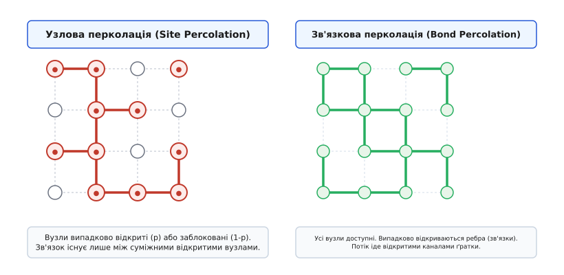
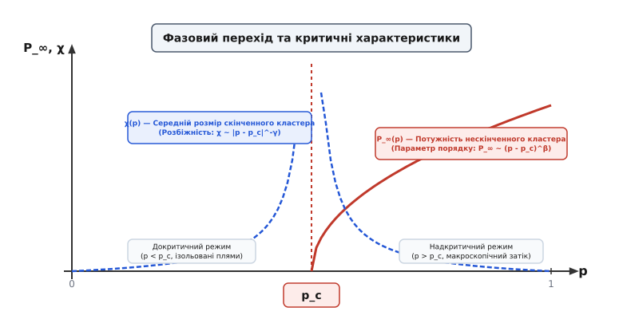
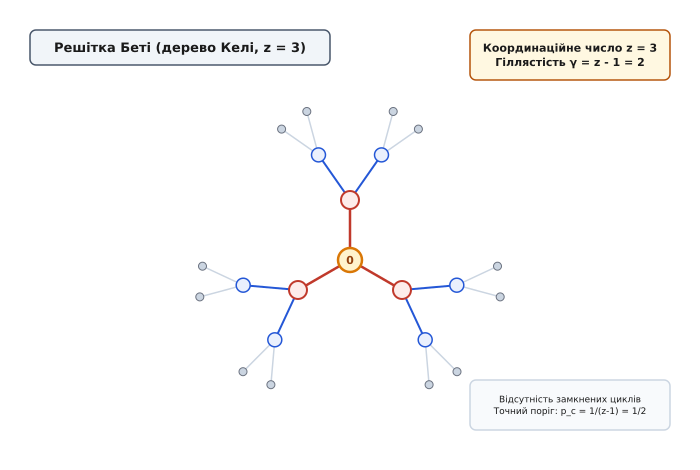
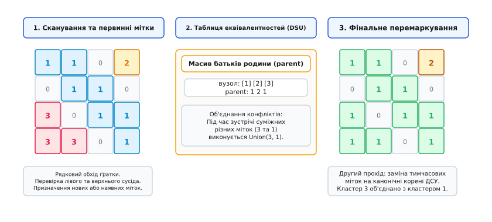

# Теорія перколації

<preknowlist>
- [Провідність та опір](topic:ph-condensed/conductivity) — перенесення заряду у дискретних та суцільних середовищах.
- [Тепловий шум](topic:ph-condensed/thermal-noise) — флуктуаційно-дисипаційні явища у вимірювальних та провідних мережах.
- [Фактор Больцмана](topic:ph-thermodynamics/boltzmann-factor) — статистична ймовірність мікростанів у рівноважних системах.
</preknowlist>

Суміш із діелектричного полімеру та дрібних металевих ошурок поводиться як досконалий електричний ізолятор, якщо частка металевих частинок невелика. Під час поступового додавання металевого порошку опір суміші тривалий час залишається нескінченно високим, аж поки при досягненні певного критичного об'ємного вмісту провідність раптово не зростає на дев'ять-дванадцять порядків. У цей єдиний момент непов'язані між собою хаотичні металеві зерна вперше змикаються у суцільний, макроскопічний струмопровідний міст, що пронизує весь зразок від одного електрода до іншого.

Схоже явище спостерігається при нагнітанні води у нафтоносний пласт пористої гірської породи, поширенні лісової пожежі через сухий масив або передачі інформаційного сигналу в зашумленій комп'ютерній мережі. В усіх цих систем існують два якісно відмінні стани: локалізований (де затік або зв'язок замкнений у скінченних ізольованих островах) та макроскопічний (де виникає нескінченний наскрізний канал).

Перехід між цими станами описується **теорією перколації** (від латинського *percolare* — проціджувати, сочитися). Це розділ статистичної фізики та дискретної математики, який вивчає поведінку зв'язаних структур (кластерів) у випадкових середовищах при зміні щільності їхніх елементів.

---

## Фізична сутність геометричного фазового переходу

У термодинаміці класичні фазові переходи — такі як танення льоду, випаровування води або спонтанне намагнічування феромагнетика при зниженні температури нижче точки Кюрі — контролюються тепловúми флуктуаціями та мінімізацією вільної енергії Гіббса. У цих системах існує постійна конкуренція між внутрішньою енергією взаємодії частинок `U` та ентропійним хаосом `T·S`.

Перколаційний перехід є фундаментально іншим явищем. Це **чисто геометричний фазовий перехід другого роду**, у якому повністю відсутні температура, тепловий шум або енергетичний гамільтоніан взаємодії частинок. Роль температури або тиску відіграє геометрична ймовірність `p` відкриття окремого каналу чи вузла середовища, а роль термодинамічного параметра порядку — потужність нескінченного кластера `P_∞(p)`.

При критичному значенні ймовірності `p = p_c`, яке називається **порогом перколації** (або порогом протікання), геометрія середовища зазнає якісної топологічної перебудови:
- При `p < p_c` (докритичний режим) середовище складається виключно із скінченних, ізольованих кластерів. Максимальний розмір кластерів обмежений радіусом кореляції `ξ(p)`. Ймовірність існування нескінченного зв'язаного шляху строго дорівнює нулю.
- При `p = p_c` (критична точка) радіус кореляції стає нескінченним `ξ(p_c) = ∞`. Найбільший кластер набуває фрактальної самоподібної структури, пронизуючи весь простір, але маючи нульову об'ємну щільність у термодинамічній границі.
- При `p > p_c` (надкритичний режим) утворюється макроскопічний, так званий «нескінченний» (протікаючий) кластер, який займає скінченну частку `P_∞(p) > 0` від усіх відкритих елементів системи.

```
Докритичний стан (p < p_c)    Критичний стан (p = p_c)      Надкритичний стан (p > p_c)
  ░ ░ █ ░ ░ █ ░ ░             █ ░ █ █ ░ █ ░ █             █ █ █ █ ░ █ █ █
  ░ █ ░ ░ █ ░ ░ ░             ░ █ ░ █ █ ░ █ ░             █ █ ░ █ █ █ ░ █
  ░ ░ ░ █ ░ ░ █ ░             █ ░ █ ░ █ █ ░ █             █ ░ █ █ █ █ █ █
 [Ізольовані плями]         [Фрактальний міст]          [Макроскопічний затік]
```

Оскільки середовище є випадковим, для нескінченного об'єму виникнення протікаючого кластера підпорядковується закону «все або нічого» (закон нуля або одиниці Колмогорова): ймовірність протікання дорівнює строго `0` при `p < p_c` і строго `1` при `p > p_c`.

---

## Моделі решіткової перколації: вузлова та зв'язкова

Для математичного аналізу перколації суцільний простір дискретизують у вигляді регулярної просторової ґратки. Залежно від того, які елементи ґратки вважаються випадковими змінними, виділяють дві базові решіткові моделі.

### Узлова перколація (Site Percolation)

У моделі узлової перколації ребра ґратки вважаються безумовно провідними канальцями, а випадковими є самі вузли (вершини) ґратки. Кожен вузол незалежно від інших з ймовірністю `p` є «відкритим» (активним, провідним) і з ймовірністю `1 - p` — «закритим» (заблокованим, ізолюючим).

Два відкриті вузли належать до одного кластера, якщо між ними існує безперервний ланцюжок суміжних відкритих вузлів.

### Зв'язкова перколація (Bond Percolation)

У моделі зв'язкової перколації самі вузли ґратки вважаються полностью доступними, але зв'язки (ребра) між сусідніми вузлами відкриваються випадково з ймовірністю `p`. Рідина або електричний струм можуть вільно рухатися лише через відкриті ребра.


*Конструктивна різниця моделей перколації: у лівій панелі випадково відкриваються вузли ґратки (червоні кола); у правій панелі відкриваються ребра-зв'язки між постійно доступними вузлами.*

Між цими двома моделями існує суворе топологічне співвідношення: **будь-яка модель зв'язкової перколації на ґратці G може бути точно сформульована як модель узлової перколації на решітці ребер (line graph) Ґратки G**. Звідси випливає фундаментальна нерівність для однієї й тієї самої геометрії ґратки:

```
p_c(site) ≥ p_c(bond)                    [узловий поріг завжди не менший за зв'язковий]
```

Фізична причина цієї нерівності полягає в тому, що закриття одного вузла блокує одразу `z` суміжних зв'язків (де `z` — координаційне число), тобто справляє більш деструктивний вплив на зв'язаність мережі, ніж розрив одного окремого ребра.

### Значення критичних порогів для різних геометрій

Поріг перколації `p_c` суттєво залежить від геометрії ґратки та координаційного числа `z` (кількості найближчих сусідів кожного вузла). Чим більше сусідів має кожен вузол, тим легше утворюються обхідні шляхи, і тим нижчим є поріг перколації.

| Двовимірні ґратки (2D) | Координаційне число `z` | Поріг зв'язкової перколації `p_c(bond)` | Поріг узлової перколації `p_c(site)` |
| :--- | :---: | :---: | :---: |
| Стільникова (Honeycomb) | 3 | `1 - 2·sin(π/18) ≈ 0.65271` | `≈ 0.69704` |
| Квадратна (Square) | 4 | **точно 1/2 = 0.50000** | `≈ 0.592746` |
| Трикутна (Triangular) | 6 | `2·sin(π/18) ≈ 0.34729` | **точно 1/2 = 0.50000** |

Для тривимірних ґраток (3D) значення порогів значно нижчі через наявність додаткового просторового виміру для створення обхідних шляхів:
- Тривимірна проста кубічна ґратка (Cubic, `z = 6`): `p_c(bond) ≈ 0.2488`, `p_c(site) ≈ 0.3116`.
- Об'ємно-центрована кубічна (BCC, `z = 8`): `p_c(site) ≈ 0.246`.
- Гранецентрована кубічна ґратка (FCC, `z = 12`): `p_c(site) ≈ 0.198`.

Деякі значення є строго доведеними точними математичними константами. Наприклад, точність виразу `p_c(bond) = 1/2` для квадратної ґратки випливає з її самодуальності, що було строго доведено Гаррі Кестеном (*Harry Kesten*) у 1980 році.

> 📜 **Історична вставка:** Про те, як дослідження вугільних фільтрів у протигазах 1957 року дало поштовх теорії Хаммерслі, та як Пол Флорі ще 1941 року описав гелеутворення полімерів, читайте у вставці 📜 [Історія перколації: від газомасок і гелеутворення до геометричних фазових переходів](topic:ph-thermodynamics/percolation-theory/hist-fluid-to-gelation.md).

---

## Структура кластерів та критичні показники

Поблизу порогу перколації `p → p_c` кількісні характеристики системи описуються степеневими законами, аналогічними термодинамічним критичним явищем у физиці магнетиків чи фазових переходів рідина-газ.

### Параметр порядку P_∞(p)

Параметром порядку перколаційного переходу є **потужність нескінченного кластера** `P_∞(p)` — частка відкритих вузлів, що належать до протікаючого кластера.

```
P_∞(p) = 0,                                 при p < p_c
P_∞(p) ≈ B · (p - p_c)ᵇ,                    при p ≥ p_c
```

Тут `β` — критичний показник параметра порядку, а `B` — амплітудний множник.

### Середній розмір скінченного кластера χ(p)

Якщо ми вибираємо випадковий відкритий вузол, який **не належить** до нескінченного кластера, то середній розмір кластера `χ(p)`, до якого цей вузол входить, виражається через розподіл кількості кластерів за розмірами `n_s(p)` (кількість кластерів розміру `s` на один вузол ґратки):

```
χ(p) = ∑ s² · n_s(p) / ∑ s · n_s(p)      [сумування по всіх скінченних кластерах]
```

При наближенні до критичної точки як згори, так і знизу (`p → p_c`), середній розмір скінченного кластера неограниченно зростає за степеневим законом:

```
χ(p) ≈ C_⁻ · (p_c - p)⁻ᵍ,                  при p < p_c
χ(p) ≈ C_⁺ · (p - p_c)⁻ᵍ,                  при p > p_c
```

Критичний показник `γ` описує швидкість розбіжності розмірів скінченних «островів» поблизу порогу.


*Характерна поведінка перколаційного переходу: при p < p_c параметр порядку P_∞ дорівнює нулю, а середній розмір кластера χ розбігається в критичній точці p_c.*

### Радіус кореляції ξ(p)

Радіус кореляції `ξ(p)` задає характерний просторовий розмір скінченних кластерів або розмір масштабних парів у нескінченному кластері. Він визначає відстань, на якій зв'язаність двох вузлів є статистично корельованою. При `p → p_c` радіус кореляції розбігається:

```
ξ(p) ≈ A · |p - p_c|⁻ⁿ                    [розбіжність радіуса кореляції]
```

Де `ν` — критичний показник радіуса кореляції.

---

## Точні розв'язки та теорія скайлінгу

Побудова точних аналітичних розв'язків для реальних ґраток у 2D та 3D є надзвичайно складною задачею через наявність численних замкнених циклів (перехресних зв'язків). Проте на особливому класі графів — **решітці Беті (дереві Келі)** — точний розв'язок будується аналітично.

### Точний розв'язок на решітці Беті

Решітка Беті з координаційним числом `z` являє собою нескінченне дерево без жодного замкненого циклу. Оскільки кожна гілка росте незалежно, для ймовірності `Q(p)` того, що вибраний напрямок веде лише до скінченного піддерева, виводиться точне самоузгоджене рівняння:

```
Q(p) = (1 - p) + p · [Q(p)]ᶻ⁻¹          [самоузгоджене рівняння на решітці Беті]
```

Аналіз цього рівняння поблизу `Q = 1` дає строгий математичний результат для порогу перколації та критичних показників у наближенні середнього поля:

```
p_c = 1 / (z - 1)                        [точний поріг на решітці Беті]
β = 1,    γ = 1,    ν = 1/2             [показники середнього поля]
```


*Топологічна структура решітки Беті з координаційним числом z = 3 (кожен вузол має 3 сусіди). Відсутність циклів забезпечує точність аналітичного розв'язку.*

> 🧮 **Математична вставка:** Строгий алгебраїчний вивід самоузгодженого рівняння `Q(p)`, обчислення `P_∞(p)`, `χ(p)` та розкладання критичних показників на решітці Беті дивіться у вставці 🧮 [Точний розв'язок теорії перколації на решітці Беті та теорія скайлінгу](topic:ph-thermodynamics/percolation-theory/math-bethe-lattice.md).

### Метод ренормалізаційної групи (РГ) у двовимірному просторі

Для аналізу критичних показників у двовимірних ґратках із циклами використовується метод **речової ренормалізаційної групи (Real-Space RG)**. Ідея полягає у групуванні сусідніх вузлів у макроскопічні блоки та побудові масштабного перетворення `p' = R(p)`.

Наприклад, об'єднуючи трійки вузлів на трикутній ґратці з масштабним фактором `b = √3`, отримуємо поліноміальне РГ-перетворення за мажоритарним правилом:

```
p' = R(p) = p³ + 3·p²·(1 - p) = 3·p² - 2·p³
```

Розв'язання рівняння нерухомої точки `p* = R(p*)` дає нестабільний Фіксований Пункт `p* = 1/2` (точний поріг перколації), а похідна `λ = (dR/dp)|_{p*} = 1.5` визначає критичний показник радіуса кореляції:

```
ν = ln(b) / ln(λ) = ln(√3) / ln(1.5) ≈ 1.35
```

Цей результат чудові збігається з точним виразом теорії конформного поля `ν = 4/3`.

### Масштабна гіпотеза та класи універсальності

Згідно з масштабно-інваріантною гіпотезою Стауффера, поблизу порогу перколації єдиним суттєвим лінійним масштабом системи є радіус кореляції `ξ(p)`. Усі мікроскопічні деталі конкретної ґратки (квадратна, трикутна чи кубічна) «замилюються», і поведінка системи визначається виключно **класом універсальності**, який залежить лише від розмірності простору `d`.

З масштабної анзац-формули для розподілу кластерів за розмірами `n_s(p) ≈ s⁻ᵗ · f((p - p_c) sˢ)` випливають універсальні співвідношення між критичними показниками:

```
2 - α = d · ν = 2β + γ                   [співвідношення гіперскейлінгу]
τ = 2 + β / (β + γ)                      [показник розподілу кластерів]
σ = 1 / (β + γ)                          [масштабний показник s_max]
```

### Верхня критична розмірність d_c = 6

Для перколації **верхня критична розмірність дорівнює `d_c = 6`**. При `d ≥ 6` геометрія простору надає стільки ступенів вільності для обходу замкнених петель, що флуктуації перестають впливати на критичні показники. Для будь-якого `d ≥ 6` критичні показники точно збігаються з показниками решітки Беті (`β = 1`, `γ = 1`, `ν = 1/2`).

### Фрактальна структура критичного кластера

Саме у точці порогу `p = p_c` нескінченний кластер являє собою **самоподібний фрактал**. Кількість вузлів `N(R)` усередині сфери радіуса `R` зростає не як `Rᵈ`, а за фрактальним законом:

```
N(R) ∝ Rᵈ_f                               [маса фрактального кластера у сфері R]
d_f = d - β / ν                          [фрактальна розмірність критичного кластера]
```

У двовимірному просторі (`d = 2`) фрактальна розмірність протікаючого кластера дорівнює точно:

```
d_f = 2 - (5/36) / (4/3) = 91 / 48 ≈ 1.8958
```

Це означає, що критичний кластер є «пористим»: він заповнює площину щільніше, ніж одновимірна лінія (`d = 1`), але пухкіше, ніж суцільна двовимірна поверхня (`d = 2`).

---

## Зв'язок із статистичною моделлю Поттса (Фортуїн — Кастелейн)

У 1972 році Каспер Фортуїн (*Casper Fortuin*) та Пітер Кастелейн (*Piet Kasteleyn*) встановили точний математичний міст між геометричною теорією перколації та термодинамічною **моделлю Поттса** із `q` станами.

Гамільтоніан `q`-станової моделі Поттса для спінів `σ_i ∈ {1, 2, ..., q}` задається виразом:

```
H = -J · ∑ δ(σ_i, σ_j)                    [гамільтоніан взаємодії сусідніх спінів]
```

Фортуїн та Кастелейн показали, що статистична сума цієї системи `Z(q)` може бути записана як сума по геометричних кластерах (представлення Фортуїна — Кастелейна, FK-кластери):

```
Z(q) = ∑ pᵉ · (1 - p)ᵇ⁻ᵉ · qᶜ              [FK-представлення статистичної суми]
```

Де `e` — кількість відкритих ребер, `b` — загальна кількість ребер ґратки, `c` — кількість зв'язаних кластерів, а ймовірність утворення зв'язку виражається через спіновий обмін: `p = 1 - exp(-J / k_B T)`.

Дивовижним математичним наслідком є те, що **чиста геометрична перколація являє собою математичну граничну точку q-станової моделі Поттса при q → 1**:

```
перколація = lim_{q → 1} (q-state Potts model)
```

Цей зв'язок дав змогу перенести всі потужні інструменти квантової теорії поля, конформної симетрії та алгебри Темперлі — Ліба безпосередньо у теорію перколації.

---

## Градієнтна перколація та диффузійні фронти

У реальних фізичних процесах (наприклад, під час інтеркаляції літію в електроди акумуляторів або дифузії цинку у мідну матрицю) частка провідних елементів `p(x)` не є константою по всьому об'єму, а утворює просторовий градієнт `∇p`. Така ситуація описується **градієнтною перколацією** (*Gradient Percolation*).

У 1985 році Бернар Саповаль (*Bernard Sapoval*) із колегами виявив, що фронт дифузії в умовах градієнта частки `p(x)` самоорганізується у перколаційну лінію точно у тій області простору, де місцева частка дорівнює критичному порогу `p(x) = p_c`.

Ширина диффузійного фронту `w` масштабується з градієнтом `∇p` за законом:

```
w ∝ |∇p|⁻ⁿ/⁽¹⁺ⁿ⁾                           [ширина фронту градієнтної перколації]
```

Для 2D системи із `ν = 4/3` показник ширини фронту дорівнює `4/7 ≈ 0.571`. Це явище активно використовується для надточного аналізу фрактальної геометрії фазових меж методом атомно-силової мікроскопії.

---

## Мультифрактальний спектр струмів у кістяку кластера

При проходженні електричного струму через перколаційну решітку опорів струмовий потік розподіляється вкрай неоднорідно. Нескінченний кластер містить три топологічні категорії вузлів:
1. **Мертві кінці (Dead ends)**: гілки, які підключені до кластера лише одним кінцем. Струм у них дорівнює строго нулю.
2. **Червоні ребра (Red bonds / singly connected bonds)**: ребра, при розриві будь-якого з яких весь макроскопічний струм повністю припиняється. На червоних ребрах виділяється максимальне Джоулеве тепло.
3. **Паралельні цикли (Blobs / loops)**: замкнені контури, по яких струм розгалужується на кілька паралельних шляхів.

Сукупність червоних ребер та паралельних циклів утворює **кістяк кластера (backbone)**. Фрактальна розмірність кістяка `d_BB` є меншою за розмірність повного кластера `d_f`: у 2D `d_BB ≈ 1.64` порівняно з `d_f ≈ 1.896`.

Розподіл електричних струмів `I_e` по ребрах кістяка підпорядковується **мультифрактальному скейлінгу**. Для `q`-го моменту розподілу струмів виконується співвідношення:

```
∑ (I_e / I_total)ᵍ ∝ L⁻ᵗ⁽ᵍ⁾               [мультифрактальний спектр струмів]
```

Ця мультифрактальність є причиною того, що флуктуаційні шуми (такі як `1/f` шум опору) у поблизу перколаційного порогу гіпертрофовано зростають, оскільки вся дисипація енергії локалізується на вузькій мережі червоних зв'язків.

---

## Алгоритмічне моделювання та чисельні методи

Оскільки точні аналітичні розв'язки відомі лише для 1D-ланцюжків та дерев Беті, вивчення перколації у 2D та 3D спирається на комп'ютерне моделювання Монте-Карло.

### Алгоритм Гошена — Копельмана та DSU

Для ідентифікації кластерів на сітці `N × N` застосовують **алгоритм Гошена — Копельмана** (*Hoshen-Kopelman algorithm*). Він поєднує однопрохідне растрове сканування сітки із використанням структури даних **системи неперетинних множин** (*Disjoint-Set Union, DSU*).


*Три етапи алгоритму Гошена — Копельмана: растрове сканування з призначеним тимчасових міток, об'єднання конфліктних міток у DSU та остаточна канонізація.*

Обхід сітки виконується в один прохід. Для кожного відкритого вузла перевіряються лише його лівий та верхній сусіди. Якщо виявляється еквівалентність двох різних міток, виконується операція `DSU.unite(label1, label2)`. Завдяки стисненню шляхів у DSU часова складність алгоритму становить `O(N² · α(N²))`, що є практично лінійним часом від кількості вузлів.

> ⚙️ **Проектна вставка:** Повний код алгоритму Гошена — Копельмана з реалізацією структури DSU мовами C++ та C з детальним розбором оптимізацій дивіться у вставці ⚙️ [Алгоритм Гошена — Копельмана та метод системи неперетинних множин для моделювання перколації](topic:ph-thermodynamics/percolation-theory/proj-hoshen-kopelman.md).

> 📋 **Довідка API:** Публічний інтерфейс C++ бібліотеки симуляції `libpercolate`, CLI-прапорці утиліти та специфікацію вихідного JSON-звіту розгортає вставка 📋 [Інтерфейс бібліотеки та моделі перколаційного аналізу](topic:ph-thermodynamics/percolation-theory/api-percolation-sim.md).

---

## Динамічна та інвазійна перколація (Invasion Percolation)

У багатьох інженерних та геолого-фізичних процесах заповнення пористого середовища відбувається не одночасно по всьому об'єму, а у вигляді динамічного фронту витіснення однієї рідини іншою під дією капілярного тиску. Цей процес описується **інвазійною перколацією** (*Invasion Percolation*, модель Вілкінсона — Віллемсена, 1983).

В інвазійній перколації кожній порі (вузлу) присвоюється випадковий капілярний поріг `r_i ∈ [0, 1]`. Зволожуюча рідина повільно подається з однієї межі і на кожному кроці займає суміжну пору з **найменшим капілярним опором**. 

Головна особливість інвазійної перколації полягає у тому, що система **самоорганізується до критичного порогу**: фронт просування інвазії автоматично формує фрактальний кластер із розмірністю `d_f = 91/48`, не вимагаючи точного зовнішнього налаштування параметру `p = p_c`.

---

## Спрямована перколація (Directed Percolation)

У багатьох фізичних процесах перенесення існує асиметрія за часом або виділений просторовий напрямок (наприклад, стікання води під дією силы тяжіння або поширення лісової пожежі під дією вітру). Такі явища описуються **спрямованою перколацією** (*Directed Percolation, DP*).

На відміну від звичайної (ізотропної) перколації, зв'язки у моделі DP мають стрілки (напрямки), і рух можливий лише в один бік. Модель спрямованої перколації належить до окремого класу універсальності із власними критичними показниками:
- У 1+1 вимірній спрямованій перколації (1 просторовий вимір + 1 часовий): `β_DP ≈ 0.276`, `ν_∥ ≈ 1.733` (часовий показник кореляції), `ν_⊥ ≈ 1.097` (просторовий показник).

Спрямована перколація описує загальний клас фазових переходів у поглинаючі стани (*absorbing-state phase transitions*) — стани, з яких система не може самостійно вийти (наприклад, повне вимирання популяції в епідеміологічних моделях контактних процесів).

---

## Перколація на складних та випадкових мережах

При аналізі реальних інформаційних, транспортних та біологічних мереж геометрія системи задається не просторовою ґраткою, а випадковим графом.

### Випадкові графи Ердеша — Реньї

У моделі випадкових графів Ердеша — Реньї `G(N, p)` кожен із `N*(N-1)/2` потенційних зв'язків відкривається з ймовірністю `p`. Коли середня ступінь вершини `⟨k⟩ = p · N` перевищує `1`, у графі виникає «гігантська компонента». Цей перехід точно описується теорією перколації у наближенні середнього поля (`d → ∞`).

### Безмасштабні мережі (Scale-Free Networks)

Реальні мережі (такі як Інтернет, мережа цитувань наукових праць або соціальні мережі) зазвичай є **безмасштабними** зі степеневим розподілом ступенів вершин `P(k) ∝ k⁻ᵍ` (де `2 < γ ≤ 3`).

Перколація на безмасштабних мережах показує вражаючий результат (експеримент Коена, Ереза, бен-Аврахама та Хавліна, 2000):
- **Стійкість до випадкових збоїв**: При випадковому вилученні вершин поріг руйнування гігантської компоненти прямує до 1 (`p_c → 0` при `N → ∞`). Це означає, що безмасштабна мережа залишається зв'язаною навіть при випадковому відключенні 99% вузлів.
- **Вразливість до спрямованих атак**: Якщо вилучати не випадкові вузли, а хаби (вузли з найбільшим ступенем `k`), поріг перколації стає надзвичайно низьким — вилучення всього 1–2% найбільших хабів повністю руйнує цілісність мережі.

---

## Континууальна перколація та провідність випадкових мереж

У реальних фізичних матеріалах атоми чи включення порошку не розміщуються у вузлах впорядкованої ґратки. Замість дискретних ґраток використовується **континуальна перколація** (модель перекривних сфер або «Swiss cheese model»).

### Модель перекривних сфер

У цій моделі центри сфер радіуса `R` хаотично розміщуються у просторі за пуассонівським законом зі щільністю `n`. Сфери можуть вільно перекриватися. Перколаційний поріг виражається через безрозмірну критичну концентрацію `B_c` (середню кількість центрів сфер усередині однієї сфери):

```
B_c = (4/3)·π · n_c · (2R)³                [критичне число зв'язків сфери в 3D]
B_c ≈ 2.8                                [для 3D континуальної перколації]
```

### Провідність решітки опорів та закон Арчі

Якщо замінити кожне відкрите ребро перколаційної ґратки мікроскопічним резистором із опором `r_0`, макроскопічна електрична провідність `G(p)` всієї сітки поблизу порогу описується власнім критичним показником провідності `t`:

```
G(p) = 0,                                 при p < p_c
G(p) ∝ (p - p_c)ᵗ,                       при p ≥ p_c
```

Критичний показник провідності `t` **не збігається** з показником параметра порядку `β`. Для двовимірних систем `t ≈ 1.30`, для тривимірних `t ≈ 2.00`. Це пояснюється тим, що струм тече не по всьому нескінченному кластеру, а лише по його «кістяку» (*backbone*). Мертві петлі та тупикові гілки кластера сприяють масі `P_∞`, але абсолютно не беруть участі в перенесенні електричного струму.

У геофізиці для опису питомої електропровідності `σ_eff` водонасичених пористих порід використовують емпіричний **закон Арчі** (*Archie's law*):

```
σ_eff = σ_w · Φᵐ                           [закон Арчі для пористих середовищ]
```

Де `σ_w` — провідність флюїду (солоної води), `Φ` — пористість породи (частка порожнин), а `m` — показник цементації (`1.3 < m < 2.5`), який прямо пов'язаний з перколаційною топологією пор.

У наближенні ефективного середовища (*Effective Medium Approximation, EMA*) провідність гетерогенної суміші з часткою провідної фази `p` та провідностями фаз `σ_1` і `σ_2` обчислюється з самоузгодженого рівняння:

```
∫ (σ_i - σ_eff) / [σ_i + (d - 1)·σ_eff] = 0   [рівняння ефективного середовища EMA]
```

Модель EMA чудово описує провідність далеко від порогу, але повністю ламається в околі `p_c`, оскільки вона не враховує фрактальні масштабні флуктуації.

---

## Стрибкова провідність у неупорядкованих напівпровідниках

У фізиці твердого тіла теорія перколації відіграє фундаментальну роль при описі **стрибкової провідності** (*Hopping Conduction*, модель Мота, 1968) у сильно легованих неупорядкованих напівпровідниках та аморфних матеріалах при низьких температурах.

Електрони у таких матеріалах локалізовані на випадкових примесевих центрах. Перехід електрона між двома примесевими центрами `i` та `j`, віддаленими на відстань `r_ij` та розділеними енергетичним бар'єром `E_ij`, відбувається шляхом тунелювання з поглинанням або випромінюванням фонона. Темп переходу описується виразом Мейлера — Абрахамса:

```
Г_ij = Г_0 · exp(-2·r_ij / a - E_ij / k_B T)  [темп тунельного стрибка між центрами]
```

Опір між цією парою центрів `R_ij = k_B T / (e² · Г_ij)` можна подати у вигляді еквівалентної електричної сітки опорів:

```
R_ij = R_0 · exp(ξ_ij),                      ξ_ij = 2·r_ij / a + E_ij / k_B T
```

Оскільки експоненційний аргумент `ξ_ij` коливається у широких межах від десятків до сотень, підсумкова макроскопічна провідність зразка повністю визначається **перколаційним порогом на випадковій сітці опорів**. Наскрізний струм протікає лише тоді, коли відкриваються всі ребра з `ξ_ij ≤ ξ_c`, де `ξ_c` — критичне значення піддерева перколації.

Це пояснює знаменитий **закон стрибкової провідності Мота зі змінною довжиною стрибка** (*Variable-Range Hopping, VRH*):

```
R(T) = R_0 · exp((T_0 / T)¹/⁽ᵈ⁺¹⁾)         [закон Мота для d-вимірного напівпровідника]
```

У тривимірному напівпровіднику (`d = 3`) опір зростає як `exp((T_0 / T)¹/⁴)`, що є прямою наслідком континуальної перколації у 4-вимірному просторі координат та енергій `(x, y, z, E)`.

---

## Перколаційні явища у біологічних мембранах та іонних каналах

Дивовижним застосуванням теорії перколації в біофізиці є опис **проникності біологічних мембран** та агрегації білкових іонних каналів у ліпідному бішарі. 

Ліпідний бішар клітинної мембрани є рідкокристалічним двовимірним флюїдом. Іонні канали або пори, утворені антибіотичними пептидами (наприклад, граміцидином), плавають у мембрані та можуть випадково агрегувати у кластери. Коли площа, зайнята активними порами у двовимірній площині мембрани, досягає двовимірного узлового порогу перколації `p_c ≈ 0.59`, електрична провідність мембрани раптово зростає у тисячі разів, що призводить до масового витоку іонів калію та натрію і спричиняє лізис (загибель) бактеріальної клітини.

Така сама концепція використовується під час дослідження транспортних властивостей зрізів кісткової тканини та пористих імплантатів, де швидкість проростання судин та остеобластів визначається зв'язаністю внутрішніх пор вище перколаційної межі. Знання цього порогу дає змогу проектувати біосумісні матеріали із заданими механічними та мікрокапілярними характеристиками.

---

## Практичні застосування та інженерне значення

> 🔧 **Навіщо це.** Теорія перколації є базовим математичним апаратом для розробників нових матеріалів, геофізиків, розробників мережевих протоколів та епідеміологів:
> - **Нафтовидобуток та гідродинаміка розробки пластів**: Визначення порогу витіснення нафти водою через пористі породи. Якщо тиск нагнітання недостатній для відкриття потрібної частки мікропор `p > p_c`, нафта залишається заблокованою у підземному пастковому кластері.
> - **Провідні полімерні композити**: Створення антистатичних корпусів електроніки, сенсорних екранів та гнучких друкованих плат. Додавання вуглецевих нанотрубок або графену у полімерну матрицю дає змогу досягти металевої провідності при мінімальній об'ємній частці filler-компонента (`p_c ≈ 0.1–1%`), зберігаючи легкість та гнучкість пластику.
> - **Стійкість комп'ютерних мереж та Інтернету**: Оцінка надійності масштабних мереж (маршрутизаторів, електромереж, транспортних вузлів) при випадкових збоях вузлів або навмисних кібератаках. Руйнування мережі описується як зворотна перколація: вилучення критичної частки вузлів `1 - p_c` розпадає єдину глобальну мережу на ізольовані фрагменти.
> - **Епідеміологія та поширення інфекцій**: Моделювання порогу колективного імунітету. Якщо частка вакцинованого або імунного населення перевищує поріг `1 - p_c`, мережа можливих контактів для передачі вірусу розпадається на скінченні кластери, що повністю зупиняє епідеміологічний спалах.

Теорія перколації демонструє, як із простих местних правил випадкового зв'язку виникає глобальна просторова організація середовища. Вона дає фізикам та інженерам універсальний інструмент для прогнозування та управління критичними стрибками у найрізноманітніших системах нашого світу.
