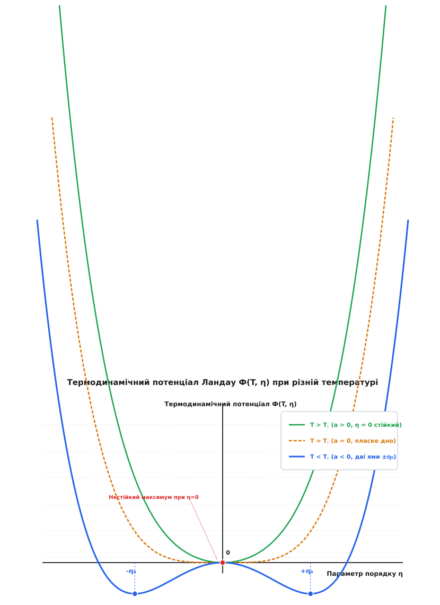
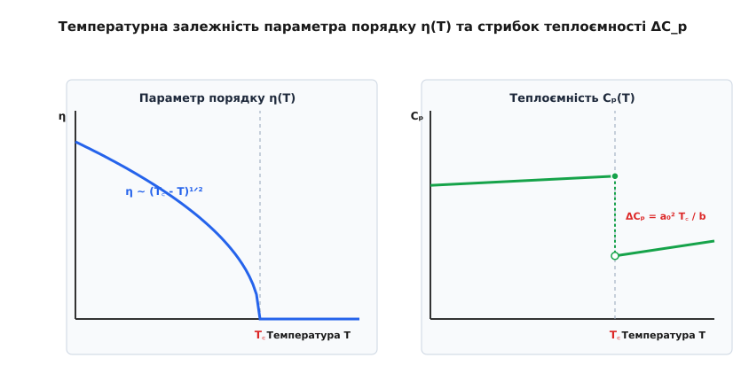

# Теорія фазових переходів другого роду Ландау

<preknowlist>
- [Entropy and Boltzmann distribution](root:ph-thermodynamics/entropy-boltzmann)
- [Van der Waals equation](root:ph-thermodynamics/van-der-waals-equation)
- [Chemical potential](root:ph-thermodynamics/chemical-potential)
- [Noether's theorem](root:ph-mechanics/noether-theorem)
</preknowlist>

Охолодження феромагнетика нижче точки Кюрі супроводжується раптовою появою спонтанного магнітного моменту без найменшого поглинання чи виділення прихованої теплоти переходу. Залізо або нікель втрачають макроскопічне магнітне поле при нагріванні вище критичної температури абсолютно плавно, однак їхня теплоємність, коефіцієнт теплового розширення та магнітна сприйнятливість зазнають різкого термодинамічного зламу.

Цей феномен безперервної трансформації речовини, у якому симетрія кристалічної ґратки чи спинової системи змінюється стрибком при збереженні неперервності внутрішньої енергії та ентропії, утворює фундаментальний клас фазових переходів другого роду. Класична термодинаміка XIX століття, збудована навколо рівняння Клапейрона — Клаузіуса та процесів випаровування чи плавлення, виявилася безпомічною перед цими явищами. Створена Львом Ландау у 1937 році феноменологічна теорія об'єднала концепцію параметра порядку, спонтанне порушення симетрії та Тейлорівський розклад термодинамічного потенціалу у струнку систему, що лягла в основу сучасної фізики конденсованого стану.

## 1. Неспроможність класичної термодинаміки та криза класифікації Еренфеста

Класичний опис фазових перетворень спирається на рівність хімічних потенціалів `μ_1(T, P) = μ_2(T, P)` двох фаз, що перебувають у термодинамічній рівновазі. При фазових переходах першого роду — таких як кипіння води, плавлення криги чи сублімація йоду — перші часткові похідні потенціалу Ґіббса за температурою та тиском зазнають скінченного стрибка. Оскільки перші похідні визначають питомий об'єм `v = ∂g / ∂P` та питому ентропію `s = - ∂g / ∂T`, на лінії фазової рівноваги виникає стрибок об'єму `Δv` та стрибок ентропії `Δs`.

Зв'язок між нахилом лінії фазової рівноваги `dP / dT` на термодинамічній діаграмі та прихованою теплотою переходу `L = T Δs` задається фундаментальним рівнянням Клапейрона — Клаузіуса:

```
dP / dT = L / (T · Δv)
```

Виведення співвідношення Клапейрона — Клаузіуса випливає з диференціювання умови рівноваги хімічних потенціалів:

```
g_1(T, P) = g_2(T, P)              [умова рівноваги фаз]
- s_1 dT + v_1 dP = - s_2 dT + v_2 dP  [диференціали потенціалу]
dP / dT = (s_2 - s_1) / (v_2 - v_1) = Δs / Δv  [співвідношення похідних]
dP / dT = L / (T · Δv)             [прихована теплота L = T Δs]
```

Однак під час експериментального дослідження переходів речовин у надпровідний стан, фазових перетворень сплавів типу латуні (`CuZn`), феромагнітного впорядкування та лямбда-переходу рідкого гелію-4 у надплинний стан виявилося, що прихована теплота переходу дорівнює нулю (`L = 0`), а питомий об'єм не зазнає жодного стрибка (`Δv = 0`). Рівняння Клапейрона — Клаузіуса перетворюється на невизначеність `0 / 0`, що означає його повну непридатність для опису таких процесів.

У 1933 році нідерландський фізик Пауль Еренфест запропонував математичну класифікацію фазових переходів, основану на порядку найнижчої часткової похідної потенціалу Ґіббса, яка зазнає розриву. За цією класифікацією, фазовим переходом `n`-го роду називають процес, у якому потенціал Ґіббса `g(T, P)` та його часткові похідні до порядку `n-1` включно є неперервними функціями, тоді як похідні `n`-го порядку мають скінченний стрибок.

За Еренфестом, при фазовому переході другого роду неперервними є сам потенціал `g`, ентропія `s = -∂g/∂T` та об'єм `v = ∂g/∂P`. Скачки виникають у другорядних похідних:

```
Ізобарна теплоємність:        C_p = - T · (∂²g / ∂T²)
Коефіцієнт об'ємного розширення: α_p = (1 / v) · (∂²g / ∂T ∂P)
Ізотермічна стисливість:       κ_T = - (1 / v) · (∂²g / ∂P²)
```

Замість рівняння Клапейрона — Клаузіуса Еренфест вивів два нових співвідношення для нахилу кривої переходу `dP / dT` через стрибки другорядних похідних. Виведення першого рівняння Еренфеста спирається на неперервність ентропії:

```
ds_1 = ds_2                        [умова неперервності ентропії]
(∂s_1/∂T)_P dT + (∂s_1/∂P)_T dP = (∂s_2/∂T)_P dT + (∂s_2/∂P)_T dP  [повний диференціал]
(C_p1 / T) dT - v α_p1 dP = (C_p2 / T) dT - v α_p2 dP  [заміна похідних]
dP / dT = ΔC_p / (T · v · Δα_p)    [перше рівняння Еренфеста]
```

Аналогічно, виведення другого рівняння Еренфеста спирається на неперервність питомого об'єму:

```
dv_1 = dv_2                        [умова неперервності об'єму]
v α_p1 dT - v κ_T1 dP = v α_p2 dT - v κ_T2 dP  [повний диференціал об'єму]
dP / dT = Δα_p / Δκ_T              [друге рівняння Еренфеста]
```

Незважаючи на елегантність, класифікація Еренфеста виявилася фізично неспроможною. Точні експериментальні вимірювання та подальші теоретичні розв'язки показали, що у більшості реальних систем (наприклад, у лямбда-переході гелію та в 2D моделі Ізинґа) теплоємність поблизу критичної точки розбігається до нескінченності за логарифмічним або степеневим законом `C_p ~ |T - T_c|^(-α)`, замість того щоб мати скінчений стрибок `ΔC_p`. Математична неаналітичність термодинамічних потенціалів у точці переходу вимагала принципово нового фізичного підходу, розробленого Ландау.

Детальний аналіз історичної еволюції уявлень про фазові перетворення та роль харківської школи теорії конденсованого стану викладено у вставці [📜 Історія розвитку теорії фазових переходів Ландау](root:ph-thermodynamics/phase-transitions-landau/hist-landau-phase-theory.md).

## 2. Концепція параметра порядку та спонтанне порушення симетрії

Фундаментальне досягнення Ландау полягало у відмові від формально-математичного підходу Еренфеста на користь симетрійного аналізу. Ландау звернув увагу на те, що якісна відмінність між двома фазами при перехіду второго роду полягає не в макроскопічному стані агрегації, а в **симетрії станів**.

Високотемпературна фаза завжди має вищу точкову або просторову симетрію, ніж низькотемпературна. Наприклад, у парамагнітному стані при `T > T_c` атомні магнітні моменти орієнтовані хаотично: система володіє повною ізотропією відносно довільних поворотів тривимірного простору (симетрія `SO(3)`). Нижче точки Кюрі `T < T_c` спини спонтанно вишиковуються вздовж одного обраного напрямку, порушуючи просторову ізотропію до симетрії обертання навколо однієї осі `SO(2)`.

Для кількісного опису ступеня впорядкованості системи Ландау ввів поняття **параметра порядку** `η` (order parameter). Параметр порядку — це термодинамічна величина, яка володіє двома визначальними властивостями:

```
η = 0  при T ≥ T_c  (дезорганізована, високосиметрична фаза)
η ≠ 0  при T < T_c  (впорядкована, низькосиметрична фаза)
```

Фізична природа параметра порядку варіюється у різних конденсаційних середовищах:
- У феромагнетиках параметром порядку є спонтанна намагніченість `M(T)` (векторний параметр порядку, симетрія `SO(3) → SO(2)`).
- У сегнетоелектриках параметром порядку є спонтанна електрична поляризація `P(T)` (векторний параметр порядку, симетрія `Z_2` або точкові групи).
- У надпровідниках параметром порядку виступає комплексна хвильова функція куперівських пар `Ψ = |Ψ| exp(i φ)` (комплексний параметр, симетрія `U(1)`).
- У надплинному Гелії-4 параметром порядку є макроскопічна хвильова функція бозе-конденсату `Ψ(r)`.
- У рідких кристалах (нематиках) параметром порядку є тензор орієнтаційного порядку `S_ij`.
- У сплавах, що впорядковуються (типу `CuAu`), параметром порядку виступає різниця ймовірностей заселення підґраток атомами різного сорту.

Фундаментальним фізичним механізмом фазового переходу второго роду є **спонтанне порушення симетрії** (spontaneous symmetry breaking). Гамільтоніан або мікроскопічні рівняння руху системи є повністю симетричними відносно певної групи перетворень `G` (наприклад, інверсії спинів `Z_2` або глобального фазового повороту `U(1)` відповідно до [Noether's theorem](root:ph-mechanics/noether-theorem)). Однак при температурах нижче `T_c` термодинамічно рівноважне основний стан системи володіє нижчою симетрією `H ⊂ G`.

Система «обирає» один із декількох еквівалентних вироджених мінімумів енергії. У випадку `Z_2` симетрії виникає два вироджених стани з `η = +η_0` та `η = -η_0`, що відповідає двома протилежним напрямкам намагніченості у двовимірній модель Ізинґа.

Для безперервних симетрій типу `U(1)` або `SO(3)` спонтанне порушення веде до появі безмасових голдстоунівських збуджень (спинових хвиль у феромагнетиках або другого звуку в надплинному гелії). Згідно з теоремою Мерміна — Вагнера, у двовимірних та одновимірних системах теплові флуктуації безмасових голдстоунівських мод при будь-яких скінченних температурах повністю руйнують далекий порядок для неперервних симетрій, що робить фазові переходи другого роду в 2D можливими лише для дискретних симетрій `Z_2` або через топологічні переходи Березинського — Костерліца — Таулеса.

## 3. Термодинамічний потенціал Ландау та симетрійний розклад

Оскільки поблизу критичної точки `T_c` параметр порядку `η` є малим безрозмірним параметром (`|η| ≪ 1`), термодинамічний потенціал Ґіббса (або вільну енергію Гельмгольца) системи `Φ(T, P, η)` можна розкласти у степеневий ряд Тейлора по степенях `η`.

Розклад термодинамічного потенціалу мусить бути суворо інваріантним відносно усіх операцій симетрії високотемпературної фази. Розглянемо найпростіший і найпоширеніший випадок скалярного параметра порядку із дискретною симетрією інверсії `Z_2` (`η → -η`), який описує одноосьові феромагнетики та сегнетоелектрики.

Через симетрію `Φ(η) = Φ(-η)` у Тейлорівському розкладі за відсутності зовнішнього поля повністю зникають усі непарні степені `η, η³, η⁵`. Узагальнений вираз для потенціалу Ландау має вигляд:

```
Φ(T, P, η) = Φ_0(T, P) + a(T, P) · η² + (1 / 2) · b(T, P) · η⁴ + (1 / 3) · c(T, P) · η⁶ - η · H
```

де `Φ_0(T, P)` — потенціал симетричної фази при `η = 0`, `H` — зовнішнє поле, спряжене до параметра порядку (наприклад, магнітне чи електричне поле), а `a(T)`, `b(T)`, `c(T)` — феноменологічні коефіцієнти розкладу.

Для забезпечення термодинамічної стійкості системи при великих значеннях `η` потенціал мусить зростати нескінченно при `|η| → ∞`. У випадку фазових переходів второго роду коефіцієнт `b(T, P)` вважається суворо додатним (`b > 0`), що дозволяє знехтувати членом шостого степеня `c η⁶`.

Аналітичні властивості коефіцієнта `a(T)` визначають температурний режим системи. При високих температурах `T > T_c` мінімум потенціалу мусить відповідати значенню `η = 0`. Отже, при `T > T_c` коефіцієнт `a(T) > 0`. При низьких температурах `T < T_c` стан `η = 0` стає неустійким (максимумом), а мінімум зміщується у область `η ≠ 0`. Отже, при `T < T_c` коефіцієнт `a(T) < 0`.

У безпосередній близькості до точки переходу `T_c` функцію `a(T)` можна розкласти у найпростіший лінійний ряд за температурним відхиленням `(T - T_c)`:

```
a(T) = a_0 · (T - T_c)
```

де `a_0 > 0` — додатна феноменологічна константа. Коефіцієнт `b(T) ≈ b = const > 0` вважається постійним у малій околиці `T_c`.


*_Рис. 1. Термодинамічний потенціал Ландау: симетричний мінімум при T > T_c, плоске дно при T = T_c та спонтанне порушення симетрії з двома потенціальними ямами при T < T_c_*

Геометрична трансформація профілю потенціалу `Φ(η)`, представлена на Рис. 1, демонструє якісну зміну рівноваги:
1. При `T > T_c` (`a > 0`) потенціал має єдиний параболічний мінімум у точці `η_0 = 0`. Система є симетричною та здезорганізованою.
2. При `T = T_c` (`a = 0`) крива потенціалу стає надзвичайно плоскою на дні (`Φ ~ η⁴`), що призводить до нескінченного зростання флуктуацій.
3. При `T < T_c` (`a < 0`) точка `η = 0` перетворюється на локальний максимум (потенціальний бар'єр), і виникають два симетричні потенціальні мінімуми (потенціальні ями) при `η = ± η_0`.

Рівноважне значення параметра порядку `η_0` знаходиться з умови мінімуму термодинамічного потенціалу `∂Φ / ∂η = 0`:

```
∂Φ / ∂η = 2 · a(T) · η + 2 · b · η³ = 2 · η · [ a_0 · (T - T_c) + b · η² ] = 0
```

Це рівняння має два розв'язки:
- Тривіальний розв'язок `η_0 = 0`, що відповідає симетричній фазі. При `T < T_c` друга похідна `∂²Φ / ∂η² = 2 a_0 (T - T_c) < 0`, тобто цей стан є термодинамічно неустійким.
- Нетривіальний рівноважний розв'язок для впорядкованої фази при `T < T_c`:

```
η_0(T) = ± [ (a_0 / b) · (T_c - T) ]^(1 / 2)
```

Для реальних матеріалів коефіцієнти `a_0` та `b` вимірюють експериментально. Наприклад, у сегнетоелектрику титанаті барію (`BaTiO_3`) величина `a_0 ≈ 3.7 · 10^5 Дж·м/(К·Кл²)`, а `b ≈ 3.3 · 10^8 Дж·м⁵/Кл⁴`, що дозволяє розраховувати поляризацію та п'єзомодулі кристала з високою точністю.

Строге математичне виведення термодинамічного потенціалу, розрахунок нелінійних рівноважних станів та умови стійкості викладено у вставці [🧮 Математичний вивід розкладу потенціалу Ландау та обчислення критичних показників](root:ph-thermodynamics/phase-transitions-landau/math-landau-expansion.md).

## 4. Універсальні наслідки: критичні показники та феноменологічні закони

Теорія Ландау дозволяє аналітично обчислити універсальні термодинамічні характеристики системи поблизу точки фазового переходу без знання мікроскопічної структури речовини.

### Критичний показник параметра порядку `β`

Температурна залежність рівноважного параметра порядку описується степеневим законом через безрозмірну температурну відстань `τ = (T - T_c) / T_c`:

```
η_0(T) ~ (-τ)^β
```

У теорії Ландау критичний показник параметра порядку дорівнює **`β = 1 / 2 = 0.5`**. Це означає, що відразу нижче критичної точки параметр порядку зростає за параболічним законом.

### Стрибок ізобарної теплоємності `ΔC_p`

Підставивши рівноважне значення `η_0(T)` назад у вираз для потенціалу Ландау `Φ(T, η)`, отримаємо рівноважну вільну енергію впорядкованої фази `Φ_eq(T)` при `T < T_c`:

```
Φ_eq(T) = Φ_0(T) - [ a_0² · (T_c - T)² ] / (2 · b)
```

Визначаючи ентропію системи як `S = - ∂Φ_eq / ∂T`, отримуємо:

```
При T > T_c:  S(T) = S_0(T)
При T < T_c:  S(T) = S_0(T) + (a_0² / b) · (T - T_c)
```

В точці переходу `T = T_c` ентропія є повністю неперервною (`S(T_c^-) = S(T_c^+) = S_0(T_c)`), що підтверджує відсутність прихованої теплоти переходу (`L = 0`).

Обчислимо ізобарну теплоємність системи `C_p = T (∂S / ∂T)`:

```
При T > T_c:  C_p(T) = C_p0(T)
При T < T_c:  C_p(T) = C_p0(T) + (a_0² · T) / b
```

При проходженні точки `T_c` згори вниз теплоємність зазнає скінченного термодинамічного **стрибка** `ΔC_p`:

```
ΔC_p = C_p(T_c^-) - C_p(T_c^+) = (a_0² · T_c) / b
```


*_Рис. 2. Температурна залежність параметра порядку η(T) та термодинамічний стрибок теплоємності ΔC_p при критичній температурі T_c_*

Графіки на Рис. 2 ілюструють ключові висновки теорії: параметр порядку виникає неперервно з нуля, а теплоємність зазнає характерного розриву второго роду (дисконтинуїтету) у точці `T_c`.

### Закон Кюрі — Вейсса та «закон двійки» Ландау

Розглянемо відгук системи на слабке зовнішнє поле `H`. Рівноважне значення `η` у полі знаходимо з рівняння стану `∂Φ / ∂η = 0`:

```
2 · a_0 · (T - T_c) · η + 2 · b · η³ = H
```

Продиференціюємо це рівняння за полем `H` для обчислення оборотної сприйнятливості `χ = ∂η / ∂H`:

```
2 · a_0 · (T - T_c) · (∂η / ∂H) + 6 · b · η² · (∂η / ∂H) = 1
```

Відтак оборотна сприйнятливість має вигляд:

```
χ(T) = 1 / [ 2 · a_0 · (T - T_c) + 6 · b · η² ]
```

Аналіз цього виразу у двох температурних областях дає фундаментальний закон:
1. У симетричній фазі `T > T_c` (де `η_0 = 0`):

```
χ(T) = 1 / [ 2 · a_0 · (T - T_c) ] = C_Curie / (T - T_c)
```

Це класичний **закон Кюрі — Вейсса** з константою Кюрі `C_Curie = 1 / (2 a_0)`. Критичний показник сприйнятливості дорівнює **`γ = 1`**.

2. У впорядкованій фазі `T < T_c` (де `η_0² = a_0 (T_c - T) / b`):

```
χ(T) = 1 / [ 2 · a_0 · (T - T_c) + 6 · a_0 · (T_c - T) ] = 1 / [ 4 · a_0 · (T_c - T) ]
```

Порівняння сприйнятливостей при одинакових температурних відстанях від критичної точки `|T - T_c| = ΔT` приводить до знаменитого **«закону двійки» Ландау**:

```
χ(T_c + ΔT) / χ(T_c - ΔT) = 2
```

Магнітна чи електрична сприйнятливість у симетричній фазі вище точки переходу є суворо **увічі більшою**, ніж у низькотемпературній впорядкованій фазі при тому самому температурному інтервалі `ΔT`.

При самій критичній температурі `T = T_c` рівняння стану приймає нелінійний вигляд `2 b η³ = H`, звідки випливає рівняння критичної ізотерми:

```
H ~ η^δ  де  δ = 3
```

Зведення критичних показників теорії Ландау (середньопольове наближення):
- `β = 1/2` (параболічне зростання параметра порядку `η ~ |τ|^β`).
- `γ = 1` (закон Кюрі — Вейсса для сприйнятливості `χ ~ |τ|^(-γ)`).
- `α = 0` (скінченний стрибок ізобарної теплоємності `C_p ~ |τ|^(-α)`).
- `δ = 3` (кубічна критична ізотерма `H ~ η^δ` при `T = T_c`).
- `ν = 1/2` (довжина кореляції `ξ ~ |τ|^(-ν)`).
- `η_corr = 0` (асимптотика кореляційної функції `G(r) ~ r^(-d+2-η_corr)`).

## 5. Просторові флуктуації, функціонал Гінзбурга — Ландау та межі застосовності

У базовій теорії Ландау параметр порядку `η` вважається суворо однорідним у всьому об'ємі тіла. Однак поблизу точки фазового переходу сприйнятливість `χ` розбігається до нескінченності, що призводить до велетенського зростання просторових флуктуацій параметра порядку `η(r)`.

У 1950 році Віталій Гінзбург та Лев Ландау узагальнили теорію для просторово неоднорідних систем, додавши до густини вільної енергії градієнтний член `g (∇η)²`, який описує енергетичну ціну просторової неоднорідності (градієнтну жорсткість):

```
F[η(r)] = ∫ [ f_0(T) + a_0 · (T - T_c) · η²(r) + (1 / 2) · b · η⁴(r) + g · (∇η(r))² - η(r) · H(r) ] dV
```

Варіація цього функціонала за параметра порядку `δF / δη(r) = 0` веде до знаменитого **рівняння Гінзбурга — Ландау**:

```
- g · ∇²η + a_0 · (T - T_c) · η + b · η³ = H(r)
```

Для знаходження просторової кореляційної функції флуктуацій `G(r) = ⟨δη(0) δη(r)⟩` лінеаризуємо рівняння Гінзбурга — Ландау поблизу `T > T_c`:

```
- g · ∇² (δη) + a_0 · (T - T_c) · δη = H(r)  [лінеаризоване рівняння]
- g · ∇² G(r) + a(T) · G(r) = δ(r)            [рівняння для функції Гріна]
G(r) = (1 / (4 · π · g · r)) · exp(- r / ξ)    [тривимірний розв'язок]
ξ(T) = [ g / a(T) ]^(1 / 2) = [ g / (a_0 · (T - T_c)) ]^(1 / 2)  [довжина кореляції]
```

Довжина кореляції `ξ(T)` визначає просторовий розмір флуктуаційних областей (доменів) впорядкованої фази. Критичний показник довжини кореляції в теорії Ландау дорівнює **`ν = 1 / 2`**. При `T → T_c` довжина кореляції неограниченно зростає `ξ → ∞`, що пояснює явище критичного опалесценції — сильного розсіяння світла на велетенських флуктуаціях густини чи параметра порядку.

### Критерій Гінзбурга та верхня критична розмірність

Нехтування флуктуаціями у середньопольовій теорії Ландау є правомірним лише тоді, коли флуктуації параметра порядку в об'ємі кореляційної сфери `V_ξ ~ ξ^d` є малими порівняно з самим рівноважним значенням `η_0`.

Умовою застосовності теорії Ландау є **критерій Гінзбурга**:

```
Gi = [ k_B · T_c · b² ] / [ a_0 · g³ · (T_c - T)^(4 - d) ] ≪ 1
```

де `d` — просторова розмірність системи.

З критерію Гінзбурга випливає концепція **верхньої критичної розмірності** `d_c = 4`:
- При `d > 4` флуктуації є пригніченими, і теорія Ландау дає точні значення критичних показників.
- При `d < 4` (включаючи наш реальний тривимірний простір `d = 3`) флуктуації поблизу `T_c` стають визначальними у вузькій температурній області — **області Гінзбурга** `|T - T_c| / T_c < Gi`. Всередині цієї області середньопольові показники Ландау ламаються і змінюються на універсальні показники Ренормалізаційної групи Вільсона.

Наприклад, у класичних надпровідниках першого роду завдяки велетенській довжині кореляції Куперівських пар `ξ_0 ≈ 1000 Å` область Гінзбурга є мікроскопічно малою (`Gi ≈ 10^(-12)`), тому теорія Ландау працює з високою точністю до найменших температурних часток. У високотемпературних купратних надпровідниках та рідких кристалах `ξ_0 ≈ 10 Å`, що розширює область Гінзбурга до `Gi ≈ 10^(-2)`, де флуктуації стають помітними в експерименті.

Приклад чисельного моделювання флуктуацій у 2D моделі Ізинґа та порівняння з теорією Ландау наведено у вставці [⚙️ Чисельне моделювання фазового переходу Ландау та моделі Ізинґа](root:ph-thermodynamics/phase-transitions-landau/proj-landau-ising-sim.md).

## 6. Порівняльний аналіз переходів 1-го та 2-го роду, трикритичні точки та застосування

Теорія Ландау дає універсальну фреймворк для опису не лише переходів 2-го роду, а й фазових переходів 1-го роду та трикритичних точок.

Якщо коефіцієнт при четвертому степені потенціалу стає від'ємним (`b < 0`), для забезпечення термодинамічної стійкості необхідно враховувати доданок шостого степеня `c η⁶` з `c > 0`:

```
Φ(η) = Φ_0 + a(T) · η² - |b| · η⁴ + c · η⁶
```


*_Рис. 3. Фазова діаграма системи із трикритичною точкою TCP та порівняльний профіль потенціалів Φ(η) для фазових переходів першого і второго роду_*

Як показано на Рис. 3, при `b < 0` на кривій потенціалу виникає додатковий боковий мінімум. Перехід між фазами відбувається як стрибок з `η = 0` у `η = η_jump ≠ 0` при температурі переходу `T_1 > T_c`. Це фазовий перехід **першого роду**, що супроводжується прихованою теплотою та гістерезисом.

Точка на фазовій діаграмі, у якій лінія переходів второго роду неперервно переходить у лінію переходів першого роду (де коефіцієнт `b(T, P) = 0`), називається **трикритичною точкою** (Tricritical Point, TCP). У трикритичній точці рівноважний параметр порядку зростає за законом `η ~ (T_c - T)^(1/4)`, що відповідає критичному показникові `β = 1/4 = 0.25`.

Опис програмного інтерфейсу та чисельного розв'язувача для розрахунку параметрів систем у наближенні Ландау викладено у вставці [📋 Інтерфейс бібліотеки розрахунку параметрів фазових переходів та термодинамічних функцій у наближенні Ландау](root:ph-thermodynamics/phase-transitions-landau/api-landau-solver.md).

> 🔧 **Навіщо це.**
> Феноменологічна теорія Ландау та її розширення Гінзбурга — Ландау утворюють математичний фундамент сучасної фізики конденсованого стану та матеріалознавства. У мікроелектроніці теорія Ландау використовується для проектирования сегнетоелектричних конденсаторів пам'яті (FeRAM) та тунельних транзисторів із негативною ємністю. У фізиці надпровідності рівняння Гінзбурга — Ландау дозволяють розраховувати критичні магнітні поля `H_c1`, `H_c2` та описувати вихрову структуру Абрикосова в надпровідниках II роду, що є критичним для створення магнітних систем томографів (МРТ) та прискорювачів частинок. У космології та фізиці високих енергій теорія Ландау описує фазові переходи у ранньому Всесвіті та космологічне відновлення симетрії электрослабких взаємодій.
