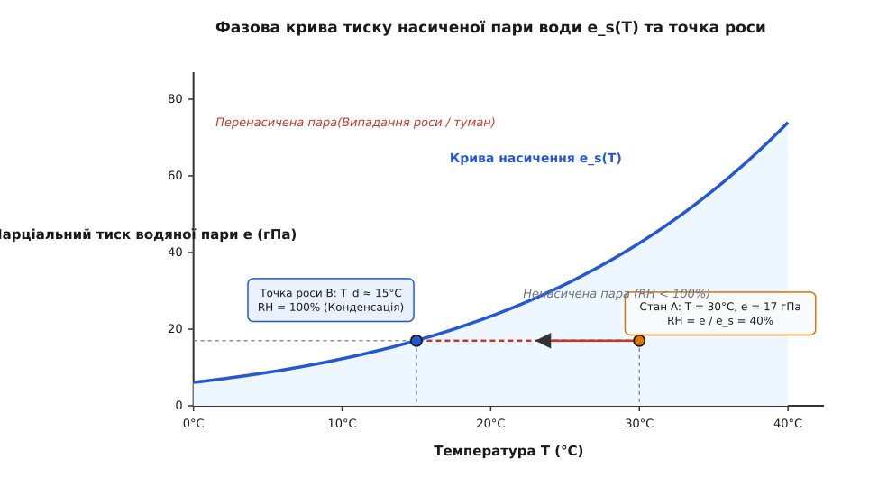
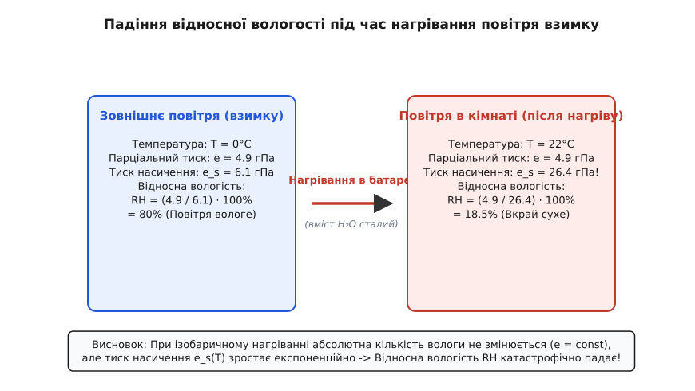
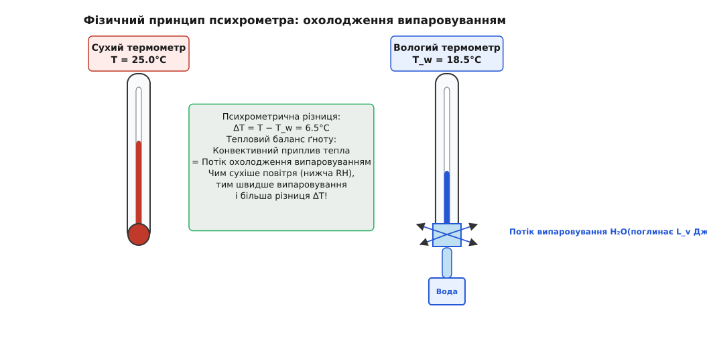
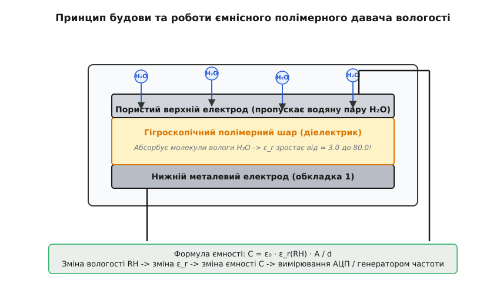

# Відносна вологість повітря

<preknowlist>
- [Рівняння стану ідеального газу](topic:ph-thermodynamics/ideal-gas-law) — зв'язок тиску, об'єму та температури газу через закон Дальтона для суміші.
- [Точка роси і конденсація](topic:ph-thermodynamics/dew-point) — температура, за якої водяна пара стає насиченою і випадає роса.
- [Вимірювання вологості](topic:ph-thermodynamics/humidity-measurement) — принципи побудови гігрометрів та психрометрів.
</preknowlist>

Коли ми відчуваємо важку духоту перед літньою грозою, бачимо молочно-білий туман над низовиною чи помічаємо дрібні краплі роси на холодній поверхні віконного скла взимку, ми спостерігаємо термодинамічні прояви присутності водяної пари в атмосфері. Протім людське відчуття вологості не вимірює абсолютну кількість маси води у кубічному метрі повітря — воно реагує на відносну величину, яка показує, наскільки близьким є газове середовище до стану фазового насичення та конденсації.

**Відносна вологість повітря** (*relative humidity*, позначається як `RH` або `φ`) — це макроскопічна термодинамічна величина, що дорівнює відношенню фактичного парціального тиску водяної пари `e` у повітряній суміші до максимального можливого тиску насиченої пари `e_s(T)` за даної температури `T`, вираженому у відсотках.

Цей показник є наріжним каменем для фізики атмосфери, метеорології, кліматології, будівельної теплофізики, промислового кондиціювання та розробки цифрових МЕМС-давачів середовища. Щоб зрозуміти, чому відносна вологість настільки стрімко змінюється при найменшому нагріванні чи охолодженні повітря, необхідно розібратися з молекулярно-кінетичною картиною випаровування та фазової рівноваги.

---

## 1. Молекулярна картина водяної пари та парціальний тиск

Атмосферне повітря являє собою багатокомпонентну газову суміш. Основними складовими є сухі гази — азот `N₂` (~78.08% за об'ємом), кисень `O₂` (~20.95%), аргон `Ar` (~0.93%) — та зміна кількість водяної пари `H₂O` (від 0.001% у сухих арктичних пустелях до 4.0% у вологих екваторіальних лісах).

Згідно з висновками молекулярно-кінетичної теорії, кожен газ у суміші здійснює свій власний тиск на навколишні поверхні незалежно від присутності інших компонентів. Згідно із **законом Дальтона** (лат. *pars* — частина), загальний атмосферний тиск `P_total` є сумою парціальних тисків сухих газів `P_dry` та парціального тиску водяної пари `e`:

```
P_total = P_dry + e = P_N2 + P_O2 + P_Ar + e
```

**Парціальний тиск водяної пари `e`** (вимірюється в паскалях `Па` або гектопаскалях `гПа`) міряє кінетичний імпульс, який хаотично рухомі молекули `H₂O` передають одиниці площі поверхні під час пружних зіткнень.

За звичайних атмосферних тисків та температур водяна пара поводиться як ідеальний газ із високою точністю (коефіцієнт стискальності `Z ≈ 0.998`). Оцінка відхилень за рівнянням Ван-дер-Ваальса показує, що власна густина та сили Ван-дер-Ваальсового притягання між молекулами пари за атмосферного тиску є знехтувно малими порівняно з енергією теплового руху `k_B · T`.

Тому її парціальний тиск прямо пов'язаний із **абсолютною вологістю** `ρ_v` — масою водяної пари, що міститься в одному кубічному метрі повітря (кг/м³ або г/м³):

```
e = ρ_v · R_v · T
```

де:
- `ρ_v = m_v / V` — абсолютна вологість (кг/м³);
- `R_v = R / M_w = 8.31446 / 0.018015 = 461.5` Дж/(кг·К) — питома газова стала водяної пари;
- `T` — абсолютна температура в кельвінах (К).

Молекула води `H₂O` має кутову будову із кутом між зв'язками O-H близько 104.5°, що створює значний постійний дипольний момент (1.85 Дебая). Через це молекули пари активно взаємодіють із полярними поверхнями. Крім того, молярна маса водяної пари (`M_w = 18.015` г/моль) є суттєво меншою за середню молярну масу сухого повітря (`M_dry = 28.964` г/моль). Це дає важливий фізичний наслідок: **вологе повітря за однаковості температури й загального тиску є легшим (менш густим) за сухе повітря**. Це явище створює додаткову плавучість вологих повітряних мас і є рушієм потужної тропічної конвекції.

Для опису масової частки вологи у метеорології використовують також **вологовміст** (або відношення суміші) `r` — масу водяної пари на один кілограм сухого повітря:

```
r = m_v / m_dry = 0.622 · (e / (P_total - e))
```

де коефіцієнт `0.622 = M_w / M_dry` є відношенням молярних мас пари та сухого повітря.

---

## 2. Термодинаміка фазової рівноваги та тиск насичення e_s(T)

Розглянемо закриту термодинамічну систему, у якій міститься рідка вода й повітряний простір над нею. На межі розділу рідкої та газоподібної фаз безперервно відбуваються два зустрічні мікроскопічні процеси:

1. **Випаровування**: молекули води у приповерхневому шарі рідини, які внаслідок Максвелла розподілу швидкостей отримують кінетичну енергію, вищу за потенціальну енергію міжмолекулярного притягання (водневих зв'язків), долають поверхневий натяг і вириваються в газ. Швидкість випаровування визначається насамперед температурою рідини та площею поверхні.
2. **Конденсація**: молекули водяної пари з повітряного об'єму внаслідок хаотичного руху врізаються назад у поверхню рідини й захоплюються міжмолекулярними силами рідкої фази. Швидкість конденсації є прямо пропорційною концентрації молекул пари (тобто парціальному тиску `e`).

Коли кількість молекул, що випаровуються з поверхні за секунду, стає строго рівною кількості молекул, що конденсуються назад, у системі настає **термодинамічна фазова рівновага**.


*_Залежність тиску насиченої пари води від температури: фазова межа між невипаруваною вологою та парою та ізобаричне охолодження до точки роси._*

Пара, яка перебуває у стані фазової рівноваги з власною рідкою або твердою фазою, називається **насиченою парою**, а її парціальний тиск позначається як **тиск насичення `e_s(T)`**.

Головна термодинамічна особливість тиску насичення полягає у тому, що `e_s(T)` **залежить виключно від температури `T`** і абсолютно не залежить від наявності інших газів (азоту чи кисню) або загального об'єму судини.

Математично ця залежність виводиться з фундаментального рівняння Клаузіуса-Клапейрона (детальніший вивід наведено у вставці 🧮 [Математика тиску насичення та психрометрії](topic:ph-thermodynamics/relative-humidity/math-vapor-pressure.md)):

```
de_s / dT = L_v / (T · (v_g - v_l))
```

Оскільки питома теплота випаровування `L_v ≈ 2.44 × 10⁶` Дж/кг є дуже великою величиною, інтегрування цього рівняння дає **експоненційну залежність** тиску насичення від температури. На практиці у метеорології та приладобудуванні використовують формулу Августа-Рош-Магнуса:

```
e_s(T) = 6.112 · exp( (17.67 · T) / (243.5 + T) )
```

де температура `T` задана у градусах Celsius (°C), а тиск `e_s` отримують у гектопаскалях (гПа).

Простежимо, як стрімко зростає тиск насиченої пари `e_s` з підвищенням температури:
- при `-20 °C`: `e_s = 1.25` гПа (морозне повітря здатне утримати мізерну масу вологи);
- при `0 °C`: `e_s = 6.11` гПа;
- при `10 °C`: `e_s = 12.27` гПа (подвоєння тиску насичення при нагріванні всього на 10 градусів!);
- при `20 °C`: `e_s = 23.37` гПа;
- при `30 °C`: `e_s = 42.43` гПа;
- при `40 °C`: `e_s = 73.84` гПа;
- при `100 °C`: `e_s = 1013.25` гПа (тиск насиченої пари стає рівним нормальному атмосферному тиску — вода починає кипіти по всьому об'єму).

### Насичення над водою та над льодом
За від'ємних температур (`T < 0` °C) слід розрізняти тиск насичення над поверхнею переохолодженої рідкої води `e_s,water` та над поверхнею льоду `e_s,ice`. Оскільки молекули у кристалічній ґратці льоду зв'язані міцніше, ніж у рідкій воді, випаровування (сублімація) з льоду відбувається важче. Тому `e_s,ice < e_s,water`.

Ця різниця сягає максимуму при температурі близько `-12 °C` і відіграє вирішальну роль у фізиці хмар (**процес Бержерона-Фіндейзена**): у змішаних хмарах водяна пара є насиченою відносно льоду, але ненасиченою відносно крапель води. Внаслідок цього краплі води випаровуються, а кристалики льоду стрімко ростуть за рахунок сублімації, перетворюючись на важкі сніжинки й викликаючи опади.

---

## 3. Математичне означення та фізичний зміст відносної вологості

Знаючи фактичний парціальний тиск пари `e` та теоретичну межу насичення `e_s(T)`, ми можемо сформулювати математичне означення відносної вологості `RH`:

```
RH = (e / e_s(T)) · 100%
```

Використовуючи рівняння стану ідеального газу `e = ρ_v · R_v · T`, відносну вологість можна також виразити через відношення абсолютних вологостей:

```
RH = (ρ_v / ρ_s(T)) · 100%
```

де `ρ_s(T)` — густина насиченої водяної пари за температури `T`.

### Фізична сутність відносної вологості
Відносна вологість вимірює **ступінь термодинамічної ненасиченості** повітря. 
- При `RH = 100%` повітря є повністю насиченим. Чистий потік випаровування води припиняється. Будь-яке подальше охолодження призводить до утворення туману або конденсації роси.
- При `RH = 50%` у повітрі міститься рівно половина тієї маси водяної пари, яку воно здатне утримати за даної температури до початку випадання роси.
- При `RH < 20%` повітря вважається вкрай сухим. Воно інтенсивно випаровує воду з будь-яких вологих поверхонь, включаючи шкіру та слизові оболонки організму.

### Парадокс нагрівання повітря взимку
Зв'язок відносної вологості з температурою пояснює поширений побутовий парадокс: чому взимку при працюючому опаленні повітря в квартирі стає аномально сухим, хоча на вулиці йде сніг і відносна вологість сягає 80–90%?

Простежимо фізику цього процесу за допомогою схеми.


*_Зміна відносної вологості за сталого вмісту вологи: нагрівання повітря приміщення взимку різко знижує відносну вологість через стрімке зростання тиску насичення._*

Нехай зовнішнє зимове повітря має температуру `T_out = 0` °C та відносну вологість `RH_out = 80%`.
1. Обчислимо тиск насичення при 0 °C: `e_s(0°C) = 6.11` гПа.
2. Фактичний парціальний тиск водяної пари на вулиці:
   ```
   e = 0.80 · 6.11 = 4.89 гПа
   ```
3. Коли це повітря заходить через вентиляцію в кімнату й нагрівається батареями до `T_in = 22` °C при зачинених вікнах, абсолютна маса вологи в ньому не змінюється (`e = 4.89` гПа = const).
4. Проте тиск насичення при 22 °C зростає до `e_s(22°C) = 26.44` гПа!
5. Обчислимо нову відносну вологість у кімнаті:
   ```
   RH_in = (4.89 / 26.44) · 100% = 18.5%
   ```

Відносна вологість впала з 80% до 18.5%! Повітря стало "жадібним" до вологи, оскільки його потенційна місткість `e_s(T)` зросла більш ніж у 4 рази.

### Процес охолодження в кондиціонері (літо)
Зворотний процес відбувається влітку під час роботи кондиціонера. Спекотне вологе повітря з температурою `30 °C` та `RH = 70%` (`e = 29.7` гПа, точка роси `T_d = 23.9` °C) прокачується через випаровувач кондиціонера, охолоджений до `10 °C`.

Оскільки температура пластин випаровувача є значно нижчою за точку роси `T_d`, водяна пара масово конденсується на них і стікає через дренажну трубку на вулицю. На виході з кондиціонера повітря виходить охолодженим і з меншим абсолютним вмістом вологи.

### Психрометрична діаграма Мольє (I-d діаграма)
Для розрахунку складних процесів змішування та зволоження повітря в інженерії використовують психрометричні діаграми (діаграма Мольє або ASHRAE chart). На такій діаграмі по осі абсцис відкладається вологовміст `d` (г/кг сухого повітря), по осі ординат — ентальпія `I` (кДж/кг), а сітка ліній показує ізотерми, ізохори та лінії постійної відносної вологості `RH = 10%...100%`. Зміна стану повітря при нагріванні описується горизонтальним відрізком (вологовміст сталий), а адіабатичне зволоження водою — лінією постійної ентальпії `I = const`.

> 🔧 **Навіщо це.** 
> Розуміння падіння `RH` при нагріванні є критичним для проектування систем вентиляції та кондиціювання (HVAC). Якщо взимку не застосовувати примусове зволоження повітря в офісах та житлових будинках, відносна вологість падає нижче 20%, що викликає пересихання слизових оболонок дихальних шляхів, знижує місцевий імунітет до вірусних інфекцій та викликає накопичення статичної електрики на обладнанні.

Про історію створення перших приладів для фіксації цих змін — від волосяного гігрометра де Соссюра до оптичних конденсаційних дзеркал — читайте у вставці 📜 [Історія вимірювання вологості](topic:ph-thermodynamics/relative-humidity/hist-hygrometer.md).

---

## 4. Точка роси, психрометрія та дефіцит насичення

Для опису термодинамічного стану вологого повітря використовують дві супутні величини: точну температуру фазового переходу та швидкість випаровування.

### Точка роси (Dew Point)
**Точка роси `T_d`** — це температура, до якої необхідно охолодити повітря зі збереженням сталого парціального тиску водяної пари `e`, щоб воно досягло стану повного насичення (`RH = 100%`).

Якщо температура поверхні предмета (наприклад, труби з холодною водою або віконного скла) опускається нижче точки роси `T_d`, водяна пара більше не може перебувати в газоподібному стані й випадає у вигляді крапель конденсату (роси).

Розрахунок точки роси здійснюється шляхом обернення формули Магнуса:

```
γ(T, RH) = ln(RH / 100) + (17.67 · T) / (243.5 + T)
T_d = (243.5 · γ) / (17.67 - γ)
```

### Фізика зародкоутворення конденсату
Конденсація водяної пари у вільному об'ємі повітря (утворення туману або хмар) вимагає подолання енергетичного бар'єра зародкоутворення. Чиста водяна пара без сторонніх домішок може перебувати у метастабільному перенасиченому стані до `RH ≈ 400%` без утворення крапель (гомогенне зародкоутворення), оскільки крихітні мікрокраплинки радіусом менше нанометра мають величезний внутрішній капілярний тиск (рівняння Кельвіна) і негайно випаровуються назад.

У реальній атмосфері конденсація завжди відбувається за гетерогенним механізмом при `RH ≈ 100.1%` на мікроскопічних **ядрах конденсації** (аерозолях, частинках морської солі, пилку, сажі).

### Дефіцит насичення та психрометричний ефект
Різниця між тиском насичення та фактичним парціальним тиском пари називається **дефіцитом насичення** `Δe`:

```
Δe = e_s(T) - e = e_s(T) · (1 - RH / 100)
```

Згідно з законом випаровування Дальтона, швидкість випаровування води з вільної поверхні прямо пропорційна дефіциту насичення:

```
dm / dt = k · A · (e_s(T) - e)
```

На цьому явищі базується дія **психрометра** — приладу з двох термометрів (сухого та вологого).


*_Принцип вимірювання вологості психрометром: випаровування води з тканинного ґота знижує температуру вологого термометра пропорційно дефіциту вологості._*

Вологий термометр обгорнуто бавовняним ґнотом, зануреним у воду. Випаровування води з ґнота поглинає приховану теплоту випаровування `L_v`, внаслідок чого вологий термометр охолоджується до температури `T_w`.

Рівновага настає тоді, коли конвективний приплив тепла від повітря дорівнює відтоку тепла за рахунок випаровування:

```
e = e_s(T_w) - A · p · (T_dry - T_wet)
```

де `A ≈ 0.000662` К⁻¹ — психрометрична константа, а `p` — атмосферний тиск.

Чим сухіше повітря (нижча `RH`), тим більшим є дефіцит насичення `Δe`, тим інтенсивніше випаровується вода й тим нижчою стає температура вологого термометра `T_w`.

---

## 5. Сучасні фізичні принципи давачів відносної вологості

У сучасній цифровій електроніці та вимірювальних системах використовуються напівпровідникові та твердотільні давачі відносної вологості.

### 1. Ємнісний полімерний метод
Це найпоширеніший метод у цифрових давачах (наприклад, Sensirion SHT3x/SHT4x, Bosch BME280).


*_Будова ємнісного полімерного давача: абсорбція молекул води змінює діелектричну проникність полімеру та ємність конденсатора._*

Давач являє собою мікроконденсатор, нижній електрод якого є суцільним металевим шаром, а верхній — пористою металевою плівкою, що пропускає молекули газу. Між електродами розміщено гігроскопічний полімерний діелектрик (товщиною кілька мікронів).

Молекули водяної пари `H₂O` легко проникають крізь пористий електрод у полімер. Оскільки вода має надзвичайно високу відносну діелектричну проникність (`ε_r(H₂O) ≈ 80`) через високий дипольний момент молекули, а сухий полімер має `ε_r ≈ 3.0`, абсорбція вологи драматично збільшує загальну діелектричну проникність шару:

```
C(RH) = ε₀ · ε_r(RH) · A / d
```

Зміна ємності конденсатора вимірюється вбудованим у чип 24-бітним АЦП і перераховується мікроконтролером у значення %RH.

### 2. Резистивний метод
Використовує зміну електричної провідності гігроскопічного сольового шару (наприклад, хлориду літію `LiCl`) або провідного полімеру. При поглинанні вологи солі дисоціюють на іони, що викликає падіння електричного опору на кілька порядків.

### 3. Оптичний дзеркальний конденсаційний метод
Використовується в національних метрологічних лабораторіях як первинний еталон. Маленьке металеве дзеркальце охолоджується елементом Пельтьє до появи перших мікрокрапель роси, які фіксуються оптичним лазерним або світлодіодним розсіювачем. Температура дзеркала в момент утворення роси вимірюється платиновим термометром опору (Pt100), забезпечуючи абсолютну точність визначення точки роси до ±0.1 °C.

Про програмні алгоритми обчислень та структуру цифрових драйверів давачів читайте у вставках ⚙️ [Програмний розрахунок вологості та точки роси](topic:ph-thermodynamics/relative-humidity/proj-humidity-calc.md) та 📋 [Інтерфейс та компенсація давачів вологості](topic:ph-thermodynamics/relative-humidity/api-bme280.md).

---

## 6. Прикладне значення вологості в техніці, природі та житті

Відносна вологість має фундаментальний вплив на термодинаміку біологічних систем, збереження матеріалів та надійність електронних пристроїв.

### Біологічний вплив та терморегуляція людини
Організм людини охолоджується під час спеки за рахунок випаровування поту з поверхні шкіри. Питома теплота випаровування поту становить близько `L_v ≈ 2.4` МДж/кг.

Проте швидкість випаровування поту визначається не температурою повітря, а **відносною вологістю** (дефіцитом насичення).
- Якщо температура повітря становить `35 °C`, а відносна вологість дорівнює `20%`, піт випаровується миттєво, і людина легко переносить спеку.
- Якщо ж при `35 °C` відносна вологість сягає `90%` (тропічна духота), парціальний тиск пари `e` наближається до тиску насичення при температурі тіла `e_s(37°C) ≈ 62.7` гПа. Випаровування поту практично **припиняється**. Внутрішнє тепловий стан організму не відводиться, що призводить до швидкого розвитку теплового удару (гіпертермії).

Поєднання температури та вологості описується **індексом тепла** (*Heat Index*) або температурою мокрого термометра `T_w`. Межа `T_w = 35` °C є абсолютною термодинамічною межею виживання ссавців: тривале перебування у середовищі з такою температурою мокрого термометра призводить до смерті навіть у затінку при необмеженому питті.

### Будівельна фізика та точка роси у стінах
Під час проектування термоізоляції будівель принципово важливо розраховувати розподіл температури у товщі стіни для відвернення утворення точки роси всередині конструкцій.

Взимку тепле вологе повітря зсередини приміщення (`T_in = 20` °C, `RH_in = 50%`, `T_d = 9.3` °C) дифундує крізь пори матеріалу стіни назовні. Якщо шар теплоізоляції розміщено неправильно (наприклад, зсередини приміщення замість фасаду), зона стіни з температурою `9.3` °C опиниться всередині несплавного матеріалу. Це призведе до випадання внутрішнього конденсату, намокнення утепливача, втрати ним теплоізоляційних властивостей та розвитку пліснявого грибка (*Aspergillus*).

### Збереження музейних експонатів та деревини
Деревина, папір, полотно та шкіра є гігроскопічними капілярно-пористими матеріалами. Їхній лінійний розмір та внутрішні напруження визначаються рівноважним вмістом вологи (*Equilibrium Moisture Content*, EMC), який лінійно залежить від відносної вологості навколишнього повітря. Коли `RH` коливається, деревина інтенсивно розбухає або розтріскується. Саме тому у музеях та картинних галереях підтримують строго постійну вологість `50% ± 5% RH`.

### Статична електрика та корозія в електроніці
Вологість повітря у виробничих приміщеннях збирання мікросхем підтримується у суворому діапазоні `40% … 60%`:
- **При `RH < 30%`**: на поверхнях ізоляторів припиняється формування мікроскопічної плівки адсорбованої води. Електричні заряди не можуть тихо стекти у землю, що викликає накоплення статичного потенціалу до 10–15 кВ. Дотик оператора викликає електростатичний розряд (ESD), який миттєво пробиває тонкі підзатворні діелектрики CMOS-транзисторів.
- **При `RH > 60%`**: на поверхнях друкованих плат між близько розташованими провідниками під напругою формується електролітична воднева плівка. Це викликає електрохімічну міграцію металів (утворення дендритів міді чи срібла) та витоки струму між доріжками.

---

## 7. Покроковий практичний приклад розрахунку (Worked Example)

Розглянемо практичну задачу повного термодинамічного розрахунку параметрів вологого повітря за даними аспіраційного психрометра.

**Вхідні виміряні дані:**
- Показання сухого термометра: `T_dry = 24.0` °C;
- Показання вологого термометра: `T_wet = 17.0` °C;
- Загальний атмосферний тиск: `p = 1013.25` гПа.

### Покроковий розрахунок:

#### Крок 1. Обчислення тиску насичення при температурі вологого термометра e_s(T_wet)
За формулою Магнуса для `T_wet = 17.0` °C:

```
(17.67 · 17.0) / (243.5 + 17.0)
= 300.39 / 260.5
= 1.15313                             [показник степеня]

e_s(17.0°C)
= 6.112 · exp(1.15313)
= 6.112 · 3.1680
= 19.363 гПа                          [тиск насичення при T_wet]
```

#### Крок 2. Обчислення тиску насичення при температурі сухого термометра e_s(T_dry)
За формулою Магнуса для `T_dry = 24.0` °C:

```
(17.67 · 24.0) / (243.5 + 24.0)
= 424.08 / 267.5
= 1.58535                             [показник степеня]

e_s(24.0°C)
= 6.112 · exp(1.58535)
= 6.112 · 4.8810
= 29.833 гПа                          [тиск насичення при T_dry]
```

#### Крок 3. Обчислення фактичного парціального тиску водяної пари e
За психрометричною формулою з психрометричним коефіцієнтом `A = 0.000662` К⁻¹:

```
e = e_s(T_wet) - A · p · (T_dry - T_wet)
= 19.363 - 0.000662 · 1013.25 · (24.0 - 17.0)
= 19.363 - 0.000662 · 1013.25 · 7.0
= 19.363 - 4.695
= 14.668 гПа                          [фактичний парціальний тиск e]
```

#### Крок 4. Обчислення відносної вологості RH
```
RH = (e / e_s(T_dry)) · 100%
= (14.668 / 29.833) · 100%
= 0.49167 · 100%
= 49.17%                              [підсумкова відносна вологість]
```

#### Крок 5. Обчислення точки роси T_d
Обчислимо параметр `γ`:

```
γ = ln(RH / 100) + (17.67 · T_dry) / (243.5 + T_dry)
= ln(0.49167) + 1.58535
= -0.70994 + 1.58535
= 0.87541

T_d = (243.5 · 0.87541) / (17.67 - 0.87541)
= 213.162 / 16.7946
= 12.69 °C                            [температура точки роси]
```

**Підсумковий висновок розрахунку:** За виміряних температур сухого `24.0 °C` та вологого `17.0 °C` термометрів відносна вологість повітря становить **49.2%**, а температура точки роси дорівнює **12.7 °C**.

---

## 8. Підсумковий термодинамічний синтез

Відносна вологість повітря — це не просто відсоток вмісту вологи, а складна функція фазового стану води у газах, яка нерозривно пов'язана з температурою середовища.

Головні висновки, які слід запам'ятати:
1. **Експоненційна залежність**: тиск насичення водяної пари `e_s(T)` росте за експонентою з підвищенням температури. Нагрівання повітря без додавання пари неминуче призводить до стрімкого падіння відносної вологості.
2. **Точка роси як абсолютний орієнтир**: на відміну від відносної вологості, яка коливається разом із температурою приміщення, точка роси `T_d` показує фактичний масовий вміст вологи у повітрі за сталого тиску.
3. **Термодинамічний рівноважний стан**: відносна вологість визначає швидкість випаровування води та тепловий баланс живих організмів.
4. **Сучасний вимірювальний фронт**: ємнісні тонкоплівкові полімерні давачі та цифровий компенсаційний розрахунок роблять можливим автоматизований контроль вологості з високою точністю у будь-яких приладах — від смартфонних модулів до космічних станцій.
