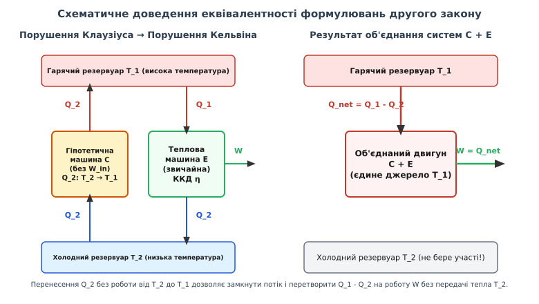
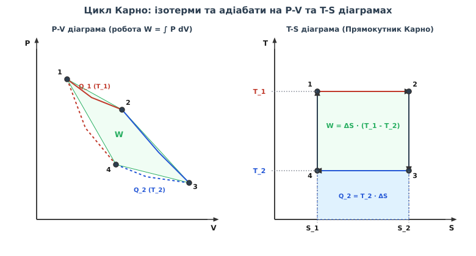
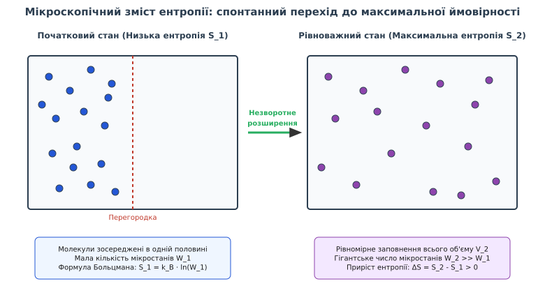

# Другий закон термодинаміки (Клаузіус, Кельвін, Планк)

<preknowlist>
- [Перший закон термодинаміки](root:ph-thermodynamics/first-law-thermodynamics) — закон збереження енергії для термодинамічних систем та поняття внутрішньої енергії.
- [Рівняння стану ідеального газу](root:ph-thermodynamics/ideal-gas-law) — зв'язок макроскопічних параметрів тиску, об'єму та температури.
- [Теплоємність](root:ph-thermodynamics/heat-capacity) — кількісна міра тепла, необхідного для зміни температури речовини.
- [Больцманівський фактор](root:ph-thermodynamics/boltzmann-factor) — ймовірність мікростанів термодинамічної системи при заданій температурі.
</preknowlist>

У сучасній вугільній або атомній електростанції пара високого тиску розігрівається у котлі до температури 850 кельвінів і подається на лопатки турбіни. Після виконання механічної роботи пара конденсується при температурі 300 кельвінів, скидаючи величезну кількість залишкового тепла у річку або градирню. Навіть якщо повністю усунути тертя в підшипниках, мінімізувати вихрові втрати в турбіні та створити ідеальну теплоізоляцію трубопроводів, така станція здатна перетворити на корисну електричну енергію не більше 64% від підведеного тепла. Решта 36% енергії неминуче розсіюється у навколишньому середовищі. Якщо спробувати забрати це скинуте тепло з охолоджувача й повернути його назад у високотемпературний котел без витрати додаткової зовнішньої роботи, система принципово відмовиться працювати. Перший закон термодинаміки абсолютно не забороняє подібний колообіг — адже загальна енергія при цьому збереглася б повністю. Однак у природі діє суворіший, направляючий вектор: **Другий закон термодинаміки**, який задає незворотну стрілу часу та встановлює фундаментальну межу перетворення хаотичного теплового руху на упорядковану механічну роботу.

---

### 1. Однонапрямленість природних процесів та проблема вічного двигуна другого роду

Закони Ньютонової механіки та рівняння електродинаміки Максвелла мають фундаментальну часову симетрію: якщо у рівняннях руху замінити знак часу `t` на `-t`, отримані траєкторії будуть абсолютно допустимими з погляду фізики. Куля, що котиться по підлозі, зупиняється через тертя, перетворюючи свою кінетичну енергію на хаотичний тепловий рух атомів покриття. З погляду закону збереження енергії (Першого закону термодинаміки) немає жодних перешкод для зворотного процесу: хаотичні теплові коливання атомів підлоги могли б узгоджено зібратися разом і потовхнути нерухому кулю, змусивши її покотитися назад із прискоренням. Однак у реальному світі такий процес не спостерігається жодного разу.

#### Якісна відмінність роботи та теплоти

Причина полягає в глибокій асиметрії між двома формами передачі енергії:
1. **Механічна робота (`W`)** являє собою впорядкований рух макроскопічних тіл або узгоджене переміщення носіїв (наприклад, потік електронів у провіднику або опускання поршня). Упорядковану енергію завжди можна на 100% дисипувати (знецінити), перетворивши її на хаотичний тепловий рух частинок (наприклад, за допомогою тертя або джоульова нагріву).
2. **Теплота (`Q`)** являє собою неупорядкований, хаотичний рух мільярдів мікроскопічних молекул, атомів та іонів. Спроба зібрати хаотичні імпульси окремих частинок і направити їх у єдиний узгоджений макроскопічний вектор неминуче впирається в ймовірнісні бар'єри.

```
Впорядкована робота (W)  ──(100% незворотно)──>  Хаотична теплота (Q)
Хаотична теплота (Q)     ──(обмежено ККД η)──>   Впорядкована робота (W)
```

#### Класифікація термодинамічних процесів за незворотністю

Усе різноманіття природних і технічних процесів за можливістю повернення у вихідний стан поділяється на дві категорії:
- **Квазістатичні оборотні процеси**: Процеси, що відбуваються нескінченно повільно через послідовність нескінченно близьких рівноважних станів за відсутності дисипативних сил (тертя, в'язкості, електричного опору). Після повернення системи у початковий стан у навколишньому середовищі не залишається жодних змін.
- **Необоротні процеси**: Процеси, які відбуваються із скінченною швидкістю за наявності градієнтів макроскопічних величин (температури, тиску, концентрації, електричного потенціалу). Спроба повернути систему назад завжди залишає необоротний «слід» у довкіллі у вигляді додаткового тепла дисипації.

Прикладами фундаментально необоротних процесів є:
- Передача тепла від гарячого тіла до холодного при скінченній різниці температур `ΔT > 0`.
- Дроселювання та вільне розширення газу у вакуум без виконання зовнішньої роботи (`P_зовн = 0`).
- Дифузне змішування двох різних газів чи рідин.
- Дисипація механічної або електричної енергії в тепло за рахунок тертя чи джоульових втрат.

#### Вічний двигун другого роду

Загальний закон збереження енергії забороняє існування **вічного двигуна першого роду** — пристрою, який створював би роботу з нічого без витрати енергоресурсів (`W > Q_підведено`). 

Однак Перший закон не забороняє створити машина, яка черпала б теплову енергію з одного гігантського термодинамічного резервуара (наприклад, з океану або атмосфери) і повністю перетворювала б її на механічну роботу без скидання тепла холоднішим тілам. Такий гіпотетичний пристрій називається **вічним двигуном другого роду** (*perpetual motion engine of the second kind*). Якби такий двигун був можливий, теплохід міг би плисти океаном за рахунок охолодження води навколо себе, не витрачаючи жодного кілограма палива. 

Другий закон термодинаміки є узагальненням колосального людського досвіду, що постулює: **вічний двигун другого роду принципово неможливий**.

---

### 2. Класичні феноменологічні формулювання: Клаузіус, Кельвін та Планк

У середині XIX століття на основі аналізу практичних теплових машин було сформульовано два класичних феноменологічних твердження Другого закону термодинаміки, які на перший погляд здаються різними, проте є суворо математично еквівалентними.

#### Формулювання Рудольфа Клаузіуса (1850)

Німецький фізик Рудольф Клаузіус звернув увагу на природний напрямок самовільного теплообміну:

> **Формулювання Клаузіуса:** Неможливо здійснити замкнений термодинамічний процес, єдиним результатом якого була б передача теплоти від тіла з меншою температурою до тіла з більшою температурою.

Теплота самовільно тече лише в одному напрямку — від гарячого тіла до холодного. Забрати тепло від холодного тіла й передати його гарячому можливо (саме так працюють побутові холодильники та кондиціонери), проте це **не може бути єдиним результатом**: для цього необхідно виконати зовнішню механічну роботу (затратити електроенергію на привід компресора), яка приводить до компенсаційних змін у навколишньому середовищі.

#### Формулювання Вільяма Томсона (Кельвіна) та Макса Планка (1851, 1897)

Шотландський фізик Вільям Томсон (лорд Кельвін) та німецький фізик Макс Планк дали формулювання, що безпосередньо стосується теплових двигунів:

> **Формулювання Кельвіна-Планка:** Неможливо побудувати періодично діючу теплову машину, єдиним результатом роботи якої було б вилучення теплоти з одного теплового резервуара та повне перетворення її на еквівалентну кількість механічної роботи.

Із формулювання Кельвіна-Планка випливає, що будь-яка теплова машина для виконання безперервної циклічної роботи зобов'язана мати щонайменше **два теплових резервуари**: 
- **Нагрівач** із високою температурою `T_1`, від якого машина отримує теплоту `Q_1`.
- **Охолоджувач** із нижчою температурою `T_2` (`T_2 < T_1`), якому машина неодмінно передає частину тепла `Q_2`.

Виконана за цикл корисна механічна робота `W` дорівнює різниці підведеного та відданого тепла:

```
W = Q_1 - Q_2
```


*Схематичне доведення еквівалентності формулювань Клаузіуса та Кельвіна-Планка: гіпотетичне порушення принципу Клаузіуса (перенесення Q_2 без роботи) у поєднанні з зі звичайною тепловою машиною створює вічний двигун другого роду.*

#### Доведення еквівалентності формулювань

Щоб довести, що твердження Клаузіуса та Кельвіна-Планка виражають один і той самий закон природи, скористаємося методом доведення від супротивного:

1. **Припустимо, що порушується твердження Клаузіуса.** Це означає існування гіпотетичної холодильної машини `C`, яка забирає від холодного резервуара `T_2` теплоту `Q_2` і повністю передає її гарячому резервуару `T_1` без витрати зовнішньої роботи (`W_in = 0`).
2. Поряд із цією машиною запустимо звичайну теплову машину `E`, яка бере від гарячого резервуара `T_1` теплоту `Q_1`, виконує роботу `W = Q_1 - Q_2` і скидає холодному резервуару `T_2` теплоту `Q_2`.
3. Об'єднаємо обидві машини в єдину систему `C + E`. Холодний резервуар `T_2` отримує від машини `E` теплоту `Q_2` і одночасно віддає машині `C` точно таку саму теплоту `Q_2`. Його підсумковий енергетичний стан взагалі не змінюється, отже, холодний резервуар можна усунути із системи!
4. В результаті об'єднана машина `C + E` бере від єдиного гарячого резервуара `T_1` чисте тепло `Q_net = Q_1 - Q_2` і повністю перетворює його на еквівалентну роботу `W = Q_net`.
5. Ми отримали вічний двигун другого роду, що прямо порушує формулювання Кельвіна-Планка.

Аналогічно доводиться і зворотне твердження: якщо припустити порушення принципу Кельвіна-Планка, отримана робота може бути використана для приводу холодильника, що призведе до порушення твердження Клаузіуса. Повний історичний контекст виникнення цих формулювань та боротьби проти теорії теплороду описано в історичній вставці [📜 Історичний шлях від парової машини Ватта до формулювань Клаузіуса та Кельвіна](root:ph-thermodynamics/second-law-thermodynamics/hist-clausius-kelvin-planck.md).

---

### 3. Цикл Карно та граничний коефіцієнт корисної дії

У 1824 році французький інженер Саді Карно поставив фундаментальне запитання: яка максимальна теоретична межа коефіцієнта корисної дії (ККД) теплового двигуна, і від чого ця межа залежить?

#### Оборотність процесів та термічний ККД

Процес називається **оборотним** (*reversible*), якщо після його завершення як саму систему, так і навколишнє середовище можна повернути у вихідний стан без будь-яких залишкових змін у природі. Для оборотності процесу необхідно усунути всі види дисипативних втрат (тертя, в'язкість, електричний опір, в'язке розширення) та проводити теплообмін лише при нескінченно малій різниці температур між тілами (квазістатично). Будь-який реальний процес із тертям або теплообміном при скінченному `ΔT` є **необоротним** (*irreversible*).

Коефіцієнт корисної дії будь-якого теплового двигуна визначається як відношення виконаної корисної роботи `W` до підведеного тепла `Q_1`:

```
η = W / Q_1 = (Q_1 - Q_2) / Q_1 = 1 - Q_2 / Q_1
```

#### Цикл Карно

Карно запропонував ідеальний коловий процес, який складається виключно з чотирьох оборотних етапів:


*Цикл Карно на P-V та T-S діаграмах. Замкнена площа всередині циклу відповідає виконаній корисній роботі W = Q_1 - Q_2.*

1. **Ізотермічне розширення (1 → 2)**: Робоче тіло перебуває в тепловому контакті з нагрівачем при сталій температурі `T_1`. Система квазістатично розширюється, поглинаючи теплоту `Q_1`.
2. **Адіабатичне розширення (2 → 3)**: Робоче тіло теплоізолюється від довкілля (`δQ = 0`). Газ розширюється за рахунок власної внутрішньої енергії, охолоджуючись від температури `T_1` до температури охолоджувача `T_2`.
3. **Ізотермічне стиснення (3 → 4)**: Робоче тіло приводиться у контакт із охолоджувачем при сталій температурі `T_2`. Зовнішні сили стискають газ, віддаючи охолоджувачу теплоту `Q_2`.
4. **Адіабатичне стиснення (4 → 1)**: Робоче тіло знову теплоізолюється і стискається зовнішніми силами, внаслідок чого його температура зростає від `T_2` до початкового значення `T_1`.

#### Теорема Карно

На основі аналізу даного циклу сформульовано **Теорему Карно**:

1. ККД будь-якої оборотної машини Карно не залежить від конструкції двигуна чи хімічної природи робочого тіла (ідеальний газ, пара, електронний газ тощо), а визначається виключно температурами нагрівача `T_1` та охолоджувача `T_2`:

```
η_Карно = 1 - T_2 / T_1
```

2. ККД будь-якої необоротної теплової машини строго менший за ККД оборотної машини Карно, що працює між тими самими температурними межами:

```
η_необ < 1 - T_2 / T_1
```

#### Крок за кроком: Виведення ККД для ідеального газу

Для ідеального газу в ізотермічних процесах підведена та віддана теплота пропорційні логарифмам відношення об'ємів:

```
Q_1 = N · k_B · T_1 · ln(V_2 / V_1)           [ізотермічне розширення при T_1]
Q_2 = N · k_B · T_2 · ln(V_3 / V_4)           [ізотермічне стиснення при T_2]
```

З рівнянь двох адіабат `(2 → 3)` та `(4 → 1)` випливає сувора співмірність об'ємів `V_2 / V_1 = V_3 / V_4`. Підставляючи ці співвідношення у формулу ККД:

```
η = 1 - Q_2 / Q_1                                                                           [означення термічного ККД через теплоти]
  = 1 - (N · k_B · T_2 · ln(V_3 / V_4)) / (N · k_B · T_1 · ln(V_2 / V_1))                  [підстановка підведеного Q_1 та відданого Q_2]
  = 1 - T_2 / T_1                                                                           [скорочення однакових чисельних факторів N·k_B та логарифмів]
```

Суворе математичне доведення теореми Карно для довільного робочого тіла методом доведення від супротивного наведено у спеціалізованій розбірній вставці [🧮 Теорема Карно та доведення нерівності Клаузіуса](root:ph-thermodynamics/second-law-thermodynamics/math-carnot-theorem.md).

---

### 4. Нерівність Клаузіуса та введення Ентропії як функції стану

Теорема Карно дає змогу встановити універсальне співвідношення для підведених теплот та температур у довільному оборотному циклі. З рівності `η = 1 - Q_2 / Q_1 = 1 - T_2 / T_1` випливає:

```
Q_1 / T_1 = Q_2 / T_2   ⇒   Q_1 / T_1 - Q_2 / T_2 = 0
```

Якщо врахувати термодинамічну угоду про знаки (теплота, підведена до системи, `δQ > 0`; теплота, віддана системою, `δQ < 0`), то для циклу Карно можна записати:

```
δQ_1 / T_1 + δQ_2 / T_2 = 0
```

#### Нерівність Клаузіуса

Узагальнюючи це співвідношення на довільний складний замкнений процес із нескінченною кількістю джерел тепла, Клаузіус отримав фундаментальне співвідношення, відоме як **нерівність Клаузіуса**:

```
∮ δQ / T ≤ 0
```

де знак рівності `∮ δQ / T = 0` виконується для будь-яких **оборотних** циклів, а знак строгої нерівності `∮ δQ / T < 0` — для **необоротних** циклів.

#### Введення ентропії (`S`)

Оскільки для будь-якого оборотного замкненого шляху циклічний інтеграл дорівнює нулю `∮ δQ_rev / T = 0`, це означає, що величина під інтегралом є **точним диференціалом** деякої макроскопічної функції стану.

Клаузіус назвав цю функцію **ентропією** (від грец. *ἐν* — в, всередині + *троπή* — перетворення, звороти) та позначив літерою `S`. 

Елементарна зміна ентропії `dS` при квазістатичному оборотному процесі визначається як:

```
dS = δQ_rev / T
```

Зміна ентропії `ΔS = S_2 - S_1` при переході системи зі стану 1 у стан 2 не залежить від траєкторії процесу, а визначається виключно початковим та кінцевим станами:

```
S_2 - S_1 = ∫[від 1 до 2] (δQ_rev / T)
```

#### Закон зростання ентропії для ізольованих систем

Якщо перехід зі стану 1 у стан 2 відбувається необоротним шляхом, з нерівності Клаузіуса випливає:

```
S_2 - S_1 ≥ ∫[від 1 до 2] (δQ / T)
```

Для **адіабатично ізольованої системи**, яка не обмінюється теплотою з навколишнім середовищем (`δQ = 0`), отримаємо фундаментальне формулювання Другого закону термодинаміки:

```
ΔS_ізольована ≥ 0
```

> **Закон зростання ентропії:** В адіабатично ізольованій системі ентропія не може зменшуватися: вона або залишається сталою (у випадку оборотних процесів), або строго зростає (у випадку необоротних процесів).

```
Оборотні процеси в ізольованій системі:     ΔS = 0  (S = const)
Необоротні процеси в ізольованій системі:   ΔS > 0  (S зростає)
Неможливі процеси в ізольованій системі:    ΔS < 0  (заборонено Другим законом)
```

#### Ентропія та вільна енергія в відкритих і закритих системах

У реальних умовах більшість систем не є адіабатично ізольованими, а обмінюються теплом із навколишнім середовищем при сталій температурі `T_0` або сталу тиску `P_0`. У цьому випадку критерієм самовільного перебігу процесів та термодинамічної стійкості слугують відповідні термодинамічні потенціали:

1. **Ізотермічно-ізохорні умови (`T = const`, `V = const`)**:
   Критерієм напрямку процесів є мінімізація **вільної енергії Гельмгольца** `F = U - T · S`. При самовільному процесі `dF ≤ 0`.
2. **Ізотермічно-ізобарні умови (`T = const`, `P = const`)**:
   Критерієм напрямку процесів є мінімізація **енергії Гіббса** `G = H - T · S` (де `H = U + P · V` — ентальпія). При самовільному процесі `dG ≤ 0`.

Усі фізичні, хімічні та біологічні реакції у склянці або живій клітині відбуваються в напрямку зменшення енергії Гіббса `dG < 0`, що є прямим проявом другого закону термодинаміки для неізольованих систем.

Термодинамічна рівновага ізольованої системи відповідає стану з **максимально можливою ентропією**. Порівняльний аналіз ентропійних рівнянь та коефіцієнтів корисної дії різних теплових циклів наведено у довіднику [📋 Термодинамічні параметри циклів та ентропійні баланси](root:ph-thermodynamics/second-law-thermodynamics/api-thermo-cycles.md).

---

### 5. Статистичний зміст ентропії: Больцман та Планк

Феноменологічна термодинаміка Клаузіуса описувала ентропію як абстрактний макроскопічний параметр `dS = δQ / T`, не розкриваючи її фізичної природи на рівні атомів. Молекулярно-кінетичний зміст Другому закону надав австрійський фізик Людвиг Больцман у 1877 році.

#### Макростани та мікростани

- **Макростан** системи характеризується набором її макроскопічних параметрів (тиск `P`, об'єм `V`, температура `T`, внутрішня енергія `U`).
- **Мікростан** системи описується точним зазначенням координат та імпульсів *кожної* з `N` частинок, що складають речовину.

Один і той самий макростан може реалізуватися колосальною кількістю різних мікростанів (оскільки молекули постійно рухаються та зіштовхуються, змінюючи імпульси, але зберігаючи сумарну енергію та густину). Кількість мікростанів, якими реалізується даний макростан, називається **термодинамічною ймовірністю** або **статистичною вагою** і позначається літерою `W` (від нім. *Wahrscheinlichkeit*).


*Статистична природа ентропії: спонтанне розширення газу з половини об'єму на весь контейнер відповідає переходу від малого числа мікростанів W_1 до гігантського об'єму фазового простору W_2.*

#### Формула Больцмана-Планка

Больцман довів, що ентропія системи `S` прямо пропорційна логарифму її статистичної ваги `W`. У 1900 році Макс Планк надав цьому співвідношенню остаточної сучасної форми:

```
S = k_B · ln(W)
```

де `k_B = 1.380649 × 10⁻²³ Дж/К` — стала Больцмана, яка зв'язує енергетичну шкалу макросвіту з мікроскопічним станом.

#### Статистична незворотність

З погляду статистичної фізики, Другий закон термодинаміки втрачає характер абсолютного механічного табу і стає **імовірнісним (статистичним) законом**.

Розглянемо газ із `N` молекул у контейнері. Якщо прибрати перегородку, що утримувала газ у лівій половині (об'єм `V_1`), молекули внаслідок хаотичного руху почнуть заповнювати весь об'єм `V_2 = 2 · V_1`. 
- Кількість доступних мікростанів для кожної молекули пропорційна об'єму.
- Для `N` незалежних молекул відношення статистичних ваг кінцевого та початкового станів становить:

```
W_2 / W_1 = (V_2 / V_1)^N = 2^N
```

Зміна ентропії при такому вільному розширенні розраховується як:

```
ΔS = S_2 - S_1                  [означення зміни ентропії через початковий і кінцевий стан]
   = k_B · ln(W_2 / W_1)        [підстановка формули Больцмана для поєднання мікростанів]
   = k_B · ln(2^N)              [підстановка відношення статистичних ваг W_2 / W_1 = 2^N]
   = N · k_B · ln(2)            [винесення показника степеня N за знак логарифма]
```

Оскільки `N > 0` та `ln(2) > 0`, отримана зміна ентропії є строго додатною `ΔS > 0`. Для одного моля речовини (`N = 6.022 × 10²³` молекул) величина `2^N = 2^(6·10²³)` являє собою невоображаемо гігантське число. Ймовірність того, що внаслідок хаотичних флуктуацій усі молекули самовільно збереться назад у лівій половині контейнера, дорівнює:

```
P_повернення = (1/2)^N ≈ 10⁻¹⁸⁰ ⁰⁰⁰ ⁰⁰⁰ ⁰⁰⁰ ⁰⁰⁰ ⁰⁰⁰ ⁰⁰⁰
```

Ця ймовірність настільки мізерно мала, що за весь час існування Всесвіту подібна флуктуація не відбудеться жодного разу. Таким чином, **самовільні процеси в макросвіті є незворотними не тому, що зворотний рух заборонений законами механіки, а тому, що рівноважний стан із максимальною ентропією є подавляюче більш ймовірним, ніж будь-який впорядкований стан**.

#### Нелінійна термодинаміка нерівноважних процесів та структури Пригожина

Коли термодинамічна система перебуває вдалині від рівноваги і крізь неї проходить постійний потік енергії чи речовини (відкрита система), зростання ентропії в навколишньому середовищі дозволяє виникати дисипативним структурам (комірки Бенара, хімічні хвилі Бєлоусова-Жаботинського, живі організми).

Нобелівський лауреат Ілля Пригожин показав, що для відкритих систем повна зміна ентропії складається з двох частин:

```
dS = dS_внутрішня + dS_зовнішня
```

де `dS_внутрішня ≥ 0` — ентропія, що генерується внаслідок внутрішніх незворотних процесів (згідно з другим законом), а `dS_зовнішня` — потік ентропії при обміні речовиною та енергією з довкіллям. Якщо `dS_зовнішня < 0` і за модулем перевищує `dS_внутрішня`, підсумкова ентропія відкритої системи може зменшуватися `dS < 0`, утворюючи високоупорядковані біологічні та просторові структури за рахунок збільшення ентропії довкілля.

Чисельне моделювання процесу випадкових блукань частинок та розрахунок зростання ентропії за методом Монте-Карло мовами C та C++ детально розібрано у прикладній вставці [⚙️ Чисельне моделювання зростання ентропії та незворотності при змішуванні газів](root:ph-thermodynamics/second-law-thermodynamics/proj-entropy-simulation.md).

---

### 6. Межі застосовності та парадокси другого закону

Як і будь-яка фізична теорія, Другий закон термодинаміки має свої чіткі межі застосовності та в історії фізики ставав предметом гострих наукових дискусій.

#### Гравітаційні системи та парадокс «Теплової смерті Всесвіту»

У 1850-х роках Кельвін і Клаузіус висловили гіпотезу про «Теплову смерть Всесвіту» (*Heat Death of the Universe*). Якщо Всесвіт вважати замкненою термодинамічною системою, то згідно з Другим законом його ентропія має неухильно зростати, поки всі космічні тіла не зрівняються за температурою, а всі види енергії не перетворяться на хаотичне теплове випромінювання, унеможливлюючи будь-які подальші фізичні процеси та життя.

Помилка цієї гіпотези полягає у безпідставному поширенні законів класичної термодинаміки локальних систем на увесь нескінченний Всесвіт. У космічних масштабах вирішальну роль відіграє **гравітаційна взаємодія**. Гравітуючі системи мають *негативну теплоємність*: при стисненні газопилової хмари під дією власного тяжіння її температура зростає, а не вирівнюється! Гравітаційна нестійкість (нестійкість Джинса) приводить до спонтанного фрагментування однорідного газу на зірки та галактики, що супроводжується формуванням величезного градієнта температур та випромінюванням ентропії у відкритий космос.

#### Демон Максвелла та інформаційна ентропія

У 1867 році Джеймс Клерк Максвелл запропонував уявний експеримент: судина з газом розділена перегородкою з дверцятами, якими керує мікроскопічне створіння («демон»). Демон вимірює швидкості молекул і пропускає швидкі молекули тільки вліво, а повільні — тільки вправо. В результаті ліва частина судини нагрівається, а права охолоджується без виконання зовнішньої механічної роботи, що створює різницю температур і здатне порушити Другий закон.

Розв'язання цього парадоксу у XX столітті (Лео Сілард, Леон Бріллюен, Рольф Ландауер) довело існування глибокого зв'язку між термодинамікою та інформацією:
- Щоб розділяти молекули, демон повинен *отримувати та зберігати інформацію* про їхній стан.
- Запис та стирання 1 біта інформації в пам'яті демона (принцип Ландауера) неминуче супроводжується дисипацією мінімальної кількості тепла `Q_min = k_B · T · ln(2)` та зростанням ентропії в навколишньому середовищі.
- Сумарна ентропія системи «газ + демон + пристрій вимірювання» строго зростає, зберігаючи непорушність Другого закону. Детальний аналіз інформаційної термодинаміки висвітлено у розділі [Демон Максвелла](root:ph-thermodynamics/maxwell-demon).

---

### 7. 🔧 Навіщо це в реальній інженерії та розробці

Другий закон термодинаміки — це не просто фундаментальна теорія, а головний інженерний обмежувач при проектуванні будь-яких енергетичних, холодильних та обчислювальних систем.

1. **Граничний ККД енергоблоків**: Знаючи максимальну температуру робочого тіла на вході в турбіну `T_1` (яка обмежується жароміцністю конструкційних сплавів) та температуру навколишнього середовища `T_2`, інженер миттєво обчислює межу Карно `η_max = 1 - T_2 / T_1`. Жодні нові винаходи не дозволять перевищити цю величину.
2. **Оптимізація теплових насосів та холодильників**: Холодильний коефіцієнт COP (*Coefficient of Performance*) показує, скільки тепла `Q_2` можна відкачати з приміщення на кожну Джоуль витраченої електроенергії `W`. Межа Карно для теплового насоса `COP_max = T_1 / (T_1 - T_2)` показує, що чим менша різниця температур між будинком та вулицею, тим ефективніше працює система опалення.
3. **Ексергетичний аналіз інженерних систем**: У сучасній термодинаміці оцінюють не просто баланс енергії (Перший закон), а **ексергію** — працездатну частку енергії. Розрахунок втрат від незворотності за формулою Гуї-Стодоли `W_втрачена = T_0 · ΔS_ген` вказує точні вузли обладнання (дросельні вентилі, теплообмінники із великим `ΔT`, камери згоряння), де відбувається найбільше знецінення енергії.
4. **Тепловий ліміт мікропроцесорів та межа Ландауера**: При підвищенні тактової частоти сучасних CPU та GPU енергія, що розсіюється у вигляді тепла, стає головним бар'єром масштабування. Принцип Ландауера задає абсолютну фізичну межу мінімальної енергії, необхідної для перемикання одного логічного вентиля, що визначає майбутні напрямки розвитку наноелектроніки та квантових обчислень.
