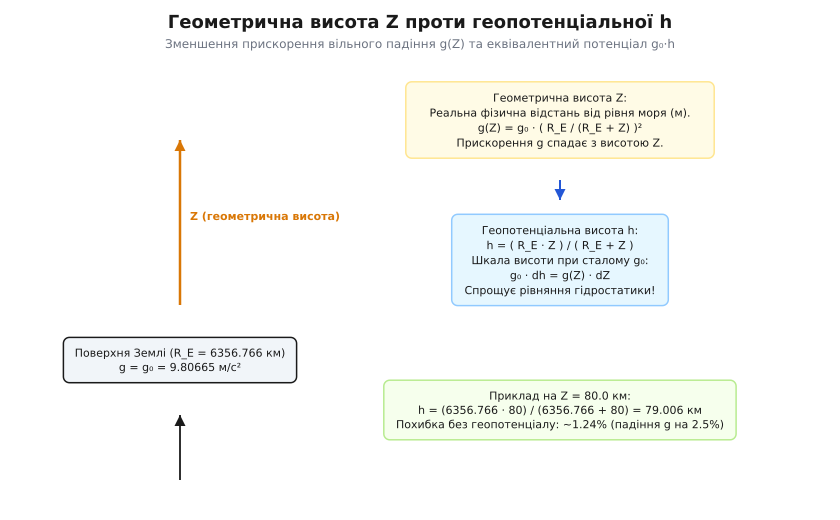
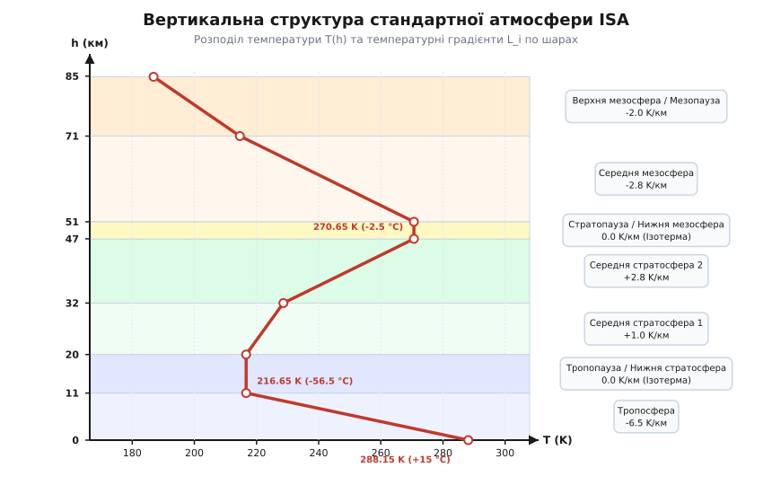
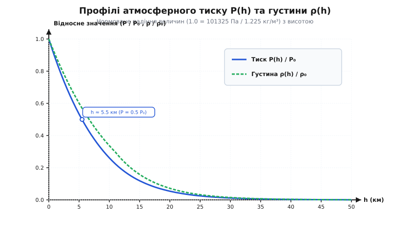
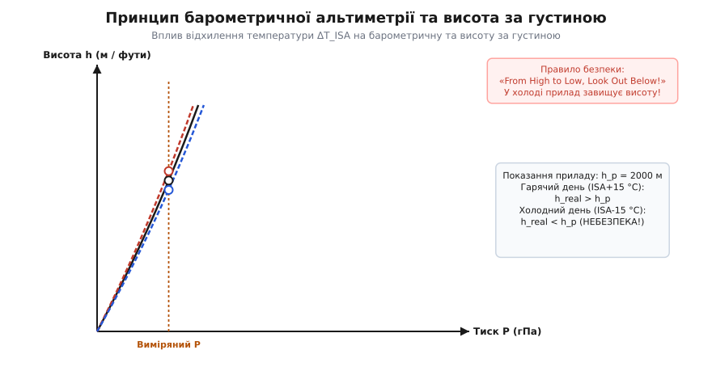

<preknowlist>
- [Закон ідеального газу](root:ph-thermodynamics/ideal-gas-law)
- [Барометрична формула](root:ph-thermodynamics/barometric-formula)
- [Адіабатичний процес](root:ph-thermodynamics/adiabatic-process)
- [Число Рейнольдса](root:ph-mechanics/reynolds-number)
- [Число Маха](root:ph-mechanics/mach-number)
- [Число Кнудсена](root:ph-mechanics/knudsen-number)
- [Рівняння Нав'є — Стокса](root:ph-mechanics/navier-stokes)
</preknowlist>

Атмосферний тиск на поверхні Землі є прямим наслідком вагового тиску колони повітря, утримуваної гравітаційним полем планети. Оскільки реальний стан земної атмосфери безперервно змінюється під впливом сонячної радіації, циклонічної активності, вологості та поривів вітру, впровадження єдиної міжнародної термодинамічної еталонної шкали стало фундаментальною передумовою розвитку авіації, ракетобудування та метеорології.

**Міжнародна стандартна атмосфера (ISA — International Standard Atmosphere)** являє собою умовну математичну модель вертикального розподілу температури, тиску, густини, швидкості звуку та в'язкості повітря, нормалізовану за міжнародними стандартами ISO 2533:1975 та ICAO Doc 7488/3 (див. вставку [Історія розвитку моделей атмосфери](root:ph-thermodynamics/standard-atmosphere/hist-isa-evolution.md)). Ця модель створює єдину координаційну систему для калібрування барометричних висотомірів, розрахунку підйомної сили крила, стандартизації льотних випробувань літаків та чисельного моделювання газодинамічних процесів від рівня моря до межі космосу.

### 1. Фізична природа та призначення еталонної атмосфери

Реальна атмосфера Землі є складною нелінійною динамічною системою, у якій термодинамічні параметри (температура, тиск, густина) варіюються залежно від геометричних координат, пори року, часу доби та поточного синоптичного стану. Якби авіаконструктори чи випробувачі літаків обчислювали підйомну силу, максимальну швидкість польоту або довжину розгону за поточними метеорологічними даними конкретного дня, порівняти характеристики різних літальних апаратів виявилося б неможливим.

Більше того, бортові авіаційні висотоміри (альтиметри) вимірюють не фізичну відстань до землі, а статичний тиск навколишнього повітря `P_static`. Перетворення виміряного тиску в показання висоти вимагає наявності суворо фіксованого розрахункового профілю `P(h)`.

Модель ISA розв'язує цю проблему шляхом введення фіксованого еталонного стану чистого сухого повітря. Вона базується на наступних фундаментальних припущеннях:
1. **Склад сухого повітря:** На всіх висотах від 0 до 86 км молярна маса сухого повітря вважається строго постійною і дорівнює `M_air = 0.0289644 кг/моль` (питома газова стала `R_spec = 287.05287 Дж/(кг·К)`).
2. **Базові умови на рівні моря (h = 0 м):**
   - Стандартний атмосферний тиск: `P_0 = 101325.0 Па = 1013.25 гПа = 760.0 мм рт. ст.`;
   - Стандартна абсолютна температура: `T_0 = 288.15 K = +15.0 °C`;
   - Стандартна масова густина: `ρ_0 = 1.2250 кг/м³`;
   - Стандартне прискорення сили тяжіння: `g_0 = 9.80665 м/с²`.
3. **Гідростатична рівновага:** Газовий стовп вважається нерухомим відносно Землі і перебуває у стаціонарній гідростатичній рівновазі під дією сили ваги та градієнта тиску.

Завдяки цим припущенням модель ISA надає математично строгий зв'язок між висотою польоту та всіма ключовими аеродинамічними й термодинамічними параметрами атмосфери.

У практичній аеродинамічній трубі випробування моделей літаків проводяться при конкретних значеннях числа Рейнольдса `Re = v · L / ν` та числа Маха `M = v / a`. Оскільки кінематична в'язкість `ν` та швидкість звуку `a` змінюються з висотою за математичними формулами ISA, інженери перераховують виміряні у трубі сили опору та підйомної сили до умов стандартного польоту на заданому ешелоні за допомогою єдиних перевідних коефіцієнтів стандарту ICAO Doc 7488/3.

### 2. Геопотенціальна висота та гравітаційне поле Землі

Фізична відстань від рівня моря до точки вимірювання, виміряна вздовж радіального напрямку від центра Землі, зветься **геометричною висотою** `Z`. Проте Земля не є нескінченною площиною з однорідним гравітаційним полем: прискорення вільного падіння `g` зменшується з віддаленням від її центра за законом всесвітнього тяжіння Ньютона.

Якщо розглядати кулясто-симетричну модель Землі радіусом `R_E`, прискорення сили тяжіння спадає за обернено-квадратичним законом:

```
g(Z) = g_0 · ( R_E / (R_E + Z) )²
```

де `g_0 = 9.80665 м/с²` — стандартне прискорення вільного падіння на широтній межі 45°45' (яка враховує як гравітаційне притягання маси Землі, так і відцентрову силу її добового обертання), а `R_E = 6356.766 км` — ефективний геопотенціальний радіус Землі.

Варто зауважити, чому у моделі ISA обрано саме значення `g_0 = 9.80665 м/с²`. Реальне прискорення вільного падіння на еліпсоїді Землі варіюється від `9.7803 м/с²` на екваторі до `9.8322 м/с²` на полюсах через сплюснутість планети та відцентрову силу обертання. Широта 45°45' являє собою географічний компроміс середніх широт Північної півкулі, де зосереджена більшість світових авіаційних маршрутів.

Інтегрування диференціальних рівнянь гідростатики зі змінним коефіцієнтом `g(Z)` призвело б до надмірно складних виразів. Щоб зберегти математичну форму рівнянь з постійним прискоренням `g_0`, у геофізиці введено **геопотенціальну висоту** `h`. Вона визначається через диференціал роботи гравітаційного поля з підйому одиниці маси:

```
dΦ = g(Z) · dZ = g_0 · dh
```

де `Φ` — питомий гравітаційний потенціал. Інтегрування цього співвідношення від поверхні моря (`Z = 0, h = 0`) до висоти `Z` дає точну дробово-раціональну формулу перетворення між геометричною `Z` та геопотенціальною `h` висотами (див. вставку [Математичне виведення барометричного закону](root:ph-thermodynamics/standard-atmosphere/math-barometric-derivation.md)):

```
h = ( R_E · Z ) / ( R_E + Z )
Z = ( R_E · h ) / ( R_E - h )
```


*Співвідношення між геометричною висотою Z, геопотенціальною висотою h та спаданням прискорення вільного падіння g(Z) із радіусом Землі.*

Фізичний зміст геопотенціальної висоти `h` полягає у тому, що потенціальна енергія підйому одиничної маси на висоту `h` у фіксованому однорідному полі `g_0` точно дорівнює реальній потенціальній енергії підйому на геометричну висоту `Z` у спадному полі `g(Z)`.

На малих висотах різниця між `Z` та `h` незначна: на тропопаузі (`11 км`) вона становить лише 19 метрів (`h = 10.981 км`). Однак на стратопаузі (`50 км`) різниця досягає 391 метра (`h = 49.609 км`), а на мезопаузі (`80 км`) перевищує 994 метри (`h = 79.006 км`, тобто майже цілий кілометр).

Нехтування геопотенціальним перетворенням на висоті 80 км призвело б до похибки обчисленого тиску понад 1.24%, а густини — понад 2.5%, що є неприпустимим для балістичного розрахунку гальмування космічних апаратів при вході у щільні шари атмосфери.

### 3. Вертикальна шар з температурою та температурні градієнти

Модель ISA розбиває повітряний океан від 0 до 86 кілометрів геометричної висоти (що відповідає 84 852 метрам геопотенціальної висоти) на 7 послідовних температурних шарів. Усередині кожного шару температура варіюється строго лінійно за геопотенціальною висотою з постійним температурним градієнтом `L = dT/dh`:

```
T(h) = T_b + L · (h - h_b)
```

де `h_b` — геопотенціальна висота основи шару, `T_b` — абсолютна температура на основі шару, а `L` — вертикальна градієнтна швидкість у kelvin на метр (K/м або K/км).


*Вертикальний профіль температури T(h) у моделі ISA від рівня моря до 86 км із позначенням градієнтів L_i та меж атмосферних шарів.*

Термодинамічні параметри меж усіх 7 шарів моделі ISA зведені в таблицю:

| № | Шар атмосфери | Геопотенціальна висота h (км) | Геометрична висота Z (км) | Градієнт L (K/км) | Базова температура T_b (K) | Базова температура (°C) |
|---|---|---|---|---|---|---|
| 0 | Тропосфера | 0.0 — 11.0 | 0.0 — 11.019 | -6.50 | 288.15 | +15.0 |
| 1 | Тропопауза / Нижня стратосфера | 11.0 — 20.0 | 11.019 — 20.063 | 0.00 | 216.65 | -56.5 |
| 2 | Середня стратосфера 1 | 20.0 — 32.0 | 20.063 — 32.162 | +1.00 | 216.65 | -56.5 |
| 3 | Середня стратосфера 2 | 32.0 — 47.0 | 32.162 — 47.351 | +2.80 | 228.65 | -44.5 |
| 4 | Стратопауза / Нижня мезосфера | 47.0 — 51.0 | 47.351 — 51.413 | 0.00 | 270.65 | -2.5 |
| 5 | Середня мезосфера | 51.0 — 71.0 | 51.413 — 71.805 | -2.80 | 270.65 | -2.5 |
| 6 | Верхня мезосфера / Мезопауза | 71.0 — 84.852 | 71.805 — 86.000 | -2.00 | 214.65 | -58.5 |

Розглянемо детально фізичні механізми формування кожного шару:

#### 1. Тропосфера (0 – 11 км, L = -6.50 K/км)
Тропосфера містить понад 75% усієї маси атмосфери та майже 99% водяної пари. Земна поверхня поглинає сонячне світло і підігріває приземне повітря знизу. Підігріте повітря піднімається вгору завдяки конвекції, адіабатично розширюючись та охолоджуючись. 

Якби повітря було абсолютно сухим, адіабатичне охолодження давало б температурний градієнт `L_dry = -g_0 / C_p ≈ -9.76 K/км`. Проте при підйомі та охолодженні вологого повітря водяна пара конденсується в хмари з виділенням прихованої теплоти пароутворення (`L_v ≈ 2.5 × 10⁶ Дж/кг`), що зменшує градієнт охолодження до `-4...-6 K/км`. Середньопланетарне значення фактичного градієнта становить саме `-6.50 K/км`, що й зафіксовано в ISA.

#### 2. Тропопауза та Нижня стратосфера (11 – 20 км, L = 0.00 K/км)
На висоті 11 км температура досягає мінімуму `216.65 K (-56.5 °C)`. У цьому шарі конвективне перемішування припиняється, оскільки температура вищележачих шарів перестає спадати з висотою. Виникає стійке ізотермічне розшарування (ізотерма), де відсутні вертикальні повітряні потоки, а панує радіаційно-інверсійна рівновага.

#### 3. Середня стратосфера (20 – 47 км, L = +1.00 та +2.80 K/км)
У цьому шарі спостерігається інверсія температури: температура зростає з висотою від `-56.5 °C` до майже кімнатної мінусової температури `-2.5 °C` (`270.65 K`) на стратопаузі. 

Причина цього інверсійного нагріву — наявність озонового шару (O3), який утворюється внаслідок фотохімічних реакцій Чепмена (`O2 + hv -> 2O`, `O + O2 + M -> O3 + M`). Молекули озону інтенсивно поглинають жорстке сонячне ультрафіолетове випромінювання (діапазони UV-B та UV-C) і перетворюють його енергію в тепловий рух молекул.

#### 4. Стратопауза та Нижня мезосфера (47 – 51 км, L = 0.00 K/км)
Вузький ізотермічний шар товщиною 4 км на межі між стратосферою та мезосферою з постійною температурою `270.65 K (-2.5 °C)`, де поглинання ультрафіолету озоном досягає насичення і балансується радіаційним випромінюванням.

#### 5. Середня та Верхня мезосфера (51 – 86 км, L = -2.80 та -2.00 K/км)
Вище 51 км концентрація озону падає до нуля, а густина повітря стає занадто малою для поглинання сонячної радіації. У цьому шарі панує потужне радіаційне охолодження за рахунок коливально-обертального випромінювання молекул вуглекислого газу (CO2) у далекому інфрачервоному діапазоні (довжина хвилі 15 мікрометрів), яка вільно залишає атмосферу і виходить у відкритий космос. 

Температура стрімко падає, досягаючи на висоті 85–86 км (мезопауза) рекордного мінімуму `186.87 K (-86.28 °C)`, що є найхолоднішим природним місцем у системі Землі (де іноді спостерігаються так звані сріблясті хмари — кристали криги на космічному пилу).

### 4. Гідростатична рівновага та математичний вивід профілів тиску й густини

Рівняння стаціонарної гідростатичної рівноваги елементарного горизонтального шару повітря площею `A` та товщиною `dh` вимагає рівності сили тиску знизу та сили ваги з тиском зверху:

```
dP / dh = - ρ · g_0
```

Виразивши густину `ρ` через тиск `P` та абсолютну температуру `T` за допомогою рівняння стану ідеального газу `P = ρ · R_spec · T`, отримуємо базове диференціальне рівняння атмосферної рівноваги зі відокремлюваними змінними:

```
dP / P = - ( g_0 / (R_spec · T(h)) ) · dh
```

Точний аналітичний розв'язок цього рівняння розпадається на два математичних випадки залежно від значення температурного градієнта `L` (див. вставку [Математичне виведення барометричного закону](root:ph-thermodynamics/standard-atmosphere/math-barometric-derivation.md)).

#### А. Інтегрування для градієнтного шару (L ≠ 0)

У шарах із лінійною зміною температури `T(h) = T_b + L · (h - h_b)` підставляємо диференціал `dh = dT / L`:

```
dP / P = - ( g_0 / (R_spec · L) ) · ( dT / T )
```

Інтегруючи обидві частини від базових умов на нижній межі шару `(h_b, T_b, P_b)` до довільної висоти `(h, T, P)`, отримуємо точну степеневу формулу тиску:

```
P(h) = P_b · ( T(h) / T_b ) ^ ( - g_0 / (R_spec · L) )
```

Густина повітря `ρ(h)` обчислюється підстановкою закону тиску в рівняння стану ідеального газу:

```
ρ(h) = ρ_b · ( T(h) / T_b ) ^ ( - ( g_0 / (R_spec · L) + 1 ) )
```

Введемо безрозмірні показники степеня. Для тропосфери (`L = -0.0065 K/м`):
- Показник степеня тиску: `n_p = -9.80665 / (287.05287 · (-0.0065)) ≈ 5.25588`.
- Показник степеня густини: `n_ρ = n_p - 1 ≈ 4.25588`.

Таким чином, у тропосфері при підйомі вгору тиск спадає пропорційно температурі у степені 5.25588, а густина — у степені 4.25588.

#### Б. Інтегрування для ізотермічного шару (L = 0)

У шарах із постійною температурою `T(h) = T_b` (тропопауза 11–20 км, стратопауза 47–51 км) градієнт дорівнює нулю. Диференціальне рівняння спрощується:

```
dP / P = - ( g_0 / (R_spec · T_b) ) · dh
```

Інтегруючи від `h_b` до `h`, отримуємо точні експоненційні закони для тиску та густини:

```
P(h) = P_b · exp( - ( g_0 · (h - h_b) ) / ( R_spec · T_b ) )
ρ(h) = ρ_b · exp( - ( g_0 · (h - h_b) ) / ( R_spec · T_b ) )
```

Величина `H_s = (R_spec · T_b) / g_0` зветься **масштабною висотою ізотермічної атмосфери**. Для нижньої стратосфери (`T_b = 216.65 K`):

```
H_s = ( 287.05287 · 216.65 ) / 9.80665 ≈ 6341.6 м ≈ 6.342 км
```

Фізичний зміст масштабної висоти `H_s` полягає у тому, що при підйомі на кожні 6.342 км усередині ізотермічного шару 11–20 км атмосферний тиск та густина зменшуються строго в `e ≈ 2.71828` рази.


*Нормовані профілі падіння барометричного тиску P(h)/P₀ та густини ρ(h)/ρ₀ з висотою до 50 км у моделі ISA.*

З графіка чітко видно стрімкий характер згасання тиску з висотою:
- На висоті 5.5 км тиск падає удвічі відносно рівня моря (`P ≈ 0.5 P_0 = 506 гПа`);
- На висоті 11 км (тропопауза) тиск становить лише 22.3% від приземного (`P = 226.32 гПа`);
- На висоті 20 км тиск падає до 5.4% (`P = 54.75 гПа`);
- На висоті 50 км (стратопауза) тиск складає лише 0.11% від приземного (`P = 1.11 гПа`).

### 5. Акустичні та молекулярно-кінетичні властивості повітряльного океану

Аеродинамічний опір літальних апаратів, хвильовий кризис крила та режими обтікання залежать не лише від тиску й густини, але й від швидкості звуку та в'язкості середовища.

#### Швидкість звуку в ідеальному газі

Поширення малих акустичних збурень (звукових хвиль) у повітрі є адіабатичним процесом зі стискальністю `a = √( (dP/dρ)|_s )`. Диференціюючи рівняння адіабати `P · ρ^(-γ) = const` (де `γ = 1.40` — показник адіабати двохатомного сухого повітря), отримуємо точний вираз для швидкості звуку:

```
a(T) = √( γ · R_spec · T )
```

Слід звернути особливу увагу на фундаментальний фізичний факт: **швидкість звуку в ідеальному газі залежить виключно від абсолютної температури `T`** і абсолютно не залежить від барометричного тиску `P` або густини `ρ`.

Для стандартних умов на рівні моря (`T_0 = 288.15 K`):
```
a_0 = √( 1.40 · 287.05287 · 288.15 ) ≈ 340.294 м/с ≈ 1225.06 км/год
```

На тропопаузі при температурі `-56.5 °C` (`216.65 K`) швидкість звуку падає до:
```
a_{11} = √( 1.40 · 287.05287 · 216.65 ) ≈ 295.07 м/с ≈ 1062.25 км/год
```

Оскільки швидкість звуку на висоті 11 км на 163 км/год нижча за приземну, літак, що летить із тією самою істинною швидкістю, на висоті наближається до звукового бар'єра набагато раніше, ніж біля землі.

#### Динамічна та кінематична в'язкість Сазерленда

Динамічна в'язкість повітря `μ` описує внутрішнє тертя між суміжними шарами газу. Згідно з молекулярно-кінетичною теорією, в'язкість виникає за рахунок переносу імпульсу хаотичним тепловим рухом молекул. Англійський фізик Вільям Сазерленд у 1893 році врахував ван-дер-ваальсові сили притягання між молекулами та вивів температурну залежність:

```
μ(T) = ( β_s · T^(3/2) ) / ( T + S )
```

де для повітря використано константи стандарту ISO 2533:
- `β_s = 1.458 × 10⁻⁶ кг/(м·с·K¹/²)`;
- `S = 110.4 K` (константа Сазерленда).

Кінематична в'язкість `ν(h) = μ(T) / ρ(h)` визначає дифузію вихорів у приграничному шарі та безрозмірне число Рейнольдса `Re = v · L / ν`. 

Оскільки густина `ρ(h)` падає з висотою експоненційно, а динамічна в мезосфері знижується лише помірно разом із температурою, кінематична в'язкість `ν` росте з висотою на кілька порядків. Біля поверхні Землі `ν_0 ≈ 1.46 × 10⁻⁵ м²/с`, на висоті 11 км `ν_11 ≈ 3.90 × 10⁻⁵ м²/с`, а на висоті 40 км `ν_40 ≈ 4.41 × 10⁻³ м²/с` (перевищує приземне значення у 300 разів!). Це призводить до кардинального падіння числа Рейнольдса на великих висотах і ламінаризації обтікання тонких профілів.

### 6. Авіаційне застосування: Альтиметрія, висота за густиною та швидкісний перерахунок

У практичній навігації пілоти не вимірюють геометричну висоту рулеткою — вони вимірюють статичний тиск навколишнього повітря за допомогою приймачів статичного тиску (Static Ports) та перераховують його у показання висотоміра (барометрична висота `h_p`).


*Принцип барометричного вимірювання висоти та зсув показань приладу при відхиленнях температури від стандарту ISA (ΔT_ISA).*

#### Вплив температурного відхилення ΔT_ISA та небезпека холоду

Калібрування барометричного висотоміра строго прив'язане до стандартного профілю ISA. Якщо реальна температура атмосфери відхиляється від ISA на величину `ΔT_ISA = T_real - T_ISA(h)`:
- **У гарячий день (ΔT_ISA > 0):** Повітря розширюється, повітряний стовп стає вищим і менш щільним. Реальна фізична висота польоту виявляється *вищою* за показання приладу (`h_real > h_p`).
- **У холодний день (ΔT_ISA < 0):** Повітря стискається, тиск падає з висотою набагато стрімкіше. Показання висотоміра залишаються оптимістично високими, але реальна фізична висота літака виявляється *значно нижчою* за показання приладу (`h_real < h_p`).

Температурна поправка висоти обчислюється за наближеною формулою:
```
Δh_corr ≈ 0.004 · ΔT_ISA · h_indicated
```
Наприклад, при польоті на показаній барометричній висоті 3000 метрів у сильний мороз (`ΔT_ISA = -30 °C`) температурна поправка становить `Δh_corr ≈ 0.004 · (-30) · 3000 = -360 метрів`. Літак опиняється на 360 метрів ближче до гірських вершин, ніж бачить пілот на приладі.

Особливо небезпечним є явище **гірських хвиль (Mountain Waves)** та ефекту Вентурі при прольоті над гірськими хребтами. Стрімкий локальний прискорювальний потік повітря у гірських проходах додатково знижує статичний тиск за законом Бернуллі. У результаті барометричний альтиметр додатково завищує показання висоти ще на 100–200 метрів, створюючи ризик зіткнення з грозовим рельєфом (CFIT — Controlled Flight Into Terrain).

Звідси походить фундаментальне авіаційне правило безпеки: **«From High to Low, Look Out Below!»** (При польоті з зони високого тиску/температури в зону низького тиску/температури без переналаштування альтиметра літак опиняється небезпечно близько до землі).

#### Налаштування барометричного тиску: QNH, QFE, QNE

Для уніфікації показань альтиметра в авіації застосовують три стандарти налаштування шкали тиску:
1. **QNH:** Налаштування шкали висотоміра на тиск, приведений до рівня моря за моделлю ISA. На землі висотомір показує офіційне перевищення аеродрому над рівнем моря. Застосовується при зльоті та посадці.
2. **QFE:** Налаштування шкали на фактичний тиск на рівні злітно-посадкової смуги. На землі висотомір показує строго `0 метрів`.
3. **QNE:** Налаштування шкали на стандартний тиск ISA `1013.25 гПа` (`29.92 inHg`). Застосовується після набору висоти переходів для польоту за **ешелонами польоту (Flight Levels — FL)**, де всі літаки використовують єдину барометричну поверхню для безпечного розходження у повітрі.

#### Висота за густиною (Density Altitude)

Густина повітря `ρ` визначає розвивану підйомну силу крила `F_y = 0.5 · C_y · ρ · v² · S` та масову витрату повітря у турбореактивних і поршневих двигунах. **Висота за густиною h_d** — це висота в моделі ISA, на якій густина повітря строго дорівнює фактичній місцевій густині вологого гарячого повітря.

Математичний алгоритм обчислення `h_d` у тропосфері:
1. `ρ_actual = P_meas / (R_spec · T_actual)`;
2. `h_d = ( T_0 / 0.0065 ) · ( 1.0 - ( ρ_actual / ρ_0 )^0.234956 )`.

На високогірних аеродромах у спекотні дні висота за густиною може перевищувати реальну висоту аеродрому на 1500–2000 метрів. Це спричиняє критичне збільшення злітної дистанції розгону та зниження швидкопідйомності, що вимагає зменшення злітної маси літака.

#### Аеродинамічні швидкості (CAS, EAS, TAS, Mach)

Прилади вимірюють швидкісний напір `q = 0.5 · ρ · TAS²`. У зв'язку з цим авіація розрізняє кілька типів швидкостей:
1. **Приладова калібрована швидкість (CAS — Calibrated Airspeed):** Показання приладу, відкаліброваного під приземну густину `ρ_0 = 1.2250 кг/м³`.
2. **Еквівалентна повітряна швидкість (EAS — Equivalent Airspeed):** Швидкість на рівні моря, яка створювала б такий самий динамічний тиск стискуваності.
3. **Істинна повітряна швидкість (TAS — True Airspeed):** Реальна швидкість руху літака відносно повітряної маси:
   ```
   TAS = CAS · √( ρ_0 / ρ )
   ```
4. **Число Маха (Mach number):** Відношення істинної швидкості до місцевої швидкості звуку `M = TAS / a(T)`.

Для автоматизації цих аеродинамічних та барометричних обчислень у сучасній авіаційній інженерії застосовують спеціалізовані обчислювальні модулі на C та C++ (див. вставку [Реалізація обчислювального ядра атмосфери ISA](root:ph-thermodynamics/standard-atmosphere/proj-isa-calculator.md) та довідник [Інтерфейс бібліотеки ISA](root:ph-thermodynamics/standard-atmosphere/api-isa-library.md)).

#### Похибки приймачів статичного тиску (Pitot-Static Errors)

На реальному літаку вимірювання статичного тиску приймачем статичного тиску (Static Port) піддається впливу аеродинамічного обтікання самого фюзеляжу чи крила. Локальне відхилення тиску біля бортового датчика через місцеве прискорення потоку описується **похибкою приймача тиску (Position Error / Static Source Error — SSEC)**.

Обчислювач повітряних сигналів (Air Data Computer) компенсує цю похибку за допомогою калібрувальної матриці:

```
P_static_true = P_measured + ΔP_SSEC( M, α, β )
```

де `M` — число Маха, `α` — кут атаки, `β` — кут ковзання. Лише після внесення SSEC поправки тиск передається в алгоритми розрахунку барометричної висоти `h_p` та істинної повітряної швидкості `TAS`.

#### Практичний приклад розрахунку для польотного закриття

Розглянемо практичний приклад навігаційного розрахунку екіпажем комерційного авіалайнера Airbus A320, який виконує політ на ешелоні `FL330` (геопотенціальна висота `h = 33000 футів ≈ 10058.4 метрів`).

За таблицями та формулами моделі ISA:
1. **Геометрична висота Z:** 
   ```
   Z = (R_E · h) / (R_E - h) = (6356766 · 10058.4) / (6356766 - 10058.4) ≈ 10074.3 м
   ```
   Реальна фізична висота літака відносно поверхні моря на 15.9 метра перевищує барометричне показання приладу.
2. **Стандартна температура T_ISA:**
   ```
   T = 288.15 - 0.0065 · 10058.4 = 222.77 K (-50.38 °C)
   ```
3. **Розрахунковий статичний тиск P:**
   ```
   P = 101325 · ( 222.77 / 288.15 )^5.25588 ≈ 26038 Па (260.38 гПа)
   ```
4. **Густина повітря ρ:**
   ```
   ρ = 26038 / ( 287.05287 · 222.77 ) ≈ 0.4072 кг/м³
   ```
   Густина повітря на цій висоті становить лише 33.2% від приземного значення.
5. **Місцева швидкість звуку a:**
   ```
   a = √( 1.40 · 287.05287 · 222.77 ) ≈ 299.21 м/с (1077.15 км/год)
   ```

Якщо анемометр вимірює індикаторну приладову швидкість `CAS = 250 вузлів (128.61 м/с)`, істинна швидкість польоту відносно повітря становить:
```
TAS = 128.61 · √( 1.2250 / 0.4072 ) ≈ 128.61 · 1.7344 ≈ 223.06 м/с (803.0 км/год)
```

Число Маха польоту при цьому дорівнює:
```
M = 223.06 / 299.21 ≈ 0.745 M
```

Цей комплексний розрахунок демонструє, як модель ISA об'єднує геометричні, термодинамічні та газодинамічні параметри у єдиний цілісний обчислювальний контур сучасного авіаційного транспорту.

#### Тепловий баланс та радіаційно-конвективний стан атмосфери

Вертикальний температурний профіль ISA є вираженням планетарної теплової рівноваги між поглинанням сонячного коротохвильового випромінювання та перевипромінюванням довгохвильової інфрачервоної радіації Землею.

Земна поверхня поглинає в середньому `240 Вт/м²` сонячної енергії і випромінює інфрачервону радіацію як сіре тіло з температурою `+15 °C`. Атмосферні гази — перш за все водяна пара (H2O), вуглекислий газ (CO2), метан (CH4) та озон (O3) — створюють **парниковий ефект**, поглинаючи довгохвильове випромінювання поверхні та випромінюючи його назад до Землі (зустрічне випромінювання атмосфери).

Лише у так званому «атмосферному вікні прозорості» (довжини хвиль 8–12 мікрометрів) інфрачервоне випромінювання поверхні вільно залишає планету. Поєднання радіаційного переносу тепла з вертикальною конвекцією тропосферної маси та фотохімічним нагрівом озонового шару створює той стійкий вертикальний розподіл температури `T(h)`, який зафіксовано в еталонній моделі ISA.

#### Термодинамічна стійкість атмосфери та потенціальна температура

Для аналізу вертикальної стійкості повітряних мас у геофізиці використовують поняття **потенціальної температури θ** — температури, яку набув би елемент повітря при адіабатичному приведенні до стандартного приземного тиску `P_0`:

```
θ = T · ( P_0 / P )^( R_spec / C_p )
```

де `R_spec / C_p = (γ - 1) / γ ≈ 0.286`.

У тропосфері потенціальна температура зростає з висотою, оскільки фактичний градієнт `L = -6.5 K/км` є меншим за абсолютним значенням за сухий адіабатичний градієнт `Γ_d = 9.76 K/км`. Це гарантує стійкість тропосферного шару відносно сухих конвективних збурень.

У стратосфері стрімке зростання температури з висотою призводить до небувало високої термодинамічної стійкості (частота Брента-Вяйсяля `N = √[ (g/θ) (dθ/dh) ]` перевищує `0.02 рад/с`), що повністю блокує будь-яке вертикальне перемішування повітряних мас і робить стратосферу ідеально ламінарною зоною для польотів надзвукової авіації.

Цей аналіз термодинамічної структури показує фундаментальне фізичне обґрунтування вибору коефіцієнтів та меж шарів Міжнародної стандартної атмосфери.

### 7. Межі застосовності моделі, сезонні відхилення та сучасні розширення

Стандарт ISA (ISO 2533:1975) строго обмежений геопотенціальною висотою 84 852 метри (86 км геометричної висоти). 

У реальному земному середовищі спостерігаються значні сезонні та широтні відхилення від середньої моделі ISA:
- **Широтна тропопауза:** У тропічних широтах інтенсивна сонячна конвекція піднімає тропопаузу до висоти 16–18 км (з температурою до `-80 °C`), тоді як над полярними регіонами тропопауза опускається до 8–9 км (з температурою `-45 °C`).
- **Сезонні температурні стандарти (MIL-STD-210C / ISO 5878):** Для розрахунку авіаційної техніки у крайніх кліматичних зонах використовують додаткові стандарти: Tropical Atmosphere (ISA+20 °C), Hot Atmosphere (ISA+30 °C) та Polar Atmosphere (ISA-30 °C).

Вище межі 86 км відбуваються фундаментальні фізичні зміни:

1. **Порушення гіпотези суцільного середовища:** Довжина вільного пробігу молекул `λ` росте від мікронів біля землі до сантиметрів і метрів. Безрозмірне число Кнудсена `Kn = λ / L_char` перевищує `0.01`, що унеможливлює використання класичних рівнянь гідродинаміки Нав'є-Стокса і вимагає переходу до молекулярно-кінетичної теорії (рівняння Больцмана).
2. **Зміна молярної маси повітря:** Нижче 86 км (в області **гомосфери**) турбулентне перемішування підтримує постійний хімічний склад сухого повітря (`M_air = 0.0289644 кг/моль`). Вище 86 км (у **гетеросфері**) починається гравітаційне та дифузійне розшарування газів, а також сонячна фотодисоціація молекул кисню `O2 -> O + O`. Молярна маса спадає, і середовище перестає описуватися єдиною газовою сталою `R_spec`.
3. **Верхні емпіричні моделі:** Для висот понад 90–100 км (термосфера та екзосфера) використовуються складніші емпіричні моделі, такі як **NRLMSISE-00** або **GRAM (Global Reference Atmospheric Model)**, які враховують сонячну активність (потік F10.7), геомагнітні бурі (індекс Ap) та локальний сонячний час.

Модель ISA залишається неперевершеним стандартом фізики атмосфери та аеродинаміки, що поєднує математичну строгість термодинамічного розв'язку з виключною практичною користю для безпеки світової авіації та аерокосмічної інженерії.
