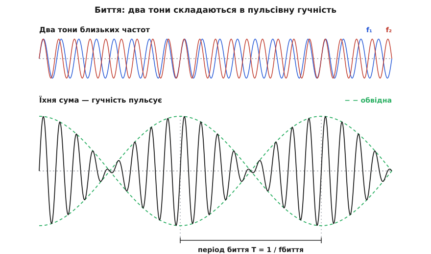
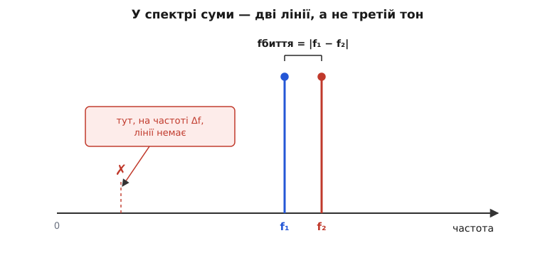
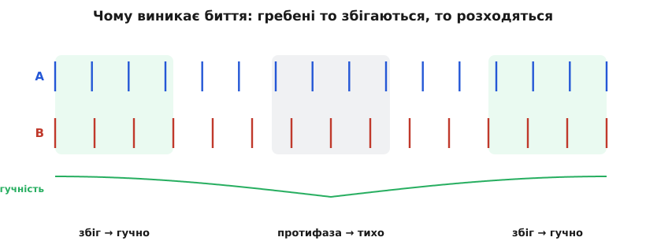

# Биття: коли два майже однакові тони то гучнішають, то стихають

<preknowlist>
- [Синусоїда](topic:ph-waves/sine-wave) — чиста хвиля однієї частоти, плавне коливання коло рівноваги.
- [Амплітуда й частота](topic:ph-waves/amplitude-frequency) — амплітуда задає розмах (гучність), частота — висоту тону: скільки коливань за секунду.
- [Суперпозиція хвиль](topic:ph-waves/wave-superposition) — дві хвилі в одній точці просто додаються миттєвими значеннями: гребінь із гребенем підсилюють, гребінь із западиною гасять.
</preknowlist>

Візьміть два камертони (*камертон* — сталева виделка, що дає чистий тон), налаштовані майже однаково: один на 440 герц, другий на 443. Ударте обидва разом — і почуєте не два звуки, а один, чия гучність повільно наростає й спадає: «ваа-ваа-ваа», рівно три рази за секунду. Тони незмінні, а гучність пульсує. Це і є **биття** (англ. *beats*, фр. *battements* — від «бити», «ударяти»: гучність немов раз у раз ударяє) — повільне, розмірене погойдування гучності, що виникає, коли складаються два коливання близьких частот.

Загадка тут справжня. Кожен тон окремо звучить рівно, без найменшої пульсації. Звідки ж береться повільний ритм, якого немає в жодному з них? І чому саме три удари за секунду для 440 і 443 — акурат різниця частот? Уся відповідь ховається в тому, як хвилі складаються.

### Дві хвилі складаються — і то дружать, то ворогують

Коли два звуки лунають разом, повітря в кожній точці не може коливатися «двічі». Воно має одне-єдине значення тиску, і це значення — проста сума того, що наказує кожна хвиля окремо: де обидві штовхають повітря в один бік, поштовхи додаються; де в протилежні — гасяться. Дві хвилі в одній точці [просто додаються миттєвими значеннями](topic:ph-waves/wave-superposition) — і вся поведінка биття випливає вже з цього одного правила.

А тепер — ключ. Дві хвилі трохи різних частот не можуть весь час крокувати в ногу. Нехай спершу їхні гребені збігаються: обидві разом штовхають повітря туди-сюди, розмахи додаються — звук гучний. Та оскільки одна хвиля трохи швидша, вона потроху випереджає другу. Минає якийсь час — і швидша встигла на пів-коливання більше: тепер її гребінь припадає на западину повільнішої. Вони штовхають повітря в протилежні боки й **гасять** одне одного — настає тиша. Швидша хвиля біжить далі, надолужує вже ціле зайве коливання — гребені знову збігаються, звук знову гучний. Це чергування «в ногу → у протифазі → знову в ногу» повторюється саме собою, і кожен його цикл — це один удар биття.


*Два чистих тони трохи різних частот (угорі) складаються в сигнал, чия гучність повільно пульсує (внизу). Швидке коливання всередині — майже спільна частота обох тонів; повільна обвідна (пунктир) — це наростання й спад розмаху. Відстань між двома «сплесками» гучності — період биття T.*

Ось чому в биття є ритм, якого немає в кожній хвилі зокрема: він народжується з **повільного розходження фаз** двох коливань. Самі тони незмінні — змінюється лише те, наскільки вони збігаються. Насправді це не що інше, як [інтерференція](topic:ph-waves/wave-interference), розтягнута в часі: там, де хвилі сходяться у фазі, — підсилення; де в протифазі — гасіння; а близькість частот лише робить цей перехід повільним і чутним.

### Скільки биттів за секунду

Тепер це легко перетворити на число, навіть не беручись за формули. За одну секунду швидша хвиля робить f₁ повних коливань, повільніша — f₂. Отже, за секунду швидша **набігає** на повільнішу рівно (f₁ − f₂) зайвих коливань. А що дає кожне набігле коливання? Рівно один повний цикл «збіглися → розійшлися → знову збіглися», тобто один гучний сплеск і одну тишу — одне биття. Тому число биттів за секунду дорівнює різниці частот:

```
f_биття = |f₁ − f₂|
```

Знак модуля тут не випадковий: биття не розрізняє, яка з частот більша. 440 і 443 дають три удари за секунду — і 440 та 437 дають ті самі три. Ця дрібниця виявиться напрочуд практичною.

**Приклад (налаштувати струну по камертону).** Камертон дає рівно 440 Гц (нота «ля»). Гітарну струну підтягують до нього; разом вони дають 3 удари за секунду. Яка частота струни?

```
f_биття  = |f_струни − 440|
3        = |f_струни − 440|
f_струни = 443 Гц   або   437 Гц
```

Само биття не каже, у який бік струна розстроєна. Але це легко з'ясувати вухом: підкрутіть кілок трішки — якщо удари **частішають**, ви йдете не туди; якщо **рідшають** і врешті завмирають — струна сходиться до 440. Мить, коли биття зникає зовсім (*zero-beat*), і є точне налаштування. Музикант, що «строїть на слух», насправді рахує саме ці удари й зводить їх до нуля.

### Несуча й обвідна: швидке коливання під повільною маскою

Придивімося до сумарного сигналу уважніше. Він виглядає як швидка хвиля, запхана під повільну «маску», що то роздуває її, то стискає до нуля. Це не омана зору — так воно і є, і це видно, щойно суму двох синусів переписати як добуток (стандартна тригонометрична тотожність «сума в добуток»):

```
sin(2π·f₁·t) + sin(2π·f₂·t) = 2 · cos(2π·(Δf/2)·t) · sin(2π·f_сер·t)
                              └── повільна обвідна ──┘ └─ швидка несуча ─┘
```

де f_сер = (f₁ + f₂)/2 — **середня** частота, а Δf = f₁ − f₂ — різниця. Права частина каже прямо: сумарний звук — це коливання на **середній** частоті (майже тій самій, що в обох тонів), чий розмах повільно «дихає» за косинусом. Оцей повільний косинус і є **обвідна** (*envelope*) — та сама маска гучності. Саме виведення цієї тотожності й того, чому все сходиться, — [у математичній вставці](topic:ph-waves/beats/math-sum-to-product.md).

Тут ховається тонкість, на якій легко схибити з двійкою. Косинус-обвідна має частоту Δf/2 — удвічі меншу за різницю. Чому ж биття ми чуємо на повній різниці Δf? Бо вухо реагує на **розмах** коливання, тобто на модуль обвідної. А модуль |cos| роздувається до максимуму **двічі** за кожен період косинуса — і на його «горбі», і на «ямі» (адже −1 за розмахом такий самий гучний, як +1). Тому гучні сплески йдуть удвічі частіше за косинус — рівно з частотою Δf. Ось звідки f_биття = |f₁ − f₂|, а не половина.

### Найважливіша тонкість: нового тону не виникає

Спокуса сказати «два тони породили третій, різницевої частоти» велика — і хибна. У повітрі немає жодного коливання на частоті Δf. Якби ви розклали сумарний звук на складові частоти — подивилися на його [частотний спектр](topic:ph-waves/frequency-spectrum) — то побачили б рівно дві лінії, на f₁ і f₂, поставлені близько одна до одної, і **нічого** на різниці Δf. Биття — не новий звук, а **візерунок гучності**, який ваше вухо зчитує зі зміни розмаху двох уже наявних тонів. Різниця Δf живе в проміжку між лініями, а не як окрема лінія.


*У спектрі суми — рівно дві лінії, на f₁ і f₂. Частота биття — це відстань між ними, а не окрема складова: на самій позиції Δf (біля нуля частот) ніякого коливання немає. Биття — це те, як ми сприймаємо повільне погойдування суми, а не третій тон.*

Це не буквоїдство — на цій межі стоїть велика інженерна відмінність. Биття виникає, коли хвилі просто **складаються** (лінійно). Але якщо пропустити два сигнали крізь **нелінійний** елемент, який їх не додає, а **перемножує**, — отоді народжуються справжні нові частоти, на сумі f₁+f₂ і на різниці f₁−f₂. Це вже не биття, а [змішування частот](topic:hw-analog/mixer), серце [супергетеродинного приймача](topic:hw-analog/superheterodyne): будь-яке радіо зсуває прийняту високу частоту вниз, перемноживши її з місцевим генератором і взявши різницеву. Плутати лінійне биття з нелінійним змішуванням — класична помилка: перше лишає спектр недоторканим, друге створює нові лінії.

### Навіщо це — від настройки роялів до радарів


*Чому биття взагалі є: два ряди гребенів із трохи різним кроком то збігаються (гучно), то розходяться в протифазу (тихо) і знову збігаються. Один повний цикл збіг-розбіг — це одне биття. Так мала різниця частот перетворюється на повільний, добре чутний ритм.*

Головна цінність биття в тому, що воно **перетворює крихітну різницю частот на повільний ритм, який легко почути й порахувати**. Дві частоти можуть відрізнятися на мільйонну частку — ока не стане, щоб побачити це на екрані. Але склади їх — і різниця вилазить назовні як неквапливе биття, яке відлічиш секундоміром. Саме так, рахуючи биття двох органних труб, Жозеф Совер ще близько 1700 року вперше виміряв **абсолютну** частоту звуку, не маючи жодного частотоміра, — [історія цього виміру](topic:ph-waves/beats/hist-sauveur.md) варта окремої розповіді.

Та сама ідея працює й донині. Музикант строїть рояль, гітару чи скрипку, зводячи биття між струною й еталоном до нуля. Пілот двомоторного літака синхронізує гвинти на слух: доки оберти трохи різні, у кабіні стоїть докучливе «во-во-во» від биття, і його прибирають, підганяючи один двигун, аж поки пульсація не завмре. А в радарі та лідарі, що міряють дальність, приймач **навмисне** створює биття: відбитий сигнал повертається трохи зсунутим за частотою, і [частота цього биття прямо пропорційна відстані до цілі](root:embedded/lidar-architecture) — порахував удари, дізнався дальність. Як власне виміряти частоту биття в коді — виділити обвідну й полічити її сплески, а тоді звести до нуля, як робить тюнер, — показано [в окремому розборі з кодом](topic:ph-waves/beats/proj-beat-detect.md).

> 🔧 **Навіщо це.** Биття — це універсальний спосіб **виміряти малу різницю частот** і **звести високу частоту до низької, яку легко полічити**. Щоразу, коли треба точно порівняти два джерела (два кварци, еталон і струну, місцевий генератор і прийняту хвилю), їх складають або змішують і дивляться на биття: доки воно є — частоти різні; зникло — зійшлися. На цьому стоять настройка інструментів, звірка еталонів частоти, вимірювання дальності у FMCW-радарах і лідарах, зсув частоти в кожному радіоприймачі. Крихітна різниця, невидима напряму, стає повільним ритмом — а ритм і людина, і прилад ловлять чудово.

### Що варто винести

**Биття** — повільне погойдування гучності, що виникає, коли складаються два коливання близьких частот. Причина — **повільне розходження фаз**: близькі, але різні частоти то збігаються (підсилення), то стають у протифазу (гасіння), і кожен такий цикл — один удар. Частота биття дорівнює різниці частот, f_биття = |f₁ − f₂|. Формально сума двох синусів — це швидка **несуча** на середній частоті під повільною **обвідною**; гучність б'ється на повній різниці Δf, бо реагує на модуль обвідної. Найтонше: **нового тону не виникає** — у спектрі лишаються ті самі дві лінії, а биття є візерунком їхнього спільного розмаху (на відміну від нелінійного змішування, що справді народжує різницеву частоту). І саме тому биття безцінне: воно робить чутною й лічильною різницю частот, надто малу, щоб її побачити прямо.
