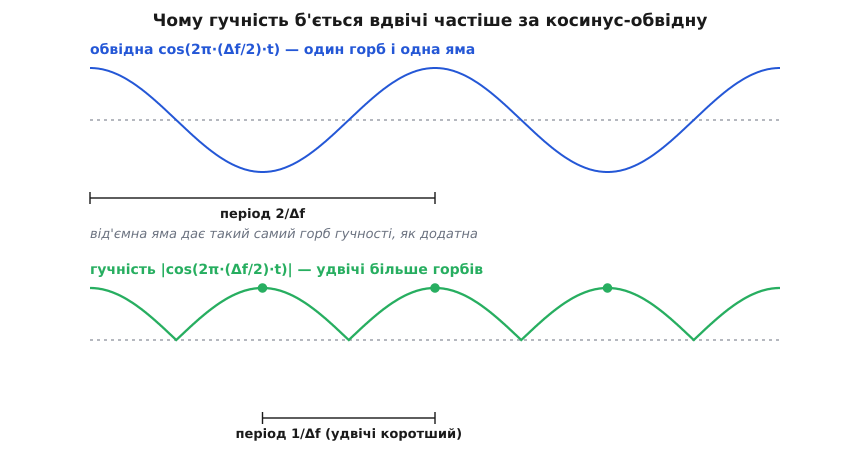
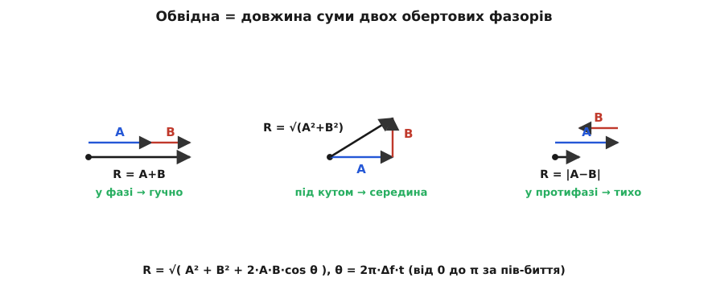
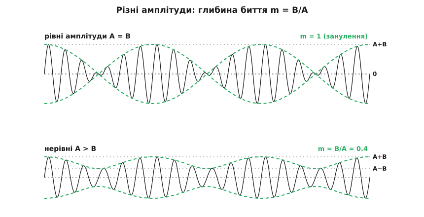

# 🧮 Сума в добуток: звідки в биття несуча й обвідна

Око не бреше. Коли на екрані осцилографа складаються два майже однакові тони, видно швидке коливання, запхане під повільну маску, що то роздуває його, то стискає до нитки. Але ж записали ми не добуток «швидке × повільне», а просту **суму** двох синусів — там немає жодного множення. То звідки маска? Уся річ у тім, що сума й добуток тут — це той самий вираз, записаний двома способами. Одна тригонометрична тотожність перекидає між ними місток, і щойно ми її виведемо, «несуча» й «обвідна» перестануть бути словами з картинки й стануть точними множниками формули — а заразом з'ясується, чому гучність б'ється на повній різниці частот, що буває при різних амплітудах і чому все це — та сама амплітудна модуляція, яку роблять у радіо.

### Що взагалі означає «сума в добуток»

Ми маємо суму двох чистих тонів рівної амплітуди:

```
s(t) = sin(2π·f₁·t) + sin(2π·f₂·t)
```

Ліворуч — два доданки, кожен зі своєю частотою. Твердження, яке доведемо, каже: цю суму можна переписати як **один** добуток двох множників — повільного й швидкого:

```
sin(2π·f₁·t) + sin(2π·f₂·t) = 2·cos(2π·(Δf/2)·t)·sin(2π·f_сер·t)
```

де f_сер = (f₁ + f₂)/2 — **середня** частота, а Δf = f₁ − f₂ — різниця. «Сума в добуток» — це і є перехід від лівого запису до правого. Наголосімо одразу, бо на цьому все стоїть: це **тотожність**, тобто рівність, справедлива для кожного моменту t, а не наближення для «близьких частот». Ліва й права частини — буквально одна й та сама функція. Близькість f₁ і f₂ нічого в цій рівності не змінює; вона лише робить один із множників повільним, і саме тому ми чуємо його як биття.

### Правильні змінні: середнє й піврізниця

Перш ніж штовхати алгебру, варто зрозуміти, **чому** така перебудова взагалі можлива — тоді формула не впаде з неба. Уявіть два однакові годинники, що йдуть майже, але не зовсім однаково. Про пару таких годинників природно питати не «котра на кожному», а дві інші речі: яку **середню** позицію вони показують і **наскільки розійшлися** їхні стрілки. Перше змінюється швидко (обидві стрілки біжать), друге — повільно (розбіжність накопичується поволі).

Фази наших тонів — це кути, що рівномірно ростуть: α = 2π·f₁·t і β = 2π·f₂·t. Замість них візьмімо ту саму пару природних величин — **середнє** й **піврізницю**:

```
S = (α + β)/2      (спільний, швидкий кут)
D = (α − β)/2      (розбіжність, повільний кут)
```

Тоді кожну вихідну фазу видно як «середнє плюс-мінус розбіжність»:

```
α = S + D
β = S − D
```

Ось і вся ідея. Тон f₁ — це «середній тон, що трохи забіг уперед» (S + D), тон f₂ — «середній, що трохи відстав» (S − D). Одразу видно, що S росте зі швидкістю f_сер, а D — зі швидкістю (f₁ − f₂)/2, тобто повільно. Лишається чесно розкласти суму синусів у цих змінних.

### Виведення тотожності

Уся робота — у формулах додавання кутів: sin(S ± D) розписується через синуси й косинуси самих S і D. Це базові [тригонометричні тотожності](topic:math-geometry/trig-identities): sin від суми кутів — це «синус першого на косинус другого плюс косинус першого на синус другого», а для різниці другий доданок міняє знак. Запишімо обидва доданки нашої суми:

```
sin(S + D) = sin S · cos D + cos S · sin D
sin(S − D) = sin S · cos D − cos S · sin D
```

Тепер додаймо їх. Члени з cos S · sin D мають протилежні знаки й **гинуть**, а два однакові sin S · cos D **додаються**:

```
sin(S + D) + sin(S − D) = 2 · sin S · cos D
```

Це і є вся тотожність — лишилося підставити назад S і D. Оскільки sin(S+D) — то наш перший тон, а sin(S−D) — другий:

```
sin α + sin β = 2 · sin( (α+β)/2 ) · cos( (α−β)/2 )
```

А тепер повернімо частоти. Середина: (α+β)/2 = 2π·(f₁+f₂)/2·t = 2π·f_сер·t. Піврізниця: (α−β)/2 = 2π·(f₁−f₂)/2·t = 2π·(Δf/2)·t. Підставляємо:

```
sin(2π·f₁·t) + sin(2π·f₂·t) = 2 · sin(2π·f_сер·t) · cos(2π·(Δf/2)·t)
```

Готово — точно та рівність, яку обіцяли. Два тони справді складаються в добуток швидкого синуса на повільний косинус, і жодного наближення ми не робили: у виведенні тільки формули додавання й скорочення.

Хто любить ще коротший шлях — його дає [формула Ейлера](topic:math-analysis/euler-formula), яка каже, що синус кута є уявною частиною одиничного оберту e^(iθ). Тоді сума двох обертів виноситься за дужку спільним «середнім» обертом: e^(iα) + e^(iβ) = e^(iS)·(e^(iD) + e^(−iD)) = 2·cos D · e^(iS). Уявна частина правого боку — це 2·cos D · sin S, тобто той самий добуток, здобутий одним рядком без розписування синусів. Обидва шляхи ведуть в одне місце, бо це одна й та сама алгебра.

> 🔧 **Навіщо це.** Ця пара тотожностей — стара робоча конячка. До появи логарифмів (1614) астрономи перетворювали нею множення на додавання (прийом звався *prosthaphaeresis*, від гр. «додавання-віднімання»); винахід був колективний — до нього руку доклали Йоганн Вернер, Пауль Віттіх, Йост Бюрґі та інші, а найвідоміше ним рахував Тихо Браге. Ми читаємо ту саму тотожність у зворотний бік — з добутку в суму й назад, — і саме цей поворот перетворює незрозумілу «пульсацію гучності» на прозорий добуток двох множників, кожен зі своїм ясним змістом.

### Несуча й обвідна — точна рівність, а не натяк

Тепер права частина читається як речення. Множник sin(2π·f_сер·t) — це чисте коливання на **середній** частоті; коли f₁ і f₂ близькі, воно майже не відрізняється від жодного з тонів. Це **несуча** (*carrier*): швидка хвиля, яка власне й доносить звук. Другий множник, 2·cos(2π·(Δf/2)·t), від часу залежить **повільно** (бо Δf/2 — маленьке) і грає роль амплітуди, що поволі змінюється. Це **обвідна** (*envelope*): та сама маска, що роздуває й стискає несучу.

Ключове тут — що це рівність, а не мальовниче порівняння. Сумарний сигнал **не** «схожий на» модульовану несучу — він **дорівнює** їй у кожній точці. Осцилограф малює добуток не тому, що око так витлумачило суму, а тому, що сума і є цей добуток. Тому має сенс говорити про миттєву амплітуду сигналу — вона дорівнює |2·cos(2π·(Δf/2)·t)|, — хоч у вихідному записі ніякої «амплітуди, що змінюється», на позір немає.

### Чому гучність б'ється на повній різниці, а не на половині

Отут криється двійка, на якій легко спіткнутися. Обвідна 2·cos(2π·(Δf/2)·t) має частоту Δf/2 — удвічі меншу за різницю частот. Здавалося б, і гучність мала б погойдуватися з частотою Δf/2. А чуємо ми биття на **повній** різниці Δf. Звідки зайва двійка?

Річ у тім, що вухо (як і будь-який детектор гучності) реагує не на знак обвідної, а на її **розмах** — на модуль |cos|, а не на сам cos. А модуль усе міняє. Косинус за один свій період один раз здіймається до +1 і один раз опускається до −1. Але для гучності −1 такий самий гучний, як +1: несуча з розмахом «мінус два» гойдає повітря так само сильно, як із розмахом «плюс два», просто в протилежну фазу. Тому |cos| має **два** максимуми там, де сам cos має один додатний горб і одну від'ємну яму:

```
cos(2π·(Δf/2)·t)   — період  2/Δf,   один «+горб» і одна «−яма» за період
|cos(2π·(Δf/2)·t)| — період  1/Δf,   два однакові горби гучності за той самий час
```

Гучні сплески йдуть удвічі частіше за сам косинус — рівно з частотою Δf. Ось звідки f_биття = |f₁ − f₂|, а не половина: не з якоїсь окремої фізики, а просто тому, що гучність бачить модуль обвідної.


*Обвідна-косинус (угорі) за свій період один раз здіймається вгору й один раз опускається вниз. Гучність (унизу) — це її модуль: від'ємна яма стає таким самим горбом, тож горбів удвічі більше, а період удвічі коротший. Тому биття чутне на повній різниці Δf, хоч косинус коливається на Δf/2.*

Тут же ховається річ, важлива поза акустикою: у кожній точці, де cos переходить через нуль, обвідна змінює **знак**, і несуча стрибком повертає фазу на 180°. Вухо цього не чує — воно чує лише гучність, яка в ту мить дорівнює нулю. Але прилад, що стежить за самою хвилею, ці перевороти фази бачить, і вони визначають, чи вдасться відновити повільний сигнал простим детектором. До цього повернемося наприкінці.

### Обвідна як довжина суми фазорів

Виведення через «сума в добуток» гарне, але має ваду: воно чисто розкладається лише коли амплітуди тонів **рівні**. Є глибший, загальніший спосіб дістати обвідну — через обертові стрілки, і він одразу пояснює і повну частоту биття, і що буде при різних амплітудах.

Уявімо кожен тон [фазором](topic:ph-electromagnetism/phasors) — стрілкою сталої довжини, що рівномірно обертається навколо початку; висота (проєкція) її кінця в кожну мить і є миттєве значення синуса. Перший тон — стрілка завдовжки A, що крутиться зі швидкістю f₁; другий — стрілка завдовжки B зі швидкістю f₂. Сума двох синусів — це висота **суми** двох стрілок, складеної як вектори. А оскільки одна крутиться трохи швидше за другу, **кут між ними** не стоїть на місці, а поволі росте:

```
θ(t) = (2π·f₁·t) − (2π·f₂·t) = 2π·Δf·t
```

Довжина сумарної стрілки — це і є миттєва амплітуда (обвідна) сумарного сигналу. Знайти її дає теорема косинусів для трикутника, складеного з двох стрілок:

```
R(t) = √( A² + B² + 2·A·B·cos(2π·Δf·t) )
```

Ця формула — точна обвідна для **будь-яких** амплітуд. І гляньте, як чисто вона все пояснює. Коли стрілки дивляться в один бік (θ = 0), довжини складаються: R = A + B, найгучніше. Коли дивляться в протилежні (θ = π), одна гасить другу: R = |A − B|, найтихіше. Найважливіше: під косинусом стоїть 2π·Δf·t — тобто R повторюється з періодом 1/Δf, з **повною** різницею частот. Ніякої зайвої двійки тут уже нема: фазорна картина від початку рахує гучність, тож усе природно виходить на Δf.


*Кожен тон — обертова стрілка (A синя, B червона). Кут між ними θ = 2π·Δf·t поволі росте. Довжина суми (чорна) — це гучність: у фазі (ліворуч) стрілки складаються в A+B, під прямим кутом (посередині) дають √(A²+B²), у протифазі (праворуч) — |A−B|. За теоремою косинусів R = √(A²+B²+2AB·cosθ), і цикл від A+B до |A−B| і назад — одне биття.*

Що фазорна картина узгоджена з тотожністю «сума в добуток» — легко перевірити для рівних амплітуд A = B. Підставимо B = A:

```
R = √( A² + A² + 2·A²·cos(2π·Δf·t) ) = A·√( 2·(1 + cos(2π·Δf·t)) )
```

За тотожністю половинного кута 1 + cos φ = 2·cos²(φ/2), тож під коренем виходить повний квадрат:

```
R = A·√( 4·cos²(π·Δf·t) ) = 2·A·|cos(π·Δf·t)| = 2·A·|cos(2π·(Δf/2)·t)|
```

Це рівно модуль обвідної з формули «сума в добуток». Отже, обидва погляди — той самий об'єкт: |cos| із його роздвоєнням горбів і √(…) із його чесним періодом 1/Δf — це одна крива, і двійка в «Δf проти Δf/2» просто зашита у знак модуля.

### Різні амплітуди: неповне занулення і глибина модуляції

Тепер видно, що дає нерівність амплітуд. Поки A = B, найтихіша мить — це R = |A − B| = 0: стрілки в протифазі гасять одна одну повністю, звук на мить зникає зовсім. А щойно амплітуди різні (нехай A > B), у протифазі лишається «недогашений» залишок довжиною A − B ≠ 0 — тиша вже не абсолютна, лунає слабкий рівний тон. Биття стає мілкішим.

Це видно й прямо з алгебри, якщо відщепити від більшого тону рівну частину. Запишімо A = B + (A − B) і застосуймо «сума в добуток» до рівної частини:

```
A·sin(2π·f₁·t) + B·sin(2π·f₂·t)
   = B·[ sin(2π·f₁·t) + sin(2π·f₂·t) ] + (A − B)·sin(2π·f₁·t)
   = 2B·cos(2π·(Δf/2)·t)·sin(2π·f_сер·t)  +  (A − B)·sin(2π·f₁·t)
     └──────── повне биття амплітуди 2B ────────┘   └─ рівний залишок ─┘
```

Читається прямо: сигнал розпадається на биття «в повний мах» амплітудою 2B (яке саме собою занулюється) плюс **сталий залишковий тон** амплітудою (A − B), що биттю зникнути не дає. Тому повний розмах гуляє між максимумом і мінімумом:

```
R_макс = A + B      (стрілки у фазі)
R_мін  = A − B      (у протифазі, недогашений залишок)
```

Наскільки глибоке провалля робить биття, міряють однією безрозмірною величиною — **глибиною модуляції** m: наскільки розмах падає від піка до дна, віднесене до їхньої суми:

```
m = (R_макс − R_мін) / (R_макс + R_мін)
  = ( (A+B) − (A−B) ) / ( (A+B) + (A−B) )
  = 2B / 2A
  = B / A          (за умови A ≥ B)
```

Тобто глибина биття — це просто відношення слабшого тону до сильнішого. Рівні амплітуди дають m = 1 (100%): дно сягає нуля, повне занулення. Якщо ж один тон удесятеро слабший (B/A = 0.1), то m = 0.1 — гучність гуляє лише на десяту частку, ледь помітно. А зникне слабший зовсім (B = 0) — m = 0, биття нема: лишився один рівний тон.

**Приклад (мілке биття від нерівних тонів).** Складаються тони з амплітудами A = 1.0 і B = 0.6, різниця частот Δf = 4 Гц. Який максимум, мінімум і глибина?

```
R_макс = A + B = 1.6
R_мін  = A − B = 0.4          (звук не зникає — лишається 0.4)
m      = B/A  = 0.6           (60% глибини)
f_биття = Δf  = 4 удари/с
```

Отже, замість повних сплесків «гучно — тиша» чути неквапливе «гучніше — тихіше» вчетверо на секунду, з дном на рівні 0.4 від максимуму. Биття є, але вже не б'є навідліг.


*Угорі — рівні тони (A = B): обвідна щоразу торкається нуля, глибина m = 1, повне занулення. Унизу — нерівні (A > B): обвідна гуляє між A+B і A−B, дна не сягає, глибина m = B/A. Що ближчі амплітуди, то глибше провалля биття.*

### Биття — це двобічна модуляція, тільки складанням

Наостанок варто побачити, куди веде та сама тотожність в інженерії. Права частина рівності для рівних амплітуд — 2·cos(2π·(Δf/2)·t)·sin(2π·f_сер·t) — це **добуток** повільного сигналу cos(2π·(Δf/2)·t) на несучу sin(2π·f_сер·t). Але саме такий добуток видає перемножувач у радіопередавачі: несучу множать на корисний сигнал. Отже, сума двох рівних тонів — це те саме, що й **двобічна модуляція з пригніченою несучою** (DSB-SC): у спектрі дві бічні лінії, симетричні відносно середньої частоти, а самої лінії несучої на f_сер нема. Ці дві бічні смуги на f_сер ± Δf/2 — і є наші вихідні тони f₁ і f₂.

Тотожність тут працює в обидва боки, і це варто побачити явно. Розкриваючи добуток назад тим самим правилом (2·cos a · sin b = sin(b+a) + sin(b−a)), дістаємо:

```
2·cos(2π·(Δf/2)·t)·sin(2π·f_сер·t) = sin(2π·f₁·t) + sin(2π·f₂·t)
```

Коло замкнулося: перемножити несучу на повільний сигнал — це буквально те саме, що додати два тони на бічних частотах. Ось чому биття виглядає **точно** як амплітудно-модульований сигнал, дарма що зроблене простим лінійним складанням, а не множенням у нелінійному вузлі. (Це не суперечить тому, що биття не породжує нових частот: коли перемножуються два **чисті** тони, як тут, добуток розкладається рівно на дві наявні лінії; нові частоти народжує лише перемноження ширших сигналів.)

А що ж звичайне [амплітудно-модульоване](topic:com-modulation/am-fm) радіо, яке detector-діод чесно демодулює? Воно відрізняється від чистого биття однією деталлю — **несучою**. У DSB-SC (нашому битті) у протифазу обвідна проходить через нуль і несуча перевертає фазу; простий детектор-обвідної на цьому спотикається — він видає модуль |cos| і, як ми бачили, подвоює частоту. Щоб детектор працював, у сигнал **додають сильну несучу** — рівний тон посередині, точнісінько як залишок (A − B) у прикладі з нерівними амплітудами не давав звукові зникнути. Ця несуча тримає обвідну додатною, перевороти фази зникають, і діод відновлює повільний сигнал напряму. Глибина цього провалля — та сама m: у радіо її звуть **індексом модуляції**, і тримають m ≤ 1, щоб обвідна не сягала нуля й не перекидалася. Отже, чисте биття — це AM з m = 1 і без несучої; звичайне мовлення — AM з несучою й m < 1; а нерівні тони з їхнім залишком лежать якраз між цими крайніми випадками.

### Що з цього лишається

Уся поведінка биття витікає з однієї тотожності «сума в добуток», виведеної в кілька рядків із формул додавання кутів. Вона перетворює суму двох синусів на **несучу** на середній частоті під **обвідною** на піврізниці — і це точна рівність, а не образ. Гучність б'ється на повній різниці Δf, бо чує модуль обвідної, а |cos| подвоює горби. Загальніший фазорний погляд дає обвідну R = √(A² + B² + 2AB·cos(2π·Δf·t)) для будь-яких амплітуд, від початку з правильним періодом 1/Δf; він показує, що повне занулення буває лише при рівних амплітудах, а взагалі биття має **глибину** m = B/A. І та сама формула, прочитана як добуток, виявляє: биття — це двобічна модуляція з пригніченою несучою, рідна сестра амплітудної модуляції в радіо, тільки зроблена складанням, а не множенням.
