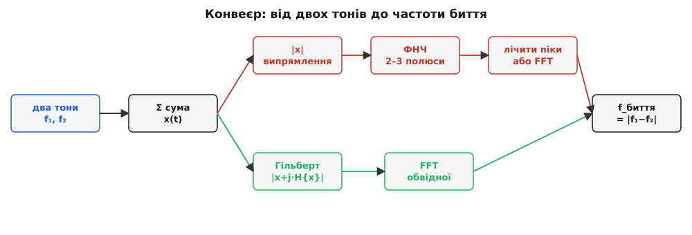
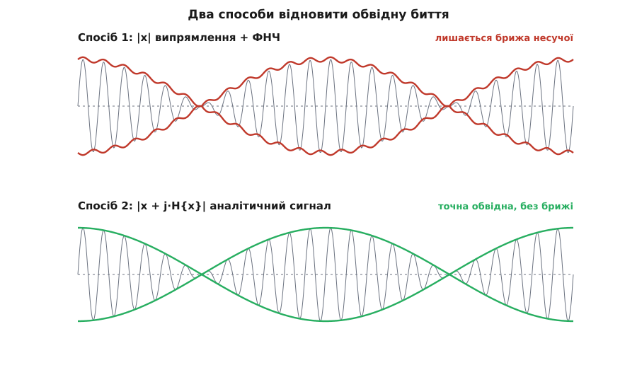

# ⚙️ Полічити биття в коді: обвідна, тюнер і дальність

Ми маємо два майже однакові тони. Разом вони дають звук, чия гучність повільно погойдується — то голосніше, то тихіше, — і швидкість цього погойдування дорівнює різниці їхніх частот. Це чутно вухом. А тепер задача інженера: **дістати цю швидкість числом із самого сигналу** — не знаючи наперед f₁ і f₂, маючи лише масив відліків. Розв'язати її означає одразу дістати три речі: цифровий тюнер, що зводить биття до нуля; спосіб порівнювати два еталони частоти з точністю до частки герца; і серце FMCW-радара, де частота биття прямо каже дальність до цілі.

Уся робота розкладається на два кроки. Спершу з швидкого пульсівного сигналу треба **витягти обвідну** — ту повільну «маску» гучності, що дихає з частотою биття. Потім — **виміряти частоту цієї обвідної**. Обидва кроки мають по кілька способів, і вибір між ними — це і є справжня інженерія цієї задачі.


*Загальний конвеєр. Із суми двох тонів обвідну дістають або дешевим випрямленням із фільтром (верхня доріжка), або точним аналітичним сигналом (нижня). Далі частоту обвідної читають — надійніше за все через FFT.*

### Згенерувати сигнал

Почнемо з того, що зробимо сам звук. Візьмемо стандартну для звуку частоту відліків 44100 Гц і складемо два синуси — «ля» камертона й трохи розстроєну струну:

```python
import numpy as np

fs  = 44_100                 # частота відліків, Гц
dur = 2.0                    # тривалість, с
t   = np.arange(int(fs * dur)) / fs

f1, f2 = 440.0, 443.0        # два майже однакові тони
x = np.sin(2*np.pi*f1*t) + np.sin(2*np.pi*f2*t)
```

Масив `x` — це вже наш «мікрофон»: 88200 чисел, у яких сховане биття на 3 герци. Око його не бачить (там 440 швидких коливань за секунду), але воно там є — як повільне роздування розмаху. Наше завдання — навчити код бачити це роздування.

Частоту відліків беруть не абияк: вона мусить бути більш ніж удвічі вища за найвищу частоту в сигналі, інакше швидкі коливання «складуться» на низькі й усе зіпсують. Тут 44100 ≫ 2·443, запас величезний.

> 🔧 **Навіщо це.** Той самий масив `x` — модель будь-якої пари близьких джерел: двох кварцових генераторів, місцевого гетеродина й прийнятої хвилі, випроміненого й відбитого чирпа радара. Навчившись діставати биття з `x`, ви дістаєте його звідусіль.

### Обвідна, спосіб перший: випрямити й згладити

Найдешевший спосіб побачити обвідну спирається на просту думку. Швидка несуча однаково кидає сигнал і вгору, і вниз; знак нам не цікавий — цікавий **розмах**. Тож візьмімо модуль `|x|`: тепер сигнал завжди додатний і горбиться там, де розмах великий, тулиться до нуля там, де він малий. Модуль уже несе форму обвідної — тільки поверх неї лишилася швидка «брижа» від згорнутих донизу півхвиль несучої. Її треба пригладити фільтром низьких частот, який пропускає повільне (биття на 3 Гц) і глушить швидке (несуча на 440 Гц).

Найпростіший такий фільтр — однополюсний, з одним рядком стану: кожен новий вихід є зваженою сумішшю попереднього виходу й нового входу. Коефіцієнт `a` близький до одиниці — фільтр «пам'ятає» минуле й тому згладжує:

```python
def envelope_rectify(x, fs, cutoff=20.0):
    """Обвідна через випрямлення |x| і однополюсний ФНЧ."""
    a = np.exp(-2*np.pi*cutoff/fs)      # полюс фільтра за частотою зрізу
    y = np.empty_like(x)
    acc = 0.0
    for n in range(len(x)):
        acc = a*acc + (1 - a)*abs(x[n])  # згладжуємо модуль сигналу
        y[n] = acc
    return y
```

Частоту зрізу `cutoff` ставлять у щілину між двома масштабами: вище за биття (щоб його не зачепити), нижче за несучу (щоб її прибрати). Двадцять герц для нашого випадку — саме там: набагато вище за 3 і набагато нижче за 440.

Цей детектор — той самий, що стоїть у копійчаному AM-радіоприймачі: діод випрямляє, конденсатор згладжує. Він швидкий, іде за один прохід масиву, працює навіть на восьмибітному контролері. Але в нього є вада, до якої ми зараз повернемось: однополюсний фільтр спадає надто полого, і дрібка несучої бриж все одно просочується у вихід.

### Обвідна, спосіб другий: аналітичний сигнал

Є куди елегантніший спосіб, який дає обвідну **точно**, без жодної брижі. Ідея гарна. Уявіть, що до нашого дійсного сигналу `x(t)` дібрали уявного напарника `y(t)` — таку саму хвилю, але зсунуту по фазі рівно на чверть періоду (на 90°). Там, де `x` іде як косинус, `y` іде як синус. Складімо їх у комплексне число `z = x + j·y`. Це число крутиться на комплексній площині, а його **модуль** `|z| = √(x² + y²)` — це і є миттєвий розмах коливання: поки вектор обертається, довжина його лишається рівною амплітуді. Косинус і синус разом дають сталу довжину (адже cos² + sin² = 1), тож множник-амплітуда виходить голим, без будь-якої брижі несучої.

Той уявний напарник — це **перетворення Гільберта** сигналу, а пара `x + j·H{x}` зветься [аналітичним сигналом](root:com-modulation/analytic-signal): дійсна хвиля, доповнена своєю зсунутою на 90° копією так, що модуль дає миттєву амплітуду, а кут — миттєву фазу. Обчислити його найлегше через частоти: у спектрі дійсного сигналу кожна частота присутня двічі — як додатна й як дзеркальна від'ємна. Аналітичний сигнал дістають, викинувши від'ємні частоти й подвоївши додатні:

```python
def analytic_signal(x):
    """x + j·H{x}: обнуляємо від'ємні частоти, подвоюємо додатні."""
    N = len(x)
    X = np.fft.fft(x)
    h = np.zeros(N)
    h[0] = 1                    # стала складова — лишаємо як є
    if N % 2 == 0:
        h[N//2]    = 1          # частота Найквіста — як є
        h[1:N//2]  = 2          # решта додатних — подвоїти
    else:
        h[1:(N+1)//2] = 2
    return np.fft.ifft(X * h)

env_hil = np.abs(analytic_signal(x))    # миттєва амплітуда = обвідна
```

Для нашої пари тонів тут можна навіть не вгадувати — обвідна виходить точно `2·|cos(π·Δf·t)|`, де Δf = 3 Гц. Перевірка це підтверджує до останнього знаку: різниця між `env_hil` і цією формулою — нуль. Ось у чому сила методу: він не наближає обвідну, а відновлює її буквально.


*Одна й та сама пара тонів, дві обвідні. Зверху — випрямлення з однополюсним фільтром: форма правильна, але по верху повзе залишкова брижа несучої, і саме вона потім плодить фальшиві піки. Знизу — аналітичний сигнал: обвідна гладенька, точно `2·|cos(π·Δf·t)|`.*

За чистоту доводиться платити: аналітичний сигнал рахують через повне пряме й зворотне перетворення Фур'є, а це вже [FFT](root:com-signal/fft) з ціною O(N·log N) і потребою тримати весь блок у пам'яті. На настільному комп'ютері це дрібниця, на мікроконтролері — розкіш. Тому в житті обидва методи живуть поруч: дешевий випрямляч там, де рахують кожен такт, і аналітичний сигнал там, де важлива точність.

### Полічити частоту биття

Обвідну дістали. Тепер треба сказати, як швидко вона пульсує. Найнадійніший спосіб — не мудрувати з піками, а взяти спектр самої обвідної: у ній сидить одна повільна складова, на частоті биття, і FFT знайде її одразу. Спочатку прибираємо сталу складову (обвідна вся додатна, і без цього переможе нульовий бін), тоді беремо найпотужнішу лінію:

```python
def beat_freq_fft(env, fs):
    """FFT обвідної: беремо найпотужніший бін, крім сталого."""
    e = env - env.mean()                 # прибрати DC, щоб не переміг бін 0
    spec  = np.abs(np.fft.rfft(e))
    freqs = np.fft.rfftfreq(len(e), 1/fs)
    spec[0] = 0
    return freqs[np.argmax(spec)]

print(beat_freq_fft(env_hil, fs))                       # -> 3.0
print(beat_freq_fft(envelope_rectify(x, fs), fs))       # -> 3.0
```

Обидві обвідні — і точна, і дешева — дають рівно 3.0 Гц. FFT тим і гарний, що йому байдуже до залишкової брижі: вона сидить на 880 Гц, окремим піком геть в іншому кінці спектра, і на пошук найповільнішої лінії не впливає.

Заманливо здається інший, «прямий» шлях: полічити піки обвідної. Один горб гучності — одне биття; полічив горби за секунду — маєш частоту. На чистій, аналітичній обвідній це справді працює й дає ті самі 3 Гц. Але спробуйте те саме на дешевій, випрямленій — і код нарахує **882** удари замість трьох. Пастка в тому, що наївний пошук локального максимуму («сусіди нижчі») ловить кожну найдрібнішу зубчину залишкової брижі несучої, а не лише справжні горби биття. І гірше: скільки не піднімай крутість фільтра, поки лишається бодай мікроскопічна брижа, наївний лічильник піків знаходить її. Тому пікам можна довіряти лише на по-справжньому гладкій обвідній — або обвідну спершу треба **проредити** (взяти кожен, скажімо, двохсотий відлік): на низькій частоті відліків швидка брижа зникає, і залишається сама повільна пульсація. Але простіше не воювати з піками зовсім, а віддати роботу FFT.

### Тюнер: звести биття до нуля

Тепер зберемо з цього тюнер. Музикант не міряє частоту струни — він слухає биття між струною й еталоном і крутить кілок, поки воно не вщухне. Мить, коли биття зникає (*zero-beat*), і є точне налаштування. Уся хитрість — знати, **у який бік** крутити, бо саме биття цього не каже: 3 удари виходять і коли струна на 443, і коли на 437. Відповідь така сама, як у живого настроювача: підкрути трішки й послухай, чи удари почастішали (йдеш не туди) чи порідшали (йдеш куди треба).

```python
def tune_step(f_string, f_ref, nudge):
    """Один крок настройки: куди крутити, щоб биття вщухло."""
    now = abs(f_string - f_ref)
    up  = abs((f_string + nudge) - f_ref)   # пробуємо підтягнути вгору
    return f_string + (nudge if up < now else -nudge)

f, nudge = 437.0, 1.0
for _ in range(30):
    f = tune_step(f, 440.0, nudge)
    if abs(f - 440.0) < nudge:               # зайшли в межі кроку
        nudge *= 0.5                         # дрібнимо крок
```

Струна поповзе 437 → 438 → 439 → 440 і завмре. Тонкість, яку видно, щойно запустиш це без останніх двох рядків: із фіксованим кроком струна не спиниться на 440, а почне тупцювати 439.5 → 440.5 → 439.5 навколо цілі — крок завеликий, щоб влучити точно. Тому крок **дрібнять** щоразу, як биття стає повільним: так само й людина під кінець крутить кілок усе обережніше, ловлячи ту саму мертву тишу нульового биття. У справжньому приладі `f_ref` — це еталон, а `f_string` міряють тим самим `beat_freq_fft` кожні пів секунди; логіка напрямку лишається достоту цією.

### FMCW: та сама лічба, але дальність

Найкрасивіше застосування ховається в радарі й лідарі. Там биття не заважає — його **створюють навмисне**. Передавач шле не чистий тон, а «чирп» — сигнал, чия частота рівномірно повзе вгору. Відлуння від цілі повертається із запізненням на час польоту туди й назад, а що передавач за цей час устиг піднятися по частоті, відбитий сигнал приходить трохи **нижчим** за той, що випромінюється просто зараз. Приймач порівнює їх — і різниця частот, частота биття, виявляється прямо пропорційною відстані:

```python
c = 3.0e8                  # швидкість світла, м/с
S = 30.0e12                # нахил чирпа, Гц/с (30 МГц за мкс)
R = 42.0                   # справжня дальність, м

f_beat = 2 * R * S / c     # биття між випроміненим і відбитим
R_est  = f_beat * c / (2 * S)
print(f_beat, R_est)       # -> 8_400_000.0   42.0
```

Сорок два метри обертаються на биття 8.4 мегагерца; полічив частоту — маєш дальність. І робиться це тим самим FFT: приймач набирає блок сигналу биття і бере спектр, а кожен пік у спектрі — окрема ціль на своїй відстані. Виведення формули `f_beat = 2·R·S/c` і те, чому кут нахилу чирпа задає роздільність по дальності, розібрано [в математиці FMCW](root:embedded/lidar-architecture/math-fmcw-beat.md); як це вплітається в цілий далекомір — [в архітектурі лідара](root:embedded/lidar-architecture).

Тут важлива одна межа, на якій легко схибити. Наше звукове биття народжувалося з простого **додавання** двох хвиль — у повітрі не виникало жодного нового тону, лише повільний візерунок гучності. У FMCW два сигнали не додають, а **перемножують** у змішувачі — а це вже нелінійна дія, що народжує справжню нову лінію на різницевій частоті. Тому в радарі биття — це реальний тон у спектрі, який FFT знаходить як пік; у звуковій парі тонів на місці різниці в спектрі порожньо, і биття є лише в тому, як пульсує спільний розмах. Машинерія лічби однакова, а фізика під нею — різна.

Той самий фокус із обвідною працює й там, де ніхто нічого не змішує спеціально. У [вібродіагностиці](root:embedded/vibration-diagnostics) підшипник із раковиною на доріжці б'є щоразу, як кулька проходить дефект, і ці удари модулюють високочастотний дзвін корпусу — точнісінько як биття модулює несучу. Виділяють обвідну (тим самим випрямленням чи Гільбертом), беруть її спектр — і на ньому вилазить частота ударів, що прямо вказує, який саме елемент підшипника кришиться.

### На мікроконтролері: детектор у реальному часі

На настільному комп'ютері ми тримали весь звук у масиві й раювали з FFT. На мікроконтролері відліки течуть по одному з АЦП, пам'яті мало, а відповідь потрібна зараз. Тут беруть дешеву доріжку: випрямлення плюс фільтр, а частоту биття рахують не через спектр, а лічачи, скільки разів обвідна перетинає своє повільне середнє знизу вгору. Кожен горб биття дає рівно один такий перетин — полічив перетини за вікно, поділив на його тривалість, маєш частоту.

Один тонкий момент вирішує все: однополюсного фільтра **замало**. Його полога характеристика лишає стільки брижі несучої, що перетинів набігає в рази більше, ніж горбів. Тому ставлять **каскад** із двох-трьох однополюсних ланок — крутіший спад надійно вбиває брижу, і лічильник рахує самі биття:

```c
#include <math.h>
#include <stdint.h>

/* Онлайн-оцінка частоти биття на МК: |x| -> каскад ФНЧ = обвідна;
   рахуємо перетини обвідної через повільне середнє знизу вгору.   */
typedef struct {
    float a_env;                 /* полюс кожного ступеня ФНЧ обвідної */
    float a_mean;                /* полюс повільного порога-середнього */
    float lp[3];                 /* стан 3-ступеневого каскаду         */
    float mean, prev;
    uint32_t crossings;
} beat_t;

void beat_init(beat_t *b, float fs, float env_hz, float mean_hz) {
    b->a_env  = expf(-2.0f * (float)M_PI * env_hz  / fs);
    b->a_mean = expf(-2.0f * (float)M_PI * mean_hz / fs);
    b->lp[0] = b->lp[1] = b->lp[2] = 0.0f;
    b->mean  = b->prev = 0.0f;
    b->crossings = 0;
}

void beat_push(beat_t *b, float x) {
    float v = fabsf(x);                       /* випрямлення */
    for (int i = 0; i < 3; i++)               /* каскад -> крутіший спад */
        v = b->lp[i] = b->a_env * b->lp[i] + (1.0f - b->a_env) * v;
    b->mean = b->a_mean * b->mean + (1.0f - b->a_mean) * v;
    if (b->prev <= b->mean && v > b->mean)    /* перетин порога вгору */
        b->crossings++;
    b->prev = v;
}

/* після вікна тривалістю window_s: оцінка й скидання */
float beat_read(beat_t *b, float window_s) {
    float f = (float)b->crossings / window_s;
    b->crossings = 0;
    return f;
}
```

Ініціалізують його так: `beat_init(&b, 44100.0f, 20.0f, 0.5f)` — зріз обвідної 20 Гц (між биттям і несучою), а поріг-середнє повзе зовсім повільно, на 0.5 Гц, щоб бути стабільною базою, крізь яку пробиваються горби. Далі в перерві по АЦП кличуть `beat_push`, а раз на кілька секунд — `beat_read`. Уся пам'ять — жменька float; жодного масиву на весь сигнал. Це той детектор, що влазить у копійчаний чип тюнера-прищіпки на грифі гітари.

### Складність і пастки

Ціна кроків різна, і вибір диктується залізом. Випрямлення з фільтром — це O(N) за один прохід і кілька байтів стану: найдешевше, годиться для потоку в реальному часі. Аналітичний сигнал і будь-яке читання спектра — O(N·log N) і повний блок у пам'яті: дорожче, зате точно й надійно. На великій машині беруть друге, на мікроконтролері — перше.

Пастки, об які найлегше перечепитися:

- **Брижа несучої плодить фальшиві піки.** Наївний пошук локальних максимумів на випрямленій обвідній нарахував нам 882 замість 3 — він ловить зубчини несучої, а не горби биття. Ліки: рахувати частоту через FFT обвідної (йому брижа не заважає), або взяти чисту аналітичну обвідну, або проредити сигнал перед пошуком піків.
- **Стала складова.** Обвідна вся додатна, тож у її спектрі домінує нульовий бін. Перед FFT завжди віднімайте середнє, інакше `argmax` вкаже на нуль герц.
- **Роздільність упирається у вікно.** Лічильник перетинів має похибку ±1 удар на вікно, тож роздільність по частоті — приблизно 1/T: на вікні 3 с повільне биття виходить ~3.3 Гц, на 20 с — уже 3.05. Хочеш точніше — дивись довше або лічи більше горбів. Це не хиба коду, а фундаментальна межа: коротке спостереження не може точно назвати повільну частоту.
- **Крок настройки не дрібнили.** Тюнер із фіксованим кроком не спиниться на нулі, а буде тупцювати навколо цілі. Крок треба зменшувати в міру того, як биття сповільнюється.
- **Зріз фільтра не в тій щілині.** Частоту зрізу ФНЧ обвідної ставлять вище за биття й нижче за несучу. Задереш надто високо — у вихід полізе несуча; опустиш надто низько — фільтр «розмаже» й саме биття, а швидкі його зміни спізняться.
- **Замало відліків.** Частота відліків мусить перекривати найвищу частоту сигналу більш ніж удвічі, інакше несуча складеться на низькі частоти й отруїть обвідну ще до всякої обробки; коротко про цю межу — у [Найквіста й аліасингу](root:com-signal/nyquist-aliasing).

Підсумок простий. Обвідну беруть або дешево (випрямив, згладив), або точно (аналітичний сигнал); частоту обвідної читають або лічбою перетинів у потоці, або, найнадійніше, через спектр. Ця сама пара кроків, змінюючи лише масштаб, обертається то цифровим тюнером, що ловить нульове биття, то далекоміром FMCW, що читає відстань із частоти биття. Крихітну різницю двох частот, невидиму напряму, код робить чутною, лічильною — і корисною.
