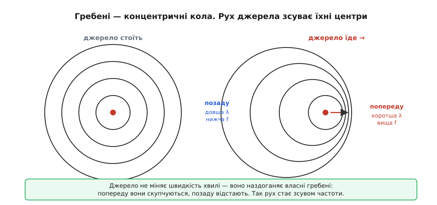
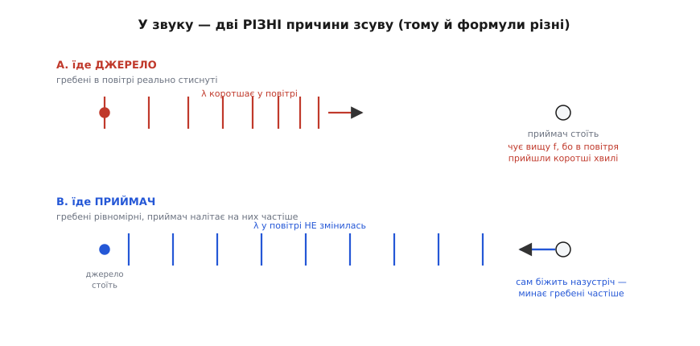
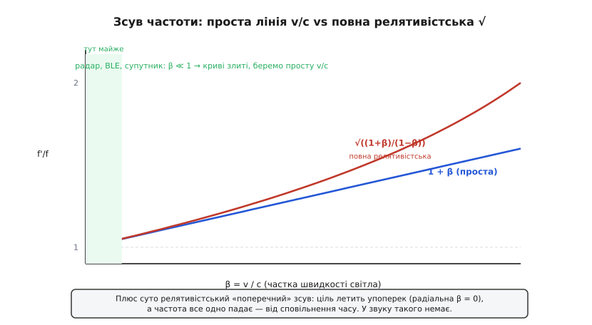

# Ефект Доплера

<preknowlist>
- [Синусоїда](topic:ph-waves/sine-wave) — гребінь, період і те, як хвиля повторюється в часі й у просторі.
- [Амплітуда й частота](topic:ph-waves/amplitude-frequency) — частота як число коливань за секунду й зв'язок швидкість = довжина хвилі × частота.
- [Електромагнітна хвиля](topic:ph-electromagnetism/em-wave) — світло й радіо не потребують середовища, а швидкість c однакова в кожній системі відліку.
</preknowlist>

Стоїть сирена й виє на одній ноті. Ви поряд — чуєте саме цю ноту. Але щойно та сама сирена промчить повз вас на швидкій машині, на під'їзді нота звучить вище, а на від'їзді — нижче, хоча сама сирена весь час гуде однаково. Частота, яку **ловить** ваше вухо, перестала дорівнювати частоті, яку **випускає** джерело. Це і є ефект Доплера: рух сам по собі, без жодної зміни налаштувань джерела, зсуває виміряну частоту вгору чи вниз. Саме на цьому стоять автомобільний радар, вимір швидкості цілі одним лідарним променем і половина мороки зі супутниковим зв'язком.

Виведемо цей зсув від самої першопричини — з того, як гребені хвилі виходять із точки, що встигла зрушити. Дорога веде через два різні світи. Спершу звук, де є повітря і де — несподівано — важить, **хто саме** рухається: джерело чи приймач. Потім світло й радіо, де середовища немає, тож лишається сама відносна швидкість, а формула стає симетричною. Складнішого за ділення й один квадратний корінь тут не буде: уся фізика зводиться до однієї впертої картинки — гребенів, що скупчуються перед тим, хто до них наближається.

## Означення: гребені виходять із точок, що зближаються або віддаляються

Спершу назвемо явище точно. **Ефект Доплера** (на честь австрійського фізика Крістіана Доплера, *Christian Doppler*, 1803–1853, який передбачив його 1842 року) — це різниця між частотою, яку **випускає** джерело, і частотою, яку **реєструє** приймач, коли джерело й приймач рухаються одне відносно одного (чи відносно середовища). Зближаються — виміряна частота вища за випущену; віддаляються — нижча.

Щоб зрозуміти, **чому** так, треба одна-єдина ідея, і вона проста до незручності. Джерело хвилі щоперіоду випускає новий **гребінь** — вершину коливання. Кожен гребінь, раз народившись, далі біжить середовищем зі швидкістю хвилі — і ця швидкість **не залежить** від того, рухалося джерело чи ні. Це наріжний камінь усього: джерело задає лише **момент і місце народження** гребеня, а не його подальшу швидкість. Звук у повітрі летить 340 м/с незалежно від того, стоїть сирена чи мчить; світло у вакуумі летить `c` незалежно від зорі.

А тепер увімкнімо рух. Якщо джерело стоїть, кожен наступний гребінь виходить із **тієї самої** точки — і гребені розходяться акуратними концентричними колами, однаково розставленими з усіх боків. Але щойно джерело рушило, наступний гребінь народжується вже з **іншого** місця — трохи ближчого до того боку, куди джерело їде. Гребінь позаду ще не встиг далеко відбігти, а джерело вже випускає новий уперед. Попереду гребені **скупчуються**, ззаду — **розтягуються**.


*Першопричина всього ефекту. Ліворуч джерело стоїть — гребені виходять з одного центру, відстань між ними (λ) однакова з усіх боків, отже й частота скрізь однакова. Праворуч джерело їде вправо: кожне наступне коло виходить із дедалі правішої точки, тож попереду кола тиснуться (коротша λ → вища f), а позаду розходяться (довша λ → нижча f). Швидкість самих кіл при цьому не змінилася — джерело просто наздоганяє власні гребені.*

Ось і весь механізм. Відстань між сусідніми гребенями — це довжина хвилі λ; частота, яку почує приймач, — це скільки гребенів проходить повз нього за секунду. Джерело, наздоганяючи власні гребені, **фізично вкоротило** λ попереду й **подовжило** позаду — а через `c = λ·f` коротша λ означає вищу f. Рух перетворився на зсув частоти, і ми ще не написали жодної формули. Тепер напишемо — і виявиться, що вона просто рахує оцю скупченість.

## Класичний випадок: звук, де є повітря і є «хто саме рухається»

Візьмемо звук, бо в нього є **середовище** — повітря — і саме воно робить класичний Доплер повчальним. Домовимося про позначення раз і назавжди: `c` — швидкість хвилі в середовищі (для звуку ≈340 м/с), `f` — частота, яку випускає джерело, `f′` — частота, яку чує приймач, `v` — швидкість руху. Одразу попереджу про пастку, заради якої цей розділ і потрібен: у середовищі **не однаково**, рухається джерело чи приймач. Це два різні механізми, і формули в них різні. Розберімо кожен окремо, а потім побачимо, чому вони не збігаються.

### Рухається джерело: коротшає сама хвиля в повітрі

Нехай приймач стоїть, а джерело їде **на нього** зі швидкістю v. Період коливань джерела — T = 1/f: раз на T секунд воно випускає новий гребінь. За цей час T попередній гребінь відбіг у повітрі на відстань `c·T = λ` (звичайна довжина хвилі нерухомого джерела). Але саме джерело за той самий час T проїхало вперед на `v·T`. Тому наступний гребінь виходить не з відстані λ від попереднього, а **ближче** — рівно на пройдений джерелом шлях:

```
λ′ = λ − v·T = c·T − v·T = (c − v)·T
```

Хвиля в повітрі фізично стиснулася: між гребенями тепер не λ, а `(c − v)·T`. Приймач стоїть, гребені підлітають до нього зі звичайною швидкістю c, і він ловить їх з частотою «швидкість поділити на відстань між гребенями»:

```
      c        c            c
f′ = ─── = ────────── = ─────── · f
      λ′     (c − v)·T     c − v
```

(Ми підставили T = 1/f і скоротили.) Ось формула для **рухомого джерела**, що насувається:

```
        c
f′ = f · ─────      (джерело їде на приймач)
        c − v
```

Знаменник менший за c, тож f′ > f — частота зросла, як і обіцяла картинка. Якщо джерело **віддаляється**, воно кожен гребінь народжує далі, λ′ = (c + v)·T, і в знаменнику стоїть (c + v): частота падає.

### Рухається приймач: хвиля та сама, але він налітає на гребені частіше

Тепер навпаки: джерело стоїть, а приймач біжить **на нього** зі швидкістю v. Дивіться, що змінилося — а що ні. Джерело нерухоме, тож гребені в повітрі розставлені **звичайно**, через λ = c·T; хвиля в просторі не стиснута анітрохи. Стиснути її нема чому — джерело ж стоїть. Змінюється інше: приймач сам мчить назустріч гребеням, тож минає їх **частіше**, ніж якби стояв.

Порахуймо швидкість зближення. Гребені летять на приймач зі швидкістю c, приймач летить на них зі швидкістю v — назустріч, тож відносна швидкість зближення `c + v`. Частота — це швидкість зближення, поділена на відстань між гребенями (а вона незмінна, λ):

```
      c + v     c + v            v
f′ = ───── = ───────── = f · (1 + ─)
       λ        c/f              c
```

Формула для **рухомого приймача**, що насувається:

```
             v
f′ = f · (1 + ─)      (приймач біжить на джерело)
             c
```

Якщо приймач **тікає**, зближення сповільнюється до (c − v), і множник стає (1 − v/c): частота падає.


*Два різні механізми одного зсуву. Угорі (A) рухається джерело: гребені в повітрі **реально стискаються** попереду — коротша λ прилітає до нерухомого приймача, і він чує вищу f. Унизу (B) рухається приймач: гребені в повітрі рівномірні (джерело ж стоїть), λ не змінилась — але приймач сам налітає на них частіше. Результат схожий, причина зовсім інша — тому й формули різні.*

### Чому формули різні — і коли різниця зникає

Порівняймо два результати для наближення (v проти c малих, розкладемо перший у ряд):

```
джерело їде:    f′ = f · c/(c−v)  = f · (1 + v/c + v²/c² + …)
приймач їде:    f′ = f · (1 + v/c)
```

Вони **не однакові**. Різниця сидить у членах з v²/c² і вище: рухоме джерело дає трохи більший зсув, ніж рухомий приймач на тій самій швидкості. Причину ми вже, по суті, бачили на малюнку, лишилося назвати. Рухоме джерело **фізично міняє довжину хвилі в середовищі** — стискає саму «лінійку» гребенів у повітрі. Рухомий приймач лінійку не чіпає (як він може, коли джерело стоїть?), він лише **швидше пробігає** повз незмінні гребені. Різні дії — різні формули; а винна в асиметрії саме наявність середовища, яке має власну «нерухому» систему відліку: повітря знає, хто в ньому рухається насправді.

Загальний класичний Доплер зводить обидва механізми в одну формулу зі знаками (верхні знаки — зближення, нижні — віддалення):

```
        c ± v_приймача
f′ = f · ─────────────
        c ∓ v_джерела
```

Але — і це головний практичний висновок розділу — на **звичайних** швидкостях різниця між «їде джерело» і «їде приймач» мізерна. Автомобіль на 30 м/с проти звуку 340 м/с дає v/c ≈ 0.088; квадратичний член v²/c² ≈ 0.0078 — менше відсотка. Тому в побуті різницею нехтують, а важлива вона стає лише коли v наближається до c. І тут — місток до світла: у радіо v/c зазвичай **мільярдні частки**, тож асиметрія «джерело/приймач» узагалі зникає. Але зникає вона там не тому, що швидкості малі, а з набагато глибшої причини — бо для світла **немає повітря**, немає середовища, яке б розрізняло, хто рухається. Саме до цього переходимо.

> 🔧 **Навіщо це.** Асиметрія «джерело чи приймач рухається» — це не абстракція. Ультразвуковий далекомір, доплерівський вимір потоку крові, сонар — усі працюють у **середовищі** (повітря, тканина, вода), тож там формула справді залежить від того, що саме рухається, і на швидкостях, порівнянних зі швидкістю звуку, це дає різні числа. А от щойно ви переходите до радіо- чи оптичного давача (радар, лідар, BLE), середовища як такого немає — і можна забути про два випадки й користуватися однією формулою від відносної швидкості. Знати, у якому ви світі, — і означає не помилитися формулою.

## Релятивістський випадок: світло й радіо, де середовища немає

Для світла й радіохвиль уся щойно збудована конструкція наштовхується на стіну. Класичний висновок спирався на «швидкість гребенів у **середовищі**» й на те, що можна окремо говорити про рух «відносно повітря». Але у [електромагнітної хвилі](topic:ph-electromagnetism/em-wave) немає середовища — вона поширюється й крізь порожній вакуум, де немає нічого, відносно чого рухатися. Історично фізики ХІХ століття вигадали був «світловий етер» на роль такого повітря для світла, та дослід Майкельсона-Морлі його не знайшов, а Айнштайн 1905 року показав, що він і не потрібен. Наслідок для Доплера радикальний: якщо середовища немає, то **немає й різниці** між «рухається джерело» і «рухається приймач». Існує лише одне осмислене число — **відносна швидкість** зближення чи віддалення. Природа просто не має способу сказати, хто з двох «насправді» рухається.

Це вже цікаво: сама постановка задачі спростилася — один випадок замість двох. Але є й ускладнення, якого в звуку не було. Швидкість світла `c` однакова в **будь-якій** системі відліку — і для того, хто випускає, і для того, хто ловить, хоч би як швидко вони летіли. Ця вперта сталість c тягне за собою **сповільнення часу**: годинник, що рухається відносно вас, для вас іде повільніше. А частота — це ж «скільки коливань за секунду», тобто в ній прямо сидить чийсь годинник. Тому до простого класичного стискання гребенів додається другий, суто релятивістський внесок: годинник джерела, з погляду приймача, цокає рідше, тож і коливань за «нашу» секунду виходить менше.

Складімо обидва внески. Позначмо β = v/c — швидкість як частку швидкості світла (зручна безрозмірна міра, до якої ми ще не раз повернемося). Один множник — від звичайного зближення гребенів (як у класиці, але тепер від відносної швидкості), другий — від сповільнення часу, `√(1 − β²)`. Для джерела й приймача, що **зближуються**, вони дають:

```
f′ = f · (1 + β) · ────────
                   √(1 − β²)
```

Це можна згорнути гарніше. Помітьте, що `1 − β² = (1 − β)(1 + β)`, тож `√(1 − β²) = √(1−β)·√(1+β)`. Підставмо й скоротімо один `√(1+β)`:

```
        (1 + β)         (1 + β)          √(1 + β)      1 + β
f′ = f·─────────── = f·──────────── = f·──────── = f·√─────
       √(1−β)√(1+β)     √(1−β)√(1+β)     √(1 − β)      1 − β
```

Ось вона, повна релятивістська формула Доплера для зближення:

```
         1 + β                v
f′ = f · √─────      де  β = ───   (джерело й приймач зближуються)
         1 − β                c
```

Для віддалення знаки під коренем міняються місцями: `f′ = f·√((1−β)/(1+β))` — частота падає. Зверніть увагу, наскільки це чистіше за класику: жодних окремих випадків, лише один β і симетричний корінь. Це прямий відбиток того, що середовища немає й важить сама відносна швидкість.

### Наближення v ≪ c: та сама проста Δf = f·v/c

Повна формула з коренем гарна, але в реальному радіо β настільки крихітне, що корінь можна розкласти й лишити перший член. Розкладемо `√((1+β)/(1−β))` для малого β. І чисельник `(1+β)^½ ≈ 1 + β/2`, і знаменник `(1−β)^{−½} ≈ 1 + β/2`; перемноживши й відкинувши β², дістаємо:

```
     1 + β
    √─────  ≈ (1 + β/2)(1 + β/2) ≈ 1 + β    (для β ≪ 1)
     1 − β
```

Отже при малих швидкостях:

```
f′ ≈ f · (1 + β) = f · (1 + v/c)
```

а сам зсув частоти Δf = f′ − f — це просто:

```
             v
Δf = f · ─────      (наближення v ≪ c; знак «+» на зближення, «−» на віддалення)
             c
```

Ось та сама проста формула, якою зазвичай і користуються, і тепер видно її статус: це **перший член** розкладу повної релятивістської, законний, доки v ≪ c. Порівняймо всі три криві на одному графіку, щоб відчути, де просте наближення ще годиться, а де вже бреше.


*Просте проти повного. Синя пряма — наближення f′/f = 1 + β = 1 + v/c. Червона — повна релятивістська √((1+β)/(1−β)). До β ≈ 0.1 вони практично збігаються (зелена смуга ліворуч — уся практична радіоелектроніка: радар, BLE, супутник, де β крихітне), тож там сміливо беремо просту v/c. З ростом β червона крива відривається вгору — біля β = 0.5 різниця вже помітна, а на релятивістських швидкостях зорь і частинок нехтувати коренем не можна. Плюс суто релятивістський «поперечний» зсув, якого в звуку немає взагалі.*

Наскільки мала похибка простої формули? При β = 0.001 (а це вже 300 км/с — швидкість, недосяжна для жодного давача на Землі) різниця між `1 + β` і повним коренем — близько β²/2 ≈ 5·10⁻⁷, тобто півмільйонна частка. Для будь-якої земної електроніки це абсолютний нуль. Тому в радарі, лідарі, BLE й супутнику **завжди** беруть просте `Δf = f·v/c`, а корінь дістають лише астрофізики (зорі, галактики) і фізики прискорювачів, де β — це десяті чи навіть дев'ятки після коми.

### Поперечний зсув: те, чого в звуку нема зовсім

Є в релятивістського Доплера один ефект без класичного двійника, і він варто згадки, бо оголює саму суть різниці. Спитаймо: що буде, якщо ціль летить **строго впоперек** променя — ні на нас, ні від нас, а вбік? У класичному звуку відповідь однозначна: у мить, коли швидкість перпендикулярна до лінії «джерело-приймач», радіальна складова нульова, гребені не стискаються й **зсуву немає**. У світлі ж лишається другий множник — сповільнення часу, — який від напрямку не залежить зовсім. Годинник рухомої цілі йде повільніше **хоч би куди** вона летіла. Тому навіть при чисто поперечному русі частота падає:

```
f′ = f · √(1 − β²)      (поперечний зсув: рух упоперек променя)
```

Це чистий підпис сповільнення часу, без жодного домішку від стискання гребенів. У звуку такого немає в принципі — там немає сповільнення часу, є лише геометрія гребенів у повітрі. Для земної електроніки поперечний зсув нікчемно малий (він другого порядку, β²), тож на практиці ним нехтують; але концептуально саме він найчистіше показує, **чим** релятивістський Доплер відрізняється від класичного — не поправкою до формули, а зовсім іншим фізичним коренем.

> 🔧 **Навіщо це.** Головне, що варто винести: у радіо не питайте «хто рухається, джерело чи приймач» — питайте лише про **відносну променеву швидкість**, і беріть Δf = f·v/c. Один випадок, одна формула. Корінь і поперечний зсув тримайте в голові як культурний фон — вони пояснюють, **чому** формула саме така, і рятують, якщо колись доведеться рахувати щось із релятивістською швидкістю (доплерівський зсув у прискорювачі, червоне зміщення). Але для щоденного давача це просте ділення швидкості на швидкість світла, помножене на частоту.

## Практичні числа: радар, BLE, супутник

Формула мертва, доки в неї не підставлено реальні числа. Пройдімося трьома випадками, які інженер справді зустрічає, і кожен додасть свій поворот.

### Радар: чому в дорожньому радарі множник 2

Автомобільний радар світить радіохвилею на машину й ловить відлуння. Тут криється тонкість, через яку «шкільна» формула дає вдвічі замалий результат. Хвиля зазнає Доплера **двічі**: спершу рухома машина виступає як рухомий **приймач** (ловить зсунуту частоту), а тоді, перевипромінюючи відлуння назад, — уже як рухоме **джерело** (додає зсув ще раз). Два зближення поспіль — зсув подвоюється:

```
        2·v          2·v·f
f_D = ───── · f = ────────      (радар: зсув туди-й-назад)
         c             c
```

**Приклад: радар 24 ГГц, машина 120 км/ч.** Дорожні радари часто працюють на f = 24 ГГц. Швидкість 120 км/ч переведімо в м/с: 120 / 3.6 = 33.3 м/с. Тоді доплерівська частота відлуння:

```
        2 · v · f     2 · 33.3 · 24·10⁹
f_D = ─────────── = ────────────────── = 5.3·10³ Гц ≈ 5.3 кГц
           c              3·10⁸
```

Лише 5.3 кілогерца зсуву на несівній у 24 **гіга**герца — крихітна частка, менша за мільйонну. Але цю різницю частот легко зміряти, змішавши відлуння з випроміненим сигналом: на різниці двох близьких частот виникає повільне [биття](topic:ph-waves/beats), яке вже неважко відлічити. Так затримка й Доплер разом кодують і дальність, і швидкість цілі. І звідси відразу видно шкалу: 1 кГц зсуву на 24 ГГц ≈ 22.5 км/ч. Радар не «бачить» швидкість прямо — він чує зсув частоти й ділить його назад на 2f/c.

### BLE: коли Доплер стає джерелом помилок, а не вимірювань

У Bluetooth Low Energy (2.4 ГГц) Доплер ніхто не міряє — навпаки, він **заважає**. Уяви фітнес-датчик на бігуні або дрон, що передає телеметрію: відносна швидкість між передавачем і приймачем зсуває несівну, і приймач мусить цей зсув витримати, не втративши синхронізацію.

**Приклад: BLE 2.4 ГГц, відносна швидкість 10 м/с.** Це швидкий біг чи повільний дрон. Тут одностороння передача (не відлуння), тож множника 2 немає — беремо просте Δf = f·v/c:

```
             v            10
Δf = f · ───── = 2.4·10⁹ · ──────── = 80 Гц
             c           3·10⁸
```

Вісімдесят герц. На тлі ширини BLE-каналу (1 МГц) і власного дрейфу кварцу передавача (десятки **кіло**герц) ці 80 Гц — абсолютно непомітні. Ось чому в наземному BLE про Доплер можна взагалі не думати: рух пішохода чи дрона дає зсув на три порядки менший за похибку самого кварцу. Порівняння повчальне: не кожен фізичний ефект, який існує, треба враховувати — інженерія починається з уміння оцінити, що на тлі чого зникає.

### Супутник: єдиний випадок, де Доплер справді болить

А тепер випадок, де все навпаки: низькоорбітальний (LEO) супутник летить над головою зі швидкістю близько 7.8 км/с — і Доплер стає головним болем прийому. Різниця з попередніми випадками не у формулі, а в **швидкості**: вона на два-три порядки більша за все земне.

**Приклад: LEO-супутник, f = 1.5 ГГц, променева швидкість 7.8 км/с.** Коли супутник летить точно на приймач (максимальна променева складова), Δf = f·v/c:

```
             v             7.8·10³
Δf = f · ───── = 1.5·10⁹ · ───────── = 3.9·10⁴ Гц = 39 кГц
             c            3·10⁸
```

Тридцять дев'ять кілогерц — і це вже **не дрібниця**. Ба більше, супутник не зависає: він пролітає від горизонту до горизонту за хвилини, і його променева швидкість за цей час плавно міняється від +7.8 км/с (наближається) через нуль (точно над головою) до −7.8 км/с (віддаляється). Тобто несівна «повзе» на десятки кілогерц туди-й-назад за один прохід. Приймач мусить цей зсув **безперервно відстежувати й компенсувати**, інакше сигнал вислизне з приймальної смуги. Саме тому супутникові модеми мають окремі кола доплерівського стеження, яких наземний BLE-модуль не має й не потребує.

Складімо три випадки поряд — вони чудово показують, що вирішує не формула, а масштаб швидкості:

```
BLE, пішохід/дрон    v ≈ 10 м/с    → Δf ≈ 80 Гц     → нехтуємо (тоне в дрейфі кварцу)
радар, авто          v ≈ 33 м/с    → f_D ≈ 5.3 кГц  → міряємо (це і є корисний сигнал), ×2 за відлуння
LEO-супутник         v ≈ 7800 м/с  → Δf ≈ 39 кГц    → компенсуємо (інакше втрата зв'язку)
```

Три однакові підстановки в те саме `Δf = f·v/c` — і три зовсім різні інженерні висновки: забути, зміряти, побороти. Уся різниця — у швидкості й у тому, на тлі чого цей зсув доводиться розглядати.

## Що з цього тримати в голові

Крізь усі випадки — звук і світло, рухоме джерело й рухомий приймач, радар і супутник — проходить одне питання: наскільки скупчилися чи розійшлися гребені для того, хто дивиться. Відповідь завжди зважується однією безрозмірною міркою — часткою швидкості від швидкості самої хвилі (для звуку v/c_звуку, для світла β = v/c). Мала ця частка — і хоч звук, хоч світло дають той самий лінійний зсув Δf = f·v/c, а вся різниця між ними ховається в членах, надто дрібних, щоб їх помітити. Велика — і два світи розходяться: у звуку виринає асиметрія «хто рухається», бо повітря має власну нерухому систему відліку; у світла — квадратний корінь і поперечний зсув від сповільнення часу, бо ніякого «повітря» під світло немає.

Тому практичний висновок подвійний. Для будь-якого земного давача досить простого Δf = f·v/c: воно каже, що зсув росте **і** з несівною частотою, **і** зі швидкістю, — звідси і 5 кілогерц радара, і нікчемні 80 герц бігуна, і болючі 39 кілогерц супутника з одного й того самого ділення. А повна формула з коренем не марна — це двері до світу, де β вже не крихітне: червоне зміщення далеких галактик і доплерівський зсув у прискорювачі — той самий ефект, лише докручений до швидкостей, на яких корінь нарешті починає важити.
