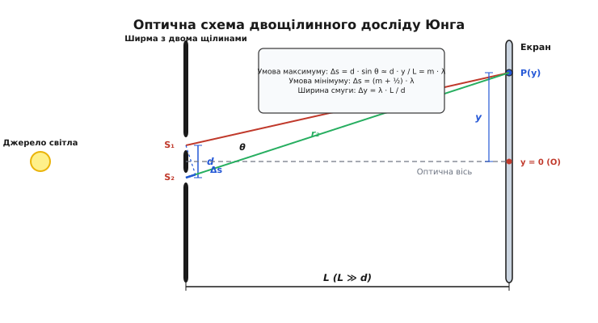
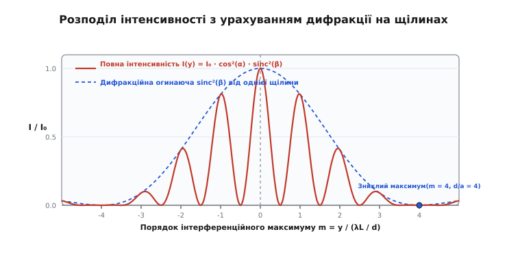
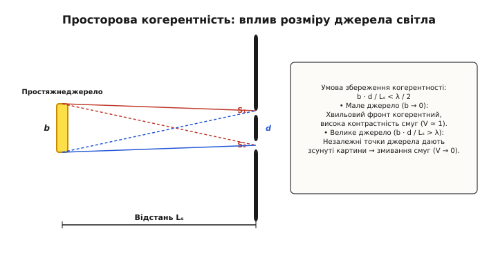
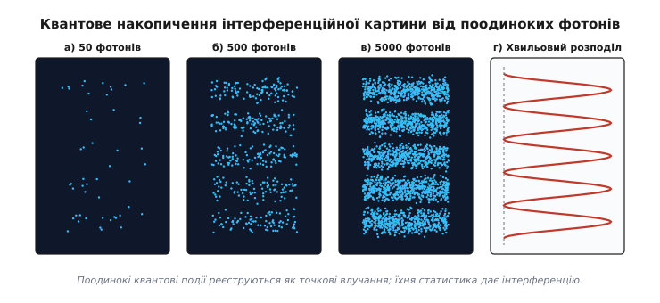

# Двощілинний експеримент

<preknowlist>
- [Закон Снелла](topic:ph-waves/snells-law) — геометрія заломлення світлового променя на межі двох середовищ.
- [Рівняння Френеля](topic:ph-waves/fresnel-equations) — амплітудні та енергетичні коефіцієнти відбиття й заломлення світла.
</preknowlist>

Коли вузький пучок монохроматичного червоного світла від гелій-неонового лазера з довжиною хвилі 632.8 нм падає на непрозору ширму з двома паралельними щілинами шириною по 40 мкм, розташованими на відстані 0.2 мм одна від одної, на спостережному екрані за два метри звідти з'являється не дві яскраві смужки, як передбачала б геометрична оптика, а серія з десятків почергових світлих і темних смуг. Центральна світла смуга розділена темними проміжками з кроком близько 6.33 мм, а яскравість сусідніх максимумів поступово згасає при віддаленні від центру. Ця геометрія — **двощілинний експеримент** (*double-slit experiment*) — становить фундаментальний кріпильний камінь хвильової та квантової оптики. Дослід, уперше виконаний Томасом Юнгом у 1801 році для доведення хвильової природи світла, у XX столітті перетворився на концептуальний центр квантової механіки, продемонструвавши самоінтерференцію поодиноких фотонів, електронів і навіть масивних молекул.

---

### 1. Фізична суть досліду та геометрія суперпозиції

Класична геометрична оптика описує світло як сукупність прямолінійних променів, що рухаються незалежно один від одного. Якби ця модель була вичерпною, непрозора ширма з двома вузькими щілинами виступала б просто геометричним обмежувачем: світлові промені проходили б строго крізь отвори й залишали на екрані два чітких світлих відбитки, що повністю повторюють форму щілин.

Однак у реальності світло — це поширення електромагнітної хвилі, що підкоряється принципу Гюйгенса — Френеля. Згідно з цим принципом, кожна точка хвильового фронту, яка досягає вузької щілини, стає самостійним джерелом вторинних сферичних хвиль. Коли хвильовий фронт досягає екрана з двома щілинами `S₁` та `S₂`, вони перетворюються на два синхронних, повністю узгоджених (когерентних) джерела світлових хвиль.


*Геометрія двощілинного досліду: хвилі від двох когерентних щілин S₁ та S₂ поширюються до точки P на екрані, утворюючи оптичну різницю ходу Δs = d · sin θ.*

Розглянемо детальніше геометричне розташування елементів досліду:
- Відстань між центрами двох щілин позначається літерою `d`.
- Відстань від ширми зі щілинами до спостережного екрана дорівнює `L`.
- Вісь `y` спрямована вздовж екрана перпендикулярно до оптичної осі, з початком координат `y = 0` навпроти середини між щілинами.
- Точка спостереження `P` на екрані знаходиться на висоті `y` від оптичної осі.

Світлові хвилі від щілин `S₁` та `S₂` проходять до точки `P` різні геометричні шляхи `r₁` та `r₂`. Через цю різницю відстаней хвиля від нижньої щілини приходить до точки `P` із деяким запізненням у фазі відносно хвилі від верхньої щілини. Відстань, на яку одна хвиля випереджає іншу, називають **оптичною різницею ходу** (*optical path difference*, `Δs`):

```
Δs = r₂ - r₁
```

Оскільки відстань до екрана `L` у реальних оптичних схемах у тисячі разів більша за відстань між щілинами `d` (`L ≫ d`), промені, що прямують від щілин `S₁` та `S₂` до точки `P`, є практично паралельними й утворюють з оптичною віссю малий кут `θ`. Із прямокутного трикутника біля ширми видно, що різниця ходу дорівнює:

```
Δs = d · sin θ
```

Зважаючи на те, що для малих кутів `sin θ ≈ tg θ = y / L`, отримуємо зручне параксіальне співвідношення для різниці ходу:

```
Δs ≈ (d · y) / L
```

Залежно від того, скільки цілих довжин хвиль `λ` вкладається у різницю ходу `Δs`, у точці `P` спостерігається один із двох граничних режимів хвильової суперпозиції:

1. **Конструктивна інтерференція (максимум інтенсивності)**: різниця ходу дорівнює цілому числу довжин хвиль. Гребінь однієї хвилі збігається з гребенем іншої, електричні поля коливаються в однаковій фазі, їхні амплітуди додаються, утворюючи яскраву світлу смугу:

```
Δs = m · λ  ===>  y_m = (m · λ · L) / d     [m = 0, ±1, ±2, ...]
```

2. **Деструктивна інтерференція (мінімум інтенсивності)**: різниця ходу дорівнює непарному числу напівхвиль. Гребінь однієї хвилі збігається із западиною іншої, хвилі перебувають у протифазі, електричні поля повністю взаємознищуються, утворюючи темну смугу:

```
Δs = (m + 1/2) · λ  ===>  y_m = (m + 1/2) · (λ · L) / d     [m = 0, ±1, ±2, ...]
```

Відстань між двома сусідніми яскравими смугами називають **шириною інтерференційної смуги** (*fringe spacing*, `Δy`). Вона визначається простим співвідношенням:

```
Δy = (λ · L) / d
```

Ця формула має фундаментальне практичне значення: вона показує, що відстань між смугами на екрані прямо пропорційна довжині світлової хвилі `λ` та відстані до екрана `L`, і обернено пропорційна відстані між щілинами `d`. Зменшення відстані між щілинами `d` розсуває інтерференційні смуги, роблячи їх чіткішими для спостереження, тоді як збільшення відстані `d` до розмірів, значно більших за `λ`, стискає смуги у суцільну розмиту пляму.

---

### 2. Математична теорія та обчислення інтерференційної картини

Амплітудний аналіз показує не лише положення світлих і темних смуг, а й безперервний розподіл освітленості вздовж усієї координати `y` екрана.

Нехай напруженість електричного поля хвилі, яка приходить у точку `P` від першої щілини, дорівнює `E₁ = E₀ · cos(ωt)`, а від другої — `E₂ = E₀ · cos(ωt + Δφ)`, де `Δφ` — фазовий зсув між хвилями. Зв'язок між різницею фаз `Δφ` та різницею ходу `Δs` задається хвильовим числом `k = 2π / λ`:

```
Δφ = (2π / λ) · Δs = (2π · d · y) / (λ · L)
```

Результуюче електричне поле `E_res` дорівнює сумі двох коливань. Використовуючи тригонометричну формулу суми косинусів, отримуємо:

```
E_res = E₁ + E₂
      = E₀ · [ cos(ωt) + cos(ωt + Δφ) ]
      = 2 · E₀ · cos(Δφ / 2) · cos(ωt + Δφ / 2)
```

Оптичні прилади, фотопластинки та людське око не здатні фіксувати миттєві коливання світлового поля з частотою порядку `10¹⁴ Гц`. Вони реєструють **інтенсивність світла** `I`, яка пропорційна середньому квадрату напруженості електричного поля `⟨E_res²⟩`:

```
I(y) = 4 · I₁ · cos²(Δφ / 2)
```

де `I₁ = 1/2 · E₀²` — інтенсивність світла від однієї окремої щілини.

Підставляючи вираз для різниці фаз `Δφ`, отримуємо підсумкове рівняння для розподілу інтенсивності двощілинної інтерференції:

```
I(y) = 4 · I₁ · cos²( (π · d · y) / (λ · L) )
```

З цієї формули випливають важливі енергетичні наслідки:
- У точках максимумів (`y = y_m`) косинус дорівнює `±1`, тому інтенсивність світла становить `I_max = 4 · I₁`. Вона у чотири рази перевищує інтенсивність від однієї щілини, а не у два рази, як можна було б очікувати при інтуїтивному додаванні енергій.
- У точках мінімумів косинус дорівнює `0`, тому інтенсивність повністю зникає: `I_min = 0`.
- Усереднена по всьому екрану інтенсивність дорівнює `2 · I₁`, що строго відповідає закону збереження енергії: світлова енергія не зникає і не виникає з нічого, а лише перерозподіляється у просторі, перенаправляючись із темних ділянок у яскраві смуги.

З точки зору електродинаміки, це означає, що потік вектора Пойнтінга `S = E × H` просторово переорієнтується: хвильові фронти від двох щілин перетинаються під кутом і формують періодичні канали перенесення електромагнітної енергії.

Детальний суворий комплексний вивід цього розподілу з інтегруванням по фазах міститься у вставці [Математичний вивід розподілу інтенсивності та фазових відносин](topic:ph-waves/double-slit-experiment/math-interference-derivation.md).

---

### 3. Дифракційне огинання та скінченна ширина щілин

Вищенаведене рівняння `I(y) = 4 I₁ cos²(...)` отримано у припущенні, що щілини є нескінченно вузькими лінійними джерелами (`a → 0`). Проте у реальних фізичних приладах кожна щілина має скінченну ширину `a`.

Відповідно до принципу Гюйгенса — Френеля, елементарні ділянки самої щілини шириною `a` також інтерферують між собою, викликаючи Фраунгоферову дифракцію на поодинокій щілині. Розподіл інтенсивності від однієї такої щілини описується відомою функцією `sinc`:

```
I_single(θ) = I₀ · [ sin( (π · a · sin θ) / λ ) / ( (π · a · sin θ) / λ ) ]²
            = I₀ · sinc²( (π · a · sin θ) / λ )
```

У результаті реальна двощілинна інтерференційна картина є **добутком двох хвильових процесів**: чистої двоточкової інтерференції та дифракції на поодинокій щілині. Повна інтенсивність на екрані описується формулою:

```
I(θ) = I₀ · cos²( (π · d · sin θ) / λ ) · sinc²( (π · a · sin θ) / λ )
```


*Підсумковий розподіл інтенсивності (синя крива): високочастотні інтерференційні осциляції модулюються повільною дифракційною огинаючою sinc² (червоний пунктир).*

На графіку видно, що дифракційна функція `sinc²` виступає в ролі плавної **огинаючої** (*envelope*). Вона обмежує амплітуду інтерференційних максимумів: що далі смуга розташована від центрального нуля (`y = 0`), то менша її яскравість.

Це призводить до цікавого оптичного ефекту — **зниклих максимумів** (*missing orders*). Якщо кутове положення якогось інтерференційного максимуму точно збігається з кутовим положенням дифракційного мінімуму, цей максимум повністю зникає з екрана. Це відбувається за умови:

```
d / a = m / n
```

де `m` — порядок інтерференційного максимуму, а `n` — порядок дифракційного мінімуму. Наприклад, якщо відстань між щілинами вчотирьох більша за їхню ширину (`d = 4 a`), то інтерференційні максимуми з номерами `m = ±4, ±8, ±12...` потрапляють на нулі огинаючої і стають абсолютно непомітними.

---

### 4. Просторова й часова когерентність світлового джерела

Наочність двощілинної інтерференції залежить від чіткої співфазності випромінювання. Якщо замість лазера поставити дві звичайні побутові лампи розжарювання або два світлодіоди навпроти кожної щілини, жодної інтерференційної картини на екрані виявити не вдасться. Екран буде просто рівномірно освітлений.

Причина полягає у відсутності **когерентності** (*coherence*) — постійного, незмінного у часі фазового співвідношення між хвилями. Звичайне атомарне джерело випромінює світло у вигляді окремих коротких хвильових цугів тривалістю близько `10⁻⁸ c`. Атоми у двох незалежних лампах випромінюють цуги хаотично й спонтанно. За секунду фазовий зсув між хвилями змінюється сотні мільйонів разів, через що максимуми й мінімуми на екрані хаотично зміщуються, усереднюючись для спостерігача у суцільне сіре тло.

Для існування стабільної інтерференції необхідно забезпечити два типи когерентності:

1. **Часова когерентність** (*temporal coherence*): пов'язана з монохроматичністю світла (вузькістю спектрального інтервалу `Δλ`). Якщо джерело випромінює біле світло (суміш усіх довжин хвиль від 400 до 700 нм), кожна довжина хвилі створює власну систему смуг зі своєю шириною `Δy = λ L / d`. У центрі (`y = 0`) максимуми всіх кольорів збігаються, утворюючи білу смугу, але вже на 3–4 порядку смуги різних кольорів накладаються одна на одну, перетворюючись на рівномірний білий спектр. Довжина часової когерентності обмежує максимальну різницю ходу:

```
l_c ≈ λ² / Δλ
```

Якщо `Δs > l_c`, інтерференція зникає.

2. **Просторова когерентність** (*spatial coherence*): пов'язана з поперечними розмірами самого джерела світла.


*Геометрія просторової когерентності: протяжне джерело шириною b викликає зсув інтерференційних картин від своїх крайніх точок. При b · d / L_s > λ смуги розмиваються.*

Якщо джерело світла має скінченну ширину `b` і знаходиться на відстані `L_s` від двощілинної ширми, то верхній і нижній краї джерела освітлюють щілини `S₁` та `S₂` під різними кутами. Крайні точки джерела створюють на екрані власні інтерференційні картини, зсунуті одна відносно одної.

Щоб максимуми від різних точок джерела не перекривалися з мінімумами і не розмивали картину, повинна виконуватися **умова просторової когерентності**:

```
(b · d) / L_s < λ / 2
```

Саме тому Томас Юнг у своєму досліді 1801 року був змушений поставити перед двощілинною ширмою первинний маленький отвір: він виступав точковим джерелом, забезпечуючи високу просторову когерентність сонячного світла.

Детальніше про історію подолання проблеми когерентності у дослідах XIX–XX століть ідеться у вставці [Історія двощілинного досліду: від корпускул Ньютона до квантової революції](topic:ph-waves/double-slit-experiment/hist-young-experiment.md).

---

### 5. Квантово-механічна інтерпретація та дуалізм частинка-хвиля

У класичній фізиці розділення було абсолютним: речовина складається з дискретних частинок (корпускул), які мають чіткі траєкторії, а світло є неперервною хвилею. Однак двощілинний експеримент, проведений із поодинокими квантами світла й матерії, повністю зламав цю класичну парадигму.

Якщо зменшити інтенсивність світлового пучка або електронного гармати так, щоб частинки вилітали поодинці — наприклад, один електрон або фотон за секунду, — то час прольоту крізь прилад становить мікросекунди. Це означає, що у будь-який момент часу всередині установки перебуває **лише одна частинка**. Вона не може фізично зіштовхуватися чи взаємодіяти з іншими частинками.


*Накопичення точкових влучань поодиноких квантів: а) 50 частинок створюють хаотичні цятки; б–в) при 500 та 5000 влучаннях проявляються чіткі смуги; г) статистика влучань збігається з хвильовою інтенсивністю.*

Результати таких експериментів виявили вражаючий дуалізм:
- **Корпускулярний аспект реєстрації**: кожен поодинокий фотон або електрон детектується на екрані як локалізована, неподільна точка (спрацьовування пікселя CCD-матриці чи точковий спалах люмінофора). Частинка ніколи не «ділиться» на екрані.
- **Хвильовий аспект поширення**: хоча поодинокі влучання здаються випадковими, після накопичення тисяч точок статистика їхньо розподілу строго відтворює хвильову інтерференційну картину `I(y) = 4 I₁ cos²(...)`.

У квантовій механіці цей феномен описується за допомогою **хвильової функції** `Ψ(x, y, z, t)`. Хвильова функція поширюється у просторі як неперервна хвиля, проходить **одночасно крізь обидві щілини** і випромінює два когерентні компоненти `Ψ₁` та `Ψ₂`. 

У точці екрана `y` ці амплітуди ймовірності додаються за законом квантової суперпозиції:

```
Ψ_total(y) = Ψ₁(y) + Ψ₂(y)
```

Густина ймовірності `P(y)` виявити частинку у точці `y` дорівнює квадрату модуля сумарної хвильової функції:

```
P(y) = | Ψ₁(y) + Ψ₂(y) |²
     = |Ψ₁|² + |Ψ²|² + 2 · Re(Ψ₁* · Ψ₂)
```

Доданок `2 Re(Ψ₁* Ψ₂)` є **квантовим інтерференційним членом**. Саме він відповідає за перерозподіл ймовірностей та появу темних і світлих смуг. Фотон або електрон інтерферує не з іншими частинками, а сам із собою: його хвильова функція досліджує обидва можливі шляхи одночасно.

З точки зору Фейнманівського формулювання квантової механіки через **інтеграли по траєкторіях**, частинка рухається від джерела до точки на екрані одночасно усіма можливими траєкторіями у просторі. Амплітуда ймовірності є сумою комплексних фазових факторів `exp(i S / ℏ)` вздовж кожної траєкторії, де `S` — класична дія. Оскільки траєкторії, що проходять крізь щілину `S₁`, має дію `S₁`, а крізь `S₂` — дію `S₂`, їхня сума дає інтерференційне коливання з фазою `(S₂ - S₁) / ℏ = Δφ`.

---

### 6. Інтерференція макромолекул та межі квантового світу

Чи поширюються хвильові властивості матерії на більші об'єкти? У 1999 році експериментальна група Антона Цайлінгера та Маркуса Арндта у Віденському університеті провела двощілинний експеримент із масивними молекулами фулерену `C₆₀` (футбольні бакіболи, що складаються з 60 атомів вуглецю з атомною масою 720 а.о.м.).

Фізичні параметри молекулярного експерименту вражають:
- Маса молекули `C₆₀`: `m ≈ 1.2 · 10⁻²⁴ кг` (у 1.3 мільйона разів масивніша за електрон).
- Теплова швидкість молекулярного пучка: `v ≈ 220 м/с`.
- Довжина хвилі де Бройля: `λ_dB = h / (m · v) ≈ 2.5 пікометра` (`2.5 · 10⁻¹² м`), що у 400 разів менше за фізичний діаметр самої молекули `C₆₀` (`1 нм`).

Щоб спостерігати інтерференцію для такої крихітної довжини хвилі, вчені виготовили за допомогою фотолітографії наноструктурну кремнієву ґратку з періодом `d = 100 нм`. Отримані на детекторі смуги повністю підтвердили квантову суперпозицію макромолекул!

Пізніше у 2013–2019 роках інтерференцію вдалося зафіксувати для ще більших складних органічних молекул, що містили понад 2000 атомів і мали масу понад 25 000 а.о.м. Це довело, що межа між квантовим і класичним світом визначається не масою частинки як такою, а ступенем її ізоляції від довкілля.

---

### 7. Руйнування інтерференції: спостереження, заплутаність та декогеренція

Природно виникає запитання: а що станеться, якщо спробувати «зловити» частинку і з'ясувати, крізь яку саме з двох щілин вона пройшла насправді?

Для цього біля щілин встановлюють спеціальний детектор шляху (*welcher-Weg detector* — від німецького «котрий шлях»). Це може бути, наприклад, слабкий спалах світла, що розсіюється на електроні, або мікроскопічний резонатор, який реєструє електромагнітний імпульс частинки.

Як тільки такий детектор отримує визначну інформацію про те, крізь яку щілину пройшла частинка:
1. **Інтерференційна картина миттєво зникає**.
2. Розподіл влучань на екрані перетворюється на звичайну суму двох класичних дифракційних плям:

```
P_measured(y) = |Ψ₁(y)|² + |Ψ₂(y)|²
```

Цей феномен є фундаментальним у квантовій фізиці. Він підкоряється **принципу доповнюваності Бора** (*Bohr's complementarity principle*): неможливо в одному й тому ж експерименті одночасно спостерігати хвильові властивості (інтерференційну картину) та корпускулярні властивості (інформацію про траєкторію шляху).

Сучасна квантова теорія пояснює руйнування інтерференції через процес **квантової декогерентності** (*quantum decoherence*) та квантової заплутаності. Коли частинка взаємодіє з детектором або довкіллям, її хвильова функція заплутується зі станом детектора `|D⟩`:

```
|Ψ_system⟩ = 1/√2 · ( |Ψ₁⟩·|D₁⟩ + |Ψ₂⟩·|D₂⟩ )
```

Якщо стани детектора `|D₁⟩` та `|D₂⟩` є ортогональними (тобто детектор чітко розрізняє два шляхи, `⟨D₁|D₂⟩ = 0`), то після усереднення по станах довкілля інтерференційний доданок `2 Re(Ψ₁* Ψ₂ ⟨D₁|D₂⟩)` точно дорівнює нулю. Інтерференція руйнується не через «механічний поштовх» детектора, а через втрату фазової зв'язаності (когерентності) квантового стану з вимірювальним приладом.

Більше того, у 1982 році Мартін Шкуллі та Кай Дрюль запропонували експеримент із **квантовим підтирачем** (*Quantum Eraser*). Якщо інформацію про шлях зафіксовано детектором, але потім «стерто» до того, як вона взаємодіяла з макроскопічним середовищем (наприклад, шляхом змішування поляризаційних станів фотонів на 45-градусному дзеркалі), квантова інтерференція повністю відновлюється. Це остаточно довело, що декогеренція визначається наявністю доступної інформації у Всесвіті, а не механічною деструкцією хвильового фронту.

Чому ж макроскопічні предмети (футбольні м'ячі, автомобілі, піщинки) не утворюють інтерференційних картин при прольоті крізь подвійні ворота? Відповідь полягає у колосальній швидкості довкіллєвої декогерентності. Для макроскопічного тіла масою 1 грам постійне зіткнення з фотонами реліктового випромінювання, молекулами повітря й тепловими квантами руйнує фазову когерентність між двома траєкторіями за час порядку `10⁻²³ секунди`. Очищена від фазових членів квантова матриця густини стає строго діагональною, і макроскопічний світ набуває звичного нам класичного вигляду.

---

### 8. Двощілинна дифракція у часі

У 2023 році фізики з Імперського коледжу Лондона під керівництвом Ріккардо Сапієнци спроектували та реалізували дивовижний варіант досліду — **двощілинний експеримент у часі** (*double-slit in time*).

Замість геометричних щілин у просторовому екрані вчені використали тонку плівку оксиду індію-олова (ITO), показник заломлення якої різко змінювався під дією надкоротких фемтосекундних лазерних імпульсів. Плівка перетворювалася на дзеркало на два крихітні часові інтервали тривалістю по `10⁻¹⁴ секунди`, розділені паузою у 120 фемтосекунд.

Випромінювання, відбите від такого «часового подвійного дзеркала», утворило інтерференційну картину не у просторовому розподілі координат `y`, а у **спектральному розподілі частот**. Частотний спектр світла розділився на серію інтерференційних гребенів, де відстань між спектральними смугами визначалася інтервалом часу між відкриттями часових щілин. Це відкриття підтвердило фундаментальну просторово-часову симетрію рівнянь Максвелла та квантової теорії.

Алгоритм числового розрахунку інтерференційних профілів та створення їхніх комп'ютерних симуляцій наведено у вставці [Чисельне моделювання інтерференційної та дифракційної картини](topic:ph-waves/double-slit-experiment/proj-double-slit-simulation.md).

---

### 9. Практичні застосування в оптичній метрології та квантових технологіях

> 🔧 **Навіщо це.**
> Двощілинний експеримент — це не лише фундаментальна ілюстрація підручників із фізики, а й практичний інструмент високоточних вимірювань. На принципі двощілинної інтерференції побудовані зоряні інтерферометри Майкельсона, які дають змогу вимірювати кутові діаметри віддалених зір та відстані між подвійними зоряними системами. У мікроелектроніці та нанотехнологіях двощілинна дифракція застосовується для контролю товщини й геометричних дефектів фотолітографічних масок, вимірювання довжини хвилі рентгенівського й лазерного випромінювання, а також у сенсорах квантової оптичної метрології.

Сучасні галузі застосування принципів двощілинного досліду охоплюють:

1. **Оптична та електронна метрологія**: вимірювання надмалих зміщень з точністю до часток нанометра. Зміна різниці ходу `Δs` на половину довжини хвилі `λ/2` призводить до повного переходу від світлої смуги до темної, що робить інтерферометри надчутливими давачами механічних напружень, температури й тиску.
2. **Зоряна інтерферометрія**: вимірювання розміру астрономічних об'єктів. Змінюючи відстань `d` між двома вхідними дзеркалами (щілинами) зоряного інтерферометра, астрономи фіксують момент зникання видності смуг `V = 0`. За теоремою Ван Циттерта — Церніке це дозволяє обчислити кутовий розмір зорі `θ_star ≈ 1.22 λ / d_zero`.
3. **Електронна голографія та мікроскопія**: використання хвильових властивостей електронів у двощілинних біпризмах для картинування внутрішніх магнітних та електричних полів у наноструктурах і напівпровідникових кристалах.
4. **Квантові інформаційні технології**: розробка квантових томографів, вентилів квантових комп'ютерів та систем квантового розподілу ключів, де стан суперпозиції двох шляхів використовується як базова одиниця інформації — кубіт.
