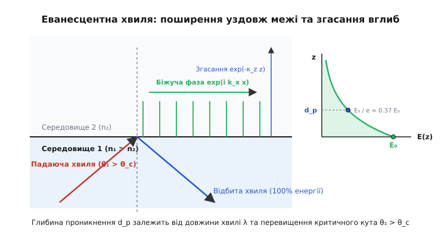
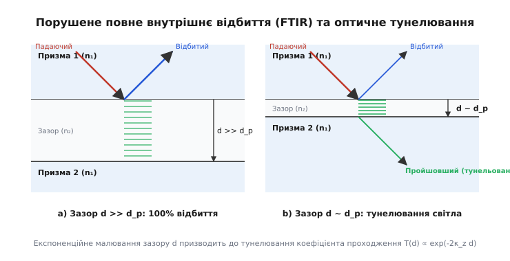
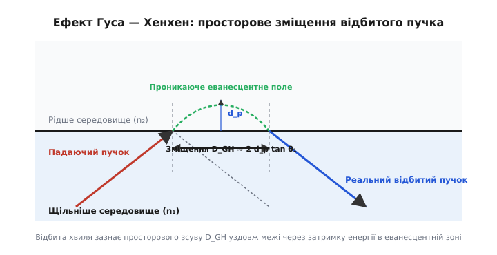
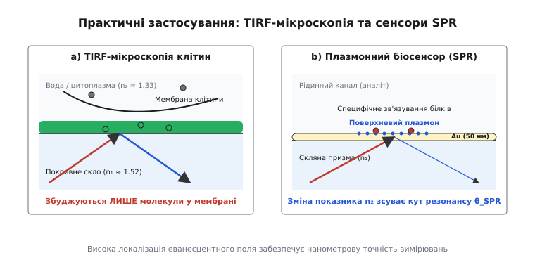

# Еванесцентна хвиля

<preknowlist>
- [Повне внутрішнє відбиття](topic:ph-waves/total-internal-reflection) — явище, при якому світлова хвиля повністю повертається у первинне середовище при кутах падіння, більших за критичний.
- [Рівняння Максвелла](topic:ph-electromagnetism/maxwell-equations) — граничні умови для неперервності тангенціальних компонент полів на межі середовищ.
- [Формули Френеля](topic:ph-waves/fresnel-equations) — коефіцієнти відбиття й заломлення світла та комплексні фазові зсуви.
</preknowlist>

При повному внутрішньому відбитті геометрична оптика малює спрощену й наочну картину: світловий промінь падає на плоску межу оптично менш щільного середовища під кутом, більшим за критичний, і беззастережно повертається назад у первинне середовище, не залишаючи жодного сліду за геометричною поверхнею розділу. Проте класична електродинаміка Максвелла робить таке миттєве й стрибкоподібне зникнення полів фізично неможливим. Граничні умови для векторів електричного й магнітного полів вимагають строгої неперервності тангенціальних компонент на кромці розділу в кожний момент часу. Якби електромагнітне поле за межею дорівнювало точно нулю, напруженість поля на поверхні мала б нескінченно великий просторовий градієнт, що суперечить фундаментальним рівнянням поля. 

Для виконання граничних умов Максвелла світло змушене проникати в оптично менш щільне середовище у вигляді особливої електромагнітної хвилі — **еванесцентної** (від латинського *evanescere* — згасати, зникати). Це поле не поширюється у глибину другого середовища у вигляді класичного світлового променя, а формує приповерхневий шар, амплітуда якого спадає за експоненційним законом.

Про те, як три століття наукових суперечок навколо цієї локалізованої хвилі привели до створення наноскопії та молекулярної біосенсорики, розповідається в історичній вставці [📜 Історія дослідження еванесцентних хвиль: від запитань Ньютона до наноскопії](topic:ph-waves/evanescent-wave/hist-evanescent-discovery.md).

---

### Механізм виникнення та уявний хвильовий вектор

Фізична причина виникнення еванесцентної хвилі криється у дисперсійному співвідношенні для електромагнітної хвилі та у вимозі узгодження фаз на межі середовищ.

Нехай плоска монохроматична хвиля з кутовою частотою `ω` та хвильовим числом у вакуумі `k₀ = ω / c` падає з першого середовища з показником заломлення `n₁` на плоску межу `z = 0` з другим середовищем, яке має менший показник заломлення `n₂ < n₁`. Якщо площина падіння збігається з площиною `xz`, то хвильовий вектор падаючої хвилі має компоненти:

```
k[1x] = k₀ · n₁ · sin θ₁
k[1z] = k₀ · n₁ · cos θ₁
```

Розглянемо виведення граничних умов Максвелла на межі `z = 0`. Інтегральна форма рівняння Максвелла `∮ E · dl = - d/dt ∬ B · dS` для нескінченно вузького прямокутного контуру, який охоплює межу розділу двох діелектриків, вимагає відсутності стрибка тангенціальної компоненти напруженості електричного поля:

```
E[1x](x, y, 0, t) = E[2x](x, y, 0, t)
E[1y](x, y, 0, t) = E[2y](x, y, 0, t)
```

Якби напруженість поля за межею розділу `z > 0` була строго нульовою, виникав би нескінченно великий градієнт поля `∂E_x / ∂z → ∞`. Це означало б існування на поверхні нескінченно великого вихрового магнітного поля або поверхневого магнітного струму, що є фізично неможливим у прозорому діелектрику.

Отже, граничні умови вимагають, щоб у кожній точці межі розділу `z = 0` фази падаючої, відбитої та заломленої хвиль повністю збігалися уздовж усієї поверхні. Це означає, що тангенціальна компонента хвильового вектора у другому середовищі `k[2x]` мусить дорівнювати тангенціальній компоненти у першому середовищі:

```
k[2x] = k[1x] = k₀ · n₁ · sin θ₁
```

З іншого боку, модуль хвильового вектора у втором середовищі строго обмежений його оптичною щільністю: `k₂ = k₀ · n₂`. Дисперсійне співвідношення для вільної плоскої хвилі у другому середовищі зв'язує його компоненти:

```
k[2x]² + k[2z]² = k₂² = (k₀ · n₂)²
```

Виразимо квадрат нормальної компоненти хвильового вектора `k[2z]²`:

```
k[2z]² = k₂² - k[2x]² = k₀² · (n₂² - n₁² · sin² θ₁)
```

Коли кут падіння перевищує критичний поріг `θ₁ > θ_c = arcsin(n₂ / n₁)`, величина `sin θ₁` стає більшою за відношення `n₂ / n₁`. Як наслідок, вираз у дужках `(n₂² - n₁² · sin² θ₁)` стає строго від'ємним. У рамках дійсної алгебри це означало б відсутність заломленої хвилі. Проте у комплексній площині це свідчить про те, що нормальна компонента хвильового вектора `k[2z]` стає чисто уявною величиною:

```
k[2z] = ± i · κ_z
κ_z = k₀ · √(n₁² · sin² θ₁ - n₂²) = (2π / λ₀) · √(n₁² · sin² θ₁ - n₂²)
```

Підставимо уявний хвильовий вектор `k₂ = (k[1x], 0, -i · κ_z)` у загальний вираз для комплексної напруженості електричного поля плоскої хвилі у втором середовищі `E₂(x, z, t) = E₀₂ · exp(i(k[2x] · x + k[2z] · z - ωt))`:

```
E₂(x, z, t) = E₀₂ · exp(i(k[1x] · x + (-i · κ_z) · z - ωt))
E₂(x, z, t) = E₀₂ · exp(-κ_z · z) · exp(i(k[1x] · x - ωt))
```

Ця формула повністю описує структуру **еванесцентної хвилі**:
1. **Уздовж поверхні розділу (вісь `x`):** хвиля є гармонічною біжучою хвилею з фазовим множником `exp(i(k[1x] · x - ωt))`. Її фазова швидкість уздовж поверхні дорівнює `v[ph,x] = ω / k[1x] = c / (n₁ · sin θ₁)`. Оскільки `n₁ · sin θ₁ > n₂`, фазова швидкість еванесцентної хвилі уздовж межі є меншою за швидкість світла у вакуумі та у другому середовищі — це так звана уповільнена хвиля (*slow wave*).
2. **Перпендикулярно до поверхні (вісь `z`):** хвиля втрачає гармонічний осциляційний характер. Амплітуда поля монотонно спадає за експоненційним законом `exp(-κ_z · z)` без жодного зсуву фази уздовж напрямку `z`.


*Еванесцентне поле поширюється у вигляді біжучої хвилі уздовж межі розділу двох середовищ і згасає за експоненційним законом exp(-κ_z z) вглиб оптично менш щільного середовища.*

---

### Неоднорідна плоска хвиля та топологія хвильових фронтів

У класичній оптиці плоска хвиля вважається однорідною, якщо площини постійної фази збігаються з площинами постійної амплітуди. На відміну від неї, еванесцентна хвиля належить до класу **неоднорідних плоских хвиль** (*inhomogeneous plane waves*):

- **Площини постійної фази:** задаються рівнянням `k[1x] · x - ωt = \text{const}`. Це вертикальні площини, перпендикулярні до поверхні розділу (паралельні осі `z`). Вони рухаються уздовж осі `x` зі швидкістю `v[ph,x] = c / (n₁ · sin θ₁)`.
- **Площини постійної амплітуди:** задаються рівнянням `κ_z · z = \text{const}`. Це горизонтальні площини, паралельні межі розділу `z = 0`.

Оскільки вектор фазової швидкості спрямований вздовж осі `x`, а вектор градієнта амплітуди — вздовж осі `z`, вони ортогональні один до одного. Це означає, що хвилеві фронти еванесцентної хвилі згасають не в напрямку свого поширення, а в поперечному напрямку, створюючи просторово локалізований приповерхневий світловий канал.

---

### Глибина проникнення та просторові характеристики

Ключовою кількісною характеристикою згасаючого поля є **глибина проникнення** `d_p` (також відома як скін-шар або довжина згасання амплітуди). Глибиною проникнення називають відстань від межі `z = 0` уздовж осі `z`, на якій амплітуда електричного поля зменшується в `e` разів (приблизно у `2.718` раза) порівняно зі значенням безпосередньо на поверхні:

```
d_p = 1 / κ_z = λ₀ / (2π · √(n₁² · sin² θ₁ - n₂²))
```

Інтенсивність оптичного поля `I(z)`, яка пропорційна квадрату амплітуди напруженості електричного поля `|E(z)|²`, спадає удвічі швидше:

```
I(z) = I₀ · exp(-2 · κ_z · z) = I₀ · exp(-z / d_I)
d_I = d_p / 2 = λ₀ / (4π · √(n₁² · sin² θ₁ - n₂²))
```

Аналіз формули глибини проникнення виявляє важливі фізичні залежності:

1. **Залежність від кута падіння `θ₁`:**
   - Коли кут падіння наближається до критичного кута згори (`θ₁ → θ_c + 0°`), вираз під коренем прямує до нуля: `n₁² · sin² θ_c - n₂² = 0`. Отже, `κ_z → 0`, а глибина проникнення прямує до нескінченності (`d_p → ∞`). На межі критичного кута еванесцентна хвиля трансформується у звичайну зрізану плоску хвилю, яка ковзає уздовж межі у другому середовищі.
   - Коли кут падіння зростає до граничного ковзного значення `θ₁ → 90°`, глибина проникнення досягає свого фізичного мінімуму:
     ```
     d[p,min] = λ₀ / (2π · √(n₁² - n₂²))
     ```
2. **Залежність від довжини хвилі `λ₀`:**
   Глибина проникнення прямо пропорційна довжині хвилі світла. Для ультрафіолетового випромінювання еванесцентний шар є вужчим, а для інфрачервоного — значно ширшим.
3. **Залежність від поляризації та ефект поверхневого підсилення полів:**
   Хоча параметр згасання `κ_z` однаковий для обох поляризацій, амплітуди компонент полів на самій межі `z = 0` суттєво відрізняються. Для s-поляризації (TE) вектор електричного поля паралельний поверхні і має лише один компонент `E_y`. Для p-поляризації (TM) вектор електричного поля описує еліпс у площині падіння `xz`, створюючи як поздовжню компоненту `E_x`, так і нормальну компоненту `E_z`. Напруженість поля `E_z` безпосередньо на межі `z = +0` може бути помітно більшою за амплітуду падаючої хвилі завдяки накопиченню поверхневого поляризаційного заряду.

Повні аналітичні виведення векторних компонент для обох поляризацій розгорнуто в математичній вставці [🧮 Повний векторний розрахунок еванесцентного поля, вектора Пойнтінга та проходження FTIR](topic:ph-waves/evanescent-wave/math-evanescent-derivation.md).

#### Числовий приклад розрахунку
Розглянемо межу скляної призми з оптичного крону (`n₁ = 1.52`) та води (`n₂ = 1.33`) для зеленого лазера з довжиною хвилі `λ₀ = 532 нм`.

Критичний кут становить:
```
θ_c = arcsin(1.33 / 1.52) = arcsin(0.875) ≈ 61.04°
```

Обчислимо глибину проникнення при куті падіння `θ₁ = 68°` (`sin 68° ≈ 0.9272`):

```
n₁² · sin² θ₁ = (1.52)² · (0.9272)² = 2.3104 · 0.8597 ≈ 1.9863
n₂² = (1.33)² = 1.7689
√(n₁² · sin² θ₁ - n₂²) = √(1.9863 - 1.7689) = √0.2174 ≈ 0.4663

d_p = 532 нм / (2π · 0.4663) = 532 нм / (6.2832 · 0.4663) ≈ 181.6 нм
```

Отже, глибина проникнення електричного поля у воду становить всього `182 нм` (менше третини довжини хвилі), а інтенсивність поля `I(z)` згасає в `e` разів уже на відстані `d_I = 91 нм`.

---

### Структура полів для TE та TM поляризацій

Електромагнітна структура еванесцентного поля суттєво відрізняється залежно від того, як орієнтований вектор напруженості електричного поля відносно площини падіння `xz`.

#### 1. Перпендикулярна поляризація (s-поляризація, TE-мода)
У цьому випадку вектор електричного поля ортогональний до площини падіння й орієнтований уздовж осі `y`: `E = (0, E_y, 0)`.

З рівнянь Максвелла випливає, що магнітне поле має дві складові у площині падіння: поздовжню `H_x` та нормальну `H_z`:

```
E_y(x, z, t) = E₀_s · exp(-κ_z · z) · exp(i(k[1x] · x - ωt))
H_x(x, z, t) = (i · κ_z / (μ₀ · ω)) · E₀_s · exp(-κ_z · z) · exp(i(k[1x] · x - ωt))
H_z(x, z, t) = (k[1x] / (μ₀ · ω)) · E₀_s · exp(-κ_z · z) · exp(i(k[1x] · x - ωt))
```

Зверніть увагу на важливу деталь: нормальна компонента магнітного поля `H_z` перебуває у фазі з електричним полем `E_y`, тоді як поздовжня компонента `H_x` зсунута по фазі на `90°` (колективна наявність уявної одиниці `i`). Це означає, що вектор магнітного поля у площині падіння здійснює обертальний рух — виникає еліптична магнітна поляризація.

#### 2. Паралельна поляризація (p-поляризація, TM-мода)
У випадку TM-поляризації вектор магнітного поля спрямований вздовж осі `y`: `H = (0, H_y, 0)`. 

Електричне поле має дві компоненти у площині падіння:

```
H_y(x, z, t) = H₀_p · exp(-κ_z · z) · exp(i(k[1x] · x - ωt))
E_x(x, z, t) = (i · κ_z / (ω · ε₂ · ε₀)) · H₀_p · exp(-κ_z · z) · exp(i(k[1x] · x - ωt))
E_z(x, z, t) = (k[1x] / (ω · ε₂ · ε₀)) · H₀_p · exp(-κ_z · z) · exp(i(k[1x] · x - ωt))
```

Наявність фазового зсуву `π / 2` між тангенціальною компонентою `E_x` та нормальною компонентою `E_z` означає, що вектор напруженості електричного поля у другому середовищі обертається у площині падіння `xz`, описуючи еліпс. Нормальна компонента `E_z` викликає періодичне натікання й відтікання зв'язаних електричних зарядів на межі розділу, що створює поверхневу площину діелектричної поляризації.

---

### Комплексні формули Френеля та траєкторія фази

Комплексні коефіцієнти відбиття Френеля `r_s` та `r_p` у режимі повного внутрішнього відбиття можна подати у комплексній формі:

```
r_s = (n₁ · cos θ₁ - i · √(n₁² · sin² θ₁ - n₂²)) / (n₁ · cos θ₁ + i · √(n₁² · sin² θ₁ - n₂²)) = exp(i · δ_s)
r_p = (n₂² · cos θ₁ - i · n₁ · √(n₁² · sin² θ₁ - n₂²)) / (n₂² · cos θ₁ + i · n₁ · √(n₁² · sin² θ₁ - n₂²)) = exp(i · δ_p)
```

Оскільки чисельник і знаменник у виразах `r_s` та `r_p` є комплексно-сопряженими числами вида `u - i·v` та `u + i·v`, модуль коефіцієнтів відбиття строго дорівнює одиниці:

```
|r_s| = √(u² + v²) / √(u² + v²) = 1.0
|r_p| = 1.0
```

Це математично підтверджує 100% відбиття енергії. Проте при зміні кута падіння від `θ_c` до `90°` комплексні амплітуди `r_s` та `r_p` рухаються уздовж одиничного кола у комплексній площині, змінюючи відповідні фазові кути `δ_s` та `δ_p`. Повна різниця фазових зсувів `Δδ = δ_p - δ_s` виникає через те, що еванесцентні поля для s- та p-поляризацій мають різний розподіл енергії між електричною та магнітною компонентами біля межі.

---

### Динаміка енергії та вектор Пойнтінга

Помилкове уявлення про повне внутрішнє відбиття часто полягає в припущенні, що оскільки світло проникає у друге середовище, воно мусить нести туди енергію, а отже, коефіцієнт відбиття мав би бути меншим за 100%. Розрахунок вектора Умова — Пойнтінга `S = E × H` розкриває справжню динаміку енергії.

Усереднена за часом нормальна компонента вектора Пойнтінга `⟨S_z⟩`, яка відповідає за безповоротне перенесення енергії крізь межу `z = 0` у глибу второго середовища, обчислюється за формулою:

```
⟨S_z⟩ = (1 / 2) · Re(E[x2] · H[y2]* - E[y2] · H[x2]*)
```

Оскільки між електричним полем `E` та магнітним полем `H` еванесцентної хвилі існує точний фазовий зсув на `90°` (`π / 2`), добуток поля на комплексно-сопряжене поле є чисто уявним числом. Враховуючи, що дійсне значення чисто уявного числа дорівнює нулю, отримуємо:

```
⟨S_z⟩ = 0
```

Це фундаментальний результат: **усереднений за часом потік енергії у нормальному напрямку строго дорівнює нулю**. Еванесцентне поле не виносить енергію у друге середовище безповоротно. Протягом одного напівперіоду світлової хвилі енергія проникає у рідший шар, створюючи реактивне електромагнітне поле, а протягом наступного напівперіоду повністю повертається назад у перше середовище.

Проте усереднена за часом тангенціальна компонента вектора Пойнтінга `⟨S_x⟩` є строго більшою за нуль:

```
⟨S_x⟩ = (1 / 2) · Re(E[y2] · H[z2]*) = (n₁ · sin θ₁ / (2 · μ₀ · c)) · |E₀₂|² · exp(-2 · κ_z · z) > 0
```

Еванесцентне поле циркулює вздовж межі розділу, переносячи реактивну енергію паралельно поверхні у вузькому приповерхневому шарі товщиною порядку `d_p`.

---

### Ближнє поле, високочастотні просторові гармоніки та межа дифракції

Еванесцентна хвиля відіграє фундаментальну роль у теорії оптичного зображення та поясненні класичної дифракційної межі Ернста Аббе. 

Будь-яке оптичне поле, що випромінюється або розсіюється об'єктом складної форми, можна розкласти у просторовий спектр Фурьє за просторовими частотами `k_x` та `k_y`. Дисперсійне співвідношення для хвильових компонент у вільному просторі має вигляд:

```
k_x² + k_y² + k_z² = k₀² = (2π / λ₀)²
```

1. **Дальнє поле (далекопольні гармоніки `k_x² + k_y² ≤ k₀²`):**
   Для просторових деталей об'єкта, розміри яких більші за півдовжину хвилі (`Δx > λ₀ / 2`), просторові частоти обмежені значенням `k₀`. Відповідні компоненти хвильового вектора `k_z = √(k₀² - k_x² - k_y²)` є дійсними числами. Ці хвилі вільно поширюються у дальнє поле й уловлюються лінзами звичайного мікроскопа.
2. **Ближнє поле (ближньопольні еванесцентні гармоніки `k_x² + k_y² > k₀²`):**
   Дрібні нанометрові деталі об'єкта (`Δx << λ₀ / 2`) кодуються у просторових гармоніках із високими частотами `k_x > k₀`. Для цих гармонік нормальна компонента хвильового вектора `k_z = i · √(k_x² + k_y² - k₀²)` стає чисто уявною. Вони утворюють згасаючі еванесцентні хвилі, які експоненційно згасають на відстані кількох нанометрів від поверхні об'єкта й **не досягають лінз далекого поля**.

Саме експоненційне згасання високочастотних еванесцентних гармонік є фізичною причиною існування дифракційної межі Аббе `Δx[min] ≈ λ₀ / (2 · NA)`. Скануючі ближньопольові оптичні мікроскопи (SNOM) та оптичні суперлінзи на основі метаматеріалів із від'ємним показником заломлення (`n = -1`, суперлінза Пендрі) здатні підсилювати або уловлювати ці еванесцентні хвилі безпосередньо у ближньому полі, відновлюючи зображення об'єкта з нанометровою роздільною здатністю.

---

### Фізика оптичного тунелювання (FTIR)

Якщо у зону існування еванесцентного поля (на відстані `z ≤ d_p`) внести третє середовище з високим показником заломлення `n₃ > n₂` (наприклад, наблизити другу скляну призму до першої), нульовий баланс енергії порушується.

Еванесцентна хвиля досягає межі другого й третього середовищ із незанульованою амплітудою. На другій межі виникає звичайна заломлена біжуча хвиля, яка починає поширюватися у третьому середовищі. Це явище називають **порушеним повним внутрішнім відбиттям** (*Frustrated Total Internal Reflection, FTIR*).


*При зменшенні товщини зазору d до розмірів глибини проникнення d_p еванесцентне поле досягає третього середовища, викликаючи тунелювання світлової енергії (FTIR).*

Коефіцієнт проходження світла `T(d)` крізь тонкий зазор товщиною `d` для s-поляризації описується формулою:

```
T(d) = 1 / (1 + A · sinh²(κ_z · d))
```

де `A` — геометрично-оптичний коефіцієнт, що залежить від кута падіння та показників заломлення, а `sinh` — гіперболічний синус.

При товщині зазору `d >> d_p` формула набуває суто експоненційного вигляду:

```
T(d) ∝ exp(-2 · κ_z · d) = exp(-2 · d / d_p)
```

Математичне рівняння для коефіцієнта проходження FTIR є абсолютно тотожним формулі тунельного ефекту в квантовій механіці, яка описує проходження мікрочастинки (наприклад, електрона) крізь потенціальний бар'єр. Зазор з низьким показником заломлення відіграє для фотона роль «потенціального бар'єра», а еванесцентна хвиля у зазорі є оптичним аналогом згасаючої хвильової функції де Бройля.

Програми для чисельного розрахунку профілю поля та тунельного проходження FTIR мовами C++ та Python подано у практичній вставці [⚙️ Чисельне моделювання еванесцентного поля та оптичного тунелювання](topic:ph-waves/evanescent-wave/proj-evanescent-sim.md).

---

### Ефект Гуса — Хенхен та просторові зміщення відбитого пучка

Існування еванесцентного поля та циркуляція енергії вздовж межі спричиняють два важливі фізичні наслідки для відбитої хвилі:

1. **Просторовий зсув Гуса — Хенхен (*Goos-Hänchen shift*):**
   Реальний світловий пучок скінченної ширини при повному внутрішньому відбитті повертається у перше середовище не з точної геометричної точки падіння, а зі зміщенням `D_GH` вздовж поверхні.
   
   Фізично це пояснюється тим, що фотони пучка проникають у рідше середовище, проходять певний шлях уздовж межі у складі еванесцентної хвилі і лише потім перевипромінюються назад. Зсув `D_GH` дорівнює:
   
   ```
   D_GH ≈ 2 · d_p · tan θ₁
   ```


*Відбитий світловий пучок зазнає просторового зсуву D_GH уздовж межі розділу через короткочасне проникнення енергії в еванесцентну зону.*

2. **Поперечне зміщення Імбера — Федорова (*Imbert-Fedorov shift*):**
   Для кругово або еліптично поляризованого світла виникає додатковий просторовий зсув у напрямку, перпендикулярному до площини падіння `xz` — уздовж осі `y`. Це є результатом спінового ефекту Холла для фотонів, викликаного взаємодією спінового кутового моменту поляризації з орбітальним рухом еванесцентного поля.

3. **Комплексні фазові зсуви Френеля:**
   Оскільки коефіцієнти відбиття Френеля при ПВВ стають комплексними числами з модулем, що дорівнює одиниці (`|r_s| = 1`, `|r_p| = 1`), відбиття не змінює інтенсивність хвилі, але надає їй фазового зміщення `δ_s` та `δ_p`. Різниця фазових зсувів `Δδ = δ_p - δ_s` залежить від кута падіння:

   ```
   tan(Δδ / 2) = (cos θ₁ · √(n₁² · sin² θ₁ - n₂²)) / (n₁ · sin² θ₁)
   ```

Цей фазовий зсув використовується у ромбі Френеля для перетворення лінійної поляризації у кругову за два послідовних повних внутрішніх відбиття.

---

### Еванесцентні поля у хвилеводній фотоніці та мікрорезонаторах

У планарних діелектричних хвилеводах та волоконних світловодах еванесцентна хвиля виконує роль сполучного містка між серцевиною хвилеводу та навколишнім середовищем:

1. **Модова структура планарного хвилеводу:**
   Світлова хвиля, заперта у скляній плівці товщиною `h` із показником `n_core`, зазнає послідовних ПВВ від верхньої та нижньої оболонок з показниками `n_cladd < n_core`. Усередині серцевини поле має вигляд стоячої хвилі `cos(k_z · z)`, а в оболонках трансформується у два симетричні або антисиметричні еванесцентні хвости `exp(-κ_z · |z|)`. Значна частина енергії зв'язаної оптичної моди фактично переноситься в оболонці у вигляді еванесцентного поля.
2. **Мікрорезонатори «шепочучої галереї» (Whispering Gallery Modes, WGM):**
   У скляних мікросферах чи дисках діаметром десятки мікронів світло ковзає вздовж колової межі за рахунок безперервного ПВВ. Назовні мікросфери формується кільцеве еванесцентне поле. Наближаючи конусне оптичне волокно на відстань `100–200 нм` до мікросфери, можна за рахунок FTIR перекачувати світло з волокна в резонатор із добротністю `Q > 10⁸`.
3. **Нанофотонні направлені куплери:**
   Розташувавши два паралельні планарні хвилеводи на відстані `d ~ d_p`, розробники фотонних мікросхем створюють направлені оптичні розгалужувачі. Завдяки перекриттю двох еванесцентних полів оптична потужність періодично перекачується з першого хвилеводу в другий із довжиною перекачки `L_c = π / (2C)`, де `C` — коефіцієнт еванесцентного зв'язку.

---

### Поширення концепції: еванесцентні хвилі в інших галузях фізики

Хоча еванесцентна хвиля найбільш відома в оптиці, вона є універсальним хвильовим явищем, яке виникає у будь-яких фізичних системах при існуванні дійсного та уявного спектрів дисперсії:

1. **Акустичні еванесцентні хвилі:**
   При відбитті ультразвукових хвиль від межі розділу двох рідин або твердих тіл під кутами, що перевищують критичний кут акустичного заломлення, у другому середовищі виникає згасаюча акустична хвиля тиску `P(z) = P₀ · exp(-κ_a · z)`. Це явище широко використовується в акустичній мікроскопії та ультразвуковій дефектоскопії для неруйнівного контролю поверхневих мікротріщин.
2. **Хвилі матерії (квантово-механічні хвилі де Бройля):**
   Електрони у напівпровідникових гетероструктурах або пучки ультрахолодних атомів в оптичних ґратках при зіткненні з високим потенціальним бар'єром описуються згасаючою хвильовою функцією `Ψ(z) = Ψ₀ · exp(-κ_q · z)`. Це забезпечує тунельний струм у тунельних діодах, КМОП-транзисторах та скануючих тунельних мікроскопах (STM).
3. **Поверхневі хвилі у рідинах:**
   Гравітаційно-капілярні хвилі на поверхні води при поширенні вздовж дна мілководдя або уздовж вертикальних перешкод формують згасаючий профіль гідродинамічного тиску у глибину рідини.

---

### Практичні застосування у нанотехнологіях та фотоніці

Завдяки своїй унікальній властивості — високій просторовій локалізації у нанометровому шарі біля межі розділу — еванесцентні хвилі стали основою для цілої низки новітніх технологій.


*Приповерхнева локалізація еванесцентного поля забезпечує виділення мембранних компонент у TIRF-мікроскопії та високочутливу реєстрацію молекулярного зв'язування у біосенсорах SPR.*

#### 1. TIRF-мікроскопія (Total Internal Reflection Fluorescence)
У класичній флуоресцентній мікроскопії лазерний промінь проходить крізь увесь об'єм клітини, викликаючи фонову флуоресценцію з усієї товщі цитоплазми. У TIRF-мікроскопії лазер спрямовують під кутом ПВВ крізь покривне скло. Згасаюче еванесцентне поле завтовшки `100–150 нм` збуджує флуорофори **виключно у клітинній мембрані** та прилеглих до неї органелах. Це забезпечує рекордний контраст і високе відношення сигнал/шум при дослідженні одиночних молекул, екзоцитозу та мембранних рецепторів.

#### 2. Поверхневий плазмонний резонанс (SPR)
Якщо на грань скляної призми напилити тонку плівку золота завтовшки близько `50 нм` (геометрія Кретчманна), еванесцентна хвиля при ПВВ здатна резонансно передати свою енергію вільним електронам металу, збуджуючи **поверхневі плазмон-поляритони**. При резонансному куті падіння `θ_SPR` інтенсивність відбитого світла різко падає майже до нуля. 

Оскільки плазмонна хвиля вкрай чутлива до оптичної щільності навколишнього середовища, зв'язування навіть поодиноких білкових молекул або антитіл на поверхні золота зміщує кут `θ_SPR`. Сенсори SPR дозволяють вимірювати кінетику біомолекулярних взаємодій у реальному часі без додавання флуоресцентних міток.

#### 3. Ближньопольова мікроскопія SNOM / s-SNOM
Скануюча ближньопольова оптична мікроскопія подолала класичну дифракційну межу Аббе `λ / 2`. Використовуючи загострений світловід з субхвильовою апертурою `20–50 нм` або голку атомно-силового мікроскопа у режимі розсіяння (s-SNOM), мікроскоп вимірює розсіяне еванесцентне поле на відстані кількох нанометрів від поверхні, досягаючи роздільної здатності у `10 нм`.

#### 4. Оптичні пінцети та градієнтні еванесцентні сили
Сильний просторовий градієнт інтенсивності еванесцентного поля `∇|E|²` створює оптичну градієнтну силу, яка притягує діелектричні мікросфери, білки або віруси до поверхні waveguide-чіпа. Поєднуючи тангенціальний потік енергії `⟨S_x⟩` із градієнтною силою, вчені конструюють оптичні конвеєри для транспортування поодиноких клітин вздовж фотонних каналів без механічного контакту.

#### 5. Нейтралізація втрат у волоконних світловодах
У волоконно-оптичних лініях зв'язку світло поширюється у серцевині світловода за рахунок ПВВ на межі з оболонкою. Еванесцентне поле проникає в оболонку на глибину кількох мікронів. Щоб запобігти витоку енергії та згасанню сигналу через мікрошорсткості зовні, товщина чистої захисної оболонки оптичного волокна повинна суттєво перевищувати глибину проникнення еванесцентного поля (`d_shell >> d_p`).

#### 6. Спектроскопія порушеного повного внутрішнього відбиття (ATR-FTIR)
В інфрачервоній спектроскопії порушеного повного внутрішнього відбиття (*Attenuated Total Reflection*) досліджуваний зразок (порошок, гель, полімер або тканину) притискають до кристала з високим показником заломлення (алмаз, германій, селенід цинку). Інфрачервоне еванесцентне поле проникає в зразок на глибину `0.5–5 мкм`. Якщо молекули зразка поглинають певні ІЧ-частоти, енергія еванесцентного поля поглинається, і відбитий промінь втрачає відповідні спектральні лінії. Це дозволяє отримувати ІЧ-спектри твердих і в'язких речовин без їх попереднього розчинення чи виготовлення прозорих таблеток.

> 🔧 **Навіщо це.**
> Еванесцентні хвилі — це ключовий інструмент сучасної нанофотоніки та біофізики. Вони дозволяють подолати дифракційну межу оптичної мікроскопії, маніпулювати одиночними наночастинками за допомогою оптичних пінцетів, створювати ультрачутливі біосенсори для діагностики захворювань та конструювати компактні оптичні куплери для інтегральних фотонних мікросхем.

---

### Підсумковий синтез

Еванесцентна хвиля ілюструє фундаментальну єдність хвильових процесів у фізиці. Вона виникає не як випадкова аномалія, а як неминучий наслідок граничних умов Максвелла, що забезпечує гладкість електромагнітного поля на межі двох середовищ при повному внутрішньому відбитті. 

Локалізована вздовж поверхні розділу, ця хвиля переносить енергію паралельно межі, не витрачаючи її у нормальному напрямку, і зберігає повну хвильову аналогію з квантовим тунелюванням. Відкриття та інженерне підкорення еванесцентних полів перетворило оптичне явище XVIII століття на фундамент наноскопії XXI століття.
