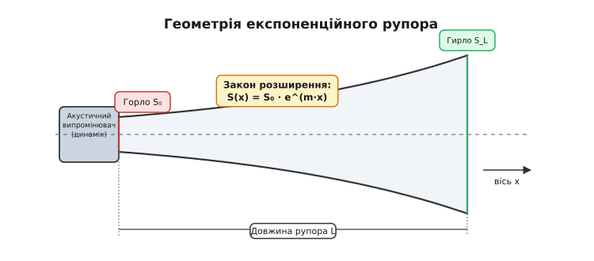
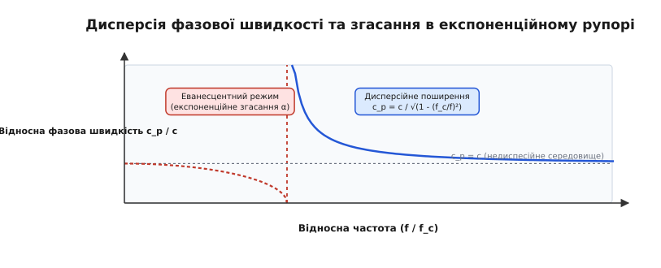
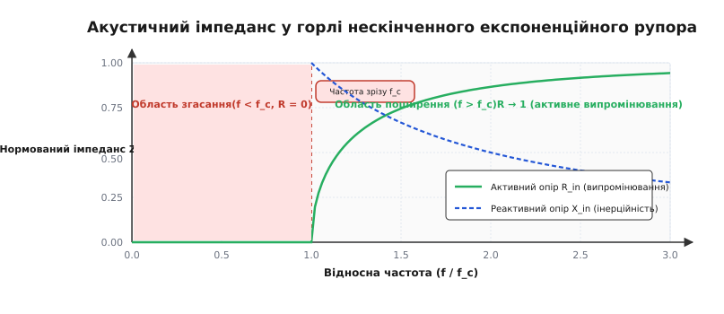
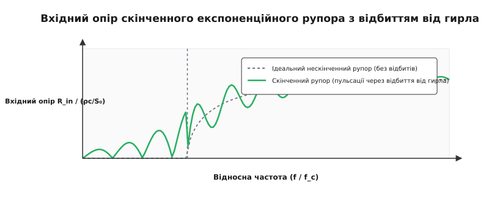

# Експоненційний рупор: теорія акустичного узгодження та поширення хвиль

<preknowlist>
- [Акустичний імпеданс](root:ph-waves/acoustic-impedance) — опір середовища акустичному деформуванню та коливальній швидкості частинок.
- [Хвильове рівняння](root:ph-waves/wave-equation) — диференціальне рівняння поширення малого акустичного збурення в середовищі.
- [Резонанс](root:ph-waves/resonance) — явище різкого зростання амплітуди при збігу частоти зовнішньої сили з власною частотою системи.
- [Швидкість звуку](root:ph-waves/sine-wave) — фазова швидкість поширення механічної звукової хвилі.
</preknowlist>

Приєднайте невелику компресійну мембрану від навушника або дифузор діаметром 2.5 см безпосередньо до потужного генератора й спробуйте озвучити великий актовий зал на низькій частоті 200 Гц. Попри те, що електричний підсилювач віддаватиме десятки Ват потужності, а сама мембрана скажено вібруватиме з амплітудою в кілька міліметрів, зал зануриться у майже повну тишу. Понад `99%` механічної енергії випромінювача марно витратиться на ганяння повітря «туди-сюди» у бічних локальних потоках навколо мембрани, так і не перетворившись на біжучу звукову хвилю. Проте варто надіти на той самий випромінювач розширену трубу зі спеціальним експоненціальним профілем — і той самий сигнал звуковим ударом заповнить увесь приміщення. Чому ж відкрите повітря чинить колосальний опір малому випромінювачу, і яким чином звичайне розширення труби здатне збільшити акустичну віддачу в сотні разів?

Відповідь кроїться у фундаментальній фізичній проблемі акустики — **розбіжності акустичних імпедансів** (*impedance mismatch*) між малим джерелом звуку та безмежним відкритим середовищем. Пристрій, що розв'язує цю проблему шляхом плавної просторової трансформації опору, називається **експоненційним рупором** (*exponential horn*).

---

### 1. Чому малий випромінювач «мовчить»: парадокс акустичного короткого замикання

Щоб зрозуміти фізичну природу проблеми, розглянемо поширення звуку від плоского або купольного поршня радіуса `r₀`, який вагається у відкритому повітряному просторі під дією зовнішньої механічної сили `F`.

Коли поршень рухається вперед, він стискає повітря перед своєю поверхнею, створюючи область локального надлишкового тиску `p`. Проте повітря — це стисливий газ, який підкоряється законам газової динаміки й прагне розширитися в усіх доступних напрямках. Якщо довжина хвилі звуку `λ = c / f` значно перевищує поперечні розміри випромінювального поршня (`λ ≫ r₀`, або у хвильових вимірах `k·r₀ ≪ 1`, де `k = 2·π / λ` — хвильове число), молекулам повітря значно легше «перетекти» з зони високого тиску перед поршнем у зону низького тиску позаду нього, ніж стискати всю безмежну атмосферну масу попереду.

Цей процес супроводжується двома критичними фізичними наслідками:

1. **Акустичне коротке замикання:** локальний циркуляційний потік повітря навколо країв поршня нейтралізує виникаючий перепад тиску. На низьких частотах повітря поводиться не як пружне середовище для хвильового стиску, а як практично нестислива рідина, що вільно обтікає краї мембрани.
2. **Переважання реактивної маси над активним опором випромінювання:** випромінювальний поршень чинить силову дію на повітря, але замість формування біжучої хвилі він змушений прискорювати туди-сюди малу масу прилеглого повітряного прошарку (так звану **супутню акустичну масу** `m_air`). Ця маса повертає отриману кінетичну енергію назад випромінювачу під час зворотного ходу, створюючи чисто реактивне навантаження без передачі активної потужності в довкілля.

В акустичній фізиці розрізняють три різновиди імпедансу, які важливо чітко розрізняти:
* **Питомий акустичний імпеданс `z₀ = p / v`** (Па·с/м) — відношення надлишкового тиску до коливальної швидкості частинок у точці.
* **Акустичний імпеданс поперечного перерізу `Z_A = p / U`** (Па·с/м³) — відношення тиску до об'ємної швидкості потоку `U = v · S`.
* **Механічний імпеданс `Z_M = F / v`** (Н·с/м) — відношення сили до лінійної швидкості поршня `v`.

Зв'язок між цими величинами задається співвідношеннями через площу перерізу `S`:

```
z₀ = Z_A · S
Z_M = Z_A · S² = z₀ · S
```

Згідно з класичною теорією Релея для поршня в нескінченному екрані, питомий активний опір випромінювання `R_rad` незахищеного поршня на низьких частотах (`k·r₀ ≪ 1`) спадає пропорційно квадрату частоти:

```
R_rad ≈ ρ₀ · c · (k · r₀)² / 2 = ρ₀ · c · (2 · π · f · r₀ / c)² / 2
```

де `ρ₀` — густина повітря (приблизно `1.204` кг/м³ при 20°C), а `c` — швидкість звуку (`343` м/с).

Обчислимо конкретні числові значення для типового компресійного драйвера з діаметром горла `d₀ = 2.54` см (1 дюйм, радіус `r₀ = 0.0127` м) на частоті `f = 200` Гц:

```
k = 2 · π · 200 / 343 ≈ 3.664 м⁻¹
k · r₀ = 3.664 · 0.0127 ≈ 0.0465 ≪ 1
R_rad ≈ 1.204 · 343 · (0.0465)² / 2 ≈ 0.446 Па·с/м
```

Порівняємо отримане значення з питомим хвильовим імпедансом плоскої біжучої хвилі у вільному середовищі `z₀ = ρ₀ · c = 1.204 · 343 ≈ 413` Па·с/м. Малий випромінювач бачить опір повітряного середовища, який у `413 / 0.446 ≈ 926` разів менший за нормальний опір плоского хвильового фронту.

У термінах електроакустичних еквівалентних схем (модель Тіле-Смолла) коефіцієнт корисної дії `η` перетворення механічної енергії дифузора в акустичне випромінювання дорівнює відношенню активного опору випромінювання `R_rad` до повного механічного опору системи (включаючи масу мембрани `m_d` та опір підвісу `R_ms`):

```
η = R_rad / (R_ms + R_rad) ≪ 0.001  (менше 0.1%)
```

Щоб змусити малий випромінювач ефективно передавати енергію в простір, потрібно змусити його працювати проти колосально більшого акустичного опору. Саме цю задачу розв'язує акустичний рупор. Детальніше про історію створення цього механізму див. [📜 Історія експоненційного рупора](root:ph-waves/exponential-horn/hist-exponential-horn.md).

---

### 2. Рупор як акустичний трансформатор імпедансу

**Акустичний рупор** (*acoustic horn*) — це жорсткий канал зі змінною площею поперечного перерізу `S(x)`, який з'єднує малу площу випромінювача у **горлі** (*throat*, `S₀`) із великою площею відкритого виходу у **гирлі** (*mouth*, `S_L`).


*Геометрія та профіль розширення експоненційного рупора від горла S₀ до гирла S_L.*

Фізичний механізм дії рупора базується на принципі **просторової трансформації акустичного імпедансу**:

1. **У горлі рупора (`S₀`):** малий переріз каналу з усіх боків обмежений жорсткими стінками. Повітря позбавлене можливості розтікатися вбік, тому навіть мізерне лінійне зміщення мембрани `ξ` викликає велику деформацію стиску газу й створює величезний надлишковий акустичний тиск `p₀`. Мала об'ємна швидкість `U₀ = v₀ · S₀` при великому тиску `p₀` означає, що мембрана працює на **високий акустичний імпеданс горла `Z_throat = p₀ / U₀`**.
2. **Уздовж каналу рупора (`x`):** площа каналу `S(x)` плавно зростає від `S₀` до `S_L`. Зворотним чином, акустичний тиск `p(x)` плавно зменшується, а об'ємна швидкість потоку `U(x) = v(x) · S(x)` зростає. Звукова хвиля поступово розгортається у просторі, зберігаючи повну акустичну потужність `P = p · U`.
3. **У гирлі рупора (`S_L`):** площа гирла обирається достатньо великою, щоб її розмір перевищував довжину хвилі (`d_L ≥ λ / π`). На такій великій площі акустичне коротке замикання не виникає, і хвиля вільно випромінюється у відкритий простір без відбиття.

У повній аналогії з понижувальним електричним трансформатором, який перетворює високу напругу при малому струмі у низьку напругу при великому струмі, акустичний рупор перетворює **високий акустичний тиск при малій об'ємній швидкості у горлі у низький тиск при великій об'ємній швидкості у гирлі**.

Коефіцієнт трансформації акустичного імпедансу `n²` для ідеального рупора без втрат дорівнює відношенню площ гирла й горла:

```
n² = S_L / S₀
```

Завдяки такій трансформації вхідний акустичний опір горла зростає в `S_L / S₀` разів порівняно з незахищеною мембраною, що піднімає електромеханічний ККД компресійної системи з `0.1%` до вражаючих `30–50%`.

---

### 3. Математика плавної зміни перерізу: порівняльний аналіз профілів

Виникає фундаментальне питання: за яким саме математичним законом `S(x)` слід розширювати канал рупора від `S₀` до `S_L`?

Розглянемо п'ять класичних геометрій розширення акустичних труб:

```
1. Циліндрична труба:               S(x) = S₀ = const
2. Конічний рупор:                    S(x) = S₀ · (1 + x / x₀)²
3. Параболічний рупор:                S(x) = S₀ · (1 + x / x₀)
4. Гіперболічний рупор (параметр T):  S(x) = S₀ · [cosh(m·x) + T · sinh(m·x)]²
5. Експоненційний рупор:              S(x) = S₀ · e^(m · x)
```

де `x₀` — відстань від уявного вершини конуса до горла, `m` — показник розширення (м⁻¹), а `T` — параметр форми гіперболічного рупора.

Фізичні відмінності між цими профілями є вирішальними:

* **Циліндрична труба (`S = const`):** взагалі не трансформує імпеданс. Відносна швидкість розширення дорівнює нулю. Звукова хвиля поширюється без зміни амплітуди тиску до відкритого кінця, де зазнає сильного відбиття, перетворюючись на органний резонатор із вузькими піками.
* **Конічний рупор (`S ~ x²`):** площа зростає за квадратичним законом. Відносна логарифмічна швидкість розширення каналу `(1/S) · (dS/dx) = 2 / (x + x₀)` є дуже великою біля горла (`x = 0`) і стрімко спадає вздовж осі. Через це біля горла тиск спадає занадто швидко, і на низьких частотах конічний рупор не здатний підтримувати високий опір випромінювання. Вхідний опір зростає дуже повільно з частотою.
* **Параболічний рупор (`S ~ x`):** площа розширюється занадто повільно біля горла і занадто швидко на кінці, що створює неузгодженість імпедансів і внутрішні відбиття хвиль.
* **Гіперболічний рупор (`T < 1`):** створює навіть більший активний опір поблизу частоти зрізу, ніж експоненційний, але викликає сильний сплеск реактивного опору.
* **Експоненційний рупор (`S ~ e^(m·x)`):** володіє унікальною математичною властивістю — **його відносна (логарифмічна) швидкість розширення є строго постійною у кожній точці осі `x`**:

```
(1 / S(x)) · (dS / dx) = (1 / (S₀ · e^(m·x))) · (m · S₀ · e^(m·x)) = m = const
```

Саме ця постійність відносного розширення забезпечує абсолютно однакові фізичні умови для поширення звукової хвилі у будь-якому поперечному перерізі каналу. Вона повністю усуває внутрішні хвильові відбиття в тілі рупора на всіх частотах, вищих за критичну частоту зрізу.

---

### 4. Рівняння Вебстера та явище критичної частоти зрізу

Математичним фундаментом акустики труб зі змінним перерізом є **одномірне хвильове рівняння Вебстера** (*Webster's horn equation*), опубліковане Артуром Вебстером у 1919 році:

```
(1 / S(x)) · ∂/∂x [ S(x) · (∂p / ∂x) ] = (1 / c²) · (∂²p / ∂t²)
```

де `p(x, t)` — надлишковий акустичний тиск, а `c` — швидкість звуку в середовищі. Повний точний вивід цього рівняння з перших принципів гідродинаміки та нерозривності наведено у [🧮 Математичний вивід рівняння Вебстера](root:ph-waves/exponential-horn/math-horn-equation.md).

Розкриємо похідну у лівій частині рівняння Вебстера:

```
∂²p / ∂x² + (1 / S(x)) · (dS / dx) · (∂p / ∂x) = (1 / c²) · (∂²p / ∂t²)
```

Підставимо закон експоненціального розширення `S(x) = S₀ · e^(m·x)`, врахувавши, що `(1/S)·(dS/dx) = m`:

```
∂²p / ∂x² + m · (∂p / ∂x) = (1 / c²) · (∂²p / ∂t²)
```

Це лінійне диференціальне рівняння другого порядку з постійними коефіцієнтами. Шукаємо розв'язок для монохроматичної гармонічної хвилі з частотою `ω` у вигляді `p(x, t) = P(x) · e^(j·ω·t)`. Врахувавши, що `∂²p / ∂t² = −ω² · p`, та позначивши вільне хвильове число `k = ω / c`, отримуємо диференціальне рівняння для просторової амплітуди тиску `P(x)`:

```
P'' + m · P' + k² · P = 0
```

Щоб розв'язати це рівняння, застосуємо підстановку Ліувіля (перетворення Клейна-Гордона):

```
P(x) = ψ(x) · e^(−m·x / 2)
```

Після обчислення похідних `P'` та `P''` і підстановки їх у диференціальне рівняння, перша похідна `m · ψ'` повністю скорочується. Рівняння зводиться до класичного рівняння Гельмгольца для перетвореної амплітуди `ψ(x)`:

```
ψ'' + (k² − m² / 4) · ψ = 0
```

Характер розв'язку фундаментально залежить від знаку коефіцієнта при `ψ`: `γ² = k² − m² / 4`.

Знайдемо граничну умову, коли цей коефіцієнт дорівнює нулю. При `k_c = m / 2` виникає **критична колова частота зрізу** `ω_c = m · c / 2`.

Відповідно, **критична частота зрізу експоненційного рупора `f_c`** у Герцах задається фундаментальним співвідношенням:

```
f_c = (m · c) / (4 · π)          [Критична частота зрізу]
```

Фізична суть частоти зрізу `f_c` полягає у наступному: **вона визначається виключно показанням геометричного розширення `m` та швидкістю звуку `c`**. Чим швидше розширюється рупор (більше `m`), тим вища його частота зрізу `f_c`, і тим вище за частотою лежить нижня межа його ефективної роботи.

---

### 5. Фізика двох режимів: еванесцентне згасання та дисперсійне поширення

Залежно від співвідношення між частотою звукового сигналу `f` та критичною частотою зрізу `f_c`, поширення хвилі в експоненційному рупорі розпадається на два кардинально різних фізичних режими.


*Дисперсійна крива фазової швидкості c_p та просторового згасання α за рівнянням Вебстера.*

#### Режим 1: Низькочастотне згасання (`f < f_c`)
Якщо частота сигналу менша за частоту зрізу (`f < f_c`), то `k < m / 2`, і величина `k² − m²/4 = −α²` стає строго від'ємною, де:

```
α = (m / 2) · √(1 − (f / f_c)²)
```

Розв'язок рівняння для амплітуди тиску набуває вигляду дійсних експонент:

```
p(x, t) = C · e^(−(m/2 + α)·x) · e^(j·ω·t)
```

У цьому режимі просторовий фазовий множник `e^(−j·β·x)` повністю відсутній! Це має глибинні фізичні наслідки:
* **Хвиля не біжить уздовж рупора:** фаза коливань тиску у всіх точках каналу збігається одночасно.
* **Еванесцентне згасання (небіжуча хвиля):** амплітуда тиску експоненційно спадає вздовж осі `x` зі швидкістю просторового згасання `α`.
* **Відсутність переносу енергії:** коливальна швидкість частинок знаходиться в точній квадратурі (кутовий зсув фаз 90°) відносно тиску. Повний активний потік акустичної потужності через переріз рупора дорівнює нулю. Рупор поводиться як реактивний акустичний фільтр високих частот (ФВЧ), що затримує низькі частоти.

#### Режим 2: Високочастотне поширення (`f > f_c`)
Якщо частота сигналу перевищує частоту зрізу (`f > f_c`), то `k > m / 2`, і величина `k² − m²/4 = β²` стає додатною, де:

```
β = k · √(1 − (f_c / f)²)
```

Розв'язок описує класичну хвилю, що біжить у напрямку збільшення `x`:

```
p(x, t) = C · e^(−m·x / 2) · e^(j·(ω·t − β·x))
```

У цьому режимі:
* Звукова хвиля вільно біжить вздовж рупора з хвильовим вектором `β`.
* Амплітуда тиску зменшується за законом `e^(−m·x / 2)` точно у стільки ж разів, у скільки зростає площа `S(x) = S₀ · e^(m·x)`, забезпечуючи збереження повної акустичної потужності `P = p² · S / (ρ₀·c) = const`.
* **Дисперсія фазової швидкості:** фазова швидкість поширення хвилі в рупорі `c_p` перевищує швидкість звуку у вільному середовищі `c`:

```
c_p = ω / β = c / √(1 − (f_c / f)²)
```

Групова швидкість переносу енергії `c_g = dω / dβ` задовольняє дивовижному співвідношенню `c_p · c_g = c²`, звідки:

```
c_g = c · √(1 − (f_c / f)²)
```

Поблизу частоти зрізу (`f → f_c`) фазова швидкість прямує до нескінченності (`c_p → ∞`), а групова швидкість прямує до нуля (`c_g → 0`), що підтверджує зупинку переносу енергії. На високих частотах (`f ≫ f_c`) обидві швидкості асимптотично прямують до звичайної швидкості звуку `c`.

---

### 6. Акустичний імпеданс у горлі нескінченного рупора

Обчислимо комплексний вхідний акустичний імпеданс у горлі нескінченного експоненційного рупора, розділивши надлишковий тиск `p(0, t)` на коливальну швидкість частинок `v(0, t)`.


*Нормований вхідний активний опір R_in та реактивна акустична маса X_in як функції відносної частоти f / f_c.*

Для ідеального нескінченного рупора (без відбиттів від гирла) нормований питомий акустичний імпеданс `z_in / (ρ₀·c)` описується аналітичною формулою:

```
z_in(f) = ρ₀ · c · [ √(1 − (f_c / f)²) + j · (f_c / f) ]          [при f ≥ f_c]
```

Відповідно, комплексний акустичний імпеданс горла `Z_in = z_in / S₀` розділяється на дві складові:

```
1. Активний опір випромінювання (Re Z_in):
   R_in(f) = (ρ₀ · c / S₀) · √(1 − (f_c / f)²)

2. Реактивний інерційний опір (Im Z_in):
   X_in(f) = (ρ₀ · c / S₀) · (f_c / f)
```

Аналіз імпедансних кривих відкриває головну інженерну перевагу експоненційного рупора:

1. **Область `f < f_c`:** активний опір `R_in` строго дорівнює нулю. Випромінювач працює на чисту акустичну масу, не віддаючи активну потужність у простір.
2. **Точка зрізу `f = f_c`:** активний опір дорівнює нулю, а реактивна маса досягає свого максимуму `X_in = ρ₀·c / S₀`.
3. **Область `f > f_c`:** зі зростанням частоти активний опір `R_in` стрімко зростає і вже при `f = 1.5·f_c` досягає `74.6%` від максимального теоретичного значення `ρ₀·c / S₀`. При `f = 2.0·f_c` активний опір становить `86.6%`. На високих частотах (`f ≫ f_c`) активний опір стає абсолютно плоским (`R_in → ρ₀·c / S₀`), а реактивна маса спадає до нуля (`X_in → 0`).

Саме ця **плоска платоподібна характеристика активного опору** робить експоненційний рупор ідеальним акустичним навантаженням: він забезпечує абсолютно рівномірне відтворення всіх частот вище `1.5·f_c` без частотних спотворень.

---

### 7. Скінченний рупор: граничні умови та відбиття від гирла

На практиці неможливо виготовити нескінченний рупор. Реальний рупор обривається на скінченній довжині `L`, формуючи гирло площею `S_L = S₀ · e^(m·L)`.

На відрізку гирла `x = L` відбувається різкий перехід від обмеженого каналу рупора до вільного незахищеного простору. Якщо імпеданс випромінювання гирла `Z_L` не збігається з хвильовим імпедансом середовища в рупорі (`Z_L ≠ ρ₀·c / S_L`), виникає хвильове відбиття.


*Пульсації активного вхідного опору скінченного рупора через відбиття хвилі від межі гирла.*

Коефіцієнт відбиття хвилі за тиском від гирла `Γ_L` визначається співвідношенням:

```
Γ_L = (Z_L − ρ₀·c / S_L) / (Z_L + ρ₀·c / S_L)
```

Відбита від гирла хвиля повертається назад до горла, де інтерферує з падаючою хвилею від випромінювача. В результаті цієї інтерференції вхідний акустичний опір у горлі покривається регулярними **резонансними пульсаціями (піками та провалами)**.

Щоб мінімізувати амплітуду цих пульсацій і наблизити характеристику скінченного рупора до гладкої кривої нескінченного рупора, застосовують **крайовий критерій розміру гирла**:

```
d_L ≥ λ_c / π = c / (π · f_c)
```

Якщо діаметр гирла `d_L` перевищує довжину хвилі зрізу, поділену на `π`, коефіцієнт відбиття `Γ_L` стає мізерно малим (`Γ_L < 0.1`), і пульсації імпедансу практично зникають. Для матричного розрахунку скінченного рупора через чотириполюсники та програмної симуляції див. [⚙️ Симуляція імпедансу рупора](root:ph-waves/exponential-horn/proj-horn-simulator.md).

---

### 8. Фазові вирівнювачі (Phase Plugs) та внутрішня акустика предрупорної камери

При розробці компресійних випромінювачів для високих частот виникає важка фізична проблема: діаметр випромінювальної мембрани `d_d` (наприклад, 75 мм) часто перевищує довжину звукової хвилі на високих частотах (`λ = 1.7` см на частоті 20 кГц).

Якщо акустичні хвилі від центральної частини мембрани та від її периферійних країв проходять різну відстань до входу у горло рупора, на високих частотах різниця ходу `Δl` стає порівнянною з півдовжиною хвилі `λ / 2`. Виникає **деструктивна фазова інтерференція**, і випромінювач повністю перестає відтворювати високі частоти.

Щоб розв'язати цю проблему, у предрупорній камері між мембраною та горлом рупора встановлюють спеціальний акустичний пристрій — **фазовий вирівнювач** (*Phase Plug*):

1. **Радіальні та кільцеві щілини:** фазовий вирівнювач являє собою суцільне металеве або пластикове тіло із системою вузьких рівновіддалених каналів (радіальних або концентричних кільцевих щелин).
2. **Вирівнювання довжини шляху:** геометрія каналів розраховується так, щоб відстань від будь-якої точки мембрани до спільної зони збирання у горлі була строго однаковою: `l(r) = const`.
3. **Обмеження за товщиною повітряного прошарку:** товщина повітряного зазору між мембраною та фазовим вирівнювачем робиться мізерно малою (0.2–0.5 мм). Це усуває паразитні об'ємні резонанси предрупорної камери й розширює верхню межу відтворюваних частот до 18–22 кГц.

---

### 9. Конструкції згорнутих рупорів (Folded Horns) та басових акустичних систем

Для відтворення глибокого басу (наприклад, частота зрізу `f_c = 40` Гц) розрахункова довжина експоненційного рупора за формулою `L = (1/m) · ln(S_L/S₀)` перевищує `3.5–4.5` метри, а діаметр гирла `d_L ≥ c / (π · f_c)` повинен становити щонайменше `2.7` метра. Прямий рупор таких розмірів неможливо розмістити у звичайній кімнаті або на сцені.

Щоб вирішити цю проблему, застосовують **згорнуті рупори** (*folded horns*):

* **Принцип згортання:** довгий експоненційний канал зігнутий усередині прямокутного дерев'яного корпусу за допомогою внутрішніх перегородок у формі лабіринту з декількома вигинами на 90° та 180°.
* **Акустична фільтрація вигинів:** вигини каналу поводяться як акустичний фільтр низьких частот: низькочастотні хвилі з `λ ≫ w_channel` легко огинають повороти без втрат, тоді як високі частоти відбиваються від кутів і загасають. Це ідеально підходить для сабвуферних систем.
* **Класичний Klipschorn:** у запатентованій системі Пола Кліпша (1946) згорнутий рупор розміщується у кутку кімнати. Кутові стіни та підлога приміщення використовуються як природне продовження гирла рупора, що дозволяє зменшити розміри самого корпусу в 4 рази при збереженні басу від 30 Гц.
* **Конструкції Tapped Horn та Scoop:** сучасні сабвуфери типу Tapped Horn (розроблені Томом Денлі) використовують обоє боків дифузора динаміка, впроводячи зворотне випромінювання у горло, а переднє — у гирло рупора, що забезпечує додатковий зсув фази й підвищує ККД у вузькій смузі басу.

---

### 10. Термодинамічна нелінійність та граничний акустичний тиск у горлі

При дуже високих рівнях гучності (рівень акустичного тиску SPL у горлі понад 150–160 дБ) виникає нове фізичне явище — **акустична нелінійність повітряного середовища**.

Адіабатичне рівняння стану газу при великих перепадах тиску втрачає лінійність:

```
p / p_atm = (ρ / ρ₀)^γ
```

де `γ = 1.4` — показник адіабати для двоатомного газу (повітря).

Розкладаючи це рівняння у степеневий ряд Тейлора за відносним стиском `δρ = (ρ − ρ₀) / ρ₀`, отримуємо:

```
p(t) = c² · δρ + ((γ − 1) / (2 · ρ₀)) · c² · (δρ)² + ...
```

Наявність квадратичного доданка означає, що при високих амплітудах стиск газу відбувається зі збільшеним модулем пружності, ніж розрідження. В результаті синусоїдальна хвиля тиску під час поширення вздовж горла рупора деформується: вершини хвилі стиску біжать швидше, ніж підошви розрідження.

Цей процес призводить до двох інженерних обмежень:

1. **Генерація другої гармоніки (`HD₂`):** відносна амплітуда другої гармоніки в горлі обчислюється за формулою Крандла:

```
p₂ / p₁ ≈ ((γ + 1) / (2 · √2)) · (p₁ / (ρ₀ · c²)) · (f / f_c)
```

2. **Формування ударних хвиль (Shock Waves):** якщо рівень тиску в горлі перевищує `p_throat ≥ 10 000` Па (SPL ≈ 174 дБ), хвиля стиску перетворюється на пилоподібну ударну хвилю з крутим фронтом, викликаючи сильне неприємне викривлення тембру. Тому в інженерних специфікаціях строго обмежують максимальний коефіцієнт стиску `CR = S_d / S₀ ≤ 10:1`. Повний перелік інженерних допусків та параметрів стикування наведено у [📋 Специфікація інженерних параметрів](root:ph-waves/exponential-horn/api-horn-parameters.md).

---

### 11. Практичні застосування та сучасні інженерні модифікації

Експоненційний рупор та його математичні узагальнення є основою сучасної прикладної акустики, концертного звукопідсилення та ультразвукової техніки.

#### Основні сфери застосування:
1. **Концертні та стадіонні акустичні системи:** рупорні гучномовці у поєднанні з компресійними драйверами забезпечують рекордний електромеханічний ККД до `30–40%` (проти `1–2%` у звичайних купольних динаміків) і створюють звуковий тиск понад 130 дБ на відстанях у сотні метрів.
2. **Музичні інструменти:** розтруби духових інструментів (труби, тромбона, туби, валторни) мають профіль, близький до експоненціального або гіперболічного, що забезпечує узгодження коливань губ музиканта з навколишнім повітрям.
3. **Ультразвукові концентратори (ультразвукові рупори):** у медицині (ультразвукова хірургія, факоемульсифікація катаракти) та промисловості (ультразвукове зварювання пластмас і металів) використовуються експоненційні металеві стержні зі змінним перерізом. Вони трансформують амплітуду ультразвукових зміщень п'єзокераміки, збільшуючи амплітуду коливань на робочому торці в 5–10 разів.
4. **Суднові та залізничні тифони (сирени):** потужні пневматичні тифони використовують експоненційні рупори для передачі сигналів застереження на відстані до 10–15 км.

#### Сучасні інженерні модифікації:
Незважаючи на ідеальне імпедансне узгодження, класичний експоненційний рупор має один суттєвий недолік — **гостріння акустичного променя** (*beamwidth narrowing*) на високих частотах. Зі зростанням частоти кут випромінювання звуку звужується, утворюючи гостру голку вздовж осі.

Для подолання цього недоліку в сучасній інженерії застосовують похідні профілі:
* **Трактриса (Traktrix horn):** профіль, побудований на псевдосфері, де дотична до кривої має постійну довжину. Забезпечує сферичний хвильовий фронт на гирлі та створює більш природну просторову сцену.
* **Гіперболо-експоненційні рупори (Hyperbolic-Exponential horns):** описуються формулою `S(x) = S₀ · [cosh(m·x) + T · sinh(m·x)]²`. Варіювання параметра `T` дозволяє отримувати більший активний опір поблизу частоти зрізу.
* **Рупори постійної спрямованості (Constant Directivity Horns / Bi-Radial):** розроблені в 1970-х роках Дійвом Кілі (*D.B. Keele Jr.*). Вони поєднують експоненційне розширення горла для узгодження імпедансу з дифракційними щілинами та конічним розширенням гирла для збереження постійного кута охоплення (наприклад, 90° × 40°) у всьому частотному діапазоні.

---

### 12. Історико-фізична спадщина Лорда Релея та Белл-Лабс

Розвиток теорії рупорів тісно пов'язаний із становленням усієї класичної та прикладної акустики. У своїй фундаментальній праці «Теорія звуку» (*The Theory of Sound*, 1877–1878) Лорд Релей (*Lord Rayleigh*) уперше заклав математичні основи випромінювання поршня та ввів поняття хвильового опору середовища. 

Проте саме поєднання рівняння Вебстера (1919) та розробка експоненційного профілю дослідниками Bell Telephone Laboratories у 1920-х роках перетворило акустику з емпіричного мистецтва на строгу точну інженерну дисципліну. Експоненційний рупор продемонстрував, як за допомогою глибокого математичного аналізу диференціальних рівнянь хвильового поширення можна створити пристрій із колосальним коефіцієнтом корисної дії, який кардинально змінив технології звукозапису, кінематографа та концертного звукопідсилення.

---

### Підсумок: фізичний синтез експоненційного рупора

Експоненційний рупор — це фундаментальний акустичний пристрій, який усуває парадокс низької акустичної віддачі малих випромінювачів у вільному повітрі.

Його фізична суть зводиться до чотирьох засадничих принципів:
1. **Трансформація імпедансу:** рупор перетворює високий тиск і малу швидкість у горлі на низький тиск і велику швидкість у гирлі, збільшуючи ККД випромінювання в сотні разів.
2. **Постійність логарифмічного розширення:** експоненційний закон `S(x) = S₀ · e^(m·x)` є єдиним профілем із постійною відносною швидкістю розширення `(1/S)·(dS/dx) = m`, що усуває відбиття всередині каналу.
3. **Явище частоти зрізу `f_c = m·c / (4·π)`:** розділяє весь спектр на режим еванесцентного згасання (`f < f_c`), де хвиля не біжить і енергія не передається, та режим поширення (`f > f_c`), де фазова швидкість зазнає дисперсії `c_p = c / √(1 - (f_c/f)²)`.
4. **Плоске плато випромінювання:** на частотах `f ≥ 1.5 · f_c` активний вхідний опір горла стає практично постійним (`R_in ≈ ρ₀·c / S₀`), забезпечуючи гладку й незабарвлену передачу акустичної потужності від випромінювача у довкілля.
