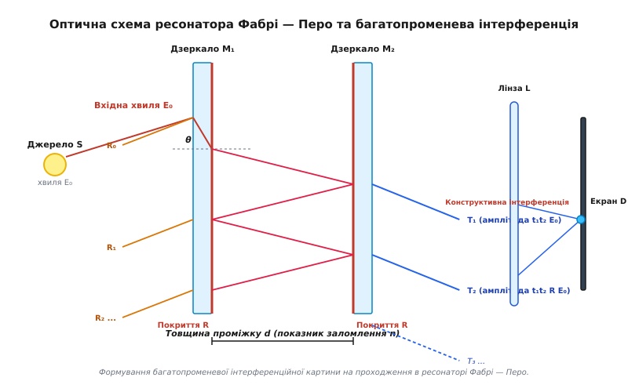
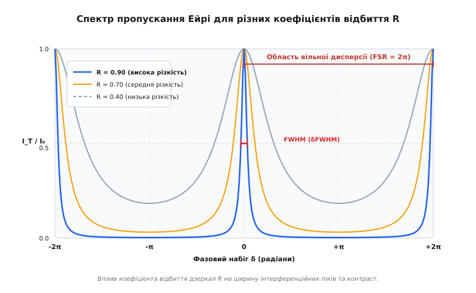
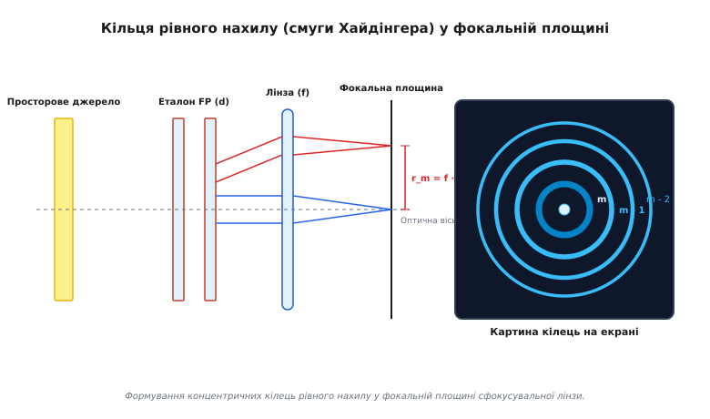

# Інтерферометр Фабрі — Перо

<preknowlist>
- [Тонкоплівкова інтерференція](topic:ph-waves/thin-film-interference) — інтерференція світла при багаторазовому відбитті від паралельних граней прозорого шару.
- [Рівняння Френеля](topic:ph-waves/fresnel-equations) — коефіцієнти відбиття та пропускання електромагнітної хвилі на межі оптичних середовищ.
- [Інтерферометр Майкельсона](topic:ph-waves/michelson-interferometer) — двопроменева інтерференція з розщепленням амплітуди.
</preknowlist>

Коли монохроматичний лазерний пучок із довжиною хвилі `632.8 нм` падає під малим кутом на дві паралельні скляні пластини з високовідбивальним покриттям (`R = 0.95`), розділені товщиною `10 мм`, замість широких плавно мінливих смуг двопроменевої інтерференції на екрані з'являється серія екстремально вузьких, яскравих прозорих кілець на майже абсолютно чорному тлі. Ширина цих інтерференційних піків за довжиною хвилі становить менше `0.0001 нм` (менше одного пікометра), що дозволяє розрізняти тонкі спектральні компоненти, які за звичайних умов повністю зливаються у суцільну лінію. Прилад, що реалізує цей принцип багаторазового відбиття світла у напівпрозорій порожнині, називається **інтерферометром Фабрі — Перо** (*Fabry–Pérot interferometer*, названий на честь французьких фізиків Шарля Фабрі та Альфреда Перо, які винайшли його у 1899 році; якщо товщина проміжку жорстко фіксована прецизійними проставками, прилад називають **еталоном Фабрі — Перо**). Завдяки поєднанню гігантської спектральної роздільної здатності та високої світлосили інтерферометр Фабрі — Перо не лише зробив революцію в атомній спектроскопії, а й став базовим ресонатором для лазерної техніки та найчутливішим елементом сучасних гравітаційно-хвильових обсерваторій.

---

### 1. Принцип багатопроменевого розщеплення та оптична геометрія

На відміну від інтерферометрів Юнга чи Майкельсона, де інтерференційна картина утворюється в результаті накладання двох когерентних променів, інтерферометр Фабрі — Перо реалізує **багатопроменеву інтерференцію** (*multiple-beam interference*). Принцип його роботи спирається на багаторазове послідовне відбиття й заломлення світлової хвилі між двома строго паралельними високовідбивальними поверхнями.

Конструкція оптичного ресонатора складається з двох прозорих підкладок (зазвичай з плавленого кварцу `SiO₂` або оптичного скла), внутрішні грані яких вкриті напівпрозорими дзеркальними шарами з коефіцієнтом відбиття за інтенсивністю `R` (зазвичай `R = 0.85...0.999`) та коефіцієнтом пропускання `T`. Зовнішні грані пластин виготовляють під невеликим клиноподібним кутом (`0.5°...1.0°`) або покривають просвітлювальним покриттям, щоб усунути паразитну інтерференцію від вторинних відбитків від зовнішніх поверхонь скла.


*Формування багатопроменевої інтерференційної картини на проходження в ресонаторі Фабрі — Перо.*

Хід світлових променів у ресонаторі товщиною `d` із показником заломлення середовища `n` розгортається за такою послідовністю:
- Вхідна світлова хвиля з комплексною амплітудою `E₀` підходить до першого дзеркала під кутом `θ` до нормалі.
- Частина хвилі відбивається від першої поверхні назад (відбитий промінь `R₀`), а частина з амплітудою `t₁ · E₀` проходить у внутрішній проміжок.
- Досягнувши другого дзеркала, хвиля знову розщеплюється: мала частина виходить назовні як перший пропущений промінь `T₁` з амплітудою `t₁ · t₂ · E₀`, а більша частина відбивається назад до першого дзеркала.
- Усередині ресонатора світло здійснює багаторазовий зігзагоподібний прохід туди й назад. При кожному відбитті від другого дзеркала з ресонатора виходить черговий паралельний пропущений промінь: `T₂`, `T₃`, `T₄` і так далі.
- Зведення цих паралельних променів у фокальній площині збиральної лінзи спричиняє їхню когерентну інтерференцію.

Геометрична різниця ходу `Δs` між двома послідовними пропущеними променями `T_k` та `T_{k+1}` розраховується з тригонометрії внутрішніх проходів:

```
Δs = 2 · n · d · cos θ
```

Звідси оптичний фазовий зсув `δ` між двома сусідніми інтерферуючими променями дорівнює:

```
δ = (2 · π / λ) · Δs = (4 · π · n · d · cos θ) / λ
```

Оскільки пропущені промені виходять із ресонатора строго паралельно один одному, вони не інтерферують безпосередньо у просторі. Для спостереження інтерференційної картини на їхньому шляху встановлюють збиральну лінзу з фокусною відстанню `f`. Лінза зводить усі паралельні промені, що виходять під кутом `θ`, в одну точку на фокальному екрані, де відбувається додавання їхніх амплітуд.

Історичні деталі відкриття цього механізму Шарлем Фабрі та Альфредом Перо у 1899 році та його еволюція розкриті у вставці [📜 Історія винайдення та еволюції інтерферометра Фабрі — Перо](topic:ph-waves/fabry-perot-interferometer/hist-fabry-perot.md).

---

### 2. Електродинамічний опис: функція Ейрі, різкість та вільнодисперсійний інтервал

Математичний опис багатопроменевої інтерференції зводиться до підсумовування нескінченної спадної геометричної прогресії комплексних амплітуд електричного поля.

Повна комплексна амплітуда пропущеного поля `E_T` дорівнює:

```
E_T = E₀ · t₁ · t₂ · [ 1 + R · e^(i · δ) + R² · e^(i · 2δ) + R³ · e^(i · 3δ) + ... ]
```

Підсумовуючи нескінченну геометричну прогресію зі знаменником `q = R · e^(i · δ)` та підносячи результат до квадрата модуля `I_T = |E_T|²`, отримуємо фундаментальний **розподіл Ейрі** (*Airy distribution*):

```
I_T / I₀ = 1 / [ 1 + F_coeff · sin²(δ / 2) ]
```

де `F_coeff` — **коефіцієнт різкості Ейрі** (*coefficient of finesse*), який виражається через енергетичний коефіцієнт відбиття дзеркал `R`:

```
F_coeff = (4 · R) / (1 - R)²
```

Повне алгебраїчне виведення цієї формули, а також розрахунок спектра відбитого світла `I_R = I₀ - I_T` наведено у вставці [🧮 Виведення розподілу Ейрі та аналіз багатопроменевої інтерференції](topic:ph-waves/fabry-perot-interferometer/math-fabry-perot.md).


*Вплив коефіцієнта відбиття дзеркал R на ширину інтерференційних піків та контраст.*

Розподіл Ейрі володіє унікальними математичними властивостями, які кардинально відрізняють його від двопроменевої інтерференції:

1. **Максимуми пропускання (`I_T = I₀`)**:
   Максимум спостерігається при умові конструктивної інтерференції, коли фазовий набіг кратна цілому числу `2 · π`:
   ```
   δ = 2 · m · π   ⇒   2 · n · d · cos θ = m · λ  (де m = 1, 2, 3...)
   ```
   У цих точках `sin(δ / 2) = 0`, і прозорість еталона досягає `100%` навіть при коефіцієнті відбиття дзеркал `R = 99.9%`. Це явище має резонансну природу: усередині порожнини формується стояча світлова хвиля, амплітуда якої зростає у `1 / (1 - R)` разів, забезпечуючи повне проходження енергії крізь друге дзеркало.

2. **Мінімуми пропускання (`I_min`)**:
   Мінімуми знаходяться посередині між максимумами при `δ = (2m + 1) · π`:
   ```
   I_min / I₀ = 1 / (1 + F_coeff) = (1 - R)² / (1 + R)²
   ```
   При `R = 0.95` мінімальне пропускання становить лише `0.065%` від пікового значення, що забезпечує гігантський контраст смуг.

Для характеристики роздільної здатності інтерферометра вводять дві ключові величини:

**Область вільної дисперсії (Free Spectral Range, FSR)** — відстань між двома сусідніми резонансними максимумами за частотою `FSR_ν` або за довжиною хвилі `FSR_λ`:

```
FSR_ν = c / (2 · n · d)
FSR_λ ≈ λ² / (2 · n · d)
```

**Різкість (Finesse, `F`)** — відношення відстані між максимумами (FSR) до спектральної напівширини піку на рівні половинної інтенсивності (FWHM, `δFWHM`):

```
F = FSR / FWHM = (π · √R) / (1 - R)
```

> 🔧 **Навіщо це.**
> Різкість `F` показує число спектральних ліній рівної інтенсивності, які прилад здатний повністю розділити у проміжку між двома сусідніми порядками інтерференції. Якщо коефіцієнт відбиття дзеркал дорівнює `R = 0.98`, різкість становить `F ≈ 155`. Це означає, що пік пропускання у `155` разів вужчий за відстань між порядками, що перетворює інтерферометр Фабрі — Перо на надточний вузькосмуговий оптичний фільтр.

---

### 3. Формування кілець рівного нахилу та спектроскопія високої роздільності

При освітленні інтерферометра Фабрі — Перо протяжним розсіяним джерелом світла (або розбіжним лазерним пучком) світло входить у ресонатор під різними кутами падіння `θ`.

Умова утворення максимумів `2 · n · d · cos θ = m · λ` показує, що для фіксованої товщини `d` та довжини хвилі `λ` кут падіння `θ_m` повністю визначає порядок інтерференції `m`. Оскільки оптична система володіє осьовою симетрією відносно нормалі до дзеркал, максимуми інтерференції мають вигляд концентричних **кілець рівного нахилу** (*fringes of equal inclination*, смуги Хайдінгера).


*Формування концентричних кілець рівного нахилу у фокальній площині сфокусувальної лінзи.*

Якщо у фокальній площині збиральної лінзи з фокусною відстанню `f` встановлено матричний фотодетектор, радіус `r_m` інтерференційного кільця порядку `m` обчислюється з кута `θ_m`:

```
r_m = f · tan θ_m ≈ f · θ_m  (для малих кутів θ_m ≪ 1)
```

Розкладаючи `cos θ_m ≈ 1 - θ_m² / 2`, отримуємо формулу для радіуса `m`-го кільця:

```
r_m ≈ f · √[ (2 / n) · (1 - m · λ / (2 · n · d)) ]
```

Зверніть увагу: найвищий порядок інтерференції `m_max = 2 · n · d / λ` досягається в самому центрі картини при `θ = 0`. При віддаленні від центра до периферії кут `θ` зростає, а порядок інтерференції `m` зменшується (`m_max - 1`, `m_max - 2` і так далі).

**Спектральна роздільна здатність (`R_res`)**:
Роздільна здатність за критерієм Релея виражається добутком порядку інтерференції `m` на різкість `F`:

```
R_res = λ / δλ = m · F = (2 · n · d / λ) · [ (π · √R) / (1 - R) ]
```

Приклад обчислення: Для повітряного еталона товщиною `d = 50 мм` на довжині хвилі `λ = 500 нм` порядок інтерференції в центрі дорівнює `m = 2 · 0.05 / 500e-9 = 200 000`. При коефіцієнті відбиття `R = 0.95` різкість дорівнює `F ≈ 61.2`. Звідси роздільна здатність становить:

```
R_res = 200 000 · 61.2 ≈ 1.22 × 10⁷
```

Це дозволяє розрізнити дві спектральні лінії, віддалені одна від одної всього на `δλ = 500 нм / 1.22e7 ≈ 0.000041 нм` (`0.041` пікометра). Жодна дифракційна ґратка не здатна забезпечити подібний рівень розділення у видимому діапазоні.

#### Проблема перекриття порядків та попереднє фільтрування

Оскільки інтерферометр Фабрі — Перо володіє високим порядком інтерференції `m ≫ 10⁴`, його область вільної дисперсії є дуже вузькою: `FSR_λ ≈ λ / m`. Якщо досліджуваний спектр містить світлові лінії, віддалені більше ніж на `FSR_λ`, максимуми різних порядків починають накладатися один на одного, утворюючи заплутану інтерференційну картину.

Для усунення перекриття порядків у реальних спектрометрах високої роздільності еталон Фабрі — Перо застосовують у комбінації з попереднім монохроматором (дифракційною ґраткою або інтерференційним світлофільтром). Монохроматор вирізає з широкого спектра тонку смугу шириною `Δλ < FSR_λ`, яку потім з високою точністю розгортає еталон Фабрі — Перо.

---

### 4. Ресонатор Фабрі — Перо як фундамент лазерної фізики

Найважливішим застосуванням принципу Фабрі — Перо у сучасній фізиці стало створення відкритих оптичних ресонаторів для генераторів когерентного випромінювання (лазерів).

Будь-який лазер складається з трьох базових елементів: активного середовища підсилення, системи помпажу та оптичного ресонатора. Звернений ресонатор Фабрі — Перо утримує фотони всередині активного середовища, забезпечуючи багаторазове проходження світла й стимульоване випромінювання.

```
[ Дзеркало 1: R₁ ≈ 100% ]  <=== [ Активне середовище з коефіцієнтом підсилення g ] ===>  [ Дзеркало 2: R₂ < 100% ]  ──► Вихідний промінь
```

Умови лазерної генерації вимагають одночасного виконання двох балансів:
1. **Баланс амплітуди (амплітудна умова)**: Підсилення світла за один повний оборот туди й назад має повністю компенсувати втрати на відбиття та поглинання:
   ```
   R₁ · R₂ · e^(2 · g_th · L_cav) = 1  ⇒  g_th = (1 / (2 · L_cav)) · ln(1 / (R₁ · R₂))
   ```
   де `g_th` — пороговий коефіцієнт підсилення середовища, `L_cav` — довжина лазерного ресонатора.

2. **Баланс фази (частотна умова)**: Фазовий набіг за повний оборот повинен дорівнювати цілому числу `2 · π`:
   ```
   2 · n · L_cav = q · λ  ⇒  ν_q = q · (c / (2 · n · L_cav))
   ```

Таким чином, лазер може генерувати випромінювання лише на дискретних частотах `ν_q`, які відповідають власним поздовжнім модам (*longitudinal modes*) ресонатора Фабрі — Перо. Відстань між сусідніми лазерними модами дорівнює області вільної дисперсії ресонатора `Δν = c / (2 · n · L_cav)`.

Для забезпечення одномодового режиму генерації (коли лазер випромінює строго одну частоту) всередину основного довгого ресонатора встановлюють додатковий тонкий еталон Фабрі — Перо (селектор мод), спектральні піки якого набагато ширші за FSR основного ресонатора.

#### Конфокальні ресонатори зі сферичними дзеркалами

У плоских ресонаторах Фабрі — Перо вимоги до непаралельності дзеркал є екстремально жорсткими (менше 0.1 кутової секунди). Для зниження чутливості до розюстування в лазерній техніці використовують **конфокальні ресонатори**, сформовані двома сферичними дзеркалами з радіусами кривини `R_m = L_cav`.

Конфокальна геометрія фокусує світлові промені у центрі ресонатора, формуючи стійкі модові структури Герміта — Гаусса (`TEM_lm`). Для осьової моди `TEM₀₀` поперечний профіль інтенсивності має гауссів розподіл, а дифракційні втрати падають на кілька порядків порівняно з плоским ресонатором.

Добротність оптичного ресонатора `Q` пов'язана з різкістю `F` співвідношенням:

```
Q = ν / Δν_FWHM = m · F = (2 · π · n · L_cav · √R) / (λ · (1 - R))
```

Для лазерних ресонаторів добротність може досягати значень `Q ~ 10⁸...10¹¹`, що забезпечує надзвичайно високу монохроматичність випромінювання.

Програмну симуляцію спектрів пропускання та обчислення параметрів поздовжніх мод у C та C++ подано у вставці [⚙️ Чисельне моделювання спектра пропускання та кілець Фабрі — Перо](topic:ph-waves/fabry-perot-interferometer/proj-fabry-perot-sim.md).

---

### 5. Практичні характеристики, інженерний бюджет різкості та технічні специфікації

Теоретична різкість `F_R = π · √R / (1 - R)` досягається лише для ідеально плоских, бездефектних і строго паралельних дзеркал. У реальних інженерних приладах ефективна різкість `F_eff` завжди нижча через три основні види недосконалостей:

1. **Відхилення площинності поверхонь (`F_D`)**: Якщо поверхня дзеркала має локальні мікронерівності величиною `δd = λ / N` (наприклад, `λ / 100`), то різкість обмежується значенням `F_D = N / 2`.
2. **Кутова непаралельність дзеркал (`F_P`)**: Наявність клина `α` між пластинами призводить до зміщення фази по апертурі пучка.
3. **Кутова розбіжність світлового пучка (`F_θ`)**: Скінченна апертура вхідного променя створює розкид кутів падіння.

Загальний інженерний бюджет різкості обчислюється через квадратичну суму обернених величин:

```
1 / (F_eff)² = 1 / (F_R)² + 1 / (F_D)² + 1 / (F_P)² + 1 / (F_θ)²
```

Повний довідник конструктивних параметрів оптичних еталонів, специфікації матеріалів підкладок (плавлений кварц, Zerodur, CaF₂) та методи оптимізації допусків описано у вставці [📋 Технічні параметри та інженерний розрахунок еталонів Фабрі — Перо](topic:ph-waves/fabry-perot-interferometer/api-etalon-specs.md).

---

### 6. Сучасне застосування: від оптичних фільтрів до виявлення гравітаційних хвиль

Завдяки унікальним спектральним властивостям інтерферометр Фабрі — Перо широко застосовується в найновіших галузях науки та техніки:

- **Волоконно-оптичний зв'язок (DWDM)**: Переналаштовувані волоконно-оптичні еталони Фабрі — Перо (FFPI) слугують вузькосмуговими демультиплексорами, які виділяють окремі інформаційні канали на довжинах хвиль біля `1550 нм` з кроком каналів `50 ГГц` або `100 ГГц`.
- **Волоконні датчики деформацій та температури**: Зміна довжини мікроресонатора Фабрі — Перо під дією механічного напруження чи температури зміщує резонансні піки пропускання, що дозволяє вимірювати деформації з точністю до нанометрів.
- **Гравітаційно-хвильова обсерваторія LIGO**: У кожному з чотирикілометрових плечей інтерферометра Майкельсона в LIGO встановлено додаткові дзеркала, що формують ресонатори Фабрі — Перо з різкістю `F ≈ 450`. Світло відбивається між дзеркалами близько 300 разів, збільшуючи ефективну довжину пробігу променя з `4 км` до `1200 км`. Це дозволило досягти чутливості до відносних зміщень дзеркал порядку `10⁻¹⁸ м` та зареєструвати гравітаційні хвилі від злиття чорних дир.
- **Астрономічна спектроскопія високої роздільності**: Еталони Фабрі — Перо у поєднанні з ешеле-спектрометрами (наприклад, у проекті HARPS та ESPRESSO) застосовуються для вимірювання надмалих радіальних швидкостей зір (до `10 см/с`), що є основним методом пошуку екзопланет земного типу.
- **Спектроскопія згасання порожнини (Cavity Ring-Down Spectroscopy, CRDS)**: Вимірювання часу загасання світлового імпульсу `τ = L / (c · (1 - R + A))` всередині надвисокодобротного ресонатора Фабрі — Перо дозволяє визначати надмалі концентрації газу та домішок на рівні кількох часток на мільярд (ppb).
