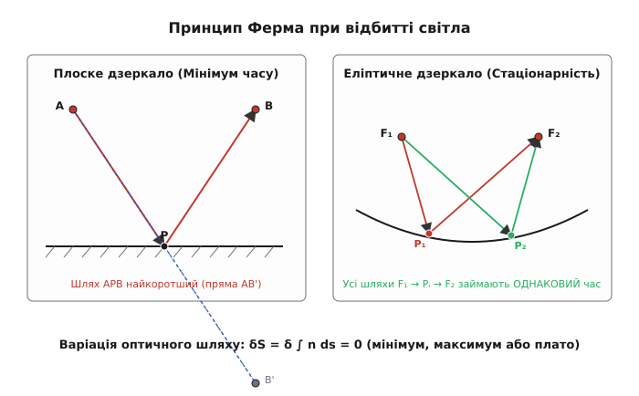
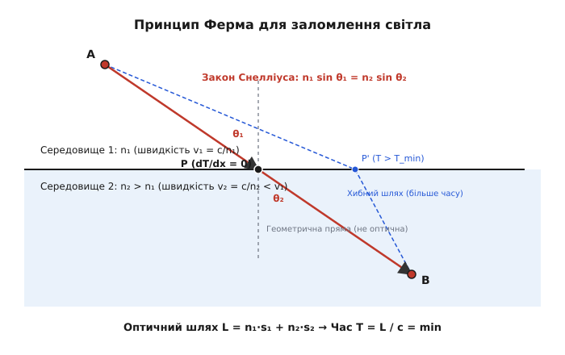
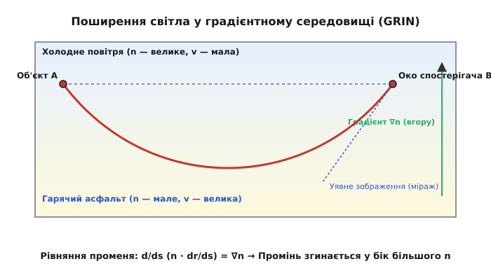

# Принцип Ферма (найменшого часу)

<preknowlist>
- [Закон Снеліуса](topic:ph-waves/snells-law) — співвідношення кутів заломлення на межі двох середовищ.
- [Показник заломлення](topic:ph-waves/refractive-index) — відношення швидкості світла у вакуумі до швидкості у середовищі.
- [Похідна та екстремуми](topic:math-analysis/derivative) — умова мінімуму та стаціонарності функції через нульову похідну.
</preknowlist>

Рятувальник на піщаному пляжі помічає плавця, якого відносить течією у морі. Швидкість бігу рятувальника сухим піском значно вища за швидкість його плавання у воді. Щоб дістатися до плавця за найкоротший час, рятувальник не біжить по прямій лінії (яка є найкоротшою за відстанню), і не біжить берегом до точки рівно напроти плавця (що зменшило б шлях у воді). Він вибирає зламану траєкторію з точкою повороту на урізі води, яка забезпечує мінімальний сумарний час руху. Світловий промінь при переході між точками у прозорих середовищах поводиться точно так само: з усіх можливих геометрій поширення він вибирає той шлях, який вимагає стаціонарного — найчастіше мінімального — часу проходження.

## Фізична сутність та оптична довжина шляху

Швидкість поширення світла у матеріальному середовищі `v` залежить від його оптичної щільності та визначається через абсолютний показник заломлення `n`:

```
v = c / n
```

де `c ≈ 2.9979 × 10⁸` м/с — швидкість світла у вакуумі. Оскільки у будь-якому речовинному середовищі `n > 1`, швидкість світла у речовині завжди менша за швидкість у вакуумі (`v < c`). Наприклад, у повітрі показник заломлення становить `n ≈ 1.000293`, у воді `n ≈ 1.333` і швидкість світла знижується до `2.25 × 10⁸` м/с, у звичайному кроновому склі `n ≈ 1.52` (швидкість `1.97 × 10⁸` м/с), а у вакуумі чи кристалі алмазу `n ≈ 2.42`, де швидкість світла падає більш ніж удвічі — до `1.24 × 10⁸` м/с.

Якщо промінь світла долає безперервну траєкторію `γ` від точки `A` до точки `B`, час його руху `T` можна обчислити як підсумовування елементарних проміжків часу `dt = ds / v`:

```
T = ∫[A to B] ds / v = ∫[A to B] (n(r) / c) ds = (1 / c) · ∫[A to B] n(r) ds
```

Величина під інтегралом називається **оптичною довжиною шляху** (Optical Path Length, OPL) і позначається літерою `L`:

```
L = ∫[A to B] n(r) ds
```

Оптична довжина шляху показує, яку геометричну відстань пройшло б світло у вакуумі за той самий час, який йому потрібен для подолання даного середовища. Наприклад, один сантиметр ходу світла всередині алмазу (`n = 2.42`) оптично еквівалентний `2.42` сантиметрам руху у порожньому вакуумі. Оскільки швидкість світла у вакуумі `c` є фундаментальною фізичною константою, мінімізація часу руху `T` є математично тотожною мінімізації оптичної довжини шляху `L`.

Якщо середовище складається з кількох однорідних ділянок завдовжки `s₁, s₂, ..., sₖ` з показниками заломлення `n₁, n₂, ..., nₖ`, оптичний шлях є простою сумою добутків геометричних довжин на відповідні показники заломлення:

```
L = n₁ · s₁ + n₂ · s₂ + ... + nₖ · sₖ
```

Принцип П'єра де Ферма (Pierre de Fermat, 1662 рік) у своїй первинній формулюванні стверджував: світло завжди поширюється за траєкторією, оптична довжина якої (а отже, і час руху) є найменшою порівняно з усіма іншими сусідніми траєкторіями між тими самими точками.

Детальніше про історію відкриття цього принципу, суперечки з послідовниками Декарта та його фундаментальне значення можна прочитати у вставці [Історичний розвиток принципу Ферма](topic:ph-waves/fermat-principle/hist-fermat-discovery.md).

## Базові закони геометричної оптики як вислід принципу Ферма

З принципу Ферма безпосередньо випливають базові закони геометричної оптики, які протягом століть приймалися як незалежні емпіричні досліди.

### 1. Прямолінійність поширення в однорідному середовищі

Якщо середовище є однорідним (`n = const`), швидкість світла у всіх точках простору однакова. Оптична довжина шляху дорівнює `L = n · ∫ ds = n · S`, де `S` — геометрична довжина траєкторії. Завдання мінімізації часу зводиться до мінімізації геометричної відстані між двома точками `A` та `B`. З евклідової геометрії відомо, що найкоротшою відстанню між двома точками є пряма лінія. Таким образом, в однорідному та ізотропному середовищі світлові промені завжди є прямими лініями.

### 2. Закон відбиття світла від дзеркала

Розглянемо поширення світла від джерела `A` до спостерігача `B`, коли промінь повинен відбитися від плоского дзеркала.


*Геометрія відбиття від плоского дзеркала (мінімальний шлях) та еліптичного дзеркала (однаковий час для будь-якої точки).*

Для знаходження точки відбиття `P` на дзеркалі побудуємо точку `B'`, яка є дзеркальним відображенням точки `B` відносно площини дзеркала. Для будь-якої точки `P` на дзеркалі довжина відрізка `PB` дорівнює довжині `PB'`. Отже, сумарна оптична довжина шляху `L = AP + PB` дорівнює довжині зламаної лінії `AP + PB'`.

Мінімальне значення суми `AP + PB'` досягається тоді, коли три точки `A`, `P` та `B'` лежать на одній прямій лінії. З рівності вертикальних кутів та геометричної симетрії побудови негайно випливає класичний закон відбиття: кут падіння `α` дорівнює куту відбиття `β`, а падаючий промінь, відбитий промінь і нормаль до поверхні дзеркала лежать в одній площині.

### 3. Закон заломлення Снеліуса

Коли світло перетинає межу між двома середовищами з різними показниками заломлення `n₁` та `n₂`, швидкість світла змінюється стрибком від `v₁ = c / n₁` до `v₂ = c / n₂`.


*Порівняння реального заломленого шляху мінімального часу (зелений) із геометрично найкоротшим та альтернативними шляхами.*

Нехай точка `A` лежить у першому середовищі на відстані `a` від межі розділу, а точка `B` — у другому середовищі на відстані `b` від межі. Відстань між проекціями точок `A` та `B` на межу розділу дорівнює `d`. Позначимо через `x` координату точки заломлення `P` на межі розділу.

Повний час поширення світла `T(x)` складається з часу руху у першому середовищі та часу руху у другому середовищі:

```
T(x) = sqrt(a² + x²) / v₁ + sqrt(b² + (d - x)²) / v₂
```

Перепишемо це через показники заломлення `n₁` та `n₂`:

```
T(x) = (1 / c) · [ n₁ · sqrt(a² + x²) + n₂ · sqrt(b² + (d - x)²) ]
```

Згідно з принципом Ферма, світло вибирає таку точку `P(x)`, за якої час руху `T(x)` є мінімальним. Умовою екстремуму гладкої функції є рівність нулю її першої похідної за змінною `x`:

```
dT / dx = 0
```

Обчислимо похідну функції `T(x)`:

```
dT / dx = (1 / c) · [ n₁ · (2x / (2·sqrt(a² + x²))) - n₂ · (2(d - x) / (2·sqrt(b² + (d - x)²))) ]
= (1 / c) · [ n₁ · (x / sqrt(a² + x²)) - n₂ · ((d - x) / sqrt(b² + (d - x)²)) ]
```

З геометрії прямокутних трикутників помітно:
- Співвідношення `x / sqrt(a² + x²)` є синусом кута падіння: `sin θ₁`.
- Співвідношення `(d - x) / sqrt(b² + (d - x)²) ` є синусом кута заломлення: `sin θ₂`.

Підставляючи ці синуси в умову стаціонарності `dT / dx = 0`, отримуємо знаменитий **закон заломлення Снеліуса**:

```
n₁ · sin θ₁ = n₂ · sin θ₂
```

Обчислена друга похідна `d²T/dx²` є строго додатною для всіх фізичних параметрів, що підтверджує існування строгого локального мінімуму часу.

## Повне внутрішнє відбиття та граничний кут

Закон заломлення Снеліуса `n₁ sin θ₁ = n₂ sin θ₂` має важливий граничний випадок, коли світло поширюється з оптично щільнішого середовища у менш щільне (`n₁ > n₂`).

Зі збільшенням кута падіння `θ₁` кут заломлення `θ₂` зростає швидше, оскільки `sin θ₂ = (n₁ / n₂) sin θ₁ > sin θ₁`. При досягненні певного критичного кута падіння `θ_c` кут заломлення стає рівним `90°` (`sin θ₂ = 1`):

```
sin θ_c = n₂ / n₁
```

При кутах падіння `θ₁ > θ_c` вираз для синуса кута заломлення стає більшим за одиницю (`sin θ₂ > 1`), що є геометрично неможливим для дійсного кута. У цьому режимі заломлений промінь зникає повністю, і все світло відбивається назад у перше середовище. Це явище називається [повним внутрішнім відбиттям](topic:ph-waves/total-internal-reflection) (Total Internal Reflection, TIR).

З точки зору принципу Ферма, при `θ₁ > θ_c` у другому середовищі не існує дійсного шляху, який міг би задовольнити умову стаціонарності оптичного шляху `δL = 0`. Єдиним стаціонарним шляхом залишається шлях відбиття всередині першого середовища. Хвильовий аналіз показує, що світло пронікає у друге середовище лише у вигляді згасаючої ([еванесцентної хвилі](topic:ph-waves/evanescent-wave)) на глибину порядку довжини хвилі, але середня за часом енергія через межу не переноситься.

На явищі повного внутрішнього відбиття базується робота волоконних світловодів, де світлові імпульси утримуються всередині прозорої жили із кварцового скла завдяки дзеркальному відбиттю від оболонки з нижчим показником заломлення.

## Дисперсія світла у призмі через принцип Ферма

Показник заломлення більшості прозорих речовин залежить від довжини хвилі світла `λ` — це явище називається [оптичною дисперсією](topic:ph-waves/optical-dispersion) `n = n(λ)`. Для нормальної дисперсії у видимій області спектра показник заломлення зростає зі зменшенням довжини хвилі: синє світло (`λ ≈ 400` нм) зазнає більшого показника заломлення `n_blue`, ніж червоне світло (`λ ≈ 700` нм) з `n_red`.

Коли біле світло проходить крізь скляну призму, принцип Ферма вимагає оптимізації часу руху окремо для кожної спектральної складової. Оскільки `n_blue > n_red`, швидкість синього світла у склі `v_blue = c / n_blue` є меншою, ніж швидкість червоного світла `v_red = c / n_red`.

Щоб мінімізувати час проходження крізь призму, синє світло за законом Снеліуса вигинається під більшим кутом від початкового напрямку, ніж червоне світло:

```
n_blue · sin θ_blue = n_air · sin θ_inc
n_red · sin θ_red = n_air · sin θ_inc
```

Внаслідок цього білий світловий промінь після проходження призми розкладається на спектральне віяло кольорів. Принцип Ферма природним чином пояснює як геометричний хід променів, так і хроматичну дисперсію світлових хвиль.

## Неоднорідні середовища та викривлення світлових променів

У середовищах із неперервною зміною показника заломлення `n(r)` (Graded-Index media, GRIN) світлові промені перестають бути прямими лініями і перетворюються на гладкі криві.

Застосовуючи варіаційне числення до оптичного шляху `L = ∫ n(r) ds`, можна отримати векторне диференціальне рівняння світлового променя:

```
d/ds ( n(r) · dr/ds ) = ∇n(r)
```

де `dr/ds = u` — одиничний дотичний вектор до траєкторії променя, а `∇n` — вектор градієнта показника заломлення.

Розкриваючи похідну добутку у лівій частині, отримуємо:

```
(dn / ds) · dr/ds + n · d²r / ds² = ∇n
```

Оскільки вектор другої похідної `d²r / ds² = N / R` спрямований у бік увігнутості кривої (де `N` — нормаль, `R` — радіус кривизни), з цього рівняння випливає важливий фізичний висновок:

> **Світловий промінь у неоднорідному середовищі завжди вигинається у бік оптично щільнішого середовища (у напрямку градієнта `∇n`).**


*Викривлення променя в атмосфері над нагрітим асфальтом (нижній міраж) через варіацію показника заломлення.*

Прикладом цього явища є атмосферні міражі. У спекотний день асфальт нагріває прилеглі шари повітря. Гаряче повітря біля землі має меншу щільність і нижчий показник заломлення `n`, ніж холодне повітря вище. Градієнт `∇n` спрямований вертикально вгору. Промені світла від неба, що рухаються під невеликим кутом до землі, вигинаються вгору і потрапляють у око спостерігача. Спостерігач бачить блакитне небо на поверхні асфальту, сприймаючи його як відблиск води.

Аналогічно у волоконній оптиці застосовують волокна з параболічним профілем показника заломлення (GRIN fiber):

```
n(r) = n₀ · sqrt( 1 - 2Δ · (r / a)² )
```

У таких волокнах промені рухаються за синусоїдальними траєкторіями, періодично фокусуючись на осі жили.

Чисельний алгоритм комп'ютерного розрахунку таких траєкторій методом Рунге — Кутти з вихідним кодом на C та C++ детально розглянуто у вставці [Чисельне трасування променів у градієнтних середовищах](topic:ph-waves/fermat-principle/proj-ray-tracer.md).

## Анізотропні середовища та двозаломлення

У кристалічних середовищах (наприклад, у кристалах исландського шпату або кварцу) оптичні властивості залежать від напрямку поширення світла та його поляризації. Фізичні властивості середовища описуються не скалярним показником заломлення `n`, а тензором діелектричної проникності `ε_ij`.

У таких анізотропних середовищах виникає явище [подвійного променезаломлення](topic:ph-waves/birefringence) (двозаломлення): падаючий світловий промінь розщеплюється на два промені — звичайний (ordinary ray, `o`) та незвичайний (extraordinary ray, `e`).

Для звичайного променя показник заломлення `n_o` є однаковим у всіх напрямках, і він підпорядковується стандартним законам Снеліуса. Для незвичайного променя показник заломлення `n_e(θ)` залежить від кута `θ` між напрямком поширення та оптичною віссю кристала.

Принцип Ферма залишається цілком справедливим і для анізотропних середовищ, але вимагає врахування різниці між напрямком променевого вектора (вектора переносу енергії Пойнтінга `S`) та хвильового вектора `k`. Оптична довжина шляху для незвичайного променя обчислюється через променеву швидкість `v_group(θ)`:

```
L = ∫ (c / v_group(θ)) ds
```

Внаслідок цього незвичайний промінь може відхилятися від площини падіння, порушуючи спрощену форму закону Снеліуса, але суворо задовольняючи варіаційній умові стаціонарності часу `δL = 0`.

## Сучасна формулювання: стаціонарність замість мінімуму

У класичному формулюванні Ферма стверджував, що світло завжди обирає шлях *найменшого* часу. Однак подальший аналіз показав, що це твердження є надто вузьким.

Сучасне формулювання принципу Ферма (Варіаційний принцип Ферма):

> **Істинна траєкторія світлового променя між двома точками відповідає стаціонарному значенню оптичної довжини шляху (перша варіація δL = 0).**

Це означає, що при малих відхиленнях траєкторії `δr` зміна оптичного шляху є величиною другого порядку малості:

```
δL = δ ∫[A to B] n ds = 0
```

Залежно від геометрії системи, стаціонарна точка `δL = 0` може бути:

1. **Строгим мінімумом (`δ²L > 0`):**
   Найбільш поширений випадок: прямолінійний рух, заломлення на плоскій межі, відбиття від плоского чи опуклого дзеркала.

2. **Плато / нейтральною стаціонарністю (`δ²L = 0`):**
   Якщо джерело світла `A` та спостерігач `B` розташовані у фокусах еліптичного дзеркала, світло відбивається від будь-якої точки еліпса. З математичних властивостей еліпса випливає, що сумарний оптичний шлях для усіх можливих точок відбиття є абсолютно однаковим. Усі промені приходять одночасно (ізохронізм).

3. **Локальним максимумом (`δ²L < 0`):**
   Якщо світло відбивається від увігнутого сферичного дзеркала між фокусами, і кривизна сфери перевищує кривизну відповідного еліпса, реальний шлях відбиття займає **більше часу**, ніж шляхи через сусідні точки дзеркала.

Повна математична формалізація принципу Ферма через варіаційне числення, аналіз другої варіації `d²T/dx²` та вивід рівняння ейконала наведені у вставці [Математичний апарат варіаційного числення](topic:ph-waves/fermat-principle/math-fermat-derivation.md).

## Принцип Ферма в загальній теорії відносності

У загальній теорії відносності (ЗТВ) Ейнштейна гравітація описується викривленням чотиривимірного простору-часу метрикою `g_μν`. Світлові промені у порожньому викривленому просторі-часі рухаються вздовж нулевих геодезичних ліній (`ds² = 0`).

Для стаціонарного гравітаційного поля (наприклад, у метриці Шварцшильда навколо масивної зорі чи чорної діри) тривимірний шлях світла можна сформулювати через загальнорелятивістський принцип Ферма:

```
δ ∫ n_eff(r) dl = 0
```

де `n_eff(r)` — ефективний показник заломлення гравітаційного поля:

```
n_eff(r) = exp( -Φ(r) / c² ) ≈ 1 + 2GM / (c² r)
```

де `Φ(r) = -GM / r` — ньютонівський гравітаційний потенціал, `G` — гравітаційна стала, `M` — маса астрономічного об'єкта.

З релятивістського принципу Ферма випливають два фундаментальні ефекти астрофізики:
1. **Гравітаційне відхилення світла:** Світло від далеких зірок, проходячи поблизу Сонця чи галактик, вигинається у бік більшої щільності ефективного показника заломлення `n_eff`. Це явище створює гравітаційні лінзи та кільця Ейнштейна.
2. **Ефект Шапіро (гравітаційна затримка сигналу):** Світловий або радіосигнал, що проходить у сильній гравітаційній зоні поблизу масивного тіла, витрачає додатковий час на подолання шляху порівняно із плоским простором Мінковського.

## Хвильове обґрунтування та квантова інтерференція

Геометричний принцип Ферма тривалий час сприймався як загадкова властивість світла. Чому світлові промені «знають», за якою траєкторією час буде мінімальним, ще до того, як пройдуть увесь шлях?

Відповідь дала хвильова оптика, а згодом — квантова електродинаміка.

### Хвильове пояснення через фазові фронти

Згідно з хвильовою теорією Хюйгенса — Френеля, кожна точка хвильового фронту є джерелом вторинних сферичних хвиль. Фаза світлової хвилі у точці спостереження дорівнює:

```
Φ = k₀ · L = (2π / λ₀) · ∫ n ds
```

де `k₀` — хвильове число у вакуумі, `λ₀` — довжина хвилі.

Повний світловий сигнал у точці `B` утворюється в результаті інтерференції всіх вторинних хвиль, що приходять з різних можливих траєкторій.

1. Для траєкторій, які розташовані далеко від стаціонарної лінії принципу Ферма, перша варіація `δL ≠ 0`. Це означає, що при найменшому зсуві траєкторії фаза хвилі `Φ` змінюється дуже швидко. Хвилі від сусідніх траєкторій приходять у протифазі і повністю гасять одна одну (**деструктивна інтерференція**).
2. Поблизу стаціонарної траєкторії, де `δL = 0`, зміна фази `δΦ` при малих відхиленнях є близькою до нуля. Усі сусідні траєкторії у цій вузькій зоні (яку називають *першою зоною Френеля*) коливаються майже в однаковій фазі. Їхні амплітуди додаються (**конструктивна інтерференція**).

Таким чином, світло насправді розповсюджується по всіх можливих напрямках, але ми спостерігаємо світловий промінь лише там, де хвилі підсилюють одна одну завдяки умові стаціонарності фази `δL = 0`.

> 🔧 **Навіщо це.**
>
> **Оптичне проектування та інженерія:**
> Принцип Ферма є фундаментальним інструментом для створення градієнтної оптики (GRIN-лінзи), де показник заломлення змінюється від центра до країв. Це дозволяє створювати плоскі лінзи без оптичних аберацій.
>
> **Волоконно-оптичний зв'язок:**
> У градієнтних оптичних волокнах (Graded-Index Fibers) показник заломлення параболічно зменшується від осі до оболонки. Завдяки принципу Ферма промені, які рухаються під великими кутами (довша геометрична відстань), більшу частину шляху проходять периферією зі зниженим показником `n` (вища швидкість). Це компенсує різницю у часі поширення між різними модами і усуває міжмодову дисперсію, дозволяючи передавати дані на гігабітних швидкостях.
>
> **Геофізика та сейсмологія:**
> Принцип Ферма використовується для розрахунку траєкторій сейсмічних хвиль у товщі Землі. Оскільки швидкість сейсмічних хвиль зростає з глибиною, сейсмічні промені вигинаються за дугами, аналогічно до світлових променів у градієнтному повітрі.
>
> **Астрофізика та космологія:**
> Принцип Ферма у релятивістській формі застосовується для математичного моделювання гравітаційних лінз, розрахунку викривлення світла далеких квазарів масивними скупченнями галактик та точного вимірювання сталої Хаббла за часовими затримками між зображеннями лінзованих об'єктів.
