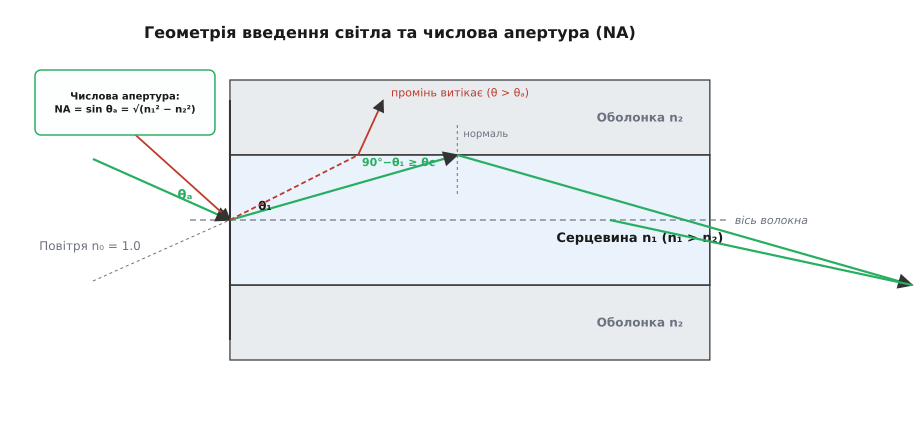
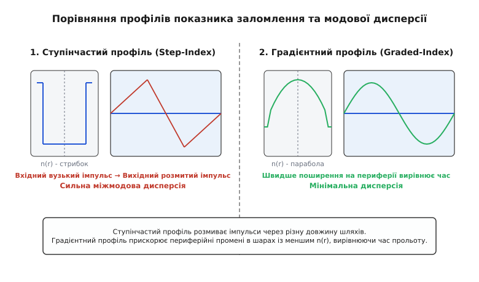
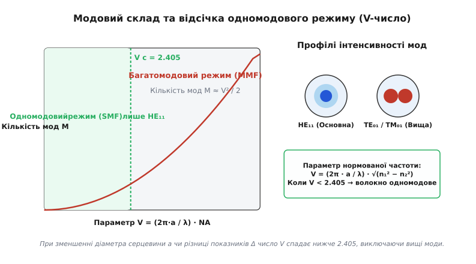
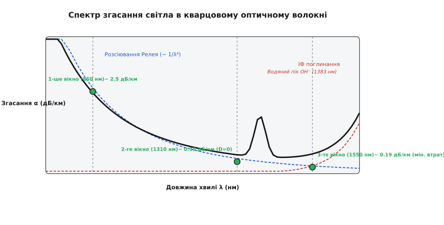

# Принципи волоконної оптики

<preknowlist>
- [Закон Снелла](root:ph-waves/snells-law) — зв'язок кутів падіння та заломлення світла на межі прозорих середовищ.
- [Повне внутрішнє відбиття](root:ph-waves/total-internal-reflection) — утримання світлового випромінювання всередині щільнішого середовища за пологого падіння.
- [Формули Френеля](root:ph-waves/fresnel-equations) — амплітуди відбитого та заломленого світла для різних поляризацій.
</preknowlist>

Спрямуйте промінь лазерної указки через відкрите повітря — і на відстані кілометра атмосферний туман, теплова турбулентність повітря та порошинки розсіють світловий пучок настільки, що фотодетектор сприйме лише мікроскопічні залишки сигнальної потужності. Спроба ізолювати промінь усередині голого скляного стрижня також зазнає поразки: кожен доторк до зовнішнього кріплення, відбиток пальця чи крапля пилу на межі скла з повітрям створюють локальну неоднорідність, крізь яку світло миттєво витікає назовні. Щоб змусити світло поширюватися на десятки кілометрів без утрат із довільними вигинами траси, оптичний провідник роблять двошаровим: внутрішня серцевина з оптично щільнішого скла оточується захисною оболонкою з меншим показником заломлення.

На цьому простичому фізичному контрасті оптичних властивостей двох шарів скла тримається сучасний волоконно-оптичний зв'язок. Як виникала ця технологія — від перших лекційних експериментів із водяними струменями до промислового синтезу кварцового скла — висвітлено у вставці [Історія волоконної оптики](root:ph-waves/fiber-optics-principles/hist-fiber-optics.md).

---

### 1. Геометрія пастки: числова апертура та кут вводу

Світлопотік, падаючи на відкритий торець оптичного волокна з повітря, потрапляє із середовища з показником заломлення `n₀ ≈ 1.0` у скляну серцевину з показником `n₁`. На торець промінь падає під кутом `θ₀` до поздовжньої осі волокна. За законом Снелла світло заломлюється під кутом `θ₁` усередині серцевини. Потрапляючи на бокову межу розділу між серцевиною та оболонкою (показник заломлення якої `n₂ < n₁`), промінь падає на неї під кутом `α = 90° − θ₁` до нормалі межі.

Для того щоб промінь не виходив у зовнішню оболонку, а зазнавав **повного внутрішнього відбиття** й продовжував рухатися зигзагоподібно всередині серцевини, кут падіння `α` повинен перевищувати критичний кут `θc`, для якого `sin θc = n₂ / n₁`. Це накладає жорстке обмеження на максимальний кут `θ₀`, під яким світло взагалі можна ввести у волокно через торець.


*Світловий промінь, що входить у торець волокна в межах апертурного конуса θₐ, заломлюється у серцевину n₁ і зазнає повного внутрішнього відбиття на межі з оболонкою n₂. Промені за межами конуса пробивають межу й витікають в оболонку.*

Максимальний вхідний кут напівконуса прийняття називають **апертурним кутом** `θ_a` (або `θ₀_max`). Синус цього кута називають **числовою апертурою** (*Numerical Aperture*, `NA`):

```
NA = sin θ_a = √(n₁² − n₂²)
```

Якщо кут вводу світла перевищує `θ_a`, кут падіння на межу серцевина–оболонка стає меншим за критичний `θc`. Такий промінь частково заломлюється в оболонку на кожному відбитті, і його енергія згасає вже через кілька сантиметрів шляху.

Зауважимо важливий фізичний нюанс: формула `NA = √(n₁² − n₂²)` виведена для так званих **меридіональних променів** (*meridional rays*), які перетинають поздовжню оптичну вісь волокна після кожного відбиття. У реальному волокні також існують **косі промені** (*skew rays*), які рухаються по спіралеподібній траєкторії навколо осі, ніколи її не перетинаючи. Косі промені відбиваються від круглої стінки під більшими кутами, ніж меридіональні, тому волокно здатне утримувати частину косих променів навіть за вхідних кутів, що трохи перевищують геометричний апертурний кут `θ_a`.

> 🔧 **Навіщо це.** Числова апертура `NA` визначає ефективність узгодження джерела світла (лазера чи світлодіода) з волокном. Що більша `NA`, то ширший конус світла волокно здатне «захопити» своїм торцем, і то простіше юстувати оптичний роз'єм. Однак високе значення `NA` вимагає більшої різниці показників `n₁ − n₂`, що збільшує модову дисперсію. Інженери шукають компроміс: для одномодових волокон `NA ≈ 0.10–0.14`, а для багатомодових `NA ≈ 0.20–0.30`.

Детальні математичні виведення співвідношень для числової апертури та критичного кута наведено у вставці [Математика розрахунку апертури, V-числа та модового складу](root:ph-waves/fiber-optics-principles/math-step-index-modes.md).

---

### 2. Фізика зникаючого поля та товщина оболонки

Повне внутрішнє відбиття в оптичному волокні недосвідченому читачеві може здатися миттєвим дзеркальним відскоком світлової точки від математичної межі двох середовищ. Однак хвильова теорія показує набагато складнішу картину. Світлова хвиля не відбивається від плоскої межі безтовщинно: її електромагнітне поле проникає в оптично менш щільну оболонку (`n₂`) на певну скінченну глибину, утворюючи так зване **зникаюче поле** (*evanescent field*).

Зникаюча хвиля поширюється вздовж межі розділу у поверхневому шарі оболонки, але її амплітуда спадає за експоненційним законом віддалення від межі:

```
E_ev(r) = E₀ · exp(−(r − a) / δ_ev)          [при r > a]
```

Глибина проникнення зникаючого поля `δ_ev` залежить від довжини хвилі світла `λ`, кута падіння `α` та співвідношення показників заломлення:

```
δ_ev = λ / (2π · √(n₁² · sin² α − n₂²))
```

Для стандартних кварцових волокон глибина проникнення `δ_ev` становить від сотих часток мікрометра до `1–2 мкм`.

З наявності зникаючого поля випливають два фундаментальні інженерні висновки:

1. **Мінімальна товщина оболонки**: Оболонка волокна не може бути тонюсіньким лаковим покриттям. Якщо товщина скляної оболонки менша за глибину зникаючого поля, поле тунелює крізь неї у зовнішнє середовище чи поглинальний зовнішній буфер (явище порушеного повного внутрішнього відбиття / *frustrated total internal reflection*). Через це зовнішній діаметр скляної оболонки стандартних волокон роблять `125 мкм` — це у десятки разів більше за товщину зникаючого хвоста хвилі.
2. **Зсув Гуса–Хенхен (*Goos-Hänchen shift*)**: Оскільки енергія хвилі частину часу проводить всередині оболонки перед тим, як повернутися у серцевину, відбитий промінь зазнає бічного зсуву вздовж межі. Фізично це означає, що ефективний хвилеводний діаметр серцевини виявляється трохи більшим за її чисто геометричний діаметр `2a`.

---

### 3. Профілі показника заломлення та розмиття імпульсу

Шлях, який долає промінь усередині волокна, залежить від розподілу показника заломлення по радіусу серцевини `n(r)`. За цим розподілом волокна поділяють на два основні геометричні типи: ступінчасті та градієнтні.

#### Ступінчастий профіль (Step-Index)
У волокні зі ступінчастим профілем показник заломлення серцевини `n₁` залишається строго постійним по всьому радіусу від центра до межі `r = a`, де він стрибкоподібно зменшується до значення оболонки `n₂`.

У такій геометричній системі промені можуть поширюватися під різними кутами до осі. Промінь, що йде строго вздовж центральної осі (`θ₁ = 0`), долає найкоротший шлях `L`. Похилий промінь, що рухається під граничним кутом повного відбиття, рухається зигзагом і долає значно більшу фізичну відстань `L / sin θc = L · (n₁ / n₂)`. Оскільки швидкість світла в матеріалі серцевини однакова для всіх геометрій (`v = c / n₁`), похилі промені прибувають до приймача із запізненням.

Цей ефект називають **міжмодовою дисперсією** (*intermodal dispersion*). Короткий світловий імпульс, що складається з багатьох променів, розмивається в часі на величину:

```
Δt ≈ (L / c) · (n₁ / n₂) · (n₁ − n₂)
```

Розмиття імпульсів накладає жорстку стелю на швидкість передачі даних: якщо символи йдуть надто часто, сусідні розмиті імпульси перекриваються (міжсимвольна інтерференція), роблячи зчитування сигналу неможливим.


*У ступінчастому волокні (ліворуч) похилі промені запізнюються проти аксіального, розмиваючи вхідний імпульс. У градієнтному волокні (праворуч) параболічний профіль n(r) прискорює периферійні промені, вирівнюючи час їхнього прольоту.*

#### Градієнтний профіль (Graded-Index)
Щоб здолати міжмодову дисперсію без зменшення діаметра серцевини, було створено волокна з параболічним градієнтним профілем показника заломлення:

```
n(r) = n₁ · √(1 − 2 · Δ · (r / a)²)          [при r ≤ a]
```

У градієнтному волокні показник заломлення максимальний у центрі осі (`n₁`) і плавно зменшується до периферії. Потрапляючи в таке середовище, світловий промінь постійно заломлюється в бік шарів із вищим показником `n(r)`. Його траєкторія стає плавною синусоїдою замість ламаного зигзагу.

Фізичне вирівнювання часу прибуття відбувається завдяки тому, що на периферії серцевини показник `n(r)` менший, а отже швидкість світла `v(r) = c / n(r)` — **вища**. Похилий промінь долає довший шлях, але більшу частину цього шляху він рухається зі підвищеною швидкістю у зовнішніх шарах. Внаслідок цього часи прольоту аксіального та периферійних променів майже збігаються, а міжмодова дисперсія зменшується у 100–1000 разів!

---

### 4. Хвильова теорія: нормована частота (V-число) та одномодовий режим

Коли радіус серцевини `a` стає порівнянним із довжиною хвилі світла `λ` (порядку кількох мікрометрів), геометрична оптика променів втрачає чинність. Світло проявляє хвильову природу, і його поширення описується системою рівнянь Максвелла для циліндричного диелектричного хвилеводів.

Розв'язки рівнянь Максвелла показують, що в серцевині можуть існувати лише дискретні дозволені просторові конфігурації електромагнітного поля — **поперечні моди** (*modes*). Кожна мода має власну фазову швидкість, розподіл амплітуди та поляризаційний профіль (`TE`, `TM`, `HE`, `EH`).

Ключовим параметром хвильового аналізу є безрозмірна **нормована частота** (`V`-число):

```
V = (2π · a / λ) · NA = (2π · a / λ) · √(n₁² − n₂²)
```


*При зменшенні V-числа нижче граничного значення Vc = 2.405 усі вищі моди згасають. Волокно переходить у строго одномодовий режим (SMF), де поширюється лише основна хвиля HE₁₁.*

#### Одномодова відсічка
Зі зменшенням радіуса серцевини `a` або зменшенням різниці показників `n₁ − n₂` параметр `V` спадає. Кожна вища мода має свою граничну значення відсічки `Vc`. Якщо параметр `V` стає меншим за перший корінь функції Бесселя `J₀`:

```
V < 2.405
```

усі вищі моди втрачають можливість поширюватися і витікають в оболонку. У волокні залишається поширюватися лише одна-єдина фундаментальна мода `HE₁₁`. Таке волокно називають **одномодовим** (*Single-Mode Fiber*, SMF).

В одномодовому волокні міжмодова дисперсія **відсутня за означенням**, оскільки хвиля рухається єдиним можливим шляхом. Типовий діаметр серцевини одномодового волокна становить `8–10 мкм`, що забезпечує гігабітні та терабітні швидкості передачі даних на сотні кілометрів.

У багатомодових волокнах зі значенням `V » 2.405` загальна кількість підтримуваних мод `M` оцінюється як:

```
M ≈ V² / 2          [для ступінчастого волокна]
M ≈ V² / 4          [для параболічного градієнтного волокна]
```

---

### 5. Види хроматичної дисперсії в одномодовому волокні

Знищення міжмодової дисперсії в одномодовому волокні не означає повної відсутності розмиття імпульсів. В одномодовому волокні діє інший вид розмиття — **хроматична дисперсія** (*chromatic dispersion*, `D_chrom`). Вона виникає через те, що реальне джерело світла (навіть найякісніший напівпровідниковий лазер) випромінює не строго монохроматичну хвилю, а спектральну смугу шириною `Δλ`.

Хроматична дисперсія вимірюється у пикосекундах на нанометр ширини спектра і на кілометр довжини (`пс / (нм · км)`). Вона складається з двох фундаментальних фізичних компонент:

```
D_chrom(λ) = D_mat(λ) + D_wave(λ)
```

#### Матеріальна дисперсія (D_mat)
Матеріальна дисперсія виникає через фізичні властивості самого кварцового скла `SiO₂`. Показник заломлення скла залежить від довжини хвилі `n(λ)`, що описується емпіричним рівнянням Зельмейєра:

```
n²(λ) = 1 + ∑ (B_i · λ²) / (λ² − C_i)
```

Через цю залежність фотони різних довжин хвиль поширюються у склі з різною фазовою та груповою швидкістю `v_g = c / n_g`, де `n_g = n − λ · (dn/dλ)` — груповий показник заломлення. У кварцовому склі матеріальна дисперсія проходить через нуль на довжині хвилі `λ ≈ 1270 нм`.

#### Хвилеводна дисперсія (D_wave)
Хвилеводна дисперсія є суто геометричним хвильовим ефектом. Частка потужності фундаментальної моди `HE₁₁`, яка поширюється всередині серцевини (`n₁`), спадає при збільшенні довжини хвилі `λ`. Довші хвилі «зсуваються» назовні й більшу частину свого профілю долають всередині оболонки (`n₂`), де швидкість світла вища. Змінюючи діаметр серцевини та профіль `n(r)`, інженери можуть маніпулювати величиною `D_wave(λ)`.

#### Конструювання дисперсійного профілю волокна
Завдяки тому, що матеріальна дисперсія `D_mat` в області 1550 нм є додатною (`~ +17 пс/(нм·км)`), а хвилеводна дисперсія `D_wave` є від'ємною, їх можна взаємно компенсувати!

- **Стандартне волокно (G.652)**: має нульову дисперсію при `1310 нм`. На довжині хвилі 1550 нм хроматична дисперсія становить `~ 17 пс/(нм·км)`.
- **Волокно зі зміщеною дисперсією (G.653 / DSF)**: за допомогою складного профілю серцевини точку нульової дисперсії змістили прямо на 1550 нм. Однак таке волокно виявилося непридатним для багатохвильових систем WDM через виникнення нелінійного ефекту чотирихвильового змішування (*Four-Wave Mixing*, FWM).
- **Волокно з ненульовою зміщеною дисперсією (G.655 / NZDSF)**: має мале, але строго ненульове значення дисперсії (`2–6 пс/(нм·км)`) в області 1550 нм. Цього малого значення достатньо, щоб збити фазове синхронізування між сусідніми WDM-каналами й пригнітити FWM.

#### Поляризаційна модова дисперсія (PMD)
У реальному волокні серцевина ніколи не є ідеально круглим циліндром через виробничі допуски та механічні напруження при укладанні кабелю. Дворазове виродження фундаментальної моди `HE₁₁` знімається: вона розщеплюється на дві ортогонально поляризовані моди (`HE₁₁ˣ` та `HE₁₁ʸ`), які рухаються з різною фазовою швидкістю (двозаломлення скла).

Часова затримка між поляризаціями виражається через коефіцієнт PMD:

```
Δt_PMD = D_PMD · √L          [вимірюється у пс / √км]
```

На відміну від хроматичної дисперсії, PMD є випадковим флуктуючим процесом, який змінюється залежно від температури та вібрацій кабелю.

---

### 6. Фізичні механізми втрат: згасання та спектральні вікна

Під час поширення світла вздовж волокна його інтенсивність спадає за експоненційним законом Бугера–Ламберта–Бера: `P(z) = P₀ · 10^(−α·z / 10)`. Коефіцієнт згасання `α` вимірюється в децибелах на кілометр (дБ/км). Згасання визначається чотирма основними фізичними механізмами.


*Загальний спектр згасання складається з розсіювання Релея (синє полотно), поглинання ґратки скла в ІФ-області (червоне) та домішкових піків гідроксилу OH⁻. Позначено 3 фундаментальні вікна прозорості.*

#### 1. Розсіювання Релея
Кварцове скло утворюється під час застигання рідкого розплаву `SiO₂`. На мікроскопічному рівні в ньому зафіксовані аморфні флуктуації щільності та складу розміром, значно меншим за довжину хвилі світла. Ці локальні неоднорідності діють як релеївські розсіювачі.

Втрати на розсіювання Релея спадають з довжиною хвилі за законом:

```
α_Rayleigh ∝ 1 / λ⁴
```

Саме розсіювання Релея створює фундаментальну нездоланну межу згасання для коротких довжин хвиль у спектрі (у видимому світлі й поблизу 850 нм).

#### 2. Власне поглинання матеріалу
Кварцове скло має дві фундаментальні смуги поглинання:
- **Ультрафіолетове поглинання**: зумовлене електронними переходами між валентною зоною та зоною провідності `SiO₂` (край фундаментального поглинання в УФ-області).
- **Інфрачервоне поглинання**: зумовлене власними гармонічними коливаннями скляної молекулярної ґратки Si–O (фононні резонанси при `λ > 1600 нм`).

#### 3. Домішкове поглинання та «водяний пік»
Найнебезпечнішими сторонніми домішками є іони гідроксильних груп `OH⁻`, які залишаються у склі під час парофазного синтезу. Обертони резонансних вигинів зв'язку O–H утворюють потужні піки поглинання при `1383 нм`, `950 нм` та `1240 нм`. Сучасна хімічна технологія очищення дозволяє отримувати волокна без водяного піку (*Low Water Peak Fibers*, G.652.D).

#### 4. Втрати на вигинах (макро- та мікровигини)
При вигині волокна радіусом `R` кут падіння внутрішніх променів на межу серцевини зменшується. Якщо він стає меншим за критичний `θc`, частина світлового поля виходить в оболонку й втрачається. Мікровигини виникають внаслідок точкового механічного тиску захисних оболонок кабелю на серцевину.

#### Три вікна прозорості
Поєднання зниження розсіювання Релея `1/λ⁴` та зростання ІФ-поглинання визначає три спектральні діапазони з найнижчим згасанням, які називають **вікнами прозорості**:

1. **1-ше вікно (850 нм)**: згасання `~ 2.5–3.0 дБ/км`. Історично перше вікно, що використовувалося з дешевими GaAs світлодіодами та багатомодовим волокном.
2. **2-ге вікно (1310 нм)**: згасання `~ 0.35 дБ/км`. Збігається з точкою **нульової хроматичної дисперсії** кварцового скла (`D = 0`).
3. **3-тє вікно (1550 нм)**: абсолютний фізичний мінімум згасання `~ 0.18–0.20 дБ/км`. Стандарт для сучасних довгомагістральних ліній та підводних кабелів. Це вікно збігається з діапазоном підсилення оптичних волоконних підсилювачів на ербії (EDFA).

Промислові категорії та геометричні специфікації волокон серій ITU-T G.652, G.657 та OM1–OM5 систематизовано у вставці [Специфікації та стандарти оптичних волокон](root:ph-waves/fiber-optics-principles/api-fiber-standards.md).

---

### 7. Оптична рефлектометрія у часовій області (OTDR)

Для діагностики стану оптичного волокна після укладання кабелю використовують прилад **оптичний часовий рефлектометр** (*Optical Time Domain Reflectometer*, OTDR).

Принцип роботи OTDR спирається на вимірювання слабкого світлового почуття, що повертається до початку волокна внаслідок **зворотного релеївського розсіювання** (*Rayleigh backscattering*) та **френелівського відбиття** від дискретних неоднорідностей (зварних швів, роз'ємів, обривів).

Рефлектометр надсилає у волокно короткий лазерний імпульс тривалістю від `3 нс` до `20 мкс` і з високою дискретизацією реєструє зворотно розсіяну потужність `P_back(t)` як функцію часу:

```
z = (c · t) / (2 · n_g)
```

Множник `2` у знаменнику враховує проходження світлом подвійного шляху: від приладу до точки `z` і назад.

Аналіз рефлектограми дозволяє оцінити стан траси по всій довжині:
- **Постійний нахил рефлектограми**: відображає кілометричне згасання волокна `α` (дБ/км).
- **Локальні сходинки вниз (без відбиття)**: показують локальні втрати на зварних зрощувачах або макровигинах.
- **Вузькі вертикальні піки (френелівські відбиття)**: показують роз'ємні з'єднання LC/SC або місце чистого обриву волокна (відбиття на межі скло–повітря `~ 4%` відбитої потужності).

---

### 8. Технології спектрального ущільнення WDM (CWDM та DWDM)

Передача лише одного оптичного сигналу по волокну є неефективною з огляду на величезну потенційну смугу пропускання кварцового скла (`~ 25 ТГц` у вікні 1300–1600 нм). Технологія **спектрального мультиплексування** (*Wavelength Division Multiplexing*, WDM) дозволяє передавати десятки й сотні незалежних інформаційних потоків на різних довжинах хвиль через єдину серцевину одномодового волокна.

За спектральним кроком між каналами WDM поділяють на два класи:

#### Грубе спектральне ущільнення (CWDM)
Регламентується стандартом ITU-T G.694.2. Використовує до 18 спектральних каналів із широким кроком `20 нм` у діапазоні від `1270 нм` до `1610 нм`. Wide-діапазон дозволяє застосовувати неохолоджувані напівпровідникові лазери без термостабілізації Пельтьє, що різко здешевлює обладнання для міських та корпоративних мереж.

#### Щільне спектральне ущільнення (DWDM)
Регламентується стандартом ITU-T G.694.1. Канали розміщуються дуже щільно у смугах C-band (1530–1565 нм) та L-band (1565–1625 нм) із кроком сітки `100 ГГц` (`~ 0.8 нм`), `50 ГГц` (`~ 0.4 нм`) або `25 ГГц` (`~ 0.2 нм`). 

Системи DWDM вимагають строгої термостабілізації лазерів із точністю до `0.1°C` та застосування волокон G.655. Усі канали DWDM підсилюються одночасно без електрооптичного перетворення за допомогою волоконних підсилювачів на ербії (EDFA), що дозволяє передавати терабітні потоки даних на тисячі кілометрів під океанами.

---

### 9. Нелінійні оптичні ефекти при високих потужностях

При передачі високоінтенсивного світлового випромінювання крізь малогабаритну серцевину одномодового волокна (`діаметр ~ 9 мкм`, площа перерізу `A_eff ≈ 50–80 мкм²`) щільність оптичної потужності стає велетенською. Вже при оптичній потужності `10–50 мВт` у серцевині створюється електричне поле `E ~ 10⁵ В/м`, що змушує скло виявляти **нелінійно-оптичні властивості**.

Нелінійні ефекти поділяють на два класи: нелінійне заломлення та нелінійне розсіювання.

#### Нелінійне заломлення (Ефект Керра)
Показник заломлення скла залежить від інтенсивності випромінювання `I = P / A_eff`:

```
n(I) = n₀ + n₂ · I
```

де `n₂ ≈ 2.6 · 10⁻²⁰ м²/Вт` — нелінійний коефіцієнт Керра кварцового скла.

- **Самофазова модуляція (Self-Phase Modulation, SPM)**: Зміна інтенсивності всередині самого імпульсу модулює його фазу `Φ(t) = ω₀·t − (2π/λ)·n(I)·z`. Це створює нові спектральні компоненти («чирп»), що прискорює хроматичне розмиття імпульсу.
- **Перехресна фазова модуляція (Cross-Phase Modulation, XPM)**: У багатохвильових системах WDM потужний імпульс одного каналу модулює фазу сусідніх каналів на інших довжинах хвиль.
- **Чотирихвильове змішування (Four-Wave Mixing, FWM)**: Три хвилі з частотами `f₁`, `f₂`, `f₃` взаємодіють через нелінійність 3-го порядку, породжуючи паразитна хвилю на частоті `f₄ = f₁ + f₂ − f₃`. Якщо частота `f₄` збігається з одним із робочих каналів WDM, виникають важкі перехресні завади.

#### Нелінійне розсіювання
- **Вимушене розсіювання Мандельштама–Бріллюена (SBS)**: Світлова хвиля високої потужності генерує в склі акустичну гіперзвукову хвилю (фонони). Акустична хвиля діє як рухома решітка показника заломлення, яка відбиває майже всю оптичну потужність назад до передавача. Поріг SBS становить лише кілька міліват для вузькосмугових безперервних лазерів.
- **Вимушене комбінаційне розсіювання (SRS)**: Взаємодія фотонів з оптичними фононами скла викликає перекачку енергії з короткохвильових каналів WDM у довгохвильові (стоксове зміщення на `~ 13.2 ТГц`).

---

### 10. Підводні оптичні магістралі та дистанційне живлення

Особливою вершиною волоконно-оптичної інженерії є підводні трансокеанські оптичні кабелі, які з'єднують континенти й транспортують понад 99% міжнародного трафіку.

#### Конструкція підводного кабелю
Підводний кабель витримує колосальний гідростатичний тиск (до `600 атмосфер` на глибині 6000 метрів) та механічні натяги під час укладання спеціалізованими суднами-каблеукладачами:
- **Центральний оптичний модуль**: Містить від 8 до 48 волоконних пар у сталевій трубі з гідрофобним гелем.
- **Мідний провідник живлення**: Сталева труба оточена мідним шаром, який служить для передачі постійного струму високої напруги (`до 10 000 В`, струм `~ 1 А`) від берегових станцій для живлення підводних регенераторів та EDFA-підсилювачів.
- **Сталева броня та бронепокриття**: Для мілководних ділянок (глибини менше 1000 м, де існує ризик пошкодження рибальськими тралами чи якорями) кабель вкривається кількома шарами оцинкованого сталевого дроту та зовнішнім поліпропіленовим шнуром із бітумом.

#### Оптичні підсилювачі на ербієвому волокні (EDFA)
На довгомагістральних лініях довжиною тисячі кілометрів світловий сигнал згасає. Через кожні `50–80 км` у підводний кабель вмонтовують герметичні титанові контейнери з підводними підсилювачами EDFA (*Erbium-Doped Fiber Amplifier*).

Всередині EDFA оптичний сигнал із довжиною хвилі 1550 нм проходить крізь відрізок волокна, легованого іонами рідкісноземельного елемента Ербію (`Er³⁺`). Лазер накачки на довжині хвилі `980 нм` або `1480 нм` збуджує іони Ербію. Сигнальні фотони 1550 нм викликають вимушене випромінювання збуджених іонів, прямо підсилюючи світловий сигнал у оптичному діапазоні без оптико-електронного перетворення!

---

### 11. Розрахунок бюджету траси та інженерне проектування

Під час проектування реальної волоконно-оптичної лінії зв'язку (ВОЛЗ) обчислюється **бюджет оптичної потужності** (*Optical Power Budget*). Різниця між потужністю передавача `P_tx` (в дБм) та чутливістю приймача `P_rx` (в дБм) повинна покривати сумарні втрати в лінії з урахуванням температурного й часового запасу `M`:

```
P_tx − P_rx ≥ (α · L) + (N_splice · α_splice) + (N_conn · α_conn) + M
```

де `α` — згасання волокна (дБ/км), `L` — довжина кабелю, `N_splice` та `N_conn` — кількість зварних зрощувань та оптичних роз'ємів відповідно, `M` — гарантійний запас потужності (зазвичай `3–6 дБ`).

Програмну реалізацію інженерного аналізу волокна, розрахунку `V`-числа та розрахунку бюджету оптичної траси мовами C та C++ подано у вставці [Обчислення параметрів волокна](root:ph-waves/fiber-optics-principles/proj-fiber-calc.md).
