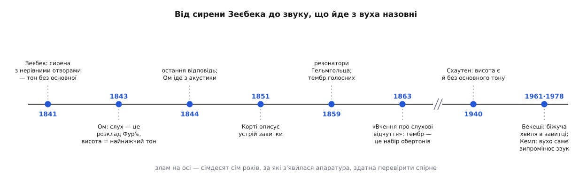
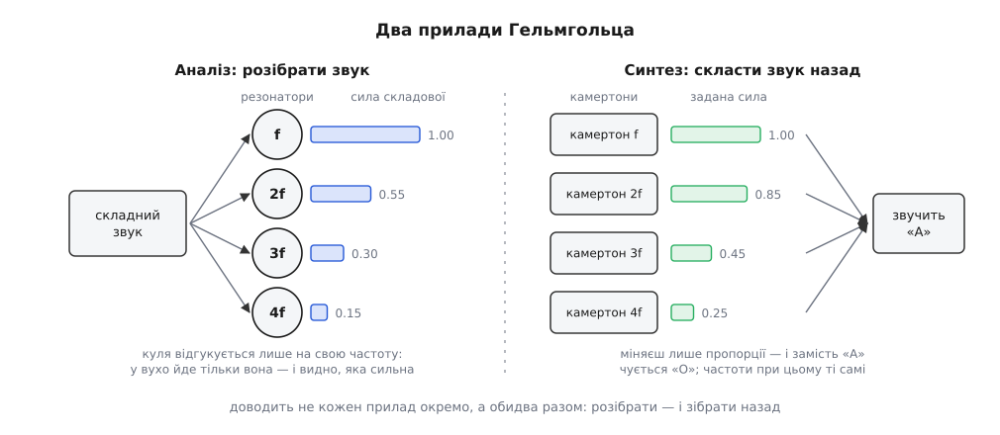

# 📜 Суперечка про тон: як довели, що тембр — це набір обертонів, а вухо їх розбирає

Те, що скрипка й флейта різняться набором обертонів, а вухо той набір розбирає, — не спостереження, яке комусь пощастило зробити, а підсумок суперечки, що тривала двадцять років і мало не поховала сторону з правильним дослідом. Сперечалися там не про математику: розклад Фур'є визнавали обидва боки й ніхто його не заперечував. Сперечалися про те, чи має фізик право сказати, **що саме чує вухо**, — і чим таке твердження взагалі доводять.

## Чути обертон і виміряти обертон — різні речі

Що одна струна звучить не одним голосом, знали давно. Марен Мерсенн, французький чернець-мінім, ще в «Harmonie universelle» (1636) описав, що в защипнутій струні поряд з основним тоном чути ще кілька вищих. 1701 року Жозеф Совер (Joseph Sauveur, 1653–1716) доповів Паризькій академії, що ті вищі тони стоять на кратних частотах, і дав їм ім'я — *sons harmoniques*, гармонічні звуки; роком раніше він же запропонував для всієї науки про звук назву *acoustique*, від гр. *akoustikós* — слуховий.

Але почути слабкий обертон і знати рецепт звуку — різні речі. Ніхто не міг сказати, **скільки** якої складової в суміші: вухо давало «наче чую», і на цьому вимірювання закінчувалося. Ба більше, не було жодної причини вважати, що саме цей рецепт і є тембр. Цілком природно виглядало інше пояснення: кожне тіло має власний, ні на що не звідний характер звучання — своє «забарвлення», — а обертони до нього просто додаються збоку.

До 1822 року з'явилася математична половина відповіді: [Жозеф Фур'є показав](topic:math-analysis/fourier-idea), що будь-яку повторювану криву можна єдиним способом скласти із синусоїд кратних частот. Тільки це твердження про **криві**, а не про вуха. Теорема нікого не зобов'язує: те, що криву можна розкласти на папері, ще не означає, що якийсь орган тіла це розкладання виконує.

## Ом переносить теорему на вухо

Перший, хто зважився зробити з теореми твердження про слух, — Ґеорґ Симон Ом (Georg Simon Ohm, 1789–1854), той самий, чиє прізвище носить закон про струм. Улітку 1843 року в «Annalen der Physik und Chemie» він надрукував працю з довгою назвою: «Über die Definition des Tones, nebst daran geknüpfter Theorie der Sirene und ähnlicher tonbildender Vorrichtungen» — «Про означення тону, з прив'язаною до нього теорією сирени та подібних тонотворних пристроїв».

Твердження було коротке й зухвале. Простий тон — це синусоїда, і тільки вона. Складний звук вухо сприймає як **набір** таких простих тонів, тобто саме як його розклад Фур'є. А висота звуку задана частотою тієї синусоїди, що стоїть у розкладі найнижчою.

Останнє речення й перетворило філософію на фізику: воно давало правило, яке можна перевірити й провалити. Знайдіть у звуці найнижчу наявну синусоїду — і ви знаєте, яку ноту почує людина. Ом свідомо взяв за головний об'єкт **сирену**: диск з отворами, крізь які женуть повітря, дає тон із самих поштовхів тиску — без струни, без резонансної коробки, без нічого зайвого. Найчистіший випробувальний майданчик, який тільки можна вигадати.

Це виявилося невдалим вибором, бо найкращим у Європі знавцем сирен був чоловік, у якого контрприклад уже лежав у шухляді.

## Сирена Зеєбека: тон без основної частоти

Авґуст Зеєбек (August Ludwig Friedrich Wilhelm Seebeck, 1805 Єна — 1849 Дрезден) працював у дрезденському технічному закладі й був сином Томаса Йогана Зеєбека — балтійського німця, що народився в Ревелі (нинішній Таллінн) і відкрив термоелектрику. Ще 1841 року, за два роки до Омової праці, він робив із сиреною те, чого Ом не робив: змінював розстановку отворів на диску.

Поставте отвори не рівномірно, а парами — то ближче, то далі. Візерунок поштовхів тепер повторюється не з кожним отвором, а з кожною парою, тобто вдвічі повільніше; підбираючи проміжки, можна довести складову на цій низькій частоті до ледь помітної або взагалі прибрати. За Омовим правилом висота мала б піти вгору — до найнижчої **наявної** синусоїди. Вухо ж чуло низький тон, і чуло впевнено, куди голосніше, ніж дозволяла кволість тієї складової.

Висновок Зеєбека був прямий: висота береться не з окремої синусоїди, що є в звуці, а з **періодичності самого візерунка** поштовхів. Через чотири місяці після Ома він надрукував у тих-таки «Annalen» відповідь «Ueber die Sirene». Ом заперечив 1844-го («Noch ein Paar Worte über die Definition des Tones» — «Ще кілька слів про означення тону») і після цього з акустики пішов.

Найцікавіше в тій сварці — не хто мав рацію, а те, що обидва сперечалися про **різні речі й не помічали цього**. Ом казав: розклад лежить у самій хвилі, його дає теорема, і сперечатися нема з чим. Зеєбек 1844 року відповів запитанням, яке точно окреслює предмет: чим же іще вирішувати питання, що таке тон, як не вухом? Один говорив про сигнал, другий — про сприйняття, і ніхто з них не мав способу відокремити одне від одного. Історики науки (передусім Р. Стівен Тернер, «The Ohm–Seebeck dispute…», 1977) вважають саме цю суперечку тим місцем, де народилася фізіологічна акустика як окрема галузь. Сам Зеєбек її розв'язки не побачив: він помер 1849 року, сорока трьох літ.

*Двадцять років суперечки, два прилади, що її закрили, — і сто років на те, щоб побачити, у чому Зеєбек усе-таки мав рацію.*

## Гельмгольц: прилад замість «здається, чую»

Двадцять років питання висіло, бо не було чим його різати. Розв'язав його Герман фон Гельмгольц (Hermann von Helmholtz, 1821–1894) — і зміг це зробити тому, що був водночас двома людьми: лікарем за освітою, полковим хірургом, професором фізіології (Кеніґсберґ, Бонн, Гайдельберґ), а згодом професором фізики в Берліні.

Перший його хід був не теоретичний, а ремісничий: перестати сперечатися, що кому чується, і зробити прилад, який відповідає **замість** вуха.

Так з'явився резонатор Гельмгольца (від 1859 року): тверда, майже куляста посудина відомого об'єму з широким устям з одного боку й вузькою трубочкою з другого. Трубочку обліплюють м'яким воском і вставляють у вухо — так вона сідає щільно. Повітря в порожнині разом із повітрям у шийці — це коливальна система з **однією** власною частотою; підставте кулю під складний звук, і [резонанс](topic:ph-waves/resonance) підсилить у вухо тільки «свою» складову, лишивши решту тихою. Питання «чи є в цій голосній складова на 512 герцах і наскільки вона сильна» дістало нарешті фізичну відповідь, а не враження.

Далі за справу взявся майстер. Рудольф Кеніґ (Karl Rudolph Koenig, 1832 Кеніґсберґ — 1901 Париж), скрипковий майстер із виучки в паризького Вюйома, що 1858-го відкрив власну майстерню акустичних приладів, зібрав із резонаторів цілу батарею: чотирнадцять куль від 96 до 1280 герців. До кожної він приробив свій винахід 1862 року — манометричну капсулу: дві півсфери, розділені гумовою перетинкою, з горючим газом по один бік і вузьким пальником зверху. Коли до резонатора приходить «його» частота, тиск усередині пульсує, перетинка колише газ, і полум'я тремтить. Дивитися на цей рядок вогників треба в обертове дзеркало: там кожне полум'я розтягується в зубчасту стрічку, і по зубцях видно частоту. Заспівайте «А» — затріпоче одна група вогників, «О» — інша.

Ось звідки взявся спектр як **видима** річ: до Кеніґових полум'їв він був висновком з обчислення, після них — картинкою, яку видно з останнього ряду лекційної зали.

*Два прилади Гельмгольца — один розбирає звук на чисті тони, другий складає його назад із чистих тонів. Доводить не кожен окремо, а обидва разом.*

## Зворотний бік доказу: зібрати голосну з камертонів

В аналізі лишалася дірка, і Гельмгольц її бачив. Резонатор, що загудів, міг гудіти й від частоти, яку сам же прилад і породив. А головне: навіть якщо всі складові справді є в звуці, з цього ще не випливає, що **саме вони й нічого більше** роблять тембр. Аналіз показує, що в супі є морква; він не доводить, що суп — це морква, цибуля й вода в такій-от пропорції.

Дірку закриває тільки хід у зворотний бік: задати рецепт наперед і перевірити, чи вийде з нього потрібний звук. Це і є другий прилад Гельмгольца. Основний камертон і його обертони — до восьмого-десятого; кожен камертон розгойдує електромагніт, живлений уривчастим струмом, тож той гуде рівно й скільки завгодно довго; проти кожного стоїть свій резонатор, і, присуваючи резонатор ближче або далі, задають, скільки саме цієї складової випустити назовні; клавіатура з заслінками відчиняє потрібні резонатори. Виставте пропорції — і з набору чистих тонів залунає «А». Змініть тільки пропорції, нічого не додаючи й не забираючи з частот, — залунає «Е», потім «О».

Це і є доказ, що закриває питання. Тембр — не додаткова властивість тіла, а сам **рецепт суміші**. Гельмгольц сформулював це різко: *Klangfarbe* (нім. *Klang* — звучання, *Farbe* — барва) залежить винятково від кількості й відносної сили часткових тонів і **не** залежить від їхніх [фаз](topic:ph-waves/phase). Останнє застереження — єдине, що згодом довелося пом'якшити.

Із голосних вийшов і власний наслідок. Гельмгольц помітив, що голосна лишається собою, на якій висоті її не співай («Ueber die Klangfarbe der Vocale», «Annalen der Physik», 1859): ротова порожнина — це резонатор із **закріпленими** смугами підсилення, і вона підіймає ті складові, які в ті смуги потрапили, хоч би де стояла основна частота. Ці нерухомі смуги сьогодні звуть формантами.

## Чому вухо взагалі вміє розбирати

Лишалося третє питання, найважче: гаразд, розкласти звук приладом можна — а чи робить це вухо?

Найсильніший аргумент Гельмгольца тут — не дослід, а порівняння двох чуттів. Змішайте червоне світло із зеленим: побачите жовте, і жодна увага його назад не розділить; ба більше, те саме жовте можна дістати з інших пар, і око їх не відрізнить — воно видає назовні всього три числа. Тепер візьміть три ноти разом: ви чуєте три ноти, і жоден інший акорд не звучить точнісінько так само. Якби вухо працювало як око, різні акорди зливалися б в однакові відчуття. Вони не зливаються — отже, вухо суміш **розділяє**, і каналів у нього не три, а дуже багато.

Анатомія на той час уже підоспіла. 1851 року італієць Альфонсо Корті, працюючи у Вюрцбурзі, надрукував «Recherches sur l'organe de l'ouïe des mammifères» і описав чутливий орган, що сидить на основній перетинці всередині завитки, — на матеріалі близько двохсот препарованих завиток. Гельмгольц 1863 року припустив, що цей устрій і є батарея резонаторів: поперечні волокна основної перетинки натягнені, як струни рояля, кожне налаштоване на свою частоту й підключене до свого нерва. (Спершу він указував на стовпчики Корті й лише згодом перейшов на волокна перетинки.) Одна частота — одне місце — одне нервове волокно. Його латунні кулі, Кеніґові вогники й завитка внутрішнього вуха виявилися трьома втіленнями однієї думки.

> 🔧 **Навіщо це.** Мапа «частота → місце» дожила до інженерії напряму. Багатоканальний кохлеарний імплант робить рівно те, що робив рядок Кеніґових резонаторів: розкладає звук на смуги й подає кожну смугу на той електрод, який лежить у відповідному місці завитки. Він не відтворює звук — він відтворює **розклад**; і працює це лише тому, що місце вздовж завитки справді означає частоту.

## Що з цього не встояло

Кожна з трьох поправок повчальна окремо.

**Висота без основного тону.** Гельмгольцові довелося щось зробити із сиреною Зеєбека, і він урятував Омове правило дотепно: передавання в середньому вусі не строго лінійне, а нелінійна система, діставши два тони, породжує нові — зокрема тон різницевої частоти. Отже, основний тон таки є фізично, тільки вухо виготовляє його саме. Красиво — і хибно. У 1938–1940 роках нідерландець Ян Фредерік Схаутен (Jan Frederik Schouten), уже з електронною апаратурою, перевірив це прямо: він залив ділянку основної частоти шумом, який заглушив би будь-який тон на ній — і той, що прийшов ззовні, і той, що народився б у вусі. Низька висота лишилася на місці. Виходить, жодної фізичної складової там не потрібно: вухо бере висоту з періодичності нерозділених верхніх складових — Схаутен назвав це залишком, *residue* (Proc. KNAW, 1938–1940). Спостереження Зеєбека справдилося через сто років, коли з'явилися прилади, здатні його захистити.

**Струни, яких немає.** Ґеорґ фон Бекеші (Georg von Békésy, 1899 Будапешт — 1972), угорець, що починав у лабораторії угорської пошти на телефонному зв'язку, розкривав завитки й дивився, як перетинка рухається насправді. Незалежних струн там немає: рідина жене вздовж основної перетинки **біжучу хвилю** — від твердої основи до податливої верхівки, — і місце, де вона здіймається найвище, залежить від частоти. Нобелівська премія з фізіології та медицини 1961 року — «за відкриття фізичного механізму збудження у завитці». Механізм Гельмгольца виявився не той; його мапа «частота → місце» встояла цілком. Це часта форма в історії фізики: картинку «як воно влаштоване» міняють, а співвідношення, яке з неї передбачили, лишається.

**Фаза.** Правило «фази не чути» добре працює на багатьох звуках, але законом не є: за належних умов вухо до фази таки чутливе. Гарне наближення тут просто підняли до рангу закону.

І остання поправка, у якій прилад Гельмгольца знову виринає — тепер усередині самого вуха. Бекеші міряв мертві завитки й діставав широке, тупувате налаштування, значно грубше за те, що людина насправді розрізняє на слух. 1948 року Томас Ґолд (Thomas Gold, 1920 Відень — 2004), фізик із воєнним радарним досвідом, надрукував «Hearing II: The physical basis of the action of the cochlea» (Proc. R. Soc. B 135) з міркуванням радіоінженера: пасивний резонатор, занурений у рідину, надто сильно згасає, щоб бути таким гострим; отже, завитка мусить **підкачувати** енергію назад — це приймач із додатним зворотним зв'язком. А така система, як усякий регенеративний приймач, здатна зірватися в самозбудження — тобто має сама випромінювати звук. Тридцять років цього ніхто не брав усерйоз, доки мікрофони не стали достатньо тихими: 1978 року британець Девід Кемп поставив мікрофон у слуховий прохід і записав звук, що йде з вуха назовні.

Так живий аналізатор спектра з XIX століття виявився ще й підсилювачем: батареєю резонаторів, яка сама себе розгойдує — і час від часу тихенько наспівує.
