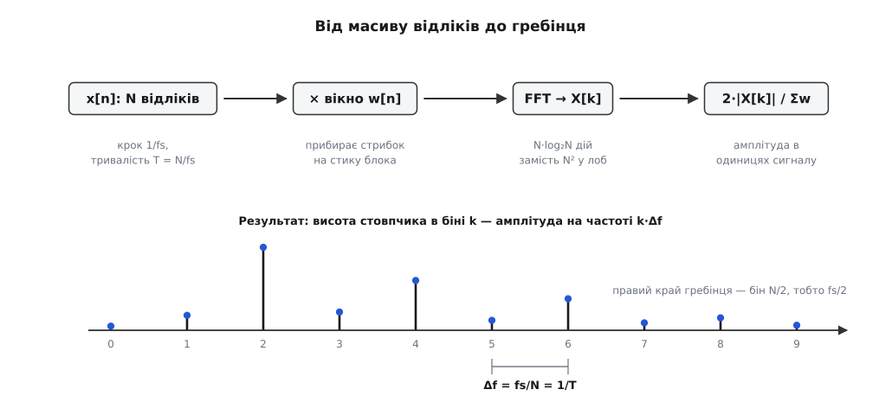
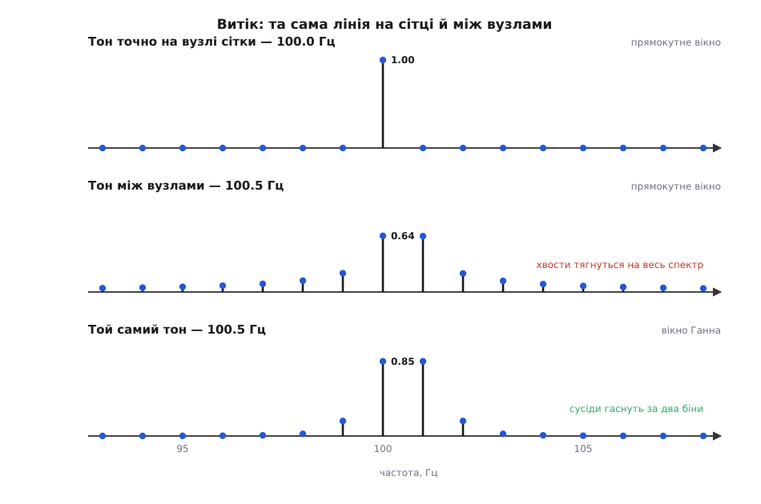
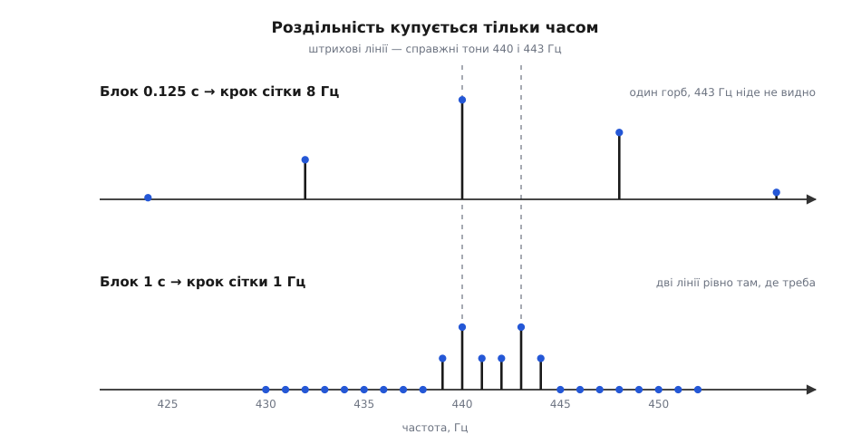

# ⚙️ Дістати гребінець зі свого сигналу: FFT на практиці

Є масив чисел — те, що видав мікрофон, АЦП чи датчик вібрації, — і треба обернути його на список ліній: яка частота, яка амплітуда. Нижче ця робота розібрана до дна: що саме рахує машина, чому спосіб «у лоб» задорогий, як виглядає готова функція на настільній машині й на мікроконтролері та на чому найлегше дістати правдоподібний, але брехливий результат.

### Виміряти одну частоту

Почнімо з питання, дрібнішого за цілий спектр: як узагалі перевірити, чи сидить у сигналі якась одна конкретна частота? Прийом простий і майже механічний. Помножте кожен відлік на пробний синус тієї частоти, яку перевіряєте, і складіть усі добутки. Якщо такої складової в сигналі немає, добуток однаково часто виходить додатний і від'ємний — сума топчеться коло нуля. Якщо ж вона є, її горби лягають на горби пробного синуса, ями на ями, добуток раз у раз виходить додатний, і сума наростає тим швидше, чим більша амплітуда. Одне множення й одне додавання на відлік — і про цю частоту все відомо.

Одного пробного синуса, щоправда, замало. Якщо шукана складова зсунута по фазі на чверть періоду, вона обернеться на косинус — і тоді на кожен додатний добуток знайдеться рівний йому від'ємний, сума вийде нульова, хоч складова в сигналі є. Тому пробують **двома** синусоїдами одразу, синусом і косинусом. Вони дають дві суми, `a` і `b`, а шукана амплітуда — це довжина вектора √(a² + b²), якої вже не обдурить жоден зсув. Пара (a, b) — то і є одне комплексне число X[k], яке віддає перетворення на кожній частоті.

Лишається вибрати, які частоти пробувати. Блок із N відліків — усе, що є; поза ним машина не бачить нічого, тож поводиться з блоком так, ніби він повторюється по колу без кінця. У такому колі без розриву лягають лише ті синусоїди, що вкладаються в блок **цілим** числом періодів: один період на блок, два, три… Звідси й сітка частот із кроком

```
Δf = 1/T = fs/N        T = N/fs — тривалість блока, fs — частота відліків
```

Вище за половину частоти відліків нового вже нема: там починається дзеркало, і реальні частоти, що туди потрапили, [видають себе за чужі](topic:com-signal/nyquist-aliasing). Тож корисні вузли — від нульового до N/2, і кожен такий вузол називають **біном** (англ. *bin* — комірка): бін k відповідає частоті k·Δf.

Порахувати всі біни в лоб — це N/2 разів пройтися по всіх N відліках, тобто порядку N² множень. Для однієї секунди звуку (fs = 44100) виходить близько 1.9·10⁹ операцій — на таке не варто й дивитися. Наївний подвійний цикл на Python для коротенького блока N = 1024 рахував у мене 1.3 секунди, тоді як `np.fft.fft` того самого блока — 38 мікросекунд.

Різниця не в мові, а в дорозі. **Швидке перетворення Фур'є** дає **той самий** результат, що й пряме означення ([дискретне перетворення Фур'є](topic:com-signal/dft)), просто йде до нього коротше: суму по N відліках розкладають на суму по парних відліках і суму по непарних, кожна з них виявляється таким самим перетворенням удвічі коротшого блока, і так до пари. Виходить log₂N ярусів по N/2 елементарних дій ([як саме працює цей поділ](topic:com-signal/fft)). Для тієї ж секунди звуку — 3.4·10⁵ дій замість 1.9·10⁹, у п'ять із половиною тисяч разів менше. Тому спектр і рахують через FFT, а не за означенням; і з тієї ж причини FFT — не «інше перетворення», а лише спосіб дешево дістати те саме.


*Увесь шлях від масиву до гребінця. Три вибори задають решту: частота відліків fs визначає стелю fs/2, довжина блока N — крок сітки Δf, вікно — те, як далеко розповзеться сильна лінія.*

### Функція, що повертає гребінець

У коді це коротко. Ось повний перехід від масиву відліків до двох масивів «частота — амплітуда»:

```python
import numpy as np

def spectrum(x, fs, win=None):
    """Спектр дійсного сигналу: частоти в герцах, амплітуди в одиницях x."""
    N = len(x)
    w = np.ones(N) if win is None else win(N)
    X = np.fft.rfft(x * w)                 # лише додатні частоти: 0 … fs/2
    amp = 2.0 * np.abs(X) / w.sum()        # переводимо в амплітуду сигналу
    amp[0] /= 2                            # стала складова не подвоюється
    if N % 2 == 0:
        amp[-1] /= 2                       # бін Найквіста теж
    return np.fft.rfftfreq(N, 1.0/fs), amp
```

Два місця тут неочевидні.

`rfft` замість `fft` — бо сигнал дійсний, і від'ємні частоти в його спектрі дзеркально повторюють додатні. Рахувати їх — марна робота: `rfft` віддає N/2+1 бінів і робить удвічі менше.

Множник `2/Σw` переводить сирі числа перетворення в амплітуду. Сума добутків росте і з амплітудою, і з кількістю відліків, тож ділити треба на суму ваг вікна Σw (для прямокутного вікна це просто N — воно ж нічого не приглушує). А двійка — бо енергія дійсної синусоїди ділиться порівну між додатною й від'ємною частотою, і, викинувши від'ємну половину, ми маємо долічити те, що на неї припадало. Виняток — нульовий бін (стала складова) і бін на самій межі fs/2: у них дзеркального двійника немає, тож двійку для них скасовуємо.

### Перевірка на меандрі

Новий код перевіряють на тому, чия відповідь відома наперед. Прямокутна хвиля (меандр) для цього ідеальна: у її спектрі мають бути тільки непарні гармоніки з амплітудами, що спадають як 1/n.

```python
fs, f0, N = 48000, 100.0, 4800             # 0.1 с — рівно 10 періодів
t = np.arange(N) / fs
x = np.where((f0*t) % 1.0 < 0.5, 1.0, -1.0)   # півперіоду +1, півперіоду −1

f, a = spectrum(x, fs)
k0 = round(f0 / (fs/N))                    # бін основної частоти
for n in range(1, 10):
    k = n * k0
    print("%2d·f0 = %5.0f Гц   амплітуда %.4f   від основної %.4f"
          % (n, f[k], a[k], a[k]/a[k0]))
```

```
 1·f0 =   100 Гц   амплітуда 1.2732   від основної 1.0000
 2·f0 =   200 Гц   амплітуда 0.0000   від основної 0.0000
 3·f0 =   300 Гц   амплітуда 0.4244   від основної 0.3334
 4·f0 =   400 Гц   амплітуда 0.0000   від основної 0.0000
 5·f0 =   500 Гц   амплітуда 0.2547   від основної 0.2000
 6·f0 =   600 Гц   амплітуда 0.0000   від основної 0.0000
 7·f0 =   700 Гц   амплітуда 0.1820   від основної 0.1429
 8·f0 =   800 Гц   амплітуда 0.0000   від основної 0.0000
 9·f0 =   900 Гц   амплітуда 0.1416   від основної 0.1112
```

Гребінець вийшов саме той: 1, 1/3, 1/5, 1/7, 1/9 — і рівно нуль на всіх парних. Абсолютна амплітуда основної, 1.2732, — це 4/π, стільки й має бути в меандра з розмахом ±1.

Такою чистою картинку зробили дві дрібниці, і обидві варто мати на увазі. Перша: у блок укладається **ціле** число періодів (десять періодів у 0.1 с). Друга: шпаруватість рівно 50%. Спокуслива однорядкова заміна `np.sign(np.sin(...))` цього не дає — у точках, де синус проходить нуль, `sign` віддає нуль або, через похибку округлення, не той знак; півперіоди виходять нерівні, і в спектрі спливають парні гармоніки на рівні 0.3%. Брехня маленька, але цілком видима.

І ще одне, чесно. Ближче до верху діапазону гребінець відходить від 1/n: на 23900 Гц код дає 0.0083 замість теоретичних 4/(π·239) = 0.0053. Це не хиба перетворення, а згортання частот. Меандр має нескінченний хвіст гармонік, а все, що вище за fs/2, при дискретизації **згортається** назад у робочий діапазон і додається до тамтешніх ліній. Згенеруйте меандр як суму самих лише гармонік нижче fs/2 — і той самий бін дасть рівно 0.0053. Отже, межу Найквіста тут порушує не код, а сам сигнал, і в живому приладі за це відповідає [фільтр перед АЦП](topic:hw-analog/anti-aliasing-filter).

### Витік: коли лінія розповзається

Зсуньмо тон на пів кроку сітки — і чиста картинка розсиплеться:

```python
fs, N = 1000, 1000                          # T = 1 с, крок сітки 1 Гц
t = np.arange(N) / fs

for ftone in (100.0, 100.5):
    f, a = spectrum(np.sin(2*np.pi*ftone*t), fs)
    k = int(np.argmax(a))
    print("тон %.1f Гц:  пік %.4f на %.0f Гц,  сусід %.4f,  далекий бін 120 Гц %.4f"
          % (ftone, a[k], f[k], a[k+1], a[120]))
```

```
тон 100.0 Гц:  пік 1.0000 на 100 Гц,  сусід 0.0000,  далекий бін 120 Гц 0.0000
тон 100.5 Гц:  пік 0.6380 на 100 Гц,  сусід 0.6353,  далекий бін 120 Гц 0.0151
```

Тон нікуди не дівся, а спектр змінився до невпізнання: замість однієї лінії висотою 1.00 — дві по 0.64 і хвіст, що дотягується аж до 120 Гц і далі. Причина — та сама умова «блок повторюється по колу». Ціле число періодів зшивається кінцем із початком без сліду; 100.5 періоду — ні: на стику блока хвиля обривається посеред періоду й стрибає. А стрибок широкосмуговий, він і сипле енергію по всіх бінах. Це й називають **витіком** спектра.

Ліки — не дати сигналові обірватися: помножити блок на дзвін, що плавно сходить до нуля на обох краях, і тоді стик виходить безшовний. Найпоширеніший такий дзвін — **вікно Ганна**, одна арка косинуса (у NumPy воно чомусь зветься `hanning`). Найкраще різницю видно на слабкій лінії поруч із сильною:

```python
x = np.sin(2*np.pi*100.5*t) + 0.010*np.sin(2*np.pi*130.0*t)
print("прямокутне вікно: %.5f" % spectrum(x, fs)[1][130])
print("вікно Ганна:      %.5f" % spectrum(x, fs, np.hanning)[1][130])
```

```
прямокутне вікно: 0.01388
вікно Ганна:      0.01000
```

Слабкий тон має амплітуду рівно 0.010. Без вікна він читається як 0.0139 — на 39% більше, бо в його бін натекло з хвоста сусіда, у сто разів сильнішого. З вікном Ганна — рівно 0.010. Коли шукають дрібну лінію біля великої — зайву гармоніку в підсилювачі, ранню ознаку дефекту в підшипнику, — без вікна не обійтися взагалі.


*Витік і вікно. Точно на вузлі сітки тон дає одну лінію заввишки рівно 1.00. Пів кроку вбік — і пік падає до 0.64, а хвости розповзаються по всьому спектру. Вікно Ганна прибирає хвости ціною ширшої вершини.*

Плата за вікно — удвічі ширший головний пелюсток: тон між вузлами дає два біни по 0.85 і ще два по 0.17, тобто дві близькі лінії злипаються легше, ніж із прямокутним вікном. І ще: вікно приглушує сигнал, тому нормувати треба саме на Σw — у коді це вже враховано. Про решту сімейства вікон і про те, що кожне з них виторговує, — [у вікні й витоку](topic:com-signal/windowing-leakage).

### Скільки треба слухати

Роздільність не купується ні швидшим процесором, ні довшим масивом — тільки часом. Крок сітки Δf = 1/T каже це прямо: хочеш розрізняти лінії за 1 Гц — слухай секунду; за 0.1 Гц — десять секунд.

```python
for T in (0.125, 1.0):
    fs = 8000
    N = int(fs * T)
    t = np.arange(N) / fs
    x = np.sin(2*np.pi*440*t) + np.sin(2*np.pi*443*t)
    f, a = spectrum(x, fs, np.hanning)
    top = [(round(float(f[i]), 1), round(float(a[i]), 2))
           for i in np.argsort(a)[::-1][:2]]
    print("T = %.3f с, крок %.0f Гц -> два найбільші біни: %s" % (T, fs/N, top))
```

```
T = 0.125 с, крок 8 Гц -> два найбільші біни: [(440.0, 1.59), (448.0, 1.07)]
T = 1.000 с, крок 1 Гц -> два найбільші біни: [(443.0, 1.0), (440.0, 1.0)]
```

Тонів два — 440 і 443 Гц. На блоці 0.125 с сітка має крок 8 Гц, обидва падають в один горб, і два найбільші біни — 440 та 448: справжніх 443 Гц не видно ніде, а 448 — то взагалі не лінія, а схил того самого горба. На блоці в секунду виходять рівно 440 і 443, кожен зі своєю амплітудою 1.0.


*Одні й ті самі два тони. Крок сітки дорівнює 1/T, тому на короткому блоці вони зливаються в один горб, а два найбільші біни вказують на частоти, яких у сигналі немає.*

Дописати в кінець масиву нулів (zero-padding) — спокуса, яка тут не працює: нулі не додають нової інформації про сигнал, вони лише згущують сітку й малюють гладкішу криву між тими самими вузлами; злиплі лінії від цього не розліпляться ([що саме дає доповнення нулями](topic:com-signal/zero-padding)).

А от **назвати** частоту однієї, окремо стоячої лінії точніше за крок сітки цілком можна. Вершина розмазаного піка симетрична, тож по трьох сусідніх бінах через неї проводять параболу й беруть її вершину:

```python
def peak_freq(f, a):
    k = int(np.argmax(a))                                    # найвищий бін
    d = 0.5*(a[k-1] - a[k+1]) / (a[k-1] - 2*a[k] + a[k+1])   # вершина параболи
    return (k + d) * (f[1] - f[0])                           # (k + зсув)·Δf

fs, N = 1000, 1000
t = np.arange(N) / fs
for ftone in (100.37, 137.83):
    f, a = spectrum(np.sin(2*np.pi*ftone*t), fs, np.hanning)
    print("справжня %.2f Гц -> бін %.0f Гц -> уточнено %.3f Гц"
          % (ftone, f[int(np.argmax(a))], peak_freq(f, a)))
```

```
справжня 100.37 Гц -> бін 100 Гц -> уточнено 100.322 Гц
справжня 137.83 Гц -> бін 138 Гц -> уточнено 137.869 Гц
```

На сітці з кроком 1 Гц це дає похибку близько 0.05 Гц — у двадцять разів дрібнішу за бін. Тільки не плутайте це з роздільністю: парабола уточнює **одну** лінію, а дві злиплі вона не розділить, бо вершина в них спільна.

> 🔧 **Навіщо це.** Рівність Δf = 1/T — не формальність, а межа, з якої виростають конструкції. Гітарний тюнер не може відповісти швидше, ніж дозволяє потрібна точність: щоб побачити розстройку на 0.5 Гц, доведеться слухати щонайменше дві секунди, і жодне прискорення процесора цього не змінить. Радар, що читає дальність із частоти биття, упирається в те саме: за час чирпа T дві цілі розрізняться, лише якщо їхні частоти биття різняться більш ніж на 1/T, — звідси й вимога до довжини чирпа. І аналізатор спектра помітно повільнішає, щойно ви звужуєте смугу огляду, — з тієї самої причини.

### У реальному часі: радікс-2 на мікроконтролері

На великій машині всю роботу зробила бібліотека. На мікроконтролері бібліотеки може й не бути, зате сама реалізація коротка. Ось класичний ітеративний радікс-2 «на місці» — без жодного виділення пам'яті, результат лягає в ті самі два масиви:

```c
#include <math.h>
#include <stddef.h>

#ifndef M_PI                        /* у стандарті C його немає — підстрахуймося */
#define M_PI 3.14159265358979323846
#endif

/* FFT «на місці»; n — степінь двійки. На вході re[] — відліки, im[] — нулі,
   на виході re[k], im[k] — комплексний спектр.                              */
void fft_radix2(float *re, float *im, size_t n)
{
    /* 1. перестановка за оберненими бітами: те, що алгоритм ділить
          на парні й непарні, після неї лежить поруч                */
    for (size_t i = 1, j = 0; i < n; i++) {
        size_t bit = n >> 1;
        for (; j & bit; bit >>= 1)
            j ^= bit;
        j ^= bit;
        if (i < j) {
            float t;
            t = re[i]; re[i] = re[j]; re[j] = t;
            t = im[i]; im[i] = im[j]; im[j] = t;
        }
    }
    /* 2. log2(n) ярусів метеликів: пара входів -> пара виходів */
    for (size_t len = 2; len <= n; len <<= 1) {
        float ang = -2.0f * (float)M_PI / (float)len;
        float sr = cosf(ang), si = sinf(ang);        /* крок повороту */
        for (size_t i = 0; i < n; i += len) {
            float wr = 1.0f, wi = 0.0f;              /* множник повороту */
            for (size_t k = 0; k < len / 2; k++) {
                size_t p = i + k, q = p + len / 2;
                float ur = re[p], ui = im[p];
                float vr = re[q]*wr - im[q]*wi;
                float vi = re[q]*wi + im[q]*wr;
                re[p] = ur + vr;  im[p] = ui + vi;
                re[q] = ur - vr;  im[q] = ui - vi;
                float t = wr*sr - wi*si;             /* докрутити множник */
                wi = wr*si + wi*sr;
                wr = t;
            }
        }
    }
}
```

Три десятки рядків роблять те саме, що `np.fft.fft`. Перший цикл переставляє відліки в порядку обернених бітів: після нього ті, що алгоритм на кожному кроці розділяє на парні й непарні, стоять поруч — і далі все рахується на місці, без другого масиву. Другий цикл — log₂n ярусів; на кожному беруть пару чисел, множать друге з них на множник повороту й дають на вихід їхню суму й різницю. Таку пару звуть **метеликом** — на схемі два входи й два виходи справді сходяться в крила.

Викликають його так:

```c
static float re[1024], im[1024];

for (size_t i = 0; i < 1024; i++) {
    re[i] = samples[i] * hann[i];    /* вікно — заздалегідь у таблиці */
    im[i] = 0.0f;
}
fft_radix2(re, im, 1024);

/* найсильніша лінія серед бінів 1 … n/2−1; w_sum — сума ваг вікна */
size_t kmax = 1;
for (size_t k = 2; k < 512; k++)
    if (re[k]*re[k] + im[k]*im[k] > re[kmax]*re[kmax] + im[kmax]*im[kmax])
        kmax = k;

float amp = 2.0f * sqrtf(re[kmax]*re[kmax] + im[kmax]*im[kmax]) / w_sum;
float hz  = kmax * (fs / 1024.0f);          /* крок сітки — fs/N */
```

Уся пам'ять — два масиви по n float: для n = 1024 це 8 кілобайтів, і ще стільки ж, якщо тримати таблицю вікна. Часу — (n/2)·log₂n метеликів, тобто 5120 штук, у кожному з півтора десятка множень і додавань; на 100-мегагерцовому Cortex-M4 з апаратним FPU цей нехитрий варіант укладається в одиниці мілісекунд, вилизана бібліотечна реалізація — помітно швидше.

Один підступ у цьому коді знати варто. Множник повороту тут не рахують заново на кожному кроці, а **докручують** множенням — це швидко, зате похибка накопичується. На `float` при n = 4096 множник відхиляється від правильного вже на 3·10⁻⁵, а це приблизно −90 дБ: слабші лінії тонуть у цьому бруді. Ліки прості — тримати таблицю синусів або перераховувати `cosf`/`sinf` для кожного k.

І остання порада для дрібного заліза: якщо потрібні не всі біни, а дві-три наперед відомі частоти (тон виклику, частота мережі), то FFT — надмір. Тоді беруть [алгоритм Гертцеля](topic:com-signal/goertzel): він дає один бін за N дій і не потребує буфера на весь блок.

### Складність і пастки

Ціна відома точно: N·log₂N операцій і N комірок пам'яті проти N² «у лоб». Для дійсного сигналу половину роботи знімає `rfft`. Довжину блока варто брати степенем двійки: на ній працює найпростіший радікс-2, а бібліотеки на «незручних» довжинах (наприклад, простих числах) сповільнюються в рази.

Найчастіші способи дістати правдоподібну неправду:

- **Стала складова.** Сигнал з АЦП завжди підпертий постійним зміщенням, і нульовий бін виходить велетенським. Гірше, що з вікном ця стала розтікається на сусідні біни й топить найнижчі частоти — саме ті, де сидить корисне у вібродіагностиці. Віднімайте середнє перед перетворенням.
- **Прямокутне вікно на «живому» сигналі.** Тон, узятий не з генератора, майже ніколи не стоїть точно на вузлі сітки, тож без вікна кожна сильна лінія розсипає хвости на весь спектр. Прямокутне вікно годиться, лише коли ви самі впевнені в цілому числі періодів у блоці — наприклад, коли частоту відліків прив'язано до самого сигналу.
- **Забуте нормування.** Без ділення на Σw амплітуди виходять у довільних одиницях, що залежать від довжини блока: змінили N — змінилися всі числа. Порівняти два такі виміри між собою вже неможливо.
- **Роздільності чекають від N, а не від T.** Взяли вдесятеро більше відліків, не змінивши тривалості (підняли fs), — сітка не згустилася анітрохи, лише піднялася стеля fs/2.
- **Аліасинг ще до АЦП.** Усе, що на вході швидше за fs/2, перетворення чесно покаже — але не там, де воно є, а в дзеркальному місці, і відрізнити таку лінію від справжньої вже неможливо. Це лікується тільки фільтром **перед** оцифруванням.
- **Сигнал змінюється всередині блока.** Спектр — це середнє по всьому блоку, тож для мови, музики чи розгону двигуна одне число на блок бреше однаково в обидва боки. Тоді ріжуть сигнал на короткі шматки, що частково перекриваються, і рахують спектр кожного окремо — [спектрограма](topic:com-signal/spectrogram).
- **Лінійна шкала.** На ній видно тільки найсильніші лінії, а все, що слабше за них у сотню разів, притиснуте до самої осі. Слабкі складові дивляться в [децибелах](topic:hw-analog/decibels), де кожні 20 дБ — десятикратна різниця амплітуд.

Три числа тут вирішують усе, і вибирають їх ще до першого рядка коду: частота відліків fs ставить стелю fs/2, довжина блока N задає крок сітки fs/N, а вікно визначає, як далеко сильна лінія затінить сусідів. Решта — арифметика, яку зробить бібліотека або три десятки рядків на C.
