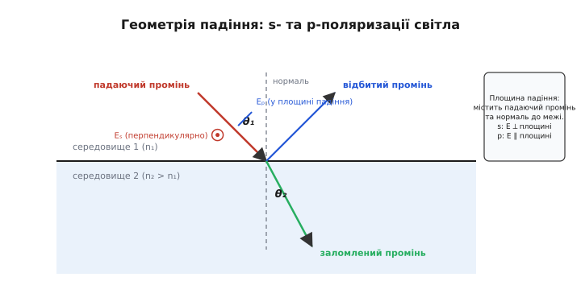
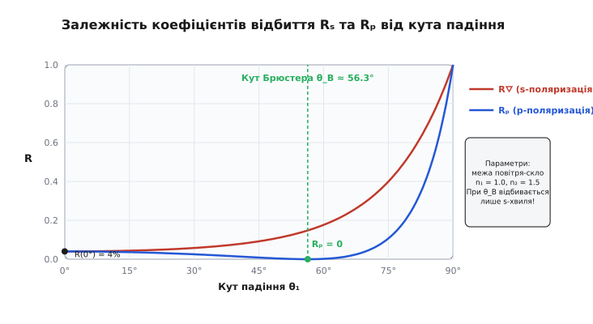
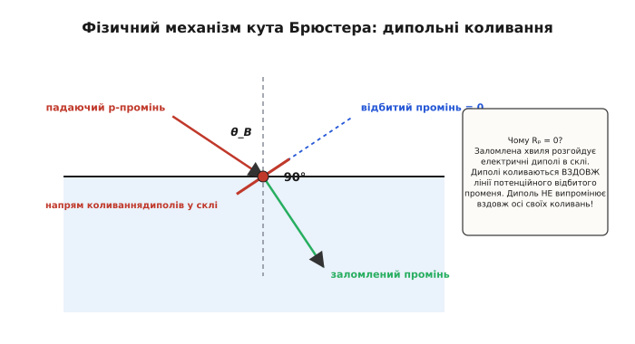
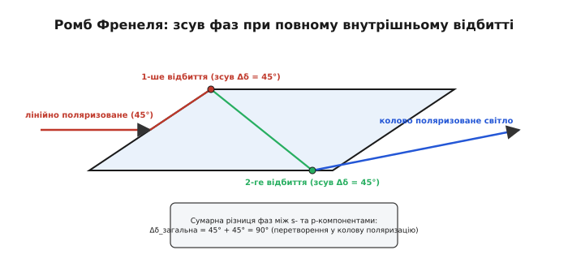

# Рівняння Френеля

<preknowlist>
- [Повне внутрішнє відбиття](topic:ph-waves/total-internal-reflection) — заломлення на межі двох середовищ, закон Снелла та граничний кут падіння.
- [Електромагнітна хвиля](topic:ph-electromagnetism/em-wave) — зв'язок орієнтації векторів електричного та магнітного полів у хвилі.
</preknowlist>

Коли червоний лазерний промінь падає під кутом 45° на поверхню звичайного віконного скла з показником заломлення `n = 1.5`, приблизно 95% його енергії проходить усередину скла, а 5% відбивається назад у повітря. Проте варто повертати лазер далі, змушуючи промінь заковзати уздовж скла під кутом 85° до нормалі, як відбита частка енергії стрімко зростає до 61%, перетворюючи прозору пластину на ясне дзеркало. Світло не просто «відштовхується» від поверхні: на будь-якій межі двох прозорих середовищ електромагнітна хвиля розпадається на дві нові хвилі — відбиту та заломлену. Амплітуда, фаза та енергія кожної з них підкоряються суворим математичним формулам, які називають **рівняннями Френеля** (*Fresnel equations*). Вони пояснюють усе — від розмитих відблисків на мокрому асфальті та будови дзеркальних покриттів у мікроскопах до роботи поляризаційних фільтрів, оптичних давачів та фізично точного рендерингу в тривимірній комп'ютерній графіці.

### 1. Межа розділу та хвильове розщеплення

Кожна світлова хвиля — це взаємопов'язані коливання векторів напруженості електричного поля `E` та магнітного поля `H`, які поширюються у просторі зі швидкістю, що визначається оптичною густиною середовища. Коли така хвиля натрапляє на тонку межу між середовищем з показником заломлення `n₁` та середовищем з показником `n₂`, її електромагнітні поля змушені безперервно стикуватися. Закони класичної електродинаміки вимагають, щоб електричне й магнітне поля не мали стрибків уздовж самої поверхні розділу.

Щоб задовольнити ці граничні умови, вихідне поле падаючої хвилі змушене розщепитися на два нові потоки:
1. **Відбита хвиля** (*reflected wave*), що повертається назад у перше середовище під кутом падіння `θ₁`.
2. **Заломлена хвиля** (*refracted wave* або *transmitted wave*), що продовжує рух у другому середовищі під кутом заломлення `θ₂`, визначеним законом Снелла:

```
n₁ · sin θ₁ = n₂ · sin θ₂
```

Проте сам закон Снелла є суто кінематичним: він указує лише *напрямки* поширення променів із вимоги збереження паралельної складової хвильового вектора `kₓ = k₀ · n · sin θ`. Він нічого не каже про динаміку явища — яка частка енергії повернеться назад, а яка піде далі, і як ця частка зміниться, якщо повернути джерело світла або змінити його поляризацію. Відповідь на це динамічне питання дають рівняння Френеля.

### 2. Площина падіння та розбиття на s- і p-поляризації

Поведінка електромагнітної хвилі на межі принципово залежить від того, як вектор її електричного поля `E` орієнтований відносно геометрії поверхні. Для опису цієї геометрії вводять поняття **площини падіння** (*plane of incidence*) — це уявна площина, яка містить у собі напрямок падаючого променя та нормаль (перпендикуляр) до межі розділу.

Будь-який вектор електричного поля `E` можна розкласти на дві взаємно перпендикулярні компоненти:

- **s-поляризація** (від німецького *senkrecht* — перпендикулярний): вектор `E` коливається перпендикулярно до площини падіння. Це означає, що вектор `E` лежить повністю паралельно межі розділу середовищ при будь-якому куті падіння.
- **p-поляризація** (від німецького *parallel* — паралельний): вектор `E` коливається в самій площині падіння. При зміні кута падіння цей вектор нахиляється відносно поверхні, змінюючи свою проєкцію на межу.


*Світловий промінь на межі двох середовищ. Вектор електричного поля s-хвилі (Eₛ) перпендикулярний до площини малюнка, а вектор p-хвилі (Eₚ) лежить у площині падіння та змінює кут нахилу до поверхні разом із променем.*

Ця геометрична різниця виявляється вирішальною. Для s-хвилі вектор `E` завжди залишається паралельним до поверхні, тому його тангенціальна компонента дорівнює самому вектору `E`. Для p-хвилі тангенціальна частина дорівнює `E · cos θ`, тобто залежить від кута нахилу променя. Саме тому s- та p-хвилі відбиваються й заломлюються по-різному.

### 3. Амплітудні коефіцієнти Френеля

Огюстен-Жан Френель вивів комплексні відношення між амплітудами відбитої хвилі (`E₀ᵣ`), заломленої хвилі (`E₀ₜ`) та падаючої хвилі (`E₀ᵢ`). Ці відношення називають **амплітудними коефіцієнтами Френеля**:

```
r = E₀ᵣ / E₀ᵢ     [амплітудний коефіцієнт відбиття]
t = E₀ₜ / E₀ᵢ     [амплітудний коефіцієнт заломлення]
```

Використовуючи умови неперервності тангенціальних компонент полів на межі розділу двох незаряджених діелектриків, отримують чотири фундаментальні формули.

Для **s-поляризації**:

```
rₛ = (n₁·cos θ₁ - n₂·cos θ₂) / (n₁·cos θ₁ + n₂·cos θ₂)   [1: відбиття s-хвилі]
```

```
tₛ = (2·n₁·cos θ₁) / (n₁·cos θ₁ + n₂·cos θ₂)              [2: заломлення s-хвилі]
```

Для **p-поляризації**:

```
rₚ = (n₂·cos θ₁ - n₁·cos θ₂) / (n₂·cos θ₁ + n₁·cos θ₂)   [3: відбиття p-хвилі]
```

```
tₚ = (2·n₁·cos θ₁) / (n₂·cos θ₁ + n₁·cos θ₂)              [4: заломлення p-хвилі]
```

Існує також зручна тригонометрична форма цих формул, яка виражає коефіцієнти виключно через кути `θ₁` та `θ₂` без явного запису показників заломлення (за умови застосування закону Снелла):

```
rₛ = - sin(θ₁ - θ₂) / sin(θ₁ + θ₂)
```

```
rₚ = tg(θ₁ - θ₂) / tg(θ₁ + θ₂)
```

Знак мінус у формулі `rₛ` означає, що при відбитті світла від оптично густішого середовища (`n₂ > n₁`) відбита хвиля змінює свою фазу на 180° (або π радіан). Гребінь падаючої хвилі перетворюється на западину відбитої.

Детальний суворий математичний вивід цих чотирьох формул із рівнянь Максвелла можна переглянути у вставці [Виведення рівнянь Френеля з граничних умов Максвелла](topic:ph-waves/fresnel-equations/math-fresnel-derivation.md).

### 4. Енергетичні коефіцієнти R та T (Reflectance and Transmittance)

Амплітудні коефіцієнти `r` та `t` описують напруженість електричного поля. Проте оптичні прилади й людське око реєструють не амплітуду полів, а **потік енергії** (інтенсивність світла). Енергія хвилі пропорційна квадрату амплітуди електричного поля.

Частку відбитої енергії називають **коефіцієнтом відбиття** або **відбивністю** (*reflectance*, `R`), а частку енергії, що пройшла у друге середовище — **коефіцієнтом пропущення** (*transmittance*, `T`).

Оскільки відбита хвиля поширюється у тому ж середовищі `n₁` під тим же кутом `θ₁`, площа перерізу відбитого пучка збігається з площею падаючого. Тому енергетичний коефіцієнт відбиття є простим квадратом модуля амплітудного коефіцієнта:

```
Rₛ = |rₛ|²
Rₚ = |rₚ|²
```

Для заломленої хвилі ситуація складніша: вона рухається у середовищі з іншим показником `n₂`, а кут `θ₂ ≠ θ₁` змінює геометричну ширину пучка на поверхні. Тому енергетичний коефіцієнт пропущення включає додатковий коефіцієнт геометричної стисливості:

```
Tₛ = (n₂ · cos θ₂ / n₁ · cos θ₁) · |tₛ|²
Tₚ = (n₂ · cos θ₂ / n₁ · cos θ₁) · |tₚ|²
```

На будь-якій прозорій межі без поглинання строго виконується закон збереження енергії: сума відбитої та заломленої енергії завжди дорівнює 100%:

```
Rₛ + Tₛ = 1
Rₚ + Tₚ = 1
```


*Графіки відбивності Rₛ та Rₚ для межі повітря-скло (n₁ = 1.0, n₂ = 1.5). Зі зростанням кута падіння Rₛ монотонно зростає до 1.0. Графік Rₚ спочатку падає до нуля при куті Брюстера (θ_B ≈ 56.3°), після чого стрімко зростає до 1.0.*

Розглянемо випадок **нормального падіння** (`θ₁ = 0°`, `θ₂ = 0°`), коли промінь падає строго перпендикулярно до поверхні. У цьому разі зникає будь-яка різниця між s- та p-поляризаціями (`cos 0° = 1`), і формули Френеля спрощуються до єдиного виразу:

```
rₛ = - rₚ = (n₁ - n₂) / (n₁ + n₂)
```

```
R = ((n₁ - n₂) / (n₁ + n₂))²   [відбивність при нормальному падінні]
```

Для межі повітря (`n₁ = 1.0`) і звичайного скла (`n₂ = 1.5`) відбивність при прямому падінні становить:

```
R = ((1.0 - 1.5) / (1.0 + 1.5))² = (-0.5 / 2.5)² = (-0.2)² = 0.04  (тобто 4%)
```

Це означає, що кожна чиста скляна лінза без спеціального покриття губить 4% світла на вхідній поверхні та ще близько 4% на вихідній. У складних фотооб'єктивах із 10–15 лінзами сумарні втрати на відбиття без просвітлення досягали б понад 50% світлового потоку.

### 5. Кут Брюстера: повне зникнення p-відбиття та ступінь поляризації

Уважний розгляд графіків Френеля виявляє дивовижне явище: крива `Rₚ` при певному куті падіння падає строго до нуля. Це означає, що p-поляризоване світло повністю проходить усередину другого середовища, не створюючи жодного відблиску.

Цей особливий кут називають **кутом Брюстера** (*Brewster angle*, `θ_B`). З тригонометричної формули Френеля `rₚ = tg(θ₁ - θ₂) / tg(θ₁ + θ₂)` видно, що `rₚ` стає нулем, коли знаменник прямує до нескінченності. Це відбувається при `θ₁ + θ₂ = 90°` (оскільки `tg 90° = ∞`).

Застосуємо закон Снелла для цієї умови:

```
n₁ · sin θ_B = n₂ · sin(90° - θ_B) = n₂ · cos θ_B
```

Поділивши обидві частини на `cos θ_B`, отримуємо формулу Брюстера:

```
tg θ_B = n₂ / n₁               [Закон Брюстера]
```

Для межі повітря-скло (`n₁ = 1.0`, `n₂ = 1.5`) кут Брюстера дорівнює `tg θ_B = 1.5`, звідки `θ_B ≈ 56.3°`. Для межі повітря-вода (`n₂ = 1.333`) кут Брюстера становить `θ_B ≈ 53.1°`.


*При падінні під кутом Брюстера кут між заломленим і відбитим променями становить строго 90°. Заломлена хвиля розгойдує атоми скла, перетворюючи їх на коливальні електричні диполі. Диполі коливаються вздовж напрямку потенційного відбитого променя, а оскільки диполь не випромінює вздовж осі власних коливань, відбита p-хвиля дорівнює нулю.*

Фізичний механізм цього явища надзвичайно красивий. Коли електромагнітна хвиля проходить у скло, її електричне поле змушує електрони атомів коливатися, перетворюючи їх на мікроскопічні **випромінювальні диполі**. Заломлений промінь — це сумарне випромінювання цих диполів вперед, а відбитий промінь — їхнє випромінювання назад.

При падінні під кутом Брюстера заломлений промінь утворює з потенційним відбитим променем кут строго 90°. Вектор `Eₚ` заломленої хвилі розгойдує диполі паралельно до напрямку, куди мав би летіти відбитий промінь. Проте з курсу електродинаміки відомо: **осцилюючий диполь не випромінює електромагнітних хвиль вздовж осі своїх коливань**. Диполям просто немає чим випромінювати у напрямку відбиття. У результаті p-хвиля повністю зникає, а відбите під кутом Брюстера світло стає на 100% s-поляризованим.

Якщо на межу падає природне (неполяризоване) світло з однаковою інтенсивністю обох компонент, відбите світло виявляється **частково поляризованим**. Ступінь поляризації `P` визначається як:

```
P = |R⛛ - Rₚ| / (R⛛ + Rₚ)
```

При нормальному падінні (`θ₁ = 0°`) `R⛛ = Rₚ`, тому `P = 0` (світло залишається повністю неполяризованим). При збільшенні кута `P` зростає і при `θ₁ = θ_B` досягає максимального значення `P = 1.0` (100% лінійна поляризація).

На цьому ефекті базується **стопа Столєтова** (багатошаровий поляризатор): якщо світло пропускати крізь стопу з 10–20 тонких скляних пластин під кутом Брюстера, то з кожною пластиною s-компонента частково відбивається, і світло, що пройшло наскрізь, стає майже 100% p-поляризованим.

> 🔧 **Навіщо це.** Поляризаційні окуляри для водіїв та рибалок працюють саме на законі Брюстера. Відблиски від мокрого асфальту, лобового скла чи води при спостереженні під положими кутами складені майже повністю з s-поляризованого світла. Окуляри містять фільтр, який пропускає лише вертикальну (p) компоненту й намертво блокує горизонтальну (s) компоненту, повністю гасячи засліплювальні відблиски.

### 6. Повне внутрішнє відбиття, еванесцентна хвиля та зсув фаз

Коли світло поширюється з оптично густішого середовища в рідше (`n₁ > n₂`, наприклад, зі скла в повітря), кут заломлення `θ₂` більший за кут падіння `θ₁`. При досягненні **критичного кута** `θ_c = arcsin(n₂ / n₁)` заломлений промінь лягає вздовж межі (`θ₂ = 90°`).

Якщо збільшувати кут падіння далі (`θ₁ > θ_c`), то за законом Снелла `sin θ₂ = (n₁ / n₂) · sin θ₁ > 1`. Значення синуса перевищує одиницю, що неможливо для дійсного кута. У математичному апараті Френеля це означає, що косинус кута заломлення стає чисто уявним числом:

```
cos θ₂ = i · √( (n₁/n₂)² · sin² θ₁ - 1 ) = i · B
```

Якщо підставити цей уявний косинус у формули Френеля, то модулі амплітудних коефіцієнтів відбиття стають строго дорівнювати одиниці:

```
|r⛛| = 1,   |rₚ| = 1   ⇒   R⛛ = 1,   Rₚ = 1
```

Усе світло повністю повертається назад — настає [Повне внутрішнє відбиття](topic:ph-waves/total-internal-reflection).

Проте що відбувається за межею розділу у рідшому середовищі? Закони Максвелла показують, що електромагнітне поле не обривається на межі миттєво. У другому середовищі виникає так звана **еванесцентна (згасаюча) хвиля** (*evanescent wave*). Вона поширюється вздовж межі, а її амплітуда спадає експоненційно з глибиною `z`:

```
E(z) = E₀ · exp(-κ · z)
```

де показник згасання `κ = k₀ · √(n₁² · sin² θ₁ - n₂²)`. Характерна глибина проникнення еванесцентної хвилі `d_p = 1 / κ` зазвичай становить від кількох десятків до сотень нанометрів (порядок довжини хвилі світла). Еванесцентна хвиля не переносить енергії вглиб другого середовища (її середній по часу вектор Пойнтінга вздовж `z` дорівнює нулю), тому відбивність `R` залишається строго 100%.

Якщо до поверхні, де відбувається повне внутрішнє відбиття, на відстань меншу за `d_p` піднести третє середовище (наприклад, притиснути другу скляну призму), то еванесцентна хвиля «просочується» далі, створюючи відхилений промінь. Це явище називають **порушеним повним внутрішнім відбиттям** (*Frustrated Total Internal Reflection*, FTIR). Воно є оптичним аналогом квантовомеханічного тунелювання частинки крізь потенційний бар'єр.

Хоча при повному внутрішньому відбитті амплітуди відбиття дорівнюють 100%, самі коефіцієнти `r⛛` та `rₚ` стають **комплексними числами** вигляду `r = e^(i·δ)`. Це означає, що при відбитті хвиля зазнає **зсуву фази** `δ`.

Фазові зсуви `δ⛛` та `δₚ` для s- та p-поляризацій є **різними**. Різниця фаз `Δδ = δₚ - δ⛛` задається виразом:

```
tg(Δδ / 2) = cos θ₁ · √(sin² θ₁ - n²) / sin² θ₁    (де n = n₂ / n₁)
```


*Принцип дії ромба Френеля. Світло із лінійною поляризацією під кутом 45° зазнає двох послідовних повних внутрішніх відбитків усередині скляного ромба під кутом ~54°. Кожне відбиття додає різницю фаз 45°, утворюючи на виході сумарний зсув 90° — тобто колово поляризоване світло.*

Френель використав цей фазовий зсув для створення знаменитого оптичного приладу — **ромба Френеля** (*Fresnel rhomb*). Це скляна призма у формі паралелограма, кути якої розраховані так, щоб промінь світла зазнавав двох послідовних повних внутрішніх відбитків під кутом близько 54°. Кожне відбиття додає різницю фаз між s- та p-компонентами рівно в 45° (π/4). Після двох відбитків загальний зсув досягає 90° (π/2), що перетворює лінійно поляризоване світло на світло з **коловою поляризацією**.

### 7. Метали та комплексний показник заломлення

Чому металева ложка чи срібне дзеркало блищать значно сильніше за скло, відбиваючи до 95–99% світла навіть при нормальному падінні? Відповідь полягає в тому, що метали містять величезну кількість вільних електронів, які провідні до електричного струму.

Електродинаміка описує поглинальні та провідні середовища за допомогою **комплексного показника заломлення**:

```
ñ = n + i · k
```

де `n` — звичайний показник заломлення (що визначає фазову швидкість хвилі), а `k` — **коефіцієнт згасання** (*extinction coefficient*), який описує експоненційне згасання амплітуди хвилі всередині середовища через перетворення її енергії на джоулеве тепло.

Якщо підставити комплексний показник `ñ` у формулу Френеля для нормального падіння, отримуємо відбивність металу:

```
R = |(1 - ñ) / (1 + ñ)|² = ((n - 1)² + k²) / ((n + 1)² + k²)
```

У металів (золота, срібла, алюмінію, міді) значення `k` в оптичному діапазоні сягає від 2 до 8. Наприклад, для срібла на довжині хвилі 633 нм `n ≈ 0.14`, а `k ≈ 4.15`. Підставляючи ці числа у формулу:

```
R = ((0.14 - 1)² + 4.15²) / ((0.14 + 1)² + 4.15²) = (0.74 + 17.22) / (1.30 + 17.22) = 17.96 / 18.52 ≈ 0.97  (97%)
```

Саме високий коефіцієнт згасання `k` робить метали дзеркальними. Вільні електрони металу миттєво екранують падаючу електромагнітну хвилю, створюючи протилежно спрямований поверхневий струм, який перевипромінює майже всю енергію назад у вигляді відбитої хвилі.

Через наявність уявної частини `k` відбивність p-поляризації для металів ніколи не падає до абсолютного нуля. Замість точного кута Брюстера спостерігається так званий **псевдокут Брюстера** (*pseudo-Brewster angle*), при якому `Rₚ` досягає свого мінімуму (зазвичай 10–30%), але не обнуляється повністю.

Крім того, при відбитті лінійно поляризованого світла від металу s- та p-компоненти отримують різний комплексний фазовий зсув. У результаті відбите від металевого дзеркала світло у загальному випадку стає **еліптично поляризованим**.

Історію того, як Френель вивів свої формули ще до створення теорії електромагнетизму, детально описано у вставці [Як Огюстен Френель випередив Максвелла](topic:ph-waves/fresnel-equations/hist-fresnel-discovery.md).

### 8. Багатошарові покриття та Бреггівські дзеркала

У сучасній оптиці рівняння Френеля застосовуються не лише для однієї межі розділу, а й для багатошарових оптичних структур. Завдяки послідовному відбиттю від десятків тонких плівок виникає багатопроменева інтерференція, яка дозволяє створювати покриття із заздалегідь заданими оптичними властивостями.

#### Багатошарові діелектричні дзеркала (Бреггівські дзеркала)

Якщо на скляну підкладку послідовно нанести 20–50 чергованих шарів двох прозорих діелектриків із високим (`n_H`, наприклад, `TiO₂` з `n = 2.3`) та низьким (`n_L`, `SiO₂` з `n = 1.46`) показниками заломлення, кожної товщини `d = λ / (4·n)`, виникає так зване **Бреггівське дзеркало** (*Distributed Bragg Reflector*, DBR).

У такій структурі всі часткові хвилі, відбиті від кожної межі розділу за формулами Френеля, додаються строго в однаковій фазі (конструктивна інтерференція). Завдяки цьому діелектричне дзеркало досягає коефіцієнта відбиття понад `99.999%` на обраній довжині хвилі. На відміну від металевих дзеркал, діелектричні дзеркала практично не поглинають світла і здатні витримувати потужні імпульси лазерного випромінювання без руйнування.

Для розрахунку таких багатошарових систем використовують **метод матриць переносу 2×2** (*Transfer Matrix Method*, TMM), у якому кожна межа описується матрицею Френеля, а кожен шар — матрицею фазового набігу.

#### Зсуви Гуса-Хенхен та Федорова-Имберта

При падінні реального лазерного пучка скінченного перерізу (хвильового пакета) під кутом, близьким до критичного кута повного внутрішнього відбиття, виникають тонкі хвильові ефекти, які не передбачаються наближенням геометричних променів.

1. **Зсув Гуса-Хенхен** (*Goos-Hänchen shift*): відбитий світловий пучок зазнає невеличкого поздовжнього зсуву `Δx` уздовж межі розділу відносно геометричної точки падіння. Цей зсув виникає через те, що еванесцентна хвиля «переносить» енергію вздовж поверхні перед тим, як повернутися у перше середовище. Величина зсуву пропорційна похідній фази Френеля по куту `dδ / dθ`.
2. **Зсув Федорова-Имберта** (*Fedorov-Imbert shift*): поперечний зсув відбитого пучка перпендикулярно до площини падіння, який залежить від напрямку колової поляризації світла. Цей ефект є оптичним аналогом спинового ефекту Холла для фотонів.

### 9. Практичні застосування в оптиці, біосенсориці та комп'ютерній графіці

Рівняння Френеля є фундаментом сучасного оптичного інжинірингу, фотоніки, аналітичної хімії та комп'ютерної графіки.

#### Просвітлення оптики (Antireflective Coatings)

Щоб позбутися шкідливих 4% відбиття на поверхні скляних лінз, на скло наносять тонку плівку діелектрика (наприклад, фториду магнію `MgF₂` з `n_film ≈ 1.38`). Товщину плівки обирають рівною чверті довжини хвилі світла (`d = λ / (4·n_film)`).

Хвилі, відбиті від верхньої та нижньої меж плівки, за формулами Френеля мають однакові амплітуди й протилежні фази (прохід крізь плівку додає різницю ходу `λ/2`). У результаті деструктивної інтерференції обидві відбиті хвилі повністю гасять одна одну, а вся енергія світла потрапляє всередину лінзи.

#### Поверхневий плазмонний резонанс (SPR) та біосенсори

Рівняння Френеля для металевих плівок дають можливість збуджувати **поверхневі плазмон-поляритони** — колективні електронні коливання на межі між тонкою плівкою золота (завтовшки ~50 нм) та рідиною.

Коли кут падіння лазерного променя крізь скляну призму на золоту плівку досягає резонансного кута `θ_SPR` (який визначається рівняннями Френеля), енергія світла майже повністю перекачується в електронні коливання плазмонів, а відбивність `Rₚ` різко падає до нуля.

Резонансний кут надзвичайно чутливий до показника заломлення прилеглого шару рідини: приєднані до золота молекули ДНК чи білків змінюють local `n` на `0.0001`, що зсуває кут `θ_SPR`. На цьому принципі працюють найчутливіші фармацевтичні біосенсори для аналізу ліків і вірусів.

#### Еліпсометрія та вимірювання товщини наношарів

В електронній промисловості при виробництві мікропроцесорів необхідно контролювати товщину диелектричних шарів оксиду кремнію з точністю до кількох ангстрем. Для цього використовують **еліпсометрію** — метод, базований на вимірюванні зміни поляризації світла при відбитті від напівпровідникової пластини.

Прилад вимірює комплексне відношення амплітудних коефіцієнтів Френеля:

```
ρ = rₚ / r⛛ = tg(Ψ) · exp(i · Δ)
```

Вимірявши кути `Ψ` та `Δ` на декількох довжинах хвиль, комп'ютерна програма вирішує обернену задачу Френеля і з високою точністю обчислює товщину плівки та її комплексний показник заломлення.

#### Фізично точний рендеринг (PBR) та наближення Шліка

У комп'ютерній графіці розрахунок рівнянь Френеля є обов'язковим для створення реалістичних матеріалів (води, пластику, скла, металу). Оскільки повний обчислювальний апарат Френеля із тригонометричними й комплексними операціями занадто важкий для розрахунку мільйонів пікселів у реальному часі (у шейдерах відеокарт), використовують швидке **наближення Шліка** (*Schlick's approximation*):

```
R(θ) = R₀ + (1 - R₀) · (1 - cos θ)⁵
```

де `R₀ = ((n₁ - n₂) / (n₁ + n₂))²` — відбивність при нормальному падінні (`θ = 0°`), а `θ` — кут між напрямком погляду камери та нормаллю до поверхні об'єкта.

Формула Шліка з високою точністю відтворює характерне ефектне «полірування» будь-яких поверхонь під положими кутами: кузов автомобіля, вода у водосховищі чи навіть матовий пластиковий корпус під кутом 85° стають майже ідеальними дзеркалами.

Програму для обчислення коефіцієнтів Френеля мовами C, C++ та Python подано у вставці [Калькулятор коефіцієнтів Френеля](topic:ph-waves/fresnel-equations/proj-fresnel-reflectance.md).
