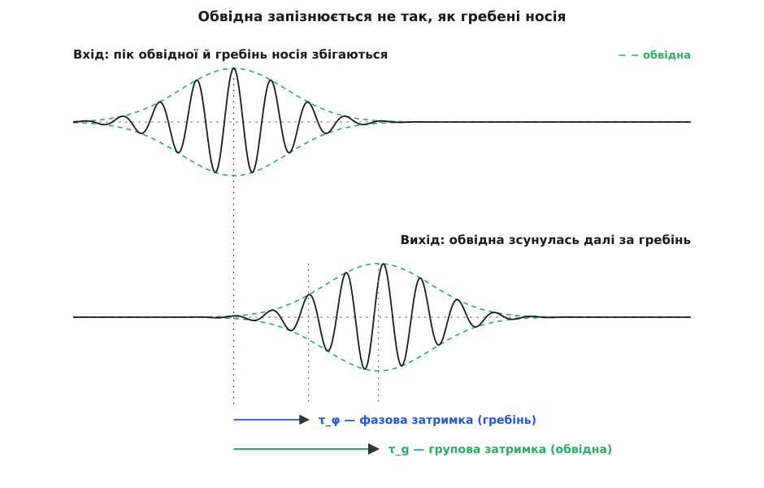
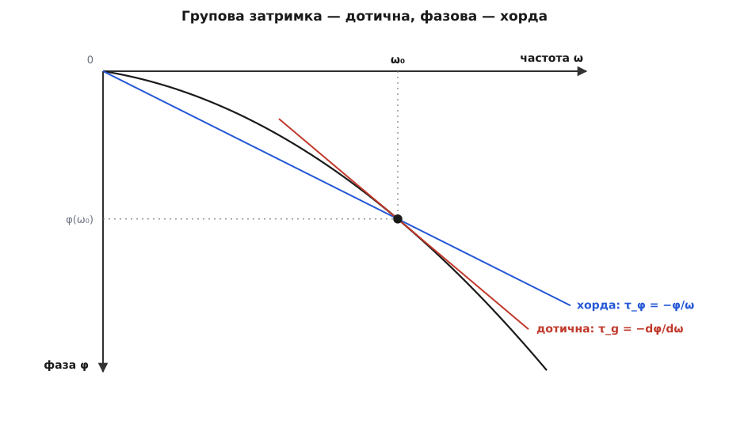
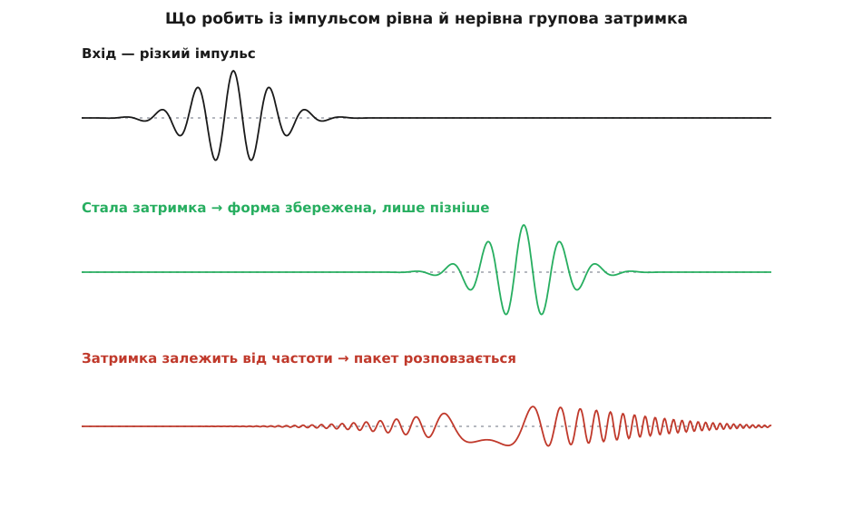

# Групова затримка

<preknowlist>
- [Синусоїда](topic:ph-waves/sine-wave) — гармонічна хвиля з єдиною частотою; складний сигнал — сума таких синусоїд.
- [Фаза](topic:ph-waves/phase) — на скільки хвиля зсунута в часі; система, крізь яку йде сигнал, додає кожній частоті свій фазовий зсув φ.
- [Биття](topic:ph-waves/beats) — дві близькі частоти складаються в повільну обвідну на швидкому носії.
- [Похідна](topic:math-analysis/derivative) — миттєва швидкість зміни, нахил дотичної до кривої.
</preknowlist>

Чиста синусоїда нікуди не «прибуває». Вона нескінченна й однакова в кожну мить: зсунь її в часі — і вона виглядає так само. Питання «коли ця хвиля дійшла?» не має відповіді, бо на ній немає жодної позначки, за якою можна впіймати мить приходу.

Але сигнал, що несе інформацію, позначку має завжди — сплеск, імпульс, наростання гучності. Радіо передає не голий носій сталої амплітуди, а його **обвідну** (те, що огортає носій, — повільну зміну амплітуди). Саме обвідна й прибуває: у неї є пік, який можна засікти секундоміром. Групова затримка відповідає рівно на це запитання — на скільки обвідна запізнюється, вийшовши з системи (фільтра, кабелю, шматка середовища) відносно того, коли вона в неї ввійшла.

## Звідки береться затримка обвідної

Найпростішу обвідну дають дві близькі частоти. Їхня сума — це [биття](topic:ph-waves/beats): повільне пульсування гучності поверх швидкого носія.

```
cos(ω₁·t) + cos(ω₂·t) = 2·cos(Δω·t)·cos(ω₀·t)
```

Тут ω₀ = (ω₁+ω₂)/2 — частота носія, а Δω = (ω₂−ω₁)/2 — набагато повільніша частота обвідної `cos(Δω·t)`.

Тепер пропустимо цей сигнал крізь систему. Усе, що вона робить із чистою синусоїдою, — додає їй [фазовий зсув](topic:ph-waves/phase), причому свій для кожної частоти: назвемо його φ(ω). Складова на ω₁ дістане зсув φ₁ = φ(ω₁), складова на ω₂ — зсув φ₂ = φ(ω₂). На виході додаємо ті самі дві косинусоїди, тільки зі зсунутими фазами, і згортаємо їх назад у «носій × обвідна»:

```
вихід = cos(ω₁·t + φ₁) + cos(ω₂·t + φ₂)
      = 2·cos(Δω·t + (φ₂−φ₁)/2) · cos(ω₀·t + (φ₁+φ₂)/2)
```

Придивімося до кожного множника окремо. Обвідна тепер `cos(Δω·t + (φ₂−φ₁)/2)` — це та сама обвідна, тільки посунута в часі; носій `cos(ω₀·t + (φ₁+φ₂)/2)` — теж посунутий, але на **інший** зсув. Винесемо ці зсуви як затримки в часі:

```
обвідна:  cos( Δω·(t − τ_g) ),   τ_g = −(φ₂−φ₁)/(2·Δω)  ──→  −dφ/dω
носій:    cos( ω₀·(t − τ_φ) ),   τ_φ = −(φ₁+φ₂)/(2·ω₀)  ──→  −φ/ω
```

Коли частоти зближуються (Δω → 0), різниця фаз, поділена на різницю частот, стає похідною, а півсума фаз — просто самою фазою. Так з'являються дві різні затримки:

- **групова затримка** `τ_g = −dφ/dω` — на скільки запізнюється обвідна, а разом із нею й уся інформація, яку вона несе;
- **фазова затримка** `τ_φ = −φ/ω` — на скільки запізнюються самі гребені носія.



*Гребені носія й обвідна виходять із системи не разом: обвідна запізнюється на τ_g, окремий гребінь — на τ_φ.*

Ось головне, заради чого все й розрізняють: «коли дійшов сигнал» — це **групова** затримка, бо інформацію несе обвідна, а не окремий гребінь. І визначає її не сама фаза φ, а те, **як швидко φ міняється з частотою** — нахил dφ/dω.

## Дві затримки — як нахили на графіку фази

Різницю між ними видно на самому графіку фазової характеристики φ(ω).



*Групова затримка — нахил дотичної, фазова — нахил хорди з нуля. Збігаються вони лише коли φ(ω) — пряма крізь початок координат.*

Фазова затримка `−φ/ω` — це нахил **хорди** з початку координат у точку кривої. Групова `−dφ/dω` — нахил **дотичної** в цій точці. Дві затримки збігаються лише в одному випадку: коли φ(ω) — пряма лінія крізь нуль. Тоді хорда й дотична — та сама пряма, і всі частоти затримуються однаково.

## Чому це важливо: рівна затримка проти спотворення

Реальний сигнал — не два тони, а цілий спектр частот. Кожна складова обвідної затримується на свою `τ_g(ω)`. Далі все залежить від того, однакова ця затримка для всіх частот чи ні.

Якщо `τ_g` **однакова** в усій смузі — усі складові зсуваються в часі на той самий проміжок, і сигнал виходить незмінним, лише пізніше. Це стан «лінійної фази»: φ пропорційна ω, тому `−dφ/dω` стала. Якщо ж `τ_g` **залежить від частоти** — різні частини сигналу приходять у різні моменти, імпульс розтягується і його форма розповзається. Це і є дисперсія (лат. *dispersio* — розсіювання): [середовище, у якому групова швидкість залежить від частоти](topic:ph-electromagnetism/phase-group-velocity), розмиває пакет.



*Стала групова затримка зберігає форму імпульсу; затримка, що залежить від частоти, розмиває його.*

> 🔧 **Навіщо це.** У цифровому зв'язку й у звуці рівна групова затримка в усій смузі — вимога, а не примха. Якщо різні частоти імпульсу затримуються по-різному, різкий символ розповзається в часі й налазить на сусідні (міжсимвольна інтерференція), а музичний удар втрачає чіткість атаки. Тому фільтри навмисне проєктують на лінійну фазу, а канали вирівнюють еквалайзером саме за груповою затримкою, не лише за амплітудою. На практиці її [беруть із виміряної фазової характеристики чисельно](topic:ph-waves/group-delay/proj-group-delay-numeric.md) — і головна пастка тут не в самій похідній.

## Затримка при поширенні: групова швидкість

Коли «система» — це просто відстань L у середовищі, фаза набігає з пройденим шляхом: хвиля з числом k(ω) на виході має φ(ω) = −k(ω)·L. Підставмо це в обидві затримки:

```
τ_g = −dφ/dω = L·dk/dω = L / v_g     (v_g = dω/dk — групова швидкість)
τ_φ = −φ/ω   = k·L/ω   = L / v_p     (v_p = ω/k  — фазова швидкість)
```

Групова затримка виявляється просто **відстанню, поділеною на групову швидкість** — швидкість, з якою рухається пакет як ціле. І там, де фазова та [групова швидкості](topic:ph-electromagnetism/phase-group-velocity) різні, дві затримки розходяться найнаочніше.

**Кинутий у воду камінь.** Брижі на глибокій воді — саме такий випадок: їхня частота й хвильове число пов'язані як ω = √(g·k), тож група відстає від власних гребенів.

```
k   = 2π/λ = 2π/2            = 3.14 рад/м
ω   = √(g·k) = √(9.81·3.14)  = 5.55 рад/с
v_p = ω/k = 5.55/3.14        = 1.77 м/с      (гребінь)
v_g = ½·√(g/k) = ½·v_p       = 0.88 м/с      (група)
τ_φ = L/v_p = 10/1.77        = 5.7 с         (гребінь до точки за 10 м)
τ_g = L/v_g = 10/0.88        = 11.3 с        (група — сам сигнал)
```

Група брижів дістається точки за 10 метрів удвічі повільніше за окремий гребінь. Тому в колі хвиль від каменя гребені народжуються позаду групи, пробігають крізь неї вперед і гаснуть на її передньому краї — видима на власні очі різниця між фазовою й груповою затримкою. Те, що [власна швидкість групи взагалі відрізняється від швидкості гребенів](topic:ph-waves/group-delay/hist-group-velocity.md), помітили лише у XIX столітті, і саме брижі на воді були першою підказкою.
