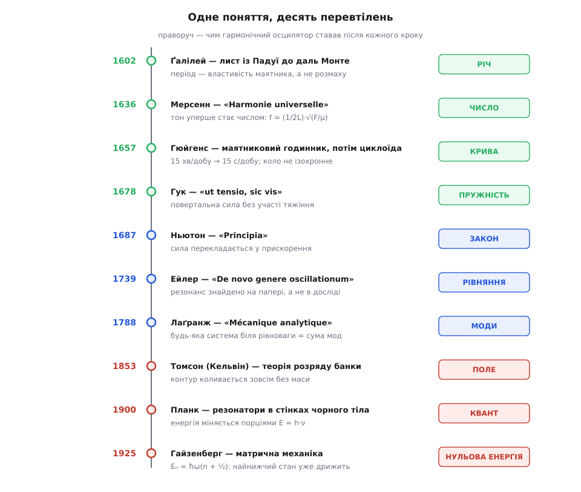
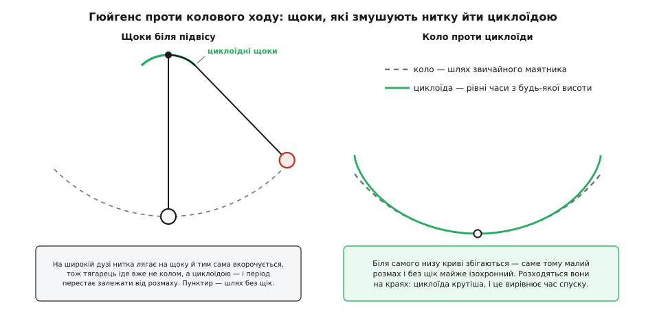

# 📜 Як гойдання стало формулою

Історія гармонічного осцилятора — це історія того, як конкретна річ, що хитається на нитці, поступово перетворилася на форму, у якій фізика бачить геть усе: годинник, струну, контур, атом. Нижче — хто й коли робив кожен крок; і виявиться, що майже кожен важливий крок виріс не з правильної відповіді, а з помилки в попередній.


*За три з половиною століття змінювалася не так відповідь, як саме питання. Спершу осцилятор був річчю (маятник), тоді числом (частота струни), тоді кривою (циклоїда), тоді пружністю, законом, рівнянням, набором мод, полем без жодної маси, порцією енергії — і врешті тим, що не вміє завмерти.*

### Лампа, якої, найпевніше, не було

Найвідоміша сцена цієї історії, найімовірніше, ніколи не відбувалася. За переказом, юний Ґалілео Ґалілей близько 1582 року стояв у Пізанському соборі, дивився на лампу, що хиталася на довгому ланцюгу, і рахував її гойдання власним пульсом — і зауважив, що коли розмах спадає, кількість ударів пульсу на одне гойдання лишається та сама. Джерело цієї сцени одне: життєпис Ґалілея, який склав 1654 року його учень Вінченцо Вівіані — людина, що народилася 1622-го, тобто через сорок років після описаної події, — і який надрукували аж 1717-го. Довідники подають цю сцену саме як легенду й додають, що лампа, яка нині висить у наві собору, — не та й навіть не схожа на первісну. Тож статус твердження чіткий: **гарна легенда, а не документований факт**.

Документоване ж інше — і воно важливіше. Найраніший збережений звіт Ґалілея про його досліди з маятником — це лист із Падуї до Ґвідобальдо даль Монте від **29 листопада 1602 року**. У ньому вже сказано те, заради чого вся сцена з лампою взагалі варта уваги: **період гойдання — властивість самого маятника, а не того, як сильно його штовхнули**. Довша нитка гойдається повільніше, коротша швидше; важчий тягарець чи легший — байдуже; широка дуга чи вузька — теж байдуже.

Придивіться, наскільки це дивна заява. Усе, що ми звикли бачити, поводиться протилежно: сильніше кинув — далі полетіло, довше летіло. А маятник наче має власний, незалежний від нас ритм, який ми можемо тільки запустити, але не змінити. Саме ця незалежність, **ізохронність**, і робить гойдання придатним для вимірювання часу: якщо всі гойдання рівні між собою, то досить їх лічити. А доба, у якій жив Ґалілей, надійного способу відміряти короткі проміжки не мала зовсім — і в дослідах, і в ремеслі час доводилося оцінювати на око.

І тут перша з тих помилок, що рухали історію: **Ґалілей був неправий**. Період колового маятника залежить від розмаху — просто слабко. 1641 року, вже сліпий, він продиктував синові Вінченцо будову механізму, який підтримував би гойдання маятника; це вважають першим проєктом маятникового годинника. Вінченцо взявся будувати, але не встиг — помер 1649-го. Отже, робочий годинник із маятником зробить інший — і зробить його саме той, хто першим зауважить, що заява Ґалілея хибна.

> 🔧 **Навіщо це.** Тут закладено спосіб думати, який відтоді працює всюди. Ґалілей не питав «яка траєкторія лампи» — він питав, **що в русі не змінюється**, коли змінюється все інше. Стала величина, схована під мінливою картиною, — це і є те, на чому можна побудувати вимірювання: не описувати рух, а взяти з нього одну сталу й лічити її повтори.

### Годинник, який мусив виправити Ґалілея

Голландець Кристіан Гюйгенс побудував перший маятниковий годинник у грудні 1656 року й дістав на нього патент 1657-го. Виграш був не поступовий, а разючий: найкращі механічні годинники до того збивалися приблизно **на 15 хвилин за добу**, маятниковий — **на 15 секунд**. Одним пристроєм точність часу зросла в шістдесят разів — і маятниковий годинник лишався найточнішим вимірювачем часу майже триста років, аж до 1930-х.

Але, ставлячи маятник у механізм, Гюйгенс зіткнувся з тим, чого Ґалілей не помітив: коли завод слабне й розмах спадає, годинник починає **поспішати**. Отже, широка дуга проходиться довше — коло не ізохронне. Ось як виглядає ця похибка кількісно (θ₀ — половина розмаху, у радіанах):

```
T  = 2π·√(L/g)                      ← ідеал: період не залежить від розмаху
T(θ₀) ≈ 2π·√(L/g)·(1 + θ₀²/16)      ← справжній коловий маятник, малий розмах
```

**Приклад (чого коштує широкий розмах).** Скільки годинник виграє за добу, якщо звузити розмах із 5° до 2°?

```
θ₀ = 5° = 5·π/180  = 0.0873 рад
θ₀²/16 = 0.007615/16 = 4.76·10⁻⁴  → 4.76·10⁻⁴ · 86400 с ≈ 41 с/добу відставання

θ₀ = 2° = 2·π/180  = 0.0349 рад
θ₀²/16 = 0.001218/16 = 7.61·10⁻⁵  → 7.61·10⁻⁵ · 86400 с ≈ 6.6 с/добу

виграш ≈ 41 − 6.6 ≈ 34 с/добу — і жодної деталі не змінено
```

Гюйгенс, однак, пішов не цим шляхом, а куди сміливішим. Замість того щоб рятувати ізохронність підгонкою, він **перевернув задачу**: якщо коло не дає рівних часів, то яка крива дає? Відповідь він знайшов 1659 року, а строгий доказ надрукував у «Horologium Oscillatorium» (1673): шукана крива — **циклоїда**, слід точки на ободі колеса, що котиться. По циклоїді тіло скочується до низу за той самий час із будь-якої висоти. Щоб змусити тягарець іти саме циклоїдою, Гюйгенс поставив біля точки підвісу дві фігурні «щоки», об які нитка обгортається на широкому розмаху й тим сама вкорочується.

І тут — друга повчальна помилка. **На практиці щоки виявилися гіршими за хворобу, яку лікували**: тертя нитки об них і неточність самої форми вносили більше похибки, ніж той коловий хід, який вони мали прибрати. Годинникарі щоки покинули, а справжнім розв'язком стало інше — **тримати розмах малим**, у кілька градусів, де відхилення від ізохронності просто не встигає накопичитися. Тобто нелінійність не виправили, а **обійшли, лишившись у тій зоні, де система лінійна**. Це і є перша поява ідеї «малих коливань» — не як математичного припущення, а як інженерного рішення, за яке платять зменшеним розмахом.

У тому ж «Horologium Oscillatorium» Гюйгенс зробив ще дві речі, без яких формула періоду лишалася б грою. Він розібрався з **фізичним маятником** — будь-яким твердим тілом, що гойдається на осі, — і показав, як звести його до рівноцінного [точкового маятника](topic:ph-waves/pendulum), тобто до тягарця на невагомій нитці, чий період визначають самі лише довжина та g: знайшов «центр гойдання». Відтоді хитний важіль, дзвін чи стрілка приладу описуються тією самою однією формулою, треба лише правильно порахувати їхню зведену довжину. І він 1659 року отримав із маятника числове значення прискорення [вільного падіння](topic:ph-mechanics/free-fall) — тієї сталої g, з якою тіло розганяється до Землі. Маятник із цієї миті став не лише годинником, а й вимірювальним приладом: за періодом гойдання можна дізнатися про планету під ногами.


*Ліворуч — пристрій: біля точки підвісу стоять дві щоки циклоїдної форми, і на широкому розмаху нитка лягає на них, тим сама вкорочуючись; пунктир — дуга, якою тягарець ішов би без щік. Праворуч — чому саме циклоїда: біля самого низу вона майже збігається з колом (тому й малий розмах майже ізохронний і без усяких щік), а на краях іде крутіше — і цим вирівнює час спуску з будь-якої висоти.*

### Пружина, яка звільнила осцилятор від планети

Поки Гюйгенс шліфував маятник, англієць Роберт Гук працював над іншим джерелом повертальної сили — **пружністю самої речовини**. Залежність, яку він знайшов, — [закон Гука](topic:ph-mechanics/hookes-law): наскільки розтягнув, настільки й сила опору, F = −k·x. Історія її оприлюднення показова для звичаїв доби: Гук знав цю залежність із 1660 року, але 1676-го надрукував її як латинську **анаграму** — набір літер `ceiiinosssttuv`, — а розгадку відкрив лише 1678-го в «Lectures de potentia restitutiva»: **«Ut tensio, sic vis»**, «яке видовження, така й сила». Анаграма була способом застовпити першість, нічого при цьому не розкриваючи: якщо хтось оголосить те саме, ти прилюдно переставляєш літери й доводиш, що знав раніше.

Практичне значення пружини було в тому, що вона зробила осцилятор **переносним**. Маятникові потрібна планета під ним і потрібен спокій: нахиліть годинник, понесіть його, поставте на палубу — і хід зіпсується. Пружина ж носить своє «тяжіння» всередині металу й працює в будь-якому положенні. Коли спіральну пружинку припасували до балансирного колеса кишенькового годинника, точність підскочила з кількох **годин** за добу до приблизно **десяти хвилин**: кишеньковий годинник із дорогої цяцьки став приладом.

Кому належить це припасування — суперечка, яка пережила обох учасників. Гюйгенс сконструював спіральну балансирну пружину й запатентував годинник із нею 1675 року, надрукувавши опис у «Journal des Sçavans». Гук наполягав, що мав ідею щонайменше на п'ять років раніше, і на його користь свідчить запис у журналі Королівського товариства від 23 червня 1670 року про показ годинника з балансиром. Сьогоднішній зважений висновок такий: **ідея, найімовірніше, з'явилася спершу в Гука, а перший робочий годинник зробили за проєктом Гюйгенса** — механіком у нього був Ісаак II Тюре. Це класичний випадок, коли «придумав» і «зробив» — різні заслуги різних людей, і зливати їх в одну першість нечесно щодо обох.

Але найважливіше в пружині — не годинник. Маятник гойдає тяжіння, пружину — міжатомні зв'язки металу. Це різні світи, різні сили, різні причини. А математика в них **буква в букву одна**. Уперше стало видно, що гойдання не належить жодній конкретній фізиці: воно належить формі залежності сили від відхилення.

### Струна, яка дала цьому слово

Слово «гармонічний» прийшло в механіку з музики — і прийшло через цілком конкретну роботу. Французький монах Марен Мерсенн у «Harmonie universelle» (1636) сформулював те, що тепер звуть законами Мерсенна для натягнутої струни:

```
f = (1/(2·L))·√(F/μ)

L — довжина струни, F — сила натягу, μ — маса одиниці довжини
```

Частота обернено пропорційна довжині, росте як корінь із натягу й спадає як корінь із погонної маси. Там-таки Мерсенн уперше визначив частоту чутного тону **в абсолютних числах** — 84 гойдання за секунду — і показав, що тон і його октава відносяться як 1:2.

Оцініть зсув: до Мерсенна «високий» і «низький» звук були якостями, як «яскравий» чи «теплий». Після нього тон — це **число**, лічба гойдань за секунду. А з того, що струна звучить не однією частотою, а основною разом із кратними їй обертонами — **гармоніками**, — і виросло значення прикметника: гармонічним назвали рух, який дає **рівно один** чистий тон, без домішки обертонів. Тобто назва «гармонічний осцилятор» — це не поетичне порівняння, а акустичний технічний термін: коливання, чий [спектр](topic:ph-waves/frequency-spectrum) складається з однієї-єдиної лінії. Той самий нахил усе переводити в числа привів Мерсенна й до маятника: 1644 року в «Cogitata Physico-Mathematica» він уперше виміряв довжину секундного маятника — того, чий півперіод дорівнює рівно секунді.

### Від фігури до рівняння

До кінця XVII століття осцилятор існував як **річ і крива**: маятник, пружина, циклоїда, геометричне креслення. «Principia» Ісаака Ньютона (липень 1687) дала мову, якою річ можна було перекласти в рівняння, — [другий закон](topic:ph-mechanics/newtons-second-law), що зв'язує силу з прискоренням. Сам Ньютон писав ще геометрично, у стилі античних доведень. У другій книзі «Principia» він описав власні досліди про те, як опір повітря гасить гойдання маятника, — один із перших дослідних підступів до [загасання](topic:ph-waves/damped-oscillator), тобто до спадання розмаху через втрати.

Перетворення на рівняння зробили континентальні аналітики, і найгостріший крок належить Леонардові Ейлерові. Його праця «De novo genere oscillationum» («Про новий рід коливань», написана 1739 року, надрукована 1750-го) — **перший аналіз осцилятора, який розгойдують зовнішньою періодичною силою**. Саме там з математики виринув [резонанс](topic:ph-waves/resonance): якщо частота поштовхів збігається з власною частотою системи, амплітуда росте необмежено, доки її не спинять втрати. Це варто усвідомити окремо: резонанс **знайшли на папері**, розв'язуючи рівняння, а не спостерігаючи в досліді. Рівняння виявилося розумнішим за свого автора — властивість, яка потім повторюватиметься в фізиці регулярно.

Другий Ейлерів крок був ще тихішим і ще важливішим. У «Introductio in analysin infinitorum» (1748) він записав

```
e^(i·φ) = cos φ + i·sin φ
```

— і синус із косинусом стали тим самим об'єктом, що й показникова функція. Відтоді коливання пишуть не як пару тригонометричних функцій, а як один комплексний показник, і на цьому тримається все пізніше знаряддя: комплексні опори в колах, спектри, передавальні функції.

Далі поняття треба було відірвати від однієї маси на одній пружині. Аналітичний апарат, який Жозеф-Луї Лаґранж (народжений у Турині як Джузеппе Луїджі Лаґранджа, згодом натуралізований француз) зібрав у «Mécanique analytique» (1788), дав спосіб описувати систему з багатьма частинами однією процедурою. Механізм, будівля, молекула, натягнута струна — біля рівноваги кожна така система розпадається на **набір незалежних гармонічних осциляторів**, кожен зі своєю частотою: власні моди. Складне коливання перестало бути складним — воно стало сумою простих. Саме звідси ростуть [зв'язані осцилятори](topic:ph-waves/coupled-oscillators) і вся техніка модального аналізу.

### Осцилятор без жодної рухомої деталі

XIX століття принесло найдивнішу перевірку загальності. Перший натяк був геть непрямий: 1826 року Фелікс Саварі розряджав лейденську банку через дріт, намотаний на сталеву голку, і виявив, що голка намагнічувалася то в один бік, то в протилежний. Пояснення могло бути тільки одне — **струм при розряді не тік в один бік, а перекидався туди-сюди**, і те, який півперіод застав голку останнім, вирішувало напрям намагніченості. 1842 року Джозеф Генрі незалежно дійшов того самого висновку.

Теорію дав Вільям Томсон (згодом лорд Кельвін) 1853 року: розряд ємності через індуктивність **мусить** бути коливальним, і частота цього коливання виводиться з рівнянь:

```
ω = √(1/(L·C))
T = 2π·√(L·C)        ← формула Томсона
```

1857 року Беренд Вільгельм Феддерсен сфотографував іскру розряду в обертовому дзеркалі й побачив коливання на власні очі. Максвелл 1868-го порахував відгук такого кола на змінний струм, а Герц 1887-го надрукував першу криву електричного резонансу.

Зверніть увагу, що тут відбулося з поняттям. У [коливальному контурі](topic:ph-waves/lc-circuit) **нічого не рухається** — жодної маси, жодної пружини, жодної механічної деталі. Роль інерції грає магнітне поле котушки, яке не дає струмові миттєво урватися; роль пружності — конденсатор, який тим дужче опирається, чим більший заряд у нього вже загнали. Порівняйте два записи:

```
ω = √(k/m)          маса на пружині: жорсткість / інерція
ω = √((1/C)/L)      контур: «жорсткість» 1/C / «інерція» L
```

Це та сама формула, лише інші імена в чисельнику й знаменнику. Із цієї миті гармонічний осцилятор остаточно перестав бути механічним пристроєм і став **зразком**, під який підганяють будь-яку систему з інерцією та поверненням.

### Осцилятор, який не може завмерти

І останній поворот: осцилятор виявився тими дверима, крізь які у фізику ввійшла квантова теорія.

Макс Планк бився над спектром випромінювання розжареної порожнини. Речовину стінок він змоделював як набір заряджених **резонаторів** — тих самих гармонічних осциляторів, — які обмінюються енергією з випромінюванням. 19 жовтня 1900 року він подав Німецькому фізичному товариству формулу, підігнану під дані; 14 грудня того ж року — виведення, у якому мусив припустити, що резонатор міняє енергію не плавно, а порціями, пропорційними його частоті:

```
E = h·ν
```

Сам Планк спершу вважав це радше математичною хитрістю, ніж твердженням про світ. Але звернімо увагу на місце події: квантування ввійшло у фізику не через атом і не через світло, а **через гармонічний осцилятор** — саме тому, що це була єдина система, яку вміли розв'язати до кінця.

1907 року Альберт Айнштайн зробив наступний крок і застосував ту саму ідею до твердого тіла: кристал — це ґратка атомів, кожен з яких дрижить біля свого місця, тобто набір квантових осциляторів. Це пояснило те, що класична фізика пояснити не могла: чому теплоємність твердих тіл падає до нуля при наближенні до абсолютного нуля, а закон Дюлонґа — Пті перестає працювати. 1912 року Петер Дебай уточнив модель, замінивши єдину частоту цілим спектром частот ґратки, і дістав правильний хід ~T³ — так народилася теорія [фононів](topic:ph-condensed/phonon).

Найдивніше з'ясувалося наостанок. 1911 року Планк у своїй «другій теорії» отримав у розрахунках залишковий доданок hν/2 — енергію, яка лишається в осцилятора навіть тоді, коли забрати все, що можна. Ідею зустріли недовірливо: Айнштайн зі Стерном 1913-го спробували довести її з теплоємності водню, а невдовзі відмовилися від власного доводу — Айнштайн у листі до Еренфеста назвав нульову енергію «мертвою, як цвях». Пряме свідчення прийшло 1924 року від Роберта Малікена: він порівняв смугасті спектри двох ізотопних молекул монооксиду бору, ¹⁰BO та ¹¹BO. Якби нульової енергії не існувало, ізотопний зсув між основними коливними станами мав би зникнути. Він не зник. А 1925 року нульова енергія перестала бути припущенням і стала висновком: матрична механіка Гайзенберга виводить її з самої будови теорії.

```
Eₙ = ħ·ω·(n + ½),   n = 0, 1, 2, …
E₀ = ½·ħ·ω          ← найнижча сходинка лежить ВИЩЕ за дно ями
```

Різниця між класичним і квантовим осцилятором тут зведена до одного доданка ½: класичний може стояти в рівновазі нерухомо (A = 0), квантовий — не може ніколи. Найнижчий його стан уже дрижить, і забрати це дрижання не можна ні охолодженням, ні чим іншим — [квантовий осцилятор](topic:ph-quantum/quantum-harmonic-oscillator) із нульовою амплітудою мав би одночасно точне положення й точний імпульс, чого природа не дозволяє.

Далі поняття розійшлося скрізь, і розійшлося з тієї самої причини, з якої взагалі виникло: **дно будь-якої гладкої ями параболічне**. Коливання молекул, дрижання ґратки, кожна мода електромагнітного поля — усе це в першому наближенні гармонічні осцилятори, і всі вони мають свою нульову енергію. Саме тому вакуум у квантовій теорії поля не порожній: він заповнений нульовими коливаннями мод.

А сама історія повернулася туди, звідки почалася, — до лічби гойдань. Тільки осцилятор став іншим: у 1930-х маятник у годиннику заступив [кварцовий резонатор](topic:hw-components/quartz-resonator), пластинка, що дрижить на власній частоті, а потім і його змінив [атомний стандарт](topic:hw-sensing/atomic-clock) — секунду сьогодні визначено як 9 192 631 770 періодів випромінювання певного переходу в атомі цезію-133. Лічильник той самий, що в Ґалілея; змінився тільки осцилятор під ним.
