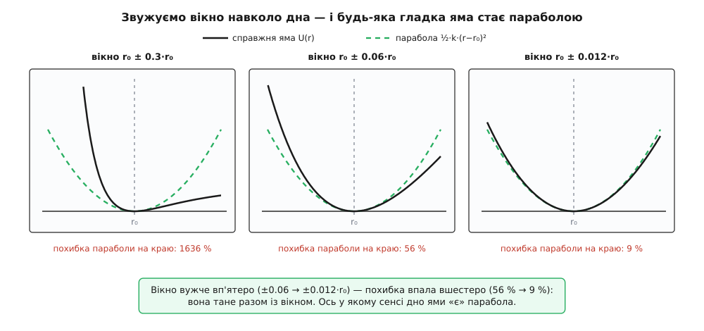
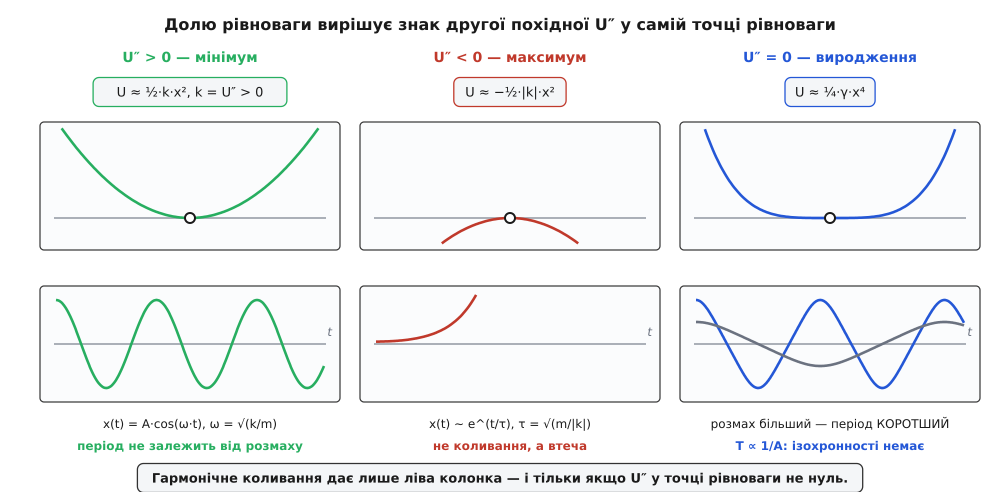
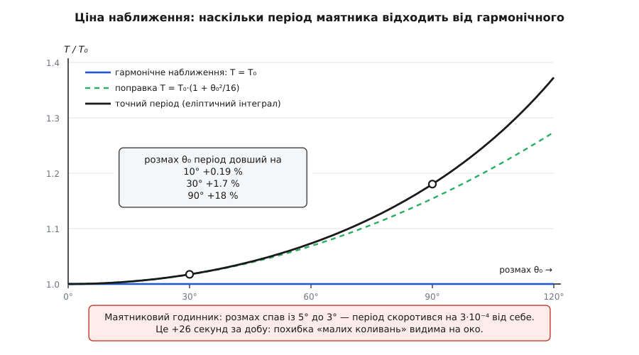

# 🧮 Чому дно ями неминуче параболічне і що таке k

Слова «біля будь-якої рівноваги все коливається гармонічно» звучать як зручне припущення, але це теорема — з умовами, доведенням і точно порахованою ціною за нехтування. Доведімо її: побачимо, чому квадратичний доданок потенціальної енергії біля рівноваги неминуче лишається головним, дістанемо звідти рівність k = U″(x₀) — жорсткість виявиться кривиною дна ями, — а тоді порахуємо, наскільки «малим» мусить бути відхилення, щоб відкинуте не вилізло назовні.

## Що саме треба довести

Усе тримається на тому, що консервативну силу можна вичитати з однієї функції — [потенціальної енергії](topic:ph-mechanics/potential-energy) U(x). Сила дорівнює мінус похідній цієї функції за координатою, F(x) = −dU/dx; це не означення, а наслідок того, що робота сили дорівнює спаду U (докладно — у [вставці про силу з потенціалу](topic:ph-mechanics/potential-energy/math-force-from-potential.md)). Геометрично сила — це крутість схилу з протилежним знаком: вона штовхає туди, куди схил спадає.

Звідси рівновага дістає точний запис: це точка x₀, у якій схил горизонтальний.

```
F(x₀) = 0     ⇔     U′(x₀) = 0
```

Позначмо відхилення від неї ξ = x − x₀ (грецька «ксі»; окрема буква потрібна, щоб не плутати відхилення з самою координатою). Довести треба ось що: **існує число k, задане самою лише формою ями в точці x₀, таке, що для малих ξ сила дорівнює −k·ξ, а відносну похибку цієї рівності можна зробити як завгодно малою, звузивши ξ.** Це не «припустімо, що сила лінійна» — це висновок; і в нього є доведення, є умови, за яких воно чинне, і є ціна, яку можна порахувати в числах.

## Розклад біля дна: один доданок гине, другий нічого не важить

Інструмент — [ряд Тейлора](topic:math-analysis/taylor-series): гладку функцію біля точки подають многочленом, коефіцієнти якого — її похідні в цій точці, а весь недобір згортають у залишковий член. Випишімо його для U біля x₀, обірвавши на квадраті, із залишком у формі Лаґранжа:

```
U(x₀ + ξ) = U(x₀) + U′(x₀)·ξ + ½·U″(x₀)·ξ² + ⅙·U‴(c)·ξ³
                                               c — якась точка між x₀ і x₀+ξ
```

Тепер погляньмо на доданки поодинці — і два перших зникнуть самі.

**Перший, U(x₀), — стала.** Потенціальна енергія визначена з точністю до довільної сталої: сила є її похідна, а похідна сталої нуль. Тому дно ями можна оголосити нулем енергії, і жодне рівняння руху від цього не здригнеться.

**Другий, U′(x₀)·ξ, — тотожний нуль.** Не малий, не «такий, що ним нехтують» — точний нуль, бо саме умовою U′(x₀) = 0 ми й вибрали точку x₀. Ось де ховається головна пружина доведення: лінійний доданок гине не від наближення, а від означення рівноваги. Якби перша похідна не була нулем, тіло, полишене в цій точці, зрушило б з місця — і це вже була б не рівновага.

**Третій, ½·U″(x₀)·ξ², — перший, що вижив.** Він і є та сама парабола, а його коефіцієнт — та сама шукана жорсткість:

```
k ≡ U″(x₀)          ⇒          U(x₀ + ξ) ≈ ½·k·ξ²
```

Лишився залишковий член ⅙·U‴(c)·ξ³, і саме він вирішує, чи має парабола право зватися «дном». Порівняймо відкинуте з лишеним. Нехай на околі |ξ| ≤ δ третя похідна обмежена зверху: |U‴| ≤ M. Тоді

```
|відкинуте|   ⅙·M·|ξ|³       M
─────────── ≤ ─────────  =  ───·|ξ|
|лишене|      ½·k·ξ²         3·k
```

Права частина пропорційна |ξ| — і тане разом із ним. Ось точний зміст слів «дно виглядає параболою»: різниця між справжньою ямою й параболою не просто мала — вона спадає **пропорційно ширині вікна**, у яке ми дивимося. Звузили вікно вдесятеро — відносна розбіжність упала теж приблизно вдесятеро. Жодна яма не годна цьому опиратися, доки в неї є друга похідна.

Та сама викладка для сили, бо рухом править вона:

```
F(x₀ + ξ) = −U′(x₀ + ξ) = −U″(x₀)·ξ − ½·U‴(c′)·ξ²  =  −k·ξ·(1 + похибка ~ |ξ|)
```

Це [закон Гука](topic:ph-mechanics/hookes-law) — з тією різницею, що тут він не властивість пружини, а властивість будь-якого гладкого мінімуму: сталь, повітряна подушка, магнітне підвішування чи хмара електронів дадуть ту саму лінійну силу, бо всі вони мають дно.

Є й друга, наочніша мова для того самого. Погляньмо на яму «в лупу», щоразу підбираючи збільшення так, щоб вікно на екрані лишалося того самого розміру. Формально це означає підставити ξ = λ·s і поділити енергію на λ² (бо вертикаль у параболічній ямі стискається як квадрат горизонталі):

```
U(x₀ + λ·s) − U(x₀)
─────────────────── = ½·k·s² + ⅙·U‴·λ·s³ + …
        λ²
```

При λ → 0 кожен доданок, крім першого, несе зайвий множник λ і зникає. У збільшених координатах форма дна **збігається до параболи** — не «схожа на неї», а має її своєю границею. Тому ями, що біля дна виглядала б інакше, просто не буває: інша форма вимагала б або ненульового лінійного коефіцієнта (тоді це не рівновага), або нескінченної другої похідної (тоді це не гладка функція).


*Одна й та сама міжатомна яма Леннард-Джонса у трьох вікнах різної ширини; пунктиром — парабола ½·k·(r−r₀)² з тим самим k = U″(r₀). У широкому вікні спільного мало: ліворуч справжня стінка йде вертикально вгору, праворуч — вивертається до нуля. Вужче вікно — менша похибка, і спадає вона разом із вікном.*

## k — це кривина дна

Отже, друга відповідь: **k = U″(x₀)**, друга похідна потенціальної енергії в точці рівноваги, тобто кривина дна ями. Перевірмо одиниці: [U] = Дж = Н·м, двічі поділити на метр — лишиться Н/м, рівно те, чого чекають від жорсткості. Ніякого знання про пружини в цьому числі немає: воно каже одне — як швидко загинається дно.

З цим числом власна частота ω = √(k/m) перестає бути формулою «для пружин» і стає рецептом для будь-чого. Але з масою в знаменнику треба та сама обачність, що й з жорсткістю: це не обов'язково маса на вазі. Якщо система описується однією узагальненою координатою q, то в неї є своя інерція M — множник у кінетичній енергії, ½·M·q̇², — і рівняння руху дає

```
ω² = U″(q₀) / M
```

Оце і є точний зміст слів «ω = √(жорсткість/інерція)»: жорсткість читається з другої похідної енергії, інерція — з кінетичної енергії, обидві в тих одиницях, які нав'язала вибрана координата.

**Приклад (маятник).** Для [маятника](topic:ph-waves/pendulum) — вантажу m на невагомому стрижні довжини L — природна координата не відстань, а кут θ. Обидві енергії відомі:

```
U(θ)   = m·g·L·(1 − cos θ)       ← висота підйому вантажу
Eкін   = ½·m·L²·θ̇²               ← швидкість точки на дузі v = L·θ̇
```

Рівновага: U′ = m·g·L·sin θ = 0 при θ = 0 ✓. Тоді жорсткість і інерція читаються прямо:

```
k    = U″(0) = m·g·L·cos 0 = m·g·L      ← «жорсткість» в одиницях Н·м на радіан
M    = m·L²                             ← момент інерції вантажу
ω²   = k/M = m·g·L / (m·L²) = g/L
```

Маса скоротилася — і саме тому період маятника від неї не залежить: важчий вантаж і тягне сильніше, і розганяється неохочіше, рівно в одну міру. Зверніть увагу й на одиниці k: для кутової координати це вже не Н/м, а Н·м на радіан. Одиниці жорсткості йдуть за координатою, і лише відношення k/M завжди виходить у 1/с².

**Приклад (пара атомів).** Тепер яма, у якій немає нічого пружинного. Два нейтральні атоми притягуються слабкими силами на відстані й різко відштовхуються зблизька; звичайна модель цього — потенціал Леннард-Джонса:

```
U(r) = 4·ε·[ (σ/r)¹² − (σ/r)⁶ ]        ε — глибина ями, σ — масштаб відстані
```

Ані пружин, ані закону Гука тут не видно — лише два степені, 12 і 6. Знайдімо рівновагу й кривину.

```
U′(r)  = 4·ε·(−12·σ¹²·r⁻¹³ + 6·σ⁶·r⁻⁷) = 0   ⇒   r₀⁶ = 2·σ⁶   ⇒   r₀ = 2^(1/6)·σ ≈ 1.1225·σ
U″(r)  = 4·ε·( 156·σ¹²·r⁻¹⁴ − 42·σ⁶·r⁻⁸)
         підставляємо r₀⁶ = 2σ⁶:  σ¹²·r₀⁻¹⁴ = 1/(4·r₀²),   σ⁶·r₀⁻⁸ = 1/(2·r₀²)
U″(r₀) = 4·ε·(156/4 − 42/2)/r₀² = 4·ε·18/r₀²
k      = 72·ε / r₀²
```

Вийшло напрочуд просто: жорсткість зв'язку — це сімдесят дві глибини ями на квадрат її ширини. Порахуймо для аргону (для нього беруть ε/k_B = 120 К і σ = 0.34 нм) та підставмо [зведену масу](topic:ph-mechanics/reduced-mass) пари однакових атомів μ = m/2 — бо в парі рухаються обидва, і в задачі про їхню відстань роль інерції грає саме μ:

```
ε   = 120 · 1.381·10⁻²³            = 1.657·10⁻²¹ Дж
r₀  = 1.1225 · 0.34 нм             = 0.382 нм
k   = 72 · 1.657·10⁻²¹ / (3.82·10⁻¹⁰)²  ≈ 0.82 Н/м     ← жорсткість «зв'язку»
μ   = 39.95 · 1.661·10⁻²⁷ / 2      = 3.32·10⁻²⁶ кг
ω   = √(k/μ) = √(0.82 / 3.32·10⁻²⁶)     ≈ 5.0·10¹² рад/с
f   = ω/(2π)                            ≈ 0.79 ТГц
```

Пружина завширшки в атом виявилася в сотні разів м'якшою за пружинку з кулькової ручки — а дрижить у терагерцовому діапазоні, бо в знаменнику стоїть маса одного атома. Жодного припущення про лінійність ми при цьому не робили: k просто випало з другої похідної.

> 🔧 **Навіщо це.** Рівність k = U″ перетворює пошук власної частоти на механічну процедуру: знайти мінімум енергії й узяти в ньому другу похідну. Саме так рахують коливання молекул і конструкцій — програма не шукає в системі пружин, вона мінімізує енергію й диференціює її двічі. Працює це й у зворотний бік: виміряна частота дає прямий доступ до кривини потенціалу, яку інакше не побачити, — з коливального спектра так дістають жорсткість хімічного зв'язку, а зі зсуву частоти кварцового резонатора — масу приліпленої до нього плівки завтовшки в кілька атомів.

## Умови теореми — не декорація

У доведенні знадобилося рівно дві умови: U має бути двічі диференційовна в x₀ і її друга похідна там не має бути нулем. Обидві роблять справжню роботу — варто прибрати будь-яку, і гармонічний осцилятор зникає. Що прикметно, розрізняє всі випадки одне-єдине число, ту саму U″ (у багатовимірному вигляді це звичайна класифікація [екстремумів](topic:math-analysis/extrema) за другою похідною).

**Якщо U″ < 0**, то x₀ — не дно, а вершина: горб, а не яма. Формально не змінюється нічого, k просто від'ємне, і рівняння руху дає ξ̈ = +(|k|/m)·ξ. Але розв'язок уже не хитається:

```
ξ(t) = C₁·e^(t/τ) + C₂·e^(−t/τ),        τ = √(m/|k|)
```

Один із двох показників додатний, тож будь-яке відхилення наростає — тіло тікає з вершини за характерний час τ. Формула ω = √(k/m) не зламалася, вона змінила жанр: під коренем від'ємне число, ω стає уявною, а косинус із уявним аргументом — це гіперболічний косинус, тобто експоненційна втеча. Рівновага на вершині існує, але втриматися в ній можна лише за нескінченно точних початкових умов.

**Якщо U″ = 0**, парабола вироджується й слово переходить до наступного доданка. Коли U‴ ≠ 0, точка рівноваги — це перегин: з одного боку сила справді повертає, з другого штовхає геть, і тіло йде. Коли ж і U‴ = 0 (яма симетрична), вирішує четвертий доданок, U ≈ ¼·γ·ξ⁴, а з ним сила F = −γ·ξ³. Повертальна сила є, коливання є — а ізохронності вже немає, і в цьому легко переконатися без жодного інтегрування. Нехай ξ(t) — розв'язок рівняння m·ξ̈ = −γ·ξ³. Візьмімо будь-яке λ > 0 і перевірмо функцію λ·ξ(λ·t):

```
d²/dt² [ λ·ξ(λ·t) ] = λ³·ξ̈(λ·t) = λ³·(−γ/m)·ξ(λ·t)³ = −(γ/m)·[ λ·ξ(λ·t) ]³
```

Вона задовольняє те саме рівняння — отже теж є рухом цієї системи. А розмах у неї в λ разів більший, час же стиснуто в λ разів. Звідси

```
T(λ·A) = T(A)/λ        ⇒        T ∝ 1/A
```

Розгойдали вдвічі ширше — період став удвічі коротшим. Ізохронність, задля якої осцилятор і потрапив у годинники, тримається не на «повертальній силі» взагалі, а рівно на квадратичній ямі: тільки за точної пропорційності сили відхиленню більший шлях і більша швидкість скорочуються без остачі.

**Якщо ями не можна двічі диференціювати**, розмова про U″ втрачає сенс із самого початку. Візьмімо кульку в гострій V-подібній долині: U = m·g·|x|, злам у самому дні, другої похідної там немає. Кулька просто вільно падає з висоти A і піднімається на протилежний бік, тож чверть періоду — це час вільного падіння:

```
T = 4·√(2·A/g)        ⇒        T ∝ √A
```

Тут більший розмах дає, навпаки, **довший** період. Дві крайності — яма четвертого степеня з T ∝ 1/A і зламана з T ∝ √A — тримають між собою єдиний випадок, де період не залежить від розмаху зовсім. Парабола стоїть точно посередині, і саме тому вона особлива.


*Угорі — форма ями біля рівноваги, унизу — що з тілом далі. U″ > 0: коливання зі сталим періодом. U″ < 0: не коливання, а експоненційна втеча з вершини за час τ = √(m/|k|). U″ = 0: коливання лишається, але період залежить від розмаху — більший розмах проходиться швидше. Розрізняє всі три випадки одне число.*

## Наскільки мале «мале»

Доведення гарантує, що похибка тане разом із відхиленням, але не каже, з якого місця вона стає непомітною. Перша, найгрубіша оцінка виходить прямо з порівняння доданків сили: квадратичний доданок ½·U‴·ξ² дорівнює лінійному U″·ξ, коли

```
|ξ| ≈ 2·U″ / |U‴|
```

Це характерна довжина ангармонізму (гр. *an-* — не, *harmonía* — суголосся) — відстань, на якій парабола як опис остаточно здається. Для ями Леннард-Джонса третя похідна в дні виходить U‴(r₀) = −1512·ε/r₀³, а k = 72·ε/r₀², тож ця довжина дорівнює всього 2·72/1512 ≈ 0.095 від r₀. Атоми мають право відходити від рівноваги ледве на кілька відсотків міжатомної відстані — далі яма перестає бути параболою.

Але груба оцінка сили ще не каже, що станеться з періодом: похибка сили міняє знак разом із ξ, і частина її за цикл могла б і зникнути. Порахуймо чесно. Візьмімо яму з двома наступними доданками й запишімо рівняння руху:

```
U(ξ) = ½·U″·ξ² + ⅙·U‴·ξ³ + ¹⁄₂₄·U⁗·ξ⁴

ξ̈ + ω₀²·ξ + α·ξ² + β·ξ³ = 0,     ω₀² = U″/m,   α = U‴/(2m),   β = U⁗/(6m)
```

Чому просте ξ = A·cos ω₀t тут уже не годиться, видно одразу: підставлений кубічний доданок дає ξ³ = A³·cos³ω₀t, а в cos³ сидить доданок з чистим cos ω₀t. Це сила, що коливається в такт із самим рухом, — вона розгойдує систему без упину, і розв'язок росте, чого в замкненій ямі бути не може. Вихід один: частота мусить трохи посунутися, щоб цей резонансний доданок було чим зрівноважити. Тому шукаймо розв'язок із **невідомою** частотою ω, дозволивши руху ще й зсунутися по центру та обзавестися другою гармонікою:

```
ξ(t) = a₀ + A·cos ω·t + a₂·cos 2ω·t,     a₀ та a₂ малі — порядку A²
```

Далі — механічна робота: підставити, розкласти добутки косинусів і вимагати, щоб кожна гармоніка балансувала окремо. Знадобляться три тотожності:

```
cos²x = ½ + ½·cos 2x        cos³x = ¾·cos x + ¼·cos 3x        cos x·cos 2x = ½·cos x + ½·cos 3x
```

Спершу яма лише з четвертим доданком (α = 0, β ≠ 0) — тут вистачає й самого A·cos ωt. Збираємо все при cos ω·t:

```
−ω²·A + ω₀²·A + ¾·β·A³ = 0        ⇒        ω² = ω₀² + ¾·β·A²
```

(зайвий cos 3ω·t, що народився з куба, породжує лише малу третю гармоніку й на частоту впливає аж у наступному порядку). Тепер яма з третім доданком (α ≠ 0, β = 0). Квадрат ξ² дає сталу й другу гармоніку, тому без a₀ та a₂ рівняння не замкнеться. Збираємо по гармоніках:

```
стала:      ω₀²·a₀ + α·A²/2 = 0                  ⇒   a₀ = −α·A²/(2·ω₀²)
cos 2ω·t:   −4ω²·a₂ + ω₀²·a₂ + α·A²/2 = 0        ⇒   a₂ = +α·A²/(6·ω₀²)
cos ω·t:    −ω²·A + ω₀²·A + α·(2·a₀ + a₂)·A = 0  ⇒   ω² = ω₀² + α·(2·a₀ + a₂)

підставляємо a₀ та a₂:   2·a₀ + a₂ = −(5/6)·α·A²/ω₀²   ⇒   ω² = ω₀² − (5/6)·α²·A²/ω₀²
```

Обидві поправки малі, тож їх можна просто скласти й узяти корінь із точністю до A². Повернувши α і β до похідних енергії, дістаємо остаточне:

```
ω(A) = ω₀ · [ 1 + (1/48)·( 3·U⁗/U″ − 5·(U‴/U″)² )·A² ]
```

Формула варта того, щоб її прочитати повільно. По-перше, поправка йде **як квадрат розмаху**, а не як сам розмах: подвоїли амплітуду — похибка вчетверо, а не вдвічі. Саме тому гармонічне наближення таке живуче — на малих розмахах воно ще й «економить» у квадраті. По-друге, доданок від асиметрії (з U‴) входить у квадраті й завжди зі знаком мінус: **несиметрична яма завжди знижує частоту**, хоч у який бік її перекосило. Причина видна з розв'язку: a₀ ≠ 0 — центр коливань зсувається з дна ями в бік пологішої стінки, а там жорсткість менша. Той самий зсув центру, що росте як A², — мікроскопічний корінь [теплового розширення](topic:ph-thermodynamics/thermal-expansion): нагріте тіло розгойдує атоми ширше, і їхні середні положення розповзаються.

**Перевірка на маятнику.** Формулу легко звірити з незалежним точним результатом. Для маятника U(θ) = m·g·L·(1 − cos θ), тож у дні U″ = m·g·L, U‴ = 0 (яма симетрична), U⁗ = −m·g·L. Підставляємо:

```
ω(θ₀) = ω₀·[1 + (1/48)·(3·(−1) − 0)·θ₀²] = ω₀·(1 − θ₀²/16)
T(θ₀) = 2π/ω ≈ T₀·(1 + θ₀²/16)
```

Точний період маятника елементарними функціями не виражається — він дається повним [еліптичним інтегралом](topic:math-analysis/elliptic-integral) першого роду, — але його розклад у ряд відомий: T = T₀·(1 + θ₀²/16 + 11·θ₀⁴/3072 + 173·θ₀⁶/737280 + …). Перший член збігається з нашим точно. Отже, викладка з балансом гармонік не помилилася.

Тепер числа, заради яких усе й робилося (θ₀ — у радіанах):

```
θ₀ = 10° = 0.1745 рад   →   T/T₀ = 1 + 0.00190     ← період довший на 0.19 %
θ₀ = 30° = 0.5236 рад   →   T/T₀ = 1 + 0.0174      ← на 1.7 %
θ₀ = 90° = 1.5708 рад   →   T/T₀ = 1.1803          ← на 18 % (точне значення)
```

Десять градусів розмаху коштують дві тисячні періоду, тридцять — уже майже два відсотки: квадратичний хід і робить наближення дешевим на малих кутах, і різко дорожчає на великих. І ось наочна ціна: маятниковий годинник із розмахом 5°, у якого від тертя розмах спав до 3°, змінює період на (0.0873² − 0.0524²)/16 = 3.0·10⁻⁴ від себе — за добу це 26 секунд. Похибка «малих коливань» цілком видима на око.


*Гармонічне наближення обіцяє горизонтальну пряму: період не залежить від розмаху. Поправка T₀·(1 + θ₀²/16) тримається біля точної кривої до великих кутів і відстає лише за 90°. Квадратичний хід поправки й робить наближення таким живучим на малих розмахах.*

Прикладімо ту саму формулу до ями Леннард-Джонса, де асиметрія куди різкіша. Її похідні в дні: U″ = 72·ε/r₀², U‴ = −1512·ε/r₀³, U⁗ = 26712·ε/r₀⁴. Тоді

```
3·U⁗/U″ = 3·371/r₀² = 1113/r₀²      5·(U‴/U″)² = 5·441/r₀² = 2205/r₀²
ω(A) = ω₀·[1 − 22.8·(A/r₀)²]
```

Розмах у якісь 5 % міжатомної відстані вже знижує частоту на 6 %. А розмах, за якого пара має половину глибини ями (½·k·A² = ε/2, тобто A ≈ 0.045 нм ≈ 0.12·r₀), дає поправку близько третини — тобто гармонічний опис ламається, ще й не діставшись половини глибини, і сама поправка вже не заслуговує довіри. Пара атомів інертного газу — приклад ями, дно якої параболічне, як і належить теоремі, але «мале» в ній означає справді мале.

## Коли ступенів свободи багато, k стає матрицею

Досі йшлося про одну координату, але ніде не знадобилося, щоб вона була одна, — тож доведення не треба переносити, досить переписати. Хай стан задають N координат q₁ … q_N, а рівновага — точка, де всі перші похідні нулі, ∂U/∂qᵢ = 0. Розклад Тейлора біля неї виглядає так:

```
U ≈ U₀ + ½·Σᵢⱼ Kᵢⱼ·ξᵢ·ξⱼ ,      Kᵢⱼ = ∂²U / ∂qᵢ∂qⱼ  (у точці рівноваги)
```

Лінійні доданки вимерли з тієї самої причини — усі перші похідні в рівновазі нулі. Уціліла квадратична форма, і коефіцієнтом при ній стоїть уже не число, а матриця других похідних — [матриця Гессе](topic:math-analysis/hessian-matrix). Це і є k у багатьох вимірах: жорсткість перестає бути числом, бо тепер вона залежить від напрямку, у якому систему зрушили.

Матриця ця симетрична, Kᵢⱼ = Kⱼᵢ, бо для двічі неперервно диференційовної функції мішані похідні не залежать від порядку диференціювання. Дрібниця на вигляд — а наслідок вагомий: у симетричної матриці всі [власні значення](topic:math-algebra/eigenvalues) дійсні. Рівняння руху M·ξ̈ = −K·ξ шукають розв'язки виду ξ = v·cos ω·t, і для них

```
K·v = ω²·M·v          ⇒        det(K − ω²·M) = 0
```

Кожен корінь ω² дає одну власну частоту, кожен вектор v — свій напрямок, у якому вся система коливається як одне ціле, зберігаючи форму. Це [нормальні моди](topic:ph-waves/coupled-oscillators): у них N-вимірна задача розпадається на N незалежних одновимірних осциляторів, і кожен — рівно той, що ми розібрали вище.

Умова «дно, а не сідло» теж перекладається дослівно: рівновага стійка тоді й лише тоді, коли квадратична форма додатно визначена, тобто всі власні значення K додатні. Одне від'ємне — і вздовж відповідного власного вектора система тікає, як з вершини, хоч би скільки жорстких напрямків мала поруч. А нульове власне значення означає напрямок, уздовж якого енергія взагалі не міняється: молекулу можна цілком пересунути чи повернути, не витративши нічого. Тому в молекули з n атомів, у якої 3n координат, шість мод (для лінійної — п'ять) виходять із нульовою частотою, і на справжні коливання лишається 3n−6. Порожні напрямки — не помилка розрахунку, а точний слід симетрії простору в матриці других похідних.
