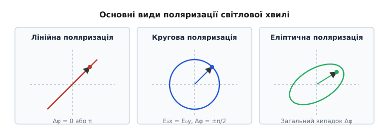
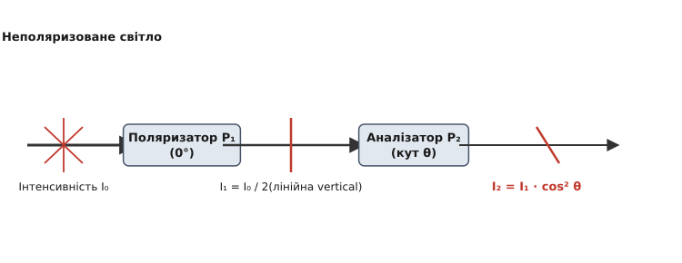
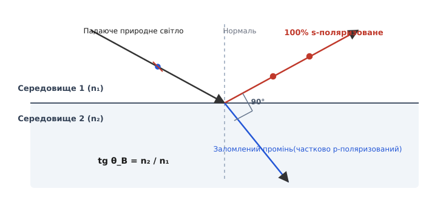
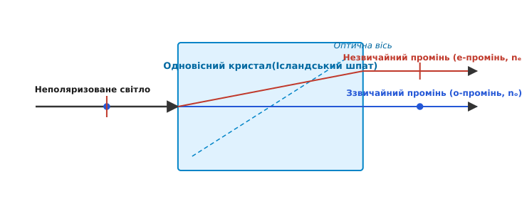
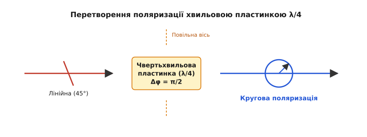

# Поляризація світла

<preknowlist>
- [Електромагнітна хвиля](topic:ph-electromagnetism/em-wave) — поперечність коливань векторів напруженості електричного та магнітного полів.
- [Рівняння Френеля](topic:ph-waves/fresnel-equations) — розкладання світла на s- та p-компоненти, фазові та амплітудні коефіцієнти при відбитті.
- [Показник заломлення](topic:ph-waves/refractive-index) — фазова швидкість світла у середовищі та залежність від оптичної густини.
</preknowlist>

Якщо покрутити перед очима екран увімкненого смартфона чи ноутбука, дивлячись на нього крізь звичайні сонцезахисні окуляри, при певному куті повороту зображення несподівано згасне до повного темно-синього чи чорного поля. Проте варто повернути монітор назад на 90°, як картинка знову набуває повної яскравості. Повітря між дисплеєм та окулярами не змінилося, джерело світла не згасло, а самі окуляри здаються однаково сірими у будь-якому положенні. Цей дивовижний ефект є прямим наочним проявом того, що світло — це не просто скалярна хвиля тиску чи згущення середовища, а поперечне електромагнітне коливання. Вектор його електричного поля має виділений напрямок у просторі, а явище впорядкованості цих коливань називають **поляризацією світла** (*polarization*, від грецького *пóлос* — вісь, полюс).

### 1. Електромагнітна природа поляризації

Світлова хвиля являє собою синхронне поширення у просторі та часі взаємопов'язаних вихрових полів: вектора напруженості електричного поля `E` та вектора напруженості магнітного поля `H` (або магнітної індукції `B`). Із фундаментальних рівнянь Максвелла випливає, що у вільному вакуумі або в ізотропному прозорому середовищі обидва вектори є строго поперечними. Це означає, що вони коливаються у площині, перпендикулярній до хвильового вектора `k`, який вказує напрямок поширення енергії хвилі (напрямок вектора Пойнтінга `S = E × H`).

При цьому вектори `E` та `H` у плоскій електромагнітній хвилі завжди взаємно перпендикулярні один до одного (`E ⊥ H`) та коливаються в однаковій фазі. Оскільки амплітуда сили, з якою електричне поле діє на вільні та зв'язані електрони речовини (`F_el = q · E`), у `c / v` разів перевищує магнітну частину сили Лоренца (`F_mag = q · [v × B]`), саме вектор електричного поля `E` відповідає за фотохімічні, оптичні та біологічні дії світла. Тому в фізичній оптиці вектор `E` називають **світловим вектором**.

Миттєве положення та траєкторія, яку описує кінець світлового вектора `E` у площині, перпендикулярній до напрямку променя, повністю визначають поляризаційний стан світлової хвилі.

### 2. Класифікація станів поляризації

Залежно від ступеня впорядкованості коливань світлового вектора `E`, світло поділяють на неполяризоване (природне), частково поляризоване та повністю поляризоване.

#### 2.1. Неполяризоване (природне) світло

Звичайні термодинамічні джерела світла — Сонце, лампи розжарювання, свічки, полум'я чи світлодіоди — складаються з велетенської кількості хаотично випромінюючих атомів і молекул. Кожен окремий атом випромінює коротку збірку хвиль (хвильовий цуг) тривалістю близько `10⁻⁸`–`10⁻⁹` секунд. Усередині одного цуга вектор `E` коливається в одному напрямку, проте наступний цуг від того самого чи сусіднього атома випромінюється з абсолютно випадковою орієнтацією та фазою.

Оскільки за секунду крізь спостерігача проходять мільярди таких хаотичних цугів, напрямок вектора `E` змінюється мільярди разів на секунду. Жоден макроскопічний фотоприймач не здатний зафіксувати ці швидкі хаотичні стрибки. Світло, у якому всі напрямки коливань вектора `E` у поперечній площині є рівноймовірними, називають **неполяризованим** або **природним світлом**.

#### 2.2. Повністю поляризоване світло

Якщо всі хвильові цуги у світловому промені узгоджені між собою так, що кінець вектора електричного поля `E` описує у поперечній площині чітко визначену геометричну траєкторію, таке світло називають **повністю поляризованим**.

За формою траєкторії кінчика вектора `E` розрізняють три основні види поляризації:

1. **Лінійна (або плоска) поляризація:** кінець вектора `E` коливається строго уздовж однієї фіксованої прямої лінії у поперечній площині. Площину, яка проходить крізь напрямок поширення променя `k` та лінію коливань вектора `E`, називають **площиною поляризації**.
2. **Кругова (циркулярна) поляризація:** модуль вектора електричного поля залишається постійним за величиною (`|E| = const`), але сам вектор рівномірно повертається навколо напрямку поширення хвилі з круговою частотою світла `ω`. Кінчик вектора `E` описує коло. Залежно від напрямку обертання відносно спостерігача, що дивиться назустріч променю, розрізняють **праву кругову поляризацію** (за годинниковою стрілкою) та **ліву кругову поляризацію** (проти годинникової стрілки).
3. **Еліптична поляризація:** найзагальніший випадок поляризації монохроматичного світла, при якому кінець вектора `E` описує у поперечній площині еліпс. Лінійна та кругова поляризації виступають окремими граничними випадками еліптичної поляризації.


*Траєкторії кінчика світлового вектора E у площині, перпендикулярній до променя: лінійна поляризація (лінія під кутом), кругова поляризація (коло) та еліптична поляризація (нахилений еліпс).*

Математично будь-яку поляризовану хвилю можна розкласти на дві ортогональні компоненти `E_x` та `E_y`. Якщо фазовий зсув між ними `Δφ = 0` або `π`, хвиля лінійно поляризована. Якщо `E_0x = E_0y` і `Δφ = ±π/2`, поляризація є круговою. Детальний алгебраїчний вивід канонічного рівняння поляризаційного еліпса наведено у вставці [🧮 Математичний вивід рівняння поляризаційного еліпса та фазового зсуву](topic:ph-waves/light-polarization/math-polarization-ellipse.md).

#### 2.3. Ступінь поляризації

Світло у реальних оптичних середовищах часто являє собою некогерентну суміш природного світла і поляризованої компоненти. Таке світло називають **частково поляризованим**.

Для кількісної оцінки впорядкованості коливань використовують **ступінь поляризації** `P` (*degree of polarization*):

```
P = (I_max - I_min) / (I_max + I_min)
```

де `I_max` та `I_min` — максимальна та мінімальна інтенсивності світла, що реєструються після пропускання променя крізь повернутий поляризаційний фільтр:
- Для природного (неполяризованого) світла `I_max = I_min`, тому `P = 0`.
- Для повністю поляризованого світла `I_min = 0`, тому `P = 1` (або 100%).
- Для частково поляризованого світла `0 < P < 1`.

### 3. Закон Малюса та дія поляризаційних фільтрів

Пристрій, який перетворює природне або частково поляризоване світло на повністю лінійно поляризоване, називають **поляризатором**. Поляризатор має виділену вісь — **вісь пропускання** (*transmission axis*). Він пропускає без перешкод лише ту компоненту вектора `E`, яка паралельна цій осі, і повністю затримує (поглинає або відбиває) перпендикулярну компоненту.

#### 3.1. Проходження природного світла крізь поляризатор

Коли на ідеальний поляризатор падає пучок природного неполяризованого світла з інтенсивністю `I₀`, напрямок вектора `E` у кожному цузі утворює випадковий кут `φ` з віссю пропускання. Пропущена амплітуда дорівнює `E = E₀ · cos φ`, а миттєва інтенсивність пропорційна `E₀² · cos² φ`.

Оскільки для природного світла всі кути `φ` від `0` до `2·π` є однаково ймовірними, усреднена за часом величина квадрата косинуса дорівнює `⟨cos² φ⟩ = 1 / 2`. 

Отже, ідеальний поляризатор завжди зрізає рівно половину інтенсивності природного світла:

```
I₁ = I₀ / 2                          [інтенсивність після першого поляризатора]
```

Вихідний промінь стає строго лінійно поляризованим уздовж осі пропускання першого поляризатора.

#### 3.2. Закон Малюса

Якщо на шляху вже лінійно поляризованого світла з інтенсивністю `I₁` встановити другий поляризаційний фільтр, який у цьому контексті називають **аналізатором**, інтенсивність світла на виході буде залежати від кута `θ` між віссю пропускання поляризатора та віссю пропускання аналізатора.

Вектор електричного поля падаючої хвилі `E₁` розкладається на дві компоненти:
- Паралельну осі аналізатора: `E_|| = E₁ · cos θ` (проходить крізь аналізатор).
- Перпендикулярну осі аналізатора: `E_⊥ = E₁ · sin θ` (затримується аналізатором).


*Схема експерименту за законом Малюса: природне світло інтенсивністю I₀ проходить крізь перший поляризатор P₁, набуваючи інтенсивності I₁ = I₀ / 2, а потім крізь аналізатор P₂, повернутий на кут θ, де інтенсивність спадає до I₂ = I₁ · cos² θ.*

Оскільки інтенсивність пропорційна квадрату амплітуди електричного поля (`I ∝ E²`), підсумкова інтенсивність світла після аналізатора `I₂` дорівнює:

```
I₂ = I₁ · cos² θ                    [Закон Малюса]
```

Цю фундаментальну залежність відкрив Етьєн-Луї Малюс 1810 року. Історія цього відкриття та роль Малюса у вечірніх спостереженнях Люксембурзького палацу детально описані у вставці [📜 Відкриття поляризації: від Люксембурзького палацу до синтетичних поляроїдів](topic:ph-waves/light-polarization/hist-malus-polarization.md).

З закону Малюса випливають три важливі граничні випадки:
1. **Паралельні поляризатори (`θ = 0°`):** `cos² 0° = 1`, світло проходить із максимальною інтенсивністю `I₂ = I₁`.
2. **Поляризатори під кутом 45° (`θ = 45°`):** `cos² 45° = 1 / 2`, інтенсивність зменшується вдвічі: `I₂ = I₁ / 2`.
3. **Схрещені поляризатори (`θ = 90°`):** `cos² 90° = 0`, світло повністю заблоковане (`I₂ = 0`).

> 🔧 **Навіщо це.** Схрещені поляризатори є основою надчутливих методів оптичного контролю. Якщо між двома скрещеними поляризаторами, які повністю перекривають світло, помістити будь-який об'єкт, що бодай трохи повертає площину поляризації або викликає фазовий зсув (деформоване скло, кристали солей, рідкі кристали), на темному тлі негайно виникає яскравий світловий візерунок. Це використовують у дефектоскопії, біології та аналізі напружень.

### 4. Фізичні механізми виникнення поляризованого світла

Існує чотири фундаментальні фізичні процеси, за допомогою яких природне світло перетворюється на поляризоване: відбиття й заломлення на межі діелектриків, двозаломлення в анізотропних кристалах, селективне поглинання (дихроїзм) та розсіяння на малик частинках.

#### 4.1. Відбиття та заломлення (Кут Брюстера)

Коли світло падає під кутом на гладку межу розділу двох прозорих діелектриків (наприклад, повітря й скла чи повітря й води), відбитий та заломлений промені стають частково поляризованими.

Світловий вектор падаючої хвилі розкладають на дві складові відносно площини падіння (площини, що містить промінь і нормаль до поверхні):
- `s`-поляризація (від німецького *senkrecht* — перпендикулярний): вектор `E` коливається перпендикулярно до площини падіння (паралельно поверхні розділу).
- `p`-поляризація (від німецького *parallel* — паралельний): вектор `E` коливається у самій площині падіння.

Згідно з [рівняннями Френеля](topic:ph-waves/fresnel-equations), коефіцієнти відбиття для `s`- та `p`-компонент суттєво відрізняються при зміні кута падіння. При певному специфічному куті, який називають **кутом Брюстера** (*Brewster's angle*, `θ_B`), коефіцієнт відбиття для `p`-поляризації падає строго до нуля (`R_p = 0`).


*Падіння світла під кутом Брюстера θ_B. Відбитий промінь стає на 100% s-поляризованим. Кут між відбитим та заломленим променями дорівнює строго 90°.*

Шотландський фізик Девід Брюстер 1815 року встановив, що кут Брюстера задовольняє просте співвідношення:

```
tg θ_B = n₂ / n₁                    [Закон Брюстера]
```

де `n₁` та `n₂` — показники заломлення першого та другого середовищ. Для межі повітря-скло (`n₁ = 1.0`, `n₂ = 1.5`) кут Брюстера становить приблизно `56.3°`, а для межі повітря-вода (`n₂ = 1.33`) — близько `53.1°`.

Фізична причина явища Брюстера пов'язана з випромінюванням атомних диполів у другому середовищі. Заломлена хвиля розганяє електрони речовини, змушуючи їх коливатися вздовж вектора `E`. Напруженість поля відбитої хвилі створюється саме перевипромінюванням цих збуджених диполів. Проте елементарний електричний диполь **не випромінює електромагнітних хвиль вздовж своєї осі коливань**. При куті падіння Брюстера заломлений і відбитий промені утворюють між собою кут строго **90°**. У результаті осі коливань диполів `p`-компоненти у заломленому промені виявляються спрямованими точно вздовж напрямку відбитого променя. Диполі принципово не можуть випромінювати `p`-хвилю у цьому напрямку, тому відбитий промінь стає на **100% лінійно s-поляризованим**.

#### 4.2. Двозаломлення (анізотропія кристалів)

Коли світло потрапляє у некубічний кристал (наприклад, кальцит `CaCO₃`, кварц `SiO₂` або селеніт), воно розщеплюється на два промені, що поширюються у різних напрямках з різними швидкостями. Це явище називають **двозаломленням** (*birefringence*, від латинського *bi-* — подвійний та *refractio* — заломлення).

Анізотропія кристалічної ґратки означає, що дипольна поляризованість середовища залежить від напрямку електричного поля. У результаті кристал має різні [показники заломлення](topic:ph-waves/refractive-index) для різних напрямків коливань вектора `E`:

1. **Звичайний промінь (ordinary ray, `o`-промінь):** для нього показник заломлення `n_o` є однаковим у всіх напрямках. Промінь підпорядковується звичайному [закону Снелла](topic:ph-waves/snells-law), а його хвильовий фронт є сферичним. Вектор `E` звичайного променя поляризований перпендикулярно до головного перерізу кристала.
2. **Незвичайний промінь (extraordinary ray, `e`-промінь):** його показник заломлення `n_e(θ)` залежить від кута відносно оптичної осі кристала. Промінь не підпорядковується закону Снелла (заломлюється навіть при нормальному падінні), а його хвильовий фронт має форму сфероїда (еліпсоїда обертання). Вектор `E` незвичайного променя лежить у головному перерізі кристала.


*Розщеплення природного світла у кристалі ісландського шпату на звичайний (o) та незвичайний (e) промені з ортогональними поляризаціями.*

У кристалі існує принаймні один напрямок, уздовж якого швидкості поширення `o`- та `e`-променів однакові (`n_o = n_e`). Цей напрямок називають **оптичною віссю кристала**. Кристали з однією такою віссю (кальцит, кварц, турмалін) називають одновісними. Якщо `n_e > n_o` (наприклад, у кварці), кристал називають оптично додатним; якщо `n_e < n_o` (наприклад, у кальциті) — оптично від'ємним.

#### 4.3. Дихроїзм та плівкові поляроїди

Деякі анізотропні речовини володіють здатністю не просто розщеплювати промені, а й сильно вибірково поглинати один із двох поляризованих променів, залишаючи інший майже прозорим. Це явище називають **дихроїзмом** (*dichroism*, від грецького *δίχρωος* — двоколірний).

Класичним природним дихроїчним кристалом є турмалін. Пластина турмаліну товщиною всього 1 мм практично повністю поглинає звичайний промінь, перетворюючи світло, що пройшло наскрізь, у плоскополяризований незвичайний промінь.

У сучасній техніці замість дорогих і крихких кристалів застосовують синтетичні плівкові поляризатори (**поляроїди**), винайдені Едвіном Лендом у 1938 році. Поляроїд є тонкою полімерною плівкою з полівінілового спирту (PVA), витягнутою в одному напрямку під час нагрівання. У результаті довгі вуглеводневі молекулярні ланцюжки орієнтуються строго паралельно один одному. Плівку насичують йодом, атоми якого утворюють паралельні провідні полійодидні ланцюжки.

Коли світло падає на таку плівку:
- Складова вектора `E`, паралельна ланцюжкам йоду, викликає струм провідності вздовж молекул. Енергія світла швидко розсіюється на тепло — ця компонента повністю поглинається.
- Складова вектора `E`, перпендикулярна ланцюжкам, не може розганяти електрони впоперек вузьких полімерних ниток. Вона проходить крізь плівку практично без втрат.

Поляроїдні плівки є дешевими, дозволяють створювати фільтри площею в кілька квадратних метрів і забезпечують ступінь поляризації понад 99.9% у видимому діапазоні.

#### 4.4. Розсіяння світла (Розсіяння Релея)

Коли сонячне світло поширюється крізь атмосферу Землі, воно розсіюється на молекулах азоту та кисню, розмір яких значно менший за довжину світлової хвилі (`d ≪ λ`). Це явище описує закон [розсіяння Релея](topic:ph-waves/rayleigh-scattering).

Електричне поле падаючої сонячної хвилі змушує електрони в молекулах повітря здійснювати вимушені коливання у поперечній площині. Ці коливальні диполі стають вторинними джерелами світла. Якщо спостерігач дивиться на ділянку синього неба під кутом **90°** відносно напрямку на Сонце, він бачить світло, випромінене диполями, коливання яких орієнтовані перпендикулярно до площини розсіяння. Світло, розсіяне під кутом 90°, виявляється майже на **100% лінійно поляризованим**.

> 🔧 **Навіщо це.** Орієнтаційною поляризацією блакитного неба користуються багато комах (зокрема бджоли та мурахи) для точності навігації навіть тоді, коли сонячний диск закритий хмарами. У фотографії поляризаційні фільтри (CPL) використовують для того, щоб під кутом 90° до Сонця зробити колір неба глибоким темно-синім і відсікти бліки від хмар та пилу.

### 5. Фазові пластинки та трансформація поляризації

При проходженні плоскополяризованого світла крізь анізотропну пластинку, вирізану паралельно оптичній осі, ззвичайний та незвичайний промені поширюються в одному напрямку, але з різними швидкостями `v_o = c / n_o` та `v_e = c / n_e`.

На виході з пластинки товщиною `d` між двома ортогональними компонентами виникає фазова різниця `Δφ`:

```
Δφ = (2 · π / λ₀) · |n_e - n_o| · d
```

Змінюючи товщину пластинки `d`, можна керувати підсумковим станом поляризації. Такі оптичні елементи називають **фазовими затримувачами** або **хвильовими пластинками**.

#### 5.1. Чвертьхвильова пластинка (`λ/4`)

Пластинка, товщина якої підбирається так, щоб фазовий зсув дорівнював `Δφ = π / 2` (або 90°), називається **чвертьхвильовою пластинкою** (*Quarter-Wave Plate*). Вона вносить різницю ходу в одну чверть довжини хвилі: `|n_e - n_o| · d = λ₀ / 4`.


*Перетворення лінійної поляризації під кутом 45° на циркулярну поляризацію після проходження крізь чвертьхвильову пластинку λ/4.*

Якщо спрямувати на пластинку `λ/4` лінійно поляризоване світло, вектор `E` якого утворює кут **45°** до оптичних осей пластинки, амплітуди компонент будуть однаковими (`E_0x = E_0y`), а фазовий зсув становитиме `π / 2`. На виході утворюється **циркулярно (кругово) поляризоване світло**. Якщо кут відмінний від 45°, світло стає еліптично поляризованим.

#### 5.2. Напівхвильова пластинка (`λ/2`)

Пластинка, що вносить фазовий зсув `Δφ = π` (або 180°), називається **напівхвильовою пластинкою** (*Half-Wave Plate*). Її товщина відповідає різниці ходу в пів хвилі: `|n_e - n_o| · d = λ₀ / 2`.

Напівхвильова пластинка змінює знак однієї з компонент полю (`E_y → -E_y`). У результаті вектор електричного поля `E` дзеркально відображається відносно оптичної осі пластинки. Якщо вхідний вектор `E` утворював кут `θ` з оптичною віссю, на виході площина поляризації повертається на кут **`2·θ`**. Це дає змогу плавно повертати площину поляризації лазера на будь-який заданий кут без втрати інтенсивності.

### 6. Оптична активність, ефект Фарадея та циркулярний дихроїзм

Деякі прозорі середовища володіють природною або індукованою здатністю повертати площину лінійної поляризації світла навіть при відсутності кристалічної двозаломлюваності. Таке явище називають **оптичною активністю** або **гіротропією**.

Речовини, які повертають площину поляризації за годинниковою стрілкою (якщо дивитися назустріч променю), називають **правообертальними** (`+`), а проти — **лівообертальними** (`-`). Оптично активними є кристали кварцу, розчини цукру, винної кислоти, білків та амінокислот.

Французький фізик Жан-Батіст Біо установив, що кут повороту площини поляризації `α` у розчинах прямо пропорційний товщині шару `d` та масовій концентрації речовини `C`:

```
α = [α] · C · d                     [Закон Біо]
```

де `[α]` — питоме обертання речовини, яке залежить від довжини хвилі світла та температури.

Причиною природної оптичної активності є **молекулярна хіральність** (від грецького *χείρ* — рука) — відсутність дзеркальної симетрії в будові молекул. Хіральні молекули не мають площини симетрії і можуть існувати у двох дзеркальних формах (енантіомерах), подібних до правої та лівої рук. Середовище виявляє різний показник заломлення для правої (`n_R`) та лівої (`n_L`) кругових поляризацій:

```
[α] = (π / λ₀) · (n_L - n_R)
```

Оскільки будь-яку лінійно поляризовану хвилю можна розкласти на суму правої та лівої кругових хвиль рівної амплітуди, різниця фазових швидкостей `n_L ≠ n_R` призводить до того, що на виході з середовища одна кругова хвиля випереджає іншу. Їхня результуюча сума залишається лінійно поляризованою хвилею, але її площина коливань виявляється повернутою на кут `α`.

Окрім природної оптичної активності, існує **магнітооптичний ефект Фарадея** (відкритий Майклом Фарадеєм у 1845 році). Коли прозоре середовище (наприклад, важке флаконне скло) вміщують у сильне поздовжнє магнітне поле `B`, воно повертає площину поляризації світла на кут:

```
α = V · B · d                       [Ефект Фарадея]
```

де `V` — константа Верде матеріалу. На відміну від природної оптичної активності, ефект Фарадея є невідворотним: якщо промінь відбити дзеркалом назад крізь те саме магнітне поле, кут повороту не компенсується, а подвоюється (`2·α`). Цю невідворотність використовують в оптичних ізоляторах (оптичних діодах) для захисту потужних лазерів від шкідливого зворотного відбиття.

Вимірювання кута повороту поляризації (поляриметрія та сахариметрія) є одним із найважливіших методів аналізу чистоти ліків у фармацевтиці та харчовій промисловості.

### 7. Математичні формалізми та програмне моделювання

Для точного кількісного опису поляризаційного тракту в складних оптичних системах використовують два спеціальні математичні апарати:

1. **Матричне числення Джонса:** застосовується для строго монохроматичного та повністю поляризованого когерентного світла. Стан поляризації описують двовимірним комплексним вектором Джонса `V = [E_x, E_y]^T`, а оптичні елементи — комплексною матрицею Джонса `2×2`.
2. **Векторний апарат Стокса та матриці Мюллера:** застосовується для частково поляризованого, некогерентного та поліхроматичного світла. Стан променя описують чотиривимірним дійсним вектором Стокса `S = [S₀, S₁, S₂, S₃]^T`, компоненти якого виражають через інтенсивності, а середовище — дійсними матрицями Мюллера `4×4`.

Детальний математичний вивід цих формалізмів та їхнє геометричне представлення на сфері Пуанкаре можна знайти в окремій статті [Матричне числення поляризації: Джонс і Мюллер](topic:ph-waves/polarization-matrix-calculus). Практичну реалізацію алгоритмів розрахунку оптичного тракту мовами C та C++ наведено у вставці [⚙️ Програмне моделювання поляризаційного тракту та закону Малюса](topic:ph-waves/light-polarization/proj-polarization-simulator.md).

### 8. Практичні застосування поляризованого світла

Поляризація світла перестала бути суто фундаментальним фізичним ефектом і перетворилася на основу багатьох ключових технологій сучасного інформаційного суспільства.

#### 8.1. Рідкокристалічні дисплеї (LCD)

Сучасні монітори, телевізори та екрани смартфонів працюють на основі керованого повороту поляризації світла. Рідкокристалічний піксель складається з шару нематичного рідкого кристала, затиснутого між двома скрещеними під 90° поляризаційними плівками.

У вимкненому стані молекули рідкого кристала формують спіральну (скручену) структуру (TN-комірка), яка повертає площину поляризації світла строго на 90°. Світло від підсвічування проходить крізь перший поляризатор, повертається кристалом і вільно проходить крізь другий схрещений поляризатор — піксель світиться білим. При подачі електричної напруги молекули кристала випрямляються уздовж поля і втрачають здатність повертати поляризацію. Світло після першого поляризатора потрапляє на другий у скрещеному стані й повністю заблоковується — піксель стає темним.

#### 8.2. Кіносистеми 3D-зображення (RealD 3D)

Для створення тривимірного об'ємного зображення у кінотеатрах проектор почергово транслює кадри для правого та лівого ока. Щоб розділити ці зображення, застосовують циркулярну поляризацію: кадри для правого ока поляризують за кругом праворуч, а для лівого — ліворуч.

Окуляри глядача містять лівий та правий кругові поляризатори (комбінацію пластинки `λ/4` та лінійного поляризатора). Головна перевага кругової поляризації над лінійною полягає у тому, що глядач може нахиляти голову вбік під будь-яким кутом — якість розділення кадрів і відсутність перехресних перешкод (*crosstalk*) залишаються ідеальними.

#### 8.3. Фотопружність та поляризаційний аналіз напружень

Більшість ізотропних прозорих матеріалів (скло, акрил, полікарбонат) при механічній деформації (стисненні, розтягуванні чи згинанні) набувають штучного двозаломлення. Відповідно до фотопружного закону Брюстера, виникла різниця показників заломлення `Δn = |n_1 - n_2|` є прямо пропорційною різниці головних механічних напружень `(σ₁ - σ₂)`:

```
Δn = C · (σ₁ - σ₂)
```

де `C` — оптичний коефіцієнт напружень матеріалу.

Якщо прозору модель деталі (наприклад, пластиковий корпус літака чи зубний імплант) розмістити між двома схрещеними поляризаторами й висвітити білим світлом, на її поверхні виникає карколомна кольорова інтерференційна картина — ізохроми та ізокліни. За розкладом цих кольорових смуг інженери точково визначають небезпечні зони концентрації механічних напружень.

#### 8.4. Волоконно-оптичний зв'язок та мультиплексування (PDM-QPSK)

У сучасних магістральних волоконно-оптичних лініях зв'язку для подвоєння пропускної здатності використовують поляризаційне мультиплексування (*Polarization Division Multiplexing*, PDM). В один оптичний світловод одночасно запускають два незалежні високошвидкісні інформаційні канали на одній довжині хвилі, поляризовані у взаємно перпендикулярних площинах. На приймальному кінці когерентні фотоприймачі розділяють ці канали без взаємних завад.

#### 8.5. Еліпсометрія

Еліпсометрія — це високоточний безконтактний метод дослідження товщини та показника заломлення надтонких диелектричних та напівпровідникових плівок (від 0.1 нанометра до кількох мікрометрів). Метод ґрунтується на вимірюванні зміни стану поляризації (амплітудного співвідношення `Ψ` та фазового зсуву `Δ`) світла після його відбиття від поверхні багатошарової пластини під кутом, близьким до кута Брюстера.

Завдяки тому, що фазовий зсув `Δ` виявляється надзвичайно чутливим до наявності навіть поодиноких моноатомних шарів покриття, еліпсометрія виступає головним неелементним діагностичним методом для прецизійного контролю товщини та оптичних постійних шарів оксиду кремнію, нітриду кремнію та фоторезисту у процесах літографії та виготовлення сучасних напівпровідникових мікропроцесорів.
