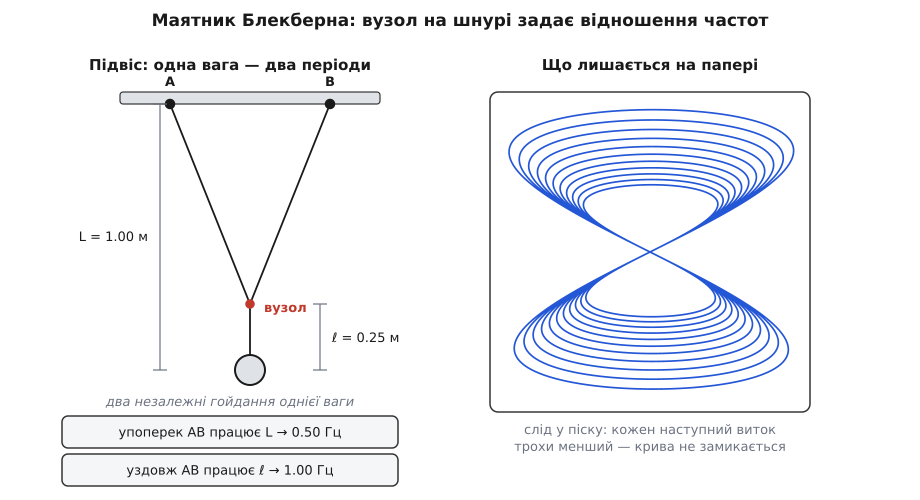
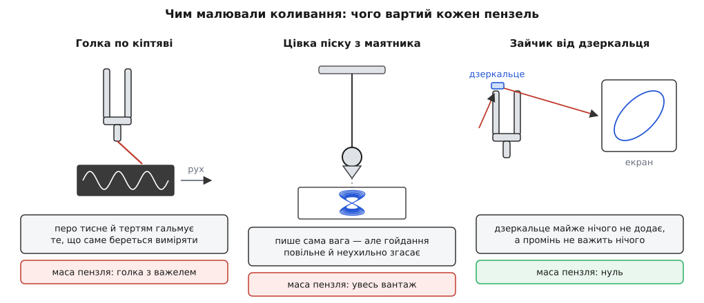

# 🕰️ Пензель, що нічого не важить: чим креслили ці фігури до всякої електроніки

Замкнена петля з двох коливань не з'явиться сама — хтось мусить її **накреслити**: устигнути за обома коливаннями й водночас не заважати тому, що вимірюєш. На це ХІХ століття знайшло дві різні відповіді: важкий вантаж, що пише сам собою, і промінь світла, що не важить нічого. Різниця між ними й вирішила, чия машина стала приладом, а чия лишилася салонною забавкою.

## Перо, що важить

Найприродніша думка звучить так: звук — це коливання, тож хай коливання саме себе й запише. Спроби її втілити старші за самі фігури. Ще **1807 року** англійський фізик **Томас Юнг** (Thomas Young, 1773–1829) причепив до камертона гострий кінчик і провів ним по закопченій поверхні: там, де кінчик пройшов, сажа знялася — і на пластинці лишилася хвиляста риска. **1853-го** француз **Жан-Марі Дюамель** (Jean-Marie Constant Duhamel, 1797–1872) зробив із цього прилад — віброскоп, що записував коливання, хоч і не вмів їх відтворювати. А **25 березня 1857 року** паризький складач і видавець **Едуар-Леон Скотт де Мартенвіль** (Édouard-Léon Scott de Martinville) дістав патент на **фоноавтограф**: рупор, тонка перетинка на взір барабанної, щетина дикого кабана на цій перетинці замість пера — і закопчене скло, що їде під щетиною зі швидкістю метр за секунду. Звук нарешті писав себе сам; відтворювати записане прилад не вмів і не мав такого задуму — Скотт хотів, щоб сліди **читали очима**.

І ось на цьому шляху стоять дві перепони, і друга з них важливіша.

Перша — механічна. Кінчик має масу, і його треба **везти**: коливання мусить не лише коливатися, а ще й тягти за собою перо й дерти ним по кіптяві. Що швидше коливання, то більша частка його сили йде на цю роботу — і то дужче прилад псує саме те, що взявся виміряти: підвантажена ніжка камертона й звучить нижче, і гасне швидше.

Друга перепона глибша. Голка на рухомій пластинці дає **графік у часі**: одна вісь — відхилення, друга — рівномірний хід поверхні. А фігура з двох коливань потребує, щоб другою віссю було **друге коливання**, а не час. Пером по кіптяві такого не дістати в принципі. Потрібна машина, у якій гойдаються **обидві** осі.

## Маятник, підвішений у двох точках

Така машина вже існувала — тільки прийшла вона не з акустики, а з механіки неба.

**1815 року**, по той бік океану, з'явилася задача про рух маятника, підвішеного не в одній точці, а у двох. Довідники одностайно кажуть, що поставив її американець **Джеймс Дін** (James Dean), а математично розібрав того самого року **Натаніел Баудіч** (Nathaniel Bowditch, 1773–1838) — і саме тому криві досі подеколи звуть **кривими Баудіча** (*Bowditch curves*). Про Діна відомостей збереглося обмаль, і його роль лишається радше згадкою в довідниках, ніж докладно задокументованим внеском; постать Баудіча, навпаки, добре описана. Це американець із портового Салема в Массачусетсі, син бондаря: школу він покинув у десять років, а математику, латину й французьку опанував сам. Славу йому дало море — «Новий американський практичний навігатор» (*The New American Practical Navigator*, 1802), таблиці й правила для штурманів, — а ще переклад «Небесної механіки» Лапласа. Людина, що звикла рахувати рух по кривих, і маятник розібрала як задачу небесної механіки: без жодного стосунку до звуку.

Чому ж підвіс «у двох точках» дає одразу два коливання? Тут варто пригадати найпростіше про [маятник](topic:ph-waves/pendulum): період його гойдання задає лише довжина підвісу, T = 2π·√(L/g), а маса тягарця не важить нічого — довший підвіс гойдається повільніше, коротший швидше. Тепер зведімо до вузла два шнури, що звисають із гачків **A** і **B**, а від вузла пустімо вниз один шнур із вантажем. Виходить «літера Y» — і в неї дві різні довжини залежно від того, куди штовхнути вантаж:

- **уздовж** прямої A—B вузол утримують натягнуті шнури, він майже не рухається, тож гойдається сам лише нижній відрізок — працює **коротка** довжина ℓ;
- **упоперек** цієї прямої вся «літера Y» відхиляється як ціле, обертаючись навколо прямої A—B, — працює **повна** довжина L від рівня гачків до вантажу.

Одна вага, один підвіс — а періоди два, кожен по своїй осі. І, що найцінніше, відношення цих періодів **налаштовується**: пересунув вузол — змінив ℓ.

**Приклад (де зав'язати вузол, щоб дістати 2:1).** Повна довжина L = 1.00 м; вузол треба поставити так, щоб уздовж A—B маятник гойдався рівно вдвічі частіше, ніж упоперек.

```
f = (1/2π)·√(g/L),   g = 9.81 м/с²

повна довжина:  L = 1.00 м → f = (1/6.2832)·√(9.81/1.00) = 0.498 Гц
удвічі більша частота вимагає вчетверо меншої довжини:
                ℓ = L/2² = 0.25 м → f = (1/6.2832)·√(9.81/0.25) = 0.997 Гц

вузол — на 0.25 м над вантажем, тобто на 0.75 м нижче від гачків
```

Частота йде за коренем із довжини, тому «вдвічі частіше» коштує «вчетверо коротше»; для відношення 3:2 довжини мали б відноситися як (3/2)² = 2.25.

У робочу машину цю ідею перетворив шотландець **Г'ю Блекберн** (Hugh Blackburn, 1823–1909). Підвіс, названий його ім'ям, він описав **1844 року**, ще студентом Кембриджа — там-таки він приятелював із Вільямом Томсоном, майбутнім лордом Кельвіном, і дружба ця протривала все життя; кафедру математики в Ґлазґо Блекберн обійняв пізніше, 1849 року, і тримав до 1879-го. (Одружився він, до речі, з художницею-ілюстраторкою Джемімою Веддерберн — кузиною Джеймса Клерка Максвелла.) Під вантаж підставляли аркуш, а до самого вантажу чіпляли перо або лійку з піском — і машина креслила фігуру власною вагою, без жодного стороннього пензля.


*Ліворуч — геометрія підвісу: гойдання вздовж прямої A—B «бачить» лише коротку ℓ, гойдання впоперек — усю довжину L; вузол на 0.25 м над вантажем дає рівно вдвічі більшу частоту. Праворуч — те, що лишається на папері: петля щоразу трохи менша, бо гойдання згасає.*

І тут-таки видно межу механічного шляху. Гойдання **згасає**: тертя в підвісі й опір повітря забирають розмах, і кожен наступний виток лягає всередину попереднього — про сам характер цього спадання є окрема тема, [загасне коливання](topic:ph-waves/damped-oscillator). Крива не замикається ніколи, хай яке точне відношення довжин. Для вимірювання це вирок: фігуру тут не «зупиниш» — вона й так безупинно тане.

А головне — швидкість. Порахуймо, який завдовжки мав би бути підвіс, щоб маятник гойдався з частотою камертона:

```
L = g / (2π·f)² = 9.81 / (2π·435)² = 9.81 / 7.47·10⁶ ≈ 1.3·10⁻⁶ м
```

Мікрон. Не маятник, а порошинка. У звук механічний шлях не вів узагалі.

## Чому маятникові потрібен слід, а камертонові — ні

Перш ніж іти далі, варто зрозуміти одну річ, без якої вся дальша історія виглядає випадковою: **чому повільна машина мусить лишати слід, а швидка може обійтися без нього**.

Око не встигає за кожним окремим положенням світлої плями: образ тримається в ньому ще приблизно двадцяту частку секунди після того, як пляма пішла далі. Тож усе залежить від того, скільки коливань устигає статися за цей час:

```
око «тримає» образ ≈ 0.05 с

камертон 435 Гц → 435 · 0.05 ≈ 22 повних коливання
                  око бачить суцільну замкнену криву
маятник 0.5 Гц  → 0.5 · 0.05 = 0.025 коливання
                  око бачить лише точку, що поволі повзе
```

Ось воно. Повільній машині крива потрібна **на папері**, бо в оці вона не збереться; а слід на папері вимагає пера з масою — тобто повертає до тієї самої біди. Швидкій машині слід не потрібен зовсім: криву домалює око.

Є й друга перевага у швидкої машини. Камертон витримує тисячі періодів, майже не втрачаючи розмаху: сталеві ніжки гойдаються в протифазі, ручка стоїть майже нерухомо, а віддавати енергію повітрю така пара ніжок майже не вміє — скільки періодів коливання проживе, перш ніж помітно вщухне, і показує [добротність](topic:ph-waves/q-factor). За десяток секунд звучання камертон на 435 Гц робить кілька тисяч коливань — і всі вони на око однакові; маятник за той самий десяток секунд робить п'ять гойдань, і спадання розмаху вже помітне. Отже, потрібно було не нове перо, а **швидка машина й безінерційний пензель**.

## Калейдофон: світло вже було пензлем

Пензель, до речі, знайшли раніше, ніж машину.

**1827 року** англієць **Чарлз Вітстон** (Charles Wheatstone, 1802–1875) описав **калейдофон**. Вітстон тоді не мав ніякого стосунку до університетів: після смерті дядька 1823 року вони з братом тримали крамницю музичних інструментів на Стренді в Лондоні, а професором експериментальної фізики в Королівському коледжі він став аж 1834-го. Прилад був простий до сміховинного: металевий стрижень, затиснутий одним кінцем, а на вільному кінці — посріблена намистина. Пусти на намистину світло, змусь стрижень дрижати — і в темній кімнаті замість намистини видно **світну замкнену криву**, ніби іскру, розкручену в повітрі.

Звідки в одного стрижня два коливання? Бо стрижень із неоднаковим перерізом гнеться в двох перпендикулярних площинах трохи по-різному — жорсткість в один бік більша, в інший менша, отже й частоти дві, близькі, але не рівні. А швидкий біг плями око зшиває в суцільну лінію.

Отже, ідея «світло замість пера» була на тридцять років старша за Ліссажу — і лишилася **іграшкою**. Так її й називали: філософською іграшкою, а тодішньою мовою це означало настільний прилад, що показує явище наочно, без жодних вимірювань. І це не докір Вітстонові — це точний діагноз машини. Дві частоти в калейдофоні дає один шматок металу: їх не можна ані задати нарізно, ані підігнати, ані подати ззовні. Фігура виходить така, яку дасть стрижень, і числа з неї не витягнеш.

Бракувало, виявляється, не пензля. Бракувало **двох окремих керованих джерел коливання — по одному на вісь**.

## Дзеркальце на ніжці камертона

**Жуль Антуан Ліссажу** (фр. Jules Antoine Lissajous; 4 березня 1822, Версаль — 24 червня 1880, Пломб'єр-ле-Діжон) прийшов до кривих із третього боку — з акустики. Ліцей Ош у Версалі, Вища нормальна школа з 1841 року, агрегація з фізики 1847-го (третім із чотирьох кандидатів), докторат 1850-го — про положення вузлів у пластинах, що коливаються поперечно. Викладав він у паризькому ліцеї Сен-Луї з 1847 до 1874 року, а потім був ректором академії Безансона. Людина він був не кабінетна: 1870 року, під час облоги Парижа, разом із фізиком Жюлем Мора піднявся на повітряній кулі — випробовували оптичний зв'язок з обложеним містом.

Задача, що його тримала, звучала просто: **як побачити звук**. Камертон гуде, струна дрижить — око бачить розмиту пляму. І Ліссажу зробив крок, після якого все стало на місце: коливання не повинно нічого **везти**; хай воно везе тільки **дзеркальце**, а пензлем буде промінь.

Виграш тут подвійний. По-перше, крихітне дзеркальце важить мізер проти сталевої ніжки — камертон його майже не помічає, на відміну від голки, яку доводиться тягти по кіптяві. По-друге — і це головне — відбитий промінь працює як **важіль без маси**: нахил дзеркальця на кут θ повертає промінь на 2θ, а далекий екран перетворює цей кут на видимий розмах. Що далі екран, то довший важіль, і за цю довжину не треба платити ані силою, ані інерцією.

**Приклад (наскільки збільшує оптичний важіль).** Ніжка камертона хитає дзеркальце на ±0.20° від середнього положення; екран стоїть за 3.0 м.

```
θ = 0.20° = 0.20 · π/180 = 3.49·10⁻³ рад
відбитий промінь відхиляється на 2θ = 6.98·10⁻³ рад

зсув плями на екрані:  s = 2θ · D = 6.98·10⁻³ · 3.0 = 0.021 м = 21 мм
повний розмах:         2s = 42 мм
```

Тремтіння, якого на самій ніжці око не побачить, стає на стіні смугою в чотири сантиметри — і жодної деталі, що мала б масу.

Далі лишалося поставити **два** камертони так, щоб один хитав зайчик по горизонталі, а другий, у дзеркальце якого промінь потрапляє слідом, — по вертикалі. Промінь, відбившись двічі, лягає на екран уже не рискою, а повною фігурою; замикає її око. Обидва джерела тепер окремі, кожне зі своєю частотою, і кожне можна замінити, підпиляти, звірити.


*Той самий рахунок для трьох машин. Голка тягне за собою і власну масу, і тертя — а тому псує те, що міряє; вантаж маятника пише власною вагою, але гойдається надто повільно й згасає; дзеркальце майже нічого не додає до ніжки камертона, а промінь, яким воно пише, не важить нічого зовсім.*

> 🔧 **Навіщо це.** Прийом «дзеркальце на тому, що рухається, і довге плече світла» пережив і камертони, і саму акустику того століття. За тим самим задумом працює дзеркальний гальванометр, у якому ледь помітний поворот рамки читають зайчиком на далекій шкалі; за ним же працює сучасний атомно-силовий мікроскоп, де прогин тоненької консолі над поверхнею зчитують лазером, відбитим від неї на фотоприймач. Правило просте: коли треба побачити крихітний рух, не торкаючись його, змушують цей рух **повернути дзеркало** — бо кут можна множити скільки завгодно, а маси при цьому не додається.

Метод Ліссажу оголосив **1855 року**, а докладно виклав **1857-го** — у праці «Mémoire sur l'étude optique des mouvements vibratoires» («Спогад про оптичне вивчення коливальних рухів») в *Annales de chimie et de physique*, том 51, сторінки 147–231: вісімдесят п'ять сторінок. Досліди показували на Всесвітній виставці в Парижі 1867 року, про них писали Джон Тіндаль, лорд Релей і Герман фон Гельмгольц, а 1873-го Академія наук присудила Ліссажу премію Лаказа — за оптичне спостереження коливань і «прекрасні досліди». Зробив він і **фоноптометр**: мікроскоп, чий об'єктив сидить на камертоні, — так відношення частот двох коливань міряли з великою точністю.

Про американську працю сорокарічної давнини Ліссажу, найпевніше, не знав: обидва дійшли до кривих незалежно й із різних боків — Баудіч рахував маятник, Ліссажу шукав, як побачити звук. Ім'я закріпилося за другим, і закріпилося справедливо: він дав не рисунок, а **спосіб**, придатний для звукових частот. Обидва імені досі живі — у старих англомовних працях трапляється «Bowditch curves».

## Камертон як міра частоти

Тепер про те, навіщо це все було потрібно не в аудиторії, а на роботі. Камертон у ті часи був не просто музичним причандаллям — він був **еталоном частоти**, речовим і єдиним. І еталон цей розповзався: камертон 1822 року дає ля 432 Гц, камертон 1855-го — уже 449 Гц. Оркестри століттями підтягували стрій угору, співаки скаржилися, і **1859 року** Франція першою у світі узаконила висоту звуку державним актом: ля першої октави — той самий камертонний «ля» — 435 Гц при 15 °C.

Згадка про температуру тут не формальність. Камертон — сталева деталь: нагріється, сталь стане податливішою, ніжки гнутимуться легше, і тон піде вниз. Отже, еталон, що залежить від погоди, треба вміти **звіряти** — і звіряти часто.

На самому унісоні вухо ще давало раду й без оптики: два близькі тони дають повільне «ва-ва-ва», і цей ритм гучності — [биття](topic:ph-waves/beats) — чути навіть на різниці в частку герца. Але **ряд** еталонів так не збудуєш. Щоб виготовити набір камертонів на октаву, квінту, терцію, звіряти треба не рівність, а **відношення** частот — 2:1, 3:2, 5:4. Вухо тут каже лише «звучить чисто», а фігура дає перевірку однозначну: нерухома петля з двома дотиками збоку й трьома зверху означає рівно 2:3 і нічого іншого.

Людина, що жила цим щодня, — **Рудольф Кеніг** (нім. Rudolph Koenig; 26 листопада 1832, Кенігсберг у Пруссії, нині Калінінград — 2 жовтня 1901, Париж). Німець із Кенігсберга, що зробив кар'єру у Франції: 1851 року перебрався до Парижа, вчився в скрипкового майстра Жана-Батиста Війома (Jean-Baptiste Vuillaume), а з 1858-го тримав власну майстерню акустичних приладів. Звідти виходили камертони, резонатори й аналізатори звуку для лабораторій пів Європи; 1862 року він зробив манометричний вогник, що показував форму звукової хвилі тремтінням полум'я, 1865-го дістав золоту медаль Товариства заохочення національної промисловості, а на Паризькій всесвітній виставці 1868 року продав близько сімдесяти відсотків своєї продукції. Саме такі майстерні й були тодішньою метрологією частоти — а очима їй служив промінь від дзеркальця.

## Механіка йде в салон

Механічний шлях програв науці — і повернувся розвагою.

У 1870-х за машинами з двома маятниками й пером закріплюється назва **гармонограф**; довідники пов'язують її з А. Е. Донкіним (A. E. Donkin) і приладами, що їх будував Семюел Чарлз Тіслі (Samuel Charles Tisley). Мода на них росла до 1890-х, і машини продавали просто у вітальню.

Тут стається річ, варта уваги: **та сама вада обертається окрасою**. Згасання, що не давало кривій замкнутися й тим убило маятник як вимірювач, у салоні виявилося головною принадою. Кожен наступний виток лягає трохи всередину попереднього, і замість голої петлі на папері виростає густа розетка, у якій сотні ліній ідуть одна за одною з дрібним зсувом. Машина, непридатна для вимірювання, малювала рівно те, чого від неї хотіли у вітальні.

## Пензлем стає електрон

**1897 року** німецький фізик **Карл Фердинанд Браун** (Karl Ferdinand Braun, 1850–1918) будує трубку з електронним променем. Задум той самий, з однією заміною: дзеркальце ще треба було чимось хитати, а пучок електронів відхиляє просто напруга на пластинах — по парі пластин на кожну вісь. Пензель став такий легкий, що ним керує вже сам сигнал, і камертон із дзеркальцем стає непотрібний; про сам прилад є окрема тема, [електронно-променева трубка](topic:hw-motion/crt-tube). Дзеркальця по тому лишилися в шафах фізичних кабінетів, а прийом — покласти на кожну вісь по коливанню — переїхав на екран без жодної зміни.
