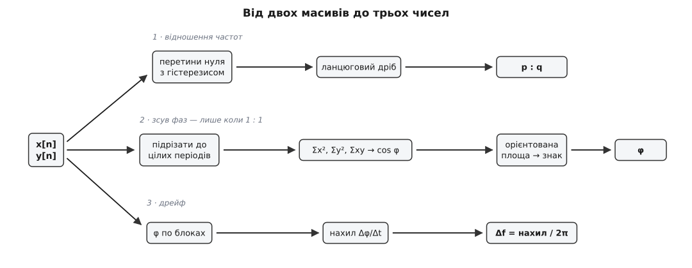
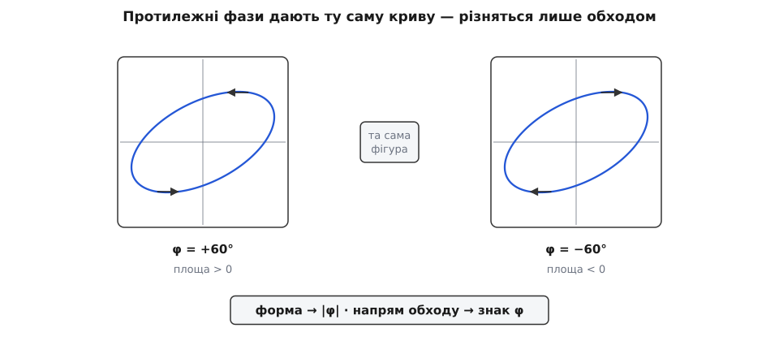
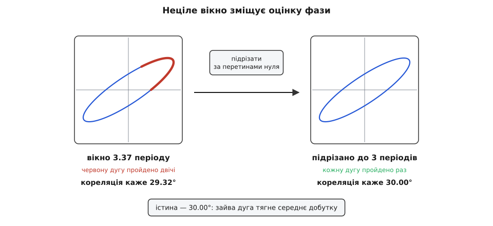

# ⚙️ Фігури Ліссажу в коді: намалювати слід і зчитати з нього три числа

Маємо два масиви відліків — по одному з кожного каналу. Намалювати з них XY-слід нескладно: одне число в горизонталь, друге у вертикаль, з'єднати ламаною. Значно цікавіша зворотна половина роботи — змусити код сказати те, що людина зчитує з форми одним поглядом: **яке відношення частот**, **який зсув фаз** і **як швидко фігура пливе**. Три числа з двох масивів, і кожне дістається зовсім по-різному.

### Скільки часу малювати

Перше питання виникає ще до всякого читання. Слід стає нерухомою фігурою лише тоді, коли точка повертається у вихідне положення з вихідною швидкістю — тобто коли **обидва** коливання одночасно завершують ціле число своїх циклів. Найкоротший такий час і є спільний період.

Хай відношення частот, скорочене до нескоротного дробу, дорівнює p : q. Тоді за час T горизонталь устигає рівно p циклів, а вертикаль — рівно q:

```
f_x : f_y = p : q        (нескоротно)
T = p / f_x = q / f_y    спільний період
```

**Приклад (скільки відліків набирати).** Еталон 400 Гц по горизонталі, 600 Гц по вертикалі, частота відліків 48 кГц.

```
f_x / f_y = 400 / 600 = 2 / 3   →   p = 2, q = 3
T = p / f_x = 2 / 400 = 0.005 с = 5 мс
N = f_s · T = 48000 · 0.005 = 240 відліків
```

Двісті сорок відліків — і ні на один більше. Візьмеш 241 — остання точка збіжиться з першою, і ламана матиме зайве, нульової довжини, ребро; візьмеш 300 — частину дуг буде пройдено двічі, і це псує не малюнок, а саме **вимір**.

### Ланцюговий дріб замість вгадування

Дріб p : q треба звідкись узяти. Коли частоти відомі точно, це проста арифметика. Але в житті частоти або задані числами з комою, або взагалі виміряні з похибкою — і `400.019 / 599.993` не є ні 2/3, ні будь-яким іншим красивим дробом. Потрібен алгоритм, що з довільного дійсного числа дістає **найкращий** дріб зі знаменником не більшим за задану межу.

Таким алгоритмом є розклад у [ланцюговий дріб](root:math-number-theory/continued-fractions). Число розкладають на цілу частину й обернену до залишку, з залишком роблять те саме, і так далі; підхідні дроби цього розкладу — доведено найкращі наближення серед усіх дробів із не більшим знаменником. Механіка розкладу — буквально [алгоритм Евкліда](root:math-number-theory/gcd-euclidean), запущений не на парі цілих, а на парі «число й одиниця».

```python
import math

def rationalize(r, max_den=32):
    """Найкращий дріб p/q ≈ r зі знаменником не більшим за max_den (r > 0).
    Підхідні дроби: кожен наступний = a·попередній + той, що був перед ним."""
    h_prev, h = 0, 1                  # чисельники двох останніх підхідних дробів
    k_prev, k = 1, 0                  # їхні знаменники
    v = r
    for _ in range(64):
        a = math.floor(v)
        h_prev, h = h, a * h + h_prev
        k_prev, k = k, a * k + k_prev
        if k > max_den:               # знаменник переріс межу — беремо попередній дріб
            return h_prev, k_prev
        rem = v - a
        if rem < 1e-12:               # розклад скінчився: дріб точний
            return h, k
        v = 1.0 / rem
    return h, k


def common_period(fx, fy, max_den=64):
    """Час, за який замикається фігура: T = p/fx = q/fy."""
    p, q = rationalize(fx / fy, max_den)
    return p / fx, p, q
```

Перевірка на відомих числах: `rationalize(1.5)` дає (3, 2), `rationalize(2/3)` — (2, 3), а `rationalize(math.pi)` — (22, 7), той самий 22/7, яким π наближають зі шкільної лави. Стандартний `Fraction(x).limit_denominator(32)` розв'язує рівно цю задачу й повертає ті самі відповіді — а в мовах без такої бібліотеки шість рядків вище заміняють її повністю.

Межа `max_den` — не косметика. Без неї найкращим дробом до `1.4999999` буде щось на кшталт 14999999/10000000, і «відношення частот» перетвориться на сміття. Обмеження знаменника — це і є формалізоване припущення «фігура має небагато пелюсток».

### Слід у площині

Тепер сам малюнок. Обидва канали рахуються з одного масиву часу, довжина береться з `common_period`, а остання точка навмисне **не** дублює першу — замикання роблять малювальні засоби.

:::tabs
```python
import numpy as np

def xy_trace(fx, fy, phase=0.0, ax=1.0, ay=1.0, fs=48_000.0, loops=1):
    """Слід точки за loops спільних періодів. Остання точка НЕ дублює першу."""
    T, p, q = common_period(fx, fy)
    n = int(round(fs * T * loops))
    t = np.arange(n) / fs
    return (ax * np.sin(2 * np.pi * fx * t + phase),
            ay * np.sin(2 * np.pi * fy * t))


def write_svg(path, x, y, size=420, pad=20):
    """XY-слід у файл SVG: масштаб по розмаху кожної осі, ламана замкнена."""
    r = (size - 2 * pad) / 2
    sx, sy = r / np.max(np.abs(x)), r / np.max(np.abs(y))
    c = size / 2
    pts = " ".join("%.2f,%.2f" % (c + sx * xi, c - sy * yi) for xi, yi in zip(x, y))
    with open(path, "w", encoding="utf-8") as f:
        f.write('<svg xmlns="http://www.w3.org/2000/svg" viewBox="0 0 %d %d">'
                '<rect width="%d" height="%d" fill="#fff"/>'
                '<polygon points="%s" fill="none" stroke="#2457d6" stroke-width="1.6"/>'
                '</svg>' % (size, size, size, size, pts))
```
```ts
function bestRational(r: number, maxDen = 32): [number, number] {
  let hPrev = 0, h = 1, kPrev = 1, k = 0, v = r;
  for (let i = 0; i < 64; i++) {
    const a = Math.floor(v);
    [hPrev, h] = [h, a * h + hPrev];
    [kPrev, k] = [k, a * k + kPrev];
    if (k > maxDen) return [hPrev, kPrev];
    const rem = v - a;
    if (rem < 1e-12) return [h, k];
    v = 1 / rem;
  }
  return [h, k];
}

/** XY-осцилограф на canvas: старий слід тане, як люмінофор на трубці. */
function drawTrace(
  ctx: CanvasRenderingContext2D, fx: number, fy: number,
  { phase = 0, ax = 1, ay = 1, fs = 48_000, loops = 1 } = {},
): void {
  const [p] = bestRational(fx / fy, 64);
  const n = Math.round(fs * (p / fx) * loops);   // ціле число спільних періодів
  const { width: W, height: H } = ctx.canvas;
  const r = Math.min(W, H) / 2 - 20;

  ctx.fillStyle = "rgba(0, 0, 0, 0.10)";         // згасання попереднього кадру
  ctx.fillRect(0, 0, W, H);

  ctx.beginPath();
  for (let i = 0; i < n; i++) {
    const t = i / fs;
    const px = W / 2 + r * ax * Math.sin(2 * Math.PI * fx * t + phase);
    const py = H / 2 - r * ay * Math.sin(2 * Math.PI * fy * t);
    if (i === 0) ctx.moveTo(px, py); else ctx.lineTo(px, py);
  }
  ctx.closePath();                               // остання точка вертається в першу
  ctx.strokeStyle = "#5cf08a";
  ctx.lineWidth = 1.6;
  ctx.stroke();
}
```
:::

Два різні виходи не випадкові. Python пише **файл**, бо там слід — це результат обробки, який дивляться вже потім. У браузері слід малюють **живим**, кадр за кадром, і напівпрозорий залив перед кожним кадром відтворює найкориснішу властивість трубки осцилографа: свіжий слід яскравий, старий блідне. Якщо частоти не зовсім кратні, це видно одразу — фігура тягне за собою слабку тінь свого попереднього положення.

Одна дрібниця псує картинку швидше за все інше — **замало відліків на цикл**. Слід малюють ламаною, тож при 12 точках на період еліпс перетворюється на видимий многокутник. За 40–50 точок на найшвидшому з двох каналів око вже не бачить граней.


*Три числа дістаються трьома незалежними доріжками. Відношення частот рахують із перетинів нуля, зсув фаз — із трьох сум і орієнтованої площі, а різницю частот — із того, як фаза повзе від блоку до блоку.*

### Відношення частот: перетини замість дотиків

Око лічить дотики кривої до країв рамки. Коду цей шлях невигідний: дотик до верхнього краю — це максимум вертикального сигналу, а шукати **максимуми** на реальних даних незручно, бо поблизу вершини сигнал майже плаский і кожен зубець шуму дає зайвий максимум. Надійніше лічити не вершини, а **перетини середнього рівня знизу вгору**: за цикл такий перетин рівно один, і трапляється він там, де сигнал іде найкрутіше — тобто там, де шум найменше зсуває момент.

Утім, наївний перетин нуля теж ламається. Ось що дає лічба перетинів на синусоїді 400 Гц із домішаним шумом:

```
шум 5 %  амплітуди:  наївно  552 Гц   замість 400
шум 20 % амплітуди:  наївно 1732 Гц   замість 400
шум 30 % амплітуди:  наївно 2888 Гц   замість 400
```

Причина видна відразу: біля самого нуля сигнал іде хай і круто, але шум усе одно переносить його через рівень туди-сюди, і одне справжнє перетинання обертається на десяток порахованих. Ліки класичні — **гістерезис**: перехід зараховуємо лише тоді, коли перед ним сигнал устиг провалитися помітно нижче нуля. Один провал — один зарахований перехід, і брижа біля рівня вже нічого не додає.

Заразом варто уточнити й сам момент перетину. Справжній нуль майже ніколи не припадає точно на відлік, тож його місце між двома сусідніми відліками знаходять лінійною інтерполяцією — і час перетину стає відомим із точністю, кращою за крок вибірки.

Залишається один підступ — межі вікна. Якщо просто поділити кількість перетинів на тривалість запису, відповідь буде систематично занижена: між першим і останнім перетином укладаються цілі періоди, а «хвости» вікна з обох боків не містять жодного. Тому міряти треба саме **від першого перетину до останнього**.

```python
def rising_zeros(s, hyst=0.25):
    """Моменти (у відліках, дробові), коли сигнал іде знизу вгору через своє середнє.
    Гістерезис: перехід зараховуємо лише після провалу нижче −thr."""
    s = s - s.mean()
    thr = hyst * math.sqrt(2.0) * s.std()          # частка амплітуди: A ≈ √2·σ
    out, armed = [], False
    for i in range(1, len(s)):
        if s[i] < -thr:
            armed = True
        elif armed and s[i - 1] <= 0.0 < s[i]:
            out.append(i - 1 + (-s[i - 1]) / (s[i] - s[i - 1]))    # уточнення моменту
            armed = False
    return out


def channel_freq(s, fs, hyst=0.25):
    """Частота каналу: цілі періоди між ПЕРШИМ і ОСТАННІМ перетином."""
    z = rising_zeros(s, hyst)
    if len(z) < 2:
        return 0.0
    return (len(z) - 1) * fs / (z[-1] - z[0])


def freq_ratio(x, y, fs, max_den=16, tol=1e-3):
    """Відношення частот двох каналів як нескоротний дріб p : q."""
    fx, fy = channel_freq(x, fs), channel_freq(y, fs)
    p, q = rationalize(fx / fy, max_den)
    if abs(fx / fy - p / q) / (fx / fy) > tol:
        raise ValueError("частоти не в простому відношенні")
    return p, q, fx, fy
```

На чистому сигналі `channel_freq` віддає частоту з точністю до п'ятого знака — 400.00000 Гц там, де закладено 400. На чверті секунди запису з двовідсотковим шумом і невідомим вертикальним каналом виходить таке:

```
fx = 400.019 Гц      fy = 599.993 Гц
p : q = 2 : 3        нев'язка |fx/fy − p/q| / (fx/fy) = 6.0·10⁻⁵
f_y = 400 · q/p = 400 · 3/2 = 600.00 Гц
```

Перевірка нев'язкою тут не формальність — але й не панацея. Раціоналізація **завжди** щось поверне, навіть коли ніякого простого відношення нема: подай їй золотий переріз 1.618 при `max_den=32` — і отримаєш 34/21 із похибкою всього 0.06 %. Це не випадковість, а властивість числової прямої: дроби зі знаменником не більшим за Q лежать на ній так густо, що найближчий відстоїть від довільного числа приблизно на 1/Q², а при Q = 32 це і є десята частка відсотка. Тобто самим лише порогом нев'язки випадковий збіг не відсіяти.

Рятує пара: **мала межа знаменника** плюс поріг, тугіший за неї. Фігура, яку взагалі можна прочитати оком, має небагато пелюсток, тож `max_den` тримають у межах 8–16 — і при `max_den=8` те саме 1.618 наближається вже лише до 0.43 %, що куди більше за похибку вимірювання частот і тому чесно відкидається.

Гістерезис теж має межу. При двадцятивідсотковому шумі поріг 0.25 амплітуди вже не рятує (виходить 808 Гц замість 400), а поріг 0.8 — рятує (404 Гц). При тридцяти відсотках навіть 0.8 дає 541 Гц: шум просто перекриває всю амплітуду, і жоден поріг не розділить справжній схил від випадкового. Тоді сигнал спершу пропускають крізь фільтр низьких частот, а вже потім лічать перетини.

### Зсув фаз: форма каже величину, обхід — знак

Коли відношення виявилося 1:1, з'являється друге питання — наскільки одне коливання випереджає інше. Запишімо канали як

```
x(t) = A · sin(ω·t + φ)
y(t) = B · sin(ω·t)
```

і виведімо рівняння кривої, виключивши час. Із першого рядка `x/A = (y/B)·cos φ + cos(ω·t)·sin φ`, звідки `x/A − (y/B)·cos φ = cos(ω·t)·sin φ`. Підносимо до квадрата, підставляємо `cos²(ω·t) = 1 − (y/B)²` і збираємо:

```
(x/A)² − 2·(x/A)·(y/B)·cos φ + (y/B)² = sin²φ
```

Це рівняння еліпса, і весь [зсув фаз](root:ph-waves/phase) сидить у **перехресному члені**. Коли φ = 0, вираз згортається у `(x/A − y/B)² = 0` — відрізок; коли φ = 90°, перехресний член зникає, і лишається канонічний еліпс із осями по координатних.

Найкоротший шлях від цього рівняння до числа не потребує ніякої підгонки кривої. Усередніть добуток каналів по цілому числу періодів:

```
⟨x·y⟩ = A·B·⟨sin(ω·t + φ)·sin(ω·t)⟩ = (A·B / 2)·cos φ
⟨x²⟩  = A² / 2          ⟨y²⟩ = B² / 2

⟨x·y⟩ / √(⟨x²⟩·⟨y²⟩) = cos φ
```

Амплітуди скоротилися начисто. Ліва частина — це рівно [коефіцієнт кореляції](root:math-probability/covariance) двох каналів, тобто той самий вираз, яким статистика міряє лінійний зв'язок між двома величинами. Три суми — `Σx²`, `Σy²`, `Σxy` — і косинус зсуву фаз готовий, без жодного спектра й без знання частоти.

> 🔧 **Навіщо це.** Три суми — це один прохід масиву й три множення на відлік, тоді як спектральний підхід вимагає щонайменше [фільтра Гертцеля](root:com-signal/goertzel) з наперед відомою частотою. Саме тому фазометр і [локін-підсилювач](root:hw-sensing/lock-in-amplifier) будуються на скалярному добутку сигналу з опорою, а не на перетворенні Фур'є: вимір фази — це не аналіз спектра, а порівняння двох конкретних коливань між собою.

Але косинус — парна функція, і `cos(+60°) = cos(−60°)`. Це не вада формули, а властивість самої фігури: еліпс для φ і для −φ **буквально однаковий**, бо в рівняння фаза входить лише через `cos φ` і `sin²φ`. Форма не може відрізнити випередження від відставання. Відрізняє їх **напрям обходу**.


*Ліворуч φ = +60°, праворуч φ = −60°. Контур той самий до останньої точки; єдина різниця — куди рухається точка. У верхній вершині еліпса одна йде ліворуч, друга праворуч.*

Напрям обходу дістають з **орієнтованої площі** замкненого сліду — тієї самої, яку [формула шнурівки](root:sf-algorithms/shoelace-area) рахує для многокутника як половину суми косих добутків сусідніх вершин. Обхід проти годинникової стрілки дає додатну площу, за годинниковою — від'ємну. А для нашого еліпса площа рахується точно:

```
S = ½·Σ(xᵢ·yᵢ₊₁ − xᵢ₊₁·yᵢ) = π·A·B·sin φ
```

Ось і другий множник: форма дала `cos φ`, площа дає **знак** `sin φ`, разом вони визначають фазу однозначно в усьому колі.

```python
def signed_area(x, y):
    """Орієнтована площа замкненого сліду: ½·Σ(xᵢ·yᵢ₊₁ − xᵢ₊₁·yᵢ)."""
    return 0.5 * float(np.sum(x * np.roll(y, -1) - np.roll(x, -1) * y))


def phase_shift(x, y):
    """Зсув фаз каналу x відносно y, радіани. Форма дає модуль, обхід — знак."""
    x = x - x.mean()
    y = y - y.mean()
    c = float(x @ y) / math.sqrt(float(x @ x) * float(y @ y))
    return math.copysign(math.acos(max(-1.0, min(1.0, c))), signed_area(x, y))
```

**Приклад (перекіс мультиплексованого АЦП).** Два канали [квадратурного](root:hw-sensing/quadrature) давача, 2 кГц, номінально рівно 90° між ними. Один АЦП обслуговує обидва входи по черзі [через мультиплексор](root:hw-analog/analog-mux), і другий канал вибирається на Δt = 2 мкс пізніше за перший.

```
вимір phase_shift(A, B)  = +91.440°
надлишок над номіналом   = 91.440 − 90 = 1.440°
360 · f · Δt = 360 · 2000 · 2·10⁻⁶      = 1.440°
```

Надлишок збігається з формулою до третього знака, тож сам давач ні в чому не винен — це власна похибка вимірювача. Пастка підступна тим, що росте **лінійно з частотою**: ті самі 2 мкс на 20 кГц дадуть уже 14.4°. Лікується або [одночасною вибіркою](root:hw-analog/adc-sample-hold) обох каналів, або калібруванням — подати на обидва входи один і той самий сигнал і запам'ятати виміряний «зсув», якого насправді нема.

### Вікно мусить бути цілим числом періодів

Рівність `⟨x·y⟩ = (A·B/2)·cos φ` тримається на усередненні по **цілому** числу періодів: саме тоді швидка складова `cos(2ω·t + φ)` усереднюється в нуль. Візьміть 3.37 періоду — і 0.37 зайвої дуги додасть у середнє свій незанулений внесок.


*Слід той самий, різниця лише в тому, скільки разів пройдено кожну дугу. Зайві 0.37 періоду проходять частину еліпса двічі, і саме ця дуга перетягує середнє добутку на себе.*

Похибка виходить не катастрофічна, але систематична: 29.32° замість 30.00°, 58.73° замість 60.00°, −75.88° замість −75.00°. Систематична — значить, її не прибрати ні довшим записом, ні усередненням багатьох вимірів; вона просто буде в кожному.

Лікується це безкоштовно, бо перетини нуля вже пораховані. Досить підрізати обидва канали від першого перетину опорного каналу до останнього — і вікно стане точно цілим:

```python
def trim_whole(x, y, hyst=0.25):
    """Підрізати обидва канали до цілого числа періодів опорного каналу y."""
    z = rising_zeros(y, hyst)
    if len(z) < 2:
        return x, y
    i0, i1 = math.ceil(z[0]), math.ceil(z[-1])
    return x[i0:i1], y[i0:i1]
```

Після підрізання ті самі три випадки дають 30.00°, 60.00° і −75.00° — точно. Тому порядок дій завжди такий: спершу перетини, потім підрізання, і лише потім суми.

### Коли часу нема: підігнати еліпс

Буває, що часових позначок немає взагалі — є лише **хмара точок**: знімок екрана, дані з нерівномірного опитування, шматок сліду без початку й кінця. Кореляція тут спотикається: усереднюючи по часу, вона мовчки припускає, що кожну дугу пройдено однакове число разів, — а в довільній хмарі це не так. А от геометрія лишається: точки як лежали на еліпсі, так і лежать.

Підженімо до них загальну криву другого порядку з центром у нулі. Розділивши рівняння еліпса на `sin²φ`, отримуємо форму з трьома невідомими:

```
a·x² + b·x·y + c·y² = 1
   де  a = 1/(A²·sin²φ),  b = −2·cos φ/(A·B·sin²φ),  c = 1/(B²·sin²φ)
```

Кожна точка сліду дає одне лінійне рівняння відносно (a, b, c) — а їх у нас тисячі. Класична задача [найменших квадратів](root:math-probability/least-squares) розміром 3×3. Розв'язавши її, фазу дістають із перехресного коефіцієнта, бо `√(a·c) = 1/(A·B·sin²φ)`, і всі невідомі амплітуди скорочуються:

```
cos φ = −b / (2·√(a·c))
A = 1 / (√a · |sin φ|)        B = 1 / (√c · |sin φ|)
```

```python
def ellipse_fit(x, y):
    """Підгонка a·x² + b·x·y + c·y² = 1 за МНК. Повертає (φ, A, B)."""
    x = x - x.mean()
    y = y - y.mean()
    M = np.column_stack([x * x, x * y, y * y])
    a, b, c = np.linalg.lstsq(M, np.ones(len(x)), rcond=None)[0]
    cos_phi = max(-1.0, min(1.0, -b / (2.0 * math.sqrt(a * c))))
    sin_phi = math.sqrt(max(1e-18, 1.0 - cos_phi * cos_phi))
    phi = math.copysign(math.acos(cos_phi), signed_area(x, y))
    return phi, 1.0 / (math.sqrt(a) * sin_phi), 1.0 / (math.sqrt(c) * sin_phi)
```

На вікні 3.37 періоду підгонка дає 29.51° проти 29.32° у сирої кореляції — краще, бо неціле вікно її взагалі не обходить: точки лежать на тому самому еліпсі незалежно від того, скільки разів їх обійшли. Заразом вона віддає й амплітуди: на сліді з A = 1.4 і B = 0.62 виходить 1.4000 і 0.6200.

Ціна — чутливість до шуму. При п'ятивідсотковому шумі й справжніх 30° кореляція завищує на 0.8°, а підгонка — на 2.8°; при п'ятнадцяти відсотках — 5.7° проти 16.6°. Причина в тому, що метод найменших квадратів мінімізує **алгебраїчну** нев'язку `a·x² + b·x·y + c·y² − 1`, а не геометричну відстань до кривої, і шум по товстому краю еліпса важить у ній інакше, ніж по тонкому. Тому правило просте: маєш часові позначки — підрізай і корелюй; маєш саму лише хмару точок — підганяй еліпс.

### Дрейф: із повзучої фази — різниця частот

Якщо частоти розійшлися на Δf, миттєва різниця фаз більше не стала, а рівномірно повзе:

```
φ(t) = 2π·(f_x − f_y)·t + φ₀       ⇒       Δf = (dφ/dt) / (2π)
```

Отже, різницю частот дістають із **нахилу** фази за часом. Ділимо запис на блоки, міряємо фазу в кожному, розгортаємо стрибки через ±π і проводимо пряму:

```python
def freq_offset(x, y, fs, block_s=1.0):
    """Різниця частот двох каналів із того, як повзе фаза від блоку до блоку."""
    b = int(fs * block_s)
    phi = np.unwrap([phase_shift(*trim_whole(x[i:i + b], y[i:i + b]))
                     for i in range(0, len(x) - b + 1, b)])
    t = np.arange(len(phi)) * b / fs
    return float(np.polyfit(t, phi, 1)[0] / (2 * np.pi))
```

Точність тут вражає. Десять секунд запису з блоком чверть секунди дають 0.019989 Гц там, де закладено 0.020000. Дві хвилини з блоком секунда — 0.000500 Гц при закладених 0.000500: різниця в **пів мілігерца** між двома тисячогерцовими генераторами, тобто відносна різниця 5·10⁻⁷.

Плата за цю точність — час, і це фундаментально. Фаза за час T набігає на `2π·Δf·T`; щоб побачити її на тлі похибки самого вимірювання фази σ, потрібно `Δf > σ / (2π·T)`. Роздільність поліпшується строго як 1/T, і жоден розумніший алгоритм цього не обійде: коротке спостереження не може назвати повільний дрейф.

Довжина блоку затиснута з двох боків. Знизу — блок мусить містити кілька періодів, інакше фазу нема з чого міряти. Зверху діє власна межа розгортання: між сусідніми блоками фаза не сміє набігти більш ніж на π, інакше `unwrap` розгорне її не туди й нахил вийде хибним.

```
|Δf| < 1 / (2·T_блоку)
```

Блок в одну секунду ловить розходження до половини герца — і не більше. Ця межа має ту саму природу, що й [межа Найквіста](root:com-signal/nyquist-aliasing) при вибірці: там теж не можна робити менше за два відліки на період, тільки тут «періодом» є повний оберт фази.

### На мікроконтролері: дев'ять чисел стану

Досі кожен крок спирався на масив у пам'яті. На контролері відліки течуть парами з АЦП, пам'яті нема, а відповідь потрібна щосекунди. Але потрібні нам суми **накопичувані**: жодна з них не вимагає бачити весь масив одразу. Орієнтована площа теж накопичувана, бо кожен її доданок бере лише пару сусідів. Отже, весь вимір зводиться до кількох акумуляторів.

Лишається постійна складова. Її треба відняти **до** множень, і для потоку це робить однополюсне середнє, яке віднімають від відліку. Тонкість, яка тут рятує: такий фільтр зсуває й фазу самого сигналу — але **однаково в обох каналах**, тож у їхній різниці зсув скорочується начисто. Перевірка це підтверджує: навіть із зрізом 300 Гц на сигналі 1000 Гц вимір дає 36.999° там, де закладено 37.000°.

```c
#include <math.h>
#include <stdint.h>

/* Потоковий вимір зсуву фаз між двома каналами однакової частоти.
   Стан — дев'ять float і лічильник, сорок байтів; на відлік O(1). */
typedef struct {
    float a_dc;                  /* полюс фільтра сталої складової */
    float dc_x, dc_y;            /* повільні середні каналів */
    float prev_x, prev_y;        /* попередні центровані відліки */
    float sxx, syy, sxy;         /* суми квадратів і добутку */
    float area2;                 /* подвоєна орієнтована площа */
    uint32_t n;
} xyphase_t;

void xyphase_restart(xyphase_t *s) {          /* нове вікно; середні лишаємо */
    s->sxx = s->syy = s->sxy = s->area2 = 0.0f;
    s->prev_x = s->prev_y = 0.0f;
    s->n = 0;
}

void xyphase_init(xyphase_t *s, float fs, float dc_hz) {
    s->a_dc = expf(-6.2831853f * dc_hz / fs);  /* зріз dc_hz далеко нижче сигналу */
    s->dc_x = s->dc_y = 0.0f;
    xyphase_restart(s);
}

void xyphase_push(xyphase_t *s, float x, float y) {
    s->dc_x += (1.0f - s->a_dc) * (x - s->dc_x);   /* однополюсне середнє */
    s->dc_y += (1.0f - s->a_dc) * (y - s->dc_y);
    const float cx = x - s->dc_x;                  /* центровані відліки */
    const float cy = y - s->dc_y;

    s->sxx += cx * cx;
    s->syy += cy * cy;
    s->sxy += cx * cy;
    if (s->n)                                      /* косий добуток пари сусідів */
        s->area2 += s->prev_x * cy - cx * s->prev_y;

    s->prev_x = cx;
    s->prev_y = cy;
    s->n++;
}

float xyphase_read(const xyphase_t *s) {           /* зсув фаз у радіанах */
    const float den = sqrtf(s->sxx * s->syy);
    if (den < 1e-12f) return 0.0f;
    float c = s->sxy / den;
    if (c >  1.0f) c =  1.0f;
    if (c < -1.0f) c = -1.0f;
    const float phi = acosf(c);
    return (s->area2 < 0.0f) ? -phi : phi;         /* обхід задає знак */
}
```

Живе воно так: `xyphase_init(&s, 48000.0f, 2.0f)`, потім кілька постійних часу фільтра «на прогрів» (за зрізу 2 Гц це близько секунди), `xyphase_restart` — і далі в обробнику переривання АЦП кличеться `xyphase_push`, а раз на вікно — `xyphase_read` і знову `xyphase_restart`. Ні буфера на вікно, ні `atan2`, ні спектра: три множення, одне віднімання й один косий добуток на пару відліків.

Одна умова лишається на совісті виклику. Вікно має закінчуватися на цілому числі періодів, і найдешевше це зробити не лічбою відліків, а **за перетином нуля**: тримати позначку «пора закривати вікно» і закривати його першим же перетином опорного каналу після неї.

### Складність і пастки

Ціна всіх кроків лінійна за кількістю відліків, і різняться вони не порядком, а пам'яттю. Перетини нуля, три суми й орієнтована площа — це O(N) за один прохід і жменька регістрів стану, тож вони йдуть у потоці. Підгонка еліпса теж O(N): усе, що з неї потрібно, — вісім сум і розв'язок системи 3×3, хоча наведена реалізація через `lstsq` тримає в пам'яті всю матрицю N×3. Оцінка дрейфу — це той самий O(N), поділений на блоки, плюс пряма за методом найменших квадратів по кількох десятках точок.

Пастки, об які спотикаєшся першими:

- **Вікно не з цілого числа періодів.** Найпоширеніша й найтихіша помилка: результат правдоподібний, але систематично зміщений (29.32° замість 30.00°). Підрізайте за перетинами нуля опорного каналу.
- **Постійна складова.** Зсув нуля зміщує еліпс із центру, і всі три суми починають міряти не те. Віднімати середнє — обов'язково, і **до** множень, а не після.
- **Знак фази з форми не читається.** Еліпс для +φ і −φ той самий; випередження від відставання відрізняє лише напрям обходу. Без орієнтованої площі код систематично не бачить, який канал попереду, — а для давача повороту це означає переплутаний напрям обертання.
- **Аліасинг перевертає обхід.** Сигнал 47 кГц при вибірці 48 кГц читається як −90° замість +90°: після згортання частоти точка йде колом у зворотний бік. Той самий стробоскопічний ефект, через який колесо в кіно крутиться назад, — і жодна перевірка всередині алгоритму його не спіймає.
- **Шум тягне оцінку до 90°.** Шум додає потужності в `Σx²` і `Σy²`, але не в `Σxy`, тож косинус занижується, а фаза «розкривається». Зсув передбачуваний: при A = 1, B = 0.7, шумі 0.15 і справжніх 30° формула `(A·B/2)·cos φ / √((A²/2 + σ²)·(B²/2 + σ²))` віщує +5.83°, а вимір дає +5.77°. Знаючи дисперсію шуму (наприклад, із паузи), її віднімають від `Σx²/N` і `Σy²/N` — і зсув зникає.
- **Наївна лічба перетинів на шумі.** Без гістерезису при шумі 30 % амплітуди 400 Гц перетворюються на 2888 Гц. Поріг має перевищувати шум; коли й це не помагає, спершу фільтруйте.
- **Завелика межа знаменника.** Дріб повернеться завжди, навіть для золотого перерізу, і при `max_den=32` — із похибкою всього 0.06 %, тобто крізь будь-який розумний поріг нев'язки. Тримайте `max_den` малим (8–16) і лише тоді звіряйте нев'язку з похибкою виміру частот.
- **Многокутник занижує площу.** Дискретна сума дає не `π·A·B·sin φ`, а трохи менше — рівно в `sin(2π/M)/(2π/M)` разів, де M — відліків на оберт: при 16 точках це 2.6 % недобору, при 48 — 0.29 %. Для знака байдуже, але якщо площею користуються як мірою `sin φ`, поправку треба ввести.
- **Фаза між різними частотами не має сенсу.** Спершу відношення, і лише якщо воно 1:1 — фаза. Інакше `Σxy` усереднюється в нуль і код упевнено повідомить 90° про що завгодно.

Прикметно, що жодна з трьох відповідей не потребує самого малюнка. Картинку будують для людини — а код іде від відліків просто до чисел, і тому йому не треба ні екрана, ні растру, ні навіть повного масиву в пам'яті. Фігура Ліссажу для нього — не зображення, а спосіб думати про три суми й одну площу.
