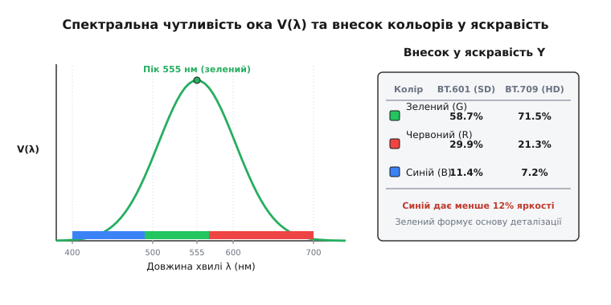
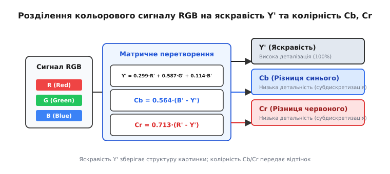
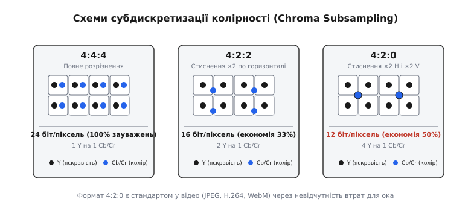

# Яскравість і колірність

<preknowlist>
- [Спектр частот](root:ph-waves/frequency-spectrum) — розкладання оптичного випромінювання на спектральні складові.
- [Довжина хвилі](root:ph-waves/wavelength) — просторовий період світлової хвилі, який визначає її колір у видимому діапазоні.
</preknowlist>

Коли електромагнітне випромінювання видимого діапазону попадає на сітківку людського ока, зорова система не реєструє спектральний склад світла як незалежний тривимірний масив для кожного мікрона поверхні. Анатомічна та біохімічна будова сітківки розрізняє просторові деталі високої роздільної здатності виключно за рахунок загальної інтенсивності світла (ахроматичного контрасту), тоді як інформація про спектральний розподіл (колір) зчитується з набагато нижчою просторовою щільністю. Якщо передавати оптичне зображення у вигляді трьох окремих повнорозмірних каналів Червоного, Зеленого та Синього спектра (RGB), понад дві третини переданих даних виявляться абсолютно надлишковими для людського сприйняття. Фізичною та технологічною основою стиснення оптичної інформації стало розділення світлового сигналу на дві незалежні складові: **яскравість** (Luminance / Luma), яка зберігає геометрію та контури об'єктів, та **колірність** (Chrominance / Chroma), яка описує спектральний зсув світла.

## Фізика світлового випромінювання та спектральна чутливість ока

Світло як електромагнітна хвиля описується спектральною густиною енергетичної яскравості `L_e(λ)`, яка показує, яка потужність випромінювання припадає на одиницю площі, одиницю тілесного кута та одиницю довжини хвилі. Проте людське око чутливе не до абстрактної енергетичної потужності у ватах, а до фотометричної яскравості `L_v`, вираженої в канделах на квадратний метр (кд/м²).

Перехід від фізичної енергії хвилі до її зорового сприйняття визначається спектральною чутливістю сітківки. Процес фототрансдукції починається у мембранних дисках фоторецепторів, де фотони світла поглинаються молекулами зорових пігментів (родопсину та фотопсинів). Поглинання фотона викликає 11-цис до транс-ізомеризацію хромофора ретиналю, що запускає ферментативний каскад активації білка трансдуцину, гідролізу циклічного ГМФ (цГМФ), закриття натрієвих каналів мембрани та гіперполяризацію фоторецепторної клітини.

У сітківці ока розміщені два анатомічно та функціонально відмінні типи фоторецепторів:
- **Палички (Rods):** Забезпечують скотопічний (нічний) зір. Вони мають надзвичайно високу чутливість до поодиноких фотонів, але не розрізняють кольори. Їхній спектральний максимум лежить біля довжини хвилі `507` нм (синьо-зелена область). Щільність паличок максимальна на периферії сітківки і дорівнює нулю в самому центрі центральної ямки.
- **Колбочки (Cones):** Забезпечують фотопічний (денний) зір та колірне сприйняття. Вони зосереджені переважно у центральній ямці сітківки (fovea centralis) та поділяються на три типи за спектральною чутливістю закладених у них білків-опсинів: `S-колбочки` (Short wavelength, пік `420` нм, синій), `M-колбочки` (Medium wavelength, пік `534` нм, зелений) та `L-колбочки` (Long wavelength, пік `564` нм, червоно-жовтий).

Загальна фотометрична чутливість ока у денних умовах описується нормованою функцією `V(λ)`, прийнятою Міжнародною комісією з освітлення (CIE). Ця функція є результатом сумування та обробки сигналів від `L-` та `M-колбочок` у гангліонарних клітинах сітківки.


*Спектральна чутливість ока V(λ) з піком на 555 нм та порівняльний внесок червоного, зеленого й синього кольорів у сформовану яскравість за стандартами BT.601 та BT.709.*

Функція `V(λ)` має чіткий асиметричний пік на довжині хвилі `555` нм, що відповідає смарагдово-зеленому світлу. Це означає, що фотон із довжиною хвилі `555` нм викликає у свідомості відчуття значно більшої яскравості, ніж фотон синього (`450` нм) або темно-червоного (`680` нм) спектра аналогічної енергії. При переході від денного зору до нічного пік чутливості ока зсувається від `555` нм до `507` нм — оптичний ефект, відомий як зсув Пуркінє (Purkinje effect).

Коли око сприймає складне біле або кольорове світло, сформована яскравість є вагованою сумою спектральних інтенсивностей. Оскільки `S-колбочки` (сині) складають менше 6% від загальної кількості колбочок у центральній ямці сітківки і практично не беруть участі у нейронному каналі формування контурної чіткості, внесок синього світла у відчуття яскравості є мінімальним (менше 12%). Зелене ж світло попадає в область максимального перекриття чутливості `L-` та `M-колбочок`, через що воно забезпечує від 59% до 71% всієї сприйнятої яскравості зображення.

Історично розуміння цієї асиметрії дозволило інженерам створити сумісні системи кольорового телебачення у середині XX століття. Про те, як обмеження радіочастотного спектра та потреба зберегти працездатність мільйонів чорно-білих телевізорів привели до створення стандартів NTSC, PAL та SECAM, докладно описано у вставці [📜 Історія розділення світла на яскравість і колірність у кольоровому телебаченні](root:ph-waves/luminance-chrominance/hist-tv-color.md).

## Оптико-фізіологічний механізм розділення зорових каналів

У зоровому нерві інформація від фоторецепторів не передається у вигляді трьох прямих сигналів від `R`, `G` та `B` колбочок. Вже на рівні біполярних та гангліонарних клітин сітківки відбувається первинне аналогове матрицювання — так зване оппонентне кодування кольору (Opponent-process theory), висунуте Евальдом Герінгом (Ewald Hering).

Сітківка формує три незалежні нейронні канали:
1. **Ахроматичний канал (Luminance Channel):** Підсумовує сигнали від `L-` та `M-колбочок` (`L + M`). Цей канал має найвищу просторову роздільну здатність і передається у латеральне колінчасте тіло (LGN) головного мозку через магноцелюлярний шлях (Magnocellular pathway). Він відповідає за сприйняття форм, дрібних контурів, руху, стереоскопічної глибини та деталізованої текстури.
2. **Червоно-зелений оппонентний канал:** Обчислює різницю між сигналами `L-` та `M-колбочок` (`L - M`).
3. **Синьо-жовтий оппонентний канал:** Обчислює різницю між сумою `(L + M)` та сигналом `S-колбочок` (`(L + M) - S`).

Колірні оппонентні канали передаються через парвоцелюлярний (Parvocellular) та коніоцелюлярний шляхи головного мозку, які мають набагато меншу частотно-просторову пропускну здатність та нижчу швидкість проведення імпульсу. Первинна зорова кора (зонова область V1) обробляє ахроматичні контури через орієнтаційно-вибіркові нейрони простих та складних клітин, тоді як кольорові сигнали аналізуються у спеціалізованих клітинних накопичувачах — цитохромоксидазних плямах (blobs).

Здатність ока розрізняти дрібні деталі описується просторово-частотною контрастною чутливістю (Contrast Sensitivity Function — CSF). Для ахроматичних змін яскравості максимум чутливості ока припадає на просторову частоту `3–5` циклів на кутову градусну міру. Око здатне помічати зміни яскравості аж до просторової частоти `30–50` циклів/градус (що відповідає граничній роздільній здатності зору в 1 кутову мінуту).

Проте для хроматичних змін (наприклад, для чергування червоних і зелених смуг однакової фотометричної яскравості) контрастна чутливість ока стрімко падає вже після `2–4` циклів/градус. Око просто не бачить високочастотних колірних перепадів: на дрібних деталях колір «зливається» з навколишнім тлом, і сприйняття повністю переключається на яскравісний контур.

Цей оптико-фізіологічний факт означає, що розрізнення кольорових деталей зображення у `4–8` разів гірше, ніж розрізнення яскравостних деталей. Отже, передавати колір із такою ж високою просторовою деталізацією, як і яскравість, немає жодного фізичного сенсу.

## Математичне розділення сигналів: від RGB до YCbCr

У комп'ютерній графіці та оптоелектроніці первинне захоплення світла сенсором (або випромінювання пікселями дисплея) відбувається у прямокутній системі координат RGB. Проте канали `R`, `G` та `B` є сильно корельованими між собою: у реальних оптичних сценах природні об'єкти (небо, зелень, обличчя, каміння) мають високий ступінь взаємного зв'язку між інтенсивностями трьох кольорів. Коефіцієнт кореляції між каналами `R` та `G` у типових фотографіях перевищує `0.92`.

Щоб усунути взаємну надлишковість компонентів, виконують ортогональне матричне перетворення колірного простору.


*Принцип розкладання вхідного сигналу RGB на ахроматичну світлоту Y' (Luma) та дві колірнорізницеві компоненти Cb і Cr за допомогою матричного перетворення.*

Матричне перетворення переводить тривимірний вектор `[R, G, B]^T` у новий вектор `[Y', Cb, Cr]^T`, де:
- **`Y'` (Luma) — світлота (ахроматичний сигнал):** Являє собою вагованою сумою гама-корегованих компонентів `R'`, `G'`, `B'`. Вона вимірює загальну інтенсивність світла і містить усю високочастотну структурну інформацію про зображення.
- **`Cb` (Chroma Blue) — блакитна колірнорізницева компонента:** Пропорційна різниці між синім сигналом та світлотою `(B' - Y')`. Вона показує відхилення кольору від сірого в бік синьо-жовтої осі.
- **`Cr` (Chroma Red) — червона колірнорізницева компонента:** Пропорційна різниці між червоним сигналом та світлотою `(R' - Y')`. Вона показує відхилення кольору від сірого в бік червоно-зеленої осі.

Значення зеленого кольору `G'` не потрібно передавати окремим каналом, оскільки воно математично відновлюється на стороні приймача з `Y'`, `Cb` та `Cr`:

```
G' = Y' - (W_r / W_g)·(R' - Y') - (W_b / W_g)·(B' - Y')
```

Математичні формули перетворення залежать від спектральних характеристик люмінофорів та первинних кольорів конкретного стандарту:
- **Стандарт ITU-R BT.601 (SDTV):** Використовується для відео стандартної роздільної здатності. Рівняння яскравості має вигляд:

```
Y' = 0.2990·R' + 0.5870·G' + 0.1140·B'
```

- **Стандарт ITU-R BT.709 (HDTV / sRGB):** Розроблений для高清 відео 1080p. Через зміну координати зеленого люмінофора ваговий коефіцієнт зеленого зростав:

```
Y' = 0.2126·R' + 0.7152·G' + 0.0722·B'
```

- **Стандарт ITU-R BT.2020 (UHDTV 4K/8K):** Застосовується для відео надвисокої чіткості з розширеним колірним охопленням (WCG):

```
Y' = 0.2627·R' + 0.6780·G' + 0.0593·B'
```

Детальні математичні виведення вагових коефіцієнтів із функцій додавання кольорів CIE 1931, аналіз нелінійності гама-корекції, а також прямі й зворотні матриці квантування для 8-бітних та 10-бітних систем наведено у вставці [🧮 Математичні основи яскравості та матричних перетворень колірності](root:ph-waves/luminance-chrominance/math-luminance-transform.md).

## Фізика та схеми субдискретизації колірності (Chroma Subsampling)

Після того як сигнал RGB математично розділено на яскравість `Y'` та колірність `Cb, Cr`, з'являється можливість застосувати субдискретизацію колірності (Chroma Subsampling) — фізичне зменшення частоти дискретизації колірних каналів без зміни роздільної здатності каналу яскравості.

Позначення субдискретизації записується у вигляді тричі членної пропорції `A:B:C` (наприклад, `4:4:4`, `4:2:2`, `4:2:0`), де:
- `A` — ширина концептуального блоку вибірки (завжди дорівнює `4` пікселям);
- `B` — кількість відліків колірності `Cb` та `Cr` у першому рядку з `4` пікселів;
- `C` — кількість відліків колірності у другому рядку з `4` пікселів (або `0`, якщо колірні відліки повторюються з першого рядка).


*Схеми розташування відліків яскравості Y та колірності Cb/Cr у сітці пікселів для режимів 4:4:4, 4:2:2 та 4:2:0.*

Розглянемо основні схеми субдискретизації, що використовуються у сучасній оптиці та відеоінженерії:

1. **Формат 4:4:4 (без субдискретизації):**
   Кожен окремий піксель має власне унікальне значення `Y'`, власний відлік `Cb` та власний відлік `Cr`.
   - Обсяг даних: 24 біти на піксель (bpp) у 8-бітному поданні.
   - Застосування: Професійний кіномонтаж, студійна кольорокорекція, комп'ютерна графіка з дрібним шрифтом (Chroma Keying).

2. **Формат 4:2:2 (горизонтальне стиснення ×2):**
   Канал яскравості `Y'` обчислюється для кожного пікселя, але сигнали колірності `Cb` та `Cr` усреднюються по горизонталі для кожної пари сусідніх пікселів. На 4 пікселі у рядку припадає 4 відліки `Y'` та лише 2 відліки `Cb/Cr`.
   - Просторова роздільна здатність колірності: 50% по горизонталі, 100% по вертикалі.
   - Обсяг даних: 16 біт на піксель (заощадження 33% смуги пропускання).
   - Застосування: Професійне телевізійне мовлення (ProRes 422, XDCAM), відеозапис у напівпрофесійних камерах.

3. **Формат 4:2:0 (просторове стиснення ×2 по H та ×2 по V):**
   Найважливіший формат у сучасних цифрових медіа. Колірні компоненти `Cb` та `Cr` усереднюються для квадрата з 4 пікселів `(2×2)`. На квадрат із 4 пікселів припадає 4 відліки `Y'` та всього 1 спільний відлік `Cb` і 1 відлік `Cr`.
   - Просторова роздільна здатність колірності: 50% по горизонталі та 50% по вертикалі (1/4 від повної площі).
   - Обсяг даних: 12 біт на піксель (заощадження 50% обсягу даних ще до застосування архіваторів!).
   - Застосування: Основний стандарт для фотографій JPEG, потокового відео (YouTube, Netflix), відеокодеків H.264, H.265 (HEVC), AV1, Blu-ray дисків.

Оскільки око практично не здатне помітити відсутність колірної деталізації на масштабі окремого пікселя, формат `4:2:0` забезпечує 50-відсоткове зменшення обсягу оперативної пам'яті та мережевого трафіку без жодного видимого погіршення якості для спостерігача.

Практичний алгоритм швидкого обчислення YCbCr із використанням цілочисельної арифметики з фіксованою комою та паралельною субдискретизацією 4:2:0 наведено у вставці [⚙️ Алгоритм швидкого перетворення RGB у YCbCr та субдискретизації колірності](root:ph-waves/luminance-chrominance/proj-color-converter.md).

## Оптико-електронні застосування: від датчиків камери до кодеків

Принцип розділення на яскравість і колірність пронизує весь тракт обробки оптичного сигналу — від фізичного фотодетектора до поверхні дисплея.

### 1. Сенсори зображення та фільтр Байєра (Bayer Pattern)

Фізичні напівпровідникові фотодіоди у КМОН-сенсорах (CMOS) є монохромними: вони реєструють лише кількість падаючих фотонів незалежно від довжини хвилі. Щоб отримати кольорове зображення, поверх матриці фотодіодів накладається масив мікроскопічних світлофільтрів — фільтр Байєра.

У масиві Байєра `50%` усіх пікселів покриті зеленими фільтрами (G), `25%` — червоними (R) та `25%` — синіми (B). Така пропорція `2:1:1` вибрана саме тому, що зелені пікселі формують основу фотометричної яскравості `Y'`. Процес інтерполяції недостатніх кольорів у кожній точці (демозаїка / Demosaicing) в першу чергу відновлює високочастотну площину яскравості за зеленим каналом, а потім накладає гладкі колірні компоненти.

### 2. Специфікація форматів пам'яті у відеосистемах

Під час передачі нестисненого відео між цифровим процесором обробки сигналів (ISP), оперативною пам'яттю та відеокартою використовуються суворо регламентовані батові формати розташування компонентів `Y`, `Cb` та `Cr` (такі як `NV12`, `NV21`, `I420`, `YUY2`).

Детальний опис структурування буферів у пам'яті, розрахунок вирівнювання рядків (stride) та специфікацію FourCC-кодів викладено у довіднику [📋 Специфікація та формати пам'яті піксельних даних YUV і YCbCr](root:ph-waves/luminance-chrominance/api-pixel-formats.md).

> 🔧 **Навіщо це.**
> Розуміння розділення на яскравість і колірність є фундаментальним для розробників систем комп'ютерного зору (Computer Vision), робототехніки та обробки відео. У задачах виявлення контурів, розпізнавання об'єктів (OpenCV, YOLO) та оптичного потоку (Optical Flow) алгоритми працюють виключно з одноканальним ахроматичним зображенням `Y'` (Grayscale). Це зменшує обсяг обчислень утричі порівняно з обробкою трьох каналів RGB, зберігаючи 100% інформації про геометрію та межі об'єктів. З іншого боку, алгоритми сегментації за кольором (наприклад, відстеження шкіри обличчя або дорожніх знаків) переводять зображення у простори колірності, де відтінок не залежить від тіней та коливань освітленості.

### 3. Компресія зображень та відео (JPEG, H.264, HEVC)

Усі сучасні стандарти стиснення відео та зображень будуються на триетапній конвеєрній обробці:
1. **Перетворення колірного простору:** `RGB → YCbCr` (decorrelation).
2. **Просторова субдискретизація:** Переведення колірності у формат `4:2:0` (усунення психофізіологічної надлишковості зору).
3. **Частотна трансформація та квантування:** Застосування дискретного косинусного перетворення (DCT) або перетворення Адамара окремо до блоків `Y'` та блоків `Cb/Cr`. Оскільки матриця квантування колірності `Cb/Cr` відкидає високі частоти набагато агресивніше, ніж матриця яскравості `Y'`, файли стискаються у `10–20` разів без видимих оком артефактів.

### 4. Розширений динамічний діапазон (HDR) та нові колірні простори

Із появою дисплеїв із розширеним динамічним діапазоном (High Dynamic Range — HDR), здатних відтворювати пікову яскравість понад `1000`–`4000` кд/м², стандартне перетворення Luma виявило свої обмеження. У стандартах **HDR10** та **Dolby Vision** використовуються нові оптико-математичні простори:
- **Простір ICtCp (ITU-R BT.2100):** Розроблений Dolby Laboratories для HDR. Компонента `I` (Intensity) описує яскравість із урахуванням абсолютної кривої сприйняття PQ (Perceptual Quantizer, ST 2084), а компоненти `Ct` (Tritan) та `Cp` (Protan) описують колірність з високим ступенем ізотропності.
- **Простір CIE L\*a\*b\*:** Описує яскравість через сприйняту світлоту `L*` (Lightness) та хроматичні осі `a*` (зелений-червоний) і `b*` (синій-жовтий), забезпечуючи евклідову метрику для розрахунку колірних відмінностей `ΔE`.

## Фізико-технічні особливості кольорометричного квантування

При розробці систем візуалізації та цифрової обробки зображень ключовим викликом є запобігання появі зорових артефактів квантування (Color Banding), які виникають під час дигресії суцільних колірних градієнтів на дискретні рівні інтенсивності. 

У 8-бітному поданні на кожен колірний канал припадає всього 256 дискретних рівнів. Оскільки око чутливе до відносних змін яскравості `ΔY / Y` (законом Вебера — Фехнера ця межа становить близько 1%), у темних ділянках зображення крок квантування в 1 біт виявляється більшим за поріг розрізнення зору. Це призводить до виникнення видимих ступенів світлості.

Для усунення цього дефекту в сучасних оптичних системах застосовуються такі інженерні прийоми:
- **Дизеринг (Spatial / Temporal Dithering):** Додання мікроскопічного високочастотного шуму перед процедурою квантування, що усереднює дискретні рівні та створює для ока ілюзію плавного градієнта.
- **Перехід на 10-бітну та 12-бітну дискретизацію (High Bit-Depth):** Використання 1024 або 4096 рівнів квантування на канал, що повністю усуває видимість кроків дискретизації навіть на екстремально яскравих HDR-панелях.
- **Застосування нелінійних оптичних передавальних функцій (OETF / EOTF):** Оптимізація рівнів квантування відповідно до логарифмічної або степеневої чутливості сітківки.

## Колориметрична стандартизація та простори рівномірної колірності

Паралельно з розвитком відеоінженерії у фізичній оптиці розвивався напрямок вимірювання колірності через колориметричні системи CIE (Commission Internationale de l'Éclairage). У 1931 році було прийнято колірну діаграму хроматичності `(x, y)`, у якій будь-яке оптичне випромінювання описується хроматичними координатами:

```
x = X / (X + Y + Z)
y = Y / (X + Y + Z)
```

Діаграма `(x, y)` має формений вигляд підкови, кути якої відповідають чистим спектральним монохроматичним довжинам хвиль від `380` нм до `700` нм, а центр описує ахроматичну точку білого кольору `(0.3127, 0.3290)`.

Головним недоліком діаграми CIE 1931 `(x, y)` була її колориметрична неізотропність: однакова Евклідова відстань `Δ = √((Δx)² + (Δy)²)` у зеленій області діаграми відповідала невідчутній для ока зміні відтінку, тоді як у синій або червоній області така ж відстань викликала різкий стрибок кольору (еліпси МакАдама — MacAdam ellipses).

Для подолання цієї неізотропності у 1976 році було розроблено простори рівномірної колірності **CIE 1976 UCS (`u'v'`)** та **CIE L\*a\*b\***:
- У просторі `u'v'` геометрична відстань між двома точками є пропорційною до психофізіологічного порогу розрізнення відтінків.
- У просторі `CIE L*a*b*` світлота `L*` описує яскравісний канал через нелінійну функцію кубічного кореня `(Y / Y_n)^(1/3)`, а компоненти `a*` та `b*` описують червоно-зелену та синьо-жовту хроматичні осі.

Сучасні спектрофотометри та колориметри обчислюють відхилення кольору продукції (наприклад, у поліграфії, виробництві лаків та матриць моніторів) через колірну різницю `ΔE_00` (CIEDE2000), яка спирається саме на рівномірне розділення яскравої та колірної компонентів.

## Психофізіологічний аналіз зорових артефактів субдискретизації

Незважаючи на високу ефективність субдискретизації 4:2:0, у певних граничних оптичних умовах зменшення просторової частоти колірності стає помітним для людського ока у вигляді специфічних зорових артефактів:

1. **Кольоровий витік (Color Bleeding / Smearing):**
   На межі між двома об'єктами з однаковою яскравістю, але контрастними кольорами (наприклад, яскраво-зелений текст на яскраво-червоному тлі) усереднений відлік колірності розмивається на 2 пікселі. В результаті колір «вилазить» за контур об'єкта, утворюючи брудну помаранчеву смугу на межі.
2. **Ніші та розриви дрібних кольорових ліній (Chroma Ringing / Aliasing):**
   Під час відображення векторного тексту або графічного інтерфейсу (UI) товщиною в 1 піксель колірний канал 4:2:0 не здатний передати точну прив'язку кольору до конкретної лінії. Символи товщиною в 1 піксель набувають різнокольорових ореолів (переважно пурпурового та зеленого відтінків).

Саме з цієї причини у комп'ютерних операційних системах (Windows, macOS, Linux Desktop) виведення зображення на монітор через інтерфейси HDMI та DisplayPort за замовчуванням здійснюється у форматі **RGB Full** або **YCbCr 4:4:4** без субдискретизації, щоб гарантувати абсолютну чіткість шрифтів та графічних елементів. Формати ж 4:2:0 та 4:2:2 застосовуються переважно для динамічного відеоконтенту та кінематографа, де очне яблуко не фіксується на попіксельних контрастах стаційного тексту.

## Підсумок

Розділення світла на яскравість і колірність — це не просто математичний трюк для кодування пікселів, а глибоке відображення адаптації людського зору до фізичного світу. Еволюційно зорова система людини сформувалася так, щоб бачити хижаків, перешкоди та геометрію простору через високочастотний ахроматичний канал яскравості, залишаючи колірному каналу роль додаткового спектрального індикатора.

Завдяки узгодженню математичних матриць перетворення `RGB → YCbCr` з анатомічною будовою сітківки сучасному інженерному світу вдалося скоротити обсяг переданих оптичних даних у рази. Від аналогових кінескопів середини XX століття до найсучасніших нейромережевих відеокодеків 8K HDR, розділення на яскравість і колірність залишається наріжним каменем усієї цифрової оптики та обробки зображень.
