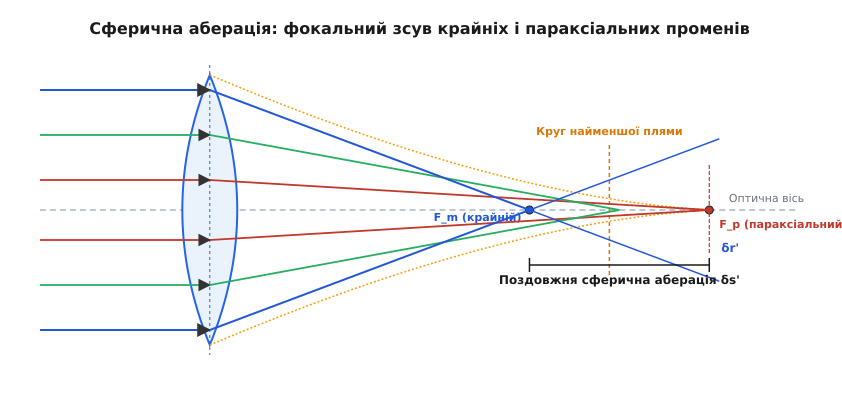
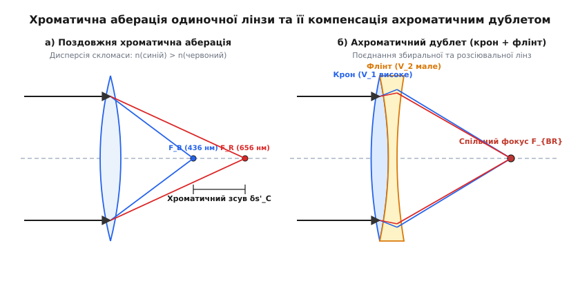
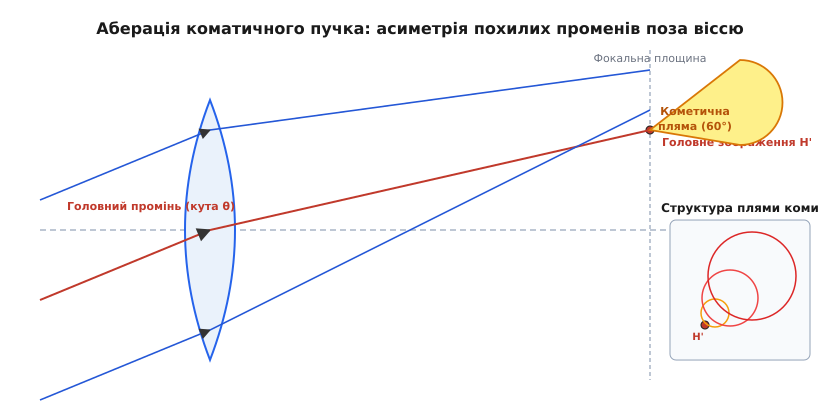
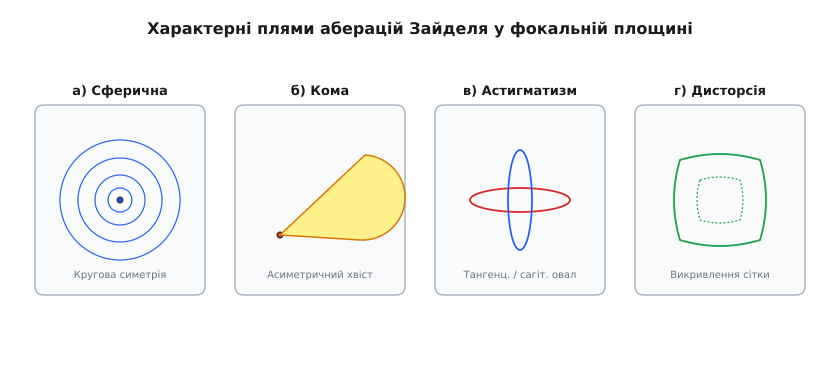

# Оптичні аберації: сферична, хроматична та кома

<preknowlist>
- [Закон Снелла](root:ph-waves/snells-law) — заломлення світла на межі двох середовищ за показниками заломлення.
- [Оптична дисперсія](root:ph-waves/optical-dispersion) — залежність показника заломлення матеріалу від довжини хвилі світла.
- [Принцип Ферма](root:ph-waves/fermat-principle) — поширення світла по шляху з екстремальним оптичним часом.
</preknowlist>

Якщо ідеально поліровану скляну сферичну лінзу діаметром 100 мм і фокусною відстанню 200 мм виготовити з одного шматка крону K8 і спрямувати на неї паралельний пучок білого світла, замість точкового фокуса у фокальній площині утвориться розмита пляма діаметром понад 0.8 мм із синьо-червоною облямівкою. Крайові промені, що проходять крізь периферію лінзи, заломлюються сильніше за параксіальні й перетинають оптичну вісь на 3.4 мм ближче до скла, а сині хвилі з довжиною 436 нм фокусуються на 4.2 мм ближче за червоні хвилі 656 нм. Це відхилення реального світлового фронту від ідеальної сферичної хвилі називають **оптичною аберацією** (*optical aberration*, від латинського *aberratio* — відхилення, блукання). Спотворення руйнує чіткість у мікроскопах, розмиває астрономічні знімки телескопів та встановлює межу роздільної здатності фотолітографічних установок виготовлення сучасних напівпровідникових мікросхем.

### 1. Природа оптичних аберацій та межі параксіальної моделі

Базові закони геометричної оптики, які викладаються у навчальних курса— формула тонкої лінзи та побудова зображень за допомогою трьох променів — спираються на **параксіальне наближення** (*paraxial approximation*, або наближення Гаусса). У цій спрощеній модельній картині припускається, що всі промені поширюються під надзвичайно малими кутами `θ` відносно оптичної осі, а світлові пучки проходять строго поблизу центрального полюса лінзи.

Параксіальна модель дозволяє замінити тригонометричну функцію синуса в законі заломлення Снелла `n₁ · sin θ₁ = n₂ · sin θ₂` першим лінійним членом його розкладу в ряд Тейлора:

```
sin θ = θ - (θ³ / 3!) + (θ⁵ / 5!) - ... ≈ θ     [Параксіальне наближення]
```

За цієї умови будь-яка сферична заломлювальна поверхня відображає гомоцентричний пучок променів (що виходить з однієї точки предмета) у стигматичний гомоцентричний пучок (що точно збирається в одну точку зображення). Проте у реальних оптичних приладах — об'єктивах фотокамер, телескопах, мікроскопах — апертура (діаметр лінзи) та кут поля зору мають кінцеві фізичні розміри. При збільшенні кута падіння променів відхилення синуса від лінійного значення `θ` стрімко зростає.

Якщо врахувати наступний кубічний член розкладу `sin θ ≈ θ - θ³ / 6`, виникають геометричні відхилення третього порядку, які називають **монохроматичними абераціями Зайделя**. Якщо ж врахувати залежність показника заломлення скла від довжини хвилі `n(λ)`, до геометричних аберацій додаються **хроматичні аберації**.

Фізично аберацію можна описувати у двох взаємодоповнювальних формах:

1. **Хвильова аберація** `W(x, y)` — вимірюється в нанометрах або довжинах хвиль `λ` і визначає оптичну різницю ходу між реальним викривленим хвильовим фронтом та ідеальною порівняльною сферою в площині вихідної зіниці.
2. **Променева (поперечна) аберація** `(δx, δy)` — вимірюється в мікронах на фокальній площині і показує лінійне зміщення точки перетину реального світлового променя від параксіальної точки зображення.

Хвильова та променева аберації пов'язані градієнтним співвідношенням: поперечна аберація пропорційна частинній похідній від хвильової аберації за координатами зіниці. Детальний математичний апарат розкладу хвильового фронту наведено у вставці [Математичний апарат хвильових аберацій Зайделя](root:ph-waves/optical-aberrations/math-seidel-polynomials.md).

### 2. Сферична аберація: геометрія, фокальний зсув та каустичні поверхні

**Сферична аберація** (*Spherical Aberration*) — це єдина геометрична аберація монохроматичного світла, яка виникає для точкового джерела, розташованого безпосередньо на оптичній осі системи.

Причиною сферичної аберації є геометрія сферичної поверхні лінзи. Сферична поверхня має однакову кривину в усіх точках. Проте для заломлення паралельного пучка світла в одну точку зовнішні (маргінальні) зони лінзи повинні мати меншу кривину, ніж центральні. Оскільки сферична поверхня на краях нахилена сильніше, ніж потрібно для ідеального фокусування, крайові промені заломлюються на більший кут і перетинають оптичну вісь ближче до лінзи, ніж параксіальні промені.


*Сферична аберація двоопуклої лінзи: фокальний зсув між крайовими променями F_m та параксіальними F_p утворює каустичну поверхню та круг найменшого розмиття.*

Внаслідок цього замість єдиної фокальної точки виникає цілий відрізок фокусування уздовж оптичної осі:

- **Параксіальний фокус** `F_p` — точка перетину променів, що проходять уповздовж самісінької оптичної осі.
- **Маргінальний (крайовий) фокус** `F_m` — точка перетину променів, що проходять крізь самий край апертури.

Відстань між цими точками `δs' = z(F_m) - z(F_p)` називають **поздовжньою сферичною аберацією** (*longitudinal spherical aberration*). Для простої збиральної лінзи крайовий фокус завжди лежить ближче до скла, тому поздовжня аберація є негативною (`δs' < 0`).

Сукупність перетинів усіх суміжних заломлених променів у просторі утворює огинальну поверхню високої інтенсивності світла — **каустику** (*caustic surface*). Якщо розмістити матову екранну пластину у фокальній площині параксіального фокуса `F_p`, точкове джерело відобразиться у вигляді яскравої центральної точки, оточеної широким світлим ореолом розмиття радіуса `δr'`.

Якщо переміщати екран від `F_m` до `F_p`, діаметр плями світла спочатку зменшується, досягає мінімуму, а потім знову розширюється. Площина, де поперечний переріз пучка променів має найменший діаметр, називається **кругом найменшого розмиття** (*Circle of Least Confusion*). Для третього порядку Зайделя ця площина розташована на трьох чвертях відстані від маргінального фокуса до параксіального:

```
z_LC = z(F_m) + (3 / 4) · |δs'|     [Розташування круга найменшої плями]
```

Діаметр круга найменшого розмиття становить рівно чверть від максимальної поперечної аберації `δr'` у параксіальному фокусі. Саме у цій площині оптичні інженери налаштовують фокусування, якщо сферичну аберацію неможливо повністю усунути.

#### Способи компенсації сферичної аберації

1. **Орієнтація та форма лінзи (формофактор):** Сферична аберація плоско-опуклої лінзи сильно залежить від того, яким боком вона повернена до падаючого світла. Якщо паралельний пучок падає на пласку сторону, все заломлення відбувається лише на другій сферичній поверхні, що створює величезну сферичну аберацію. Якщо ж розвернути лінзу опуклою стороною до пучка, заломлення розподіляється між двома поверхнями рівномірніше, що зменшує сферичну аберацію у 4 рази.
2. **Асферичні поверхні (*Aspheric lenses*):** Надання поверхні лінзи форми витягнутого еліпсоїда або гіперболоїда обертання повністю усуває сферичну аберацію для паралельного пучка. Завдяки сплющенню кривини на краях асферична лінза фокусує всі промені в одну точку.Сучасні технології алтамазного виточування та магнітореологічного полірування дозволяють масово виготовляти асферичні елементи для об'єктивів смартфонів і дзеркальних фотокамер.
3. **Параболічні дзеркала:** У відбивних телескопах (системи Ньютона) заміщення сферичного дзеркала на параболічне повністю усуває сферичну аберацію на оптичній осі для нескінченно віддалених джерел.

### 3. Хроматична аберація: поздовжня, поперечна та ахроматичні дублети

**Хроматична аберація** (*Chromatic Aberration*) виникає внаслідок дисперсії світла — фізичного явища залежності показника заломлення оптичного матеріалу `n` від довжини хвилі `λ`. Для всіх прозорих стекол показник заломлення для синьо-фіолетового світла вищий, ніж для червоного (`n(синій) > n(червоний)`).

Згідно з формулою тонкої лінзи, фокусна відстань `f'` обернено пропорційна величині `(n - 1)`:

```
1 / f' = (n - 1) · (1 / R₁ - 1 / R₂)     [Формула оптичної сили тонкої лінзи]
```

Оскільки `n(синій) > n(червоний)`, синій колір заломлюється сильніше за червоний і фокусується ближче до лінзи.


*Поздовжня хроматична аберація одиночної лінзи (а) та її усунення поєднанням кронового і флінтового скла в ахроматичному дублеті (б).*

Розрізняють два види хроматичних спотворень:

#### А. Поздовжня хроматична аберація (LCA / CHL)
**Поздовжня хроматична аберація** (*Longitudinal Chromatic Aberration*) — це відстань `δs'_C` вздовж оптичної осі між фокусами червоного `F_R` (`656 нм`) та синього `F_B` (`436 нм`) променів:

```
δs'_C = z(F_R) - z(F_B) = f' / V_d     [Поздовжня хроматична аберація]
```

де `V_d` — **число Аббе** матеріалу лінзи. Для звичайного кронового скла (`V_d ≈ 60`) фокусна відстань для синього та червоного кольорів відрізняється приблизно на `1/60` (або `1.67%`) від номінальної фокусної відстані. Якщо налаштувати матрицю камери на зелений фокус, то навколо яскравих білих точок виникне розмитий пурпуровий (суміш незфокусованого червоного та синього) ореол.

#### Б. Поперечна хроматична аберація (TCA / CHT)
**Поперечна хроматична аберація** (*Transverse Chromatic Aberration*, або хроматизм збільшення) спостерігається для точок, розташованих поза оптичною віссю. Оскільки фокусні відстані для різних кольорів відрізняються, поперечне оптичне збільшення системи `β(λ)` також стає функцією довжини хвилі. 

У результаті синє зображення об'єкта має дещо інший масштаб, ніж червоне. На периферії кадру виникають кольорові контури (кольоровий зсув країв контрастних об'єктів), причому на самій оптичній осі поперечний хроматизм дорівнює нулю.

#### Конструювання ахроматичних та апохроматичних систем

Для усунення хроматичної аберації застосовують поєднання лінз із різних сортів скла:

1. **Ахроматичний дублет (Ахромат):** Складається із збиральної (позитивної) лінзи, виготовленої з кронового скла з високим числом Аббе (`V₁ ≈ 60`), та розсіювальної (негативної) лінзи з флінтового скла з високою дисперсією та низьким числом Аббе (`V₂ ≈ 36`). Негативна лінза компенсує розщеплення кольорів позитивної лінзи, але завдяки вищій дисперсії флінту вона не повністю скасовує загальну позитивну оптичну силу. Ахромат зводить у єдиний фокус дві довжини хвилі (зазвичай червону `C` і синьо-зелену `F`).
2. **Апохромат (Апохроматична система):** Поєднує три або більше лінзи із застосуванням особливих стекол з аномальною частковою дисперсією (наприклад, флуориту `CaF₂` або скла ED — *Extra-low Dispersion*). Апохромат зводить у спільний фокус три довжини хвиль (червону, зелену та синю) і повністю усуває сферичну аберацію для двох кольорів.

### 4. Кома: аберація похилих пучків та апланатичні системи

**Кома** (*Coma*) — це геометрична аберація похилих пучків світла, що виникає для точок предмета, розташованих поза оптичною віссю. Кома є найбільш руйнівною аберацією для широких апертур, оскільки вона порушує симетрію зображення і перетворює точкові джерела світла (наприклад, зорі на краях астрономічного кадру) на розмиті каплеподібні плями, що нагадують комети з хвостом.


*Геометрія виникнення аберації коми для похилого пучка променів під кутом θ та формування характерної каплеподібної плями на фокальній площині.*

#### Фізичний механізм виникнення коми

Коли паралельний пучок світла впадає на лінзу під кутом `θ` до оптичної осі, кільцеві зони лінзи різного радіуса `ρ` діють нерівнозначно. Центральна зона лінзи будує зображення у параксіальній точці `H'`. Проте кільцева зона радіуса `ρ` будує зображення не у точці `H'`, а у вигляді зміщеного кола радіуса `R_k`.

Що більший радіус кільцевої зони лінзи `ρ`, то більшим є діаметр зображуваного кола `R_k` і то далі його центр зміщується від параксіальної точки `H'`. Сукупність усіх кілець від усіх зон лінзи накладається одне на одне, утворюючи світлову пляму у формі сектора з кутом розкриття `60°`. Яскравість плями максимальна у точці «голови» комети `H'` і плавно спадає до її хвоста.

Математично кома визначається двома складовими:
- **Тангенціальна кома** `δy_t` — розмах плями вздовж меридіональної осі.
- **Сагітальна кома** `δy_s` — розмах плями у перпендикулярному напрямку.

У третьому порядку Зайделя між ними існує строге співвідношення:

```
δy_t = 3 · δy_s     [Співвідношення тангенціальної та сагітальної коми]
```

Тангенціальна кома у 3 рази більша за сагітальну. Величина коми зростає лінійно з віддаленням від центра поля зору `H` і квадратично з ростом апертури лінзи `ρ²`.

#### Умова синусів Аббе та апланатичні системи

У 1873 році Ернст Аббе довів, що оптична система повністю позбавлена коми для малих кутів поля зору тоді й лише тоді, коли для всіх променів апертурного пучка дотримується **умова синусів Аббе** (*Abbe Sine Condition*):

```
(n · y · sin u) / (n' · y' · sin u') = const = β     [Умова синусів Аббе]
```

де `n, n'` — показники заломлення середовищ предмета та зображення, `y, y'` — висоти предмета та зображення, а `u, u'` — кути між променем та оптичною віссю у просторі предметів та зображень.

Якщо система задовольняє умову синусів Аббе та не має сферичної аберації, її називають **апланатичною** (*aplanatic*). Апланатичні об'єктиви (наприклад, масляно-імерсійні об'єктиви мікроскопів) дають винятково чітке зображення поблизу осі навіть при дуже високих апертурах.

### 5. Теоретична система Зайделя: п'ять монохроматичних спотворень

Німецький математик Людвіг фон Зайдель у 1856 році систематизував повну картину монохроматичних аберацій третього порядку. Зайдель довів, що будь-яке геометричне спотворення світлового фронту оптичною системою з осьовою симетрією є сумою рівно п'яти базових математичних компонентів.


*Розподіл інтенсивності світла (Spot Diagrams) для п'яти монохроматичних аберацій третього порядку Зайделя.*

Огляд п'яти аберацій Зайделя та їхніх характерних проявів у фокальній площині:

1. **Сферична аберація (`S₁`):** Симетричний круговий ореол розмиття навколо точки зображення на осі та по всьому полю. Залежить від радіуса зіниці як `ρ⁴`.
2. **Кома (`S₂`):** Асиметрична каплеподібна пляма з хвостом під кутом 60°, що виникає поза віссю. Залежить від поля і зіниці як `H · ρ³`.
3. **Астигматизм (`S₃`):** Точкове джерело поза віссю фокусується не в точку, а у два рознесені у просторі взаємно перпендикулярні відрізки — тангенціальну лінію фокуса та сагітальну лінію фокуса. Між ними розташований круг найменшого розмиття. Залежить від поля як `H² · ρ²`.
4. **Кривина поля Зайделя / Петцваля (`S₄`):** Чітке зображення формується не на пласкому датчику, а на викривленій сферичній поверхні (сфера Петцваля). Якщо сфокусувати центр кадру, краї стають розмитими, і навпаки. Умова відсутності кривини Петцваля описується сумою `∑ (Φ_i / n_i) = 0`.
5. **Дисторсія (`S₅`):** Спотворення геометричних пропорцій об'єкта без втрати чіткості точок. Виникає через нелінійну зміну оптичного збільшення `β` по полю зору. Розрізняють **бочкоподібну дисторсію** (*barrel distortion*, зменшення збільшення на краях) та **подушкоподібну дисторсію** (*pincushion distortion*, збільшення на краях). Залежить від куба поля `H³`.

Історичний шлях відкриття цих п'яти коефіцієнтів та боротьбу астрономів XVII–XIX століть описано у вставці [Історія розвитку теорії аберацій: від Ньютона до Зайделя](root:ph-waves/optical-aberrations/hist-seidel-aberrations.md).

### 6. Конструктивні методи компенсації та оптичний дизайн

Сучасний розрахунок оптичних систем — це процес чисельної оптимізації багатолінзових або дзеркально-лінзових (катадіоптричних) конструкцій у спеціалізованих програмах (ZEMAX, Code V, Synopsys). 

Основні інженерні прийоми компенсації аберацій базуються на використанні симетрії та взаємного скасування коефіцієнтів Зайделя різними елементами:

1. **Симетричні об'єктиви (принцип симетрії):** Якщо оптична система складається з двох одинакових компонентів, розміщених симетрично відносно центральної апертурної діафрагми (наприклад, класичний об'єктив *Double Gauss* або *Dagor*), то всі асиметричні аберації непарного порядку за полем — **кома, дисторсія та поперечний хроматизм** — взаємно знищуються для масштабу збільшення 1:1.
2. **Розщеплення оптичної сили:** Заміна однієї сильної лінзи з малою фокусною відстанню на дві або три слабкі лінзи з більшими радіусами кривини драматично зменшує сферичну аберацію. Оскільки сферична аберація зростає квадратично з кутом заломлення, розщеплення кута навпіл між двома поверхнями зменшує сумарну сферичну аберацію майже в чотири рази.
3. **Вибір позиції діафрагми (Stop Shift):** Переміщення апертурної діафрагми вздовж оптичної осі змінює висоти проходження похилих пучків крізь крайні лінзи. Це дозволяє оптичному конструктору керувати величиною коми, астигматизму та дисторсії без зміни сферичної аберації на осі.
4. **Застосування менісків та коррекційних пластин:** У телескопах системи Шмідта (*Schmidt camera*) тонка скляна асферична пластина розміщується у центрі кривини сферичного головного дзеркала. Вона вносить сферичну аберацію, рівну за величиною і протилежну за знаком сферичній аберації дзеркала, забезпечуючи ідеальну чіткість по величезному полю зору.
5. **Телецентричні системи:** У промисловому машинобудуванні та вимірювальній оптиці застосовують телецентричні об'єктиви, у яких апертурна діафрагма розміщена у фокальній площині. Це робить головні промені паралельними оптичній осі у просторі зображень або предметів, що повністю усуває дисторсію та помилки масштабу при поздовжньому зміщенні детальки.

Для чисельного моделювання трасування променів та розрахунку каустичних поверхонь дивіться алгоритми у вставці [Чисельне моделювання трасування променів та абераційних каустик](root:ph-waves/optical-aberrations/proj-ray-tracer.md). Для кількісної оцінки якості системи за допомогою ортогональних поліномів зверніться до довідника [Довідник поліномів Церніке та критеріїв якості зображення](root:ph-waves/optical-aberrations/api-zernike-polynomials.md).

> 🔧 **Навіщо це.**
> Розуміння оптичних аберацій є критичним для проектування будь-яких високоточних світлочутливих приладів. У фотографічній техніці компенсація аберацій визначає роздільну здатність об'єктива (ліній на міліметр). У мікроскопії вищої роздільної здатності апланатичні імерсійні об'єктиви дозволяють досягти фізичної дифракційної межі Аббе (`λ / 2NA`), уможливлюючи спостереження клітинних структур та вірусів. У напівпровідниковій фотолітографії (EUV-літографія з довжиною хвилі 13.5 нм) аберації об'єктива проектування вимагають контролю хвильового фронту з точністю до долей нанометра (`W_RMS < λ / 100`), оскільки будь-яка сферична аберація або кома призводить до викривлення доріжок процесора та шлюбу мікросхем. У сучасній медицині (офтальмології) вимірювання поліномів Церніке хвильового фронту ока за допомогою аберометрів Шака-Гартмана дозволяє здійснювати персоналізовану лазерну корекцію зору (LASIK), виправляючи астигматизм та сферичні аберації рогівки пацієнта.
