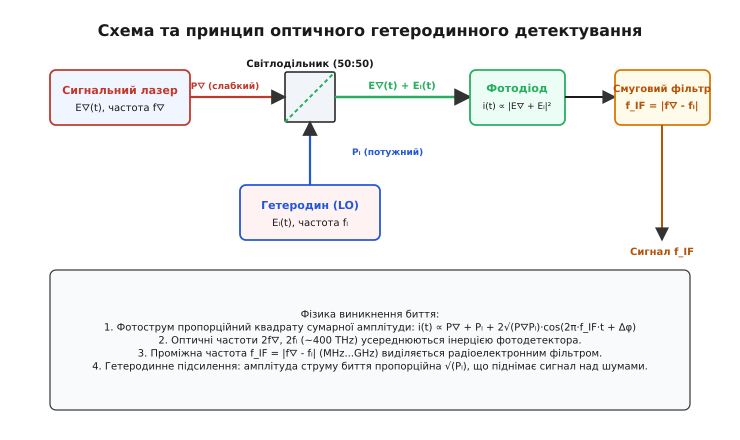
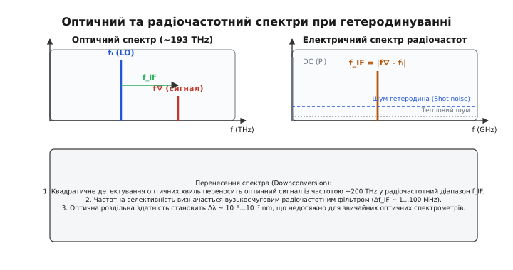
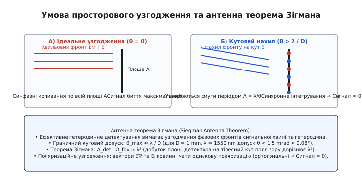
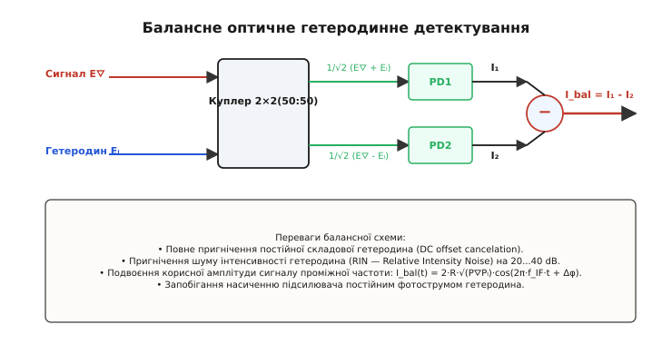

# Оптичне гетеродинне детектування

<preknowlist>
- [Когерентність](topic:ph-waves/coherence) — часова та просторова когерентність світлових хвиль.
- [Дробовий та флікер-шум](topic:ph-condensed/shot-flicker-noise) — дробовий шум фотоструму та квантова межа чутливості.
- [Суперпозиція хвиль](topic:ph-waves/wave-superposition) — інтерференція та складання електромагнітних хвиль на світлочутливісному майданчику.
</preknowlist>

Приймач прямого детектування на основі звичайного фотодіода бачить світлову хвилю з потужністю всього 1 піковат (`10⁻¹² Вт`) як нерозрізнений шум: теплові флуктуації електронів у резисторі навантаження створюють струмовий шум на рівні наноампер, що в сотні разів перевищує корисний фотострум у кілька пікоампер. Більше того, оскільки напівпровідниковий p-n перехід реагує лише на усереднену за часом інтенсивність випромінювання `I(t) ∝ |E(t)|²`, будь-яка інформація про оптичну частоту `f⛛ ~ 193 ТГц` та миттєву фазу хвилі `φ⛛(t)` невідворотно втрачається. Додавання другого когерентного лазера — опорного гетеродина (*local oscillator*) потужністю 1 міліват — змінює ситуацію кардинально. Завдяки оптичній інтерференції двох хвиль фотострум отримує змінну складову на різницевій (проміжній) частоті `f_IF = |f⛛ - fₗ|`. Амплітуда цієї складової пропорційна добутку `√(P⛛ Pₗ)`, що оптично підсилює слабкий сигнал у тисячі разів і виводить його далеко за межі теплових шумів електронної схеми. Метод, що робить це можливим, називається **оптичним гетеродинним детектуванням** (*optical heterodyne detection*, від грецьких слів *ἕτερος* — «інший» та *δύναμις* — «сила»).

### 1. Фізичний механізм квадратичного змішування та проміжна частота

Усі прямовисні оптичні детектори (PIN-фотодіоди, фотоаваланчні діоди, фотопомножувачі) є **квадратичними приймачами** (*square-law detectors*). Причиною цього є квантова природа взаємодії світла з речовиною: ймовірність поглинання фотона та народження електрон-діркової пари в напівпровіднику пропорційна квадрату напруженості електричного поля електромагнітної хвилі `|E(t)|²`.

Розглянемо дві монохроматичні світлові хвилі, що поширюються в одному напрямку та мають однакову поляризацію:

1. **Сигнальна хвиля** (*signal wave*) зі слабкою оптичною потужністю `P⛛`:

```
E⛛(t) = E₀⛛ · cos(ω⛛ · t + φ⛛(t))
```

2. **Опорна хвиля гетеродина** (*local oscillator wave*) з потужністю `Pₗ >> P⛛`:

```
Eₗ(t) = E₀ₗ · cos(ωₗ · t + φₗ(t))
```

де `ω⛛ = 2π·f⛛` та `ωₗ = 2π·fₗ` — колові оптичні частоти (порядок `10¹⁵ рад/с`), а `φ⛛(t)` та `φₗ(t)` — фази відповідних джерел.


*Принцип дії та блок-схема оптичного гетеродинного приймача: сигнальне світло та випромінювання гетеродина об'єднуються на 50:50 світлодільнику і падають на квадратичний фотодетектор, створюючи радіочастотний струм биття f_IF.*

Коли обидва пучки зводяться разом на напівпрозорому світлодільнику (або у волоконному 2×2 куплері) та спрямовуються на світлочутливий майданчик фотодіода, результуюче електричне поле дорівнює сумі полів `E_total(t) = E⛛(t) + Eₗ(t)`.

Фотострум `i(t)`, створюваний детектором, пропорційний квадрату сумарного поля, усередненому за часом відгуку фотодіода `τ_det`:

```
i(t) = R_resp · < (E⛛(t) + Eₗ(t))² >
```

де `R_resp` — спектральна чутливість фотодіода, виражена в амперах на ват (А/Вт).

Розкриваючи квадрат алгебраїчної суми:

```
(E⛛(t) + Eₗ(t))² = E⛛²(t) + Eₗ²(t) + 2 · E⛛(t) · Eₗ(t)
```

Застосуємо формулу добутку косинусів до перехресного члена `2·E⛛(t)·Eₗ(t)`:

```
2·E⛛(t)·Eₗ(t) = E₀⛛·E₀ₗ · cos((ω⛛ - ω◗)t + (φ⛛ - φ◗)) + E₀⛛·E₀◗ · cos((ω⛛ + ω◗)t + (φ⛛ + φ◗))
```

Фізична сутність оптичного гетеродинування полягає у суттєвій різниці між частотними компонентами, що виникають у цій сумі:

1. **Постійні складові фотоструму (DC)**: виникають від додавання постійних інтенсивностей двох хвиль `i_DC = R_resp · (P⛛ + Pₗ)`. Оскільки потужність гетеродина значно перевищує потужність сигналу (`Pₗ >> P⛛`), постійний струм майже повністю визначається гетеродином `i_DC ≈ R_resp · Pₗ`.
2. **Надвисокочастотні оптичні компоненти**: складові з подвоєними частотами `2ω⛛`, `2ω◗` та сумарною частотою `ω⛛ + ω◗` (близько `400 ТГц`) зникають. Фізична інерційність напівпровідника та міжатомних релаксаційних процесів у фотодіоді (часи порядку фемтосекунд) не здатні відстежувати такі високі частоти. Фотодіод інтегрує їх до нуля.
3. **Компонента проміжної частоти (Intermediate Frequency, IF)**: член із різницевою частотою `ω_IF = |ω⛛ - ω◗|`. Якщо частоти лазерів підібрані так, що різниця `f_IF = |f⛛ - fₗ|` лежить у діапазоні від кількох мегагерц до десятків гігагерц, цей член формує змінний радіочастотний фотострум `i_IF(t)`:

```
i_IF(t) = 2 · R_resp · √(P⛛ · Pₗ) · cos(2π · f_IF · t + Δφ(t))
```

де `Δφ(t) = φ⛛(t) - φₗ(t)` — різниця фаз двох лазерних хвиль.

Отже, квадратичне детектування на фотодіоді діє як оптичний аналоговий змішувач: воно лінійно переносить амплітуду й фазу оптичного сигналу з терагерцової частоти `f⛛` у радіочастотну область `f_IF`, де струм можна легко підсилити та фільтрувати класичними радіотехнічними засобами.

### 2. Гетеродинне підсилення, флуктуації вакууму та квантова межа

Найважливішою перевагою гетеродинного детектування є явище **гетеродинного підсилення** (*heterodyne gain*).

Зверніть увагу на амплітуду змінного фотоструму проміжної частоти: `I_IF_peak = 2 · R_resp · √(P⛛ · Pₗ)`. Для порівняння, при прямому детектуванні корисний змінний фотострум дорівнює `i_direct = R_resp · P⛛`.

Відношення амплітуди гетеродинного струму до струму прямого детектування виражається як:

```
G_gain = I_IF_peak / i_direct = 2 · √(Pₗ / P⛛)
```

Якщо на фотодетектор падає слабкий оптичний сигнал потужністю `P⛛ = 1 нВт` (`10⁻⁹ Вт`), а потужність гетеродина становить `Pₗ = 1 мВт` (`10⁻³ Вт`), то підсилення фотоструму дорівнює:

```
G_gain = 2 · √(10⁻³ / 10⁻⁹) = 2 · √10⁶ = 2000
```

Електрична потужність сигналу на виході фотодетектора пропорційна квадрату струму `P_elec = i² · R_load`. Це означає, що за рахунок потужності опорного лазера електрична потужність корисною проміжної частоти підсилюється у `G_power = G_gain² = 4 · (Pₗ / P⛛) = 4 000 000` разів (на 66 децибел!).

Щоб зрозуміти, чому це дозволяє кардинально покращити чутливість приймача, розглянемо співвідношення сигнал/шум (SNR).

У будь-якому оптичному приймачі діють два фундаментальні типи шумів:
1. **Тепловий шум (Johnson-Nyquist noise)** опору навантаження `R_load` та електронного підсилювача:

```
⟨i_thermal²⟩ = (4 · k_B · T / R_load) · B
```

де `k_B` — стала Больцмана, `T` — абсолютна температура, `B` — смуга частот приймача. При кімнатній температурі та смузі `B = 1 ГГц` тепловий шум створює флуктуації струму близько `⟨i_thermal²⟩¹/² ~ 18 нА`. Якщо корисний фотострум прямого детектування становить лише `1 нА` (при `P⛛ = 1 нВт`), сигнал виявляється повністю похованим під тепловим шумом (`SNR << 1`).

2. **Дробовий шум (Shot noise)**, зумовлений дискретною природою електронів та фотонів. Кожен фотон створює електрон випадково у часі за пуассонівським законом. Середньоквадратичні флуктуації дробового шуму від постійного фотоструму гетеродина `I_LO = R_resp · Pₗ` дорівнюють:

```
⟨i_shot²⟩ = 2 · e · I_LO · B = 2 · e · R_resp · Pₗ · B
```

де `e = 1.602×10⁻¹⁹ Кл` — заряд електрона.

Сумарний коефіцієнт сигнал/шум за електричною потужністю у гетеродинному приймачі становить:

```
SNR = ⟨i_IF_rms²⟩ / ( ⟨i_shot²⟩ + ⟨i_thermal²⟩ )
    = ( 2 · R_resp² · P⛛ · Pₗ ) / [ ( 2 · e · R_resp · Pₗ + (4·k_B·T / R_load) ) · B ]
```

Оскільки потужність гетеродина `Pₗ` можна довільно збільшувати, в певний момент дробовий шум гетеродина `2·e·R_resp·Pₗ·B` починає зростати лінійно з `Pₗ` і повністю пригнічує постійний тепловий шум `4·k_B·T / R_load`.

Порогова потужність гетеродина, при якій дробовий шум порівнюється з тепловим, становить:

```
P_threshold = (2 · k_B · T) / (e · R_resp · R_load)
```

Для стандартного фотодіода з чутливістю `R_resp = 0.85 А/Вт` на навантаженні `50 Ом` ця порогова потужність становить лише близько `P_threshold ≈ 0.6 мВт`.

Коли потужність гетеродина перевищує поріг (`Pₗ >> P_threshold`), тепловим шумом можна повністю знехтувати. Потужність гетеродина `Pₗ` у чисельнику та знаменнику скорочується:

```
SNR ≈ (2 · R_resp² · P⛛ · Pₗ) / (2 · e · R_resp · Pₗ · B) = (R_resp · P⛛) / (e · B)
```

Виразивши чутливість через квантову ефективність фотодіода `η` (частку фотонів, що народжують носії заряду) за формулою `R_resp = (η · e) / (h · ν)`:

```
SNR = ( (η · e / h · ν) · P⛛ ) / (e · B) = (η · P⛛) / (h · ν · B)
```

Знаменник `h · ν · B` є енергією фотонів, що надходять за секунду в смузі `B`. Відношення `N_photons = P⛛ / (h · ν · B)` — це кількість сигнальних фотонів, що падають на фотодетектор за час вимірювання `τ = 1 / B`.

Остаточно отримуємо вираз для **квантової межі чутливості**:

```
SNR = η · N_photons
```

#### Квантово-оптична природа дробового шуму

З точки зору квантової електродинаміки, фундаментальною причиною виникнення дробового шуму при гетеродинуванні є проникнення **нульових флуктуацій вакууму** (*vacuum zero-point fluctuations*) з уявним енергетичним рівнем `½ · ℏ · ω` крізь вільний (незадіяний) вхідний порт 50:50 світлодільника. Саме інтерференція потужного поля гетеродина з цими незмінними вакуумними флуктуаціями задає квантову межу дробового шуму, від якої неможливо позбутися класичними методами.

> 🔧 **Навіщо це.** Оптичне гетеродинування дозволяє досягти квантової межі чутливості, коли для надійного розпізнавання сигналу потрібні лише поодинокі фотони. При цьому не використовуються високовольтні та крихкі фотоелектронні помножувачі чи погіршують якість лавинні фотодіоди з їхнім власним надлишковим шумом помноження (*excess noise factor*). Звичайний кремнієвий чи InGaAs PIN-фотодіод у поєднанні з гетеродином перетворюється на квантово-обмежений детектор поодиноких фотонів.

Детальний суворий математичний розрахунок спектральних щільностей шумів подано у вставці [Виведення рівнянь оптичного гетеродина, квантової межі та теореми Зігмана](topic:ph-waves/optical-heterodyne-detection/math-heterodyne-derivation.md).

### 3. Спектральне перетворення, дзеркальні частоти та радіотехнічна селективність

Гетеродинний метод здійснює **перенесення оптичного спектра** (*optical downconversion*). Сигнал терагерцової частоти пересувається на проміжну частоту `f_IF` без найменшого спотворення його амплітудної, частотної чи фазової модуляції.


*Спектральне перетворення оптичного сигналу у радіочастотну область: вузькі лазерні лінії f_s та f_LO переносяться у радіодіапазон f_IF, де здійснюється вузькосмугова електронна фільтрація.*

Це дає гетеродинним системам гігантську перевагу в **спектральному розділенні** (селективності), яку неможливо відтворити жодними чисто оптичними фільтрами:

- **Межа оптичних фільтрів**: найкращі пасивні оптичні фільтри (дифракційні ґратки, об'ємні бріггівські резонатори, інтерферометри Фабрі-Перо) мають смугу пропускання у найкращому разі `Δλ ~ 0.001...0.01 нм`, що на довжині хвилі 1550 нм відповідає частотній смузі `Δf_opt ~ 1...15 ГГц`.
- **Селективність гетеродинного приймача**: після перенесення сигналу на проміжну частоту `f_IF` (наприклад, 140 МГц), для фільтрації використовується звичайний радіочастотний керамічний або п'єзоелектричний фільтр зі смугою `Δf_elec = 10 кГц` або навіть `1 Гц`.

Перераховуючи радіочастотну смугу `1 кГц` назад в оптичний діапазон довжин хвиль:

```
Δλ_eq = (λ² / c) · Δf_elec = ((1.55×10⁻⁶)² / 3×10⁸) · 10³ ≈ 8×10⁻⁹ нм  (8 пікометрів)
```

Еквівалентна добротність такого оптичного фільтра досягає астрономічної величини `Q = f / Δf ≈ 2×10¹⁴ / 10³ = 2×10¹¹`. Жоден фізичний оптичний елемент у світі не здатний забезпечити таку частотну вибірковість. Це дозволяє гетеродинним приймачам вирізати надслабкі сигнали на тлі потужних фонових завад (наприклад, виділяти розсіяне лазерне світло на тлі прямого сонячного випромінювання).

#### Проблема дзеркального каналу (Image Frequency Problem)

Оскільки проміжна частота залежить від абсолютного модуля різниці `f_IF = |f⛛ - fₗ|`, оптичні сигнали на двох різних частотах `f₁ = fₗ + f_IF` (верхній боковий канал) та `f₂ = fₗ - f_IF` (нижній дзеркальний канал) переносяться на **одну й ту саму** проміжну частоту `f_IF`.

Для вирішення цієї проблеми у сучасних когерентних приймачах використовують **оптичні 90° гібриди** (*Optical 90° Hybrids*), які створюють дві квадратурні компоненти сигналу (In-phase `I` та Quadrature `Q`), що дозволяє математично розділити верхню й нижню бокові частоти в цифровому процесорі (DSP).

### 4. Просторова когерентність та Антенна теорема Зігмана

На відміну від радіоприймачів, де розміри антени співмірні з довжиною хвилі, в оптиці діаметр фотодетектора `D ~ 1 мм` перевищує довжину хвилі світла `λ = 1.55 мкм` у тисячу разів. Це висуває надзвичайно суворі вимоги до **просторової когерентності** та гетеродинного узгодження хвильових фронтів.

Для того щоб інтерференційний член `2·√(P⛛Pₗ)·cos(ω_IF t + Δφ)` синфазно додавався по всій площі фотодетектора `A`, хвильові фронти сигнальної хвилі та хвилі гетеродина повинні бути строго паралельними.


*Вплив нахилу хвильових фронтів на інтерференційне змішування: при кутовому відхиленні θ > λ/D на поверхні детектора виникає сітка інтерференційних смуг, що призводить до обнулення результуючого фотоструму биття.*

Якщо сигнальний промінь падає на фотодетектор під невеликим кутом `θ` відносно променя гетеродина, різниця фаз між ними змінюється вздовж поверхні фотодіода за законом `Δφ(x) = (2π / λ) · x · sin θ ≈ k · x · θ`.

На поверхні детектора виникають черговані яскраві та темні **інтерференційні смуги** з просторовим періодом:

```
Λ = λ / sin θ ≈ λ / θ
```

Коли світловий майданчик фотодіода охоплює хоча б одну повну інтерференційну смугу (`D ≥ Λ`), фотострум від ділянок із конструктивною інтерференцією повністю погашається фотострумом від ділянок із деструктивною інтерференцією. Просторовий інтеграл гетеродинного струму по площі фотодетектора обнуляється:

```
i_IF(θ) ∝ ∬_A cos(ω_IF · t + k · x · θ) dx dy = A · sinc( (π · D · θ) / λ ) · cos(ω_IF · t)
```

Перший нуль амплітуди зміного струму виникає при граничному куті:

```
θ_max = λ / D
```

Для фотодіода діаметром `D = 1 мм` на довжині хвилі `λ = 1550 нм`:

```
θ_max = 1.55×10⁻⁶ м / 10⁻³ м = 1.55×10⁻³ рад ≈ 0.089°  (менше 5 кутових мінут!)
```

Якщо кут між променями перевищує всього одну десяту частку градуса, гетеродинне детектування повністю припиняється.

У 1966 році Ентоні Зігман сформулював цей факт у вигляді **антенної теореми для оптичних гетеродинних приймачів** (*Siegman antenna theorem*):

```
A_det · Ω_fov ≈ λ²
```

де `A_det` — площа світлочутливої поверхні детектора, `Ω_fov` — тілесний кут поля зору приймача.

Теорема Зігмана стверджує, що оптичний гетеродинний приймач є фундаментально **одномодовим пристроєм**. Він здатен ефективно приймати світло лише з однієї просторової моди випромінювання. Спроба збільшити площу фотодетектора `A_det` для збору більшої кількості розсіяного світла неминуче призводить до пропорційного звуження кута огляду `Ω_fov`.

#### Поляризаційне узгодження

Електричні поля хвиль є векторними величинами `E⛛` та `Eₗ`. Скалярний добуток полів у перехресному члені залежить від кута `α` між векторами їхніх поляризацій:

```
E⛛ · Eₗ = |E⛛| · |Eₗ| · cos α
```

Якщо поляризації сигнальної хвилі та гетеродина взаємно перпендикулярні (`α = 90°`, `cos 90° = 0`), амплітуда проміжної частоти падає до строгого нуля. Сигнал зникає, навіть якщо обидва пучки ідеально збігаються за частотою та напрямком.

У реальних одномодових волоконних лініях зв'язку стан поляризації хаотично змінюється під дією температури й механічних напружень. Для подолання цієї проблеми застосовують **схеми з поляризаційним диверсифікуванням** (*polarization diversity receivers*): вхідне світло розщеплюється поляризаційним куплером на дві ортогональні компоненти, кожна з яких змішується зі своїм гетеродинним променем на окремому фотодіоді, після чого результуючі сигнали додаються квадратурно в цифровому процесорі.

### 5. Балансне гетеродинне детектування

Пряме підключення одного фотодіода до виходу світлодільника (одноплечове детектування) має два важких практичних недоліки:

1. **Втрата половини сигнальної потужності**: світлодільник 50:50 відправляє 50% світла сигнального променя у другий невикористовуваний вихідний порт.
2. **Шум інтенсивності гетеродина (RIN)**: реальні гетеродинні лазери мають флуктуації потужності випромінювання. Постійний фотострум `I_LO = R_resp · Pₗ` несе в собі флуктуаційний шум `i_RIN(t) = R_resp · δPₗ(t)`. При великих потужностях гетеродина шум RIN перевищує квантовий дробовий шум у десятки разів, руйнуючи чутливість приймача.

Ідеальним рішенням цих проблем є **балансне гетеродинне детектування** (*balanced heterodyne detection*).


*Схема та принцип роботи балансного оптичного змішувача: виходи 50:50 куплера подаються на два фотодіоди, струми яких віднімаються, повністю гасячи постійний струм гетеродина та його шум RIN.*

У балансній схемі використовуються обидва вихідні порти 50:50 куплера, які підключаються до двох ідентичних фотодіодів PD1 та PD2, з'єднаних зустрічно-паралельно (або поданих на диференціальний підсилювач).

Закони хвильової оптики (збереження енергії у симетричному світлодільнику) вимагають, щоб між вихідними портами існував додатковий фазовий зсув на `180°` (π радіан) для відбитої хвилі:

- **Порт 1 (PD1)**: сума полів `E_out1 = 1/√2 · (E⛛ + Eₗ)`. Фотострум:

```
I₁ = ½ · R_resp · [ P⛛ + Pₗ + 2·√(P⛛Pₗ) · cos(ω_IF·t + Δφ) ]
```

- **Порт 2 (PD2)**: різниця полів `E_out2 = 1/√2 · (E⛛ - Eₗ)`. Фотострум:

```
I₂ = ½ · R_resp · [ P⛛ + Pₗ - 2·√(P⛛Pₗ) · cos(ω_IF·t + Δφ) ]
```

Віднімаючи фотострум другого діода від першого `I_bal = I₁ - I₂`:

```
I_bal(t) = 2 · R_resp · √(P⛛ · Pₗ) · cos(ω_IF · t + Δφ(t))
```

Балансна схема дає три вирішальні переваги:
1. **Повне пригнічення постійної складової (DC offset)**: постійний фотострум `½ R_resp (P⛛ + Pₗ)` віднімається сам із себе і не потрапляє у підсилювач. Це запобігає насиченню трансімпедансного підсилювача (TIA) високим струмом гетеродина.
2. **Пригнічення шуму інтенсивності (RIN)**: синхронні флуктуації потужності гетеродина `δPₗ(t)` надходять на обидва фотодіоди в однаковій фазі і повністю взаємно гасяться при відніманні. Пригнічення шуму RIN досягає `20...40 дБ`.
3. **100% використання оптичної енергії**: обидва вихідні порти куплера працюють на корисний сигнал, подвоюючи амплітуду струму проміжної частоти порівняно з одноплечовою схемою.

### 6. Гомодинне проти гетеродинного детектування

Залежно від вибору оптичної частоти опорного гетеродина `fₗ` когерентні оптичні приймачі поділяють на два класи: **гетеродинні** та **гомодинні**.

| Параметр | Гетеродинне детектування | Гомодинне детектування |
| :--- | :--- | :--- |
| **Частота гетеродина** | `fₗ ≠ f⛛` (`f_IF > 0`, від МГц до ГГц) | `fₗ = f⛛` строго (`f_IF = 0`) |
| **Квантова межа SNR** | `SNR = η · N_photons` | `SNR = 2 · η · N_photons` (+3 дБ) |
| **Необхідна смуга фотодіода** | Вузька радіочастотна смуга навколо `f_IF` | Ширина смуги сигналу (baseband) |
| **Вимоги до фазового замка** | Не потрібен (вільний дрейф лазера `f_IF`) | Обов'язкова петля фазового замку (OPLL) |
| **Чудовість до 1/f шуму** | Повний імунітет (сигнал піднято на `f_IF`) | Вразливість до `1/f` шуму та дрейфу нуля |

#### Гомодинний режим (f_IF = 0)

У гомодинному приймачі (*homodyne detection*, від грецького *ὁμός* — «однаковий») частота гетеродина оптично підстроюється строго до частоти носія сигнальної хвилі `fₗ = f⛛`. 

Різницева частота дорівнює нулю (`f_IF = 0`), і фотострум стає безпосередньо пропорційним різниці фаз:

```
i_homodyne(t) = 2 · R_resp · √(P⛛ · Pₗ) · cos(Δφ(t))
```

Якщо різниця фаз зафіксована на рівні `Δφ = 0`, фотострум відтворює амплітудну модуляцію; якщо `Δφ` змінюється між `0` та `π`, фотострум приймає значення `+I` та `-I`, що є ідеальним для детектування фазової модуляції (BPSK).

Гомодинне детектування дає додатковий виграш у `3 дБ` по коефіцієнту сигнал/шум порівняно з гетеродинним режимом. Це пояснюється тим, що при `f_IF = 0` усе випромінювання гетеродина складається з сигналом у вузькій смузі базових частот, не подвоюючи смугу шуму.

Проте реалізація аналогового оптичного гомодинування вкрай складна: вона вимагає створення оптичної петлі фазового автопідстроювання (OPLL — *Optical Phase-Locked Loop*), яка повинна підлаштовувати фазу гетеродинного лазера з точністю до часток довжини хвилі у реальному часі.

#### Гетеродинний режим (f_IF > 0)

У гетеродинному режимі частота гетеродина навмисно зсунута від частоти сигналу на фіксовану проміжну частоту `f_IF` (наприклад, на `f_IF = 5 ГГц`).

Головною перевагою гетеродинного режиму є відсутність потреби у складній оптичній фазовій автопідстройці. Лазер гетеродина може вільно дрейфувати відносно сигнального лазера: будь-які повільні дрейфи частот просто зсувають проміжну частоту `f_IF`, що легко відстежується електронним алгоритмом у цифровому процесорі сигналів (DSP).

Історію розвитку оптичного гетеродинування від перших досліджень до цифрової ери описано у вставці [Історія оптичного гетеродинного детектування](topic:ph-waves/optical-heterodyne-detection/hist-optical-heterodyning.md).

### 7. Практичні застосування в сучасній фотоніці

Завдяки своїй квантовій чутливості та здатності вимірювати не лише інтенсивність, а й миттєву частоту й фазу електромагнітного поля, оптичне гетеродинне детектування лежить в основі ключових технологій XXI століття.

#### 1. Когерентні волоконно-оптичні мережі зв'язку (100G–1.6T)

Сучасний глобальний інтернет тримається на когерентних оптичних трансиверах. Замість простого вмикання й вимикання лазера (OOK — *On-Off Keying*), у когерентних системах використовують комплексні формати модуляції:
- **QPSK** (Quadrature Phase Shift Keying): передача 2 біт на фотон за допомогою 4 фазових станів (`0°`, `90°`, `180°`, `270°`).
- **16-QAM / 64-QAM**: одночасна модуляція амплітуди й фази, що дозволяє передавати 4–6 біт на один спектральний символ.

На приймальному боці когерентного трансивера світло змішується з гетеродинним лазером у квадратурному змішувачі (Hybrid 90°), розщеплюючись на чотири фотодіоди. Це дозволяє миттєво зчитувати In-phase (I) та Quadrature (Q) компоненти поля.

Цифровий процесор сигналів (DSP) приймача використовує отримані амплітудно-фазові дані для математичної компенсації **хроматичної дисперсії** та **поляризаційної модової дисперсії** (PMD) волокна. Всі оптичні викривлення, накопичені світлом за тисячі кілометрів руху по дну океану, обертаються навпаки за допомогою цифрових FIR-фільтрів у процесорі.

#### 2. Когерентні доплерівські лідари (Coherent Doppler LIDAR)

Для дистанційного вимірювання швидкості об'єктів та потоків повітря лазерне випромінювання частотою `f₀` спрямовується на ціль (рухомий автомобіль, літак чи аерозолі в атмосфері). Відбите світло зазнає Доплерівського зсуву частоти:

```
f_Doppler = (2 · v / λ) · cos θ
```

де `v` — швидкість об'єкта, `λ` — довжина хвилі лазера, `θ` — кут між напрямком променя та вектором швидкості.

Приймач змішує відбите світло з випромінюванням вихідного лазера. На виході фотодетектора виникає гетеродинний струм биття з частотою `f_IF = f_Doppler`.

Для лазера з довжиною хвилі `λ = 1550 нм` зміна швидкості цілі на всього `1 м/с` створює доплерівський зсув проміжної частоти:

```
f_Doppler = (2 · 1 м/с / 1.55×10⁻⁶ м) ≈ 1.29 МГц
```

Вимірявши частоту биття за допомогою швидкого фур'є-перетворення (FFT), когерентний лідар визначає швидкість об'єкта з точністю до кількох міліметрів на секунду на відстанях у багато кілометрів. Вони використовуються для виявлення турбулентності перед носом пасажирських літаків та оптимізації роботи вітрових електростанцій.

#### 3. Оптична когерентна томографія (OCT)

У медицині (офтальмології, кардіології, дерматології) для неінвазивного тривимірного сканування внутрішніх структур сітківки ока та судин використовують оптичну когерентну томографію.

У сучасному варіанті томографії зі swept-джерелом (SS-OCT — *Swept-Source OCT*) використовується лазер, частота якого швидко та безперервно перебудовується за лінійним законом у часі `f⛛(t) = f₀ + γ · t`.

Світло ділиться на два плечі інтерферометра: одне спрямовується в око пацієнта, а друге — на дзеркало гетеродина. Відбита від внутрішніх шарів тканин хвиля повертається з часовою затримкою `τ = 2z / c`, де `z` — глибина залягання шару.

У результаті гетеродинного змішування на фотодіоді виникає проміжня частота:

```
f_IF = γ · τ = (2 · γ / c) · z
```

Глибина залягання тканини `z` строго пропорційна проміжній частоті биття. Виконавши один фур'є-аналіз вихідного фотоструму, комп'ютер миттєво будує повний глибинний профіль шарів сітківки ока з мікронною роздільністю.

#### 4. Оптична частотна метрологія та гребінки частот (Optical Frequency Combs)

Визначним досягненням оптичної фізики XXI століття (Нобелівська премія 2005 року — Теодор Генш та Джон Голл) стало об'єднання оптичного гетеродинування з **фемтосекундними гребінками оптичних частот** (*Optical Frequency Combs*). 

Гребінка частот випромінює тисячі рівновіддалених строго ссинхронізованих лазерних ліній із частотами `f_n = f_ceo + n · f_rep`. Змішуючи невідомий оптичний лазер з найближчим зубом частотної гребінки на гетеродинному фотодіоді, вчені вимірюють проміжну частоту биття `f_IF = |f_laser - f_n|`.

Це дозволяє вимірювати абсолютні світлові частоти (~200 ТГц) із немислимою точністю до 15 значущих цифр, зв'язуючи оптичний діапазон зі стандартами атомного часу на основі цезію та стронцію.

Програму для моделювання гетеродинного фотоприймача, балансного детектування та IQ-демодуляції подано у вставці [Симуляція оптичного гетеродинного приймача та квадратурного демодулятора](topic:ph-waves/optical-heterodyne-detection/proj-heterodyne-demodulator.md).
