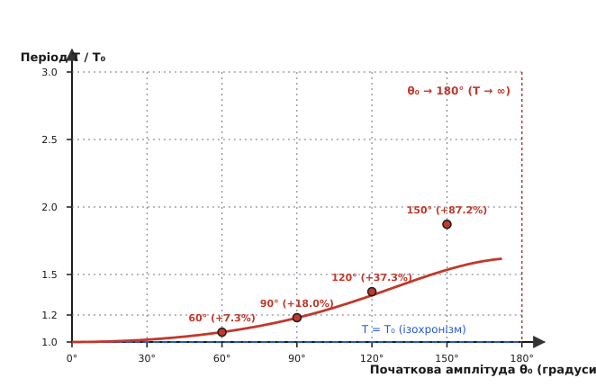
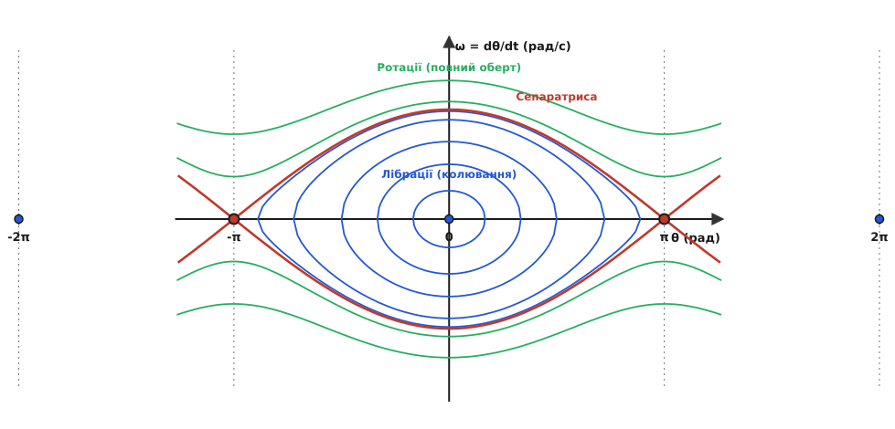

# Маятник: від ізохронізму Галілея до нелінійного хаосу

<preknowlist>
- [Гармонічний осцилятор](root:ph-waves/harmonic-oscillator) — маса на пружині, власна частота ω₀ = √(k/m), квазіповертальна сила й квадратична потенціальна яма.
- [Диференціальні рівняння](root:math-analysis/differential-equations) — похідні першого та другого порядку, зв'язок між координатою, швидкістю та прискоренням.
- [Закон збереження енергії](root:ph-mechanics/energy-conservation) — взаємоперетворення потенціальної енергії в кінетичну та назад.
- [Векторний добуток і обертальний момент](root:ph-mechanics/torque) — момент сили τ = r × F та момент інерції I для фізичного маятника.
</preknowlist>

Уявіть велику бронзову люстру, що гойдається під високим склепінням старовинного собору від випадкового пориву вітру. Великий розмах коливань на початку поступово згасає, перетворюючись на ледь помітне тремтіння, але тривалість одного повного обороту туди й назад лишається дивовижно однаковою. Саме це спостереження, зроблене у 1583 році дев'ятнадцятирічним студентом Пізанського університету Галілео Галілеєм за власним пульсом, поклало початок точній хронометрії та класичній фізиці коливальних процесів.

До цього спостереження людство відраховувало час за допомогою вельми ненадійних інструментів — сонячних годинників, які працювали лише за сонячної погоди, пісочних склянок або водяних клепсидр, швидкість витікання води з яких змінювалася від температури, атмосферного тиску та в'язкості рідини. Відсутність точного вимірювача часу гальмувала розвиток мореплавства, астрономії та експериментальної механіки. Без стабільного хронометра моряки у відкритому океані не могли визначити свою географічную довготу, що призводило до масових кораблекрушень і втрати орієнтації у морських подорожах.

Просте важке тіло, підвішене на нитці або стрижні, виявилося чимось значно глибшим, ніж просто зручним приладом для відліку секунд. Воно перетворилося на фундаментальний місток між найпростішими ідеальними гармонічними коливаннями й складними математичними законами нелінійності, еліптичними інтегралами, детермінованим хаосом та вимірюванням формату нашої планети.

У цій статті ми простежимо весь фізичний шлях маятника: від геометричного розкладу сил і лінійного наближення малих кутів до еліптичних інтегралів великих амплітуд, аналізу за допомогою теорії збурень, динаміки реальних твердих тіл будь-якої форми, фазових портретів, дисипації енергії та параметричних ефектів. Детальний історичний огляд відкриттів Галілея, Гюйгенса, Ріше та Фуко зібрано в [📜 Історії маятника](root:ph-waves/pendulum/hist-pendulum.md).

---

### Геометрія та механіка математичного маятника

Щоб з'ясувати фізичні механізми коливань, теорія починає з найпростішої ідеалізованої моделі — **математичного маятника**. Це абстрактна фізична система, що складається з точкової маси `m`, підвішеної на невагомій, абсолютно нерозтяжній і гнучкій нитці довжиною `L` у однорідному полі тяжіння з прискоренням вільного падіння `g`. У такій ідеальній моделі цілком відсутні тертя у точці підвісу, опір навколишнього повітря, а також будь-які деформації самого підвісу.

Положення маятника у будь-який момент часу повністю визначається однією узагальненою координатою — кутом відхилення нитки від вертикалі `θ(t)`. Зсув маси вздовж колової дуги радіуса `L` описується формулою `s = L · θ`. На масу `m` у кожній точці траєкторії діють дві зовнішні сили: сила натягу нитки `T`, спрямована вздовж нитки до точки підвісу, та сила тяжіння `F_g = m · g`, спрямована вертикально донизу.


*Схема математичного маятника: точкова маса m на невагомій нитці довжиною L під кутом θ відносно вертикалі. Сила тяжіння F_g = m·g розкладається на радіальну компоненту m·g·cos θ (компенсується натягом нитки T) та дотичну повертальну силу F_τ = −m·g·sin θ.*

Розкладемо вектор сили тяжіння `F_g` у локальній ортогональній системі координат на дві компоненти:

1. **Радіальна компонента** `F_r = m · g · cos(θ)`, спрямована уздовж нитки від точки підвісу. Ця компонента разом із доцентровим прискоренням визначає силу натягу нитки: `T = m · g · cos(θ) + m · L · θ̇²`. У найнижчій точці рівноваги `θ = 0` натяг нитки досягає максимуму `T_max = m · g + m · v² / L`, перевищуючи вагу спокою через додатковий внесок доцентрової сили. У крайніх точках відхилення, де швидкість дорівнює нулю (`v = 0`), натяг нитки є мінімальним: `T_min = m · g · cos(θ₀)`.
2. **Дотична (тангенціальна) компонента** `F_τ = −m · g · sin(θ)`, спрямована вздовж дотичної до дуги кола назад до положення рівноваги `θ = 0`. Знак «мінус» математично вказує на те, що сила завжди спрямована протилежно до кутового відхилення: при додатному `θ` сила діє ліворуч, при від'ємному `θ` — праворуч.

Саме дотична компонента `F_τ` виконує роль **повертальної сили**, яка змушує масу прискорюватися до центра й повертатися до рівноваги. Застосуємо другий закон Ньютона для руху маси вздовж дуги кола:

```
m · a_τ = F_τ
m · (L · d²θ/dt²) = −m · g · sin(θ)
```

Скоротивши масу `m` у обох частинах (що одразу пояснює, чому період коливань не залежить від маси підвішеного тягарця) та поділивши на довжину нитки `L`, отримуємо канонічне **нелінійне диференціальне рівняння руху математичного маятника**:

```
d²θ/dt² + (g/L) · sin(θ) = 0
```

Це рівняння є строго нелінійним через наявність тригонометричної функції `sin(θ)`. Воно описує точну динаміку маятника при будь-яких кутах відхилення — від мікроскопічних коливань до повного перевороту через верхню нестійку точку. Повний математичний вивід цього рівняння через аналітичний механізм Лагранжа наведено у [🧮 Виведенні рівняння маятника](root:ph-waves/pendulum/math-pendulum-derivation.md).

---

### Малі кути: щасливий збіг, квадратична яма та ізохронізм

Чому ж у курсі загальної фізики маятник називають гармонічним осцилятором і записують для нього просту формулу через синус і косинус? Усе справа у щасливому математичному наближенні для малих кутів.

Розкладемо тригонометричну функцію `sin(θ)` у степеневий ряд Тейлора навколо нуля:

```
sin(θ) = θ − θ³/6 + θ⁵/120 − θ⁷/5040 + ...
```

Коли кут відхилення `θ` є дуже малим (набагато меншим за 1 радіан, наприклад `θ < 5°` або `0.09` рад), куб кута `θ³` стає мікроскопічним порівняно з першим членом `θ`. Для порівняння: при `θ = 5° = 0.087266` рад значення `sin(0.087266) = 0.087155`. Відносна різниця між кутом і його синусом становить лише `0.13%`!

Зневажаючи вищими членами ряду, ми можемо замінити нелінійну функцію `sin(θ)` лінійним виразом `sin(θ) ≈ θ`:

```
d²θ/dt² + (g/L) · θ = 0
```

Отримане лінійне рівняння збігається з рівнянням ідеального [гармонічного осцилятора](root:ph-waves/harmonic-oscillator) (маси на пружині). Його власна кругова частота `ω₀` визначається співвідношенням:

```
ω₀ = √(g/L)
```

А загальним розв'язком є гармонічна синусоїдальна хвиля часу:

```
θ(t) = θ₀ · cos(ω₀ · t + φ)
```

Зважаючи, що період коливань `T` пов'язаний із круговою частотою як `T = 2·π / ω₀`, отримуємо знамениту **формулу Гюйгенса** для періоду малих коливань математичного маятника:

```
T₀ = 2 · π · √(L/g)
```


*Порівняння точного значення sin(θ) та лінійного наближення θ (у радіанах) та графік відносної похибки. Для малих кутів (до 5°) похибка не перевищує 0.13%, але зростає до 4.7% при 30° та понад 20% при 60°.*

Фізичний зміст цього наближення розкривається через потенціальну енергію системи `V(θ) = m · g · L · (1 − cos(θ))`. Розкладаючи косинус у ряд `cos(θ) ≈ 1 − θ²/2`, дістаємо квадратичну потенціальну яму:

```
V(θ) ≈ (1/2) · (m · g · L) · θ²
```

У такій параболічній потенціальній ямі ефективна жорсткість системи `k_eff = m · g · L` є абсолютно сталою, а повертальна сила пропорційна першому степеню відхилення. З формули Гюйгенса випливають три ключові властивості малих коливань маятника:

1. **Незалежність від маси:** період `T₀` залежить лише від довжини нитки `L` та прискорення вільного падіння `g`. Легка дерев'яна кулька й важкий свинцевий шар однакового розміру на нитках однакової довжини гойдаються в унісон.
2. **Строгий ізохронізм:** період `T₀` не залежить від амплітуди коливань `θ₀` (якщо кут лишається малим). Маятник здійснює розмах у 1° і розмах у 4° за однакову тривалість часу.
3. **Квадратична залежність від довжини:** щоб збільшити період коливань удвічі, довжину нитки потрібно збільшити у чотири рази (`L₂ = 4·L₁`).

---

### Великі кути: руйнування ізохронізму та еліптичні інтеграли

Що відбувається, коли маятник відхиляють на великий кут — наприклад, 30°, 60°, 90° чи навіть 170°?

При зростанні кута відхилення значення `sin(θ)` стає помітно меншим за сам кут `θ`. Це означає, що реальна повертальна сила `F_τ = −m·g·sin(θ)` виявляється **слабшою**, ніж це передбачає лінійна модель `−m·g·θ`. Потенціальна яма `V(θ) = m·g·L·(1 − cos(θ))` перестає бути параболічною — на краях вона стає пологішою, ніж парабола.

Оскільки повертальна сила є слабшою, прискорення маятника поблизу крайніх точок розмаху виявляється меншим, і маятник витрачає більше часу на проходження зовнішніх ділянок траєкторії. Внаслідок цього **ізохронізм зникає: зі зростанням амплітуди період коливань маятника збільшується**.


*Зростання відносного періоду T/T₀ зі збільшенням початкової амплітуди θ₀. При малих кутах період наближено сталий (Т ≈ Т₀), але при амплітудах 60°, 90° та 150° період зростає відповідно на 7.3%, 18.0% та 87.2%, прямуючи до нескінченності при 180°.*

Точний розрахунок періоду коливань математичного маятника при довільній амплітуді `θ₀` вимагає інтегрування рівняння збереження енергії і приводить до **повного еліптичного інтеграла першого роду** `K(k)`:

```
T(θ₀) = (4 / π) · T₀ · K(sin(θ₀/2))
```

де `k = sin(θ₀/2)` — безрозмірний модуль еліптичного інтеграла. Розкладаючи еліптичний інтеграл у степеневий ряд за степенями `k`, отримуємо вирази для обчислення точного періоду з будь-якою потрібною точністю:

```
T(θ₀) = T₀ · [ 1 + (1/4) · sin²(θ₀/2) + (9/64) · sin⁴(θ₀/2) + (225/2304) · sin⁶(θ₀/2) + ... ]
```

Для помірних кутів відхилення часто застосовують практичну **формулу Борди**:

```
T(θ₀) ≈ T₀ · [ 1 + (1/16) · θ₀² ]
```

де кут `θ₀` підставляється у радіанах.

#### Математичний метод збурень для нелінійного маятника

Щоб зрозуміти, звідки береться поправка `(1/16)·θ₀²` без обчислення важких еліптичних інтегралів, застосуємо асимптотичний **метод збурень (метод Пуанкаре-Лінндштедта)**. Напишемо рівняння руху з першими двома членами розкладу синуса:

```
d²θ/dt² + ω₀² · (θ − θ³/6) = 0
```

Будемо шукати розв'язок у вигляді ряду за малим параметром амплітуди `ε = θ₀`: `θ(t) = ε · θ₁(t) + ε³ · θ₃(t) + ...`, а також розкладемо збурену частоту коливань `ω = ω₀ · (1 + ε² · h₂ + ...)`.

Підставивши ці розклади в диференціальне рівняння й прирівнявши коефіцієнти при однакових степенях `ε`, отримуємо для першого наближення `θ₁(t) = cos(ω·t)`. У третьому наближенні виникає рівняння:

```
d²θ₃/dt² + ω₀² · θ₃ = (2 · h₂ + 1/8) · cos(ω·t) + (1/24) · cos(3·ω·t)
```

Щоб розв'язок лишався періодичним і не містив секулярних членів, які безмежно зростають із часом (типу `t · sin(ω·t)`), коефіцієнт при `cos(ω·t)` у правій частині мусить дорівнювати нулю:

```
2 · h₂ + 1/8 = 0   =>   h₂ = −1/16
```

Звідси поправка до частоти становить `ω = ω₀ · (1 − (1/16) · θ₀²)`. Оскільки період пропорційний оберненій частоті `T = 2·π / ω ≈ T₀ · (1 + (1/16) · θ₀²)`, ми математично вивели поправку Борди природним шляхом!

Проведемо розрахунок відносного зростання періоду `T(θ₀) / T₀` для серії різних кутів амплітуди:

```
Крок за кроком: розрахунок періоду маятника для різних кутів амплітуди

1. Амплітуда θ₀ = 5° (0.08727 рад):
   k = sin(2.5°) = 0.04362
   T / T₀ ≈ 1 + (1/4) · (0.04362)² = 1.000476  (зростання на 0.05%)

2. Амплітуда θ₀ = 30° (0.52360 рад):
   k = sin(15°) = 0.25882
   k² = 0.066987
   T / T₀ ≈ 1 + 0.25 · 0.066987 + 0.1406 · 0.004487 = 1.01738  (зростання на 1.74%)

3. Амплітуда θ₀ = 60° (1.04720 рад):
   k = sin(30°) = 0.50000
   k² = 0.25000, k⁴ = 0.06250, k⁶ = 0.015625
   T / T₀ ≈ 1 + 0.25 · 0.25 + 0.1406 · 0.0625 + 0.0977 · 0.015625 = 1.07318  (зростання на 7.32%)

4. Амплітуда θ₀ = 90° (1.57080 рад):
   k = sin(45°) = 0.70711
   k² = 0.50000, k⁴ = 0.25000, k⁶ = 0.12500
   T / T₀ ≈ 1 + 0.25 · 0.5 + 0.1406 · 0.25 + 0.0977 · 0.125 = 1.18034  (зростання на 18.03%)

5. Амплітуда θ₀ = 120° (2.09440 рад):
   k = sin(60°) = 0.86603
   T / T₀ (еліптичний інтеграл) = 1.37288  (зростання на 37.29%)

6. Амплітуда θ₀ = 150° (2.61799 рад):
   k = sin(75°) = 0.96593
   T / T₀ (еліптичний інтеграл) = 1.87242  (зростання на 87.24%)

7. Амплітуда θ₀ = 179° (3.12414 рад):
   k = sin(89.5°) = 0.99966
   T / T₀ (еліптичний інтеграл) ≈ 5.42150  (зростання у 5.4 рази)
```

Коли початковий кут спрямовується до `180°` (строго вертикальне положення маятника вгору), період `T(θ₀)` прямує до **нескінченності** (`T → ∞`). Поставлений строго вертикально у верхній точці нестійкої рівноваги, маятник теоретично може перебувати там як завгодно довго.

---

### Фізичний маятник: коли тіло має розміри, форму та момент інерції

У реальному інженерному світі не існує ні невагомих ниток, ні точкових мас. Будь-який реальний маятник — металева пластина, метроном, деталь машини, нога людини під час ходьби або масивний демпфер хмарочоса — це тверде тіло довільної форми, яке здійснює коливання під дією сили тяжіння навколо нерухомої горизонтальної осі підвісу, що не проходить через його центр мас. Таку систему називають **фізичним маятником**.


*Фізичний маятник: тверде тіло масою m з моментом інерції I відносно осі O. Відстань від осі до центра мас C дорівнює d. Точка P (центр качання) віддалена на зведену довжину L_звед = I / (m·d).*

Розглянемо тверде тіло масою `m`, що має момент інерції `I` відносно осі підвісу `O`. Відстань від осі `O` до центра мас тіла `C` позначимо через `d`. За теоремою Штейнера (про паралельні осі обертання), момент інерції відносно осі `O` пов'язаний із моментом інерції відносно паралельної осі, що проходить через центр мас `I_cm`, співвідношенням:

```
I = I_cm + m · d²
```

При відхиленні тіла на кут `θ` сила тяжіння `F_g = m·g`, яка вважається прикладеною до центра мас `C`, створює [обертальний момент](root:ph-mechanics/torque) `τ` відносно осі `O`:

```
τ = −m · g · d · sin(θ)
```

За основним законом динаміки обертального руху твердого тіла `I · α = τ` (де `α = d²θ/dt²` — кутове прискорення):

```
I · (d²θ/dt²) = −m · g · d · sin(θ)
d²θ/dt² + (m · g · d / I) · sin(θ) = 0
```

Для малих кутів коливань (`sin(θ) ≈ θ`) отримуємо рівняння гармонічних коливань з власною частотою:

```
ω₀ = √( (m · g · d) / I )
```

Звідси період малих коливань фізичного маятника визначається виразом:

```
T = 2 · π · √( I / (m · g · d) )
```

#### Зведена довжина та центр качання

Порівняємо формулу періоду фізичного маятника `T = 2·π·√(I / (m·g·d))` із формулою математичного маятника `T₀ = 2·π·√(L/g)`. Вони виявляються повністю тотожними, якщо ввести поняття **зведеної довжини**:

```
L_звед = I / (m · d)
```

**Зведена довжина фізичного маятника** — це довжина такого еквівалентного математичного маятника, який має абсолютно однаковий період коливань із даним фізичним маятником.

Підставивши момент інерції за теоремою Штейнера `I = I_cm + m·d²`, отримуємо розгортку зведеної довжини:

```
L_звед = (I_cm + m · d²) / (m · d) = (I_cm / (m · d)) + d
```

Оскільки `I_cm / (m · d) > 0`, зведена довжина фізичного маятника завжди строго більша за відстань від осі підвісу до центра мас (`L_звед > d`).

Цікаво дослідити залежність періоду `T(d)` від відстані `d`. Якщо підвісити тіло дуже близько до центра мас (`d → 0`), період прямує до нескінченності (`T → ∞`), тому що повертальний момент зникає. Якщо ж зсувати вісь надто далеко (`d → ∞`), період знову зростає. Існує оптимальна відстань `d_min = √(I_cm / m)`, при якій період коливань даного фізичного маятника є мінімальним!

Якщо відкласти на прямій, що проходить через точку підвісу `O` та центр мас `C`, відстань `L_звед`, ми дістанемо точку `P`, яку називають **центром качання**.

Фізичний маятник має унікальну властивість сопряженості (взаємності): якщо тіло перевернути й підвісити за вісь, що проходить через центр качання `P`, то його період коливань не зміниться, а колишня точка підвісу `O` стане новим центром качання! Цю властивість використав англійський фізик Генрі Катер у 1817 році для створення оборотного маятника, що дозволив вимірювати прискорення вільного падіння `g` з точністю до п'ятого знака без необхідності визначати центр мас та момент інерції складного тіла.

---

### Фазовий простір: коливання, ротації та сепаратриса

Повну динамічну картину поведінки маятника найзручніше спостерігати у **фазовому просторі** — геометричному просторі координат, де по горизонтальній осі відкладено кут відхилення `θ`, а по вертикальній осі — кутову швидкість `ω = dθ/dt`.

У будь-який момент часу стан маятника повністю задається однією точкою `(θ, ω)` у фазовому просторі. З плином часу ця точка описує плавну лінію — **фазову траєкторію**. Уся сукупність фазових траєкторій для різних початкових енергій утворює **фазовий портрет**.


*Фазовий портрет у координатах (θ, ω). Замкнені еліптичні лінії навколо стійких точок (0,0) відповідають коливанням (лібраціям). Похвилясті лінії зверху й знизу описують нескінченне обертання (ротації). Хвиляста червона лінія (сепаратриса) розділяє ці два режими.*

З аналізу повної енергії `E = (1/2)·m·L²·ω² + m·g·L·(1 − cos(θ))` чітко видно три цілком різні фізичні режими:

1. **Область коливань (лібрацій, `E < 2·m·g·L`):**
   При малій енергії маятник не здатний подолати верхній потенціальний бар'єр. Фазові траєкторії являють собою замкнені концентричні криві навколо точок стійкої рівноваги `(2πn, 0)`. При малих амплітудах це майже ідеальні еліпси.
2. **Область обертань (ротацій, `E > 2·m·g·L`):**
   При високій енергії маятник робить повні обороти на 360° в один бік. Кутова швидкість `ω` ніколи не перетворюється на нуль, а фазові траєкторії є відкритими хвилястими лініями, що простягаються уздовж осі `θ` безкінечно.
3. **Сепаратриса (`E = 2·m·g·L`):**
   Особлива критична траєкторія (від лат. *separatrix* — розділова), яка відокремлює область коливань від області обертань. Вона проходить точно через нестійкі точки рівноваги `((2n+1)π, 0)`, відповідаючи руху, при якому маятник піднімається до верхньої точки й замирає там при `t → ∞`.

За теоремою Ліувіля про збереження фазового об'єму для консервативних механічних систем, площа будь-якої замкненої області фазового простору під час еволюції маятника лишається строго незмінною. Це означає, що траєкторії фазового портрета ніколи не перетинаються одна з одною.

Математично лінеаризація системи поблизу особливих точок дає матрицю Якобі. Для стійкої точки `(0,0)` власні значення матриці дорівнюють чисто уявним числам `λ = ± i · ω₀` (топологічний центр), що описує замкнені еліпси. Для нестійкої точки `(π,0)` власні значення є дійсними числами з протилежними знаками `λ = ± ω₀` (топологічне сідло), з якого виходять вхідна й вихідна гілки сепаратриси.

Докладні чисельні алгоритми побудови фазового портрета та моделювання траєкторій за допомогою методів Верле й RK4 наведено у [⚙️ Чисельному моделюванні маятника](root:ph-waves/pendulum/proj-pendulum-sim.md) та специфіковано у [📋 Інтерфейсі та конфігурації рушія](root:ph-waves/pendulum/api-pendulum-solver.md).

---

### Дисипація енергії, добротність та параметричні ефекти

У реальних фізичних пристроях завжди присутні сили тертя — опір повітря та тертя у шарнірі підвісу. У найпростішому випадку в'язкого тертя сила опору пропорційна швидкості `F_загас = −c · v`. Рівняння руху загасного маятника набуває вигляду:

```
d²θ/dt² + γ · dθ/dt + (g/L) · sin(θ) = 0
```

де `γ = c / m` — коефіцієнт загасання. Швидкість дисипації механічної енергії `dE/dt = −c · L² · ω²` є завжди від'ємною. У фазовому просторі загасання приводить до того, що замкнені лінії перетворюються на спіралі, які скручуються до центра стійкої рівноваги `(0,0)`.

Якість та «дзвінкість» маятника описують безрозмірною **добротністю** `Q`:

```
Q = ω₀ / (2 · γ) = m · ω₀ / c
```

Для простих нитяних маятників у повітрі `Q ≈ 100`. У точних астрономічних годинниках із важким сочевицеподібним маятником у вакуумній колбі добротність досягає `Q ≈ 10 000`. У сучасних квантових та гравітаційних експериментах (наприклад, сапфірові підвіси у детекторах LIGO) добротність маятникових підвісів перевищує `10⁸`!

Щоб маятник гойдався беззупинно (як у настінному чи підлоговому годиннику), втрати енергії потрібно компенсувати. Це робить **анкерний (спусковий) механізм**, який на кожному циклі дає маятникові короткий механічний поштовх від гирі або стиснутої пружини.

Ще дивовижнішим є **параметричний маятник**. Якщо підвіс маятника здійснює швидкі вертикальні коливання високої частоти `ν >> ω₀`, виникає дивовижний фізичний ефект — **маятник Капіци** (названий на честь видатного фізика Петра Капіци, який теоретично й експериментально пояснив це явище у 1951 році). Верхнє положення рівноваги `θ = π` (перевернутий маятник гострою частиною вгору), яке зазвичай є абсолютно нестійким, під дією високочастотної вібрації точки підвісу стає **стійким**! Перевернутий маятник упевнено утримує вертикальне положення й дрібно тріпоче навколо нього.

Нарешті, якщо на загасний маятник діє зовнішня періодична вимушувальна сила `F_ext = A · cos(Ω · t)`, система демонструє багату нелінійну динаміку: при зміні амплітуди й частоти вимушування спостерігаються подвоєння періоду, дивні атрактори та **детермінований хаос**. Подвійний маятник (маятник, підвішений до іншого маятника) є класичним прикладом системи, поведінка якої стає хаотичною та вкрай чутливою до початкових умов навіть без зовнішнього вимушування.

---

### Світоглядне значення: від детермінізму Ньютона до хаосу Лоренца

Маятник відіграв виняткову роль у формуванні наукового світогляду людства. У XVII–XVIII століттях закони руху маятника, відкриті Галілеєм, Гюйгенсом та Ньютоном, сформували концепцію «всесвіту як годинникового механізму» (англ. *Clockwork Universe*). Здавалося, що якщо світ побудовано з маятників та точних класичних орбіт, то знаючи початкові координати й швидкості всіх частинок, можна теоретично передбачити майбутнє Всесвіту на мільйони років уперед (детермінізм Лапласа).

Проте у другій половині XX століття дослідження нелінійного маятника з вимушуванням та подвійного маятника зруйнувало цей наївний детермінізм. Виявилося, що навіть простіші нелінійні механічні системи з трьома ступенями вільності можуть демонструвати **детермінований хаос**. Найменша зміна початкових умов (наприклад, зміна кута у десятому знаку після коми) призводить до експоненціальної розбіжності траєкторій із часом — явище, що характеризується додатним показником Ляпунова.

Таким чином, той самий маятник, який наприкінці XVII століття подарував фізиці символ точного впорядкованого часу й детермінізму, у XX столітті став головним наочним символом теорії хаосу, нелінійного аналізу та дивних атракторів.

---

### Експериментальна гравіметрія та метрологічне значення маятника

Історична роль маятника у розвитку природознавства вийшла далеко за межі звичайного вимірювання часу. Наприкінці XVII століття експедиція Жана Ріше до екваторіальної Кайєнни показала, що той самий маятник у районі екватора гойдається повільніше, ніж у Парижі. Це стало першим прямим експериментальним доказом того, що прискорення вільного падіння `g` не є однаковим по всій поверхні Землі, а сама Земля має форму сплюснутого на полюсах еліпсоїда обертання.

У XIX та першій половині XX століття маятникові прилади слугували головним інструментом гравіметрії. Вимірюючи дрібні коливання періоду секундного маятника, вчені навчилися визначати географічні варіації прискорення `g` із точністю до мільйонних часток. Це дало змогу:

- Скласти точні карти гравітаційного поля Землі та визначити форму геоїда.
- Виявляти великі підземні аномалії щільності — родовища важких металевих руд, соляні куполи та нафтогазові резервуари.
- Досліджувати явища ізостазії — плавання континентальних плит у мантії Землі.

Експеримент Леона Фуко в паризькому Пантеоні у 1851 році, де 67-метровий маятник із 28-кілограмовою кулею наочно продемонстрував повернення площини коливань відносно підлоги, став першим суто лабораторним доказом добового обертання Землі навколо власної осі без використання астрономічних спостережень за зорями.

Для забезпечення високої точності ходу в інженерії маятникових годинників розробили спеціальні температурні компенсатори (наприклад, маятник Гаррісона із чергуванням залізних та латунних стрижнів або використання сплаву Інвар з нульовим коефіцієнтом розширення), що виключало зміну довжини `L` при коливаннях температури приміщення.

---

> 🔧 **Навіщо це.**
>
> Концепція маятника лежить в основі ключових технологій сучасного інженерного світу:
>
> 1. **Інерціальна навігація та сейсмографи:** Сейсмоприймачі та акселерометри використовують маятникові підвіси для фіксації найменших зсувів земної кори та прискорень транспортних засобів.
> 2. **Інерційні гасники вібрацій у хмарочосах:** На останніх поверхах висотного хмарочоса Тайбей 101 (Тайвань) підвішено гігантський 660-тонний сталевий маятник-демпфер (*Tuned Mass Damper*). Під час тайфунів чи землетрусів маятник гойдається у протифазі до коливань будівлі, гасячи до 40% амплітуди розмаху вежі та рятуючи споруду від руйнування.
> 3. **Гравіметрія та геодезія:** Вимірювання локальних змін прискорення вільного падіння `g` за допомогою високоточних маятників дозволяє геологорозвідці знаходити підземні поклади важких руд чи нафтоносних пластів.
> 4. **Крокуюча робототехніка:** Ходьба людини та двоногих роботів (Boston Dynamics, Tesla Optimus) у біомеханіці моделюється як послідовність перевернутих маятників, де кожна нога почергово стає віссю обертання для маси тулуба.
