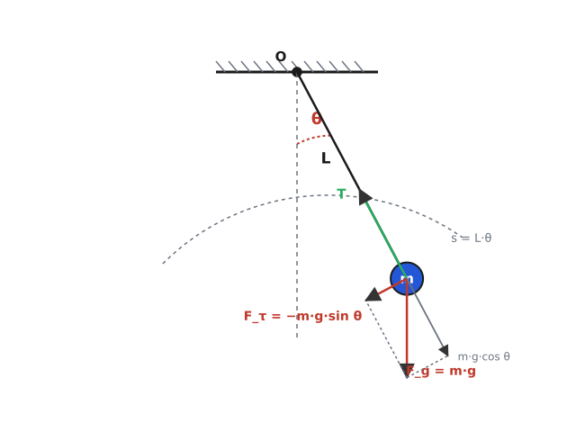
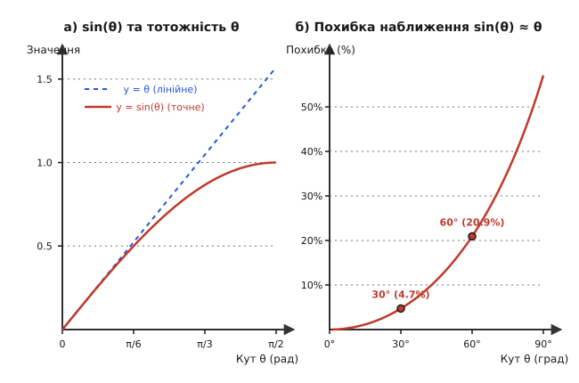
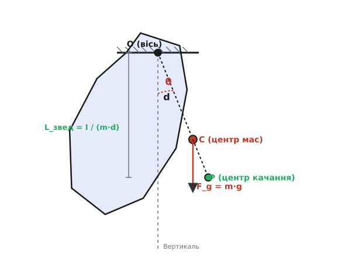

# Маятник: від малого розмаху до фізичного тіла

<preknowlist>
- [Гармонічний осцилятор](topic:ph-waves/harmonic-oscillator) — маса на пружині, власна частота ω₀ = √(k/m) та квазіповертальна сила.
- [Закон збереження енергії](topic:ph-mechanics/energy-conservation) — взаємоперетворення потенціальної енергії в кінетичну та назад.
- [Момент сили](topic:ph-mechanics/torque) — момент сили τ = r × F та момент інерції I для обертального руху.
</preknowlist>

Коли важке тіло, підвішене на нитці чи стрижні, зсувають із положення рівноваги й відпускають, воно не просто повертається назад, а проскочує нижню точку по інерції та здійснює регулярні коливання туди й назад. Уся динаміка цього руху тримається на безперервному обміні: сила тяжіння прагне повернути тіло донизу, розганяючи його, а накопичена кінетична енергія піднімає його на протилежний бік, перетворюючись назад у потенціальну.

Ця система є однією з найдавніших і найважливіших моделей механіки. Вона поєднує в собі прості закони лінійних коливань із глибокими нелінійними ефектами, які проявили себе під час розробки точних годинників, вимірювання форми Землі та дослідження нелінійної динаміки.

---

### Геометрія та повертальна сила математичного маятника

Найпростіша теоретична модель — **математичний маятник**. Це ідеалізована система, де вся маса `m` зосереджена в одній точці, а підвіс є абсолютно невагомою, нерозтяжною ниткою довжиною `L`. Тертя у точці кріплення та опір повітря в цій моделі вважають відсутніми.

Положення маятника у будь-який момент часу визначається кутом відхилення нитки від вертикалі `θ`. На масу `m` діють дві сили: сила натягу нитки `T`, спрямована до точки підвісу, та сила тяжіння `F_g = m · g`, спрямована вертикально донизу.


*Схема математичного маятника: точкова маса m на невагомій нитці довжиною L під кутом θ відносно вертикалі. Сила тяжіння розкладається на радіальну та дотичну повертальну компоненту F_τ = −m·g·sin θ.*

Розкладемо силу тяжіння на дві ортогональні компоненти:

1. **Радіальна компонента** `m · g · cos(θ)` діє уздовж нитки й компенсується її натягом (з урахуванням доцентрового прискорення руху).
2. **Дотична (тангенціальна) компонента** `F_τ = −m · g · sin(θ)` спрямована вздовж дуги траєкторії назад до центрального положення рівноваги `θ = 0`. Знак «мінус» вказує на те, що сила завжди протидіє кутовому відхиленню.

Саме дотична компонента виконує роль **повертальної сили**. За другим законом Ньютона для руху вздовж дуги колової траєкторії радіуса `L` кутове прискорення `d²θ/dt²` пов'язане з повертальною силою співвідношенням:

```
m · L · (d²θ/dt²) = −m · g · sin(θ)
```

Скоротивши масу `m` й поділивши на довжину `L`, отримуємо точне нелінійне диференціальне рівняння руху математичного маятника:

```
d²θ/dt² + (g/L) · sin(θ) = 0
```

Наявність тригонометричного синуса `sin(θ)` робить це рівняння нелінійним: повертальна сила зростає не пропорційно куту `θ`, а повільніше за нього. Детальний математичний вивід цього рівняння через функціонал Лагранжа та закони збереження наведено у [🧮 Виведенні рівняння маятника](topic:ph-waves/pendulum/math-pendulum-derivation.md).

---

### Малі кути, формула Гюйгенса та ізохронізм

Якщо кут відхилення маятника є малим (не перевищує `5°`, тобто близько `0.09` радіана), дуга відхилення майже не відрізняється від прямого відрізка, а значення синуса кута з високою точністю дорівнює самому куту у радіанах: `sin(θ) ≈ θ`. При `θ = 5°` похибка цього спрощення становить менш ніж `0.13%`.


*Порівняння точності наближення sin(θ) ≈ θ та відносна похибка при зростанні кута відхилення.*

Замінивши `sin(θ)` на `θ`, нелінійне рівняння перетворюється на лінійне рівняння ідеального [гармонічного осцилятора](topic:ph-waves/harmonic-oscillator):

```
d²θ/dt² + (g/L) · θ = 0
```

Власна кругова частота таких коливань дорівнює `ω₀ = √(g/L)`. Оскільки період коливань `T` пов'язаний із частотою як `T = 2 · π / ω₀`, ми отримуємо класичну **формулу Гюйгенса** для періоду малих коливань математичного маятника:

```
T₀ = 2 · π · √(L/g)
```

З цієї формули випливають три фундаментальні властивості малих коливань:

1. **Незалежність від маси:** маса підвішеного тягарця `m` скорочується ще на етапі запису рівняння руху. Важка свинцева куля та легка дерев'яна кулька на нитках однакової довжини гойдаються з однаковим періодом.
2. **Ізохронізм:** період малих коливань `T₀` не залежить від амплітуди розмаху. Маятник долає відхилення в `1°` і відхилення в `4°` за однаковий час.
3. **Залежність від довжини й гравітації:** період пропорційний квадратному кореню з довжини нитки `L` та обернено пропорційний квадратному кореню з прискорення вільного падіння `g`. Щоб збільшити період удвічі, довжину підвісу треба збільшити у чотири рази.

Детальний історіографічний нарис про те, як Галілео Галілей у Пізі відкрив властивість ізохронізму, а Крістіан Гюйгенс збудував перші точні маятникові годинники, описано в [📜 Історії маятника](topic:ph-waves/pendulum/hist-pendulum.md).

---

### Великі кути: руйнування ізохронізму

Коли маятник відхиляють на великі кути (наприклад, `30°`, `60°` чи `90°`), лінійне наближення `sin(θ) ≈ θ` втрачає точність. Оскільки синус кута зростає повільніше за сам кут, реальна повертальна сила `F_τ = −m·g·sin(θ)` стає слабшою за передбачену лінійною моделлю.

Через зменшення повертальної сили маятник повільніше прискорюється на периферійних ділянках траєкторії і витрачає більше часу на розмах. Внаслідок цього **строгий ізохронізм порушується: зі збільшенням амплітуди період коливань зростає**.

При помірних кутах відхилення збільшення періоду можна оцінити за наближеною формулою Борди:

```
T(θ₀) ≈ T₀ · [ 1 + (1/16) · θ₀² ]
```

де `θ₀` — амплітудний кут відхилення у радіанах. При амплітуді `30°` період перевищує `T₀` на `1.7%`, при `60°` — на `7.3%`, а при `90°` — на `18%`. Якщо ж відхилити маятник майже до верхньої точки рівноваги (`179°`), період зростає у кілька разів, а при строго вертикальному положенні вгору (`180°`) прямує до нескінченності.

---

### Фізичний маятник: зведена довжина та центр качання

Реальні маятники — металевий стрижень, диск, метроном або деталь механізму — мають розподілені розміри й форму. Таке тверде тіло довільної конфігурації, що здійснює коливання під дією ваги навколо нерухомої горизонтальної осі підвісу, називають **фізичним маятником**.


*Фізичний маятник: тіло масою m з моментом інерції I відносно осі підвісу O. Відстань від осі до центра мас C дорівнює d, а точка P позначає центр качання.*

Динаміка фізичного маятника визначається не просто масою, а її розподілом відносно осі обертання — [моментом інерції](topic:ph-mechanics/torque) `I`. Якщо центр мас тіла `C` віддалений від осі підвісу `O` на відстань `d`, то повертальний [момент сили](topic:ph-mechanics/torque) дорівнює `τ = −m · g · d · sin(θ)`.

За основним законом динаміки обертального руху `I · (d²θ/dt²) = −m · g · d · sin(θ)`, що для малих кутів дає період коливань:

```
T = 2 · π · √( I / (m · g · d) )
```

Щоб зіставити фізичний маятник із математичним, вводять поняття **зведеної довжини**:

```
L_звед = I / (m · d)
```

**Зведена довжина** — це довжина такого уявного математичного маятника, який має точно такий самий період коливань, як і даний фізичний маятник.

Якщо відкласти відстань `L_звед` від точки підвісу `O` вздовж лінії, що проходить через центр мас `C`, ми отримаємо точку `P` — **центр качання**. Фізичний маятник має властивість взаємності: якщо перевернути тіло й підвісити його за вісь, що проходить через центр качання `P`, період коливань залишиться абсолютно незмінним.

---

### Фазовий простір та загасання коливань

Стан маятника у будь-який момент часу зручно подавати точкою на **фазовій площині**, де по горизонталі відкладають кут відхилення `θ`, а по вертикалі — кутову швидкість `ω = dθ/dt`.

Зі зростанням повної механічної енергії система демонструє два принципово різні режими руху:

1. **Коливання (лібрації):** при енергії, недостатній для підйому у верхню точку, траєкторії на фазовій площині є замкненими кривими навколо нижнього положення рівноваги `(0, 0)`.
2. **Обертання (ротації):** при високій енергії маятник здійснює нескінченні обороти в один бік на 360°, а фазові траєкторії стають відкритими хвилястими лініями.

Межу між ними утворює особлива траєкторія — **сепаратриса**, яка проходить через нестійке верхнє положення рівноваги.

У реальному середовищі через тертя у підвісі та опір повітря механічна енергія маятника поступово перетворюється на тепло. Загасання коливань описують безрозмірною **добротністю** `Q`. Для звичайного нитяного маятника у повітрі `Q ≈ 100`, тоді як у вакуумованих астрономічних годинниках та сучасних підвісах гравітаційних детекторів добротність сягає значення від `10⁴` до `10⁸`.

---

> 🔧 **Навіщо це.**
>
> Фізичні принципи маятника лежать в основі багатьох сучасних інженерних систем:
>
> 1. **Гасіння коливань у хмарочосах:** На останніх поверхах висотного хмарочоса Тайбей 101 підвішено 660-тонний маятник-демпфер (*Tuned Mass Damper*). Під час тайфунів він гойдається у протифазі до відхилень вежі, гасячи до 40% амплітуди розмаху будівлі.
> 2. **Інерціальна навігація та сейсмометрія:** Чутливі маятникові підвіси в сейсмографах фіксують найменші коливання земної кори та прискорення транспортних засобів.
> 3. **Гравіметрічна геологорозвідка:** Точні вимірювання періоду коливань маятника дозволяють реєструвати дрібні локальні зміни прискорення `g`, виявляючи підземні родовища корисних копалин та нафтоносних шарів.
