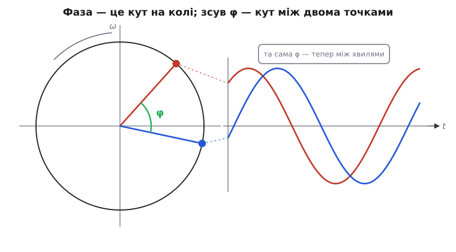
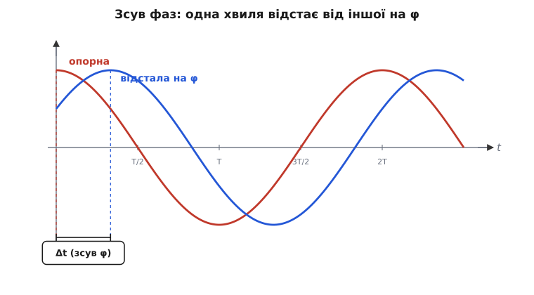
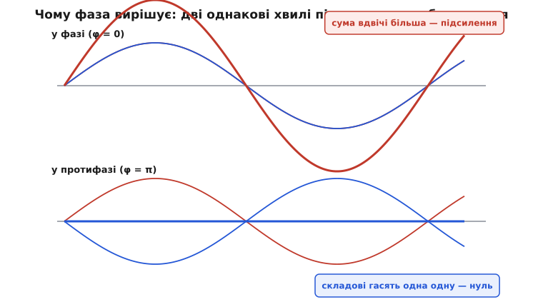

# Фаза й зсув

Уявіть двоє однакових гойдалок поруч. Якщо їх штовхнути одночасно, вони ходитимуть нога в ногу: разом уперед, разом назад. Та можна штовхнути другу трохи пізніше — і вона весь час відставатиме на ту саму частку розмаху, ніколи не наздоганяючи, але й не відстаючи дедалі більше. Обидві гойдалки роблять рівно один і той самий рух з однаковою швидкістю; різниця лише в одному — **де в цьому русі кожна перебуває цієї миті**. Перша вже йде назад, коли друга ще тільки доходить до краю.

Оце «де саме в циклі ти зараз» і є **фаза**. А стала різниця між двома гойдалками — **зсув фаз**. Здавалося б, дрібниця: підштовхнули на мить пізніше. Але саме ця дрібниця вирішує, чи дві хвилі складуться в одну вдвічі більшу, чи поглинуть одна одну дощенту; чи коло пропускає струм легко, чи опирається йому; чи система слухається керування, чи розгойдується вразнос. Розберімося, звідки фаза береться, як її міряти й чому вона раз у раз виявляється головною дійовою особою там, де щось коливається.

## Що таке фаза одного коливання

Почнімо з однієї синусоїди й запитаймо найпростіше: чим відрізняються дві її точки в різні моменти? Висота над віссю — так, але висота повторюється: хвиля проходить через нуль двічі за період, через вершину — раз за період. Самої висоти замало, щоб сказати, **де** ми в циклі: піднімаємося чи опускаємося, щойно почали чи ось-ось завершимо оберт. Потрібна величина, яка йде вперед рівномірно й не повторюється в межах одного циклу. Це і є фаза.

Найясніше фаза видно, якщо згадати, звідки взагалі береться синусоїда. Вона — слід точки, що рівномірно біжить по колу: висота точки над горизонталлю в кожну мить і викреслює хвилю.

> Синус і косинус — це координати точки, що рівномірно йде по колу радіуса один: косинус — куди вона зайшла по горизонталі, синус — по вертикалі. Якщо кут θ росте рівномірно з часом, то висота точки `sin θ` коливається між −1 і +1, обходячи повну хвилю за один оберт кола (2π). Саме звідси будь-яке рівномірне обертання, побачене збоку, дає синусоїду. Докладніше — [синус і косинус](topic:math-geometry/sine-cosine).

Якщо точка біжить по колу рівномірно, її кут росте лінійно з часом: θ = ω·t, де ω (омега, гр. *ὦ μέγα*) — кутова швидкість, скільки радіанів намотується за секунду. Але старт не зобов'язаний бути на нулі: точка могла рушити не з правого краю кола, а вже звідкись із дороги. Цей початковий кут позначають φ (фі, гр. *φῖ*) і називають **початковою фазою**. Тоді повний опис коливання такий:

```
y(t) = A · sin(ω·t + φ)
```

Тут A — амплітуда (висота розмаху), ω задає темп (швидкість обертання), а **повна фаза** — це весь вираз у дужках, ω·t + φ. Саме він каже, **де по колу** точка цієї миті. Початкова фаза φ — це просто його значення в момент t = 0: з якого місця циклу все почалося.

Тому слово «фаза» (гр. *φάσις* — поява, прояв; первісно про фази Місяця, його видимі стадії) має два споріднені значення, які варто не плутати. **Повна фаза** ω·t + φ невпинно росте з часом — це біжуча стрілка, що показує поточне місце в циклі. **Початкова фаза** φ — стала, це лише зсув старту. Коли інженер каже просто «фаза сигналу», майже завжди мається на увазі друге: φ, мітка того, наскільки цей сигнал зрушено відносно якоїсь спільної точки відліку.


*Ліворуч: два радіуси одного кола під різними кутами. Праворуч: висоти цих точок у часі дають дві синусоїди. Кутова відстань між радіусами на колі — це та сама величина, що й проміжок між хвилями: зсув фаз φ.*

> 🔧 **Навіщо це.** Коли прошивка стежить за змінною напругою, миттєвого значення замало, щоб діяти: 0 вольт буває і на висхідній ділянці, і на низхідній — а керувати треба по-різному. Тому система обчислює фазу — повний кут ω·t + φ — і вже з нього знає не лише висоту сигналу, а й напрям руху та скільки лишилося до наступного переходу через нуль. На цьому тримається синхронізація: щоб увімкнути тиристор чи зловити момент перемикання, потрібна саме фаза, а не голе значення.

## Зсув фаз: різниця між двома коливаннями

Сама по собі початкова фаза однієї хвилі — величина відносна: вона залежить від того, звідки ми вирішили лічити час. Зрушимо початок відліку — і φ зміниться, хоч сама хвиля та сама. Тому фаза **поодинці** мало що означає; вона набуває сенсу аж тоді, коли є **друге** коливання, з яким можна порівнятися.

Візьмімо два сигнали однакової частоти:

```
y₁(t) = A · sin(ω·t + φ₁)
y₂(t) = B · sin(ω·t + φ₂)
```

Темп ω в обох однаковий — обидві точки біжать по колу з тією самою швидкістю, тож кутова відстань між ними не міняється з часом. Ця стала відстань і є **зсув фаз**:

```
Δφ = φ₂ − φ₁
```

Ось чому зсув фаз — величина абсолютна, на відміну від самих φ₁ і φ₂. Якщо переставити початок відліку часу, обидві фази зсунуться на однакову величину, а їхня **різниця** лишиться тією самою. Зрушити старт можна, а ось розвести дві гойдалки не вийде, просто переписавши годинник, — їхня неузгодженість реальна. Саме тому фізичний зміст несе різниця фаз, а не фаза кожного сигналу окремо.

Повернімося до кола, бо там зсув наочний. Два сигнали однакової частоти — це дві точки на одному колі, що крутяться разом. Кут між їхніми радіусами застиглий: одна точка вічно випереджає другу на Δφ. Поки обидві намотують оберти, ця кутова фора тримається незмінною — як два бігуни, що йдуть з однаковою швидкістю різними доріжками стадіону, лишаючись на сталій відстані.


*Опорна хвиля (червона) і хвиля, відстала на φ (синя). Їхні вершини розділені сталим проміжком Δt уздовж осі часу; цьому проміжку відповідає кут φ. Оскільки частота однакова, відстань між хвилями ніколи не змінюється — вона лише повторюється з кожним періодом.*

Тут варто наголосити на «однаковій частоті», бо без неї поняття сталого зсуву розсипається. Якби точки крутилися з різною швидкістю, кут між ними весь час змінювався б: то наздоганяли б, то відставали. Тоді казати про один сталий «зсув фаз» немає сенсу — різниця фаз сама стала б функцією часу, що рівномірно росте. Сталий зсув — це привілей коливань однакової частоти; саме тому фаза цікавить найперше там, де все коливається на одній спільній частоті — у мережі, у радіоканалі, у налаштованому контурі.

## Випередження й відставання

У зсуву є знак, і він має пряме фізичне читання: одне коливання може **випереджати** друге або **відставати** від нього. Уявімо знову точку на колі, що обертається проти годинникової стрілки (так заведено лічити кути). Точка, чий кут більший, пройшла далі — вона попереду. Її коливання досягає кожної віхи циклу — вершини, переходу через нуль — **раніше** в часі. Кажуть, що вона випереджає за фазою.

Здавалося б, парадокс: більший кут — попереду по колу, але як це «раніше в часі»? Розв'язка ось у чому. Більший початковий кут означає, що в момент t = 0 точка вже просунулася далі по циклу — тобто свого нуля чи вершини вона досягла раніше, ще до старту відліку. Тому хвиля з більшою φ на графіку зсунута **вліво** (її прикмети настають раніше), а хвиля з меншою φ — **вправо** (запізнюється). Випередження — це зсув уліво по часовій осі, відставання — управо.

```
φ₂ > φ₁   →   y₂ випереджає y₁   (вершини y₂ настають раніше)
φ₂ < φ₁   →   y₂ відстає від y₁  (вершини y₂ настають пізніше)
```

Два значення зсуву мають окремі назви, бо трапляються повсюди. Коли Δφ = 0, коливання йдуть **у фазі**: вершина до вершини, нуль до нуля, нога в ногу. Коли Δφ = 180° (тобто π), вони **у протифазі**: одне на вершині рівно тоді, коли друге на дні; повна протилежність. А проміжний випадок Δφ = 90° (π/2) називають **квадратурою** (від лат. *quadratus* — четвертний): хвилі розведені рівно на чверть періоду, і коли одна проходить нуль, друга саме в максимумі. Квадратура — особлива, бо в ній синус і косинус: косинус і є синус, зрушений на чверть оберту вперед.

```
Δφ = 0°    у фазі        вершини збігаються
Δφ = 90°   квадратура    чверть періоду різниці
Δφ = 180°  протифаза     вершина однієї = дно другої
```

> 🔧 **Навіщо це.** У керуванні двигуном струм має йти узгоджено з положенням ротора; якщо він випереджає чи відстає від потрібної фази, частина зусилля марнується на нагрів, а не на обертання. Тому контролер постійно міряє зсув між заданим і виміряним сигналом і підправляє момент увімкнення. Те саме у блоці живлення з корекцією коефіцієнта потужності: завдання — звести зсув між струмом і напругою до нуля, бо кожен зайвий градус відставання — це струм, що тече туди-сюди, гріючи проводи, але не віддаючи корисної потужності.

## Як зсув міряють

Зсув фаз можна виразити трьома способами, і всі три кажуть про одне й те саме — просто різними мірками. Перейти між ними варто вміти вільно, бо в різних галузях звичні різні.

**У градусах.** Повний цикл — це 360°, тож зсув природно подати як частку цього кола. У фазі — 0°, протифаза — 180°, квадратура — 90°. Градуси зручні для інтуїції: «відстає на чверть оберту» одразу читається як 90°. Це мова, якою про фазу говорять інженери-практики.

**У радіанах.** Та сама частка кола, але міряна довжиною дуги на одиничному колі: повний оберт — 2π, тож протифаза — π, квадратура — π/2. Радіани незамінні щоразу, коли фаза заходить у формули з ω·t, бо ω задано в радіанах за секунду й перевідні множники просто зникають. Перехід прямий:

```
180° = π радіанів        →   φ[рад] = φ[°] · π / 180
```

**У часі.** Зсув можна виразити й затримкою Δt — на скільки секунд одна хвиля запізнюється проти іншої. Зв'язок між часовою затримкою й кутовим зсувом дає сама частота. За один період T хвиля проходить повний цикл, тобто 2π радіанів (чи 360°). Отже частка періоду — це та сама частка повного кута:

```
Δφ = ω · Δt = 2π · (Δt / T) = 360° · (Δt / T)
```

Ось чому той самий зсув у часі означає різний зсув у градусах на різних частотах. Затримка в одну мілісекунду — це чверть періоду (90°) для сигналу 250 Гц, але цілих два повні оберти для сигналу 2000 Гц. Час — абсолютна затримка; градуси — затримка відносно періоду. Це не дрібниця: коли кажуть «лінія дає зсув 30°», без частоти це неповна звістка, бо в секундах вона на кожній частоті інша.

**Worked-приклад: переведення затримки у фазу.** Два сигнали мережі 50 Гц зсунуті на 1.2 мс. Який це зсув у градусах?

```c
float f  = 50.0f;            // частота, Гц
float dt = 1.2e-3f;          // затримка, с
float T  = 1.0f / f;         // період = 0.02 с = 20 мс
float phase_deg = 360.0f * (dt / T);
//               = 360 · (0.0012 / 0.02)
//               = 360 · 0.06
//               = 21.6°
```

Отже 1.2 мс на 50 Гц — це зсув близько 21.6°. На вищій частоті та сама затримка дала б більший кут: фаза рахує час у частках періоду, а період коротшає.

## Чому фаза важлива: інтерференція

Перша велика причина, чому фаза вирішальна, — те, що відбувається, коли два коливання **складаються**. Звук від двох динаміків, дві хвилі на воді, два струми в одному вузлі — усюди сигнали додаються миттєвими значеннями. І результат залежить не лише від їхніх амплітуд, а критично — від зсуву фаз між ними. Це явище називають **інтерференцією** (від лат. *inter* — між і *ferire* — бити, тобто взаємодія, «збивання» хвиль).

Подивімося на крайні випадки. Дві однакові хвилі **у фазі** додаються вершина до вершини, дно до дна — і дають хвилю вдвічі більшу. Це **підсилення**. Ті самі дві хвилі **у протифазі** зустрічаються вершиною до дна: де одна тягне вгору, друга рівно стільки ж тягне вниз. Вони гасять одна одну дощенту — результат нуль. Це **гасіння**. Дивовижна річ: ми не прибрали жодної з хвиль, обидві на повну силу присутні — а разом дають тишу. Уся різниця між гучним звуком і мовчанням тут — лише зсув фаз.

```
у фазі      (Δφ = 0):    sin + sin       = подвоєна амплітуда
у протифазі (Δφ = π):    sin + sin(+π)   = 0   (бо sin(x+π) = −sin x)
```


*Угорі: складові у фазі (тонкі) дають суму вдвічі більшу (товста) — підсилення. Унизу: ті самі складові у протифазі дають у сумі рівну лінію — повне гасіння. Амплітуди однакові в обох випадках; різний лише зсув фаз.*

Між цими крайнощами лежить уся гама проміжних результатів: чим ближче зсув до протифази, тим сильніше хвилі взаємно стирають одна одну. Загальний підсумок гарний: сума двох синусоїд однакової частоти — це знов синусоїда тієї самої частоти, і її амплітуда залежить від зсуву так, що при Δφ = 0 вона найбільша, а при Δφ = π — найменша.

> 🔧 **Навіщо це.** На цьому стоять навушники з активним глушінням шуму: мікрофон ловить зовнішній гул, схема будує точно протифазну хвилю, і у вусі вони гасяться. Той самий механізм — зворотний бік: у бездротовому зв'язку сигнал доходить до приймача кількома шляхами (прямим і відбитим від стін), і якщо відбитий приходить у протифазі до прямого, вони гасяться — зв'язок провалюється саме в цій точці, хоч передавач працює справно. Тому, проєктуючи антену чи розводячи високочастотну плату, фазу шляхів рахують так само пильно, як і амплітуди.

## Чому фаза важлива: реактивність

Друга велика причина живе в електричних колах і пояснює, чому фаза — не абстракція, а те, що визначає, скільки реальної потужності дійде до навантаження. У колі змінного струму напруга й сила струму обидві синусоїдальні з частотою мережі, але між ними часто є зсув фаз. Звідки він?

Корінь — у двох елементах, які не просто опираються струмові, а **запасають енергію** й повертають її назад. Конденсатор накопичує заряд: щоб напруга на ньому зросла, струм має натекти **наперед**, тож струм випереджає напругу. Котушка протидіє зміні струму своїм магнітним полем: струм у ній наростає із запізненням, тож струм **відстає** від напруги. У кожному випадку струм і напруга вже не йдуть нога в ногу — між ними з'являється зсув, у крайньому разі аж до 90°.

І ось чому це б'є по потужності. Миттєва потужність — це добуток напруги на струм. Коли вони у фазі, добуток майже завжди додатний: енергія весь час тече в навантаження, гріє, світить, крутить. Та коли між ними зсув, бувають проміжки, де напруга додатна, а струм уже від'ємний — добуток від'ємний, і енергія тече **назад** до джерела. За зсуву рівно 90° додатні й від'ємні проміжки точно врівноважуються: енергія весь час гойдається туди-сюди між джерелом і елементом, а корисної роботи в середньому — нуль.

```
струм і напруга у фазі (Δφ = 0):     уся потужність корисна
зсув Δφ:                              корисна частка ∝ cos(Δφ)
зсув 90° (чиста реактивність):       корисна потужність = 0
```

Цей множник cos(Δφ) називають **коефіцієнтом потужності**. Він каже, яка частка повного струму справді робить роботу, а яка лише марно гойдається. Енергію, що ходить туди-сюди без користі, називають **реактивною** (від лат. *re-* — назад і *agere* — діяти, тобто «та, що діє у відповідь»), на відміну від **активної**, яка справді витрачається. Реактивний струм не дає корисної потужності, але цілком реально тече проводами й гріє їх — тому за низького коефіцієнта потужності доводиться гнати більший струм заради тієї самої роботи, і втрати ростуть.

> 🔧 **Навіщо це.** Саме тому промислові споживачі ставлять конденсаторні батареї для «компенсації»: реактивність котушок (двигунів, дроселів) дає відставання струму, а ємність дає випередження — і вони взаємно гасять зсув, підтягуючи коефіцієнт потужності до одиниці. Тоді той самий двигун живиться меншим струмом, проводи гріються менше, а лічильник реактивної енергії не накручує штрафу. Уся ця економія — лише про те, щоб звести зсув фаз між струмом і напругою якомога ближче до нуля.

## Чому фаза важлива: керування й стійкість

Третя причина — найпідступніша, бо тут фаза з помічника стає загрозою. Будь-яка система зі зворотним зв'язком вимірює свій вихід, порівнює з бажаним і підправляє вхід. Це працює, лише поки виправлення приходить **вчасно**. Але всі реальні системи відповідають на дію із запізненням: інерція маси, час прогріву, затримка обчислень — усе це зсуває реакцію за фазою відносно дії, яка її спричинила.

Поки зсув невеликий, виправлення приходить майже миттєво й гасить відхилення — система спокійна. Та чим вища частота коливання, тим більший фазовий зсув воно набирає, поки оббіжить петлю зворотного зв'язку. І ось критична межа: якщо на якійсь частоті повний зсув по петлі сягає 180°, виправлення приходить рівно в протифазі до потреби. Тоді те, що мало гасити відхилення, починає його **підштовхувати** — система не заспокоюється, а розгойдується дедалі дужче. Зворотний зв'язок із від'ємного став додатним самим лише накопиченим зсувом фаз.

```
зсув по петлі < 180°:   виправлення гасить відхилення  →  стійко
зсув по петлі = 180°:   виправлення підштовхує         →  на межі зриву
```

Тому інженер, що налаштовує регулятор, дивиться не лише на силу реакції, а й на те, **скільки фази** лишилося в запасі до фатальних 180° на тій частоті, де петля ще здатна розгойдатися. Цей залишок так і звуть — запас по фазі. Замало запасу — система дзвенить і йде вразнос від найменшого поштовху; забагато — реагує мляво. Мистецтво налаштування — це здебільшого керування фазою петлі.

> 🔧 **Навіщо це.** Коли квадрокоптер раптом починає дрібно тремтіти й розгойдуватися, причина майже завжди фазова: коефіцієнт регулятора задертий так, що на частоті власних коливань рами виправлення приходить у протифазу й підкачує тремтіння замість гасити. Лікують це або зменшенням коефіцієнта, або фільтром, що прибирає високочастотну складову, — тобто прибирають саме той діапазон, де фазовий зсув уже небезпечний. Той самий розрахунок стоїть за стійкістю будь-якого стабілізатора напруги: щоб він не задзвенів, петлю свідомо проєктують так, аби зсув не доходив до 180°, поки підсилення ще здатне розгойдати вихід.

## Що з цього лишається в руках

Якщо звести все до одного образу — фаза це **кутове положення точки в її циклі**, а зсув фаз — стала кутова відстань між двома точками, що крутяться з однаковою швидкістю. Повна фаза ω·t + φ біжить рівномірно й показує, де ми зараз; початкова фаза φ — лише мітка старту; а фізичний зміст несе **різниця** фаз двох коливань, бо вона не залежить від того, звідки лічити час.

Виміряти зсув можна в градусах, радіанах чи секундах, і перехід між ними тримає одна рівність: Δφ = 2π · Δt / T — час, поділений на період, є та сама частка повного кола. А важить фаза тому, що раз у раз виявляється головною: вона вирішує, чи дві хвилі складуться чи знищаться (інтерференція), яка частка струму справді робить роботу (реактивність), і чи система слухається керування чи розгойдується вразнос (стійкість). За кожним із цих випадків стоїть один і той самий простий факт — два коливання однакової частоти розділені сталим кутом, і саме цей кут усе й вирішує.
