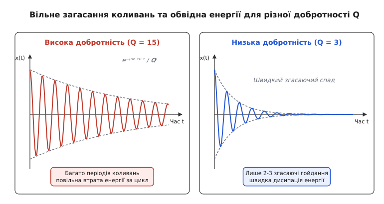
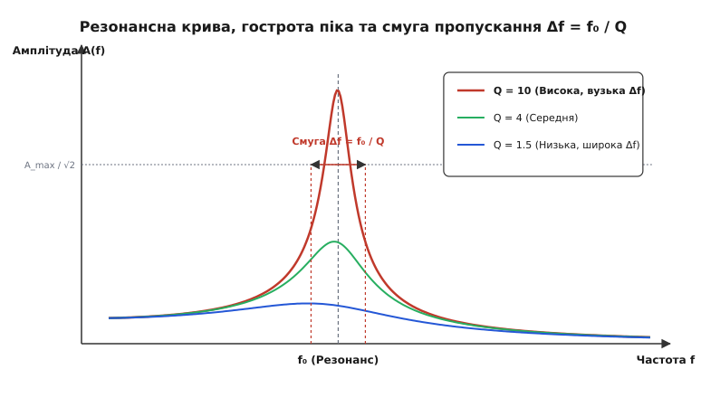
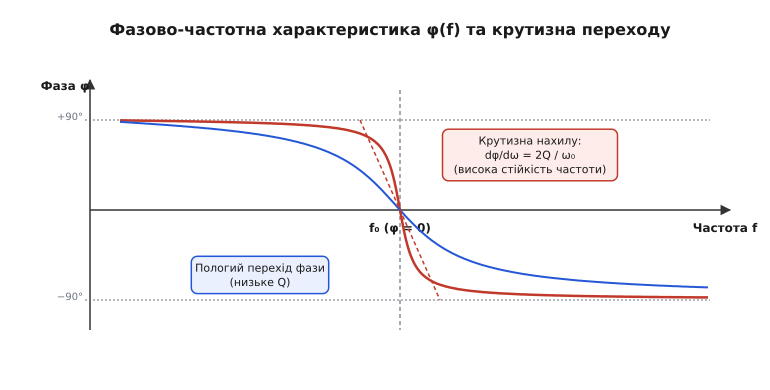
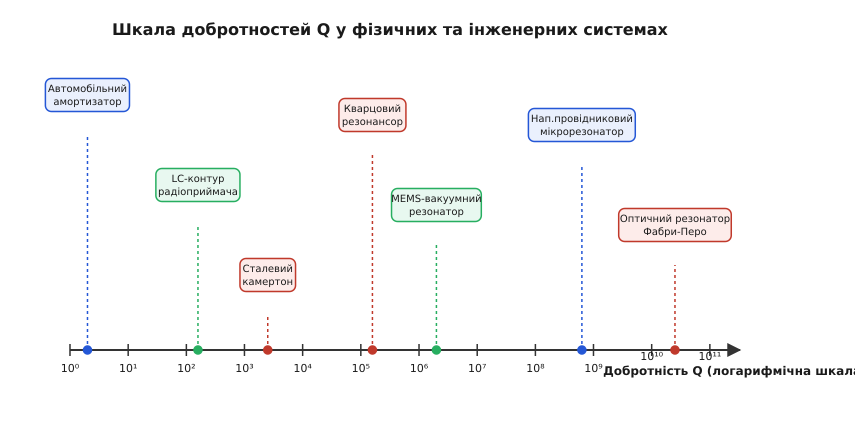

# Добротність Q: від чого залежить і що насправді міряє «дзвінкість» осцилятора

<preknowlist>
- [Гармонічний осцилятор](topic:ph-waves/harmonic-oscillator) — маса на пружині, власна частота ω₀ = √(k/m) та ідеальне незгасне гойдання.
- [Загасний осцилятор](topic:ph-waves/damped-oscillator) — додавання тертя -c·v, темп загасання γ та коефіцієнт демпфування ζ.
- [Резонанс](topic:ph-waves/resonance) — розгойдане ззовні коливання, амплітудно-частотна характеристика й підсилення на власній частоті.
- [Експоненційне ОДУ](topic:math-analysis/exponential-ode) — чому величина, швидкість спаду якої пропорційна їй самій, згасає за законом e⁻ᵞᵗ.
</preknowlist>

Ударте м'яким молоточком по сталевому камертону — він задзвенить чистою нотою, і цей дзвін триватиме п'ятнадцять або двадцять секунд. Ударте з тією самою силою по чавунній сковороді — вона видасть глухий короткий тріск і миттєво замовкне. Смикніть струну на концертній ґранд-гітарі — сустейн тягнеться довго й співучо; смикніть мотузку, натягнуту між двома стовпчиками, — рух згасне за півтора гойдання.

В усіх цих випадках ми маємо справу з коливальними системами, що дістали однакове початкове збудження. Проте їхня здатність зберігати накопичену енергію й продовжувати рух відрізняється в сотні й тисячі разів. У повсякденній мові ми кажемо: камертон має «чистий і довгий дзвін», а сковорода — «глуха». В інженерії та фізиці цю фундаментальну властивість вимірює одна-єдина безрозмірна величина — **добротність**, або **Q-фактор** (від англ. *quality factor*).

Виникає природне питання: від чого саме залежить добротність, чому вона однаково точна і для кришталевого келиха, і для радіоприймача, і для атомного годинника, і як одне число вміщає в собі тривалість дзвону, гостроту резонансного піка та крутизну фазового переходу?

### Загадка двох камертонів: чому темпу загасання замало

Перш ніж дати математичне означення добротності, з'ясуймо, чому звичайного коефіцієнта загасання або темпу згасання недосить для чесного порівняння різних осциляторів.

У теорії коливань вільний рух системи з тертям описується диференціальним рівнянням другої похідної:

```
m·ẍ + c·ẋ + k·x = 0
```

де `m` — маса, `k` — жорсткість пружини, а `c` — коефіцієнт в'язкого тертя. Поділивши на масу, ми отримуємо темп загасання `γ = c / (2m)`, який вимірюється в обернених секундах (`1/с`, або `с⁻¹`). Амплітуда коливань згасає за експоненційним законом `A(t) = A₀ · e⁻ᵞᵗ`.

Здавалося б, величина `γ` цілком описує втрати. Проте уявіть дві абсолютно різні коливальні системи:
1. Важкий годинниковий маятник з власною частотою `f₁ = 1 Гц` (одне коливання на секунду), амплітуда якого зменшується в `e` разів (приблизно в 2.718 рази) за 10 секунд. Його темп загасання `γ₁ = 0.1 с⁻¹`.
2. Високочастотний п'єзоелектричний резонатор із частотою `f₂ = 1 000 000 Гц` (один мегагерц), амплітуда якого також зменшується в `e` разів за 10 секунд. Його темп загасання `γ₂ = 0.1 с⁻¹` точно такий самий!

Формально обидва осцилятори мають однаковий темп спаду `γ`. Але подивімося на них очима самого коливання:
- Маятник за свої 10 секунд встигає зробити всього **10 повних гойдань**. Це означає, що він втрачає величезну частку своєї енергії на кожному окремому кроці.
- Мегагерцовий кристал за ті самі 10 секунд виконує **10 000 000 (десять мільйонів) повних циклів**! На кожному окремому коливанні він втрачає мікроскопічну, майже нечувану частку накопиченого запасу.

Порівнювати ці системи за темпом `γ` — це все одно що порівнювати витрату пального між океанським лайнером і моторолером, міряючи лише загальну кількість витрачених літрів за годину без урахування пройденої відстані. Нам потрібна величина, яка порівнює втрати не з абсолютним часом на годиннику, а **з власним ритмом самого осцилятора** — з тривалістю одного періоду коливання.

Саме такою безрозмірною відносною величиною і є **добротність Q**.

---

### Енергетичне джерело: що таке Q на найглибшому фізичному рівні

На найглибшому термодинамічному рівні добротність визначається не через сили й не через координати, а через **енергію**.

> 💡 **Фундаментальне означення:**
> **Добротність Q** — це безрозмірна величина, що дорівнює добутку `2π` на відношення повної енергії `W`, запасеної в коливальній системі, до енергії `ΔW_цикл`, яка незворотно дисипує (перетворюється на тепло чи випромінювання) за один період коливань `T`:
>
> ```
> Q = 2π · (Запасена енергія W) / (Втрачена енергія за один період ΔW_цикл)
> ```

Чому у формулі присутній множник `2π`? Повний період коливання синусоїди відповідає зміні фази на `2π` радіан. Якщо розглянути втрату енергії не за цілий період, а за мікроскопічний кут фазового зсуву в 1 радіан (що становить `1 / 2π` частину періоду), то відношення буде ще простішим: **добротність Q показує, у скільки разів запасена енергія більша за втрату енергії за один радіан фази**.

З цього енергетичного означення негайно випливає диференціальне рівняння для танення енергії системи під час вільного згасання:

```
dW / dt = − (ω₀ / Q) · W
```

де `ω₀ = 2π f₀` — колова власна частота осцилятора. Розв'язком цього рівняння є експоненційний спад енергії з часом:

```
W(t) = W₀ · e^( − (ω₀ t / Q) )
```

Оскільки енергія коливальної системи пропорційна квадрату її амплітуди (`W ~ A²`), амплітуда згасає у два рази повільніше за показником експоненти:

```
A(t) = A₀ · e^( − (ω₀ t / (2Q)) ) = A₀ · e^( − (π f₀ t / Q) )
```


*Згасання вільного «дзвону» осцилятора при високій (Q = 15) та низькій (Q = 3) добротності. При високому Q амплітуда спадає повільно, і маса встигає виконати десятки повних циклів. При низькому Q енергія розсіюється майже миттєво, за 2-3 гойдання. Огинаюча спадає за законом A(t) = A₀ e⁻⁽ⁿⁿ ᶠ⁰ ᵗ ∕ 𝑸⁾.*

Звідси походить надзвичайно зручне практичне правило «оцінки добротності на око»:
- **За час `t = Q / (π f₀)`** (що відповідає `Q / π` періодам коливань, або приблизно `0.318 · Q` циклів) амплітуда спадає в `e ≈ 2.718` рази.
- **За `N = Q` повних періодів коливань** амплітуда згасає в `e^π ≈ 23.14` рази, а енергія системи падає в `e^(2π) ≈ 535.5` разів.

#### Обчислювальний приклад. Камертон ля (440 Гц)

Розглянемо стандартний концертний камертон ноти «ля» (`f₀ = 440 Гц`). Запасена початкова кінетична енергія його ніжок становить `W₀ = 1.0 мДж` (міліджоуля).

**Сценарій А (Сталевий якісний камертон, `Q = 2200`):**
1. Втрата енергії за один період коливань:
   ```
   ΔW_цикл = 2π · W₀ / Q = 2π · 1.0 мДж / 2200 ≈ 0.00285 мДж (всього 0.285% за цикл)
   ```
2. Час згасання амплітуди в `e` разів:
   ```
   τ = Q / (π · f₀) = 2200 / (3.14159 · 440 Гц) ≈ 1.59 секунди
   ```
3. Кількість циклів до зменшення амплітуди в 10 разів (`ln(10) ≈ 2.302`):
   ```
   t_10 = 2.302 · τ ≈ 3.66 секунди (або N = 440 · 3.66 ≈ 1610 коливань)
   ```

**Сценарій Б (Бронзовий демпфований брусок, `Q = 220`):**
1. Втрата енергії за один період: `ΔW_цикл = 2.85%` за цикл (у 10 разів більше).
2. Час згасання амплітуди в `e` разів: `τ ≈ 0.159 секунди`.
3. Звук згасає до 10% всього за `0.366 секунди`.

Цей розрахунок наочно показує, що добротність Q є прямою числовою мірою «тривалості життя» коливального стану.

---

### Механічний та електричний осцилятори: дзеркало двох світів

Приголомшлива краса поняття добротності полягає в тому, що воно описується абсолютно однаковими математичними виразами для систем будь-якої фізичної природи. Зведемо в єдину систему механічний осцилятор та два види електричних коливальних контурів — послідовний та паралельний.

#### 1. Механічний осцилятор (маса, пружина, демпфер)
Для маси `m`, пружини жорсткістю `k` та демпфера з коефіцієнтом в'язкого опору `c`:
- Власна частота: `ω₀ = √(k / m)`
- Характеристичний механічний опір: `Z₀ = √(m · k)`
- Добротність:
  ```
  Q = m·ω₀ / c = √(m·k) / c = Z₀ / c
  ```
Тут фізичний зміст прозорий: добротність — це відношення інерційно-пружного спротиву системи `Z₀` до коефіцієнта тертя `c`. Що менше тертя `c`, то вища добротність.

#### 2. Послідовний електричний RLC-контур
У послідовному колі джерело, індуктивність `L`, ємність `C` та опір втрат `R` з'єднані послідовно.
- Власна частота (формула Томсона): `ω₀ = 1 / √(L · C)`
- Характеристичний (хвильовий) опір контуру: `ρ = √(L / C)`
- Добротність:
  ```
  Q = ω₀·L / R = 1 / (R·ω₀·C) = (1 / R) · √(L / C) = ρ / R
  ```
У послідовному контурі опір `R` перешкоджає проходженню струму й розсіює потужність у вигляді тепла на активній компоненті (`P = I² R`). Тому **що менший послідовний опір R, то вища добротність**. Ідеальний послідовний контур без втрат має `R = 0` та `Q = ∞`.

#### 3. Паралельний електричний RLC-контур
У паралельному контурі індуктивність `L`, ємність `C` та опір шунта `R_p` увімкнені паралельно до джерела струму.
- Власна частота: `ω₀ = 1 / √(L · C)`
- Добротність:
  ```
  Q = R_p / (ω₀·L) = R_p · ω₀·C = R_p / √(L / C) = R_p / ρ
  ```

Придивіться до цього дзеркального перевороту! У паралельному контурі висока добротність досягається **не при малому, а при якомога більшому опорі `R_p`**. Чому? Потрібно пригадати закони Кірхгофа: паралельний опір `R_p` відгалужує на себе струм із коливальної LC-петлі. Якщо `R_p` нескінченно великий (відкритий розрив кола), струм циркулює виключно між котушкою й конденсатором, ніде не втрачаючись, і `Q → ∞`. Якщо ж паралельний опір малий, він шунтує контур і швидко з'їдає накопичений заряд.

Зведемо ці три класичні системи в одну порівняльну таблицю:

| Параметр | Механічний осцилятор | Послідовний RLC-контур | Паралельний RLC-контур |
|---|---|---|---|
| **Реактивні елементи** | Маса `m`, жорсткість `k` | Індуктивність `L`, ємність `C` | Індуктивність `L`, ємність `C` |
| **Елемент втрат** | Демпфер `c` | Послідовний опір `R` | Паралельний опір `R_p` |
| **Власна частота `ω₀`** | `√(k / m)` | `1 / √(L · C)` | `1 / √(L · C)` |
| **Характеристичний опір** | `Z₀ = √(m · k)` | `ρ = √(L / C)` | `ρ = √(L / C)` |
| **Формула добротності Q** | `√(m·k) / c` | `(1 / R) · √(L / C)` | `R_p / √(L / C)` |
| **Умова незгасності (`Q → ∞`)**| `c → 0` | `R → 0` | `R_p → ∞` |

Детальніше про те, як Кеннет Джонсон у лабораторіях Bell першим ввів це число для опису телефонних котушок, дивіться у [вставці з історії добротності](topic:ph-waves/q-factor/hist-q-factor.md).

---

### Мікроскопічна фізика втрат: чому резонатори гублять енергію

Звідки насправді беруться втрати енергії у реальних фізичних об'єктах? Чому навіть висячий у вакуумі кристал чи ідеально виточена котушка мають скінченну добротність?

Сумарна добротність будь-якого реального резонатора складається з кількох незалежних каналів дисипації за правилом зворотного додавання:

```
1 / Q_сумарна = 1 / Q_середовище + 1 / Q_матеріал + 1 / Q_випромінювання + 1 / Q_кріплення
```

Розглянемо чотири головні мікроскопічні джерела втрат:

1. **В'язкий опір навколишнього середовища (`Q_середовище`):**
   При русі тіла в повітрі чи рідині молекули газу бомбардують поверхню, створюючи в'язке тертя та акустичні хвилі стиснення. Для вимірювачів із високою добротністю (наприклад, MEMS-акселерометрів чи кварцових пластин) це найбільший канал втрат. Щоб позбутися його, прилади запаковують у герметичні корпуси з високим вакуумом (`p < 10⁻³ Па`).

2. **Внутрішнє матеріальне тертя та термоеластична дисипація (`Q_матеріал`):**
   Навіть у чистому мономолекулярному матеріалі при деформації виникає локальний нагрів та охолодження (фізика Зенера, *thermoelastic damping*, TED). Зони стиснення стають гарячішими, зони розтягу — холоднішими. Виникає мікроскопічний потік тепла через кристал, який є термодинамічно незворотним процесом і перетворює частину механічної енергії на хаотичні фонони (тепло).

3. **Скін-ефект та діелектричні втрати в електроніці:**
   У котушках індуктивності високочастотний струм витісняється до поверхні провідника. Глибина скін-шару `δ_skin = √(2 / (μ·ω·σ))` на частоті `10 МГц` для міді становить усього `20 мкм`. Це катастрофічно зменшує ефективний переріз провідника й піднімає активний опір `R`. У конденсаторах енергію з'їдають діелектричні втрати переполяризації ізолятора (кут діелектричних втрат `tan δ = 1 / Q_C`).

4. **Витікання енергії через вузли кріплення (`Q_кріплення`):**
   Коли підвішена маса гойдається, хвилі деформації проходять крізь ніжку чи рамку кріплення до корпусу приладу (anchor losses). Щоб мінімізувати це витікання, конструктори роблять вузли підвісу точно у фазових вузлах стоячої хвилі (де амплітуда зсуву дорівнює нулю).

---

### Обчислювальний приклад: розрахунок сумарної добротності LC-контуру

Проілюструємо додавання втрат на конкретному радіотехнічному прикладі.

Нехай маємо паралельний коливальний контур радіоприймача на частоту `f₀ = 1.0 МГц` (`ω₀ = 6.283×10⁶ рад/с`), що складається з:
- Індуктивності `L = 100 мкГн` (`10⁻⁴ Гн`), послідовний опір втрат якої дорівнює `R_L = 5.0 Ом`.
- Конденсатора `C = 253.3 пФ` (`2.533×10⁻¹⁰ Ф`), діелектричний опір втрат якого `R_C = 0.5 Ом`.

**Крок 1. Розрахунок характеристичного опору контуру:**
```
ρ = √(L / C) = √( 10⁻⁴ / 2.533×10⁻¹⁰ ) = √( 394790 ) ≈ 628.3 Ом
```

**Крок 2. Розрахунок власної добротності котушки індуктивності `Q_L`:**
```
Q_L = ρ / R_L = 628.3 / 5.0 = 125.66
```

**Крок 3. Розрахунок власної добротності конденсатора `Q_C`:**
```
Q_C = ρ / R_C = 628.3 / 0.5 = 1256.6
```

**Крок 4. Обчислення сумарної добротності контуру `Q_total`:**
```
1 / Q_total = 1 / Q_L + 1 / Q_C = 1 / 125.66 + 1 / 1256.6 = 0.007958 + 0.000796 = 0.008754
Q_total = 1 / 0.008754 ≈ 114.2
```

**Крок 5. Смуга пропускання контуру за рівнем 3 дБ:**
```
Δf = f₀ / Q_total = 1 000 000 Гц / 114.2 ≈ 8756 Гц (8.75 кГц)
```

Цей приклад показує, що найгірший елемент (у даному випадку котушка з `Q_L = 125.66`) домінує у сумарному бюджеті втрат, але й конденсатор додав свої `8%` до розширення смуги.

---

### Частотне обличчя: гострота резонансного піка й смуга пропускання

Досі ми розглядали добротність під час **вільних коливань** — коли систему штовхнули й залишили напризволяще. Але добротність має й друге, не менш важливе обличчя, яке проявляється під час **вимушених коливань**, коли зовнішня сила розгойдує осцилятор на різних частотах.

Якщо змінювати частоту зовнішнього збудження `f` і міряти усталену амплітуду відгуку `A(f)`, ми дістанемо класичну колоколоподібну **амплітудно-частотну характеристику (АЧХ)**. На власній частоті `f₀` амплітуда сягає свого резонансного максимуму.


*Резонансні криві для трьох різних значень добротності. Висока добротність (Q = 10) дає вузький, високий пік з малою смугою пропускання Δf. Низька добротність (Q = 1.5) дає широкий пологий горб. Смуга пропускання Δf міряється за рівнем половинної потужності A_max / √2 і пов'язана з добротністю прямою формулою Q = f₀ / Δf.*

Тут добротність проявляється у двох ролях одночасно:
1. **Коефіцієнт резонансного підсилення:** На точній частоті резонансу `f₀` амплітуда вимушених коливань `A_max` перевищує статичне відхилення `A_stat` (яке виникло б під дією сталої сили тієї ж величини) рівно в `Q` разів:
   ```
   A_max = Q · A_stat
   ```
   Якщо добротність мосту чи вежі дорівнює `Q = 50`, то навіть невелика періодична сила вітру на резонансній частоті розгойдує конструкцію в 50 разів дужче, ніж така сама статична сила!

2. **Гострота вибірковості (ширина смуги 3 дБ):**
   Ширина резонансного піка `Δf`, виміряна на рівні половинної потужності (де амплітуда падає до `1 / √2 ≈ 0.707` від пікового значення `A_max`), пов'язана з добротністю фундаментальним співвідношенням:
   
   ```
   Δf = f₂ − f₁ = f₀ / Q   ⇒   Q = f₀ / Δf
   ```

Це співвідношення є основою всієї селективної радіотехніки. Якщо радіоприймач має виділити станцію на частоті `f₀ = 1000 кГц` (1 МГц) із смугою каналу `Δf = 10 кГц`, його коливальний контур мусить мати добротність не нижче `Q = 1000 / 10 = 100`. Якщо добротність контуру буде всього `Q = 10`, смуга розшириться до `100 кГц`, і приймач одночасно накладе в динамік десять сусідніх радіостанцій.

> 🔧 **Навіщо це.** **Фундаментальний інженерний компроміс:**
> З формули `Q = f₀ / Δf` випливає неминуча плата за високу селективність. Висока добротність `Q` дає надзвичайно вузьку смугу й чудово відфільтровує завади. Проте час встановлення коливань (*transient response time*) дорівнює `τ = Q / (π f₀) = 1 / (π Δf)`.
> 
> Що вища добротність, то **повільніше контур відгукується на зміну сигналу**. Якщо в радіоприймачі із надвисоким `Q` спробувати передавати швидку інформацію, контур просто не встигатиме прореагувати на швидкі фронти — сигнал «розмажеться» в часі. Інженер завжди шукає компроміс між фільтрацією завад (високе Q) та швидкістю обробки сигналів (низьке Q).

Детальний алгоритм обчислення добротності за спектром та часовим спадом із кодом на C та C++ подано у [проектній вставці про вимірювання Q](topic:ph-waves/q-factor/proj-q-measurement.md).

---

### Чотири обличчя однієї величини та п'яте — фазовий нахил

Підіб'ємо проміжний підсумок. Добротність `Q` можна виразити через чотири еквівалентні фізичні формулювання. Жодне з них не суперечить іншому — це просто п'ять різних дзеркал, у яких відбивається та сама дисипативна природа осцилятора:

1. **Енергетичне обличчя:** `Q = 2π · (W / ΔW_цикл)` — відношення запасеної енергії до втраченої за період.
2. **Часове обличчя (дзвін):** `Q = π / δ` — скільки радіан (чи циклів `N ≈ Q / π`) проживе вільне коливання до спаду амплітуди в `e` разів.
3. **Амплітудне обличчя:** `Q = A_max / A_stat` — у скільки разів резонансний пік вищий за статичний відгук.
4. **Частотне обличчя (смуга):** `Q = f₀ / Δf` — відношення резонансної частоти до смуги половинної потужності.

Проте існує й **п'яте обличчя**, про яке рідко пишуть у базових підручниках, але яке вирішує долю сучасних годинників та квантових систем: **крутизна фазової характеристики**.


*Зсув фази φ(f) між збуджувальною силою та відгуком осцилятора. На резонансній частоті f₀ фаза проходить через точку −90° (або 0° для імпедансу). Крутизна цього переходу прямо пропорційна добротності: dφ/dω = 2Q / ω₀. При високому Q фаза перевертається майже миттєво.*

На резонансній частоті фазовий зсув `φ(f)` між силою та відхиленням становить точно `−90°`. Якщо обчислити похідну фази по частоті на резонансі, ми дістанемо:

```
dφ / dω |_(ω = ω₀) = 2Q / ω₀ = Q / (π f₀)
```

Що вища добротність `Q`, то **крутіше перевертається фаза** поблизу точки резонансу.

Чому це так важливо? У [кварцовому генераторі](topic:hw-components/quartz-resonator) чи атомному стандарті частоти електронна схема підтримує автоколивання, замикаючи петлю зворотного зв'язку за фазою. Якщо температура або напруга живлення схеми трохи попливуть, це створить фазову заваду `Δφ`. Щоб компенсувати її, частота генератора змушена зміститися на `Δω`.

З формули видно: `Δω = Δφ / (dφ/dω) = Δφ · ω₀ / (2Q)`. **Що вища добротність резонатора Q, то менший зсув частоти викликає фазовий шум схеми!** Саме тому кварцові кристали з `Q ≈ 100 000` забезпечують точність ходу годинника в частки секунди на рік, а атоми цезію та рубідію з `Q > 10¹⁰` — секунду за мільйони років.

Строгі математичні виведення усіх п'яти облич добротності зібрано у [математичній вставці про Q-фактор](topic:ph-waves/q-factor/math-q-factor.md).

---

### Добротність у квантовій фізиці та лазерній оптиці

У сучасній квантовій фізиці та лазерній оптиці добротність вийшла далеко за межі класичної механіки й електротехніки.

#### 1. Модуляція добротності лазерів (Q-switching)
У 1960 році Роберт Геллварт запропонував принцип **модуляції добротності** (*Q-switching*) для створення лазерних імпульсів гігаватного рівня потужності.

У звичайному лазері добротність оптичного резонатора висока постійно. Щойно накачування створює інверсну заселеність рівнів, лазер одразу починає випромінювати світло, виснажуючи запасену енергію.

У режим Q-switching усередину резонатора ставлять швидкий оптичний затвор (наприклад, комірку Поккельса).
- **Етап 1 (Низька добротність `Q_низьке`):** Затвор закритий, генерація світла заборонена. Молекули активного середовища накачуються спалахом лампи чи лазерного діода до гранично можливого рівня інверсії. Енергія накопичується, наче вода за греблею.
- **Етап 2 (Швидке перемикання на `Q_високе`):** Затвор відкривається за кілька наносекунд. Добротність стрибає в тисячі разів.
- **Етап 3 (Гігантський імпульс):** Уся накопичена енергія вихлюпується в один гігантський гігаватний імпульс тривалістю в кілька наносекунд.

#### 2. Ефект Перселла та квантова електродинаміка порожнин (CQED)
У квантовій оптиці добротність оптичного резонатора `Q` разом з його фізичним об'ємом `V` визначає швидкість спонтанного випромінювання атома або квантової точки, вміщеної всередину (ефект Перселла):

```
F_P = (3 / (4π²)) · (λ / n)³ · (Q / V)
```

де `F_P` — фактор Перселла (прискорення спонтанного випромінювання). Якщо помістити одиночний атом у мікрорезонатор із високим `Q` та крихітним об'ємом `V`, атом випромінює фотон у тисячі разів швидше, ніж у вільному просторі. Це є основою джерел одиночних фотонів для квантового шифрування та квантових комп'ютерів.

#### 3. Атомні оптичні ґратки та стандарти частоти (`Q ≈ 10¹⁷`)
Найвищою добротністю в сучасній фізиці володіють не штучні резонатори з дзеркалами, а власні квантові переходи затиснутих у світлову ґратку ультрахолодних атомів стронцію та ітербію. Резонансний перехід між квантовими рівнями атома з довжиною хвилі 698 нм має природну ширину лінії в кілька мілігерц. Відношення частоти оптичного переходу (`f₀ ≈ 429 ТГц`) до ширини лінії дає фантастичну добротність `Q ≈ 10¹⁷`. Годинник на такому атомі помиляється менше ніж на одну секунду за тридцять мільярдів років — час, що перевищує вік нашого Всесвіту.

---

### Зоопарк добротностей: від автомобільного демпфера до квантового резонатора

У реальному фізичному світі добротність коливальних систем охоплює колосальний діапазон — понад 12 порядків величини!


*Діапазон добротностей Q у фізиці та техніці на логарифмічній шкалі: від автомобільних підвісок та радіоконтурів до п'єзокварцю, вакуумних MEMS та оптичних резонаторів Фабри — Перо.*

Розглянемо головні класи систем та фізичні механізми, які обмежують їхнє Q:

#### 1. Механічні системи та підвіски (`Q ≈ 1 … 10`)
Автомобільний амортизатор свідомо роблять із низькою добротністю (`Q ≈ 1.5 … 2.5`, що відповідає коефіцієнту демпфування `ζ ≈ 0.2 … 0.3`). Якби добротність підвіски була високою (`Q = 50`), машина після кожної вибоїни гойдалася б на пружинах ще протягом хвилини, що призвело б до втрати зчеплення з дорогою й катастрофи.

#### 2. Акустичні інструменти й дифузори (`Q ≈ 100 … 1000`)
Сталевий камертон чи бронзовий церковний дзвін мають добротність `Q ≈ 1000`. Головний канал втрат тут — це не стільки внутрішнє тертя металу, скільки **випромінювання акустичних хвиль у повітря**. Власне, саме це випромінювання ми й чуємо як довгий співучий нотний тон.

#### 3. Електричні LC-контури (`Q ≈ 20 … 300`)
У класичних котушках індуктивності добротність обмежена омичним опором дроту, вихровими струмами в осерді (струми Фуко) та поверхневим скін-ефектом. На частотах понад 10 МГц звичайний мідний дріт витісняє струм у тонесенький зовнішній шар, опір зростає, і `Q` рідко перевищує `200…300`.

#### 4. Кварцові кристали та MEMS-резонатори (`Q ≈ 10⁴ … 10⁷`)
П'єзоелектричний кристал кварцю не має мідного дроту. Його коливання — це пружні деформації кристалічної ґратки. Втім, навіть у монокристалі виникає **термоеластична дисипація** (TED, від англ. *Thermoelastic Damping*): під час стиснення ділянка кристала трохи нагрівається, а під час розтягу — охолоджується. Потік тепла між гарячими й холодними мікрозонами незворотно розсіює енергію. Щоб досягти `Q > 10⁶` у кремнієвих MEMS-дзеркалах і гіроскопах, їх герметизують у глибокому вакуумі (щоб прибрати опір повітря) та підбирають особливі геометрії підвісів.

#### 5. Оптичні та надпровідні резонатори (`Q ≈ 10⁸ … 10¹²`)
На вершині цієї піраміди стоять:
- **Об'ємні надпровідні резонатори з ніобію** для прискорювачів частинок (наприклад, у CERN або Станфорді). При охолодженні рідким гелієм до `1.8 К` опір зникає, і добротність сягає `Q ≈ 10¹⁰ … 10¹¹`.
- **Оптичні резонатори Фабри — Перо** та мікросфери з коливаннями типу «шепочучої галереї» (*Whispering Gallery Modes*, WGM). Фотон світла відбивається від надточних діелектричних дзеркал або внутрішніх стінок кварцової кульки мільярди разів, забезпечуючи `Q > 10¹²`.

Повний опис програмних типів даних та граничних обмежень для обчислення добротностей у різних фізичних середовищах наведено у [вставці зі специфікацією API](topic:ph-waves/q-factor/api-q-specs.md).

---

### Інженерні пастки, навантажена добротність та нелінійні втрати

Робота з добротністю в реальному інженерному проектуванні вимагає урахування трьох важливих пасток, на яких часто спотикаються початківці.

#### 1. Пастка «Високе Q це завжди краще»
Це поширена омана. Висока добротність є благом для фільтрів радіоприймачів, кварцових генераторів та лазерів. Але в багатьох галузях висока добротність — це катастрофа:
- **У високоякісній акустиці (Hi-Fi динаміки):** Дифузор гучномовця повинен мати низьку добротність (`Q_ts ≈ 0.3 … 0.7`). Якщо добротність дифузора буде високою (`Q = 10`), після кожного короткого удару барабана колонка гудітиме й «перегукуватиметься» ще кілька періодів.
- **У вимірювальних приладах зі стрілкою:** Аналоговий амперметр повинен мати критичне демпфування (`Q = 0.5`, або `ζ = 1`). При високому `Q` стрілка довго коливатиметься навколо позначки, перш ніж зупинитися.

#### 2. Власна проти Навантаженої добротності (Q₀ та Q_L)
Найчастіша помилка радіоконструкторів — плутанина між ненавантаженою добротністю автономного резонатора `Q₀` та його реальною робочою добротністю в колі `Q_L` (*Loaded Q*).

Коли резонатор під'єднують до зовнішнього каскаду (наприклад, підключають котушку до антени чи підсиливача з внутрішнім опором `R_gen`), частина енергії починає витікати через це зовнішнє з'єднання. З'являється **зовнішня добротність** `Q_ext`.

Підсумкова навантажена добротність `Q_L` завжди **менша за власну** й обчислюється за правилом паралельного додавання втрат:

```
1 / Q_L = 1 / Q₀ + 1 / Q_ext
```

Якщо ваша котушка має власну добротність `Q₀ = 200`, але ви сильно зв'язали її з генератором так, що `Q_ext = 200`, то реальна добротність у схемі впаде вдвічі: `Q_L = 100`, і смуга контуру розшириться вдвічі.

#### 3. Тепловий шум і теорема Флуктуаційно-Дисипативна (FDT)
Існує ще один глибокий фундаментальний зв'язок: за фундаментальною **флуктуаційно-дисипативною теоремою (FDT)** будь-який елемент, що дисипує енергію (тобто зменшує Q), є джерелом **теплового шуму**.

У вакуумному MEMS-акселерометрі або чутливому гравітаційному детекторі (такому як LIGO) хаотичні теплові поштовхи молекул і атоми кристалічної ґратки викликають флуктуації сили — броунівський брязкіт. Спектральна густина цього флуктуаційного шуму прямо пропорційна коефіцієнту демпфування `c = m ω₀ / Q`.

Щоб зменшити власний тепловий шум датчика й почути надслабкі сигнали (наприклад, гравітаційні хвилі від злиття чорних дир), фізики змушені піднімати добротність підвісів дзеркал LIGO до фантастичних значень `Q > 10⁸` та охолоджувати деталі до кріогенних температур.

Добротність Q — це фундаментальне дзеркало, у якому нерозривно сплетені тривальне збереження енергії, гострота резонансу, стійкість частоти та рівень теплового шуму світобудови.
