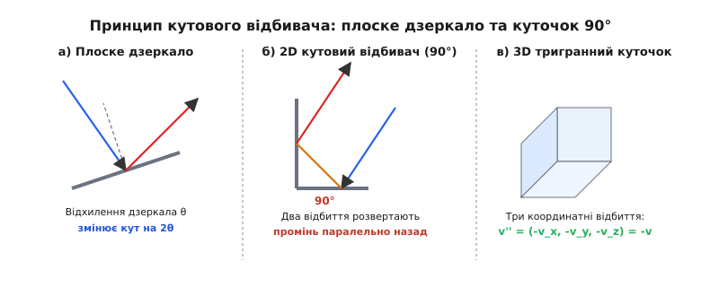
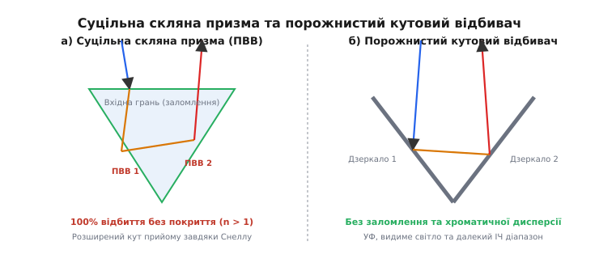
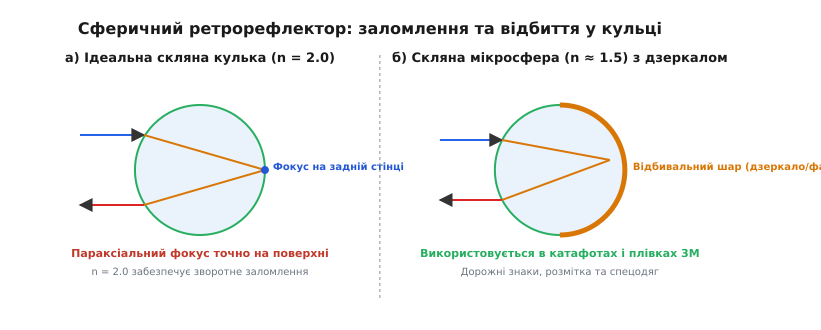
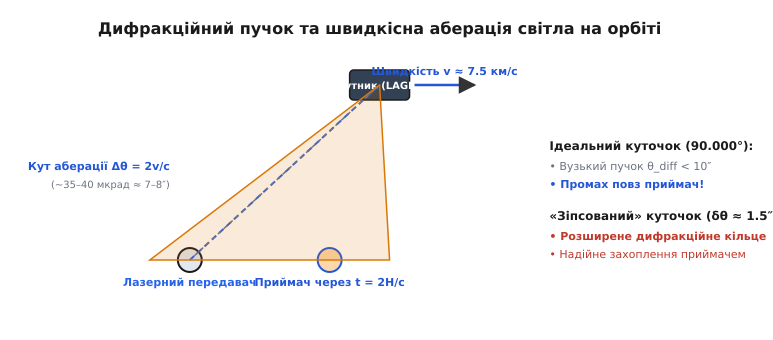

# Ретрорефлектор

<preknowlist>
- [Повне внутрішнє відбиття](root:ph-waves/total-internal-reflection) — критичний кут та умови відсутності заломленої хвилі.
- [Закон Снелла](root:ph-waves/snells-law) — співвідношення кутів заломлення та показників заломлення.
- [Показник заломлення](root:ph-waves/refractive-index) — фазова швидкість світла в середовищі.
- [Дифракція](root:ph-waves/diffraction) — кутова розбіжність обмеженого світлового пучка.
</preknowlist>

Уявімо оптичну систему вимірювання відстані до рухомого штучного супутника Землі чи далеку геодезичну мішень на відстані кількох кілометрів. Передавальна станція випромінює короткий лазерний імпульс і прагне вловити повернене відбиття, щоб виміряти точний час затримки сигналу. Якщо встановити на цілі звичайне плоске дзеркало, світло повернуться строго назад на джерело лише за однієї-єдиної умови: коли лазерний промінь падає строго перпендикулярно до поверхні дзеркала (під кутом падіння `θ = 0°`). 

Варто дзеркальній поверхні або самому об'єкту відхилитися бодай на одну тисячну частку градуса, як відбитий світловий промінь зміститься від напрямку на джерело на подвійний кут `2θ`. На відстані у 10 кілометрів таке мікроскопічне кутове відхилення зсуне відбитий світловий пучок на сотні метрів убік, і приймальний телескоп опиниться в абсолютній темряві. Для оптичного зв'язку, автодорожньої безпеки, промислової метрології та космічної дальнометрії потрібен пасивний пристрій, який здатний повертати випромінювання строго назад на джерело незалежно від кутового нахилу пристрою в просторі. Пристрій, що виконує цю задачу, називається **ретрорефлектором** або **світлоповертачем** (від латинського *retro* — «назад» та *reflectere* — «відбивати»).

## 1. Порівняння відбиття: Дифузне, дзеркальне та ретрорефлексивне

Щоб усвідомити унікальність ретрорефлектора, розглянемо три основні види взаємодії світла з поверхнею твердого тіла:

1. **Дифузне (розсіяне) відбиття:** Виникає на шорстких поверхнях (дерево, бетон, місячний реголіт, звичайний папір). Згідно із законом косинуса Ламберта, світлова енергія падаючого променя розсіюється по всій напівсфері напрямків. Завдяки цьому ми бачимо предмет з будь-якої точки огляду. Проте густина енергії поверненого сигналу у напрямку джерела зменшується пропорційно площі напівсфери `2π R²`. На відстані в сотні тисяч кілометрів повернута світлова енергія стає практично нульовою.
2. **Дзеркальне (спрямоване) відбиття:** Відбувається на плоских полірованих металевих чи скляних поверхнях. Промінь залишається монолітним, але напрямок відбитого вектора визначається строго кутом падіння: `θ_out = θ_in` відносно нормалі. При зміні нахилу дзеркала на кут `θ` напрямок відбитого променя повертається у просторі на кут `2θ`.
3. **Ретрорефлексія (зворотне відбиття):** Світловий пучок не розсіюється у напівсферу і не залежить від кута нахилу поверхні. Пристрій повертає випромінювання у вигляді вузького паралельного пучка строго антипаралельно вхідному напрямку: `v_out = -v_in`.

```
а) Дифузне відбиття         б) Дзеркальне відбиття         в) Ретрорефлексія
     (розсіювання)               (під кутом 2θ)               (строго назад)
       \  │  /                       \     /                      \  ▲
        \ │ /                         \   /                        \ │
   ──────┴─┴─┴──────             ──────┴─┴──────             ──────┴─┴──────
```

Основна характеристика ретрорефлектора — його кутова апертура (кут захоплення), у межах якої ефективність зворотного повернення променя залишається близькою до `100%`.

## 2. Геометричний принцип кутового відбивача (Corner Reflector)

Найпоширенішим і найпростішим із погляду геометрії є **кутовий відбивач** (англ. *Corner Reflector*).

Почнемо розбір із двовимірної моделі. Нехай у площині `xy` розташовано два плоских дзеркала під прямим кутом `90°` одне до одного. Перше дзеркало збігається з віссю `y` (нормаль `n₁ = (1, 0)`), друге — з віссю `x` (нормаль `n₂ = (0, 1)`).

Світловий промінь з вектором напрямку `v_in = (v_x, v_y)` входить усередину двовимірного куточка. Відповідно до закону дзеркального відбиття, при взаємодії з першим дзеркалом перпендикулярна компонента вектора `v_x` змінює свій знак на протилежний, а паралельна компонента `v_y` залишається незмінною. Після першого відбиття новий вектор напрямку дорівнює:

```
v' = (-v_x, v_y)      [відбиття від грані з нормаллю n₁ = (1, 0)]
```

Далі промінь рухається до другого дзеркала. При відбитті від другої грані знак змінює компонента `v_y`:

```
v'' = (-v_x, -v_y)    [відбиття від грані з нормаллю n₂ = (0, 1)]
```

Шляхом двох послідовних відбиттів підсумковий вектор напрямку `v''` повністю інвертується:

```
v'' = -v_in
```

Промінь виходить із куточка строго антипаралельно вхідному напрямку. Сумарний кут розвороту променя в площині `xy` становить строго `180°` для будь-якого початкового кута падіння, поки світло послідовно зачіпає обидві дзеркальні грані.


*Принцип кутового відбивача: відхилення плоского дзеркала (а) змінює напрямок променя на 2θ, тоді як два відбиття у 2D куточку (б) та три відбиття у 3D кутовому кубі (в) повертають промінь строго паралельно назад.*

Проте у тривимірному просторі двовимірний куточок інвертує лише дві компоненти вектора. Промінь, що має кутовий нахил вздовж осі `z`, збереже свій нахил і не повернеться на джерело.

Для повноцінного тривимірного розвороту світла конструюють **тригранний кутовий відбивач** (англ. *3D Corner Cube*). Він складається з трьох взаємно перпендикулярних дзеркальних площин (`xy`, `yz`, `zx`), які перетинаються в одній спільній вершині (подібно до кута тривимірного куба).

Коли світловий промінь із вектором напрямку `v_in = (v_x, v_y, v_z)` входить усередину 3D-куточка й зазнає трьох послідовних відбиттів від усіх трьох координатних граней, його координатні компоненти піддаються потрійній інверсії:

```
v_out = (-v_x, -v_y, -v_z) = -v_in
```

Оскільки діагональні матриці координатних відбиттів комутують між собою, порядок відбиття світла від граней (наприклад, `x → y → z` або `z → x → y`) не має жодного значення: підсумковий вектор завжди дорівнює `-v_in`.

Детальне алгебраїчне виведення за допомогою операторів Гаусгольдера та аналіз відхилень при неточностях прямого кута наведено у вставці [Математична геометрія кутового відбивача та матриці відбиття](root:ph-waves/retroreflector/math-corner-reflection.md).

## 3. Конструкції: Порожнистий куточок проти суцільної скляної призми

На практиці тригранні кутові ретрорефлектори виготовляють у двох основних конструктивних варіантах: у вигляді **порожнистого куточки** (англ. *Hollow Corner Cube*) та **суцільної скляної призми** (англ. *Solid Corner Cube Prism*).


*Конструкції кутових ретрорефлекторів: суцільна скляна призма (а) використовує заломлення Снелла та 100% повне внутрішнє відбиття, тоді як порожнистий куточок (б) працює від металевих дзеркал без заломлення та хроматичної дисперсії.*

Порожнистий кутовий відбивач виготовляють із трьох плоских дзеркальних пластин із високоякісним поліруванням, механічно або за допомогою оптичного контакту з'єднаних під кутом `90.000°`. На робочі поверхні граней наносять відбивальне металеве покриття (золото, алюміній або срібло).

Порожнисті куточки мають важливі переваги:
- **Широкий спектральний діапазон:** Світло поширюється у повітрі або вакуумі, тому відсутнє поглинання у товщі скла. Елемент може працювати від далекого ультрафіолету (`λ < 200` нм) до глибокого інфрачервоного діапазону (`λ > 10` мкм).
- **Відсутність хроматичних аберацій:** Оскільки світло не проходить крізь заломлювальне оптичне середовище, відсутня дисперсія та термооптичні деформації хвильового фронту.
- **Мала маса:** Ідеально підходить для аерокосмічних систем, де маса апарата критична.

Недоліком порожнистих куточків є втрати енергії на металевих дзеркалах. Якщо коефіцієнт відбиття металевої плівки становить `R ≈ 95%`, то після трьох відбиттів підсумковий коефіцієнт відбиття призми падає до:

```
R_total = R₁ · R₂ · R₃ ≈ (0.95)³ ≈ 0.857    [втрата 14.3% світлової енергії]
```

Суцільна скляна кутова призма виготовляється з монокристалічного блоку високочистого оптичного скла (кварцового скла *fused silica* або крону BK7). Вона має плоску вхідну грань (основу) та три бічні трикутні грані, що утворюють вершину куба.

Головна фізична перевага суцільної призми — використання **повного внутрішнього відбиття (ПВВ)**. Коли світло усередині скляного блоку падає на бічну межу «скло → повітря» під кутом `θ_i`, більшим за критичний кут Снелла:

```
θ_c = arcsin(n_air / n_glass)
```

заломлений промінь у повітря не виходить взагалі, а вся енергія електромагнітної хвилі повністю (`100%`) відбивається усередину скляного середовища. Для скляної призми із `n = 1.50` критичний кут становить:

```
θ_c = arcsin(1.00 / 1.50) ≈ 41.8°      [поріг повного внутрішнього відбиття]
```

Оскільки кут падіння світла на бічні грані куточки усередині скла становить близько `54.7°`, умова `θ_i > θ_c` виконується з великим запасом. Призма працює як 100% ідеальне дзеркало без жодного дзеркального металевого покриття!

Крім того, плоска вхідна грань призми працює як заломлювальний елемент. За законом Снелла:

```
sin(θ_glass) = (n_air / n_glass) · sin(θ_air)
```

Заломлення на вхідній межі відхиляє промінь ближче до оптичної осі призми. Це звужує кутовий розмах променів усередині скла і штучно розширює зовнішній апертурний кут захоплення світла порівняно з порожнистим куточком.

## 4. Сферичні та катадіоптричні ретрорефлектори

Поряд із кутовими призмами широко застосовується другий важливий клас світлоповертачів — сферичні катадіоптричні елементи (скляні мікросфери та лінзово-дзеркальні системи).

Розглянемо суцільну скляну кулю радіуса `R` з показником заломлення `n`, розміщену у повітрі (`n_air = 1.0`).

Паралельний світловий пучок падає на передню півсферу кулі. Сферична поверхня працює як збиральна лінза, заломлюючи промені усередину. Знайдемо умову, за якої фокус заломленого параксіального пучка лягає точно на задню поверхню цієї ж кулі.

За формулою заломлення на одній сферичній поверхні для параксіальних променів:

```
(n_1 / s) + (n_2 / s') = (n_2 - n_1) / R
```

де `n_1 = 1.0` (повітря), `n_2 = n` (скло), пучок падає з нескінченності (`s = ∞`), а фокус має опинитися на протилежному боці кулі на відстані діаметра `s' = 2R`:

```
(1.0 / ∞) + (n / 2R) = (n - 1.0) / R
```

Спрощуючи це рівняння, отримуємо:

```
n / 2R = (n - 1.0) / R
n = 2 · (n - 1.0)
n = 2.0
```

Ідеальний показник заломлення сферичного ретрорефлектора дорівнює **`n = 2.0`**.


*Сферичний ретрорефлектор: при n = 2.0 (а) параксіальне світло фокусується точно на задній поверхні кульки і повертається назад; для звичайного скла n ≈ 1.5 (б) на задню півсферу наносять відбивальне покриття.*

При `n = 2.0` світло, заломлюючись на передній стінці, фокусується у точкову пляму на задній поверхні кулі. Відбившись від задньої стінки, промінь повертається назад тим самим шляхом і, заломлюючись на передній півсфері другий раз, виходить паралельно вхідному пучку у зворотному напрямку. Сферичний ретрорефлектор з `n = 2.0` має повну симетрію обертання: він повертає світло однаково для будь-якого кута падіння в межах півсфери!

Оптичне скло з `n = 2.0` є дорогим у виробництві (важкі лантанові та титанові стекла). У масових виробах (дорожня маркувальна фарба, світлоповертальні елементи одягу пішоходів, дорожні знаки) застосовують дешевше скло з `n ≈ 1.50–1.54`.

Для кулі з `n = 1.5` параксіальний фокус лежить поза кулькою на відстані `0.5 R` за її задньою стінкою. Щоб примусити таку мікросферу працювати як ретрорефлектор, на її задню півсферу наносять відбивальний алюмінієвий шар або занурюють кульки у шар фарби з відбивальними пігментами.

Така комбінація заломлювальної лінзи (сфери) та відбивального дзеркала у фокальній площині називається **катадіоптричною системою**.

## 5. Фізичні обмеження: Дифракція, швидкісна аберація та поляризація

Геометрична оптика припускає, що ідеальний ретрорефлектор повертає світло у вигляді нескінченно вузького паралельного пучка. Проте хвильові ефекти створюють фундаментальні фізичні обмеження.

### Дифракційна розбіжність

Будь-який світловий пучок обмеженого діаметра `D` зазнає дифракційного розмиття. На виході з ретрорефлектора світлова хвиля дифлагує на вхідній апертурі, утворюючи у дальній зоні дифракційну картину Ейрі.

Кутовий радіус першого темного кільця (кутова розбіжність поверненого пучка) описується формулою:

```
θ_diff ≈ 1.22 · (λ / D)      [кутова розбіжність за критерієм Релея]
```

де `λ` — довжина хвилі світла, а `D` — діаметр апертури призми.

Наприклад, для лазера з `λ = 532` нм та призми діаметром `D = 3.8` см кутова розбіжність становить `θ_diff ≈ 3.5` кутових секунд.

Оскільки світло долає відстань `R` до ретрорефлектора і відстань `R` назад, інтенсивність поверненого сигналу підпорядковується **закону зворотного четвертого ступеня**:

```
P_rec ∝ P_trans · (D_retro² · D_tele²) / (λ² · R⁴)
```

Ця залежність `1 / R⁴` робить дальнометрію на великих відстанях надзвичайно чутливою до оптичних втрат.

### Ефект швидкісної аберації світла та «зіпсовані» куточки

У лазерній дальнометрії штучних супутників Землі (SLR) виникає динамічний релятивістський ефект — **швидкісна аберація світла**.

Нехай наземна лазерна станція випромінює світловий імпульс у бік супутника LAGEOS, що рухається на орбіті висотою `5900` км зі швидкістю `v ≈ 5.7` км/с. За час `Δt = 2H / c ≈ 39` мс, поки світло летить до супутника й повертається назад, приймальна станція на Землі зміщується у просторі разом із обертанням та рухом Землі.

У системі відліку ретрорефлектора вихідний пучок зміщується на кут аберації:

```
Δθ_aberration = 2 · (v_rel / c)
```

Для супутника LAGEOS кут аберації становить `Δθ ≈ 35–40` мікрорадіан (близько `7–8` кутових секунд).


*Вплив швидкісної аберації світла: ідеальний куточок повертає надвузький пучок, який промахується повз приймач через рух супутника; «зіпсований» куточок із похибкою δθ розширює пучок у кільце, забезпечуючи прийом.*

Якби космічний ретрорефлектор мав ідеальні кути `90.000°` та велику апертуру `D = 10` см, його дифракційна розбіжність становила б лише `1.3` кутові секунди. У результаті повернений лазерний промінь упав би у порожнє місце за `8` кутових секунд від лазерної станції, і приймальний телескоп не вловив би жодного фотона!

Для подолання цього ефекту застосовують **контрольовану деформацію кутів** (англ. *spoiled corner cubes*). Граням призм свідомо надають невелику кутову похибку від прямого кута `δθ ≈ 0.5–1.5` кутових секунд. Ця похибка розщеплює повернений дифракційний диск Ейрі на кільцеподібну дифракційну картину, кутовий радіус якої строго збігається з кутом швидкісної аберації, забезпечуючи надійний прийом сигналу.

### Поляризаційні ефекти при повному внутрішньому відбитті

При кожному з трьох повних внутрішніх відбиттів усередині скляної призми між `p`- та `s`-компонентами електричного поля виникає фазовий зсув Френеля:

```
tan(δ / 2) = (cos θ_i · √(sin² θ_i - n⁻²)) / sin² θ_i
```

Оскільки світловий промінь проходить через три грані у різній послідовності залежно від сектора вхідної апертури, вихідне світло розбивається на шість суб-апертур із різним станом поляризації. Початково лінійно поляризоване лазерне світло перетворюється на суміш еліптично поляризованих станів.

## 6. Практичні застосування та інженерна геодезія

Завдяки пасивності та високій точності ретрорефлектори застосовуються у найрізноманітніших галузях.

```
┌─────────────────────────────────────────────────────────────────────────┐
│                     Класифікація застосувань ретрорефлекторів           │
├─────────────────────────┬───────────────────────────────────────────────┤
│ Галузь                  │ Тип ретрорефлектора та функція                │
├─────────────────────────┼───────────────────────────────────────────────┤
│ Космічна геодезія (LLR) │ Кварцові панелі Apollo 11, 14, 15, Lunokhod   │
│                         │ Вимірювання відстані до Місяця з точністю 1 мм │
├─────────────────────────┼───────────────────────────────────────────────┤
│ Лазерне локування (SLR) │ Супутники-сфери LAGEOS-1/2, LARES, Etalon     │
│                         │ Моніторинг дрейфу континентів та тектоніки    │
├─────────────────────────┼───────────────────────────────────────────────┤
│ Наземна геодезія        │ Роботизовані тахеометри (Total Stations)      │
│                         │ Точна високочастотна високоточна далекометрія │
├─────────────────────────┼───────────────────────────────────────────────┤
│ Промислова метрологія   │ Лазерні трекери (Laser Trackers)              │
│                         │ Контроль геометрії фюзеляжів літаків та станків│
├─────────────────────────┼───────────────────────────────────────────────┤
│ Оптичний зв'язок        │ Модульовані ретрорефлектори (MRR)             │
│                         │ Зворотна передача даних без власного лазера   │
├─────────────────────────┼───────────────────────────────────────────────┤
│ Автодорожня безпека     │ Світлоповертальні плівки, катафоти 3M         │
│                         │ Повернення світла фар автоводієві вночі       │
└─────────────────────────┴───────────────────────────────────────────────┘
```

> 🔧 **Навіщо це.**
> У сучасній інженерній геодезії роботизований тахеометричний комплекс (англ. *Total Station*) безперервно стежить за положенням тригранної кутової призми, закріпленої на геодезичній вісі. Лазер випромінює фазово-модульований промінь, що відбивається від ретрорефлектора і повертається у приймальний об'єктив. Оскільки кутовий відбивач повертає промінь строго антипаралельно, вимірювальна система гарантує стабільний контакт навіть тоді, коли віха з призмою перебуває в русі або нахилена оператором.

Історія створення місячних панелей та наукові відкриття 50-річної програми LLR детально висвітлені у вставці [Лазерне локування Місяця та пасивні ретрорефлектори Apollo](root:ph-waves/retroreflector/hist-apollo-retroreflector.md).

Перспективним напрямком є **оптичний зв'язок на зворотній модуляції** (англ. *Modulated Retroreflector*, MRR). На вхідну апертуру кутового ретрорефлектора (наприклад, на малогабаритному БПЛА чи супутнику CubeSat) встановлюється швидкісний рідкокристалічний затвор. Наземна станція підсвічує БПЛА безперервним лазером, а затвор амплітудно модулює повернене світло, передаючи дані без власного бортового лазера.

## 7. Числове моделювання та 3D-трасування

Для практичного проектування та аналізу апертурних втрат у кутових відбивачах застосовують чисельне 3D-трасування оптичних променів.

Програмний код розробки симулятора трасування світлових променів у кутовому ретрорефлекторі мовами Python та C++ із розрахунком кутового відхилення поверненого променя наведено у проектній вставці [Проєкт 3D-трасувальника променів у кутовому ретрорефлекторі](root:ph-waves/retroreflector/proj-retro-simulator.md).

Завдяки поєднанню фундаментальних законів геометрії та оптичної хвильової фізики ретрорефлектор залишається неперевершеним прикладом того, як одна витончена концепція розв'язує складні інженерні задачі — від безпеки пішохода на нічній дорозі до вимірювання дрейфу континентів із міліметровою точністю.
