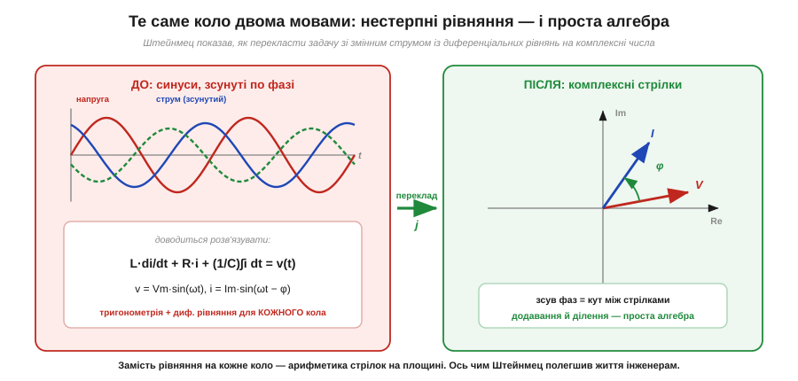
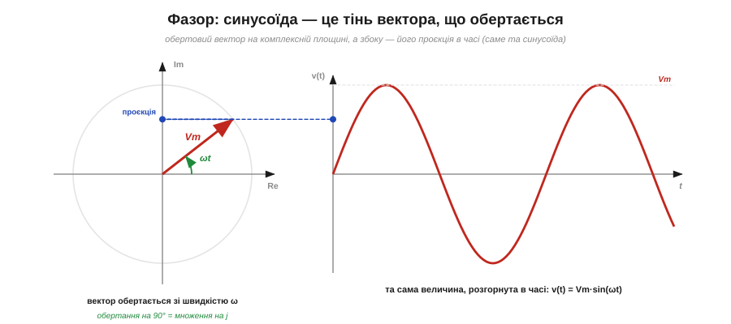
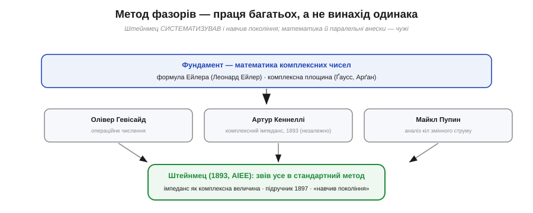

# 📜 Штейнмец: як змінний струм перестав лякати математикою

Наприкінці 1880-х змінний струм уже переміг у боротьбі за освітлення міст, але інженери захлиналися в його математиці: кожне коло доводилося описувати громіздкими диференціальними рівняннями з тригонометрією. Ця історія — про невисокого згорбленого емігранта, який знайшов спосіб замінити всю ту тяганину простою алгеброю, і про те, що цей спосіб насправді народжувався руками багатьох.

## Чому змінний струм був важким

До кінця 1880-х суперечка про те, яким бути електропостачанню, фактично завершилася на користь змінного струму: трансформатор дозволяв легко піднімати напругу для передачі на відстань і знижувати її біля споживача, чого постійний струм не вмів. Та практична перемога обернулася теоретичною мукою. Постійне коло рахується легко: відомі напруга й опір — поділив, дістав струм. Зі змінним усе складніше. Напруга тут — синусоїда, що безперервно гойдається, а струм у колі з котушками й конденсаторами не лише гойдається разом із нею, а ще й **відстає** або **випереджає** її по фазі.

Щоб знайти цей зсув і амплітуду, інженер мусив виписувати рівняння, де напруга й струм — функції часу, складати диференціальні рівняння для котушок і конденсаторів, а тоді продиратися крізь нагромадження тригонометричних тотожностей із синусами й косинусами. Для кожного нового кола — наново. Це було повільно, легко було помилитися, і це гальмувало всю молоду електротехніку: галузь росла швидше, ніж устигала рахувати власні кола.

Ціна цієї повільності була цілком матеріальна. Двигуни й трансформатори будували, по суті, навпомацки, перевіряючи здогади дорогими натурними дослідами, бо передбачити поведінку складного кола олівцем було важко. Розрахунок, на який інженер витрачав дні, легко обертався помилкою в знаку чи загубленим членом рівняння — а отже, спаленою обмоткою або недотягнутим до потрібної потужності апаратом. Потрібен був не новий фізичний закон, а новий **спосіб лічити** те, що вже й так було відоме.

*Ліворуч — як це виглядало «у лоб»: жмут синусоїд, зсунутих по фазі, і диференціальне рівняння, яке треба розв'язувати для кожного кола. Праворуч — те саме після Штейнмеца: напруга й струм стають стрілками на комплексній площині, зсув фаз — це кут між ними, а розрахунок зводиться до арифметики стрілок.*

---

## Людина, яка приїхала ні з чим

Карла Авґуста Рудольфа Штейнмеца (*Charles Proteus Steinmetz*) доля наче випробовувала від народження. Він народився 1865 року в **Бреслау** — тоді це була прусська, німецька земля; нині це місто **Вроцлав у Польщі**. Хлопчик з'явився на світ із кіфозом, тобто горбом, успадкованим від батька, і кульгавістю; усе життя він лишався низеньким і фізично крихким. На розум це не вплинуло аж ніяк: у Бреславському університеті він блискуче студіював математику й уже стояв на порозі докторського ступеня.

Завадила політика. Штейнмец був переконаним **соціалістом** і редагував партійну газету, а Німеччина тоді жила за антисоціалістичними законами Бісмарка. Коли поліція взялася за газету й над молодим математиком нависла загроза арешту, він мусив тікати — спершу до **Цюриха**, а 1889 року **емігрував до США**. До Нью-Йорка він прибув майже без грошей і ледь розмовляючи англійською; на острові Елліс його через хворобливий вигляд мало не завернули назад. Та вже за кілька років цей самий чоловік став однією з найважливіших постатей американської електротехніки.

Він влаштувався в молоду компанію **General Electric** у Скенектаді й доріс там до головного інженера-консультанта. Колеги прозвали його «чарівником зі Скенектаді»: він рахував у голові те, на що іншим потрібні були дні, тримав на столі купу цигарок, а на дверях лабораторії — табличку, що не зважає на правила компанії. Першу славу йому приніс **закон гістерезису** — кількісний опис втрат енергії на перемагнічування заліза, безцінний для проєктування трансформаторів і двигунів. Але справжній переворот був попереду.

---

## Метод, що звів аналіз до алгебри

1893 року на з'їзді Американського інституту інженерів-електриків (**AIEE**) Штейнмец виголосив доповідь із назвою «**Complex Quantities and Their Use in Electrical Engineering**» — «Комплексні величини та їх застосування в електротехніці». У ній він систематизував **метод комплексних чисел**, або **фазорів**. Ідея разюче проста за наслідками: кожну синусоїду — і напругу, і струм — можна подати **комплексним числом**, тобто стрілкою на площині, довжина якої дорівнює амплітуді, а напрямок — фазі. Тоді зсув фаз між напругою і струмом стає просто кутом між двома стрілками.

*Синусоїда — це проєкція вектора, що рівномірно обертається на комплексній площині. Довжина вектора задає амплітуду, кут — фазу, а множення на уявну одиницю j повертає вектор рівно на 90°. Розгорнувши обертання в часі, дістаємо саме ту синусоїду, з якою інженер має справу в колі.*

Найголовніше, що при такому записі **похідні й інтеграли перетворюються на множення й ділення**. Котушка й конденсатор, які в часовій картині вимагали диференціальних рівнянь, тепер описуються одним комплексним числом — Штейнмец увів для нього поняття **імпедансу** (комплексного опору). Оператор повороту на 90°, уявна одиниця **j**, перебирає на себе всю роботу, яку доти робила тригонометрія. У підсумку громіздкий аналіз змінного кола зводиться до тих самих дій, що й у колі постійного струму: закони Ома й Кірхгофа працюють далі, тільки з комплексними числами замість звичайних. Свій метод він докладно виклав у підручнику 1897 року «**Theory and Calculation of Alternating Current Phenomena**», який, як кажуть, «навчив ціле покоління інженерів».

---

## Чесно про авторство

Тут важливо втриматися від спокусливого міфу про самотнього генія, що в один день винайшов усе. Це неправда, і сам метод від такого спрощення лише програє.

*Метод спирається на математику комплексних чисел, закладену задовго до електротехніки (формула Ейлера; комплексна площина Ґаусса й Арґана), і визрівав одночасно в кількох головах. Штейнмец не винайшов його одноосібно — він звів напрацювання в стандартний, придатний для щоденної роботи інструмент і навчив ним користуватися.*

Штейнмец **не винаходив** ані комплексних чисел, ані самої думки прикласти їх до змінного струму. Математичний фундамент — це [**формула Ейлера**](topic:math-analysis/euler-formula) (Леонард Ейлер), що пов'язує обертання з уявною одиницею, і **комплексна площина**, яку унаочнили Ґаусс і Арґан. Поряд і незалежно працювали інші інженери. **Артур Кеннеллі** (*Arthur Kennelly*) того ж таки 1893 року представив комплексний імпеданс — і саме його стаття закріпила за терміном «імпеданс» його значення; Штейнмец же узагальнив підхід на **всі** кола, подавши комплексними числами не лише опори, а й напруги та струми. **Олівер Гевісайд** своїм операційним численням уже наближався до тієї самої мети з іншого боку, а **Майкл Пупин** робив свій внесок в аналіз кіл змінного струму. Заслуга Штейнмеца — не в одноосібному відкритті, а в тому, що він **систематизував** розрізнені ідеї, зробив метод **стандартним** і **навчив** ним користуватися ціле покоління.

Так само обережно варто ставитися до титулу «батько електротехніки», який часто чіпляють до його імені: це народне почесне звання, вияв шани, а не буквальне твердження, ніби галузь створив один чоловік. Точний опис його ідентичності теж вартий акуратності: німецький математик і фізик, народжений у Бреславі (прусському місті, що нині є польським Вроцлавом), соціаліст-емігрант, який став одним з найвпливовіших американських інженерів. Усталені, добре засвідчені факти — це його втеча через переслідування соціалістів, еміграція 1889 року, праця в General Electric і доповідь 1893 року; саме на них і варто спиратися.

Саме завдяки методу Штейнмеца про **фазори**, **комплексний імпеданс** і діюче значення **RMS** сьогодні говорять не як про математичні страхіття, а як про зручні, майже наочні інструменти. Те, що колись було вершиною інженерної майстерності, тепер — звичайний робочий апарат, доступний кожному, хто розуміє стрілку на площині.
