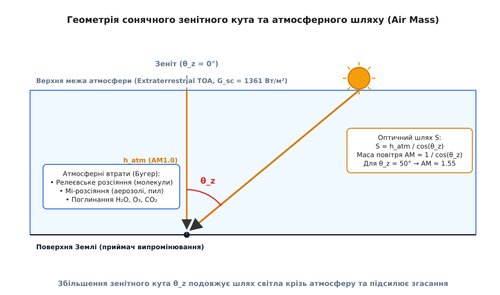
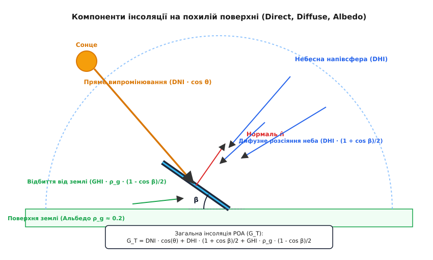

# Модель сонячної інсоляції

<preknowlist>
- [Закон косинуса Ламберта](root:ph-waves/lambert-cosine-law) — залежність густини світлового потоку від кута падіння променів.
- [Показник заломлення](root:ph-waves/refractive-index) — викривлення світлового променя під час проходження через атмосферні шари з різною густиною.
- [Стандартний сонячний спектр AM1.5G](root:ph-waves/am15-solar-spectrum) — еталонний розподіл спектральної щільності сонячного випромінювання біля поверхні Землі.
</preknowlist>

У термоядерному ядрі Сонця за температури близько 15 мільйонів кельвінів щосекунди 600 мільйонів тонн водню перетворюються на гелій за допомогою протон-протонного циклу. Звільнена внаслідок дефекту маси енергія блукає в надзоні променистого переносу сотні тисяч років, зазнаючи мільярдів актів випромінювання й поглинання, поки нарешті не досягає тонкої поверхні Сонця — фотосфери. Фотосфера з температурою близько 5778 кельвінів випромінює кванти світла у відкритий космічний простір практично як абсолютне чорне тіло за законом Планка з піком спектральної щільності у синьо-зеленій ділянці (близько 500 нанометрів) за законом зсуву Віна.

Подолавши 149.6 мільйона кілометрів безповітряного космічного простору, цей потужний світловий потік врізається у верхню межу атмосфери Землі. На кожну квадратну площину, орієнтовану перпендикулярно до сонячних променів поза атмосферою на середній відстані Землі від Сонця, щосекунди падає близько 1361 джоуля енергії. Цю фундаментальну фізичну величину називають **сонячною константою** (*solar constant*, від латинського *constans* — «постійний, незмінний») `G_sc`.

Оскільки орбіта Землі навколо Сонця не є ідеальним колом, а має помітний ексцентриситет (`e ≈ 0.0167`), відстань між планетою та світилом безперервно змінюється протягом року за першим і другим законами Кеплера. У перигелії (на початку січня) Земля наближається до Сонця на відстань 147.1 мільйона кілометрів, і потокова густина позаатмосферного випромінювання зростає до 1407 Вт/м²; в афелії (на початку липня) відстань збільшується до 152.1 мільйона кілометрів, а потік падає до 1316 Вт/м². Цю щорічну варіацію в межах ±3.3% описують тригонометричним розрахунком позаатмосферної інсоляції `G_0` залежно від порядкового дня року `n` (від 1 до 365):

```
G_0 = G_sc · (1 + 0.033 · cos(2π · n / 365))
```

Проте головна фізична й інженерна задача починається тоді, коли сонячний потік входить у газову оболонку Землі. Проходячи крізь шар атмосфери, світло гасне, розсіюється на молекулах і пилу та поглинається газами. До поверхні планети доходить лише частина початкової енергії, причому її потужність і спектральний склад безперервно змінюються щохвилини залежно від висоти Сонця, прозорості повітря та хмарності.

**Модель сонячної інсоляції** (*solar irradiance model*, від латинського *in-solare* — «виставляти на сонце») — це теоретичний і обчислювальний апарат, який об'єднує небесну механіку, атмосферну оптику та тригонометрію. Вона дозволяє розрахувати точну потокову густину прямого, дифузного та відбитого світла, що потрапляє на будь-яку поверхню у будь-якій точці планети у довільний момент часу. Детальний опис того, як експериментатори XIX століття навчилися вимірювати первинне сонячне випромінювання за допомогою болометра та піргеліометра, винесено у вставку [історія вимірювання сонячної константи та метод Ленглі](root:ph-waves/solar-irradiance-model/hist-solar-constant.md).

### Небесна механіка та кути сонячної геометрії

Щоб обчислити потужність сонячного випромінювання на поверхні Землі, найперше необхідно з'ясувати точне геометричне положення Сонця на небосхилі відносно спостерігача. Це положення диктується двома обертаннями планети: добовим розворотом навколо власної осі та річним рухом по еліптичній орбіті.

Ось добового обертання Землі нахилена до площини її орбіти (екліптики) під кутом `23.44°`. Через цей сталий орієнтир у просторі для спостерігача на Землі Сонце протягом року зміщується на північ і південь від екватора. Кут між напрямком на Сонце й екваторіальною площиною Землі називають **сонячним склоненням** (*solar declination*, від латинського *declinatio* — «відхилення») `δ`. Склонення дорівнює нулю в дні весняного та осіннього рівнодення, досягає максимуму `+23.45°` під час літнього сонцестояння (22 червня) і мінімуму `-23.45°` під час зимового сонцестояння (22 грудня). Спрощено воно описується формулою Купера:

```
δ = 23.45° · sin(360° · (284 + n) / 365)
```

Положення спостерігача на поверхні планети визначається географічною широтою `φ` (*latitude*, від латинського *latitudo* — «ширина», де північна широта додатна, південна — від'ємна) та довготою `λ` (*longitude*). Добове обертання Землі враховується через **годинний кут** (*hour angle*) `ω`. Годинний кут вимірює кутовий розворот Землі відносно сонячного полудня (моменту, коли Сонце перетинає місцевий меридіан спостерігача). Оскільки Земля здійснює оберт на 360° за 24 години, кожен час сонячного часу відповідає рівно `15°` годинного кута (`ω = 0°` у сонячний полудень, `ω < 0` уранці, `ω > 0` після полудня):

```
ω = 15° · (LST - 12.0)
```

Тут `LST` (*Local Solar Time*) — місцевий істинний сонячний час, який відрізняється від офіційного поясного часу на величину рівняння часу `EOT` (*Equation of Time*) та поправку на долготу меридіана. Рівняння часу враховує нерівномірність руху Землі по еліпсу та коливається від -14 до +16 хвилин протягом року. Воно розкладається на дві фізичні складові: ефект ексцентриситету орбіти та ефект нахилу еліптики.

Знаючи широту `φ`, склонення `δ` та годинний кут `ω`, ми обчислюємо **сонячний зенітний кут** (*solar zenith angle*, від арабського *samth* — «напрямок вгору») `θ_z`. Це кут між напрямком на центр сонячного диска та вертикальною нормаллю до горизонтальної поверхні Землі. За фундаментальною теоремою сферичної тригонометрії (законом косинусів для сферичного трикутника з вершинами у Північному полюсі, зеніті спостерігача та Сонці):

```
cos(θ_z) = sin(φ) · sin(δ) + cos(φ) · cos(δ) · cos(ω)
```

Кут висоти Сонця над горизонтом `α_s` (*solar elevation angle*) є геометричним доповненням зенітного кута до 90°:

```
α_s = 90° - θ_z
```

Коли Сонце перебуває точно на лінії горизонту (момент сходу або заходу), `α_s = 0°`, а `cos(θ_z) = 0`. У цей момент Сонце має зенітний кут `θ_z = 90°`. Годинний кут сходу Сонця `ω_s` описується точним виразом `cos(ω_s) = -tan(φ) · tan(δ)`.

Горизонтальний напрямок на Сонце задається **сонячним азимутом** (*solar azimuth*, від арабського *al-sumūt* — «шляхи, напрямки») `γ_s`. Азимут вимірюється в градусах від напрямку на південь (або північ) по горизонту.

Приймальна поверхня (наприклад, плоский фотомодуль чи сонячний колектор) має власну просторову орієнтацію:
- **Кут нахилу** `β` (*tilt angle*) — кут між площиною приймача та горизонтальною землею (`β = 0°` для горизонтальної установки, `β = 90°` для вертикального фасаду);
- **Азимут поверхні** `γ` (*surface azimuth*) — кут між проекцією нормалі панелі на горизонт та напрямком на південь (`γ = 0°` для південного напрямку, `γ = -90°` для сходу, `γ = +90°` для заходу).

Щоб розрахувати проекцію прямого сонячного світла на таку похилу поверхню, необхідно знайти **кут падіння променів** `θ` (*angle of incidence*) — кут між прямим сонячним променем та векторною нормаллю до площини приймача. Зводячи вектор сонячного напрямку та вектор нормалі у спільній декартовій системі координат, отримуємо точну тригонометричну формулу:

```
cos(θ) = cos(θ_z) · cos(β) + sin(θ_z) · sin(β) · cos(γ_s - γ)
```

За [законом косинуса Ламберта](root:ph-waves/lambert-cosine-law), густина потоку прямого випромінювання на площину панелі пропорційна саме `cos(θ)`. Якщо розраховане значення `cos(θ) ≤ 0`, це означає, що Сонце знаходиться за площиною модульу, і лицьова сторона панелі перебуває у власній затіненій зоні.

### Оптичний шлях в атмосфері та маса повітря (Air Mass)

Навіть за абсолютно безхмарного неба сонячні промені не доходять до Землі без втрат. Атмосфера Землі працює як глобальний світлофільтр та розсіювач. Ступінь послаблення світла в першу чергу визначається довжиною газового шляху, який долає промінь.

Для кількісного опису цього шляху у фізиці атмосфери введено поняття **оптичної маси повітря** (*Air Mass*, `AM`). Вона визначається як відношення довжини похилого оптичного шляху променя крізь атмосферу до найкоротшого вертикального шляху при зенітному положенні Сонця.

- **AM0** (*Extraterrestrial*) — маса повітря у відкритому космічному просторі за межами атмосфери (`AM = 0`). Приймач отримує незрізаний сонячний спектр потужністю `1361 Вт/м²`. За цим стандартом випробовують сонячні батареї для космічних апаратів.
- **AM1.0** — Сонце перебуває точно в зеніті (`θ_z = 0°`). Промінь долає найкоротший прямовисний шар атмосфери. На рівні моря при чистому повітрі це відповідає інсоляції близько `1000 Вт/м²`.
- **AM1.5** — Сонце знаходиться під зенітним кутом `θ_z ≈ 48.2°`. Оптичний шлях світла в атмосфері у 1.5 раза довший за вертикальний. Стандартний наземний спектр [AM1.5G](root:ph-waves/am15-solar-spectrum) із підсумковою потоковою густиною `1000 Вт/м²` та температурою довкілля 25 °C є міжнародним еталоном для тестування й порівняння ККД усіх фотоелектричних модулів на Землі.


*При збільшенні зенітного кута θ_z сонячний промінь долає значно довший похилий шлях S у повітряному шарі порівняно із зенітною товщиною h_atm. Це збільшує масу повітря AM та підсилює атмосферні втрати на розсіяння й поглинання.*

У спрощеній плоскопаралельній моделі атмосфери маса повітря обчислюється як секанс зенітного кута:

```
AM ≈ 1 / cos(θ_z)
```

При куті `θ_z = 60°` косинус дорівнює 0.5, отже `AM = 2.0`. Проте при великих зенітних кутах (`θ_z > 70°`) плоска модель втрачає точність через сферичну кривизну Землі та оптичну рефракцію світла в шарах повітря зі змінним [показником заломлення](root:ph-waves/refractive-index). Біля самого горизонту (`θ_z = 90°`) плоска формула прямує до нескінченності, тоді як у реальності світло долає скінченний шлях.

Для розрахунку маси повітря по всій небесній напівсфері аж до горизонтальних кутів застосовують апроксимаційну формулу Кастена — Янга (*Kasten-Young formula*):

```
AM = 1 / (cos(θ_z) + 0.50572 · (96.07995 - θ_z)^(-1.6364))
```

При `θ_z = 90°` ця формула дає реалістичне скінченне значення `AM ≈ 37.9`. Повне геодезичне та геометричне виведення маси повітря для сферичної планети з урахуванням радіуса Землі наведено у вставці [математичне виведення маси повітря та геометрії оптичного шляху](root:ph-waves/solar-irradiance-model/math-airmass-derivation.md).

Проходячи крізь атмосферний шлях товщиною `AM`, сонячне світло зазнає згасання за законом Бугера — Ламберта — Бера внаслідок трьох фізичних процесів:

1. **Релеєвське молекулярне розсіяння** (*Rayleigh scattering*) — пружне розсіяння світла на молекулах азоту `N_2` та кисню `O_2`, розміри яких значно менші за довжину хвилі (`d << λ`). Інтенсивність розсіяння обернено пропорційна четвертому степеню довжини хвилі (`~ λ^(-4.08)`). Через це синє світло (`400 нм`) розсіюється в атмосфері у 9 разів інтенсивніше за червоне (`700 нм`). Саме релеєвське розсіяння забарвлює денне небо у блакитний колір, а при великих масах повітря `AM` (на заході Сонця) забирає з прямого променя всі сині промені, залишаючи Сонцю багряно-червоний відтінок.
2. **Мі-аерозольне розсіяння** (*Mie scattering*) — розсіяння на більших частинках пилу, вологи, водяних крапель та смогу, розміри яких порівнянні з довжиною хвилі світла. Воно слабко залежить від довжини хвилі (`~ λ^(-1.3)`) і формує розсіяне білясте сяйво довкола сонячного диска та серпанок над містами.
3. **Селективне молекулярне поглинання** — поглинання фотонів конкретних енергій молекулами газів. Стратосферний озоновий шар `O_3` повністю поглинає жорсткий ультрафіолет коротше 290 нм (смуги Хартлі та Гінніса). Молекули водяної пари `H_2O`, вуглекислого газу `CO_2` та метану вирізають глибокі темні смуги поглинання у ближній інфрачервоній частині сонячного спектра (на довжинах хвиль 940 нм, 1130 нм, 1380 нм та 1870 нм).

### Три складові наземної інсоляції: DNI, DHI та Albedo

Внаслідок розсіяння та відбиття в атмосфері сонячний потік біля поверхні Землі перестає бути паралельним пучком променів. Він розділяється на три фундаментальні складові:

1. **Пряме нормальне випромінювання** (**DNI** — *Direct Normal Irradiance*) — потік нерозсіяних сонячних променів, які пройшли крізь атмосферу прямо від сонячного диска. `DNI` вимірюється на площині, що строго перпендикулярна до сонячних променів, за допомогою приладу з вузьким кутом огляду — піргеліометра.
2. **Дифузне горизонтальне випромінювання** (**DHI** — *Diffuse Horizontal Irradiance*, від латинського *diffusus* — «розлитий, розсіяний») — сонячне світло, яке зазнало розсіяння в атмосфері й падає на горизонтальну поверхню з усіх напрямків небесного купола. Воно вимірюється піранометром із затінювальним кільцем, що закриває прямий диск Сонця.
3. **Глобальне горизонтальне випромінювання** (**GHI** — *Global Horizontal Irradiance*) — сумарний сонячний потік, який падає на плоску горизонтальну поверхню Землі. Він є сумою проекції прямого випромінювання та дифузного світла неба:

```
GHI = DNI · cos(θ_z) + DHI
```


*На похилу сонячну панель падає три компоненти випромінювання: пряме сонячне світло (DNI · cos θ), дифузне розсіяне світло небесного купола (DHI) та відбите від поверхні землі світло (Альбедо ρ_g).*

Якщо приймач світла (наприклад, фотоелектрична панель) встановлений під кутом нахилу `β` до землі, він вловлює додаткову третю компоненту — світло, відбите від поверхні ландшафту перед панеллю. Здатність навколишнього середовища відбивати світло характеризується коефіцієнтом відбиття — **альбедо** (*albedo*, від латинського *albus* — «білий») `ρ_g`. Для чорнозему чи вологого асфальту `ρ_g ≈ 0.1 ... 0.15`, для зеленої трави `ρ_g ≈ 0.2`, для сухого піску `ρ_g ≈ 0.4`, а для свіжого білого снігу `ρ_g ≈ 0.8 ... 0.9`.

Слід зазначити, що альбедо природних покривів має виражену спектральну залежність. Зелена рослинність інтенсивно поглинає видиме світло для фотосинтезу (альбедо у червоній ділянці 660 нм становить всього 0.05), проте на довжині хвилі 700 нм виявляє так званий «червоний край» (*red edge*), де відбивання стрибкоподібно зростає до 0.45 у ближньому інфрачервоному діапазоні.

Загальна потокова густина інсоляції на похилій площині фотомодуля **POA** (*Plane of Array*) `G_T` розраховується як сума трьох складових за класичною ізотропною моделлю Лю — Джордана (*Liu-Jordan Isotropic Model*):

```
G_T = G_{b,T} + G_{d,T} + G_{r,T}
```

Розкриваючи кожну з трьох компонент:

1. **Пряма складова на панелі `G_{b,T}`**:
   Визначається проекцією прямого потоку `DNI` на площину з кутом падіння `θ`:

   ```
   G_{b,T} = DNI · cos(θ)
   ```

2. **Дифузна складова від неба `G_{d,T}`**:
   У припущенні, що небесна напівсфера випромінює дифузне світло рівномірно за [законом косинуса Ламберта](root:ph-waves/lambert-cosine-law), похила панель із нахилом `β` бачить геометричну частку неба, що дорівнює `(1 + cos(β)) / 2`:

   ```
   G_{d,T} = DHI · (1 + cos(β)) / 2
   ```

   Для горизонтальної панелі (`β = 0°`) кут нахилу дає `(1 + 1)/2 = 1.0`, отже `G_{d,T} = DHI`. Для вертикальної панелі (`β = 90°`) відкрита лише половина неба (`(1 + 0)/2 = 0.5`).

3. **Відбита складова від землі `G_{r,T}`**:
   Панель із нахилом `β` бачить ділянку землі під геометричним фотометричним кутом `(1 - cos(β)) / 2`. Потік відбитого світла дорівнює:

   ```
   G_{r,T} = GHI · ρ_g · (1 - cos(β)) / 2
   ```

   Горизонтальна панель (`β = 0°`) землі не бачить зовсім (`(1 - 1)/2 = 0`), а вертикальна панель (`β = 90°`) вловлює рівно половину відбитого від землі потоку.

Підсумовуючи всі три частини, отримуємо підсумкову формулу розрахунку інсоляції на похилому фотомодулі:

```
G_T = DNI · cos(θ) + DHI · (1 + cos(β)) / 2 + GHI · ρ_g · (1 - cos(β)) / 2
```

### Моделі ясного неба та обчислювальний розрахунок

Для того щоб розраховувати інсоляцію без використання коштовних наземних метеостанцій у кожній точці, застосовують математичні **моделі ясного неба** (*clear-sky models*). Ці моделі прогнозують значення `DNI`, `DHI` та `GHI` на основі географічних координат, дня року, маси повітря та атмосферних параметрів мутності.

Серед найвідоміших моделей ясного неба:
- **Модель Мейнела** (*Meinel Model*) — проста аналітична модель, яка виражає пряме випромінювання через двопоказникову степеневу функцію маси повітря: `DNI = G_0 · 0.7^(AM^0.678)`.
- **Модель Берда** (*Bird Clear Sky Model*) — спектрально-інтегральна модель, яка окремо розраховує оптичні транзити Релея, озону, водяної пари та аерозолів.
- **Модель Інейхена — Переса** (*Ineichen-Perez Model*) — сучасна високоточна модель, яка використовує фактор мутності Лінке `T_L` (*Linke turbidity factor*) для опису запиленості й вологості повітряного стовпа. Фактор Лінке змінюється від `T_L = 2.0` для кришталевого гірського повітря до `T_L = 5.0 ... 6.0` для забруднених промислових районів.

Двофронтальні (двосторонні, *bifacial*) фотомодулі вловлюють світло як передньою, так і тильною стороною. Для них розрахунок інсоляції доповнюється перерахунком відбитого від землі потоку `G_{r,rear}` на задню поверхню з урахуванням коефіцієнта двосторонності `ϕ_bifacial ≈ 0.7 ... 0.85`:

```
G_{total,bifacial} = G_T + ϕ_bifacial · G_{r,rear}
```

> 🔧 **Навіщо це.**
> Моделювання сонячної інсоляції є практичним фундаментом сучасної геліоенергетики, кліматології та будівельної фізики:
> 
> 1. **Оптимізація кута нахилу сонячних панелей**: Для стаціонарних фотоелектричних станцій в Україні (широта `48° ... 51°`) розрахунок інсоляції показує, що оптимальний кут нахилу для максимального **річного** виробітку становить `30° ... 35°` з південною орієнтацією (`γ = 0°`). Проте для автономних станцій, орієнтованих на **зимове** споживання, кут нахилу збільшують до `55° ... 60°`, щоб зменшити зенітний кут падіння низького зимового Сонця та прискорити самоочищення панелей від снігу.
> 2. **Проектування трекерних систем Steering**: Двовісні сонячні трекери безперервно повертають фотомодуль так, щоб кут падіння променя завжди дорівнював нулю (`θ = 0°`, `cos(θ) = 1`). Модель інсоляції дозволяє точковіше розрахувати економічну доцільність трекера: він дає приріст генерації до 30–35% улітку, але лише 10–15% узимку.
> 3. **Розрахунок міжрядної тіні (Inter-row Shading)**: При проектуванні промислових сонячних парків панелі розміщують рядами. Якщо ряди поставити занадто близько, передній ряд затінятиме задній при низькому Сонці. Модель інсоляції розраховує мінімальну відстань між рядами `D = L · sin(β) / tan(α_sol,min)` для збереження прямого потоку.
> 4. **Розрахунок теплових навантажень будинків (HVAC)**: Архітектори використовують розрахунок інсоляції фасадів та засклення для моделювання пасивного сонячного нагріву взимку та розрахунку потужності систем кондиціонування влітку, відвертаючи перегрів приміщень.

Повний алгоритм обчислення сонячної позиції, маси повітря та компонентів інсоляції реалізовано у вигляді робочого модуля мовами Python та C++ у вставці [реалізація розрахунку сонячної інсоляції](root:ph-waves/solar-irradiance-model/proj-irradiance-calculator.md).

### Хмарність, анізотропія неба та межі застосовності моделей

У реальних атмосферних умовах небо рідко буває повністю безхмарним. Хмари являють собою щільне скупчення водяних крапель і льодяних кристалів, які зазнають інтенсивного розсіяння Мі. Хмарність кардинально змінює співвідношення компонент інсоляції: пряме випромінювання `DNI` може впасти до нуля, тоді як дифузна компонента `DHI` стає єдиним джерелом світла.

Для врахування впливу хмарності застосовують емпіричні коефіцієнтно-степеневі моделі (наприклад, модель Кастена — Чеплака, *Kasten-Czeplak model*), яка виражає фактичну глобальну інсоляцію `GHI(C)` через бали хмарності `C` (від 0 для чистого неба до 1 для суцільної хмарності):

```
GHI(C) = GHI_clearsky · (1 - 0.75 · C^3.4)
```

За суцільної хмарності (`C = 1`) глобальна інсоляція падає до 25% від потенціалу ясного неба, і все випромінювання стає 100% дифузним.

Другим важливим уточненням є **анізотропія дифузного світла неба**. Проста модель Лю — Джордана вважає дифузне світло неба однаковим у всіх напрямках (ізотропним). Проте реальне небо має дві зональні ділянки підвищеної яскравості:
- **Навколосонячне німбне сяйво** (*circumsolar brightening*) — розсіяне під малими кутами світло безпосередньо довкола сонячного диска;
- **Посилення яскравості біля горизонту** (*horizon brightening*) — підвищена яскравість тонкої смуги неба понад горизонтом через довгий оптичний шлях розсіяння.

У прецизійних розрахункових комплексах (наприклад, PVSyst або SAM) ізотропну модель замінюють на **анізотропну модель Переса** (*Perez Anisotropic Model*), яка розбиває дифузний потік на три ізотропні та анізотропні компоненти, підвищуючи точність розрахунку генерації похилих панелей на 2–4%.

---

Модель сонячної інсоляції об'єднує квантову фізику сонячного випромінювання, небесну сферичну тригонометрію та атмосферну оптику розсіяння й поглинання у єдину прогнозовану систему. Від первинної сонячної константи `1361 Вт/м²` через розрахунок маси повітря `AM` та розділення потоку на пряму `DNI`, дифузну `DHI` й відбиту складові фізична модель дає інженерам і вченим точний інструмент для обчислення енергії світла у будь-якій точці нашої планети.
