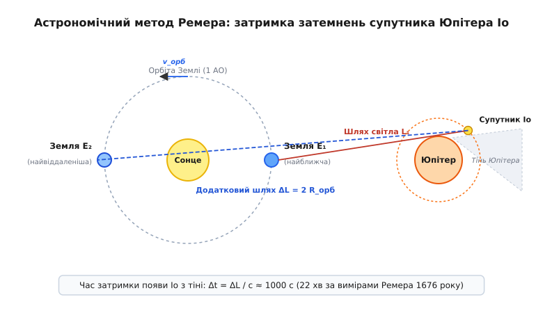
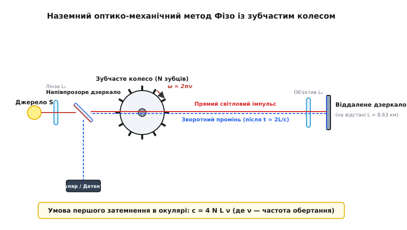
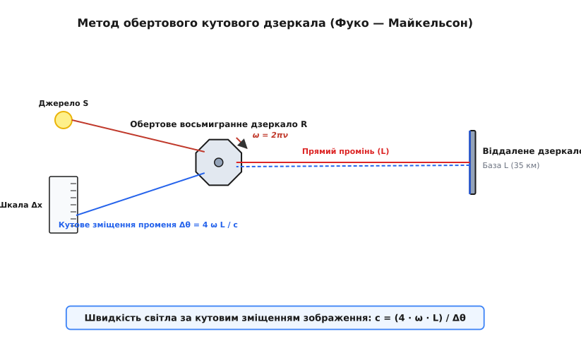
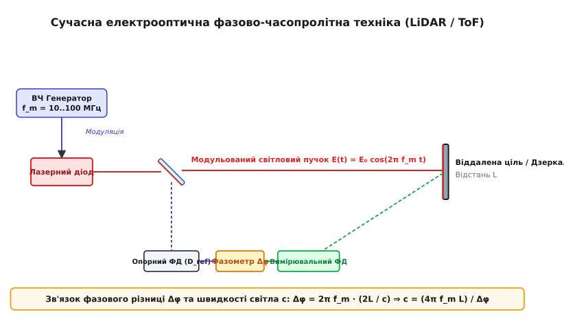

# Вимірювання швидкості світла

<preknowlist>
- [Закон заломлення Снелла](topic:ph-waves/snells-law) — зв'язок кутів падіння й заломлення із показниками заломлення оптичних середовищ.
- [Рівняння Френеля](topic:ph-waves/fresnel-equations) — амплітудні коефіцієнти відбиття й передачі електромагнітної хвилі та фазові зсуви при відбитті.
- [Оптична дисперсія](topic:ph-waves/optical-dispersion) — залежність фазової швидкості світла від частоти й довжини хвилі у матеріальному середовищі.
- [Інтерферометр Майкельсона](topic:ph-waves/michelson-interferometer) — двопроменева інтерферометрія з діленням амплітуди для прецизійного вимірювання фазових набігів та оптичних шляхів.
</preknowlist>

Коли спалах блискавки освітлює нічне небо, гуркіт грому доноситься лише через кілька секунд, створюючи виразну побутову ілюзію того, що зорове враження виникає абсолютно миттєво. Тривалий час у фізичній думці — від античних трактатів Арістотеля до механіцистичної натурфілософії Рене Декарта — панувало глибоке переконання, що світло поширюється у просторі з нескінченною швидкістю, передаючи дію крізь середовище без будь-якої часової затримки. Перша відома спроба Галілео Галілея у XVII столітті виміряти швидкість світла за допомогою двох спостерігачів із ліхтарями на сусідніх пагорбах виявилася невдалою: фізіологічна нервово-м'язова реакція людини (близько 200 мілісекунд) у сотні тисяч разів перевищувала час прольоту світлового імпульсу на відстані кількох кілометрів. 

Однак розкриття фундаментальної природи цієї величини, що отримала міжнародне позначення `c` (*speed of light*, від лат. *celeritas* — швидкість), стало одним із найвеличніших тріумфів експериментальної фізики. Вимірювання швидкості світла не лише трансформувало оптику з геометричного опису променів на електродинамічну теорію хвильових полів, а й лягло в основу спеціальної теорії відносності Альберта Ейнштейна та сучасної міжнародної системи одиниць SI, де фундаментальна константа `c = 299 792 458 м/с` зафіксована як абсолютний та точний еталон.

---

### 1. Астрономічні та часопролітні методи: Реп'ях часу в космічних масштабах

Виміряти швидкість об'єкта, який долає триста тисяч кілометрів за одну секунду, у межах скромної земної лабораторії XVII століття було технічно неможливо через відсутність швидкодіючих фотодетекторів, електронних таймерів та високочастотних оптичних модуляторів. Для осягнення часового інтервалу поширення світла знадобилися астрономічні відстані Сонячної системи, де час прольоту світлового сигналу вимірюється не мікросекундами, а хвилинами.

У 1676 році данський астроном Оле Ремер (*Ole Rømer*), працюючи у Паризькій обсерваторії під керівництвом Джованні Доменіко Кассіні над складанням прецизійних таблиць руху супутників Юпітера для вирішення актуальної навігаційної задачі визначення довготи у відкритому морі, виявив дивовижну системну аномалію. Найближчий до Юпітера великий супутник — Іо — має строгий і незмінний період обертання навколо планети-гіганта, який становить приблизно `42.5 години`. Іо регулярно заходить у конус тіні, яку Юпітер відкидає у протилежний від Сонця бік, і момент виходу супутника з тіні є чітко фіксованою астрономічною подією.

Ремер помітив фундаментальну регулярність: коли Земля у своєму орбітальному русі наближається до Юпітера (після точки сполучення), інтервали між послідовними спостережуваними затемненнями Іо стають коротшими за середнє значення. Натомість, коли Земля віддаляється від Юпітера у напрямку протистояння, проміжки часу між появами супутника з тіні систематично зростають. За пів року накопичене сумарне запізнення появи Іо з тіні досягало приблизно `22 хвилин` (за сучасними прецизійними астрономічними вимірами це значення становить `16 хвилин 38 секунд`, тобто `997.73 секунди`).

Фізична причина цієї аномалії випливає з кінематики поширення світлового сигналу. Нехай `T₀` — власний період обертання Іо навколо Юпітера. За час `T₀` Земля зміщується по своїй орбіті на відстань `ΔD ≈ v_орб · T₀ · sin(α)`, де `v_орб` — орбітальна швидкість Землі, а `α` — кут між напрямком на Юпітер та вектором руху Землі. Спостережуваний період затемнення `T_obs` виражається через додаток часового прольоту:

```
T_obs = T₀ + ΔD / c = T₀ · (1 + (v_орб / c) · sin(α))
```

Ремер зробив геніальний висновок: сам період обертання Іо є абсолютно постійним, а спостережуване запізнення зумовлене тим, що світлу потрібен додатковий час `Δt` для подолання додаткової відстані `ΔL`, яка у граничних точках орбіти дорівнює діаметру земної орбіти `2 · R_орб`.

```
Δt = ΔL / c = (2 · R_орб) / c
```


*Геометрія орбітального руху Землі та затримка спостереження затемнень супутника Юпітера Іо.*

Хоча сам Ремер не навів у своїй публікації 1676 року явного числового значення швидкості, його колега Християн Гюйгенс (*Christiaan Huygens*), використавши оцінку орбітального радіуса Землі (`R_орб ≈ 140 млн км`), отриману Кассіні за паралаксом Марса, у 1678 році у «Трактаті про світло» вперше обчислив чисельне значення: `c ≈ 220 000 км/с`. Похибка у 26% була пов'язана не з якістю часових спостережень за Іо, а з недосконалістю тогочасних астрономічних даних про абсолютний розмір астрономічної одиниці.

Друге незалежне астрономічне підтвердження скінченності швидкості світла отримав у 1728 році англійський астроном Джеймс Бредлі (*James Bradley*). Шукаючи річний паралакс зорі γ Дракона за допомогою 24-футового зенітного телескопа, Бредлі виявив ефект **аберації світла** (*stellar aberration*, від лат. *aberratio* — ухилення). Усі зорі на небесній сфері протягом року описують малі еліпси, кутовий розмір яких не залежить від відстані до зорі, а визначається виключно відношенням орбітальної швидкості Землі `v_орб ≈ 29.78 км/с` до швидкості поширення світла `c`.

Векторне додавання швидкості світлового фотона, що падає на об'єктив, та поперечної орбітальної швидкості телескопа вимагає нахилу труби телескопа на кут аберації `θ`:

```
tan(θ) = v_орб / c
```

Для виміряного кута аберації `θ ≈ 20.49"` (секунд дуги) Бредлі обчислив швидкість світла з вражаючою для того часу точністю: `c ≈ 301 000 км/с`. Це довело, що скінченність `c` є не локальною особливістю відбиття від Юпітера, а універсальною властивістю світлового випромінювання у Всесвіті.

Детальний аналіз історичних суперечок між прибічниками миттєвого поширення світла та першопрохідцями часопролітних вимірювань наведено у вставці [Історія вимірювання швидкості світла: від Галілея до фіксації еталона метра](topic:ph-waves/speed-of-light-measurement/hist-speed-of-light.md).

---

### 2. Оптико-механічні дзеркальні та зубчасті лабораторні установки

Перехід від астрономічних спостережень до контрольованого наземного експерименту відбувся лише у середині XIX століття завдяки створенню високошвидкісних механічних приводів, пружинних годинникових механізмів та прецизійних оптичних систем.

У 1849 році французький фізик Арман Іпполіт Луї Фізо (*Armand Hippolyte Louis Fizeau*) створив перший наземний прилад для вимірювання `c` без використання космічних об'єктів. Схема Фізо базувалася на амплітудній модуляції світлового пучка за допомогою **зубчастого колеса** (*toothed wheel*), що швидко оберталося.


*Модуляція світлового пучка зубчастим колесом на базовій відстані 8.63 км між Сюреном та Монмартром.*

Оптична траса була розгорнута між будинком батька Фізо у передмісті Парижа Сюрен (*Suresnes*) та пагорбом Монмартр (*Montmartre*) на відстані `L = 8633 метри`. Світло від інтенсивного джерела проходило крізь напівпрозоре дзеркало і фокусувалося у вузьку щілину між зубцями колеса, яке мало `N = 720` зубців та однакову ширину проміжків. Пройшовши крізь проміжок, світловий імпульс летів до Монмартра, відбивався від віддаленого плоского дзеркала і повертався назад тим самим шляхом.

Час двостороннього прольоту дистанції `2L` становить:

```
t_flight = 2 · L / c
```

Якщо зубчасте колесо нерухоме, зворотний промінь вільно проходить крізь той самий проміжок і потрапляє в окуляр спостерігача. Якщо ж колесо починає обертатися із частотою `ν` (обертів за секунду), час повороту колеса на кут одного зубця і проміжку становить `1 / (N · ν)`. Перше повне затемнення світла в окулярі спостерігається тоді, коли за час прольоту світла `t_flight` колесо повертається точно на половину цього кута — тобто проміжок замінюється суцільним зубцем:

```
t_flight = 1 / (2 · N · ν)
```

Зрівнюючи обидва вирази для часу `t_flight`, отримуємо розрахункову формулу методу Фізо:

```
2 · L / c = 1 / (2 · N · ν)
⇒ c = 4 · N · L · ν
```

При частоті обертання колеса `ν = 12.6 об/с` Фізо зафіксував перше затемнення і обчислив значення `c ≈ 315 300 км/с`. Похибка становила близько 5%, що було зумовлено суб'єктивністю візуального визначення моменту «повного затемнення» в окулярі.

Наступний вирішальний крок зробив у 1850 році Жан Бернар Леон Фуко (*Jean Bernard Léon Foucault*), замінивши зубчасте колесо на **обертове плоске дзеркало** (*rotating mirror*).


*Вимірювання кутового зміщення поверненого променя за допомогою обертової дзеркальної призми.*

У схемі Фуко світло падає на обертове з кутовою швидкістю `ω` дзеркало `R`, відбивається під кутом до віддаленого нерухомого увігнутого дзеркала `M` на відстані `L`, відбивається назад строго по тому самому шляху і повертається до дзеркала `R`. Проте за час двохідного прольоту `t = 2L / c` дзеркало `R` встигає повернутися на кут:

```
Δθ = ω · t = 2 · ω · L / c
```

Через поворот дзеркала зворотний відбитий промінь відхиляється від початкового напрямку на подвійний кут `2 · Δθ = 4 · ω · L / c` і дає на вимірювальній шкалі зсув зображення `Δx`. Для малого плеча `s` між дзеркалом `R` та шкалою зміщення дорівнює:

```
Δx = s · (2 · Δθ) = 4 · s · ω · L / c
⇒ c = 4 · s · ω · L / Δx
```

Завдяки використанню повітряної турбіни Фуко довів швидкість обертання дзеркала до `800 обертів за секунду`, що дозволило скоротити базу експерименту до кількох метрів усередині лабораторії Паризької обсерваторії. У 1862 році він отримав значення `c = 298 000 ± 500 км/с`.

Найважливішим наслідком лабораторного експерименту Фуко стало вимірювання швидкості світла у середовищі, відмінному від вакууму. Розмістивши між дзеркалами трубу з водою довжиною `3 метри`, Фуко експериментально довів, що **швидкість світла у воді менша, ніж у повітрі**:

```
v_water = c / n_water ≈ 225 000 км/с
```

Цей результат мав катастрофічні наслідки для корпускулярної теорії Ньютона. Корпускулярна модель передбачала, що при переході в оптично густіше середовище притягання частинок світла збільшує їхню нормальну складову швидкості (`v_water = c · n > c`). Натомість хвильова теорія Френеля і Гюйгенса вимагала саме зменшення швидкості (`v_water = c / n`). Дослід Фуко став остаточним експериментальним критерієм, який зафіксував перемогу хвильової оптики над корпускулярною.

Американський фізик Альберт Майкельсон (*Albert Michelson*) вдосконалював метод обертового дзеркала понад чотири десятиліття (з 1879 по 1926 рік). Замість одного плоского дзеркала Майкельсон застосував правильну **восьмигранну дзеркальну призму**, виготовлену зі сталі або оптичного скла. Призма оберталася із точно відкаліброваною частотою `ν ≈ 528 Гц`.

За час прольоту світла між вершиною Маунт-Вільсон (*Mount Wilson*) та вершиною Маунт-Сан-Антоніо (*Mount San Antonio*) у Каліфорнії на відстані `L = 35.37 км` призма мала повернутися рівно на 1/8 частини повного оберту (`45°`). У цьому випадку наступна грань призми вставала точно під кутом `45°` до вхідного променя, і зображення в окулярі залишалося нерухомим.

У своїх останніх вимірах у вакуумованій металевій трубі довжиною `1.6 км` на станції Ірвайн Майкельсон досяг рекордної на той час точності: `c = 299 796 ± 4 км/с`.

Математичні виведення кінематичних формул модуляторних методів, аналіз спектральних гармонік зубчастого колеса та геометричний розрахунок дзеркальних призми наведено у вставці [Математичний аналіз та розрахункові моделі вимірювання швидкості світла](topic:ph-waves/speed-of-light-measurement/math-speed-of-light.md).

---

### 3. Хвильова електродинаміка, радіочастотні резонатори та швидкість фази й групи

Паралельно з механічними вимірюваннями у XIX столітті розгорталася фундаментальна теоретична революція. У 1865 році Джеймс Клерк Максвелл (*James Clerk Maxwell*) об'єднав закони електрики та магнетизму у систему диференціальних рівнянь полем. З рівнянь Максвелла випливало існування електромагнітних хвиль у вакуумі, фазова швидкість поширення яких визначається виключно двома фундаментальними константами — електричною `ε₀` та магнітною `μ₀` проникністю вакууму:

```
c = 1 / √(ε₀ · μ₀)
```

Ще у 1856 році Вільгельм Вебер (*Wilhelm Weber*) та Рудольф Кольрауш (*Rudolf Kohlrausch*) у лабораторії Лейпцизького університету виконали експеримент із розряджання лейденської банки, вимірявши відношення електростатичної одиниці заряду (визначеної за законом Кулона) до електромагнітної одиниці (визначеної за законом Ампера). Це відношення має розмірність швидкості і виявилося рівним `3.107 · 10⁸ м/с`. Збіг цього електродинамічного коефіцієнта зі швидкістю світла, отриманою Фізо, дозволив Максвеллу зробити триумфальний висновок: **світло є електромагнітною хвилею**.

У XX столітті радіофізичні методи вимірювання `c` досягли вищої точності за оптико-механічні. У 1947–1950 роках Луї Ессен (*Louis Essen*) та Алан Гордон-Сміт (*A. C. Gordon-Smith*) у Національній фізичній лабораторії Великої Британії (NPL) розробили спосіб вимірювання `c` за допомогою **об'ємного мікрохвильового резонатора** (*microwave cavity resonator*).

Металевий порожнистий циліндр високої точності з довжиною `L` та радіусом `R` збуджувався на резонансній моді `TE₀₁₁`. Довжина хвилі стоячої електромагнітної хвилі у резонаторі пов'язана з його геометричними розмірами та критичною довжиною хвилі стоячої моди:

```
(1 / λ)² = (1 / λ_cut)² + (1 / (2 · L))²
```

Вимірявши резонансну частоту `ν` за допомогою атомного стандартного генератора та встановивши довжину хвилі `λ` з мікрометричних вимірювань розмірів циліндра (з урахуванням скінченної провідності стінок і скін-ефекту), Ессен визначив швидкість електромагнітних хвиль у вакуумі:

```
c = ν · λ = 299 792.5 ± 3.0 км/с
```

У середовищах із дисперсією необхідно чітко розрізняти **фазову швидкість** `v_p` та **групову швидкість** `v_g`:

```
v_p = ω / k = c / n(ω)
v_g = dω / dk = c / (n + ω · (dn / dω))
```

Фазова швидкість визначає швидкість поширення точок постійної фази монохроматичної хвилі. У металевих або діелектричних хвилеводах фазова швидкість може перевищувати швидкість світла у вакуумі (`v_p > c`). Проте фазова швидкість не переносить енергію чи інформацію. Сигнал — тобто обмежений у часі волновой пакет — поширюється із груповою швидкістю `v_g`, яка у зонах прозорості завжди залишається меншою або рівною `c`, що строго відповідає принципу причинності спеціальної теорії відносності.

---

### 4. Лазерна метрологія, частотно-хвильовий синтез та фіксація еталона метра

Вирішальний прорив у точності вимірювання `c` відбувся в 1970-х роках із появою оптичних квантових генераторів — лазерів із високою часовою когерентністю та високої стабільності частоти.

Група вчених під керівництвом Кеннета Евенсона (*Kenneth Evenson*) у Національному бюро стандартів США (NBS, нині NIST) у 1972 році реалізувала унікальний експеримент із одночасного прецизійного вимірювання частоти `ν` та довжини хвилі `λ` випромінювання гелій-неонового лазера, стабілізованого за лінією поглинання метану `CH₄` (довжина хвилі `3.39 мкм`).

Головною складністю була вимірювальна техніка: частота оптичних коливань `ν ≈ 88.376 ТГц` перевищувала можливості прямого електронного рахунку лічильників того часу. Для вирішення цієї задачі було побудовано складний **частотний міст** (*radio-frequency phase-locked synthesizer chain*) — послідовність клістронів та лазерів інфрачервоного діапазону (на `H₂O` та `CO₂`), що множили та змішували частоту опорного цезієвого атомного годинника `ν_Cs = 9 192 631 770 Гц` аж до оптичного діапазону.

Довжину хвилі метанового лазера `λ` було виміряно за допомогою оптичної інтерферометрії шляхом порівняння з первинним еталоном довжини того часу — помаранчевою лінією випромінювання ізотопу криптону-86 (`⁸⁶Kr`).

```
c = ν · λ = (88 376 181 627 кГц) · (3.392 231 404 мкм)
⇒ c = 299 792 456.2 ± 1.1 м/с
```

Точність вимірювання `c` зросла у 100 разів порівняно з найкращими мікрохвильовими методами і досягла відносної похибки `4 · 10⁻⁹`.

На цьому етапі метрологія зіткнулася з фундаментальним тупиком. Похибка вимірювання швидкості світла `±1.1 м/с` була зумовлена не нестабільністю лазера чи помилками обчислення частоти, а недосконалістю самого еталона довжини! Криптонова лампа випромінювала спектральну лінію зі скінченною шириною та асиметрією через анізотропію газового розряду, що унеможливлювало точніше зіставлення інтерференційних смуг.

Швидкість світла `c` виявилася виміряною точніше, ніж сам фізичний еталон метра!

Для подолання цієї суперечності у жовтні 1983 року 17-та Генеральна конференція з мір та ваг (CGPM) ухвалила історичне рішення: **зафіксувати числове значення швидкості світла у вакуумі як абсолютну фундаментальну константу**.

```
c ≡ 299 792 458 м/с  (точно)
```

З цього моменту швидкість світла більше не підлягає вимірюванню — вона визначена точно за означенням. Натомість було змінено фундаментальне визначення еталона метра:

> **Метр** — це довжина шляху, який долає світло у вакуумі за проміжок часу `1 / 299 792 458` секунди.

Таким чином, еталон довжини був жорстко прив'язаний до еталона часу (секунди, що визначається за періодом випромінювання атома цезію-133). Будь-яке майбутнє підвищення точності лазерних чи атомних годинників відтепер автоматично підвищує точність відтворення метра, залишаючи значення `c` незмінним.

В сучасних прикладних задачах та інженерних приладах використовуються напівпровідникові лазерні системи та імпульсні фотодетектори, що реалізують часопролітні (ToF) та фазові методи вимірювання відстаней.


*Принцип роботи високочастотного електрооптичного фазового далекоміра (LiDAR).*

У фазовому далекомірі світловий пучок лазерного діода модулюється за інтенсивністю високочастотним сигналом `f_m = 10..100 МГц`:

```
E(t) = E₀ · (1 + m · cos(2π · f_m · t))
```

Світло долає відстань `2L` до цілі й повертається на вимірювальний фотодетектор `D_meas`. Відбитий сигнал отримує фазовий зсув `Δφ` відносно опорного сигналу `D_ref`:

```
Δφ = 2π · f_m · t_flight = 2π · f_m · (2 · L / c)
⇒ L = (c · Δφ) / (4π · f_m)
```

Завдяки застосуванню підсилювачів з фазовим автопідстроюванням та цифрових фазометрів сучасні прилади досягають міліметрової точності вимірювання відстаней на кілометрових дистанціях.

Програмну реалізацію чисельних алгоритмів обчислення сигналів модуляторного зубчастого колеса, кутового зміщення дзеркала Фуко та фазового вимірювання відстаней наведено у вставці [Чисельне моделювання часопролітних та дзеркальних методів вимірювання швидкості світла](topic:ph-waves/speed-of-light-measurement/proj-speed-of-light-sim.md).

Технічні характеристики вимірювальних компонентів, допусків на оптичні елементи та метрологічного паспорта установки наведено у довідковій вставці [Технічна специфікація та метрологічний паспорт експериментальної установки](topic:ph-waves/speed-of-light-measurement/api-speed-of-light-setup.md).

---

> 🔧 **Навіщо це.**
> Знання точного значення швидкості світла та володіння прецизійними часопролітними методами є фундаментом сучасних космічних, мережевих та навігаційних технологій.
>
> 1. **Супутникова навігація (GPS, Galileo, BeiDou):** Приймач супутникового сигналу обчислює власні координати `(x, y, z)` за часом проходження радіосигналу від чотирьох або більше супутників. Оскільки світло та радіохвилі долають відстань `30 см` за одну наносекунду (`1 нс`), похибка годинника супутника чи приймача лише в `3.3 нс` призводить до помилки позиціонування в `1 метр`. Без урахування релятивістських затримок поширення світла у гравітаційному полі Землі системи супутникової навігації накопичували б помилку в кілометри щодня.
> 2. **Оптична рефлектометрія волоконних ліній (OTDR):** При монтажі та діагностиці волоконно-оптичних магістралей зв'язку використовують лазерні рефлектометри. Імпульс світла поширюється у скляній жилці зі швидкістю `v = c / n_core ≈ 200 000 км/с`. За часовою затримкою відбитого зворотного розсіяння прилад визначає місце обриву або локального пошкодження кабелю на магістралі довжиною сотні кілометрів із точністю до кількох сантиметрів.
> 3. **Лазерна локація та автономні автопілоти (LiDAR):** Сучасні безпілотні автомобілі та робототехнічні комплекси сканують навколишній простір за допомогою імпульсних лазерних лідарів, випромінюючи сотні тисяч інфрачервоних імпульсів на секунду. Вимірюючи час повернення кожного відбитого фотона з точністю до пікосекунд, лідар будує об'ємну тривимірну карту перешкод у реальному часі.
