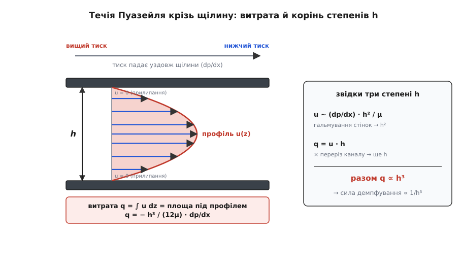
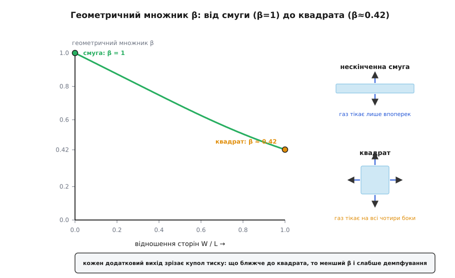

# 🧮 Звідки беруться формули squeeze-film: від Пуазейля до Блеха

Формула Стефана `F = 3πμR⁴v/(2h³)`, закон куба `1/h³`, число стиснення σ, роздвоєння на демпфер і пружину — усе це виглядає як набір окремих фактів, який доводиться просто прийняти. Насправді за ними стоїть **одне** рівняння, а за ним — два майже очевидні твердження про тонкий прошарок газу. Перше: скільки газу протискається крізь вузьку щілину за секунду під даним перепадом тиску. Друге: газ нікуди не зникає — скільки його втекло звідкись, стільки й убуло. Зчепіть ці двоє — і народиться рівняння Рейнольдса для стисненого прошарку; звузьте його на конкретну геометрію — і випаде кожна формула теми, з усіма своїми степенями `h`, множниками π і геометричними коефіцієнтами. Пройдімо весь ланцюг від однієї щілини до останньої формули, не пропускаючи жодної ланки.

### Витрата крізь щілину: течія Пуазейля і корінь усіх степенів h

Почнімо з найлокальнішого питання: газ у тонкому зазорі, тиск уздовж зазору десь вищий, десь нижчий — з якою швидкістю газ тече з місця вищого тиску в місце нижчого? Зазор тонкий (заввишки `h`), а вшир пластини величезні порівняно з ним, тож у кожній точці потік майже не «знає» про далекі краї — він локально виглядає точнісінько як [течія Пуазейля](topic:ph-mechanics/poiseuille-flow) між двома нерухомими паралельними стінками, яку жене місцевий градієнт тиску `dp/dx`. Це і є суть наближення змащувального шару: тонкість зазору й повільність руху (малі числа Рейнольдса — інерція нехтовна) зводять грізне рівняння Нав'є–Стокса до одного рядка балансу тиску й [в'язкого](topic:ph-mechanics/viscosity) тертя поперек щілини:

```
μ · d²u/dz² = dp/dx
```

Ліворуч — в'язка сила на шар газу (внутрішнє тертя гальмує профіль швидкості), праворуч — сила, з якою перепад тиску жене той шар уздовж щілини. Координата `z` відлічується впоперек зазору, від `0` до `h`; швидкість течії `u(z)` тут скрізь напрямлена вздовж `x`. Тиск упоперек тонкого шару практично не міняється, тому `dp/dx` — стала по `z`, і рівняння інтегрується двічі елементарно. Дві сталі інтегрування ловляться умовою прилипання: газ не ковзає по стінках, `u(0) = 0` і `u(h) = 0`. Виходить парабола:

```
u(z) = (1 / 2μ) · (dp/dx) · (z² − h·z)
```

Перевірка миттєва: друга похідна дає (1/μ)(dp/dx) — рівняння задоволене; на обох стінках `z = 0` і `z = h` дужка `z² − h·z` занулюється — прилипання виконане. Профіль — парабола з нулями на стінках і максимумом посередині, і напрямлена вона **проти** градієнта (де `dp/dx > 0`, там `u < 0`: газ тече туди, де тиск нижчий, як і належить).

Тепер головне число — **витрата на одиницю ширини** `q`, тобто скільки газу перетинає щілину за секунду через смужку завширшки один метр. Це площа під профілем швидкості — інтеграл `u` по всій висоті зазору:

```
q = ∫₀ʰ u dz = (1 / 2μ) · (dp/dx) · ∫₀ʰ (z² − h·z) dz
             = (1 / 2μ) · (dp/dx) · (h³/3 − h³/2)
             = − h³/(12μ) · dp/dx
```

Ось перша цеглина всієї теми — і ось де народжується куб. Розберімо його на місці, на рівні течії, а не на пальцях. Розгляньмо два множники окремо. Пікова швидкість у параболі масштабується як `u ~ (dp/dx)·h²/μ` — і саме `h²`, бо кривина профілю `d²u/dz²` за порядком є `u/h²`, а рівняння вимагає, щоб ця кривина, помножена на μ, дорівнювала `dp/dx`; отже `u ~ (dp/dx)h²/μ`. Це перші два степені. А витрата — це швидкість, помножена на переріз, тобто ще на висоту `h`: `q ~ u·h ~ (dp/dx)h³/μ`. Третій степінь. Разом `h · h² = h³`: один множник з перерізу (вужчий канал — менше площі), два — з гальмування стінками (у вужчому каналі стінки крутіше гнуть профіль). Куб зазору в силі демпфування — це не збіг і не підгонка: він **прямо** успадкований від куба в цій витраті.



*Витрата крізь щілину — це площа під параболою швидкості. Один степінь `h` дає переріз каналу, ще два — гальмування профілю стінками; разом `q ∝ h³`. Увесь дальший куб `1/h³` у силі демпфування виростає звідси.*

### Збереження маси: народження рівняння Рейнольдса

Витрату ми маємо, але вона сама по собі ще не сила. Щоб дійти до тиску, треба вимогу, яка зв'яже потік із рухом пластини, — а це закон, що газ не береться з нізвідки. Виріжмо подумки в прошарку тоненький стовпчик із основою `dx·dy` і висотою на всю щілину `h`. Маса газу в ньому — це густина на об'єм, `ρ·h·dx·dy`. Вона міняється тільки з однієї причини: скільки газу втекло крізь чотири бічні грані стовпчика. Потік маси на одиницю ширини грані — це `ρ·q`. Баланс «приріст маси = чистий приплив» дає рівняння неперервності для прошарку:

```
∂(ρh)/∂t + ∂(ρq_x)/∂x + ∂(ρq_y)/∂y = 0      тобто    ∂(ρh)/∂t + ∇·(ρ q) = 0
```

Прочитаймо його очима. Перший доданок — темп, з яким газ у стовпчику мусить кудись подітися: коли пластина йде вниз, `h` меншає, `∂(ρh)/∂t < 0`, і стовпчик щомиті «виганяє» надлишок газу. Другий доданок — куди саме той газ дівається: розтікається вбік, `∇·(ρq)`. Рівняння лише каже, що ці двоє точно збалансовані. Тепер підставмо туди здобуту витрату `q = −h³/(12μ)·∇p` (та сама Пуазейлева витрата, тільки вже у двох напрямках, `∇p` замість `dp/dx`) — і потік виражається через тиск:

```
∂(ρh)/∂t = ∇·( ρ · h³/(12μ) · ∇p )
```

Це і є **рівняння Рейнольдса** для чистого стиснення прошарку — його 1886 року вивів Осборн Рейнольдс із тих самих двох міркувань, розбираючи, чому масляна плівка тримає вал підшипника. У повній теорії змащування є ще доданок від бічного ковзання стінок (течія Куетта), але в squeeze-film стінки не ковзають — вони лише зближуються, тож той доданок відпадає, і лишається чистий «видавлювальний» член. Уся фізика теми вже сидить у цьому рядку; далі — тільки вибір, ЩО підставити замість `ρ`.

### Ізотермічний газ: замикання рівняння

Рівняння поки не замкнене: у ньому дві невідомі, `ρ` і `p`. Потрібен зв'язок між ними — рівняння стану. Для газу на масштабах і частотах MEMS процес **ізотермічний**: прошарок такий тонкий, що тепло від стиснення встигає піти в масивні стінки швидше, ніж газ помітно нагріється, тож температуру можна вважати сталою. Тоді з [рівняння стану ідеального газу](topic:ph-thermodynamics/ideal-gas-law) густина прямо пропорційна тиску: `ρ = p/(R_s·T)`, тобто `ρ ∝ p`. Сталий множник `1/(R_s·T)` виноситься й скорочується з обох боків — усюди, де стояло `ρ`, можна писати `p`:

```
∂(ph)/∂t = ∇·( p · h³/(12μ) · ∇p )
```

Винесімо сталу в'язкість і перепишемо охайно — ось канонічний вигляд **ізотермічного стисливого рівняння Рейнольдса для squeeze-film**:

```
∇·( h³ · p · ∇p ) = 12μ · ∂(ph)/∂t
```

Одне нелінійне рівняння в частинних похідних — а в ньому захована вся тема. Ліворуч — як газ розтікається (нелінійність `p·∇p` — це і є стисливість, бо `p·∇p = ½·∇(p²)`); праворуч — як швидко його стискають. Що переможе, залежить від того, наскільки швидко тиснуть проти того, наскільки швидко газ устигає втекти. Обидва граничні випадки — і Стефанова сила, і роздвоєння демпфер/пружина — це просто дві відповіді на це питання. Розберімо їх по черзі.

### Нестисливий бік: як випадає формула Стефана

Перший граничний випадок — **повільно**. Газ устигає розтектися задовго до того, як помітно стиснеться; його густину можна вважати сталою, і `ρ` (тобто `p` у лівій частині як множник) випадає з рівняння цілком:

```
∂h/∂t = ∇·( h³/(12μ) · ∇p )
```

Для плоских пластин зазор `h` однаковий по всій площі (залежить лише від часу), тож `h³/(12μ)` виноситься з-під дивергенції, і лишається рівняння Пуассона на тиск:

```
∇²p = (12μ / h³) · ∂h/∂t
```

Позначмо швидкість зближення `v = −∂h/∂t` (пластина йде вниз, зазор меншає, `∂h/∂t < 0`, а `v > 0`). Тоді права частина — стала по площі:

```
∇²p = − 12μv / h³
```

Це рівняння на форму тиску: лапласіан тиску всюди сталий і від'ємний, а на відкритому краї тиск падає до навколишнього (візьмімо його за нуль). Для **круглого диска** радіуса `R` картина осесиметрична, `p = p(r)`, і лапласіан у полярних координатах простий:

```
(1/r) · d/dr( r · dp/dr ) = − 12μv / h³
```

Інтегруємо раз (стала занулюється з умови скінченності `dp/dr` у центрі), потім удруге (стала ловиться умовою `p = 0` на `r = R`):

```
r · dp/dr = − (6μv/h³) · r²        →        dp/dr = − (6μv/h³) · r
p(r) = − (3μv/h³) · r² + C,   а з p(R)=0:   C = (3μv/h³) · R²
─────────────────────────────────────────────────────────────
p(r) = (3μv / h³) · (R² − r²)
```

Тиск — параболоїд обертання: максимум у центрі (найдалі від краю-виходу), плавно до нуля на ободі. Лишилося зібрати з нього силу — проінтегрувати тиск по всій площі диска, кільце за кільцем `2πr dr`:

```
F = ∫₀ᴿ p(r) · 2πr dr = 2π · (3μv/h³) · ∫₀ᴿ (R² − r²) · r dr
  = 2π · (3μv/h³) · ( R⁴/2 − R⁴/4 )
  = 2π · (3μv/h³) · R⁴/4
─────────────────────────────────
F = 3π · μ · R⁴ · v / (2 · h³)
```

Ось і **формула Стефана**, здобута з першопринципів — та сама, яку Йозеф Стефан отримав ще 1874 року, розбираючи «позірну адгезію» мокрих пластин. Тепер видно кожен її степінь. `1/h³` — прямий спадок куба Пуазейлевої витрати (важче протиснути крізь вужчу щілину). А `R⁴` — це два незалежні степені по `R`, помножені: два дає сам тиск (`p ~ R²`, бо газу з краю диска треба долати вдвічі довший шлях, коли радіус удвічі більший), і ще два дає площа інтегрування (`∫r dr ~ R²`). Ширша пласка площа роздмухує силу навіть крутіше, ніж підказує голе «більша площа — більша сила»: тут працює четвертий степінь.

### Прямокутна пластина: нескінченна смуга й геометричний множник β

Диск гарний тим, що симетрія робить його одновимірним. Реальна пластина MEMS — прямокутник, і тут газу є куди тікати не в один бік, а одразу в кілька, тому чистого одновимірного розв'язку вже нема. Розберімо спершу випадок, який **знову** стає одновимірним, — довгу вузьку смугу.

Хай пластина має довжину `L` і ширину `W`, причому `L ≫ W`. Тоді скрізь, крім самих торців, газу вигідно тікати лише впоперек — у бік ближчого довгого краю; уздовж довгої осі тиск майже не міняється. Задача одновимірна: `p = p(x)`, `x` від `−W/2` до `+W/2`. Рівняння Пуассона вироджується у звичайну другу похідну:

```
d²p/dx² = − 12μv / h³
```

Інтегруємо двічі; стала першого інтегрування занулюється із симетрії (`dp/dx = 0` посередині), стала другого — з умови `p = 0` на обох краях `x = ±W/2`:

```
p(x) = (6μv / h³) · ( W²/4 − x² )
```

Знову парабола, тепер уздовж ширини, з максимумом посередині смуги. Сила на одиницю довжини смуги — інтеграл цього тиску по ширині:

```
∫₋W/2^{+W/2} p dx = (6μv/h³) · ∫₋W/2^{+W/2} (W²/4 − x²) dx
                  = (6μv/h³) · ( W³/4 − W³/12 )
                  = (6μv/h³) · W³/6  =  μv·W³ / h³
```

Помножимо на довжину `L` — і дістанемо повну силу, а з неї коефіцієнт демпфування `c = F/v`:

```
F = μ·L·W³·v / h³        →        c = μ·L·W³ / h³
```

Ось звідки в темі формула `c = μLW³β/h³`: для нескінченної смуги геометричний множник **β = 1**. Зверніть увагу на розподіл степенів: куб дістається саме **ширині** `W` (короткому розмірові, впоперек якого газ тікає), а довжина `L` входить лінійно — бо вздовж неї нічого цікавого не діється, вона просто множить однакові поперечні скибки.

А тепер квадрат — чи взагалі будь-який прямокутник, де другий бік не набагато довший. Тут газ тікає **в обидва боки** водночас, і кожен зайвий вихід — це полегшення: тиск не встигає піднятися так високо, як у затиснутій з боків смузі, тож сила виходить меншою. Саме це й ловить множник **β < 1**. Порахувати його точно означає розв'язати двовимірний Пуассон `∇²p = −12μv/h³` на прямокутнику з нульовим тиском по всьому периметру. Прийом класичний: візьмімо вже знайдену смугову параболу `p_смуга(x)` як перше наближення (вона задовольняє рівняння й обнуляється на довгих краях, але **не** на торцях `y = ±L/2`) і додаймо поправку, яка гасить тиск на торцях, нічого не псуючи всередині. Поправка має задовольняти рівняння Лапласа (`∇² = 0`), тому будується з гармонік `cos` упоперек, що загасають як `cosh` уздовж. Розкладемо параболу в ряд [Фур'є](topic:math-analysis/fourier-series) по тих косинусах, що самі занулюються на бічних краях, — і кожна гармоніка дає свій внесок у поправку, а інтегрування `cosh` по скінченній довжині приносить `tanh`. Зібравши все й поділивши на смугову силу, дістаємо геометричний множник у замкненому вигляді:

```
β = 1 − (192/π⁵) · (W/L) · Σ_{n=1,3,5,…} (1/n⁵) · tanh( nπL / (2W) )
```

Це та сама сума, що зринає в задачі про кручення прямокутного бруса й про течію в прямокутному каналі, — не випадково, бо математично це одне рівняння Пуассона на прямокутнику. Перевірмо два краї. Для `L ≫ W` множник `W/L → 0` гасить усю поправку, `β → 1` — повертаємося до смуги. Для **квадрата** `W = L` сума рахується чисельно:

```
β = 1 − (192/π⁵) · Σ_{n odd} (1/n⁵) · tanh(nπ/2)
  = 1 − 0.6274 · ( 0.9172 + 0.00411 + 0.00032 + … )
  = 1 − 0.6274 · 0.9217  ≈  0.42
```

**β ≈ 0.42** для квадрата — рівно те число, що фігурує в темі. Фізичний зміст прямий: квадратна пластина, у якої газ утікає на всі чотири боки, демпфує лише десь удвічі слабше за нескінченну смугу тієї самої ширини, бо два додаткові виходи зрізають купол тиску. Проміжні пропорції плавно з'єднують ці два краї.



*Що ближча пластина до квадрата, то більше в газу шляхів утечі й то менший множник β. Довга смуга (`W/L → 0`) затискає газ з одного напрямку — β = 1; квадрат випускає його на всі чотири боки — β ≈ 0.42.*

### Число стиснення: коли газ не встигає втекти

Досі ми жили в нестисливому кутку. Тепер другий граничний випадок — **швидко**, коли стисливість уже не можна викидати. Повернімося до повного рівняння `∇·(h³p∇p) = 12μ∂(ph)/∂t` і спитаймо: за коливань частоти ω газ радше встигає розтектися чи радше стискається на місці? Відповідь дасть єдине безрозмірне число, і воно випаде саме собою, щойно ми лінеаризуємо рівняння для малих коливань.

Хай пластина коливається біля рівноваги з малою амплітудою. Запишімо зазор і тиск як «фон плюс маленьке гармонічне збурення»:

```
h = h₀ · (1 + H·e^(iωt)),      p = p₀ · (1 + P·e^(iωt)),      |H|, |P| ≪ 1
```

Тут `H = Δh/h₀` — заданий рух пластини (амплітуда відносної зміни зазору), а `P` — відгук тиску, який шукаємо; зручно рахувати їх [комплексними](topic:math-analysis/complex-numbers), щоб похідна по часу зводилася до множення на `iω`. Підставмо це в рівняння й лишімо тільки члени першого порядку по малих `H`, `P`. Зазор однаковий по площі, тож `h³` виноситься, а `p·∇p = ½∇(p²)`:

```
Ліворуч:   h₀³ · ½ · ∇²(p²) ≈ h₀³ · ½ · p₀² · 2∇²P = h₀³ · p₀² · ∇²P
             (бо p² = p₀²(1+P)² ≈ p₀²(1 + 2P), а p₀ стала по площі)

Праворуч:  12μ · ∂(ph)/∂t ≈ 12μ · p₀h₀ · iω(P + H)
             (бо ph = p₀h₀(1+P)(1+H) ≈ p₀h₀(1 + P + H))
```

Прирівнюємо й скорочуємо `p₀h₀`:

```
∇²P = ( 12μ·iω / (p₀·h₀²) ) · (P + H)
```

Тепер знеможемо розмірність: поміряймо координати в частках характерного розміру `L` (замінюємо `x → x/L`, тому `∇² → ∇²/L²`). Множник, що при цьому вискакує з правого боку, і є те саме число:

```
∇²P = i·σ·(P + H),        де        σ = 12μ·ω·L² / (p₀·h₀²)
```

Ось воно — **число стиснення** (squeeze number) σ, і тепер видно, що це не довільна комбінація, а точний вимір того самого змагання швидкостей. За змістом σ — це відношення часу, потрібного газу на в'язку втечу вздовж `L`, до періоду коливань: чисельник `12μL²/(p₀h₀²)` має розмірність часу (це характерний час дифузійного розтікання тиску крізь щілину), помножений на ω — і виходить, у скільки разів період коротший за цей час утечі. Мале σ — газ устигає (втеча швидша за коливання); велике σ — не встигає (замкнено). Той самий висновок читається прямо з рівняння: за малого σ права частина мала, тиск слабкий і йде за швидкістю (демпфер); за великого σ член `iσP` домінує, і рівняння вимагає `P ≈ −H` — тиск росте точно тоді, коли зазор меншає, тобто газ стискається як пружина.

### Лінеаризація Блеха: демпфер, пружина і поріг σ = π²

Лишилося довести цю якісну картину до чисел — знайти, як частка демпфування й частка жорсткості діляться залежно від σ. Рух пластини `H` однаковий по всій площі (тверда пластина йде вниз цілком), тож рівняння `∇²P − iσP = iσH` має сталу праву частину. Розв'язуймо його розкладом по власних формах лапласіана на пластині з нульовим тиском по краю — тих самих модах `sin`, що й раніше. Для показового одновимірного випадку (смуга, координата ξ від 0 до 1) моди — `sin(kπξ)` з власними значеннями `λ_k = (kπ)²`, а стала `H` розкладається лише по непарних `k`. Для кожної моди рівняння стає алгебраїчним:

```
−λ_k·P_k − iσ·P_k = iσ·h_k        →        P_k = − iσ·h_k / (λ_k + iσ)
```

де `h_k` — коефіцієнти розкладу сталого `H`. Уся фізика вже в цьому дробі `P_k/h_k = −iσ/(λ_k+iσ)`. Помножмо чисельник і знаменник на спряжене `(λ_k − iσ)`, щоб розділити відгук на дві частини:

```
P_k / h_k = − iσ(λ_k − iσ) / (λ_k² + σ²) = − ( σ² + i·σλ_k ) / (λ_k² + σ²)
```

Дійсна частина йде **у фазі зі зміщенням** зазору — це пружина; уявна йде **у фазі зі швидкістю** — це демпфер. Візьмімо панівну основну моду (`k = 1`, `λ = π²`) і зберімо з неї силу `F ∝ p₀·∫P`. Внесок розпадається рівно на два:

```
жорсткість (пружина):   k(σ)  ∝  σ² / (π⁴ + σ²)
демпфування:            c(σ)  ∝  λ / (λ² + σ²) · (σ/ω) = const / (π⁴ + σ²)
```

Занормуймо кожну на її природну межу — демпфування на його нестисливе значення `c₀` (при σ → 0), жорсткість на її насичення `k_∞` (при σ → ∞) — і громіздкі сталі зникають, лишаючи дві дзеркальні криві від єдиного відношення `σ/π²`:

```
c(σ) / c₀  = 1 / ( 1 + (σ/π²)² )
k(σ) / k_∞ = (σ/π²)² / ( 1 + (σ/π²)² )
```

Це і є **одномодовий результат Блеха** — Дж. Дж. Блех 1983 року показав, що поріг переходу задається саме найнижчим власним значенням цього рівняння Гельмгольца. Прочитаймо криві. За малого σ демпфування на повну (`c/c₀ → 1`), пружини майже нема (`k/k_∞ → 0`) — чистий демпфер. За великого σ навпаки: демпфування гасне як `1/σ²`, а жорсткість насичується — газова пружина бере гору. А точка, де вони міняються ролями, — там, де `σ² = π⁴`, тобто:

```
σ = π²  ≈  9.87        (поріг: c/c₀ = ½  і  k/k_∞ = ½ одночасно)
```

Ось звідки в темі «перехід біля σ ~ π²». Число `π²` тут — не магія, а найнижче власне значення основної моди тиску на одновимірній пластині. Для **двовимірного квадрата** основна мода — `sin(πξ)·sin(πη)` з власним значенням `π² + π² = 2π²`, тож поріг зсувається до `σ ≈ 2π² ≈ 20`; форма пластини рухає точний поріг, але він завжди лишається порядку π². Саме тому в темі й сказано «порядку π²»: одновимірна оцінка дає `π²`, квадрат — удвічі більше, а конкретне число залежить від геометрії.

**Умова.** Візьмімо ту саму пластину MEMS, для якої в темі вийшло `σ ≈ 1.3` (200 мкм, зазор 2 мкм, повітря, 10 кГц). Яка на цій частоті частка демпфування й частка пружини за одномодовою формулою?

```
σ/π² = 1.3 / 9.87 = 0.1317      (σ/π²)² = 0.01735

c/c₀  = 1 / (1 + 0.01735) = 0.983
k/k_∞ = 0.01735 / 1.01735 = 0.0171
```

**Висновок.** На 10 кГц плівка ще на 98 % демпфер — стисливість з'їла лише 1.7 % повної жорсткості пружини. Щоб роздвоєння сталося порівну, треба догнати σ до π² ≈ 9.87 (тобто підняти частоту приблизно всемеро, або настільки ж звузити зазор чи знизити тиск) — аж там `c/c₀` і `k/k_∞` зійдуться на ½ кожна. Це той самий висновок, що дала якісна картина, тепер у точних числах: одне безрозмірне σ керує обома частками, а поріг сидить на власному значенні основної моди.

### Що дає це виведення

Увесь зоопарк формул теми виявився одним деревом з єдиного кореня. Корінь — Пуазейлева витрата `q = −h³/(12μ)·dp/dx`, зчеплена законом збереження маси `∂(ρh)/∂t + ∇·(ρq) = 0`; разом вони дають рівняння Рейнольдса, а рівняння стану ідеального газу замикає його в ізотермічну форму `∇·(h³p∇p) = 12μ∂(ph)/∂t`. Далі — дві гілки одного питання «встигає газ утекти чи ні». Нестислива гілка (встигає) через рівняння Пуассона видала силу Стефана `3πμR⁴v/(2h³)` для дисків, коефіцієнт `μLW³/h³` для смуги (β = 1) і геометричний множник `β ≈ 0.42` для квадрата. Стислива гілка (не встигає) через лінеаризацію породила число стиснення `σ = 12μωL²/(p₀h₀²)` і роздвоєння на демпфер `1/(1+(σ/π²)²)` та пружину `(σ/π²)²/(1+(σ/π²)²)` з переходом на `σ = π²`. Кожен степінь `h`, кожне π, кожен геометричний коефіцієнт відстежено до цього одного рівняння. І оскільки «газ» знадобився аж на кроці `ρ ∝ p`, той самий кістяк без єдиної зміни описує і нестисливу масляну плівку підшипника, і стисливий повітряний прошарок мікрочипа — уся різниця лише в тому, яку гілку взяти.
