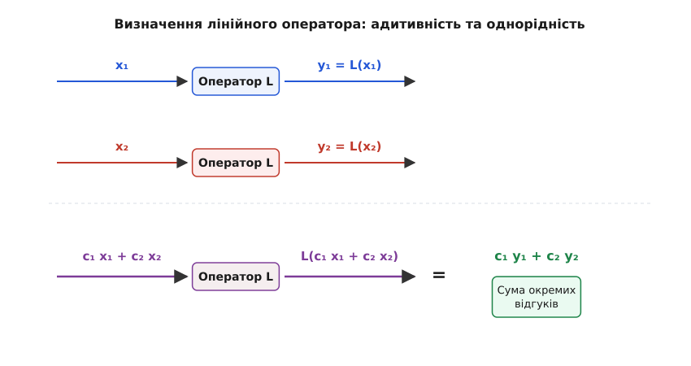
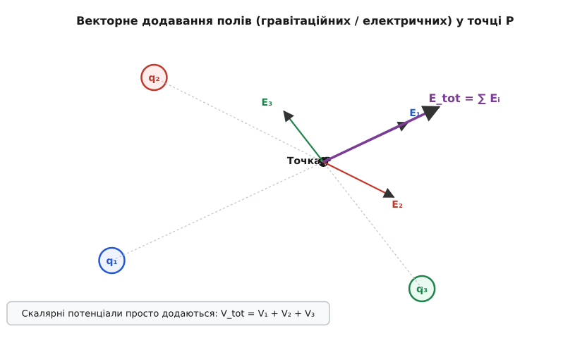
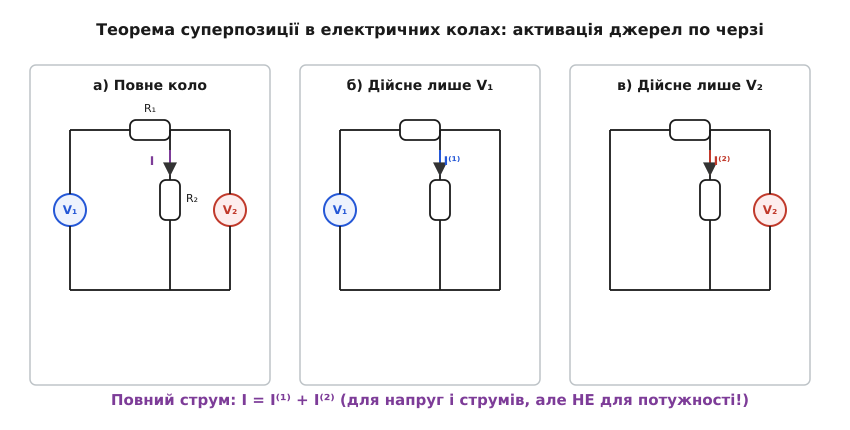
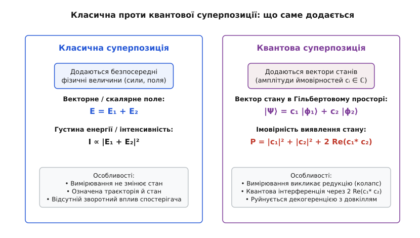
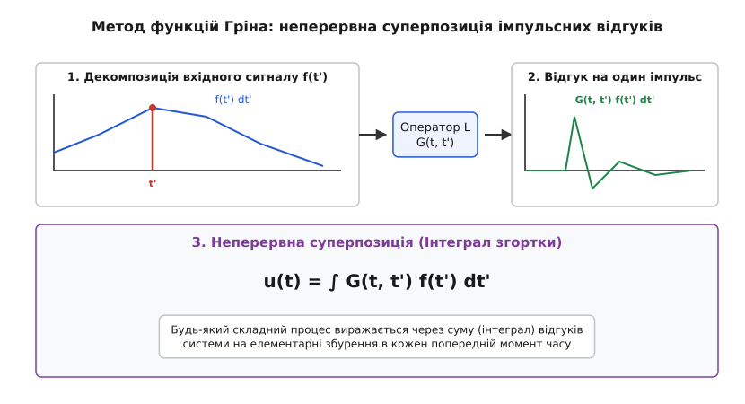

# Принцип суперпозиції у фізиці: універсальна мова лінійних систем

<preknowlist>
- [Гармонічний осцилятор](root:ph-waves/harmonic-oscillator) — ідеальна система з лінійною повертальною силою.
- [Суперпозиція хвиль](root:ph-waves/wave-superposition) — як хвильові збурення проходять одне крізь одне в середовищі.
- [Закон Кулона](root:ph-electromagnetism/coulomb-law) — лінійність електричної сили та адитивність полів від багатьох зарядів.
- [LC-контур](root:ph-waves/lc-circuit) — коливальний контур як лінійна електрична система.
</preknowlist>

Коли ви слухаєте симфонічний оркестр у концертній залі, мембрана вашого вуха здійснює один-єдиний результуючий рух. Проте мозок не чує хаотичного нерозрізнюваного гулу: ви чітко відрізняєте високу ноту флейти, оксамитовий тембр віолончелі та різкий удар тарілок. Звукові хвилі від десятків інструментів проходять крізь те саме повітря, накладаються на тій самій перетинці, але не перекручують, не викривляють і не знищують унікальну форму одне одного. Повітря доносить кожен інструмент так, ніби він грав у абсолютно порожньому залі сам-один.

Ця дивовижна незалежність і здатність до безперешкодного додавання не є спеціальною властивістю лише акустичних хвиль. Те саме відбувається, коли радіотелескоп приймає сигнали від мільйонів далеких галактик крізь той самий простір, коли електромережа живить мільйони приладів від сотень генераторів, або коли Земля одночасно відчуває притягання Сонця, Місяця та всіх планет Сонячної системи. В основі всіх цих явищ лежить один із найфундаментальніших принципів природи — **принцип суперпозиції** (лат. *superpositio*, від *super* — «над» і *positio* — «покладання, розміщення»).

Суперпозиція стверджує: якщо система реагує на збурення `f₁` відгуком `y₁`, а на збурення `f₂` відгуком `y₂`, то на комбіновану дію `c₁·f₁ + c₂·f₂` вона відповість точно такою ж лінійною комбінацією відгуків `c₁·y₁ + c₂·y₂`. На перший погляд це твердження здається простим математичним правилом, але насправді воно розділяє весь фізичний Всесвіт на дві великі території: світ **лінійних систем**, де панує суперпозиція та прості методи розкладу, і світ **нелінійних систем**, де виникають хаос, самоорганізація та злиття процесів.


*Схема дії лінійного оператора: відгук на лінійну комбінацію входів дорівнює такій самій комбінації окремих відгуків.*

---

### Фундамент: чому природа додає впливи, а не ламає їх

Чому одні фізичні системи задовольняють принцип суперпозиції, а інші — ні? Відповідь криється у будові рівнянь, якими описується система. Фізична система є лінійною тоді і тільки тоді, коли математичний оператор `L`, що пов'язує її стан `y` із зовнішнім впливом `f`, є **лінійним оператором**.

Математично це вимагає виконання двох умов:

1. **Адитивність:** `L(y₁ + y₂) = L(y₁) + L(y₂)` — два збурення, прикладені разом, створюють сумарний відгук, що дорівнює сумі окремих відгуків.
2. **Однорідність (скалювання):** `L(c · y) = c · L(y)` — збільшення сили впливу в `c` разів призводить до збільшення відгуку точно у `c` разів, без зміщення чи викривлення форми.

Якщо диференціальне рівняння, що описує систему, містить шукану функцію `y` та її похідні лише у першому степені (без квадратів, добутків `y · (dy/dt)`, синусів чи експонент від `y`), воно є лінійним.

Прикладом такої системи є пружинний маятник або чутлива мембрана при малих відхиленнях. За законами механіки, повертальна сила будь-якої гладкої потенціальної системи біля точки рівноваги описується розкладом Тейлора. Якщо потенціальну енергію `U(x)` розкласти в ряд біля мінімуму `x = 0`:

```
U(x) = U(0) + U'(0)·x + (1/2)·U''(0)·x² + (1/6)·U'''(0)·x³ + ...
```

Оскільки у точці мінімуму перша похідна `U'(0) = 0`, а постійну `U(0)` можна обрати нульовою, для малих відхилень `x` головним членом залишається квадратний доданок `(1/2)·U''(0)·x²`. Взявши похідну зі знаком мінус, отримуємо повертальну силу:

```
F(x) = - (dU/dx) = - U''(0) · x = - k · x
```

Це і є закон Гука: повертальна сила пропорційна першому степеню зсуву `x`. Якщо ми змістимо маятник на `x₁`, виникне сила `-k·x₁`. Якщо змістимо на `x₂`, виникне сила `-k·x₂`. А якщо подіють два збурення одночасно, сумарна сила дорівнюватиме `-k·(x₁ + x₂) = -k·x₁ - k·x₂`. Завдяки такій строгій пропорційності сили додаються алгебраїчно, а рівняння руху виходить лінійним:

```
m · (d²x / dt²) + k · x = f(t)
```

З цієї алгебраїчної структури випливає ключовий висновок: **у лінійній системі складне збурення можна розкласти на довільну кількість простих складових, розв'язати задачу для кожної складової окремо, а потім просто скласти результати**. Це перетворює важкі фізичні задачі на послідовність простих кроків.

Якщо ж відхилення `x` стає великим, вищими членами розкладу `(1/6)·U'''(0)·x³` вже не можна знехтувати. У рівнянні виникає кубічний доданок `γ · x³` (осцилятор Дуффінга), лінійність втрачається, і принцип суперпозиції ламається. Сума двох малих коливань у такій нелінійній системі породжує нові комбінаційні частоти, які відсутні у вихідних сигналах.

---

### Силові та потенціальні поля: векторна суперпозиція

У класичній фізиці поля — гравітаційне та електростатичне — є найяскравішими прикладами лінійних систем. Закон всесвітнього тяжіння Ньютона та закон Кулона мають однакову математичну структуру: сила пропорційна величині джерела (маси `M` або заряду `q`) та обернено пропорційна квадрату відстані.

Якщо у просторі розташовано `N` точкових зарядів `q₁, q₂, ..., q♞`, то за принципом суперпозиції кулонівська сила, що діє на пробний заряд `q₀` у точці `P`, є **векторною сумою** сил від кожного заряду окремо:

```
F_total = F₁ + F₂ + ... + F♞ = ∑ [ (q₀ · qᵢ) / (4 · π · ε₀ · rᵢ²) ] · r̂ᵢ
```

де `rᵢ` — відстань від `i`-го заряду до точки `P`, а `r̂ᵢ` — одиничний вектор напрямку від джерела до спостерігача.


*Векторне додавання полів: напруженості або сили додаються геометрично, тоді як скалярні потенціали просто підсумовуються.*

Оскільки вектор напруженості електричного поля `E = F / q₀` визначається як сила на одиничний заряд, напрямок і величина результуючого поля також підпорядковуються векторній суперпозиції:

```
E_total(r) = ∑ Eᵢ(r)
```

Векторне додавання вимагає врахування напрямків: якщо дві однакові за величиною напруженості напрямлені назустріч одна одній, їхня сума дорівнює нулю. 

Глибоким прикладом векторної суперпозиції є формування полів мультиполів. Розглянемо електричний диполь — дві однакові за модулем, але протилежні за знаком точкові заряди `+q` та `-q`, розташовані на відстані `d` один від одного. У довільній точці простору на великій відстані `r >> d` поле позитивного заряду й поле негативного заряду майже повністю гасять одне одного. Проте через невеличкий зсув положень повне гасіння не настає: сума двох кулонівських полів `1/r²` за суперпозицією дає якісно нове поле — поле диполя, що спадає набагато швидше, як `1/r³`. Якщо ж скласти два диполі, виникає квадруполь, чиє поле спадає як `1/r⁴`. Усі ці складні конфігурації є прямим математичним наслідком точної векторної суперпозиції елементарних полів `1/r²`.

Системи джерел можна розкладати у сферичні гармоніки `Yₗₘ(θ, φ)` за допомогою мультипольного розкладу:

```
V(r, θ, φ) = ∑ ∑ [ Mₗₘ / rˡ⁺¹ ] · Yₗₘ(θ, φ)
```

де моменти `Mₗₘ` (монопольний, дипольний, квадрупольний) є прямою суперпозицією внесків кожного окремого заряду системи.

Для скалярних величин — таких як гравітаційний чи електростатичний потенціал `V` — принцип суперпозиції спрощується до звичайного скалярного додавання чисел:

```
V_total(r) = V₁(r) + V₂(r) + ... + V♞(r) = ∑ [ qᵢ / (4 · π · ε₀ · rᵢ) ]
```

#### Енергія системи зарядів та її нелінійний характер

Важливо підкреслити відмінність між потенціалом і потенціальною енергією системи. Скалярний потенціал `V(r)` у точці додається лінійно. Але повна електростатична енергія `W` системи `N` зарядів не дорівнює сумі енергій окремих зарядів у порожньому просторі. Повна потенціальна енергія взаємодії системи зарядів обчислюється як:

```
W = (1/2) · ∑ ∑ [ (qᵢ · qⱼ) / (4 · π · ε₀ · rᵢⱼ) ]   [для i ≠ j]
```

Ця формула містить подвійне сумування за всіма парами зарядів `(i, j)`. Енергія взаємодії виникає з перехресних членів перекриття полів двох зарядів `∫ E₁ · E₂ dV`. Таким чином, напруженості та потенціали додаються лінійно за суперпозицією, але енергія полів, як квадратична величина `W ∝ ∫ |E|² dV`, містить перехресний інтеграл інтерференції полів `2 · ∫ E₁ · E₂ dV`.

#### Неперервний розподіл та метод функцій Гріна

Коли заряд чи маса розподілені в просторі неперервно з густиною `ρ(r')`, сума перетворюється на об'ємний інтеграл. Оскільки диференціальне рівняння для потенціалу — рівняння Пуассона `∇² V = -ρ / ε₀` — є лінійним диференціальним рівнянням у частинних похідних, ми можемо подати неперервний розподіл як нескінченну суперпозицію елементарних точкових джерел `d q = ρ(r') dV'`:

```
V(r) = (1 / (4 · π · ε₀)) · ∫ [ ρ(r') / |r - r'| ] d³r'
```

Функція `G(r, r') = 1 / (4 · π · ε₀ · |r - r'|)` являє собою відгук простору на один одиничний точковий заряд і називається **функцією Гріна** оператора Лапласа. Знаючи відгук на один точковий заряд, ми через неперервну суперпозицію (інтеграл) можемо знайти поле конфігурації будь-якої складності — від зарядженого диска до складної молекули ДНК.

---

### Електричні кола: теорема суперпозиції та пастка потужності

У теорії електричних кіл принцип суперпозиції є практичним інженером інструментом, що зветься **теоремою суперпозиції для електричних мереж**. Якщо лінійна електрична схема містить кілька незалежних джерел напруги та струму, струм або напруга на будь-якому елементі дорівнює алгебраїчній сумі струмів чи напруг, викликаних кожним джерелом окремо.

При цьому під час обчислення дії одного джерела решту джерел тимчасово «вимикають»:
- Джерела напруги замінюють **коротким замиканням** (внутрішній опір ідеального джерела напруги дорівнює нулю).
- Джерела струму замінюють **розривом кола** (внутрішній опір ідеального джерела струму прямує до нескінченності).


*Розрахунок електричної мережі за методом суперпозиції: почергове вимкнення джерел дає часткові струми, сума яких утворює повний струм.*

Розглянемо практичний приклад розрахунку складного кола з двома контурами та двома автономними джерелами напруги `V₁ = 12 В` та `V₂ = 6 В`, підключеними до трьох резисторів. Замість того, щоб розв'язувати систему рівнянь Кирхгофа для всього кола одразу, ми розбиваємо задачу на дві простіші:

1. **Крок A (Працює лише `V₁`):** Закорочуємо джерело `V₂`. Схема перетворюється на просте паралельно-послідовне з'єднання. Обчислюємо струм у центральній вітці `I⁽¹⁾`.
2. **Крок Б (Працює лише `V₂`):** Закорочуємо джерело `V₁`. Знову отримуємо просту схему з одним джерелом і знаходимо частковий струм `I⁽²⁾`.
3. **Крок В (Суперпозиція):** Додаємо часткові струми з урахуванням їхніх напрямків: `I_total = I⁽¹⁾ + I⁽²⁾`.

У загальному випадку розрахунку довільного електричного графа із `N` вузлами методом вузлових потенціалів, матричне рівняння має вигляд `G · V = I_src`, де `G` — симетрична матриця вузлових провідностей, `V` — вектор шуканих потенціалів, а `I_src` — вектор вимушених струмів джерел. Оскільки матриця провідностей `G` є лінійним оператором і не залежить від струмів чи напруг, розв'язок задається оберненою матрицею `V = G⁻¹ · I_src`. Якщо вектор джерел є сумою кількох джерел `I_src = I⁽¹⁾ + I⁽²⁾ + ...`, то розв'язок за лінійністю матричного множення тотожно розкладається у суму часткових потенціалів: `V = G⁻¹·I⁽¹⁾ + G⁻¹·I⁽²⁾ + ... = V⁽¹⁾ + V⁽²⁾ + ...`. Це строге алгебраїчне доведення того, що теорема суперпозиції в електричних колах є прямим наслідком лінійності систем алгебраїчних рівнянь Кирхгофа.

> 🔧 **Навіщо це.** Теорема суперпозиції дозволяє розраховувати складні багатоконтурні мережі без складання великих систем лінійних рівнянь. Наприклад, в аналогових підсилювачах вона дозволяє окремо розрахувати режим за постійним струмом (початкове зміщення транзистора) та коефіцієнт підсилення за змінним акустичним сигналом, а потім просто скласти ці два режими.

#### Чому потужність НЕ підпорядковується суперпозиції

Тут на інженерів-початківців часто чекає небезпечна пастка. Принцип суперпозиції бездоганно працює для **напруг** `V` та **струмів** `I`, оскільки рівняння Кирхгофа строго лінійні. Але він **категорично НЕ працює для електричної потужності** `P`!

Потужність, що виділяється на резисторі опором `R`, є квадратичною функцією струму:

```
P = R · I²
```

Якщо у колі діють два джерела, створюючи часткові струми `I₁` та `I₂`, повний струм за суперпозицією дорівнює `I_tot = I₁ + I₂`. Обчислимо повну потужність:

```
P_tot = R · (I₁ + I₂)² = R · I₁² + R · I₂² + 2 · R · I₁ · I₂ = P₁ + P₂ + 2 · R · I₁ · I₂
```

Повна потужність `P_tot` дорівнює сумі окремих потужностей `P₁ + P₂` **плюс перехресний член** `2 · R · I₁ · I₂`.

Цей перехресний член є прямим математичним відображенням **інтерференції струмів**. Якщо струми напрямлені в один бік (`I₁` та `I₂` одного знака), сумарна потужність перевищує суму окремих потужностей; якщо струми течуть назустріч — потужність може впасти до нуля. Оскільки квадрат величини не є лінійною операцією, потужність, енергія та інтенсивність у фізиці додаються із урахуванням інтерференційних перехресних членів.

У синусоїдальних колах змінного струму цей перехресний член визначає перетікання реактивної потужності. Якщо два генератори подають напругу на спільну мережу із зсувом фаз `Δφ`, миттєва потужність коливається із частотою мережі, а середня за період потужність містить косинус різниці фаз `cos Δφ`. Саме тому регулювання фази генераторів на електростанціях є критичним для запобігання перегріву ліній електропередач.

Прикладом є розрахунок мостової схеми Вітстона. При балансі моста часткові струми від джерела живлення та вимірюваного діагонального зсуву компенсують один одного у вимірювальній гілці. Проте повна теплова потужність, що виділяється в усьому мосту, визначається квадратичною сумою всіх контурних струмів.

> 📜 **Історична вставка:** [Як від Кулона та Фур'є суперпозиція стала фундаментом фізики](root:ph-waves/superposition-physics/hist-superposition-principle.md) — історія суперечки д'Аламбера, Бернуллі та Ейлера довкола коливань струни, розклад Фур'є та відкриття Юнгом світлової інтерференції.

---

### Механічні коливання та декомпозиція за нормальними модами

У механіці та акустиці принцип суперпозиції розкривається через поняття **нормальних мод коливань**. Розглянемо систему із двох зв'язаних маятників однаковою масою `m` та довжиною `L`, з'єднаних слабкою пружиною жорсткістю `k`. Якщо відхилити лише один маятник і відпустити, розпочнеться складний рух: енергія буде повільно перетікати від першого маятника до другого і назад у вигляді бить.

Проте цей складний рух виглядає запутанним лише у звичайних координатах `x₁(t)` та `x₂(t)`. Якщо перейти до так званих **нормальних координат**:

```
q₁ = (x₁ + x₂) / √2    [синфазна мода: обоє маятники рухаються в один бік]
q₂ = (x₁ - x₂) / √2    [протифазна мода: маятники рухаються назустріч]
```

то складні диференціальні рівняння розпадаються на два абсолютно незалежні рівняння гармонічного осцилятора із власними частотами `ω₁ = √(g/L)` та `ω₂ = √(g/L + 2k/m)`:

```
(d²q₁ / dt²) + ω₁² · q₁ = 0
(d²q₂ / dt²) + ω₂² · q₂ = 0
```

Будь-який, навіть найскладніший рух такої системи є чистою суперпозицією цих двох нормальних мод. Маятники можуть здійснювати безліч комбінацій руху, але всі вони є лінійною сумою синфазного та протифазного коливань:

```
x₁(t) = A₁ · cos(ω₁·t + φ₁) + A₂ · cos(ω₂·t + φ₂)
x₂(t) = A₁ · cos(ω₁·t + φ₁) - A₂ · cos(ω₂·t + φ₂)
```

Амплітуди `A₁` та `A₂` визначаються початковими умовами (початковими зміщеннями та швидкостями). Якщо на початку розтягнути обидва маятники в один бік (`x₁(0) = x₂(0)`), збуджується лише перша мода (`A₂ = 0`), і маятники коливаються як одне ціле. Якщо розтягнути в протилежні боки (`x₁(0) = -x₂(0)`), збуджується лише друга мода (`A₁ = 0`). Будь-який інший початковий стан є сумою цих двох базових мод у відповідній пропорції.

У двовимірних системах — таких як квадратна чи кругла пластина — накладання двох взаємно перпендикулярних стохастичних мод коливань утворює красиві вузлові лінії — **фігури Хладні**. Пісок, розсипаний на пластині, збирається уздовж ліній, де амплітуди двох сумувальних стоячих хвиль точно гасять одна одну (суперпозиційна тиша), утворюючи складні геометричні візерунки.

Аналогічно, суперпозиція двох взаємно перпендикулярних гармонічних коливань із різними частотами `ω_x` та `ω_y` народжує **фігури Ліссажу**. У випадку однакових частот суперпозиція `E_x = A_x cos(ω t)` та `E_y = A_y cos(ω t + Δφ)` задає стан поляризації світлової хвилі: при `Δφ = 0` виникає лінійна поляризація, при `Δφ = 90°` та `A_x = A_y` — кругова поляризація, а у загальному випадку — еліптична поляризація.

#### Спектральний аналіз Фур'є

Ця ідея узагальнюється на системи з нескінченною кількістю ступенів вільності — такі як натягнута струна, повітря у рупорі чи мембрана барабана. За теорією Фур'є, будь-який періодичний сигнал `f(t)` можна подати як нескінченну суму (суперпозицію) ортогональних синусоїдальних гармонік:

```
f(t) = (a₀ / 2) + ∑ [ aₙ · cos(n · ω₀ · t) + bₙ · sin(n · ω₀ · t) ]
```

Коефіцієнти `aₙ` та `bₙ` обчислюються через скалярний добуток (інтеграл сумісності) завдяки ортогональності синусів і косинусів на періоді. Це означає, що кожна гармоніка несе свою власну частку енергії сигналу, а загальна енергія дорівнює сумі енергій усіх гармонік (теорема Парсеваля):

```
(1/T) · ∫ |f(t)|² dt = (a₀²/4) + (1/2) · ∑ (aₙ² + bₙ²)
```

Суперпозиція дозволяє аналізувати складні акустичні чи радіосигнали не як єдину важку криву, а як спектральний «букет» незалежних частот. Оскільки лінійна система обробляє кожну синусоїду незалежно, відгук системи на весь складний сигнал отримується як просте додавання відгуків на кожну гармоніку окремо.

> 🧮 **Математична вставка:** [Лінійні оператори, розклад за базисом та функції Гріна](root:ph-waves/superposition-physics/math-linear-operators.md) — математичне виведення властивостей ядра оператора, теореми Штурма — Ліувілля та матричного формалізму у просторі станів.

---

### Квантова суперпозиція: додавання амплітуд імовірностей

Найбільш вражаючим і несподіваним чином принцип суперпозиції проявляється в квантовій механіці. Якщо у класичній физиці додаються безпосередньо вимірювані величини (вектори сил, поля, зміщення струни чи струми), то у квантовому світі додаються **вектори станів** (хвильові функції `|Ψ⟩`) у Гільбертовому просторі.

За квантовим принципом суперпозиції, якщо квантова система може перебувати у стані `|ϕ₁⟩` (наприклад, електрон із спіном вгору вздовж осі Z) і у стані `|ϕ₂⟩` (електрон із спіном вниз), вона також може перебувати у будь-якому стані, що є їхньою лінійною комбінацією:

```
|Ψ⟩ = c₁ · |ϕ₁⟩ + c₂ · |ϕ₂⟩
```

де `c₁` та `c₂` — комплексні числа, які називаються **амплітудами ймовірностей**, що задовольняють умову нормування `|c₁|² + |c₂|² = 1`.


*Відмінність класичної та квантової суперпозиції: у класичній фізиці додаються безпосередні фізичні величини, у квантовій — вектори станів із комплексною інтерференцією.*

#### Квантова інтерференція та вимірювання

Ймовірність `P` виявити систему у певному стані при вимірюванні дорівнює квадрату модуля відповідної амплітуди:

```
P = ||Ψ⟩|² = |c₁ · |ϕ₁⟩ + c₂ · |ϕ₂⟩|² = |c₁|² + |c₂|² + 2 · Re(c₁* · c₂ · ⟨ϕ₁|ϕ₂⟩)
```

Член `2 · Re(c₁* · c₂ · ⟨ϕ₁|ϕ₂⟩)` є членом **квантової інтерференції**. Саме він пояснює експеримент із поодинокими електронами на двох щілинах: електрон проходить «не через ліву і не через праву щілину», а у стані суперпозиції обох шляхів. Амплітуди проходження крізь першу `c₁` та другу `c₂` щілини додаються комплексно, створюючи інтерференційні смуги на екрані навіть тоді, коли електрони летять по одному з інтервалом у годину.

У матричному формалізмі квантової теорії інформації стан кубіта зображується точкою на сфері Блоха. Операції над кубітами (квантові вентилі, такі як вентиль Адамара `H`) є унітарними операторами `U`, що повертають вектор стану у Гільбертовому просторі:

```
H |0⟩ = (1 / √2) · |0⟩ + (1 / √2) · |1⟩
```

Це перетворює чистий стан `|0⟩` у рівній мірі зважену квантову суперпозицію `|0⟩` та `|1⟩`.

Для двокубітних систем принципом суперпозиції пояснюється квантова запутаність (entanglement). Стан Белля:

```
|Φ⁺⟩ = (1 / √2) · |00⟩ + (1 / √2) · |11⟩
```

є невиражуваною суперпозицією двохчастинкових станів, яка не розкладається на добуток станів окремих кубітів.

Проте квантова суперпозиція має дивовижну рису, відсутню у класичній фізиці: **процес вимірювання руйнує суперпозицію**. Коли макроскопічний прилад намагається зафіксувати, крізь яку саме щілину пролетів електрон, хвильова функція миттєво зазнає **редукції (колапсу)** у один із чистих станів `|ϕ₁⟩` або `|ϕ₂⟩`, і інтерференційна картина зникає.

Взаємодія квантової системи з невимірним хаотичним довкіллям викликає процес **декогеренції**, який надзвичайно швидко знищує фазовий зв'язок між комплексними амплітудами `c₁` та `c₂`. Час декогеренції `τ_dec` для макроскопічного об'єкта є нікчемно малим проти теплових коливань:

```
τ_dec ≈ τ_thermal · (λ_thermal / Δx)²
```

Саме декогеренція пояснює, чому ми не спостерігаємо суперпозицію макроскопічних об'єктів у повсякденному житті (парадокс кота Шредінгера): великі тіла занадто швидко «вимірюються» навколишніми фотонами та молекулами повітря, перетворюючи квантову суперпозицію на класичну ймовірнісну суміш. Втім, у сучасних квантових комп'ютерах штучно ізольовані надпровідникові кубіти чи іони у пастках утримуються у стані квантової суперпозиції протягом мілісекунд, що дозволяє здійснювати паралельні обчислення у мільйонах станів одночасно.

---

### Межі застосування: де суперпозиція ламається й скільки це коштує

Попри свою універсальність, принцип суперпозиції **не є абсолютним законом Всесвіту**. Він є чудовим наближенням, яке працює лише доти, доки амплітуди збурень є малими проти характеристик самого середовища. Коли амплітуда росте, природа виходить за межі параболічної потенціальної ями, пропорційність ламається, і система стає **нелінійною**.

Розглянемо чотири головні області фізики, де суперпозиція перестає працювати:

#### 1. Нелінійна оптика та сильні електромагнітні поля
У звичайній оптиці вектор поляризації середовища `P` лінійно залежить від електричного поля світлової хвилі: `P = ε₀ · χ⁽¹⁾ · E`. Проте коли крізь кристал проходить потужний фемтосекундний лазерний промінь, електричне поле хвилі стає порівняним із внутрішньоатомним полем. Залежність стає нелінійною:

```
P = ε₀ · [ χ⁽¹⁾·E + χ⁽²⁾·E² + χ⁽³⁾·E³ + ... ]
```

Квадратичний член `χ⁽²⁾·E²` призводить до того, що дві хвилі з частотою `ω` у кристалі додаються і народжують нову хвилю з подвоєною частотою `2ω` (генерація другої гармоніки). Член `χ⁽³⁾·E³` викликає **ефект Керра** — зміну показника заломлення пропорційно інтенсивності світла, через що лазерний пучок починає сам себе фокусувати (самофокусування). Світлові промені в нелінійному середовищі вже не проходять один крізь одного неушкодженими — вони розсіюються, змішуються та змінюють колір одне одного.

У нелінійних оптичних волокнах баланс між нелінійним самофокусуванням та хроматичною дисперсією народжує **солітони** — стійкі світлові імпульси, які зберігають свою форму при поширенні на тисячі кілометрів. Солітони поводяться скоріше як квазічастинки: при зіткненні двох солітонів вони не просто додаються за суперпозицією, а зазнають складного фазового зсуву та взаємодії.

#### 2. Ударні хвилі та гідродинаміка
Рівняння Нав'є — Стокса, що керують рухом рідин та газів, містять нелінійний конвективний член `(u · ∇) u`. Для дрібних брижів на воді чи тихого звуку цим членом можна знехтувати, і суперпозиція працює ідеально. 

Але якщо амплітуда хвилі стає великою (наприклад, морська хвиля на мілині або звукова хвиля від вибуху чи надзвукового літака), вершина хвилі, де тиск і густина вищі, починає бігти швидше за її підошву. Хвиля перестає бути синусоїдою, її передній фронт крутішає і перетворюється на розрив — **ударну хвилю**. Дві ударні хвилі при зіткненні не просто додають свої тиски: вони породжують складну систему відбитих хвиль, контактних розривів та вихорів.

#### 3. Нелінійна пружність та руйнування матеріалів
Закон Гука `F = -k·x` діє лише при малих деформаціях. Якщо розтягувати металевий стержень або гумовий джгут дужче, зв'язок між напруженням `σ` та деформацією `ε` стає нелінійним. При досягненні межі плинності виникають пластичні деформації, а при межі міцності — тріщини. Два механічні удари, кожен із яких окремо не руйнував деталь, у сумі можуть викликати втому матеріалу та катастрофічний розлом.

#### 4. Загальна теорія відносності Ейнштейна
У ньютонівській фізиці гравітаційні поля додаються строго за суперпозицією. Але в Загальній теорії відносності (ЗТВ) гравітаційне поле описується нелінійними тензорними рівняннями Ейнштейна:

```
G_μν = (8 · π · G / c⁴) · T_μν
```

Джерелом гравітаційного поля є тензор енергії-імпульсу `T_μν`. Оскільки саме гравітаційне поле володіє енергією, **гравітація сама створює додаткову гравітацію**. У слабких полях (наприклад, у Сонячній системі) цим ефектом можна знехтувати, і класична суперпозиція Ньютона дає високу точність. Але поблизу чорних дир чи нейтронних зірок гравітаційні поля двох об'єктів не можна просто додати: їхнє зіткнення супроводжується нелінійним випромінюванням гравітаційних хвиль та складним викривленням простору-часу.


*Неперервна суперпозиція імпульсних відгуків: довільний вхідний сигнал розкладається на елементарні імпульси, а відгук є інтегралом згортки.*

---

### Підсумковий синтез: як користуватися суперпозицією

Принцип суперпозиції — це не просто фізичний закон, а фундаментальний метод мислення. Коли ви зустрічаєте нову фізичну чи інженерну задачу, дотримуйтеся простих кроків:

1. **Перевірте лінійність:** Переконайтеся, що амплітуди збурень не виходять за межі лінійного режиму середовища (малі зсуви, відсутність насичення чи сильних полів).
2. **Розкладіть складне на просте:** Знайдіть зручний ортогональний базис — гармонічні синусоїди (спектр Фур'є), точкові імпульси (функції Гріна) чи нормальні моди системи.
3. **Обчисліть часткові відгуки:** Знайдіть реакцію системи на кожну просту складову окремо.
4. **Складіть результати:** Підсумуйте векторні напруженості, скалярні потенціали чи комплексні амплітуди ймовірностей.
5. **Пам'ятайте про квадратичні величини:** При обчисленні інтенсивності, енергії чи потужності завжди враховуйте перехресні інтерференційні члени.

> ⚙️ **Практична вставка:** [Симулятор суперпозиції лінійних систем і обчислювач імпульсного відгуку](root:ph-waves/superposition-physics/proj-linear-superposition-solver.md) — готовий робочий код мовами C та C++ для обчислення векторної суперпозиції полів та часової згортки.
>
> 📋 **Інтерфейсна вставка:** [API лінійного рушія суперпозиції та згортки](root:ph-waves/superposition-physics/api-superposition-engine.md) — довідник структур даних, контрактів функцій, обчислювальної складності та кодів помилок бібліотеки `SuperpositionEngine`.
