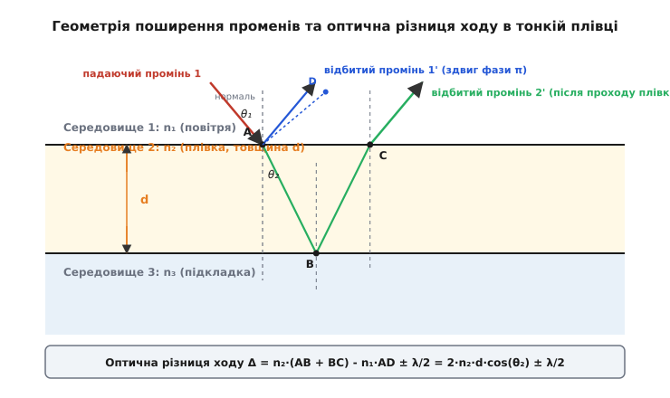
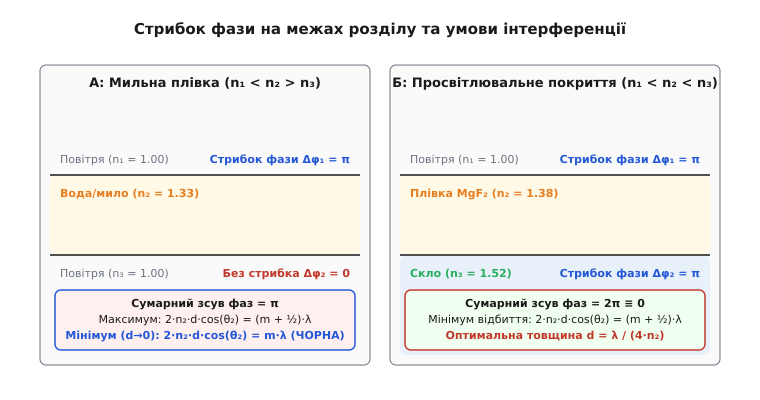
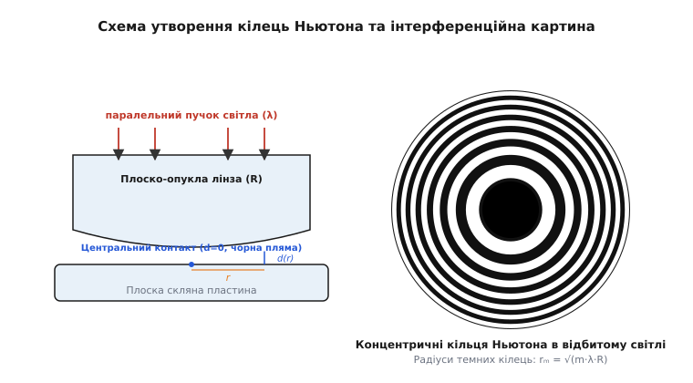

# Інтерференція в тонкій плівці

<preknowlist>
- [Двощілинний дослід Юнга](root:ph-waves/double-slit-experiment) — хвильова інтерференція, когерентність та принцип суперпозиції.
- [Закон Снелла](root:ph-waves/snells-law) — закони заломлення світла та оптичні показники середовищ.
- [Рівняння Френеля](root:ph-waves/fresnel-equations) — амплітудні коефіцієнти відбиття електромагнітної хвилі та стрибок фази на межі.
- [Когерентність](root:ph-waves/coherence) — часова та просторова когерентність світлових хвиль.
- [Поляризація світла](root:ph-waves/light-polarization) — векторний характер електромагнітних хвиль та s- і p-компоненти.
</preknowlist>

Мильна бульбашка, що ширяє у повітрі, переливається яскравими веселковими візерунками, які безперервно змінюють відтінки та зсуваються від найменшого подиху вітру. Проте перед самим розривом тонка рідка плівка у своїй найвищій точці раптово втрачає всі кольори і стає абсолютно чорною, немов дзеркально прозорою. Подібне явище можна спостерігати й на поверхні мокрої дороги, де навіть мікроскопічна крапля автомобільного пального утворює широку райдужну пляму, або на висококласних об'єктивах телескопів та фотоапаратів, скло яких відблискує глибоким синьо-фіолетовим кольором.

Усі ці ефекти мають єдину фізичну природу: це **інтерференція в тонкій плівці** (*thin-film interference*). Вона виникає тоді, коли товщина прозорого шару порівняна з довжиною світлової хвилі, змушуючи хвилі, відбиті від верхньої та нижньої меж шару, додаватися у самій фазі (підсилюючи одна одну) або у протифазі (повністю гасячи одна одну).

### 1. Механізм розділення амплітуди та когерентність відбитих променів

У більшості класичних інтерференційних експериментів (таких як двощілинний дослід Юнга чи дифракція на ґратці) світловий фронт розділяється у просторі на кілька окремих пучків — це називають **розділенням хвильового фронту** (*division of wavefront*). У тонких плівках реалізується принципово інший спосіб отримання когерентних джерел — **розділення амплітуди** (*division of amplitude*).

Коли світлова хвиля з напруженістю електричного поля `E₀` падає на межу прозорої плівки, енергія хвилі ділиться на кожній поверхні розділу:

1. На верхній межі (між середовищем 1 та плівкою 2) частина падаючої хвилі відбивається назад у перше середовище. Ця відбита хвиля утворює першу когерентну складову `1'`.
2. Заломлена частина хвилі проходить усередину плівки, досягає її нижньої межі (між плівкою 2 та середовищем 3) і відбивається від неї.
3. Повернувшись до верхньої межі, ця хвиля частково заломлюється назовні у перше середовище, утворюючи другу когерентну складову `2'`.

Оскільки обидві хвилі `1'` та `2'` виникли з одного й того самого початкового світлового пучка, вони є **строго когерентними**: їхня різниця фаз залишається постійною в часі. При накладанні цих двох хвиль у просторі утворюється інтерференційна картина — розподіл інтенсивності з чергуванням максимумів (яскравих смуг) та мінімумів (темних смуг).


*Світловий промінь падає на плівку товщиною d під кутом θ₁. Частина хвилі відбивається у точці A (промінь 1'), а частина долає шлях ABC усередині плівки та виходить у точці C (промінь 2'). Паралельний фронт AD визначає геометричну різницю ходу.*

Чому ж ми не спостерігаємо подібної інтерференції, коли світло відбивається від звичайного віконного скла товщиною у кілька міліметрів? Причина полягає у фізичному понятті **часової та просторової когерентності** (*temporal and spatial coherence*) реальних джерел світла.

Природне сонячне або кімнатне біле світло утворюється безліччю незалежних атомних випромінювачів, кожен із яких випускає хаотичні хвильові цуги скінченної тривалості `τ_c ≈ 10⁻¹⁴` с. Довжина часової когерентності для світлового пучка зі спектральною шириною `Δλ` та центральною довжиною хвилі `λ₀` описується виразом:

```
L_c = c · τ_c ≈ λ₀² / (n · Δλ)
```

Для сонячного світла у видимому діапазоні (`λ₀ ≈ 550` нм, `Δλ ≈ 300` нм) довжина когерентності `L_c` становить усього лише `1–2` мікрометри. Для світлодіода (LED) з шириною спектра `Δλ ≈ 30` нм довжина когерентності складає близько `10` мікрометрів, і лише для одномодового лазера (`Δλ < 0.001` нм) вона сягає кількох метрів або навіть кілометрів.

Якщо товщина пластини `d` перевищує довжину когерентності `L_c`, хвильові пакети, відбиті від передньої та задньої граней, випереджають один одного на відстань, більшу за їхню власну довжину, і втрачають здатність інтерферувати. Замість амплітудного додавання хвиль відбувається просте додавання інтенсивностей, і інтерференційні смуги змиваються. Саме тому інтерференція у відбитому світлі спостерігається виключно тоді, коли товщина плівки `d` вимірюється сотнями нанометрів — тобто лежить у межах від часток мікрона до кількох мікронів, що строго відповідає умові `2 · n₂ · d ≤ L_c`.

📜 [Історія дослідження інтерференції в тонких плівках](root:ph-waves/thin-film-interference/hist-thin-film-interference.md) — від спостережень Роберта Гука та кілець Ньютона до хвильового принципу Томаса Юнга, формул Ері, відкриттів Олександра Смакули та сучасної тонкоплівкової оптики.

### 2. Геометрія оптичного ходу у плівці та закон заломлення

Щоб визначити, який результат дасть накладання двох відбитих хвиль — підсилення чи взаємне гасіння, необхідно обчислити їхню **оптичну різницю ходу** `Δ`.

Розглянемо плоску плівку товщиною `d` з показником заломлення `n₂`, розташовану між першим середовищем з показником `n₁` та третім середовищем з показником `n₃`. Світловий промінь падає під кутом `θ₁` до нормалі. У точці падіння `A` промінь заломлюється усередині плівки під кутом `θ₂`, визначеним законом Снелла:

```
n₁ · sin θ₁ = n₂ · sin θ₂
```

Промінь `2'` долає всередині плівки дворазовий геометричний шлях `AB + BC`, тоді як промінь `1'` проходить у першому середовищі лише відрізок `AD` до спільного хвильового фронту `AD`:

```
Довжина шляху всередині плівки:
AB = BC = d / cos θ₂

Оптична довжина шляху другого променя:
L₂ = n₂ · (AB + BC) = 2 · n₂ · d / cos θ₂

Відстань між точками A та C на поверхні:
AC = 2 · d · tan θ₂

Відстань AD у першому середовищі:
AD = AC · sin θ₁ = 2 · d · tan θ₂ · sin θ₁

Оптична довжина шляху першого променя:
L₁ = n₁ · AD = 2 · n₁ · d · tan θ₂ · sin θ₁
```

Геометрична оптична різниця ходу `Δ_geom = L₂ - L₁` обчислюється шляхом алгебраїчного спрощення виразу:

```
Δ_geom = (2 · n₂ · d / cos θ₂) - (2 · n₁ · d · tan θ₂ · sin θ₁)
       = 2 · n₂ · d · (1 / cos θ₂ - sin² θ₂ / cos θ₂)    [закони Снелла: n₁·sin θ₁ = n₂·sin θ₂]
       = 2 · n₂ · d · ((1 - sin² θ₂) / cos θ₂)
       = 2 · n₂ · d · (cos² θ₂ / cos θ₂)
       = 2 · n₂ · d · cos θ₂
```

Таким чином, суто геометрична різниця оптичних шляхів для променів у плоскопаралельній плівці дорівнює `2 · n₂ · d · cos θ₂`. При нормальному падінні світла (`θ₁ = 0`, `θ₂ = 0`, `cos θ₂ = 1`) ця різниця спрощується до подвоєної оптичної товщини плівки: `2 · n₂ · d`.

### 3. Стрибок фази на півопліччя (π-зсув при відбитті)

Проте обчислення геометричного шляху `2 · n₂ · d · cos θ₂` дає лише половину відповіді. Другий вирішальний фактор визначається електродинамікою хвильового відбиття на межах розділу середовищ.

Згідно з рівняннями Френеля для тангенціальних компонент електромагнітного поля, при відбитті світлової хвилі від межі середовища з **вищим показником заломлення** (оптично густішого, `n_вхід < n_відбиття`), вектор електричного поля `E` змінює свій напрямок на протилежний. Це означає миттєвий **стрибок фази хвилі на π radians** (що відповідає додатковій різниці ходу у півхвилі `± λ₀ / 2`).

Якщо ж хвиля відбивається від оптично **менш густого середовища** (`n_вхід > n_відбиття`), вектор електричного поля не змінює свій знак, і зміна фази відсутня (`Δφ = 0`).

Для поглинаючих та металевих поверхонь із комплексним показником заломлення `ñ = n + i·k` фазовий зсув при відбитті залежить від коефіцієнта поглинання `k` і може набувати проміжних значень між `0` та `π`. Проте для прозорих діелектричних плівок стрибок фази приймає строго дискретні значення `0` або `π`.


*Порівняння двох режимів інтерференції. Ліворуч (А): мильна плівка у повітрі (n₁ < n₂ > n₃), стрибок фази відбуваються лише на верхній межі (Δφ = π). Праворуч (Б): просвітлювальне покриття MgF₂ на склі (n₁ < n₂ < n₃), стрибки фази відбуваються на обох межах, тому додаткова різниця фаз дорівнює 2π ≡ 0.*

Розрізняють два принципові оптичні випадки залежно від співвідношення показників заломлення трьох середовищ:

1. **Один стрибок фази на π** (симетричні плівки у повітрі, як мильна бульбашка чи олійна пляма на воді, де `n₁ < n₂ > n₃` або `n₁ > n₂ < n₃`):
   Стрибок фази відбувається лише на одній із двох меж (на першій межі для мильної плівки у повітрі). У результаті до геометричної різниці ходу додається або віднімається півхвилі `λ₀ / 2`:
   ```
   Δ = 2 · n₂ · d · cos θ₂ ± (λ₀ / 2)
   ```

2. **Два стрибки фази або жодного** (просвітлювальні покриття оптичних лінз, де `n₁ < n₂ < n₃`):
   Світло відбивається від оптично густішого середовища на *обох* межах. Оскільки обидві хвилі зазнають однакову зміну фази на `π`, їхня відносна різниця фаз виявляється рівною `2π ≡ 0`. Додатковий доданок `λ₀ / 2` у різниці ходу відсутній:
   ```
   Δ = 2 · n₂ · d · cos θ₂
   ```

🧮 [Вивід оптичної різниці ходу та формули Ері для тонкої плівки](root:ph-waves/thin-film-interference/math-thin-film-derivation.md) — математичні викладки розрахунку оптичної різниці ходу, векторних рівнянь Френеля та багатопроменевої інтерференції з урахуванням безкінечних внутрішніх відбитків.

### 4. Умови утворення максимумів та мінімумів відбиття

З урахуванням стрибка фази, запишемо умови для амплітудних екстремумів у відбитому світлі для випадку **одного стрибка фази** (`n₁ < n₂ > n₃`):

```
Максимум відбиття (підсилення відбитого світла):
2 · n₂ · d · cos θ₂ = (m + 1/2) · λ₀     [де m = 0, 1, 2, 3...]

Мінімум відбиття (повне згасання відбитого світла):
2 · n₂ · d · cos θ₂ = m · λ₀             [де m = 0, 1, 2, 3...]
```

Для випадку **двох стрибків фази** (`n₁ < n₂ < n₃`, просвітлювальне покриття) умови міняються місцями:

```
Максимум відбиття:
2 · n₂ · d · cos θ₂ = m · λ₀             [де m = 0, 1, 2, 3...]

Мінімум відбиття:
2 · n₂ · d · cos θ₂ = (m + 1/2) · λ₀     [де m = 0, 1, 2, 3...]
```

> 💡 **Чому тонка мильна плівка стає чорною перед розривом?**
> Коли мильна бульбашка стікає під дією сили тяжіння, її товщина у найвищій точці зменшується до кількох нанометрів (`d → 0`). У цій граничній ситуації геометрична різниця ходу `2·n₂·d·cos θ₂` прямує до нуля.
> 
> Проте через відбиття від оптично густішого середовища на першій межі підсилюється стрибок фази на `π`. Дві відбиті хвилі виходять у протифазі для **всіх довжин хвиль одночасно**. Внаслідок деструктивної інтерференції відбите світло повністю зникає, і товща плівки здається темно-чорною та прозорою. Поява чорної плівки (пляма Ньютона) свідчить про те, що товщина шару стала значно меншою за чверть довжини хвилі світла (в оптиці це відповідає фазі первинної бішарової ліпідної плівки Ньютона з товщиною `d ≈ 4.5` нм).

У **пропущеному світлі** спостерігається зворотно-доповняльна картина. Згідно з законом збереження енергії (якщо знехтувати поглинанням світла у матеріалі плівки), сума енергій відбитої `R` та пропущеної `T` хвиль дорівнює одиниці:

```
R + T = 1
```

Тому у тих точках і для тих довжин хвиль, де відбите світло дає мінімум (деструктивна інтерференція), пропущене світло утворює максимум, і навпаки.

### 5. Інтерференційні кольори білого світла та товщина плівки

При освітленні тонкої плівки монохроматичним світлом (наприклад, гелій-неоновим лазером з довжиною хвилі `λ₀ = 632.8` нм) інтерференційна картина виглядає як чергування світлих і темних смуг одного червоного кольору.

Проте якщо плівку освітлювати **білим світлом** (яке є сумішшю безперервного спектра довжин хвиль від `380` нм до `780` нм), ситуація кардинально змінюється. Оскільки умова максимуму `2·n₂·d·cos θ₂ = (m + 1/2)·λ₀` залежить від довжини хвилі `λ₀`, для фіксованої товщини плівки `d` умова підсилення справджується лише для одного вузького спектрального діапазону.

Наприклад, якщо для даної товщини плівки деструктивно гаситься червоний колір (`λ ≈ 650` нм), відбите світло виявиться збагаченим синьо-зеленими променями і набуде бірюзового (ціанового) відтінку. Якщо гаситься синій колір (`λ ≈ 450` нм), відбиття стане яскраво-жовтим чи помаранчевим.

```
Спектральне гасіння при білому освітленні:
Гаситься Violet (400 нм)   →  Відбивається Жовтий / Зелений
Гаситься Green (530 нм)    →  Відбивається Пурпуровий (Magenta)
Гаситься Red (650 нм)      →  Відбивається Блакитний (Cyan)
```

Ці райдужні переливи називають **інтерференційним забарвленням** або **структурним кольором** (*iridescent structural color*). На відміну від пігментів і барвників, хімічний склад плівки тут не відіграє жодної ролі в поглинанні світла — колір формується суто геометричним відбором хвиль за товщиною.

⚙️ [Симуляція спектра відбиття та інтерференційного забарвлення тонкої плівки](root:ph-waves/thin-film-interference/proj-thin-film-simulation.md) — алгоритми та реалізація програмного коду мовами C++ та Python для обчислення спектра відбиття `R(λ)` та візуалізації кольорів `sRGB` залежно від товщини плівки.

### 6. Смуги рівної товщини та інтерференція у клиноподібній плівці

Якщо товщина плівки не є строго постійною, а плавно змінюється від точки до точки, інтерференційна картина дозволяє наочно картографувати профіль поверхні.

Розглянемо плівку у формі **оптичного клина** з малим кутом загострення `α` між гранями. При нормальному падінні монохроматичного світла оптична різниця ходу в кожній точці з координатами `x` дорівнює:

```
d(x) = x · α
Δ(x) = 2 · n₂ · (x · α) + λ₀ / 2
```

Усі точки плівки, які мають однакову товщину `d`, утворюють паралельні інтерференційні смуги — **смуги рівної товщини** (*fringes of equal thickness*).

Відстань `Δx` між двома сусідніми темними або світлими смугами на поверхні клина обчислюється з умови, що при переході від порядку `m` до `m + 1` товщина плівки змінюється на `λ₀ / (2·n₂)`:

```
2 · n₂ · (Δx · α) = λ₀
Δx = λ₀ / (2 · n₂ · α)
```

Чим менший кут клина `α`, тим ширшими і виразнішими стають інтерференційні смуги. Якщо кут клина дорівнює всього кільком кутовим секундам, смуги розсуваються на міліметри, що дозволяє вимірювати мікроскопічні нахили та деформації поверхні з точністю до часток нанометра.

### 7. Кільця Ньютона: зазор змінної товщини між лінзою та пластиною

Класичним прикладом смуг рівної товщини є **кільця Ньютона** (*Newton's rings*). Вони виникають у повітряному зазорі між опуклою поверхнею скляної лінзи великого радіуса кривизни `R` та плоскою скляною пластиною.


*Притиснута до плоскої пластини плоско-опукла лінза утворює повітряний зазор змінної товщини d(r). Відбиті хвилі утворюють концентричні кільця з темною плямою в центрі.*

З геометричного прямокутного трикутника для лінзи радіуса `R` зв'язок між відстані від центра `r` та товщиною зазору `d(r)` виражається так:

```
R² = (R - d)² + r²
R² = R² - 2·R·d + d² + r²
```

Оскільки товщина зазору `d` набагато менша за радіус кривизни лінзи (`d ≪ R`), квадратом `d²` можна знехтувати:

```
d(r) ≈ r² / (2 · R)
```

Оскільки світло відбивається від нижньої пластини (межа «повітря-скло») зі стрибком фази `π`, підставимо товщину `d(r)` в умови мінімуму й максимуму:

```
Темні кільця у відбитому світлі:
2 · d(r) = m · λ₀
2 · (r² / (2·R)) = m · λ₀
rₘ = √(m · λ₀ · R)    [де m = 0, 1, 2, 3...]

Світлі кільця у відбитому світлі:
r'ₘ = √((m + 1/2) · λ₀ · R)    [де m = 0, 1, 2, 3...]
```

Вимірюючи радіуси кілець Ньютона `rₘ`, можна з високою точністю обчислити радіус кривизни лінзи `R` або довжину хвилі світла `λ₀`.

### 8. Багатопроменева інтерференція та просвітлювальна оптика

Досі ми розглядали лише додавання двох перших відбитих променів. Проте у плівці відбувається нескінченний ряд внутрішніх відбитків. Урахування всіх цих хвиль називають **багатопроменевою інтерференцією** (*multiple-beam interference*).

Найважливішим практичним застосуванням інтерференції є **антивідбивальне (просвітлювальне) покриття** (*antireflective coating*) оптичних деталей.

Коли світло падає із повітря (`n₁ = 1.00`) на поверхню скла (`n₃ = 1.52`), приблизно `4.2%` світлової енергії відбивається назад:

```
R_glass = ((n₃ - n₁) / (n₃ + n₁))² = ((1.52 - 1.00) / (1.52 + 1.00))² ≈ 0.0425  (4.25%)
```

У складних оптичних системах (наприклад, у сучасних фотооб'єктивах із 15–20 лінзами) багаторазові відбиття призводять до втрати понад 50% світлового потоку та утворення паразитного ореолу (відблисків).

Щоб повністю усунути відбиття світла для конкретної довжини хвилі `λ₀` (зазвичай обирають зелений колір `λ₀ = 550` нм, до якого людське око найбільш чутливе), на поверхню скла наносять тонку плівку з проміжним показником заломлення `n₂` (`n₁ < n₂ < n₃`).

Для такої системи обидві хвилі відбиваються від оптично густіших середовищ, тому обидві зазнають стрибка фази на `π`. Сумарна оптична різниця ходу дорівнює чисто геометричній: `Δ = 2·n₂·d`.

Щоб досягти деструктивного гасіння відбитого світла, різниця ходу має дорівнювати півхвилі:

```
2 · n₂ · d = λ₀ / 2
d = λ₀ / (4 · n₂)
```

Тобто оптимальна товщина просвітлювальної плівки має дорівнювати **чверті довжини хвилі світла у матеріалі плівки** (`λ_плівки / 4`).

Для повного згасання амплітуди відбитих хвиль мають бути не лише в протифазі, а й рівними за модулем. З формул Френеля випливає умова на показник заломлення плівки:

```
r₁₂ = r₂₃
(n₂ - n₁) / (n₂ + n₁) = (n₃ - n₂) / (n₃ + n₂)
n₂ = √(n₁ · n₃)
```

Для звичайного скла (`n₃ = 1.52`) у повітрі (`n₁ = 1.00`) ідеальний показник заломлення плівки дорівнює:

```
n₂ = √(1.00 · 1.52) ≈ 1.23
```

У реальному оптичному виробництві найближчим стійким матеріалом є фторид магнію (`MgF₂`, `n₂ = 1.38`). Нанесення чвертьхвильового шару `MgF₂` дозволяє знизити коефіцієнт відбиття від скла з 4.2% до менш ніж 1.2%. Багатошарові просвітлювальні покриття (що складаються з десятків чергованих шарів `TiO₂` та `SiO₂`) дозволяють знизити відбиття у всьому видимому спектрі до невимірних `0.1%`.

> 🔧 **Навіщо це.**
> Просвітлення оптики використовується у фотокамерах, біноклях, медичних ендоскопах, мікроскопах, лазерних системах та сонячних батареях. Без тонкоплівкового просвітлення сучасна оптична інженерія не змогла б створити світлосильні об'єктиви чи ефективні кремнієві фотопанелі.

### 9. Практичні застосування в оптиці та технологіях

Інтерференція у тонких плівках лежить в основі цілої низки критично важливих технологій та наукових методів:

#### Еліпсометрія та нанометрологія
**Еліпсометрія** (*ellipsometry*) — це надзвичайно точний оптичний метод вимірювання товщини тонких плівок та їхніх показників заломлення. Метод спирається на вимірювання зміни стану поляризації (еліптичності) світла після відбиття від тонкоплівкової структури. Сучасні еліпсометри здатні вимірювати товщину покриттів із фантастичною точністю до `0.01` нм (частки атомного шару), що є стандартом контролю якості у напівпровідниковій мікроелектроніці при виробництві процесорів.

#### Багатошарові діелектричні дзеркала (Бреггівські дзеркала)
Чергуванням диелектричних шарів із високим (`n_H`) та низьким (`n_L`) показниками заломлення товщиною `λ₀ / (4·n)` утворюються **Бреггівські дзеркала** (*Distributed Bragg Reflectors, DBR*). Усі відбиті від численних меж хвилі додаються в одній фазі, дозволяючи отримати коефіцієнт відбиття світла понад `99.999%`. На відміну від металевих дзеркал, диелектричні дзеркала практично не поглинають світлову енергію і здатні витримувати надпотужні лазерні імпульси.

#### Контроль точності оптичних поверхонь
Накладання еталонної плоскої скляної пластини на досліджувану деталь дозволяє бачити смуги рівної товщини у повітряному зазорі. Будь-яка мікроскопічна ямка або подряпина на поверхні викривляє інтерференційні смуги. Відхилення смуги на половину відстані між сусідніми смугами свідчить про наявність дефекту висотою всього `λ₀ / 4 ≈ 130` нм.

#### Біологічний структурний колір
У дикій природі інтерференція в тонких плівках використовується багатьма живими організмами для створення яскравущого забарвлення без жодних хімічних пігментів:
- Яскраві синьо-зелені переливи на крилах метеликів роду *Morpho* виникають внаслідок інтерференції світла у багатошарових хітинових лусочках.
- Райдужний блиск павичевого пір'я, панцирів жуків-скарабеїв та перламутрового шару молюсків забезпечується регулярними тонкоплівковими наноструктурами.
