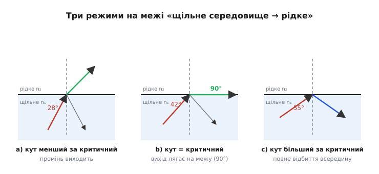
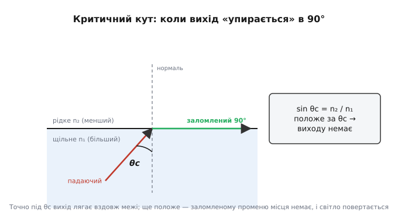
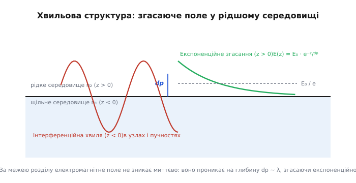
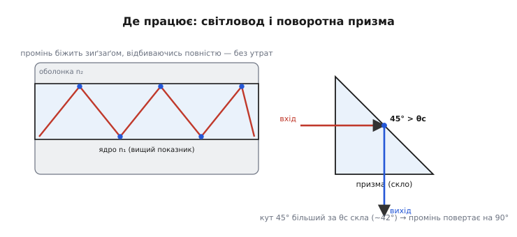

# Повне внутрішнє відбиття

<preknowlist>
- [Закон Снелла](root:ph-waves/snells-law) — співвідношення кутів падіння та заломлення світла на межі двох середовищ.
- [Формули Френеля](root:ph-waves/fresnel-equations) — коефіцієнти відбиття й заломлення для s- та p-поляризованих хвиль.
- [Рівняння Максвелла](root:ph-electromagnetism/maxwell-equations) — граничні умови для векторів електромагнітного поля на межі розділу.
- [Оптоволокно](root:com-medium/optical-fiber) — передача світлового сигналу через скляну нитку завдяки замиканню світла в ядрі.
</preknowlist>

Людина, яка пірнає на дно басейну й дивляться вгору під положим кутом, бачить замість відкритого неба поверхню води, що перетворилася на ідеальне дзеркало. У ній віддзеркалюється дно, стінки й власне тіло, але жодного променя знадвору не пробивається крізь водну гладінь. Варто спрямувати погляд майже прямовисно вгору — і зовнішній світ з'являється знову всередині світлого кола. Те саме явище змушує діаманти палахкотіти внутрішніми іскрами, перетворює скляні призми біноклів на дзеркала без жодного металевого напилення та утримує світлові імпульси всередині тонких скляних ниток, що прокладені по дну океанів.

Це явище називають **повним внутрішнім відбиттям** (*total internal reflection*, TIR). Воно виникає, коли електромагнітна хвиля поширюється з оптично щільнішого середовища в менш щільне й падає на межу під кутом, більшим за критичний. На відміну від звичайного відбиття від металевих дзеркал, де 2–5% світлової енергії неминуче поглинається чи розсіюється, повне внутрішнє відбиття повертає **сто відсотків** падаючої енергії назад у перше середовище.

---

### 1. Фізична природа заломлення та оптична щільність

Поширення світла у прозорій речовині супроводжується його взаємодією з електронами атомів. Електромагнітна хвиля змушує електронні оболонки коливатися й перевипромінювати хвилі, що призводить до зменшення фазової швидкості світла `v` порівняно зі швидкістю у вакуумі `c`. Співвідношення цих швидкостей визначає **показник заломлення** (*refractive index*) середовища:

```
n = c / v
```

Для вакууму `n = 1` за означенням. У повітрі за нормальних умов фазова швидкість лише трохи менша за вакуумну (`n ≈ 1.0003`). У воді показник заломлення становить `n ≈ 1.333`, у звичайному силікатному склі — `n ≈ 1.50`, у важких флінтах — `n ≈ 1.70–1.90`, у монокристалічному кремнії для інфрачервоного діапазону — `n ≈ 3.45`, а в діаманті досягає `n ≈ 2.42`. Що більший показник заломлення, то оптично щільнішим є середовище для електромагнітної хвилі.

Варто підкреслити, що в оптиці під оптичною густиною розуміють саме величину показника заломлення `n`, а не масову густину речовини `ρ`. Наприклад, етиловий спирт чи олія мають меншу масову густину, ніж вода, проте вищий показник заломлення, тому для світлових хвиль вони є оптично щільнішими середовищами.

Закон заломлення світла можна фундаментально вивести з **принципу Ферма** (принципу найменшого оптичного часу). Розглянемо шлях світла між точкою `A` в першому середовищі та точкою `B` у другому середовищі. Повний час проходження `T(x)` становить:

```
T(x) = (√(a² + x²) / v₁) + (√(b² + (d - x)²) / v₂)
```

Взявши похідну `dT / dx = 0` та підставивши `v₁ = c / n₁` й `v₂ = c / n₂`, отримуємо геометричне співвідношення синусів кутів падіння `θ₁` та заломлення `θ₂`:

```
(n₁ / c) · (x / √(a² + x²)) = (n₂ / c) · ((d - x) / √(b² + (d - x)²))
n₁ · sin θ₁ = n₂ · sin θ₂
```

Ця рівність становить **закон Снелла**. При переході з оптично менш щільного середовища в щільніше (`n₁ < n₂`) заломлений промінь відхиляється **до нормалі** (`θ₂ < θ₁`). Натомість при переході з оптично щільнішого середовища в менш щільне (`n₁ > n₂`) заломлений промінь відхиляється **від нормалі** (`θ₂ > θ₁`).

З точки зору хвильової оптики, поведінка світла на межі регулюється фундаментальними **граничними умовами Максвелла**. На межі двох непоглинаючих діелектриків `z = 0` тангенціальні компоненти електричного `E[t]` та магнітного `H[t]` полів мусять бути неперервними:

```
E[1t] = E[2t]
H[1t] = H[2t]
```

Ця неперервність у кожній точці межі `(x, y)` в будь-який момент часу `t` вимагає суворого збігу фазових чинників падаючої, відбитої та заломленої хвиль. Звідси випливає рівність тангенціальних компонент хвильових векторів `k[1x] = k[2x]`, що дорівнює `k₀ · n₁ · sin θ₁ = k₀ · n₂ · sin θ₂` і виражає закон Снелла хвильовою мовою.

У реальних прозорих середовищах показник заломлення залежить від частоти випромінювання `n(ω)`, що зумовлює хроматичну дисперсію. Наслідком цієї залежності є відмінність між фазовою швидкістю `v[ph] = c / n` та груповою швидкістю `v[g] = dω / dk`, з якою поширюється огинаюча світлового імпульсу. При повному внутрішньому відбитті дисперсія середовища визначає не лише критичний кут для кожної довжини хвилі, але й фазове розширювання коротких світлових імпульсів.

---

### 2. Геометрія критичного кута: границя закону Снелла

Перепишемо закон Снелла для кута виходу `θ₂` при поширенні світла зі щільного середовища в рідше (`n₁ > n₂`):

```
sin θ₂ = (n₁ / n₂) · sin θ₁
```

Оскільки відношення `n₁ / n₂ > 1`, синус кута заломлення `sin θ₂` виявляється більшим за синус кута падіння `sin θ₁`. Це означає, що при збільшенні кута падіння `θ₁` кут заломлення `θ₂` зростає швидше й першим досягає фізичної межі в `90°`.


*Світло йде знизу, зі щільнішого середовища (n₁), у рідке (n₂). Зліва кут падіння малий — промінь заломлюється й виходить, відхиляючись від нормалі. Посередині кут досяг порога — заломлений промінь лягає точно вздовж межі (вихід під 90°). Справа кут ще положіший — виходу немає зовсім, і все світло відбивається назад усередину.*

Кут падіння, при якому кут заломлення дорівнює точно `90°` (заломлений промінь ковзає вздовж межі розділу), називають **критичним кутом** (*critical angle*, `θc`). Підставляючи `θ₂ = 90°` та `sin 90° = 1` у закон Снелла, отримуємо фундаментальне співвідношення:

```
n₁ · sin θc = n₂ · sin 90° = n₂
sin θc = n₂ / n₁             (за умови n₁ > n₂)
```

Критичний кут залежить **виключно від відношення показників заломлення** двох середовищ. Якщо кут падіння перевищує критичний (`θ₁ > θc`), розрахунок за законом Снелла дає значення `sin θ₂ > 1`. Оскільки в дійсних числах синус кута не може перевищувати одиницю, заломленого променя геометрично не існує. Світлова хвиля втрачає можливість вийти у друге середовище й **повністю** повертається в перше середовище.


*Під критичним кутом падіння θc заломлений промінь виходить рівно під 90° — лягає вздовж самої межі. Будь-який ще положіший промінь (із більшим кутом падіння) вийти вже не може й повертається назад. Сам поріг задається відношенням показників: sin θc = n₂/n₁.*

> 🔧 **Навіщо це.** Критичний кут є головним розрахунковим параметром при проектуванні оптичних систем. У волоконній оптиці він визначає апертурний кут вводу світла у волокно: якщо світло входить під занадто крутим кутом до осі ядра, кут його падіння на оболонку виявиться меншим за `θc`, і світло витече назовні. В оптичних призмах критичний кут визначає геометрію граней, за якої призма працюватиме як дзеркало без напилення.

Порівняймо чисельні значення критичного кута для різноманітних оптичних меж:

1. **Межа вода — повітря (`n₁ = 1.333, n₂ = 1.000`):**
   ```
   sin θc = 1.000 / 1.333 = 0.7502  ⇒  θc = arcsin(0.7502) ≈ 48.61°
   ```
   Усе світло під водою, що спрямоване до поверхні під кутом, положішим за `48.61°` відносно вертикалі, повертається назад у воду.

2. **Межа крон-скло — повітря (`n₁ = 1.517, n₂ = 1.000`):**
   ```
   sin θc = 1.000 / 1.517 = 0.6592  ⇒  θc = arcsin(0.6592) ≈ 41.20°
   ```
   Оскільки кут падіння у прямокутній поворотній призмі становить `45°`, а `45° > 41.20°`, світло повністю відбивається під кутом `90°` без дзеркального напилення.

3. **Межа важкий флінт — повітря (`n₁ = 1.755, n₂ = 1.000`):**
   ```
   sin θc = 1.000 / 1.755 = 0.5698  ⇒  θc = arcsin(0.5698) ≈ 34.74°
   ```
   Важкі флінти мають менший критичний кут, що розширює діапазон кутів повного відбиття.

4. **Межа діамант — повітря (`n₁ = 2.417, n₂ = 1.000`):**
   ```
   sin θc = 1.000 / 2.417 = 0.4137  ⇒  θc = arcsin(0.4137) ≈ 24.44°
   ```
   Надзвичайно малий критичний кут означає, що світло, потрапляючи всередину ограненого діаманта, легко замикається всередині й зазнає десятків послідовних повних відбиттів від внутрішніх граней, перш ніж вийти крізь верхню корону.

5. **Межа монокристалічний кремній — повітря (ІЧ-діапазон, `n₁ = 3.45, n₂ = 1.00`):**
   ```
   sin θc = 1.00 / 3.45 = 0.28985  ⇒  θc = arcsin(0.28985) ≈ 16.85°
   ```
   В інфрачервоній оптиці високий показник заломлення напівпровідників створює критичні кути, менші за `17°`.

6. **Межа арсенід галію (GaAs) — повітря (`n₁ = 3.60, n₂ = 1.00`):**
   ```
   sin θc = 1.00 / 3.60 = 0.27778  ⇒  θc = arcsin(0.27778) ≈ 16.13°
   ```
   У напівпровідникових лазерах та світлодіодах малий критичний кут створює проблему виходу випромінювання назовні, вимагаючи просвітлюючих покриттів чи мікролінз.

7. **Межа серцевина волокна — оболонка (`n₁ = 1.48, n₂ = 1.46`):**
   ```
   sin θc = 1.46 / 1.48 = 0.9865  ⇒  θc = arcsin(0.9865) ≈ 80.57°
   ```
   Оскільки показники заломлення ядра й оболонки оптоволокна дуже близькі, критичний кут підбирається майже до `90°`. Звідси обчислимо **числову апертуру** (*numerical aperture*, `NA`) волокна, яка визначає максимальний кут вводу світла `θ[in,max]` з повітря (`n₀ = 1.00`):

```
NA = n₀ · sin θ[in,max] = n₁ · sin(90° - θc) = n₁ · cos θc
NA = n₁ · √(1 - sin² θc) = n₁ · √(1 - (n₂ / n₁)²) = √(n₁² - n₂²)
NA = √(1.48² - 1.46²) = √(2.1904 - 2.1316) = √0.0588 ≈ 0.2425
θ[in,max] = arcsin(0.2425) ≈ 14.03°
```

Таким чином, у дане волокно з повітря можна ввести лише ті промені, які падають на вхідний торець під кутом, не більшим за `14.03°` до осі нитки.

---

### 3. Хвильова структура: згасаюче поле та еванесцентна хвиля

Променева (геометрична) оптика стверджує, що при `θ₁ > θc` світло взагалі не потрапляє у друге середовище. Проте повна хвильова теорія, заснована на рівняннях Максвелла, виявляє значно глибшу картину: електромагнітне поле не зупиняється миттєво на географічній лінії межі.

Рівняння Максвелла вимагають безперервності тангенціальних компонент електричного `E` та магнітного `H` полів на межі розділу `z = 0`. Щоб задовольнити ці граничні умови при `θ₁ > θc`, хвильовий вектор у другому середовищі мусить мати комплексну нормальну компоненту `k[2z] = i · α`.


*За межею розділу електромагнітне поле не зникає миттєво: воно проникає на глибину dp ~ λ, згасаючи експоненційно.*

У результаті у другому середовищі виникає **згасаюча (еванесцентна) хвиля** (*evanescent wave*). Напруженість її електричного поля описується виразом:

```
E₂(x, z, t) = E₀ · exp(-α · z) · exp(i(k[x] · x - ωt))
```

Ця хвиля має дві унікальні властивості:
1. Вона поширюється вздовж межі розділу (вздовж осі `x`) з фазовою швидкістю `v[ph] = c / (n₁ · sin θ₁)`.
2. Углиб другого середовища (вздовж осі `z`) її амплітуда згасає за чисто експоненційним законом без фазового набігу.

Глибина проникнення `d[p]`, на якій амплітуда поля зменшується в `e` разів (приблизно в 2.72 раза), визначається формулою:

```
d[p] = 1 / α = λ₀ / (2π · √(n₁² · sin² θ₁ - n₂²))
```

Для видимого світла (`λ₀ ≈ 500–600 нм`) глибина проникнення `d[p]` становить від десятків до сотень нанометрів (зазвичай від `0.1 · λ₀` до `0.5 · λ₀`).

Розрахунок вектора Пойнтінга показує, що усереднений за часом потік енергії крізь межу у напрямку осі `z` дорівнює **точно нулю** (`⟨S[z]⟩ = 0`). Енергія не витікає у друге середовище безповоротно: вона лише здійснює зворотно-поступальні коливання крізь межу протягом кожного напівперіоду хвилі, підтримуючи існування приповерхневого еванесцентного шару. Детальні виведення комплексного хвильового вектора, векторів Пойнтінга та фазових зсувів наведено у матеріалі [Виведення згасаючої хвилі та фазового зсуву](root:ph-waves/total-internal-reflection/math-evanescent-wave.md).

Коли світло відбивається від межі при `θ₁ > θc`, коефіцієнти відбиття Френеля для s- та p-поляризацій стають комплексними числами з модулем, що дорівнює точно одиниці (`|r[s]| = 1, |r[p]| = 1`). Проте вони набувають фазових зсувів `δ[s]` та `δ[p]`.

Тригонометричні вирази для половинних кутів фазового зсуву мають вигляд:

```
tg(δ[s] / 2) = - √(n₁² · sin² θ₁ - n₂²) / (n₁ · cos θ₁)
tg(δ[p] / 2) = - n₁ · √(n₁² · sin² θ₁ - n₂²) / (n₂² · cos θ₁)
```

Оскільки `δ[p]` та `δ[s]` відрізняються, відбиття змінює стан поляризації падаючої хвилі. Різниця цих зсувів `Δδ = δ[p] - δ[s]` описується співвідношенням:

```
tg(Δδ / 2) = (cos θ₁ · √(n₁² · sin² θ₁ - n₂²)) / (n₁ · sin² θ₁)
```

Цей ефект використовується у **ромбі Френеля**, де два послідовних повних внутрішніх відбиття під кутом близько `54°` створюють сумарний фазовий зсув `90°` (`π/2`), перетворюючи лінійно поляризоване світло на циркулярно поляризоване.

Крім того, залежність фазового зсуву від кута падіння викликає **зсув Гуса-Хенхен** (*Goos-Hänchen shift*): відбитий світловий пучок зазнає макроскопічного поперечного зсуву `Δx` вздовж поверхні розділу. Промінь відбиється не з точки падіння, а ніби входить у друге середовище, просувається вздовж межі усередині еванесцентного шару на відстань порядку `d[p]` і лише потім повертається в перше середовище.

У випадку циркулярно поляризованих променів також спостерігається поперечний **зсув Імберта-Федорова** (*Imbert-Fedorov shift*), при якому відбитий світловий пучок відхиляється у напрямку, перпендикулярному до площини падіння, що належить до спінових ефектів фотоніки.

---

### 4. Порушене повне внутрішнє відбиття (FTIR) та оптичне тунелювання

Якщо у рідше середовище (наприклад, у повітряний зазор) на відстані `d < d[p]` помістити третє середовище з показником заломлення `n₃ ≥ n₁`, експоненційне поле еванесцентної хвилі досягає третього середовища до того, як його амплітуда згасне до нуля.

У такому разі еванесцентне поле у зазорі знову збуджує ззвичайну біжучу світлову хвилю у третьому середовищі. Це явище називають **порушеним повним внутрішнім відбиттям** (*Frustrated Total Internal Reflection*, FTIR). З точки зору квантової фізики FTIR є точним оптичним аналогом **квантового тунелювання** фотонів крізь потенціальний бар'єр.

Зшивання граничних компонент хвиль на двох межах `z = 0` та `z = d` дає точну формулу пропускання енергії крізь зазор товщиною `d`:

```
T(d) = 1 / (1 + C · sh²(α · d))
```

Де коефіцієнт `C` описує імпедансну неузгодженість середовищ. При `α · d ≫ 1` формула спрощується до чисто експоненційного загасання тунельного струму фотонів:

```
T(d) ≈ (4 / C) · exp(-2 · α · d)
```

При `d = 0` (повний оптичний контакт) пропускання дорівнює `100%`. Якщо зазор розширюється до кількох довжин хвиль (`d ≫ λ₀`), пропускання прямує до нуля, і відновлюється звичайне 100%-ве повне внутрішнє відбиття. Алгоритм числового розрахунку еванесцентного поля й коефіцієнтів FTIR мовами C, C++ та Python розгорнуто у проєкті [Моделювання згасаючої хвилі та тунелювання світла (FTIR)](root:ph-waves/total-internal-reflection/proj-tir-simulator.md).

#### Поверхневий плазмонний резонанс (SPR)
Особливим випадком FTIR є збудження **поверхневих плазмон-поляритонів** (Surface Plasmon Resonance, SPR) на межі скло–метал–діелектрик (конфігурація Кречманна). При нанесенні на скляну призму тонкого шару золота чи срібла товщиною близько 50 нм p-поляризована еванесцентна хвиля при повному внутрішньому відбитті збуджує колективні коливання вільних електронів металу (плазмони).

Резонансне збудження виникає при куті падіння `θ[spr]`, коли тангенціальний хвильовий вектор еванесцентної хвилі дорівнює хвильовому вектору плазмона `k[sp]`:

```
k₀ · n₁ · sin θ[spr] = k₀ · √( (ε[m] · ε[d]) / (ε[m] + ε[d]) )
```

Тут `ε[m]` — діелектрична проникність металу, `ε[d]` — діелектрична проникність досліджуваного середовища над золотою плівкою. У момент резонансу коефіцієнт відбиття від призми падає практично до нуля, а світлова енергія повністю передається у поверхневий плазмон. Оскільки кут `θ[spr]` надзвичайно чутливий до найменших змін показника заломлення приповерхневого шару (до `10⁻⁶`), біосенсори SPR широко використовуються у фармакології для вимірювання кінетики зв'язування антитіл і білків у реальному часі без мічення молекул.

#### Оптичне маніпулювання еванесцентними полями
Високоінтенсивні градієнти еванесцентного поля на межі хвилеводу створюють оптичні градієнтні сили, здатні захоплювати й транспортувати диелектричні наночастинки та віруси уздовж поверхні світловода. Оптичний тиск з боку еванесцентної хвилі використовується в оптичних мікроманіпуляторах та лаб-на-чіпі системах.

Порушене повне внутрішнє відбиття також лежить в основі інших технологій:
- **FTIR-куб-сплітери (світлодільники):** дві скляні призми, складені гіпотенузами через контрольований повітряний зазор у кілька сотень нанометрів, ділять падаючий промінь у довільній пропорції (наприклад, 50/50).
- **Сенсорні екрани FTIR:** світло запускається в скляну панель під кутом повного відбиття. Коли палець торкається скла, високий показник заломлення шкіри (`n ≈ 1.4–1.5`) руйнує ПВВ у точці контакту. Світло витікає в палець, а фотодатчики по краях панелі фіксують точні координати падіння інтенсивності.
- **Спектроскопія порушеного повного внутрішнього відбиття (ATR-FTIR):** досліджувану речовину притискають до кристала з високим показником заломлення (алмаз, германій). Еванесцентне поле проникає в зразок на глибину до 1 мкм. Речовина вибірково поглинає певні довжини хвиль, що дозволяє миттєво отримувати інфрачервоні спектри рідин, гелів та полімерів без їх руйнування.
- **Оптична мікроскопія ближнього поля (NSOM):** надтонкий оптичний зонд підводиться до поверхні зразка на відстань `z < d[p]`, реєструючи еванесцентні хвилі й забезпечуючи просторову роздільну здатність нижче дифракційної межі (до 5–10 нм).
- **Флуоресцентна мікроскопія повного внутрішнього відбиття (TIRF):** еванесцентне поле використовується для селективного збудження флуорофорів лише у вузькому приповерхневому шарі клітини товщиною 100 нм, що виключає фонову флуоресценцію з глибини цитоплазми й дозволяє спостерігати поодинокі молекули білків на клітинній мембрані.

---

### 5. Інженерні застосування та природні явища

Повне внутрішнє відбиття є фундаментом для створення широкого класу оптичних приладів та інфраструктури зв'язку.


*Ліворуч — світловод: щільніше ядро (n₁) в рідшій оболонці (n₂); промінь падає на бічну межу положіше за критичний кут і біжить зиґзаґом, відбиваючись повністю на кожному дотику. Праворуч — поворотна призма: світло входить перпендикулярно крізь катет, падає на похилу грань під 45° (а це більше за критичний кут скла ≈ 42°), повністю відбивається й виходить, повернувши на 90°.*

#### Оптоволоконні світловоди
У волоконно-оптичних лініях зв'язку світловий сигнал передається крізь тонке скляне ядро (*core*) з показником `n₁ ≈ 1.48`, оточене скляною оболонкою (*cladding*) з трохи меншим показником `n₂ ≈ 1.46`. Світловий промінь вводиться в ядро під малим кутом до осі, тому на бічній межі ядро–оболонка кут падіння перевищує критичний (`θ₁ > 80.5°`).

Математично хвильовий режим у волокні визначається безрозмірним **V-параметром** (*нормованою частотою*):

```
V = (2π · a / λ₀) · √(n₁² - n₂²) = (2π · a / λ₀) · NA
```

Тут `a` — радіус ядра волокна. Якщо `V < 2.405`, у волокні може поширюватися лише одна фундаментальна мода `HE₁₁`. Таке волокно називають **одномодовим** (*single-mode*). Вчинок відсутності міжмодової дисперсії одномодові волокна забезпечують смугу пропускання у десятки терабіт на секунду.

У **градієнтних волокнах** (*graded-index fibers*) показник заломлення ядра не є постійним, а плавно зменшується від центра до периферії за параболічним законом `n(r) = n₁ · √(1 - 2Δ · (r/a)²)`. Світлові промені в такому волокні поширюються не зиґзаґами, а плавними синусоїдальними траєкторіями, безперервно відхиляючись за рахунок послідовного внутрішнього відбиття у шарах скла з різною густиною. Це вирівнює час проходження різних мод і суттєво зменшує міжмодову дисперсію порівняно зі східчастими багатомодовими волокнами.

У сучасній фотоніці повне внутрішнє відбиття поєднують із метаповерхнями та фотонно-кристалічними волокнами (Photonic Crystal Fibers, PCF), де мікроскопічні повітряні канали створюють штучний показник заломлення оболонки, забезпечуючи керування дисперсією та локалізацію екстремально високих лазерних потужностей.

Промінь зазнає десятків тисяч послідовних повних відбиттів на кожному метрі нитки. Оскільки коефіцієнт відбиття дорівнює точно `100%`, світло не втрачає потужності на межі. Єдиними джерелами втрат залишаються власне об'ємне релеєвське розсіювання та поглинання іонами OH⁻ у матеріалі скла. У сучасних кварцових волокнах загасання становить менше `0.18 дБ/км` на довжині хвилі `1550 нм`, що дозволяє передавати гігабітні потоки даних на сотні кілометрів без регенерації. Повний аналіз мод, числової апертури та розсіювання у світловодах наведено у статті [Оптоволокно](root:com-medium/optical-fiber).

#### Інтегральна фотоніка та планарні хвилеводи
У фотонних інтегральних схемах (PIC) світлові сигнали спрямовуються планарними прямокутними хвилеводами із кремнію на ізоляторі (Silicon-on-Insulator, SOI, `n[core] = 3.45`, `n[cladding] = 1.45`). Для введення випромінювання із зовнішнього волокна в мікроскопічний планарний хвилевод використовують призматичні елементи зв'язку (Prism Couplers) або дифракційні гратки, де збереження фазового узгодження засноване на збігу хвильових векторів еванесцентних полів.

Крім того, тунельний зв'язок між двома паралельними планарними хвилеводами, розміщеними на відстані менше мікрона один від одного, дозволяє будувати напрямлені відгалужувачі (Directional Couplers) та оптичні перемикачі, де світлова енергія періодично перетікає з одного хвилеводу в інший за рахунок еванесцентного перекриття мод.

#### Оптичні призми
У біноклях, перископах, геодезичних тахеометрах і дзеркальних фотоапаратах для зміни напрямку світлового пучка використовують скляні призми замість дзеркал.
- **Призма Порро (Porro prism):** прямокутна призма з кутами `45°–45°–90°`. Світло входить перпендикулярно крізь катет, падає на гіпотенузу під кутом `45°` (що більше за критичний кут скла `~41.8°`) і повністю відбивається, повертаючи на `90°`. Використання двох призм Порро дозволяє розвернути зображення на `180°` і змістити оптичну вісь.
- **Призма Аббе-Кеніга та пентапризма:** використовуються у видошукачах зеркальних фотоапаратів для збереження прямого зображення при розвороті променя.
- **Кутові відбивачі (ретрорефлектори):** система з трьох взаємно перпендикулярних дзеркальних граней (куточок куба). Світло, зазнавши трьох послідовних повних відбиттів від внутрішніх граней, повертається точно в напрямку джерела незалежно від кута падіння.

Завдяки тому, що повне відбиття від скляної грані не залежить від стану металевого напилення, призми не тьмяніють з часом, мають стійкість до високих світлових потужностей і забезпечують 100%-ве відбиття.

#### Огранування дорогоцінного каміння
Ювелірне огранування діаманта (діамантове огранування Марселя Толковського 1919 року) розраховане так, щоб світло, яке входить крізь верхню площадку (корону) під кутом купола, падало на нижні павільйонні грані під кутами `40.75°`, що суттєво більше за критичний кут діаманта (`θc ≈ 24.4°`). Завдяки цьому світло не витікає крізь дно каменю, а повністю відбивається від обох павільйонних граней і повертається в око спостерігача крізь верхні грані, забезпечуючи знаменитий «блиск» та «гру вогнів».

#### Природні явища
- **Вікно Снелла (Snell's window):** підводний спостерігач, глянувши вгору, бачить усе верхнє півкулястий світ стиснутим у конус із кутом розкриття `2 · θc ≈ 97.2°`. Поза цим конусом поверхня води працює як дзеркало, віддзеркалюючи підводне дно.
- **Атмосферні міражі:** над розпеченим асфальтом або піском пустелі приземний шар повітря сильно нагрівається й має менший показник заломлення, ніж вищі прохолодніші шари. Світло неба, падаючи положо на цей гарячий шар, зазнає повного внутрішнього відбиття в повітрі й повертається в око спостерігача, створюючи ілюзію «водної калюжі».
- **Біоаналоги світловодів:** морські губки *Euplectella aspergillum* (Венерин кошик) утворюють скляні голки з кремнієвих ниток із двошаровим показником заломлення, які діють як природні оптичні світловоди для освітлення симбіотичних бактерій на великих глибинах.
- **Давачі дощу та рівня рідини:** у автомобільних давачах дощу світлодіод випромінює світло всередину лобового скла під кутом `45°`. Якщо скло сухе, світло повністю відбивається на межі скло–повітря й потрапляє на фотодіод. Коли на скло випадає крапля води (`n ≈ 1.33`), критичний кут зростає з `41.8°` до `62.5°`. Повне відбиття зривається, світло витікає у воду, і фотодіод фіксує падіння сигналу, вмикаючи склоочисники.

Детальний історичний шлях від досліджень Кеплера й Декарта до сучасних світловодів розкрито у матеріалі [Історія дослідження повного внутрішнього відбиття](root:ph-waves/total-internal-reflection/hist-tir-discovery.md).

---

### 6. Обмеження, втрати та крайові випадки

Незважаючи на фундаментальну досконалість коефіцієнта відбиття `R = 1`, у реальних фізичних пристроях повне внутрішнє відбиття може порушуватися через такі чинники:

1. **Шорсткість межі розділу:** якщо мікронеровності поверхні порівнянні з довжиною хвилі світла (`σ ~ λ`), падаюча хвиля дифрагує на шорсткостях. Виникають локальні кути падіння, менші за `θc`, що спричиняє дифузне розсіювання світла назовні.
2. **Забруднення поверхні:** пил, жир чи волога на зовнішній поверхні світловодного ядра змінюють локальний показник заломлення `n₂`, підвищуючи критичний кут і спричиняючи витік світла. Саме тому в оптоволокні використовують захисну двошарову структуру.
3. **Радіус вигину світловода:** якщо світловод зігнути з занадто малим радіусом `R`, кут падіння променя на зовнішню стінку вигину зменшується й стає меншим за критичний `θc`. Виникають втрати на вигин (*macrobending losses*).
4. **Спектральна дисперсія:** показник заломлення залежить від довжини хвилі `n(λ)`. Синє світло заломлюється сильніше за червоне, тому критичний кут `θc(λ)` трохи різниться для різних кольорів.
5. **Порогова потужність оптичного руйнування:** при високих інтенсивностях лазерного випромінювання (наприклад, у фемтосекундних лазерах) висока напруженість електричного поля еванесцентної хвилі може викликати багатофотонну іонізацію діелектрика й оптичний пробій межі.

---

### Підсумок

Повне внутрішнє відбиття виникає на межі оптично щільного й рідшого середовищ (`n₁ > n₂`), коли кут падіння перевищує критичний поріг `θc = arcsin(n₂ / n₁)`. На відміну від звичайних дзеркал, воно повертає `100%` світлової енергії назад у перше середовище.

Хвильова теорія показує, що за межею розділу існує еванесцентне поле, яке згасає експоненційно на глибині `d[p] ~ λ` без постійного витоку енергії. Зближення двох середовищ на відстань `d < d[p]` викликає порушене повне відбиття (FTIR) — оптичний аналог квантового тунелювання. Завдяки повній відсутності втрат на відбиття це явище замикає світлові імпульси у міжконтинентальних оптоволоконних кабелях, забезпечує роботу призматичної оптики, біосенсорів та створює неповторний блиск дорогоцінного каміння.
