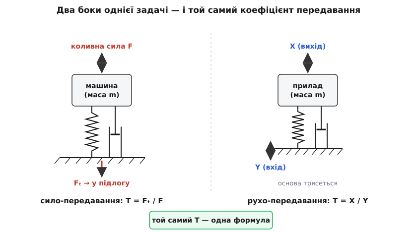
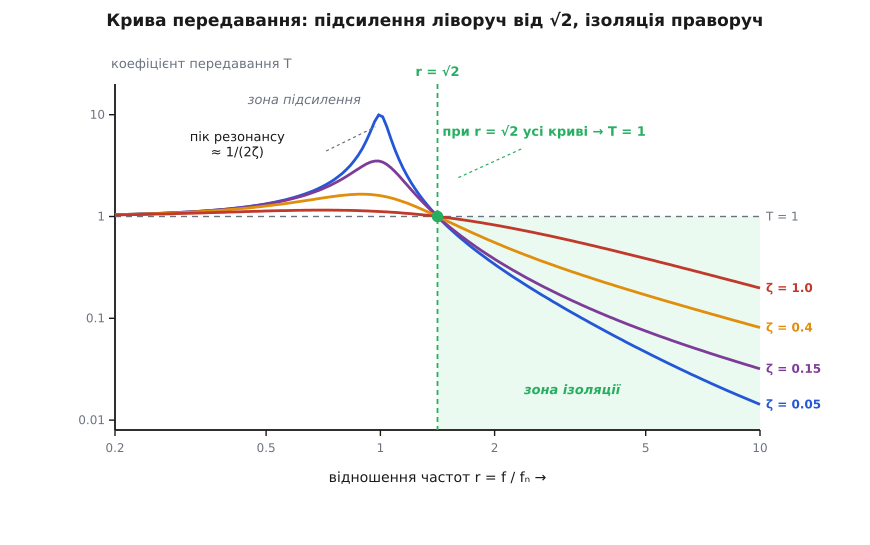
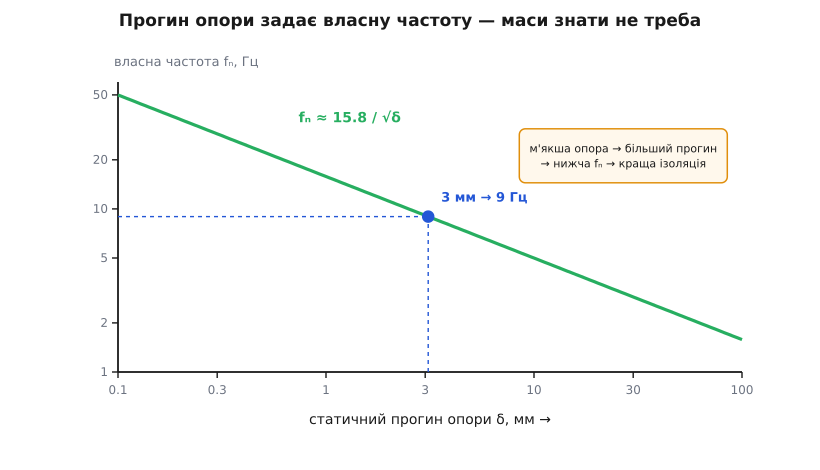

# Передавання вібрації (transmissibility)

<preknowlist>
- [Гармонічний осцилятор](topic:ph-waves/harmonic-oscillator) — маса на пружині, власна частота ωₙ = √(k/m), вільні коливання.
- [Загасний осцилятор](topic:ph-waves/damped-oscillator) — тертя гасить коливання; що таке коефіцієнт загасання ζ і критичне загасання.
- [Механічний резонанс](topic:ph-waves/mechanical-resonance) — коли зовнішня сила гойдає систему коло її власної частоти, розмах різко зростає.
</preknowlist>

Пральна машина на віджиманні підстрибує й гупає — і сусід поверхом нижче це чує. Мікроскоп на лабораторному столі тремтить від того, що вулицею проїхав ваговоз, і зображення розпливається. Камера на дроні знімає драглисте «желе» замість чіткого кадру, бо рама дрижить від моторів. Це все — одна задача, обернена двома боками.

У першому випадку джерело трясіння **всередині** (мотор пральної машини крутить незбалансований барабан), і ми не хочемо, щоб його вібрація дійшла до підлоги. У другому джерело **зовні** (підлога, стіл, рама дрижать самі), і ми хочемо вберегти від нього делікатну річ. Розв'язок в обох випадках однаковий на вигляд: поставити між ними щось пружне — гумову подушку, пружину, силіконовий підвіс. Але коли це справді допомагає, а коли навпаки — робить гірше?

Наївна відповідь «закріпи міцніше, щоб не дрижало» — **хибна**. Жорстке кріплення передає геть усе: підлога рушила на міліметр — прилад рушив на той самий міліметр. Пружний підвіс іноді рятує, а іноді перетворює маленьке трясіння на катастрофу. Щоб знати, коли саме, потрібне одне число.

## Одне число: скільки проходить крізь підвіс

Зведімо все до найпростішої моделі: один шматок маси m лежить на пружині жорсткості k, а поряд — гасник коливань (демпфер) з в'язким тертям c, що чинить силу пропорційно швидкості. Маса рухається лише в одному напрямку — кажуть, система має один ступінь вільності. Це найпростіший випадок, з якого все видно.

Дві величини задають її характер:

```
власна частота:       ωₙ = √(k / m)        (як швидко система гойдалася б сама)
коефіцієнт загасання:  ζ  = c / (2·√(k·m))  (наскільки сильно тертя гасить)
```

Тепер головне означення. **Коефіцієнт передавання** T (лат. *transmittere* — «пересилати») — це відношення того, що вийшло, до того, що зайшло:

```
T = (розмах на виході) / (розмах на вході)
```

Для пральної машини «вхід» — сила незбалансованого барабана, «вихід» — сила, що доходить до підлоги. Для мікроскопа «вхід» — розмах коливань столу, «вихід» — розмах коливань самого приладу. T = 0.1 означає, що проходить лише десята частина; T = 5 означає, що підвіс не приглушив, а вп'ятеро **підсилив** трясіння. Це чисте число без одиниць, і саме воно вирішує все.



*Зліва сила народжується всередині машини й тисне на підлогу; справа основа трясе прилад. Пружина з демпфером не розрізняють цих випадків — коефіцієнт передавання в них той самий.*

## Два завдання — одна відповідь

Здається, це два різні завдання: погасити силу від машини і вберегти прилад від тряски основи. Дивовижно, але відповідь у них **та сама**. Повний хід [виведення](topic:ph-waves/vibration-transmissibility/math-transmissibility.md) дає для обох випадків однаковісіньку формулу коефіцієнта передавання — і сило-, і рухопередавання зводяться до одного виразу.

Це не збіг. Обидва рази сила проходить крізь ту саму пару «пружина + демпфер», а вона не розрізняє, чи то маса тисне на основу, чи основа штовхає масу. Тож достатньо розв'язати одне завдання — і безплатно маємо друге. Формула така:

```
T = √[ (1 + (2ζr)²) / ((1 − r²)² + (2ζr)²) ]

r = f / fₙ    — відношення частоти трясіння до власної частоти підвісу
ζ             — коефіцієнт загасання
```

На вигляд громіздко, але за нею ховається дуже проста поведінка, і вся вона сидить в одній величині — r.

## Уся поведінка сидить у відношенні частот

r показує, у скільки разів частота трясіння вища за власну частоту підвісу. Пройдімо криву від малих r до великих.

**Повільне трясіння, r ≪ 1.** Якщо зовнішнє коливання набагато повільніше за власну частоту, пружина не встигає нічого «згладити»: вона передає рух, як жорсткий стрижень. T ≈ 1 — проходить майже все, підвіс не працює. (Постав важкий стіл на м'які ніжки й повільно поведи рукою — стіл піде за рукою один до одного.)

**Резонанс, r ≈ 1.** Коли трясіння влучає в саму власну частоту, система входить у [резонанс](topic:ph-waves/mechanical-resonance): кожен наступний поштовх додається в такт до попереднього, і розмах наростає. Тут T не просто більше за одиницю — воно **величезне**. При слабкому загасанні пік сягає приблизно

```
T_пік ≈ 1 / (2ζ)
```

тобто при ζ = 0.05 підвіс підсилює трясіння **вдесятеро**. Це та сама [добротність](topic:ph-waves/q-factor), що описує гостроту резонансу. Замість захисту — руйнівне розгойдування; саме так вібрація доводить погано підвішені машини до [втоми металу](topic:ph-mechanics/material-fatigue) й тріщин.

**Точка переходу, r = √2.** Ось найкрасивіше. Прирівняймо T до одиниці й подивімось, де підвіс перестає шкодити:

```
1 + (2ζr)²  =  (1 − r²)² + (2ζr)²
1           =  (1 − r²)²
1 − r²      =  ±1     →    r² = 2     →    r = √2 ≈ 1.41
```

Член із загасанням скоротився! Виходить, при r = √2 коефіцієнт передавання дорівнює одиниці **за будь-якого загасання** — усі криві, хоч яке в них тертя, проходять через цю одну точку. Це поріг: ліворуч від нього підвіс підсилює, праворуч — нарешті приглушує.

**Зона ізоляції, r > √2.** Тільки тут T < 1 і підвіс справді ізолює (лат. *insula* — острів; прилад стає «острівцем» спокою). Що більше r, то краще: далеко за порогом T спадає приблизно як 1/r². Звідси головне правило.

> 🔧 **Навіщо це.** Щоб підвіс ізолював, власну частоту треба зробити **набагато нижчою** за частоту трясіння — принаймні у √2 разів, а на практиці в 3–5. А низька власна частота ωₙ = √(k/m) означає **м'яку** пружину. Ось чому антивібраційні опори завжди податливі, а не тверді: інтуїція «закріпи жорсткіше» веде рівно в протилежний бік — у резонанс. Те, що рятує саме м'якість, а не міцність, інженери зрозуміли не одразу — [історія м'якого підвісу](topic:ph-waves/vibration-transmissibility/hist-soft-mounting.md) про це.



*Слабке загасання дає високий пік на резонансі, зате глибоко пірнає в зоні ізоляції; сильне загасання приборкує пік, але піднімає всю праву частину. Усі криві сходяться в точці r = √2.*

## Парадокс загасання

Здавалось би, тертя — це завжди добре: воно гасить коливання. Але погляньмо на формулу двома очима.

Біля резонансу (r ≈ 1) загасання **рятує**: воно збиває той страшний пік. Без нього T на резонансі йшло б у нескінченність. А через резонанс проходить кожна машина — коли розганяється й коли зупиняється, її частота проповзає через власну частоту підвісу. У ці секунди без загасання підвіс розніс би все.

Але в зоні ізоляції (r > √2) те саме загасання **шкодить**. Погляньмо на доданок (2ζr)² у чисельнику: він піднімає T. Демпфер дає вібрації другий шлях повз пружину — силу, пропорційну швидкості, — і цей шлях спадає з частотою повільніше, тож на високих r псує ізоляцію. Порахуймо для r = 4 (добре в зоні ізоляції):

**Слабке загасання ζ = 0.05 проти сильного ζ = 0.3, при r = 4:**
```
ζ = 0.05:  2ζr = 0.4    T = √[(1 + 0.16) / ((1 − 16)² + 0.16)]
                        T = √[1.16 / 225.16] = 0.072    → ізоляція 93 %

ζ = 0.3:   2ζr = 2.4    T = √[(1 + 5.76) / (225 + 5.76)]
                        T = √[6.76 / 230.76] = 0.171    → ізоляція 83 %
```

Сильніше загасання **погіршило** ізоляцію: з 0.072 до 0.171. А на резонансі (r = 1) те саме сильніше загасання, навпаки, приборкує пік з ×10 до ×1.9. Ось і вся напруга проєктування: досить загасання, щоб безпечно пережити резонанс на розгоні, але не стільки, щоб убити ізоляцію на робочій частоті. М'яка гума з поміркованим внутрішнім тертям — типовий компроміс.

## Практичний важіль: статичний прогин

Як на ділі задати потрібну власну частоту? Зважувати масу й рахувати жорсткість пружин — морока. Є коротший шлях. Коли маса просто лежить на опорі, її вага стискає пружину на певну величину — **статичний прогин** δ. За [законом Гука](topic:ph-condensed/elastic-deformation) k·δ = m·g, тож k/m = g/δ, і власна частота виражається лише через цей прогин:

```
ωₙ = √(g / δ)

fₙ = (1/2π)·√(g / δ) ≈ 15.8 / √δ     (fₙ у Гц, δ у мм)
```

Маси у формулі немає зовсім! Досить **побачити, наскільки опора просіла** під приладом, — і власна частота відома. М'якша опора просідає більше → нижча fₙ → краща ізоляція. Ось чому хороший антивібраційний підвіс завжди трохи «гуляє» під вагою: це не недолік, а сама умова роботи.

**Приклад: розв'язати мотор 1800 об/хв від підлоги на 90 %.**
```
частота трясіння:   f = 1800 / 60 = 30 Гц   (раз на оберт від дисбалансу)
ціль:               T = 0.10
для слабкого загасання  T ≈ 1/(r² − 1):
   0.10 = 1/(r² − 1)  →  r² − 1 = 10  →  r = √11 ≈ 3.32
власна частота:     fₙ = f / r = 30 / 3.32 ≈ 9.0 Гц
потрібний прогин:   δ = (15.8 / fₙ)² = (15.8 / 9.0)² ≈ 3.1 мм
```

Отже, опори, що просідають десь на 3 мм під вагою мотора, дадуть 90-відсоткову ізоляцію на 30 Гц. Число крихітне й дуже наочне: якби взяти тверді опори з прогином 0.1 мм, fₙ підскочила б до ~50 Гц, r упало б нижче √2 — і замість ізоляції ми отримали б підсилення. Повну криву для конкретного випадку й автоматичний добір опори зручно [порахувати кодом](topic:ph-waves/vibration-transmissibility/proj-isolator-design.md).



*Одна крива fₙ ≈ 15.8/√δ пов'язує «наскільки просіла опора» з власною частотою — маси знати не треба. Позначено робочу точку прикладу: прогин 3 мм дає ≈ 9 Гц.*

## Де проста картина ламається

Модель «маса на ідеальній пружині» веде далеко, але має межі — про них варто знати заздалегідь.

**М'якість не безкоштовна.** Що нижча fₙ, то більший статичний прогин і то сильніше прилад «плаває»: хитається від найменшого поштовху, кренить під час розгону, потребує більше місця на хід. Дуже м'який підвіс добре ізолює вібрацію, але кепсько тримає положення — тому в реальному діапазоні fₙ рідко опускають нижче кількох герц.

**Реальна опора — не ідеальна пружина.** На високих частотах у самій гумі чи пружині бігають власні хвилі, і замість того щоб спадати як 1/r², крива ізоляції на якійсь частоті «випростовується» й перестає покращуватися. Тому паспортні криві реальних опор завжди гірші за ідеальну параболу.

**Тіло — не точка.** Справжня машина на кількох опорах — це не одна маса в одному напрямку, а тверде тіло з шістьма ступенями вільності: воно може не лише підстрибувати, а й гойдатися та крутитися, і ці рухи переплітаються. Одновимірна формула дає правильну суть і перший розрахунок, але точний підбір багатоопорного підвісу — окрема, глибша розмова.

Уся справа зводиться до одного руху думки: підвіс ізолює не тому, що твердий, а тому, що **м'який** — його власну частоту опускають глибоко під частоту трясіння, у зону r > √2, де крізь пружину проходить дедалі менше. Загасання додають рівно стільки, щоб безпечно проскочити резонанс дорогою туди. А знаючи лише частоту трясіння й потрібний рівень тиші, решту — прогин опори, її жорсткість — читаєш просто з коефіцієнта передавання.
