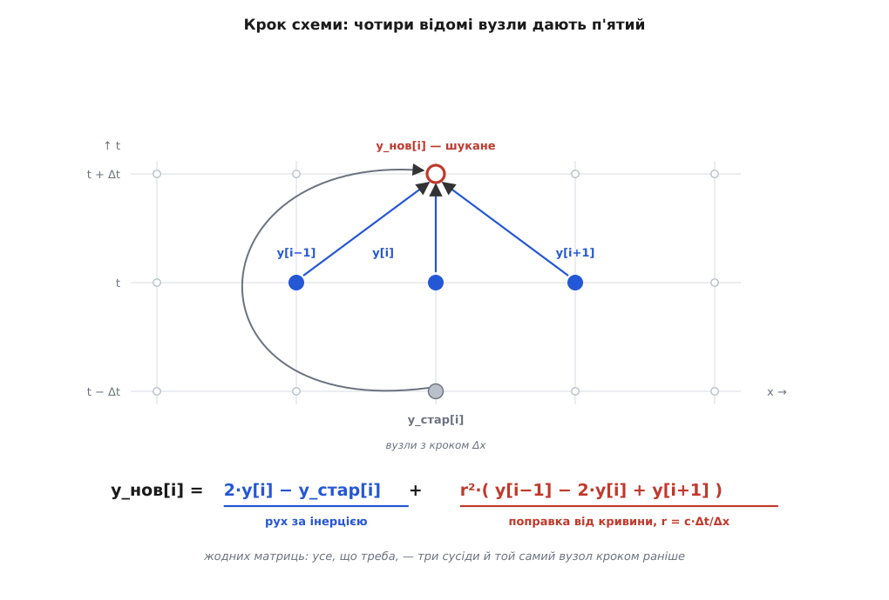
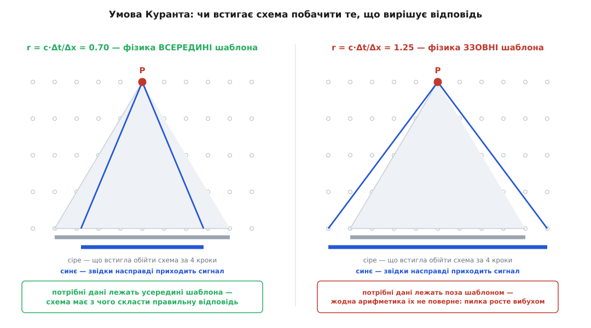
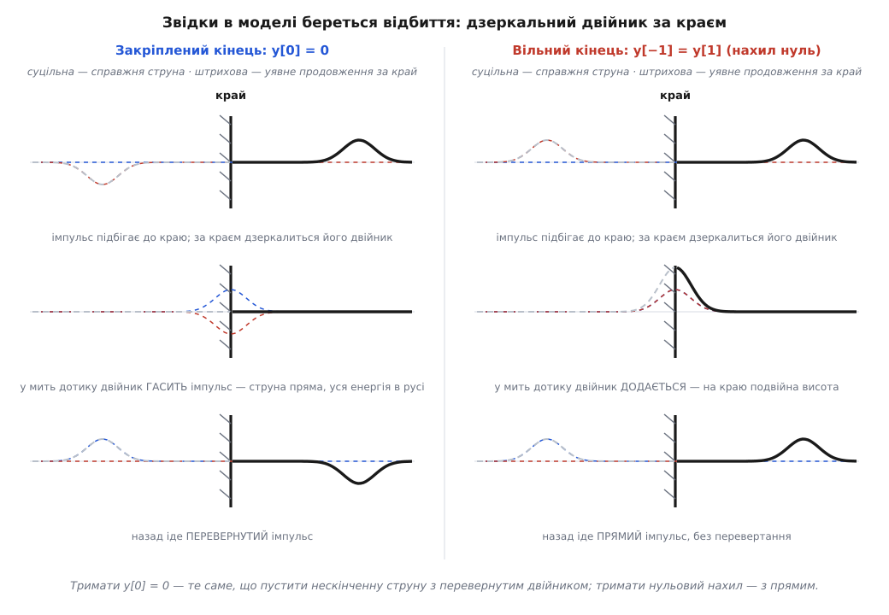

# ⚙️ Хвильове рівняння на сітці: кривина, крок, відбиття

<preknowlist>
- [Ряди Тейлора](topic:math-analysis/taylor-series) — розклад функції поблизу точки в суму доданків з її похідними: f(x+h) = f + f′h + ½f″h² + … На цьому розкладі тримається головний трюк: з трьох сусідніх значень дістати другу похідну й знати, наскільки при цьому збрехали.
- [Чисельне диференціювання](topic:math-numeric/numerical-differentiation) — заміна похідної різницею сусідніх значень і те, чому симетрична різниця точніша за однобічну.
- [Плаваюча кома](topic:hw-arch/floating-point) — числа в комп'ютері зберігаються з відносною похибкою близько 10⁻¹⁶ (double). Ця дрібка стане зерном, з якого нестійка схема виростить катастрофу.
</preknowlist>

Рівняння ∂²y/∂t² = c²·∂²y/∂x² можна не лише розв'язувати на папері, а й **прокрутити**: розрізати струну на вузли, дати кожному вузлові порахувати свою кривину — і струна побіжить сама, кадр за кадром. Нижче — робоча програма на сорок рядків, залізна умова, без якої вона за сотню-другу кроків вибухне до нескінченності, і місце, де в ній самі собою, без жодного рядка «а тепер відбий», народжуються відбиття від закріпленого й вільного кінця.

### Задача

Дано струну довжини L, на якій хвиля біжить зі швидкістю c. У початкову мить ми знаємо про неї дві речі: **форму** y(x, 0) — як її відтягли — і **швидкість** ∂y/∂t(x, 0) — з яким поштовхом відпустили. Кінці або закріплені, або вільні. Треба отримати весь дальший рух: y(x, t) у будь-якій точці й у будь-яку мить.

Готова формула тут виручає лише в тепличних умовах: нескінченна однорідна струна й нічого більше. Щойно з'являються два реальні кінці, змінна вздовж струни густина, загасання, притиснутий палець чи зовнішня сила, — замкненого виразу вже немає. А ще частіше формула є, але з неї нічого не видно: хочеться не символи, а **фільм**, у якому горб біжить, б'ється об порожок і повертається.

Рятує та властивість рівняння, заради якої його й варто було виводити: воно **місцеве**. Щоб знати, що робитиме шматочок струни, не треба знати струну всю — досить того, що коїться просто біля нього. А місцевий закон комп'ютер виконує буквально: посади в кожен вузол по маленькому виконавцеві, хай кожен дивиться лише на двох сусідів — і разом вони відтворять хвилю. Ніякої глобальної системи розв'язувати не доведеться.

### Ідея: кривина — це три сусіди

Уся справа зводиться до одного питання: як вузол, що знає лише три числа — своє значення й два сусідні, — дізнається кривину, тобто ∂²y/∂x²? Відповідь дає розклад Тейлора. Позначмо крок сітки Δx і випишімо, чим є значення в сусідів праворуч і ліворуч:

```
y(x+Δx) = y + y′·Δx + ½·y″·Δx² + ⅙·y‴·Δx³ + (1/24)·y⁗·Δx⁴ + …
y(x−Δx) = y − y′·Δx + ½·y″·Δx² − ⅙·y‴·Δx³ + (1/24)·y⁗·Δx⁴ + …
```

Складімо ці два рядки. Доданки з непарними степенями Δx входять із протилежними знаками й **гинуть**: перша похідна зникає, третя зникає. Лишається:

```
y(x+Δx) + y(x−Δx) = 2y + y″·Δx² + (1/12)·y⁗·Δx⁴ + …
```

Звідси й видобувається кривина:

```
y″ ≈ ( y(x−Δx) − 2y(x) + y(x+Δx) ) / Δx²     похибка ≈ (1/12)·y⁗·Δx²
```

Вираз у чисельнику — **друга різниця**: сусід ліворуч мінус двічі сам плюс сусід праворуч. Читається він просто: наскільки значення в точці нижче (або вище) за середнє двох сусідів. Пряма ділянка — точка лежить рівно посередині між сусідами, різниця нуль; горб — точка вища за середнє, різниця від'ємна. Це і є кривина, дослівно.

Головне тут — те, як загинули непарні доданки. Саме через **симетрію** (беремо сусідів з обох боків порівну) похибка починається аж із Δx², а не з Δx: подрібнили сітку вдвічі — збрехали вчетверо менше. Однобічна різниця такого не вміє.

**Приклад (перевірка на функції з відомою похідною).** Візьмімо y = sin(x) у точці x = 1, де точна друга похідна дорівнює −sin(1) = −0.841471, і порахуймо другу різницю з кроком Δx = 0.1:

```
sin(0.9) + sin(1.1) − 2·sin(1) = 0.783327 + 0.891207 − 1.682942 = −0.008408
−0.008408 / 0.1² = −0.840770        похибка 7.01·10⁻⁴

теорія: (1/12)·y⁗·Δx² = (1/12)·0.841471·0.01 = 7.01·10⁻⁴   ✔
Δx = 0.05  →  похибка 1.75·10⁻⁴   (учетверо менша)
Δx = 0.025 →  похибка 4.38·10⁻⁵   (ще вчетверо)
```

Похибка падає рівно як квадрат кроку й рівно на стільки, скільки провіщає розклад. Цей спосіб — замінити похідні різницями значень у вузлах сітки — і зветься [методом скінченних різниць](topic:math-numeric/finite-difference-method).

Той самий трюк працює й по часу: якщо ми пам'ятаємо стан вузла в дві попередні миті, то

```
∂²y/∂t² ≈ ( y_стар − 2·y + y_нов ) / Δt²
```

де y_нов — те, чого ми ще не знаємо. Підставмо обидві різниці у хвильове рівняння й розв'яжімо його щодо y_нов. Обидва кроки, Δx і Δt, при цьому збираються в один безрозмірний множник c·Δt/Δx — це **число Куранта** r, головна дійова особа всієї подальшої історії:

```
y_нов[i] = 2·y[i] − y_стар[i] + r²·( y[i−1] − 2·y[i] + y[i+1] )
```


*Простір ліворуч-праворуч, час знизу вгору. Щоб дізнатися відхилення вузла в наступну мить, схема бере три його теперішні сусідні значення (сині) і його ж значення кроком раніше (сіре). П'ять чисел, три множення й кілька додавань — і новий стан готовий. Ніякої системи рівнянь розв'язувати не треба: схема **явна**, кожен вузол рахується незалежно від інших, і за це вона згодом візьме плату у вигляді обмеження на Δt.*

Формулу варто прочитати вголос, бо вона майже фізична фраза. Частина 2·y − y_стар — це **рух за інерцією**: якщо вузол за минулий крок піднявся на якусь висоту, то, лишений сам на себе, він за наступний крок підніметься рівно на стільки ж. А доданок r²·(друга різниця) — **поправка від кривини**: вигин штовхає вузол до випрямлення. Прискорення в чистому вигляді, тільки записане в трьох станах замість похідної.

### Робоча програма

Тепер це можна писати. Струна — три масиви чисел (позаминулий стан, теперішній і той, що рахуємо), крок — один прохід по вузлах. Приклад узято живий: сталева струна довжиною 65 см, на якій збурення біжить зі швидкістю 400 м/с; защипуємо її на п'ятій частині довжини на 3 мм і відпускаємо.

:::tabs
```cpp
#include <cstdio>
#include <vector>

enum class End { Fixed, Free };            // закріплений / вільний кінець

struct StringSim {
    std::vector<double> prev, cur, next;   // стани в моменти t−Δt, t, t+Δt
    double r2;                             // (c·Δt/Δx)²
    End left, right;

    StringSim(int nodes, double r, End l, End rt)
        : prev(nodes, 0.0), cur(nodes, 0.0), next(nodes, 0.0),
          r2(r * r), left(l), right(rt) {}

    // старт: фізика дає форму й швидкість, а схемі потрібні ДВА готові стани
    void start(const std::vector<double> &y0, const std::vector<double> &v0, double dt) {
        const int N = static_cast<int>(cur.size()) - 1;
        prev = y0;
        for (int i = 1; i < N; ++i)
            cur[i] = y0[i] + dt * v0[i]
                   + 0.5 * r2 * (y0[i - 1] - 2.0 * y0[i] + y0[i + 1]);   // ПОЛОВИННА поправка
        cur[0] = (left  == End::Fixed) ? 0.0 : y0[0] + dt * v0[0] + r2 * (y0[1] - y0[0]);
        cur[N] = (right == End::Fixed) ? 0.0 : y0[N] + dt * v0[N] + r2 * (y0[N - 1] - y0[N]);
        if (left  == End::Fixed) prev[0] = 0.0;
        if (right == End::Fixed) prev[N] = 0.0;
    }

    void step() {
        const int N = static_cast<int>(cur.size()) - 1;
        for (int i = 1; i < N; ++i)                       // серце моделі
            next[i] = 2.0 * cur[i] - prev[i]
                    + r2 * (cur[i - 1] - 2.0 * cur[i] + cur[i + 1]);

        // закріплений край стоїть; вільний бачить за собою дзеркального сусіда: y[−1] = y[1]
        next[0] = (left  == End::Fixed) ? 0.0
                : 2.0 * cur[0] - prev[0] + 2.0 * r2 * (cur[1] - cur[0]);
        next[N] = (right == End::Fixed) ? 0.0
                : 2.0 * cur[N] - prev[N] + 2.0 * r2 * (cur[N - 1] - cur[N]);

        prev.swap(cur);      // ролі буферів по колу — жодного копіювання масивів
        cur.swap(next);
    }
};

int main() {
    const double c = 400.0, L = 0.65;      // швидкість хвилі (м/с) і довжина струни (м)
    const int    N = 200;                  // проміжків; вузлів N+1
    const double dx = L / N;               // 3.25 мм
    const double r  = 0.9;                 // число Куранта, r ≤ 1 (див. далі)
    const double dt = r * dx / c;          // 7.31 мкс

    StringSim s(N + 1, r, End::Fixed, End::Fixed);

    std::vector<double> y0(N + 1, 0.0), v0(N + 1, 0.0);   // відпускаємо без поштовху
    const double xp = 0.2 * L, h = 0.003;                 // защип: 1/5 довжини, висота 3 мм
    for (int i = 0; i <= N; ++i) {
        const double x = i * dx;
        y0[i] = (x < xp) ? h * x / xp : h * (L - x) / (L - xp);
    }
    s.start(y0, v0, dt);

    const int steps = static_cast<int>(0.01 / dt);        // 10 мс звучання
    for (int n = 0; n < steps; ++n) {
        s.step();
        std::printf("%.6f %+.6e\n", (n + 1) * dt, s.cur[N / 7]);   // «знімач» під струною
    }
    return 0;
}
```
```python
import numpy as np

def start(y0, v0, r2, dt, left="fixed", right="fixed"):
    """Другий стан із форми й швидкості: схемі потрібні ДВА, а фізика дає інше."""
    cur = y0 + dt*v0
    cur[1:-1] += 0.5*r2*(y0[:-2] - 2.0*y0[1:-1] + y0[2:])          # ПОЛОВИННА поправка
    cur[0]  = 0.0 if left  == "fixed" else cur[0]  + r2*(y0[1]  - y0[0])
    cur[-1] = 0.0 if right == "fixed" else cur[-1] + r2*(y0[-2] - y0[-1])
    return cur

def step(prev, cur, nxt, r2, left="fixed", right="fixed"):
    """Один крок за часом; буфери повертаються крутнутими по колу."""
    nxt[1:-1] = 2.0*cur[1:-1] - prev[1:-1] + r2*(cur[:-2] - 2.0*cur[1:-1] + cur[2:])
    # закріплений край стоїть; вільний бачить дзеркального сусіда: y[−1] = y[1]
    nxt[0]  = 0.0 if left  == "fixed" else 2.0*cur[0]  - prev[0]  + 2.0*r2*(cur[1]  - cur[0])
    nxt[-1] = 0.0 if right == "fixed" else 2.0*cur[-1] - prev[-1] + 2.0*r2*(cur[-2] - cur[-1])
    return cur, nxt, prev        # prev←cur, cur←щойно пораховане, nxt←звільнений буфер

c, L, N = 400.0, 0.65, 200       # м/с, м, число проміжків
dx = L / N                       # 3.25 мм
r  = 0.9                         # число Куранта, r ≤ 1 (див. далі)
dt = r * dx / c                  # 7.31 мкс
r2 = r * r

x = np.linspace(0.0, L, N + 1)
xp, h = 0.2*L, 0.003             # защип: 1/5 довжини, висота 3 мм
y0 = np.where(x < xp, h*x/xp, h*(L - x)/(L - xp))
y0[0] = y0[-1] = 0.0
v0 = np.zeros_like(y0)           # відпускаємо без поштовху

prev = y0
cur  = start(y0, v0, r2, dt)
nxt  = np.empty_like(y0)

for n in range(int(0.01 / dt)):  # 10 мс звучання
    prev, cur, nxt = step(prev, cur, nxt, r2)
    print("%.6f %+.6e" % ((n + 1)*dt, cur[N // 7]))     # «знімач» під струною
```
:::

Програма друкує те саме, що бачить звукознімач під справжньою струною: висоту однієї точки в кожну мить. І ось перша перевірка, яку варто зробити обов'язково, — **чи знає модель ноту, якої їй ніхто не казав**. Розкладімо надрукований сигнал у спектр: піки стають на 307.7 Гц та на кратних їй частотах. А теорія для закріпленої з обох кінців струни дає основний тон c/(2L) = 400/1.3 = 307.7 Гц. Ніде в коді немає ні числа π, ні слова «частота» — вузли просто товклися між собою, а на виході з'явилася [стояча хвиля](topic:ph-waves/standing-wave) з правильним тоном і обертонами. Це і є доказ, що модель відтворює фізику, а не малює візерунки.

> 🔧 **Навіщо це.** Той самий цикл із трьох масивів — робоча конячка далеко за межами струн. Фізичне моделювання інструментів у синтезаторах крутить рівно цю схему (тільки з загасанням і з місцем удару молоточка); розрахунок вібрації тросів і трубопроводів — теж вона; ультразвукова дефектоскопія й сейсмічна розвідка «стріляють» модельною хвилею в модельне середовище й дивляться, що повернеться, бо тільки так можна порівняти покази з припущенням про те, що там усередині. Змініть у коді один рядок — і замість струни матимете шар ґрунту.

### Перший крок особливий

У формулі кроку є пастка, яку легко не помітити: щоб порахувати новий стан, потрібні **два** попередні, а фізика дає зовсім інші дані — форму й швидкість в одну-єдину мить. Другий стан треба спорудити самотужки, і зробити це недбало — значить зіпсувати всю модель.

Наївний хід: якщо струну відпустили без поштовху, то в минулу мить вона нібито була такою самою, тож поставмо y_стар = y₀. Швидкість справді вийде нульова — але цей хід мовчки викидає прискорення, яке струна має вже на старті. Правильно взяти той самий розклад Тейлора, тепер по часу, і підставити в нього ∂²y/∂t², узяте з рівняння:

```
y¹ = y⁰ + Δt·v⁰ + ½·Δt²·(∂²y/∂t²) = y⁰ + Δt·v⁰ + ½·r²·( y⁰[i−1] − 2·y⁰[i] + y⁰[i+1] )
```

Уся різниця — множник ½ перед поправкою кривини (за звичайного кроку там одиниця). Ціна недбалості вимірюється просто: пустімо гаусів горб і порівняймо з точною відповіддю через однаковий час.

```
                        крок сітки  →  вдвічі дрібніший  →  ще вдвічі
правильний старт:        1.0·10⁻³        2.5·10⁻⁴           6.2·10⁻⁵    (падає вчетверо)
наївний старт y_стар=y⁰: 5.5·10⁻³        2.9·10⁻³           1.5·10⁻³    (падає вдвічі)
```

Один хибний рядок на старті знижує **порядок точності всієї схеми** з другого до першого: подрібнення сітки перестає окупатися, і скільки б вузлів ви не додали, похибка так і повзтиме вдвічі замість учетверо. Це типова риса таких помилок — програма не падає, картинка правдоподібна, а точність тихо зникла.

Коли перший крок зроблено правильно, модель одразу показує фокус, задля якого варто дивитися на екран: защипнутий горб **сам ділиться навпіл**, і дві половинки роз'їжджаються в різні боки. Ніхто цього не програмував — так виглядає розв'язок д'Аламбера ½f(x−ct) + ½f(x+ct), який схема відтворює з самої лише місцевої арифметики.

### Скільки можна відкусити від часу: умова Куранта

Тепер про плату за простоту. Спробуйте задати в програмі r трохи більше за одиницю — скажімо, 1.05, тобто крок за часом лише на п'ять відсотків більший за «дозволений», — і за пару сотень кроків струна перетвориться на числове сміття з амплітудою 10³⁸. Не «трохи неточно»: катастрофа, з нескінченностями й NaN. Причому стартувати можна з ідеально гладкої синусоїди — вибух усе одно станеться.

Причину видно з простого запитання: **звідки береться відповідь**. Візьмімо точку P на сітці й спитаймо, які початкові дані на неї впливають. Фізика відповідає: сигнал біжить зі швидкістю c, отже за час t до P може дотягтися все, що лежало ближче за c·t — не далі. Схема відповідає інакше: за один крок кожен вузол дізнається щось лише про двох безпосередніх сусідів, тож за n кроків до P доходить звістка щонайбільше з n вузлів ліворуч і праворуч, тобто з відстані n·Δx.


*Сіре — усе, що схема встигає обійти за чотири кроки, вузол за вузлом. Синє — звідки насправді приходить сигнал зі швидкістю c. Ліворуч крок за часом малий, синій конус ховається в сірому: усі дані, потрібні для правильної відповіді в точці P, схема таки побачила. Праворуч крок завеликий — фізичний конус вилазить назовні: відповідь у P залежить від чисел, до яких схема просто не дотяглася. Ніяка арифметика не поверне того, чого не прочитали.*

Звідси й **умова Куранта**: числовий конус мусить накривати фізичний, тобто c·Δt ≤ Δx, або в наших позначеннях r ≤ 1. Порушення її — не «втрата точності», а логічна неможливість: схема не бачила даних, від яких залежить відповідь.

Умову вивели 1928 року в статті «Über die partiellen Differenzengleichungen der mathematischen Physik» (Mathematische Annalen) троє математиків ґеттінґенського кола, і повна її назва — умова Куранта—Фрідріхса—Леві. Ріхард Курант народився 1888 року в Люблінці у Верхній Сілезії (тоді Пруссія, нині Люблінець у Польщі) у єврейській родині й 1933-го мусив залишити Німеччину; Ганс Леві народився 1904 року у Бреслау (нині Вроцлав), теж у єврейській родині, і того ж 1933-го виїхав до США; третім був Курт Фрідріхс. Дата варта того, щоб її завважити: до перших електронних обчислювальних машин лишалося ще майже двадцять років, а межу, за яку не можна заходити крокуючи по сітці, уже знали.

Той самий висновок дає й пряма алгебра, до того ж показує, як саме гине рахунок. Спитаймо, яка форма на сітці найнебезпечніша. Це **пилка** — найкоротша хвиля, яку сітка взагалі здатна тримати: сусідні вузли поперемінно +1, −1, довжина хвилі 2Δx. Її друга різниця максимально велика: (−1) − 2·(+1) + (−1) = −4·y. Підставмо це у крок:

```
y_нов = (2 − 4r²)·y − y_стар
```

Шукаймо розв'язок вигляду y ∝ gⁿ, де g — множник наростання за крок. Виходить квадратне рівняння g² − (2 − 4r²)·g + 1 = 0. Добуток його коренів дорівнює одиниці — а це означає рівно дві можливості: або обидва корені лежать на одиничному колі (нічого не росте, коливається — стійко), або один усередині, а другий **зовні** (щось росте геометрично — вибух). Межа між випадками там, де корені перестають бути комплексними:

```
|2 − 4r²| ≤ 2   ⟺   r² ≤ 1   ⟺   c·Δt ≤ Δx
```

Та сама умова, здобута з іншого боку. Такий підхід — підставити в схему хвилю й подивитися на множник наростання — зветься [аналізом стійкості за фон Нейманом](topic:math-numeric/von-neumann-stability) і працює далеко за межами хвильового рівняння.

Числа роблять картину відчутною. При r = 1.05 корені дорівнюють −1.877 і −0.533: пилка щокроку більшає в 1.877 раза. Це означає, що навіть **похибка заокруглення** — крихта 10⁻¹⁶, яка неминуче сидить у кожному числі з плаваючою комою, — виростає до одиниці за 58 кроків і поглинає всю картину. Ось чому вибух здається безпричинним: у початкових даних пилки не було, її насіяла арифметика.

```
старт: гладенька синусоїда амплітуди 1, обидва кінці закріплені

r = 0.99   через 200 кроків  max|y| = 1.0          (спокійно коливається)
r = 1.00   через 200 кроків  max|y| = 1.0          (межа — усе ще стійко)
r = 1.01   через 200 кроків  max|y| = 1.1·10⁸
r = 1.05   через 100 кроків  max|y| = 5.3·10¹⁰
r = 1.05   через 200 кроків  max|y| = 9.8·10³⁷
```

Практична сторона умови — це ціна. Для нашої струни (L = 0.65 м, c = 400 м/с, 200 проміжків) вона дає:

```
Δx = 0.65 / 200 = 3.25 мм
Δt ≤ Δx / c = 0.00325 / 400 = 8.125 мкс
на 1 секунду звучання: 1 / 8.125·10⁻⁶ ≈ 123 000 кроків
```

Зверніть увагу на неприємну арифметику: подрібнили сітку вдвічі — Δx удвічі менший, отже й Δt мусить стати вдвічі меншим. Робота росте **вчетверо**: удвічі більше вузлів, помножити на вдвічі більше кроків. Точність купується квадратом ціни.

І нагорода тим, хто дійшов до самої межі. Покладімо r = 1 рівно. Тоді r² = 1, і формула кроку згортається в

```
y_нов[i] = y[i−1] + y[i+1] − y_стар[i]
```

Жодного множення — саме додавання й віднімання. Мало того, ця схема **точна**: похибка після сотні кроків тримається на рівні 10⁻¹⁵, тобто на рівні заокруглення, тоді як при r = 0.5 вона становить 10⁻³. Причина глибша за везіння: при c·Δt = Δx діагоналі сітки збігаються з характеристиками x ∓ c·t = const, уздовж яких форма й переноситься незмінною, — схема просто пересуває значення так, як велить д'Аламбер. Правда, диво це суто одновимірне: у двох вимірах межа стягується до Δt ≤ Δx/(c·√2), а точності на межі вже не буде.

### Відбиття народжується саме

Найприємніше в цій моделі те, що відбиття в ній ніхто не програмує. Кінці задають однією умовою, а перевертання хвилі, подвоєння амплітуди на вільному краї й повернення імпульсу назад виходять самі — і зрозуміти чому вартує окремої хвилини.

**Закріплений кінець** — це рядок `y[0] = 0` у кожну мить. Чому з нього виходить саме перевернуте відбиття? Погляньмо на це як на дзеркало. Уявімо, що струна насправді нескінченна, і за краєм живе **двійник** нашої хвилі: та сама форма, віддзеркалена по горизонталі й **перевернута** догори низом. Така антисиметрична пара має чудову властивість — у точці дзеркала сума двох її половин тотожно дорівнює нулю, завжди й сама собою. Отже, тримати вузол нулем — те саме, що пустити нескінченну струну з перевернутим двійником. А коли двійник добігає до дзеркала й проходить далі, у наш бік іде саме він — той самий імпульс, тільки перевернутий. Ось і все відбиття.

**Вільний кінець** — це кінець, який ні за що не тримається (уявіть колечко, що вільно ковзає по гладкому стрижні). Такий край не може тягнути струну впоперек, а поперечна тяга береться з нахилу — отже нахил на краю мусить бути нульовим: ∂y/∂x = 0. На сітці нульовий нахил означає, що **уявний вузол за краєм повторює першого сусіда**: y[−1] = y[1]. Підставмо цього привида у звичайну формулу кроку — друга різниця для крайнього вузла стає 2·(y[1] − y[0]), і виходить рядок, який уже стоїть у програмі. Дзеркало цього разу пряме, без перевертання, тож і відбитий імпульс повертається прямим.


*Ліворуч закріплений кінець, праворуч вільний. Штрихові криві — справжній імпульс і його двійник за краєм; жирна — те, що насправді бачить струна, тобто їхня сума. Угорі імпульс лише підбігає. Посередині — мить дотику: у закріпленому випадку двійник гасить імпульс дощенту, і струна на мить стає **прямою** (уся енергія в цю мить кінетична, у русі); у вільному — навпаки, додається, і на краю виростає подвійна висота. Унизу видно, хто пішов назад: перевернутий імпульс ліворуч, прямий праворуч.*

Мить у центрі малюнка варта уваги окремо: закріплена струна в момент відбиття справді розпростується в пряму лінію. Не зникає — просто в цю мить у неї нема жодного вигину, зате всі точки біля краю летять із максимальною швидкістю. Модель показує це без жодних додаткових зусиль.

Третій корисний варіант краю — **ніякого краю**: коли треба вдати, ніби струна триває нескінченно, і хвиля має піти й не повернутися. У точці r = 1 рецепт зворушливо простий:

```
y_нов[0] = y[1]        (тільки при r = 1: край просто «зсуває» хвилю за межу)
```

Для довільного r той самий сенс дає формула Мура — вона переносить не значення, а **однобічну хвилю**, що йде назовні:

```
y_нов[0] = y[1] + ((r − 1)/(r + 1))·( y_нов[1] − y[0] )
```

Перевірка на імпульсі одиничної висоти: залишкове відбиття від такого краю — 1.8·10⁻⁴, тобто хвиля йде практично без сліду. Для порівняння, наївний варіант «просто зсунути» при r = 0.5 відбиває назад третину амплітуди — приблизність, яку легко проґавити на око.

### Складність і пастки

- **Ціна.** Один крок коштує O(N) — по кілька дій на вузол. Але число кроків диктує умова Куранта: подрібнили сітку вдвічі, і кроків стало вдвічі більше, тож на однакову модельну тривалість ціна росте як **O(N²)** в одному вимірі й як O(N^(d+1)) у d вимірах — у тривимірній задачі подрібнення сітки вдвічі коштує **шістнадцятикратної** роботи. Для нашої струни: 100 проміжків — 6 мільйонів оновлень вузла на секунду звучання, 200 — 25 мільйонів, 800 — 400 мільйонів. Тому в схемах на сітці економлять не на кількості дій у циклі, а на кількості вузлів.
- **Числова дисперсія.** Підставивши в схему хвилю A·sin(k·x − ω·t), дістанемо її власне дисперсійне співвідношення: sin(ω·Δt/2) = r·sin(k·Δx/2). При r = 1 воно дає ω = c·k для **всіх** довжин хвиль, а от при r < 1 короткі хвилі біжать повільніше за довгі — сітка сама, без жодної фізики, стає дисперсним середовищем. Виміряно: при r = 0.5 хвиля, на яку припадає 10 вузлів, іде на 1.24 % повільніше за належне, на 20 вузлів — на 0.31 %, а на 5 вузлів — уже на 5 %. Для струни це чується: обертони виходять заниженими, тембр «пливе». Тому правило — щонайменше 20 вузлів на найкоротшу хвилю, яка вас цікавить, або чесний r = 1. Не переплутайте цю хворобу з [дисперсією справжнього середовища](topic:ph-electromagnetism/phase-group-velocity): тут вона артефакт сітки й зникає з її подрібненням.
- **Енергія як детектор помилок.** Схема має точний збережуваний вираз — дискретну енергію, у якій потенційна частина хитро бере добуток нахилів із **двох** сусідніх станів:

  ```
  E = ½·μ·Δx·Σ ((y[i] − y_стар[i])/Δt)²  +  ½·(T/Δx)·Σ (y[i+1] − y[i])·(y_стар[i+1] − y_стар[i])
  ```

  За 4000 кроків ця сума тримається з відносним дрейфом 3·10⁻¹⁵ — тобто рівно на рівні заокруглення. Тому [закон збереження енергії](topic:ph-mechanics/energy-conservation) тут не філософія, а тест: якщо E повзе, у вас помилка, і найчастіше саме на краю. І ще одна деталь, від якої стійкість стає остаточно зрозумілою: при r ≤ 1 обидва доданки невід'ємні, тож стала сума **обмежує** амплітуду — рости просто нема за що. При r = 1.05 вираз усе ще зберігається, але його частини розбігаються в різні боки: після 120 кроків кінетична дорівнює +4.2·10³⁵, а потенційна −4.2·10³⁵. Збереження лишилося, а обмеження зникло.
- **Три буфери, ролі по колу.** Ніколи не копіюйте масиви між кроками — міняйте вказівники (`swap` у C++, повернення трійки в Python). Копіювання N чисел щокроку подвоює роботу циклу, який і так упирається в пам'ять, а не в арифметику. З тієї ж причини не створюйте новий масив на кожній ітерації: три буфери виділяються один раз назавжди.
- **double, не float.** Схема робить сотні тисяч кроків, і кожен підсипає крихти заокруглення — те саме зерно, з якого росте пилка. У float ці крихти майже в мільярд разів більші (10⁻⁷ проти 10⁻¹⁶), тож запас до неприємностей відповідно менший, а накопичена похибка помітна вже на слух. Купити за це можна щонайбільше дворазове прискорення: цикл упирається в пропускну здатність пам'яті, а float удвічі легший. Обмін поганий — якщо вже економити, то на кількості вузлів, а не на розрядності.
- **Загасання доводиться додавати руками.** Ідеальна модель дзвенить вічно, справжня струна — секунди. Найдешевший спосіб — доданок 2σ·∂y/∂t у рівнянні, після дискретизації симетричною різницею по часу він дає:

  ```
  y_нов = [ 2·y − (1 − σ·Δt)·y_стар + r²·(друга різниця) ] / (1 + σ·Δt)
  ```

  Коефіцієнт σ (1/с) задає, за скільки згасне звук: амплітуда падає як e^(−σt).
- **Змінна швидкість — крок диктує найгірша комірка.** Якщо c залежить від x (шарувате середовище, струна змінної товщини), умова Куранта мусить виконуватися **в кожній комірці окремо**: Δt ≤ min(Δx/c) по всій сітці. Одна пара «дрібна комірка й велика швидкість» сповільнює рахунок усієї моделі. Звідси й правило згущення: сітку дрібнять там, де швидкість **мала** (там хвилі коротші й вузлів треба більше), а там, де вона велика, лишають грубою — інакше найдорожчою стане саме найшвидша ділянка.
- **Гострий старт — гарантовані брижі.** Защипнутий трикутник має злам, а злам — це сума хвиль аж до найкоротшої, 2Δx, тобто якраз тих, які сітка передає найгірше. За зламом побіжить хвіст дрібних коливань — не фізика, а числова дисперсія в чистому вигляді. Хочете чистої картинки — згладьте початкову форму або подрібніть сітку саме там.
