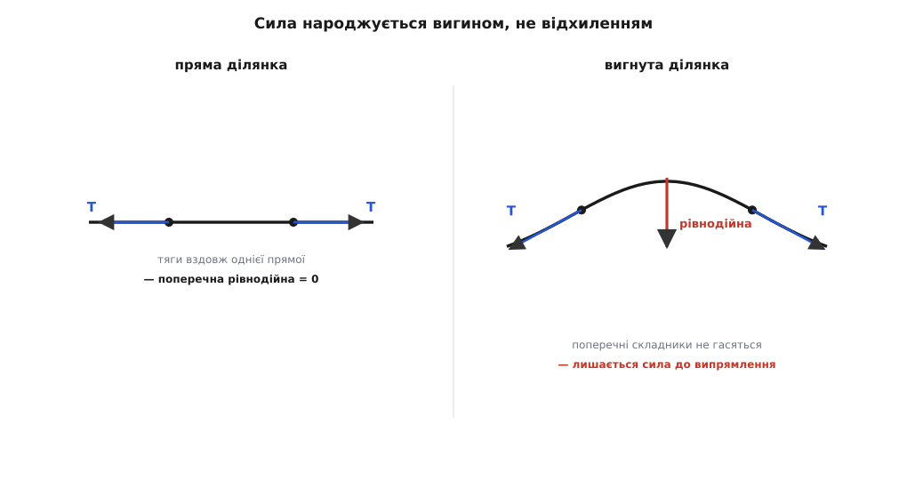
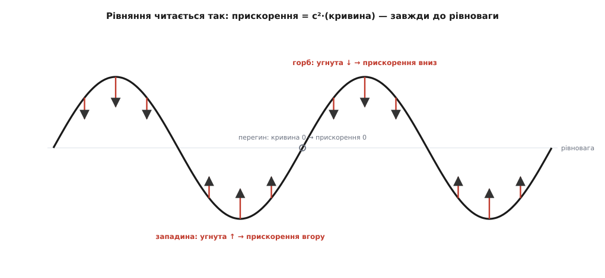
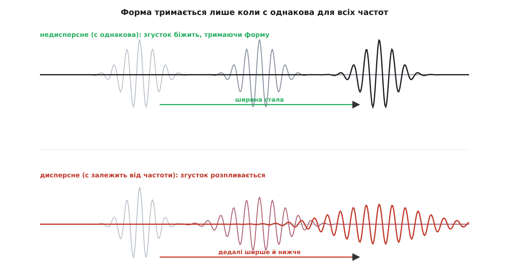

# Хвильове рівняння: чому збурення біжить, тримаючи форму

<preknowlist>
- [Похідна](topic:math-analysis/derivative) — миттєва швидкість зміни величини; усе рівняння побудоване на похідних відхилення по часу й по координаті.
- [Другий закон Ньютона](topic:ph-mechanics/newtons-second-law) — маса · прискорення = сила; саме його ми прикладаємо до кожного шматочка середовища.
- [Синусоїда](topic:ph-waves/sine-wave) — що таке хвиля як біжуче збурення і синус як її найпростіша форма.
- [Амплітуда й частота](topic:ph-waves/amplitude-frequency) — висота коливання, скільки разів на секунду воно повторюється і що таке довжина хвилі.
</preknowlist>

Защипніть гітарну струну — і горбик, який ви зробили пальцем, не лишиться на місці й не осяде тихо там, де був. Він **побіжить** до порожка, відіб'ється, побіжить назад. Ляпніть у долоні — і за третину секунди звук долетить до стіни за десять метрів, ані на мить не завагавшись у виборі швидкості. Кинутий у воду камінець розсилає кола, що розходяться рівним, визначеним темпом. У всіх трьох випадках коїться те саме диво, до якого ми так звикли, що перестали його помічати: локальне збурення середовища **само собою мандрує** крізь простір — з певною сталою швидкістю і, поки середовище спокійне, майже не міняючи форми.

Чому? Що змушує горбик тікати, а не стояти? Звідки береться саме **ця** швидкість, а не вдвічі більша чи менша? І чому форма зберігається — адже здавалося б, розповзтися й розмитися куди природніше? Відповідь на всі три питання дає одне-єдине рівняння, і воно варте того, щоб вивести його на власні очі, а не приймати готовим. Бо це рівняння не про хвилі — воно виявиться просто **другим законом Ньютона, записаним для суцільного середовища**, а хвилі виваляться з нього як неминучий наслідок.

### Найпростіше середовище — натягнута струна

Щоб зрозуміти механізм, візьмімо середовище, простіше нікуди: туго натягнуту струну. У ній є рівно дві фізичні речі, і обидві прості. По-перше, струна має **масу** — кожен її сантиметр щось важить; позначмо масу на одиницю довжини через μ (лінійна густина, кг/м). По-друге, струну **натягнуто** — уздовж неї діє сила натягу T, що тягне кожну ділянку в обидва боки вздовж струни. Більше нічого; жодних пружин, жодних додаткових деталей. Побачимо, що цих двох речей — інерції та натягу — вистачає, щоб народити хвилю.

Тепер придивімося до крихітного шматочка струни й запитаймо: яка **сила** на нього діє впоперек, тобто в напрямку, у якому струна відхиляється? Коли струна лежить прямо, натяг тягне шматочок ліворуч і праворуч однаково сильно й точно вздовж однієї прямої — дві тяги гасять одна одну, поперечної сили нема, шматочок спочиває. Оце ключ: **поки струна пряма, вона в рівновазі**. Аби виникла сила, струна мусить бути **вигнута**.


*Ліворуч струна пряма: натяг T на обох кінцях шматочка тягне точно вздовж однієї прямої, поперечні складники нульові, рівнодійна нуль. Праворуч шматочок вигнутий: кінці нахилені по-різному, тож поперечні складники двох тяг уже не гасяться — лишається рівнодійна, спрямована туди, куди «хоче» випрямитися струна. Що крутіший вигин, то більша ця повертальна сила.*

Придивімося до вигнутого шматочка уважніше. Натяг на лівому кінці тягне вздовж струни назад-униз, на правому — вперед-угору; сили однакові за величиною (T), але **напрямлені по-різному**, бо струна на кінцях шматочка нахилена неоднаково. Горизонтальні складники цих двох тяг майже гасяться (при невеликому відхиленні вони обидва майже T), а от **поперечні складники не гасяться** — саме їхня різниця й дає рівнодійну поперек. І ось найважливіше: ця різниця залежить не від того, наскільки струна відхилена, а від того, наскільки **по-різному нахилені** її кінці — тобто наскільки струна на цій ділянці **вигнута**. Пряма ділянка (нахили однакові) сили не дає, хай як високо її піднято; крута дуга (нахили різняться сильно) дає велику силу. **Повертальна сила породжується вигином, кривиною — не самим відхиленням.** Це серце всієї справи.

### Складаємо рівняння: F = ma для шматочка

Переведімо це в числа. Тут з'являється тонкість: відхилення струни y — величина, що залежить **від двох речей одразу**: від того, **де** вздовж струни ми дивимося (координата x), і **коли** ми дивимося (час t). Тому й похідні бувають двоякі, і їх треба розрізняти.

Похідна по часу, яку пишуть ∂y/∂t, — це знайома миттєва швидкість зміни, але взята для **одного застиглого шматочка**: тримаємо x сталим (стежимо за фіксованою точкою струни) і питаємо, як швидко саме вона рухається вгору-вниз. Друга похідна по часу ∂²y/∂t² — це, отже, **прискорення** цього шматочка, те саме прискорення, що входить у закон Ньютона. Похідна по координаті ∂y/∂x — навпаки: застигаємо **час** (робимо миттєвий знімок усієї струни) і питаємо, як форма змінюється вздовж струни, тобто її **нахил** у цій точці. А друга похідна по координаті ∂²y/∂x² — це швидкість зміни нахилу, тобто саме **кривина**, про яку ми щойно говорили. Кручений символ ∂ (замість звичного d) лише нагадує: змінних дві, і ми беремо похідну по одній, іншу тримаючи застиглою — це [частинна похідна](topic:math-analysis/partial-derivative).

Тепер зберемо силу. Ми з'ясували: поперечна рівнодійна на шматочок пропорційна різниці нахилів на його кінцях. Різниця нахилів на проміжку Δx — це якраз (швидкість зміни нахилу) · Δx, тобто ∂²y/∂x² · Δx. Кожен нахил натяг перетворює на силу з коефіцієнтом T, тож поперечна рівнодійна:

```
F = T · ∂²y/∂x² · Δx
```

З іншого боку, у того ж шматочка є маса μ·Δx і прискорення ∂²y/∂t². Другий закон Ньютона — маса · прискорення = сила — велить:

```
(μ · Δx) · ∂²y/∂t²  =  T · ∂²y/∂x² · Δx
```

Довжина шматочка Δx стоїть з обох боків і скорочується — і це прекрасно, бо означає, що рівняння не залежить від того, на які шматочки ми подумки нарізали струну; воно правдиве в кожній точці. Лишається:

```
∂²y/∂t²  =  (T / μ) · ∂²y/∂x²
```

Комбінація T/μ має розмірність квадрата швидкості (сила натягу, поділена на масу-на-довжину, дає м²/с²), тож позначмо її c² = T/μ. Дістаємо **хвильове рівняння** в його чистому вигляді:

```
∂²y/∂t²  =  c² · ∂²y/∂x²
```

Один короткий рядок — а в ньому весь механізм. Уся строга версія цього виведення, з точним розкладом складників натягу при малих кутах, — у [математичній вставці про струну](topic:ph-waves/wave-equation/math-string-derivation.md).

> 🔧 **Навіщо це.** Формула c² = T/μ — це не абстракція, а щоденний інструмент кожного, хто має справу зі струнами, тросами й мембранами. Гітарний майстер підкручує кілок — збільшує T — і частота росте як √T; басова струна товща (більше μ) — і тон нижчий. Інженер, що напинає ванту мосту чи трос лінії електропередач, рахує швидкість хвилі вздовж неї, щоб знати, як швидко збурення від пориву вітру пробіжить прогоном. У всіх цих випадках працює та сама здобута з F = ma рівність.

**Приклад (швидкість хвилі на струні).** Сталева струна натягнута силою T = 80 Н і має лінійну густину μ = 0.5 г/м = 0.0005 кг/м. З якою швидкістю по ній біжить збурення?

```
c = √(T / μ) = √(80 / 0.0005) = √160000 = 400 м/с
```

Защипнутий на такій струні горбик мчить туди-сюди зі швидкістю 400 метрів за секунду — швидше за пасажирський літак. Ослабте натяг удвічі — і швидкість упаде в √2 разів, до 283 м/с; а візьміть струну вчетверо важчу — і вона стане вдвічі меншою, 200 м/с. Швидкість цілком визначено **самим середовищем**, а не тим, як сильно чи слабко ви щипнули.

### Що каже рівняння: кривина породжує прискорення

Тепер, коли рівняння перед нами, прочитаймо його не як формулу, а як фізичне речення. Ліворуч — прискорення шматочка. Праворуч — кривина струни в цій точці (помножена на c²). Рівняння каже дослівно: **кожен шматочок прискорюється пропорційно до того, наскільки в цьому місці вигнута струна, і в бік випрямлення.**


*Знімок струни в одну мить. Під горбом струна угнута донизу (кривина від'ємна) — прискорення тягне його вниз, до рівноваги. Під западиною струна угнута вгору (кривина додатна) — прискорення штовхає вгору. Там, де струна на мить пряма (точки перегину), кривина нульова й прискорення нуль. Прискорення скрізь бореться проти вигину — і саме ця боротьба жене горб уперед.*

Простежмо, як із цього народжується біг. Уявімо самотній горб. Його вершина угнута донизу, отже прискорюється вниз — вершина осідає. Але передній схил горба теж вигнутий, тільки з'єднує вершину з рівним місцем попереду — і рівняння велить сусіднім, ще спокійним шматочкам попереду **почати підійматися**. Виходить, що поки задня частина горба опадає, попереду виростає новий горб. Збурення не стоїть — воно **перетікає вперед**: середовище раз у раз відтворює форму трохи далі, ніж вона була мить тому. Інерція шматочка не дає йому спинитися точно на рівновазі — він її **перелітає**, і естафета вигину передається далі. Ось звідки береться рух: не якась «сила, що штовхає хвилю», а невпинна місцева гра «кривина → прискорення → нова кривина трохи далі».

> ⚙️ **Алгоритмічна вставка:** [Хвильове рівняння на сітці: кривина, крок, відбиття](topic:ph-waves/wave-equation/proj-wave-sim.md) — як прокрутити це рівняння чисельно: розбити струну на вузли, у кожному порахувати кривину як (сусід ліворуч − 2·сам + сусід праворуч), звідси прискорення й наступний стан; чому крок за часом не можна робити задовгим (умова стійкості Куранта c·Δt ≤ Δx) і як у самій моделі народжуються відбиття від закріпленого й вільного кінців.

### Що таке c: жорсткість проти інерції

Погляньмо ще раз на c² = T/μ і завважмо його будову. У чисельнику — натяг T, тобто **міра того, як сильно середовище опирається деформації** й тягне назад до рівноваги: це його пружна жорсткість. У знаменнику — μ, **міра інерції**, того, як неохоче середовище прискорюється. Хвиля — це вічна суперечка цих двох: жорсткість намагається випрямити вигин якнайшвидше, інерція гальмує. Швидкість хвилі — компроміс між ними:

```
c² = жорсткість / інерція
```

І це не примха струни, а **універсальний закон усіх механічних хвиль**. Що конкретно стоїть у чисельнику й знаменнику — залежить від середовища, але будова завжди та сама: повертальна пружність, поділена на інерцію. Причина глибока — саме тому, що повертальна сила пропорційна деформації (це [пружний відгук на зразок закону Гука](topic:ph-mechanics/hookes-law)), рівняння виходить лінійним, з тими самими другими похідними; змінюється лише коефіцієнт.

Найкрасивіше цей закон показує себе на **звуку**. Звук — це теж хвиля, тільки середовище тут повітря, «відхилення» — місцеве згущення й розрідження, повертальна пружність — **тиск** (стисніть повітря — воно відштовхнеться), а інерція — його **густина** ρ. Тож для звуку c² = K/ρ, де K — модуль об'ємної пружності, міра того, наскільки газ опирається стисканню. І тут ховається одна з найповчальніших історій фізики.

**Приклад (швидкість звуку: помилка Ньютона й поправка Лапласа).** Ісаак Ньютон у «Началах» (1687) перший спробував порахувати швидкість звуку з цієї ідеї. Він узяв за міру пружності просто атмосферний тиск P (вважаючи, що температура повітря під час стискання встигає вирівнятися — ізотермічне стискання). За нормальних умов (P = 101325 Па, ρ = 1.293 кг/м³ при 0 °C):

```
c_Ньютон = √(P / ρ) = √(101325 / 1.293) = √78364 ≈ 280 м/с
```

А виміряна швидкість звуку при 0 °C — **331 м/с**. Ньютон схибив на добрих 15 %, і цілих сто тридцять років ніхто не знав чому. Розгадав П'єр-Симон Лаплас (фр. Pierre-Simon Laplace): стискання й розрідження в звуковій хвилі **надто швидкі**, тепло не встигає перетекти з нагрітих згущень у охолоджені розрідження. Тому повітря стискається не ізотермічно, а **адіабатично** (гр. *adiábatos* — непрохідний, крізь який не проходить тепло) — і виходить **жорсткішим**, ніж думав Ньютон, рівно в γ разів, де γ ≈ 1.4 для повітря. Правильна пружність — це γ·P:

```
c_Лаплас = √(γ · P / ρ) = √(1.4 · 101325 / 1.293) = √109710 ≈ 331 м/с
```

Точно виміряне значення. Уся різниця між невдачею й перемогою — у тому, яку саме «жорсткість» підставити в c² = жорсткість/інерція. Це чудовий доказ, що хвильове рівняння не описує звук приблизно чи метафорично — воно передбачає його швидкість **до метра за секунду**, щойно правильно розпізнати пружність середовища.

### Розв'язок д'Аламбера: будь-яка форма біжить

Ми вивели рівняння з механіки. Але звідки певність, що його розв'язки — це справді хвилі, що біжать зі швидкістю c, тримаючи форму? Це треба **побачити з самого рівняння**, і тут криється, мабуть, найелегантніший момент усієї теми.

Спитаймо просто: яка функція y(x, t) задовольнить ∂²y/∂t² = c²·∂²y/∂x²? Спробуймо здогад, підказаний самою ідеєю бігу. «Горб, що біжить праворуч зі швидкістю c, не міняючи форми» — це означає, що в мить t картина така сама, як була в мить 0, тільки зсунута праворуч на відстань c·t. Математично будь-яка така картина записується як функція **не окремо від x і t, а від їхньої комбінації** x − c·t:

```
y(x, t) = f(x − c·t)
```

Хоч би яка була форма f, ця конструкція описує саме її, що жорстко котиться праворуч: точка, де аргумент x − c·t дорівнює, скажімо, нулю, з плином часу зсувається праворуч рівно так, щоб x встигав за c·t. Перевірмо, чи це розв'язок. Диференціюючи двічі за правилом [ланцюгового диференціювання](topic:math-analysis/chain-rule) — по часу вилазить множник (−c) двічі, по координаті множник 1 двічі:

```
∂²y/∂t² = c² · f″(x − c·t)
∂²y/∂x² =      f″(x − c·t)
```

Підставляємо в рівняння: ліворуч c²·f″, праворуч c²·f″ — **тотожність**. Рівняння виконано, і причому для **будь-якої** двічі диференційовної форми f. Це і є відповідь на початкову загадку, і вона приголомшлива: хвильове рівняння дозволяє біжучою бути **яку завгодно** форму — гострий пік, пологий горб, цілий музичний акорд, — і кожна з них котиться незмінно зі швидкістю c. Форма зберігається не випадково: вона **зашита в саме рівняння**.

Так само легко перевірити, що g(x + c·t) — розв'язок, який біжить **ліворуч**. А оскільки рівняння лінійне, сума двох розв'язків знову розв'язок. Тож найзагальніша одновимірна хвиля — це

```
y(x, t) = f(x − c·t) + g(x + c·t)
```

сума двох незалежних збурень, що біжать назустріч одне одному, кожне зі своєю формою. Цей результат — першу загальну відповідь для струни — 1747 року здобув Жан ле Рон д'Аламбер (фр. Jean le Rond d'Alembert), французький математик; його ім'ям і зветься ця формула. То був історичний момент: **перше в історії диференціальне рівняння в частинних похідних**, розв'язане в загальному вигляді, — і воно ж запустило гарячу піввікову суперечку про те, що взагалі можна вважати законною «формою» коливання. Як народилося це рівняння і чим скінчилася суперечка — у [історичній вставці про д'Аламбера й струну](topic:ph-waves/wave-equation/hist-dalembert-string.md).


*Угорі: та сама форма f у три послідовні миті, щоразу зсунута праворуч рівно на c·Δt — вона біжить, не розпливаючись, бо залежить лише від комбінації x − c·t. Унизу: найзагальніший розв'язок — накладені правобіжна f(x − c·t) і лівобіжна g(x + c·t); саме так відбита від краю хвиля співіснує з набігаючою.*

### Синуси — природні розв'язки, і звідки береться зв'язок ω з k

Серед усіх форм f одна особлива — **синусоїда**. Не тому, що інші заборонені — годиться будь-яка форма, — а тому, що синус є «атомом», з якого можна скласти всі решта. Підставмо в рівняння біжучий синус з амплітудою A, просторовою частотою k (скільки радіанів фази набігає на метр — так званий хвильовий вектор) і часовою частотою ω (скільки радіанів на секунду):

```
y(x, t) = A · sin(k·x − ω·t)
```

Двічі диференціюємо: по часу з'являється (−ω)² = ω², по координаті (−k)² = k²:

```
∂²y/∂t² = −ω² · y
∂²y/∂x² = −k² · y
```

Хвильове рівняння ∂²y/∂t² = c²·∂²y/∂x² перетворюється на −ω²·y = c²·(−k²)·y, тобто, скоротивши y:

```
ω = c · k
```

Це **дисперсійне співвідношення** — стисла умова, за якої синус узагалі є розв'язком рівняння. Вона каже: частота й хвильовий вектор не вільні, вони жорстко зв'язані швидкістю c. Звідси швидкість, з якою біжить гребінь синуса (фазова швидкість), — це ω/k = c, та сама для **всіх** частот. Ось чому складна форма тримається купи: вона є сумою багатьох синусів (це [ідея Фур'є](topic:math-analysis/fourier-idea)), і якщо всі вони біжать з однаковою швидкістю c, то й уся сума їде як єдине ціле, не розсипаючись. А складати розв'язки нам вільно саме тому, що рівняння лінійне, — це [принцип суперпозиції хвиль](topic:ph-waves/wave-superposition) у дії: сума двох дозволених хвиль знову дозволена.

І тут коло замикається красиво. Особливий випадок суми — **дві однакові синусоїди, що біжать назустріч** (f і g однакової форми): вони складаються у [стоячу хвилю](topic:ph-waves/standing-wave), візерунок, що не біжить, а дзвенить на місці з нерухомими вузлами. Саме такі стоячі хвилі й звучать у закріпленій з обох кінців струні, задаючи ноту та її обертони. Тобто вся музика струни — це хвильове рівняння, розв'язане за умови «кінці нерухомі».

### Коли форма не тримається: дисперсія

Уся ця краса — рівна швидкість для всіх частот, збережена форма — трималася на тому, що в c² = T/μ **немає частоти**: коефіцієнт той самий для повільних і швидких коливань. Так буває в ідеальній гнучкій струні та в звичайному повітрі. Але не завжди. У справжньої струни є **власна жорсткість на згин** (як у прута), і вона додає в рівняння зайвий член, від якого c починає залежати від частоти: високі гармоніки біжать трохи швидше за низькі. Те саме коїться зі світлом у склі, з радіохвилею у хвилеводі, з хвилями на глибокій воді.

Наслідок серйозний: якщо різні синуси в складі імпульсу біжать з **різними** швидкостями, то, розпочавши разом, вони поступово розповзаються — імпульс **розпливається**, втрачаючи форму. Це явище зветься **дисперсією** (лат. *dispersio* — розсіювання). Саме через неї короткий світловий спалах, пройшовши кілометри оптичного волокна, приходить розмазаним, і саме з нею борються, проєктуючи лінії зв'язку. Тонку різницю між швидкістю окремого гребеня й швидкістю всього згустка розбирає тема [фазової та групової швидкості](topic:ph-electromagnetism/phase-group-velocity). Для нас же головне ось що: «збереження форми» — не безумовний закон, а привілей середовищ, де c не залежить від частоти; щойно залежить — рівняння ускладнюється, і форма розпадається.


*Угорі (недисперсне середовище, c однакова для всіх частот): згусток біжить праворуч, зберігаючи форму, — усі його синуси-складники йдуть в ногу. Унизу (дисперсне середовище, c залежить від частоти): ті самі складники розходяться швидкостями, і компактний спершу згусток дедалі ширшає й розмивається. Збереження форми тримається лише на однаковій швидкості.*

### Від струни до простору: три виміри й універсальність

Струна одновимірна, тож у рівнянні одна просторова похідна. У повітрі, воді чи товщі землі збурення поширюється в усіх напрямках, і тим самим міркуванням — F = ma для кубика середовища — дістаємо тривимірне рівняння, де замість однієї другої похідної стоїть сума трьох, по кожній осі:

```
∂²u/∂t²  =  c² · ( ∂²u/∂x² + ∂²u/∂y² + ∂²u/∂z² )
```

Цю суму других похідних по всіх напрямках позначають ∇²u й звуть **лапласіаном**; він міряє, наскільки значення в точці відхиляється від середнього по її сусідству — та сама «кривина», тільки об'ємна. Той самий оператор ∇² керує й статичними полями в [рівнянні Лапласа](topic:math-analysis/laplace-equation). У трьох вимірах з'являються нові форми — сферичні хвилі, що розходяться від точкового джерела; їхня амплітуда спадає як 1/r, бо енергія розмазується по дедалі більшій сфері, і саме тому далекий грім тихіший за близький.

І ось найширший висновок. Ми виводили рівняння з натягу струни — але в кінцевій формі ∂²u/∂t² = c²·∇²u немає ані натягу, ані струни, ані навіть речовини. Лишилася гола структура: **друга похідна по часу дорівнює c², помноженому на просторову кривину**. Тому те саме рівняння виринає скрізь, де є інерція й повертальна пружність, — для звуку в повітрі, для сейсмічних хвиль у надрах, для брижів на воді. І навіть там, де ніякого механічного середовища немає: [електромагнітна хвиля](topic:ph-electromagnetism/em-wave) — світло, радіо — підкоряється точнісінько такому ж рівнянню, яке Максвелл вивів зі своїх законів для полів, а c там виявилося швидкістю світла. Хвильове рівняння — це не факт про струни чи повітря, а **форма-шаблон**, у яку природа раз у раз відливає поширення збурень.

---

Отже, **хвильове рівняння** ∂²y/∂t² = c²·∂²y/∂x² — це другий закон Ньютона, прикладений до кожного шматочка суцільного середовища: маса шматочка на його прискорення (∂²y/∂t²) дорівнює повертальній силі, яка породжується не відхиленням, а **кривиною** (∂²y/∂x²). Коефіцієнт c² = жорсткість/інерція визначає швидкість збурення й для струни (T/μ), і для звуку (K/ρ, з адіабатичною пружністю Лапласа), і для світла. Розв'язок д'Аламбера f(x − c·t) + g(x + c·t) показує, чому збурення біжить зі сталою швидкістю, тримаючи форму: це зашито в рівняння, і будь-яка форма годиться. А те, що форма зберігається лише коли c не залежить від частоти (інакше — дисперсія й розпливання), і що з простих синусів-розв'язків, складених за принципом суперпозиції, будується все інше — стоячі хвилі, обертони струни, звук, — робить це коротке рівняння коренем усієї фізики коливань і хвиль.
