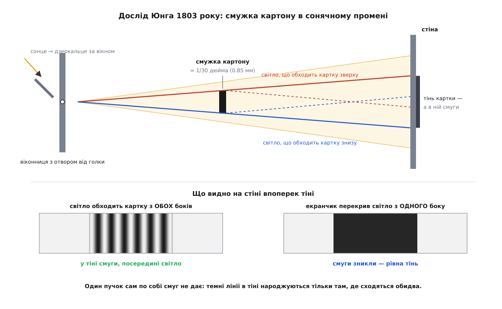
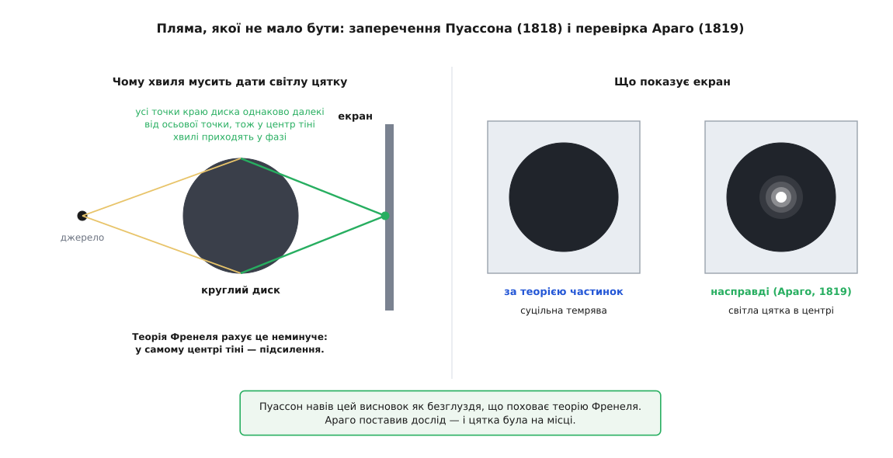

# 📜 Смуги в тіні картки: як народився доказ, що світло — хвиля

24 листопада 1803 року лондонський лікар Томас Юнг (Thomas Young, 1773–1829) доповів Королівському товариству, що поклав у сонячний промінь смужку картону завширшки з тридцяту частку дюйма — і всередині її тіні побачив рівні світлі та темні лінії. Далі — як із цієї дрібниці зробився аргумент, якому Ньютонова оптика не мала чим відповісти, чому він однаково не переконав сучасників і що переконало їх через п'ятнадцять років.

### Ньютонове заперечення було сильне

Суперечка про природу світла не була суперечкою розумних із упертими. Крістіан Гюйгенс (Christiaan Huygens, 1629–1695) у «Трактаті про світло» (*Traité de la Lumière*, 1690) описав світло як збурення, що біжить ефіром. Ісаак Ньютон в «Оптиці» (*Opticks*, 1704) — як потік дрібних тілець (звідси й назва: корпускулярна теорія), що летять прямо, доки на них не подіє сила. І в Ньютона був проти хвилі доказ, який може перевірити будь-хто.

Хвиля огинає перешкоду. Звук чути з-за рогу; хвиля на воді заходить за камінь і змикається позаду нього. Якби світло було хвилею, у тіні кожного предмета стояла б напівтемрява, а різких країв не існувало б узагалі. Тінь від олівця це нібито підтверджує.

Ньютон мав не лише якісний аргумент, а й числа. Він докладно виміряв кольори тонких пластинок — ті самі кільця, що виникають, коли опукле скло притиснути до плаского, — і побудував для них розрахункову схему: тільце періодично впадає то в «напад легкого відбиття», то в «напад легкого пропускання» (*fits of easy reflection and easy transmission*). Схема виглядала штучною, зате давала правильні розміри кілець. *(Кільця Ньютона й райдужні розводи на мильній бульбашці — це те саме: світло, відбите від верхньої й нижньої поверхонь тонкого прошарку, проходить трохи різні шляхи, тож для кожного кольору по-своєму гасне чи підсилюється — [інтерференція в тонкій плівці](topic:ph-waves/thin-film-interference).)*

Насправді світло таки заходить у тінь. Франческо Марія Грімальді (Francesco Maria Grimaldi, 1618–1663), єзуїт із Болоньї, описав це докладно в «*Physico-Mathesis de Lumine, Coloribus et Iride*» (видано посмертно 1665 року) і сам придумав назву — **дифракція** (від лат. *diffringere* — розломлювати). Ньютон працю Грімальді знав, але про смуги **всередині** тіні не писав і, за пізнішим докором Араго в офіційному звіті Академії, прямо стверджував, що в геометричну тінь світло не проникає. Річ у тім, що ці смуги мізерні — частки міліметра, — тож їх легко було списати на дію самого краю перешкоди на промінь, що пролітає впритул. *[Дифракція](topic:ph-waves/diffraction) — це відхилення хвилі від прямої там, де на її дорозі стоїть край або отвір; що менша перешкода порівняно з довжиною хвилі, то дужче хвиля обходить її.*

І над усім цим стояв авторитет. У Британії початку XIX століття заперечувати Ньютонову оптику означало виступати проти найшанованішого імені британської науки — обставина, яка сама по собі нічого не доводить, але дуже впливає на те, кого слухають.

### Юнг прийшов до світла від звуку

Юнг був лікар. Він народився 1773 року в містечку Мілвертон у Сомерсеті, у квакерській родині, а з 1799 року практикував у Лондоні. Його наукові теми були медичні: як око наводиться на різкість, як влаштований людський голос, як працює слух. Перша його праця про світло — «*Outlines of Experiments and Inquiries respecting Sound and Light*» (1800) — уже самою назвою ставить звук і світло поруч, і це не риторика, а вихідний пункт усього подальшого.

Той, хто працює зі звуком, живе поруч із явищем, яке для оптики звучало б як безглуздя. Дві органні труби, налаштовані трохи по-різному, разом дають не рівний звук, а пульсацію: гучно — тихо — гучно. Ніхто в XVIII столітті не дивувався, що звук, доданий до звуку, дає тишу: хвиля стиснення однієї труби припадає на розрідження іншої, і повітря в цю мить не рухається взагалі. *[Биття](topic:ph-waves/beats) — саме ця пульсація гучності в часі, коли складаються два тони близької частоти.*

Юнгів хід був не «а раптом світло теж хвиля» — таке припускали й до нього, і само по собі воно нічого не варте. Хід був зворотний і значно гостріший: **якщо світло — хвиля, то в оптиці мусить існувати те саме гасіння, і його треба знайти**. Не пояснити щось уже відоме новими словами, а вказати, де шукати явище, якого за Ньютоном бути не може.

12 листопада 1801 року Юнг прочитав Бейкерівську лекцію «On the Theory of Light and Colours» (надрукована в *Philosophical Transactions* 1802 року). Її Пропозиція VIII формулює правило додавання прямим текстом: «Коли два коливання з різних джерел збігаються за напрямком точно чи майже точно, їхня спільна дія є поєднанням рухів, що належать кожному». І далі — про наслідок: якщо мить найбільшого прямого руху одного коливання припадає на мить найбільшого зворотного руху іншого, рух «за однакової сили коливань знищується цілком». Юнг тут-таки додає, що в звуці той самий механізм дає биття.

Він був педантичний і в словах. У схолії до другої гіпотези тієї ж лекції він пояснює, чому пише *undulation*, а не *vibration*: коливання — це рух самого тіла туди й назад, а «ундуляція» — коливальний рух, що передається послідовно через різні частини середовища, причому кожна частинка не має власного бажання рухатися далі. Це не педантизм заради педантизму: різниця між тим, що рухається, і тим, що передається, — це і є вся суть хвилі.

### Закон, який дає число

1 липня 1802 року Юнг прочитав Товариству другу працю — «An Account of some Cases of the Production of Colours, not hitherto described». Там закон сформульовано так, що його можна перевіряти:

> «Хоч би де дві порції того самого світла приходили в око різними дорогами, точно або майже точно в одному напрямку, світло стає найінтенсивнішим, коли різниця доріг є будь-яким кратним певної довжини, і найслабшим — у проміжному стані цих порцій, що накладаються; і ця довжина різна для світла різних кольорів».

Саме звідси в фізику ввійшло й слово: в оригіналі стоїть *the interfering portions*, а через рік у назві розділу — *the general law of the interference of two portions of light*.

Головне в цьому формулюванні — «певна довжина, різна для світла різних кольорів». Це вже не картина світу, а **величина**, яку можна витягти з досліду. І тим самим закон стає вразливим: якщо все це фантазія, то довжина, порахована з одного досліду, не збіжиться з довжиною, порахованою з іншого. Різні досліди дадуть різні числа — і теорії кінець.

Юнг зробив те, що робить із таким законом добрий експериментатор: перевірив його на **чужих** числах, і то на числах головного опонента. У восьмому й дев'ятому спостереженнях третьої книги «Оптики» Ньютон описав досліди з двома ножами, зведеними під дуже гострим кутом у сонячному промені, і виміряв, де сходяться перші темні лінії обабіч їхніх тіней. Юнг припустив, що темна лінія — це перше гасіння між світлом, відбитим від леза, і світлом, що пройшло прямо, і з Ньютонових вимірів порахував зайву дорогу, на якій найяскравіше світло гасне вперше. Ось що вийшло (одиниця — дюйм):

```
екран відсували від ножів приблизно від 3 дюймів до 11 футів,
ширина смуг при цьому зросла у 7 разів, а «інтервал зникнення» вийшов:

  .0000155   .0000182   .0000167   .0000166   .0000166

середнє ≈ .0000167 дюйма;  найбільший відхил від середнього — близько 1/11
```

Відстань до екрана змінилася в десятки разів, ширина смуг — усемеро, а число лишилося тим самим. Юнг зробив звідси єдино можливий висновок: «інтервал, потрібний для згасання найяскравішого світла, або точно, або дуже близько сталий».

Далі — головна перевірка. Юнг звів дві родини явищ, між якими доти не бачили нічого спільного: смуги біля країв тіні й кольори тонких пластинок. Кожна дала своє число:

```
із дифракційних смуг (середнє з трьох найчистіших дослідів)  0.0000127 дюйма
з Ньютонових вимірів тонких пластинок                        0.0000112 дюйма

різниця — близько однієї восьмої
```

«Це збіг, цілком достатній, щоб дозволити нам приписати ці два класи явищ одній причині», — написав Юнг. У сучасних одиницях 0.0000112 дюйма — це 284 нм; а що перше згасання настає на **пів**хвилі, то повна довжина хвилі виходить близько 568 нм — зелено-жовте, рівно та ділянка спектра, де око найчутливіше, тобто саме те «найяскравіше світло», про яке йшлося. *[Довжина хвилі](topic:ph-waves/wavelength) — відстань, яку хвиля займає в просторі за один повний цикл; для видимого світла це частки мікрометра.*

Із того самого закону випав ще один подарунок. У кільцях Ньютона центральна пляма, де скельця торкаються і зайвої дороги немає взагалі, — **темна**, хоч за простим підрахунком мала б бути найсвітлішою. Юнг зауважив, що відбиття не завжди повертає хвилю такою, якою вона прийшла: на одній із двох поверхонь прошарку коливання вертається перевернутим — «замість стиснення повертається розрідження». Це додає пів циклу різниці там, де геометричної різниці немає, — і центр гасне. Схема Ньютона мусила пояснювати ту темну пляму окремим припущенням; у Юнга вона випливала з тієї самої причини, що й усе решта.

### Смужка картону в сонячному промені

Бейкерівська лекція 24 листопада 1803 року («Experiments and Calculations relative to Physical Optics», надрукована 1804-го) починається з обіцянки, яку варто читати буквально: досліди, каже Юнг, «можна повторити з великою легкістю, щоразу як світить сонце, і без жодного приладдя, крім того, що є під рукою в кожного».

Установка справді вся з підручного. У віконниці — маленький отвір, затулений цупким папером, у якому проколото діру голкою. Знадвору за вікном — дзеркальце, поставлене так, щоб кидати сонячний промінь майже горизонтально на протилежну стіну, а конус світла, що розходиться, ішов над столом із картонними екранчиками. У цей промінь Юнг вніс **смужку картону завширшки близько однієї тридцятої дюйма** — 0.85 мм.


*Сонце → дзеркальце → голковий отвір у віконниці → конус світла → смужка картону → стіна. Крім звичних кольорових облямівок обабіч тіні, сама тінь виявилася розкресленою вужчими смугами, і середина її залишалася білою. Знизу — два зрізи яскравості впоперек тіні: коли світло обходить картку з обох боків і коли один бік перекрито екранчиком.*

Побачив він таке: крім кольорових облямівок обабіч тіні (їх знали ще від Грімальді), **сама тінь була розкреслена такими самими паралельними смугами, тільки дрібнішими**, і число їх залежало від того, з якої відстані дивитися, — «але середина тіні завжди лишалася білою». Біла середина — не дрібниця: там дві дороги однакові, зайвого шляху немає, тож гаситися нічому.

Тут напрошується заперечення, і воно було головним запереченням ньютоніанців: може, справа не в складанні двох порцій світла, а в тому, що край картки якось діє на промінь, що пролітає впритул. Юнг закрив цей вихід одним рухом.

Він поставив за кілька дюймів від картки маленький екранчик так, щоб той перехопив **один** край тіні. І всі смуги в тіні на стіні негайно зникли — «хоч світло, відхилене з другого боку, зберегло свій хід, і хоч це світло мусило зазнати будь-якого впливу, який могла спричинити близькість другого краю смужки картону». Логіка залізна: якщо смуги породжує дія краю на промінь, то промінь, що обходить картку зверху, той край проминув як проминав, і смуги мусили б лишитися. Вони зникли. Отже, кожна темна лінія в тіні — спільна робота **двох** порцій світла, а не властивість жодної з них окремо.

Лишалося відсікти найпростіше пояснення темряви: мало світла. Юнг перевірив і це — приглушував промінь удесятеро й удвадцятеро, і доки обидві порції були цілі, лінії з'являлися однаково. Темна лінія — не брак світла. Це два світла, які точно погасили одне одного.

> 🔧 **Навіщо це.** Прийом «заступи одну з двох доріг і подивись, чи лишиться візерунок» після Юнга став стандартною перевіркою на інтерференцію — і лишається нею. Так перевіряють плечі інтерферометра; так у спектрометрі ловлять паразитні смуги, що народжуються від відбить усередині власної оптики приладу: перекрий одну з поверхонь — і смуги зникнуть разом із причиною. Сила прийому в тому, що він не пояснює візерунок, а прибирає одну з двох його ніг.

### Довжина хвилі світла — у дюймах

Найсильнішу свою карту Юнг виклав у друкованому курсі лекцій — «*A Course of Lectures on Natural Philosophy and the Mechanical Arts*» (1807), лекція XXXIX. Із порівняння різних дослідів, пише він, ширина коливань — те, що ми звемо довжиною хвилі — для крайнього червоного світла в повітрі має бути «близько однієї 36-тисячної дюйма», крайнього фіолетового — «близько однієї 60-тисячної», а середина спектра за яскравістю — «близько однієї 45-тисячної». І одразу наслідок: із відомої швидкості світла випливає, що в око за одну секунду входить «майже 500 мільйонів мільйонів» найповільніших із таких коливань.

Переведімо це в теперішні одиниці:

```
1 дюйм = 25.4 мм = 25 400 000 нм

крайній червоний     1/36000 дюйма = 25400000 / 36000 ≈ 706 нм
крайній фіолетовий   1/60000 дюйма = 25400000 / 60000 ≈ 423 нм
середина спектра     1/45000 дюйма = 25400000 / 45000 ≈ 564 нм

частота для червоного:
f = c / λ = 2.998·10⁸ / (706·10⁻⁹) ≈ 4.2·10¹⁴ коливань за секунду
```

Сьогодні межі видимого кладуть приблизно на 380–750 нм, а пік чутливості ока — близько 555 нм. Юнг схибив на кілька відсотків — з голкою, дзеркальцем і смужкою картону. (Свої 4.2·10¹⁴ він округлив угору до «майже 500 мільйонів мільйонів»; тодішня оцінка швидкості світла бралася з астрономічної аберації Бредлі.)

Ось у чому була вага цих чисел. Теорія тілець не давала **жодного** числа такого роду: у ній не було величини, яку можна було б назвати розміром чогось у промені й виміряти двома незалежними способами. Юнг таку величину назвав, дістав її з кількох непов'язаних дослідів — і щоразу вийшло те саме.

### Дві щілини, яких, можливо, не було

У тій-таки лекції XXXIX з'являється опис, що згодом став для всього світу «дослідом Юнга»: «найпростіший випадок, здається, такий, коли пучок однорідного світла падає на екран, у якому є два дуже малі отвори або щілини»; далі — про смуги, які ширшають із відстанню й густішають, коли отвори зближують, і про те, що світлі смуги стоять там, де зайвий шлях дорівнює одному, двом, трьом коливанням, а темні — де він дорівнює половині, півтора, двом із половиною.

Тут потрібна чесність щодо джерел. Чи ставив Юнг цей дослід із двома щілинами насправді — питання, у якому історики не мають згоди: опублікованим експериментальним доказом була **картка**, а не дві щілини, і в лекції двощілинна схема викладена як найпростіший випадок для пояснення, а не як протокол досліду. Малюнок, який усі відтворюють (лекції, таблиця XX, рис. 267), зображає **хвилі на воді** від двох центрів — цей демонстраційний дослід із ванночкою Юнг справді робив і саме на нього спирався як на очевидне. Канонічний «дослід із двома щілинами» — здебільшого пізніша навчальна реконструкція, зручна тим, що в ній усе рахується в один рядок.

### Чому це не переконало нікого

У 1803–1804 роках в *Edinburgh Review* вийшли анонімні розгроми Юнгових праць — нищівні за тоном і порожні за змістом: не зустрічні досліди, а глум. Авторство пов'язують із Генрі Брумом (Henry Brougham, 1778–1868), шотландським правником і майбутнім лорд-канцлером, який був одним із засновників того часопису й переконаним ньютоніанцем. Юнгові заперечення нічого не змінили. *(Розповідь про те, що його друкована відповідь розійшлася накладом в один примірник, ходить по пізніших біографіях; першоджерела під неї знайти не вдалося — тримайте її за переказ, а не за факт.)*

Списувати все на упередження, однак, було б неправдою, бо в теорії хвиль лишалася справжня, важка діра. 1808 року Етьєн-Луї Малюс (Étienne-Louis Malus, 1775–1812), дивлячись крізь кристал ісландського шпату на сонячне світло, відбите від вікон Люксембурзького палацу, виявив, що при відбитті світло набуває **боку**: обертаєш кристал — і один із двох променів по черзі гасне. Але хвиля, яку уявляли Гюйгенс і Юнг, була поздовжня, як звук: стиснення й розрідження вздовж напрямку руху. У такої хвилі боку немає й бути не може. *[Поляризація світла](topic:ph-waves/light-polarization) — саме ця виділеність напрямку впоперек променя; вона є в кожної хвилі, що коливається поперек руху, і неможлива в поздовжньої.* Малюс, зрозуміло, прочитав своє відкриття як доказ на користь тілець, і заперечення було цілком чесне.

### Пляма, якої не мало бути

Розв'язав вузол не Юнг, а Огюстен-Жан Френель (Augustin-Jean Fresnel, 1788–1827), інженер Корпусу мостів і шляхів, який узявся за оптику 1814 року. Френель поєднав із Юнговим принципом інтерференції другу ідею — Гюйгенсову: кожна точка фронту хвилі сама стає джерелом нової кулястої хвильки, а те, що ми бачимо далі, є сумою всіх цих хвильок. *[Принцип Гюйгенса](topic:ph-waves/huygens-principle) перетворює питання «куди піде хвиля» на задачу про додавання незліченних дрібних внесків із фронту.* Поодинці кожна з двох ідей була безсила; разом вони дали спосіб рахувати, який уперше зняв головну ньютонову претензію — пояснив, **чому світло взагалі йде прямо** (внески бічних ділянок фронту гасять одні одних) — і тим самим апаратом порахував, з якою яскравістю світло заходить у тінь.

1818 року Паризька академія оголосила конкурс на пояснення властивостей світла. Френель подав свою роботу; до складу комісії входив Симеон Дені Пуассон (Siméon Denis Poisson, 1781–1840), математик першого рангу й прибічник теорії тілець. Пуассон уважно розібрав Френелеві інтеграли й видобув із них наслідок, який мав поховати роботу: якщо ці формули правильні, то в самому центрі тіні від **круглого** непрозорого диска має стояти світла цятка. Не пів-світла, не сірість — світло, там, де за теорією тілець тінь найглухіша. Висновок здавався очевидним безглуздям.


*Усі точки краю диска однаково далекі від осьової точки на екрані, тож хвильки, що йдуть від них, приходять туди у фазі й підсилюються — темряви в центрі бути не може. Пуассон подав цей висновок як спростування; Араго перевірив його дослідом.*

Голова комісії Франсуа Араго (François Arago, 1786–1853) зробив єдину річ, яка тут доречна: поставив дослід. Він приліпив воском до скляної пластинки металевий кружечок близько 2 мм і подивився на тінь. Цятка була на місці. Робота Френеля дістала премію 1819 року, і той самий висновок, який мав стати вироком, став найсильнішим доказом — бо теорія тілець не могла породити його навіть випадково.

Іронія в тому, що цятку бачили й раніше: Жозеф-Ніколя Деліль (1715) і Джакомо Філіппо Маральді (1723) описали її за сто років до того, на що Араго й указав у своєму звіті, зауваживши заразом, що Ньютон стверджував, ніби в геометричну тінь світло не проникає, хоч Грімальді описав протилежне ще до нього. Спостереження без теорії, яка робить із нього ставку, нічого не важить.

Останню діру — поляризацію — закрив теж Френель: щоб пояснити Малюсів бік, він припустив, що коливання світла **поперечне**, впоперек напрямку руху. Припущення було зухвале (воно фактично робило з ефіру пружне тверде тіло), зате разом зі спільною працею Араго й Френеля про те, що два протилежно поляризовані промені не інтерферують, воно перетворило колишнє заперечення на ще один доказ.

Юнг дожив до того, як суперечку було вирішено — і вирішено не його доказом, а французьким. Через сто років вона відкрилася знову з іншого боку: 1905 року Айнштайн показав, що світло обмінюється енергією порціями, і та сама схема з двома щілинами стала емблемою нової фізики — тільки тепер темні смуги доводиться пояснювати для окремих квантів, які летять крізь прилад по одному. *Це і є [корпускулярно-хвильовий дуалізм](topic:ph-quantum/wave-particle-duality): та сама річ поводиться то як хвиля, то як частинка, залежно від того, що з нею роблять.* Ньютонові тільця це не воскресило — квант світла не має нічого спільного з кулькою, яка летить прямо. А спосіб доводити лишився Юнговим: заступи одну з двох доріг і подивись, що станеться з візерунком.
