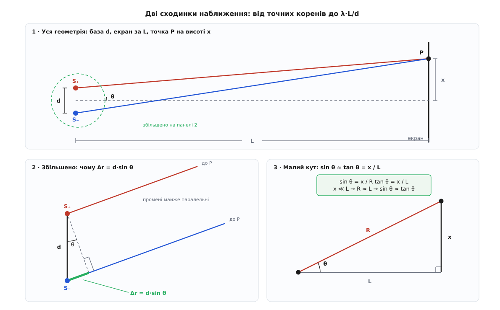
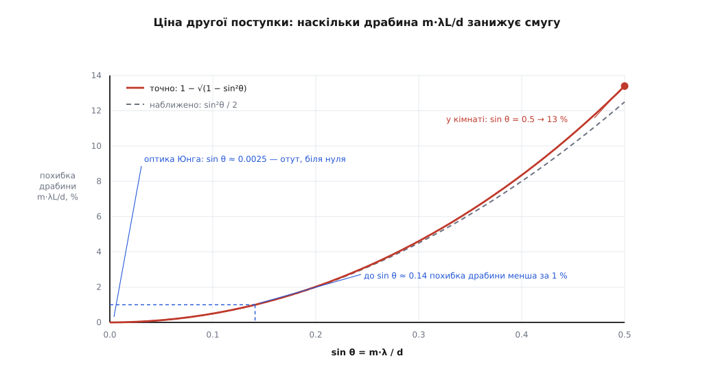
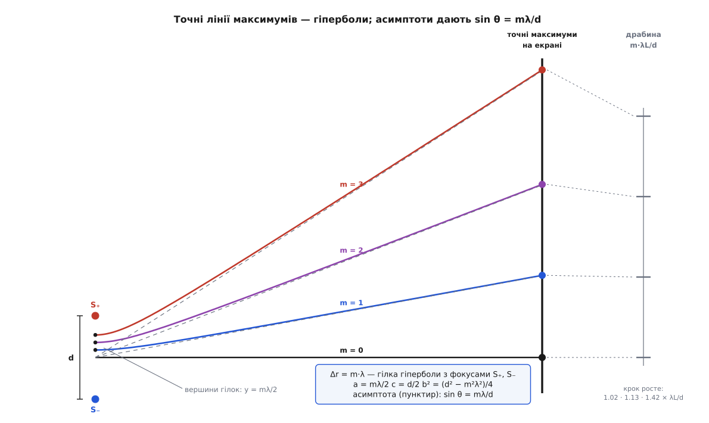

# 🧮 Крок смуг: звідки d·sin θ і чому виходить рівно λL/d

<preknowlist>
- [Ряди Тейлора](topic:math-analysis/taylor-series) — спосіб замінити громіздку функцію кількома першими доданками й одразу знати, **що саме** викинуто; тут ним розкладають корінь √(1 + ε) ≈ 1 + ε/2 − ε²/8.
- [Похідна](topic:math-analysis/derivative) — швидкість, з якою функція міняється при зсуві аргументу; вона перекладає «різниця ходу підросла на λ» у «на скільки треба посунутися по екрану».
- [Гіпербола](topic:math-geometry/hyperbola) — крива, у кожній точці якої різниця відстаней до двох закріплених фокусів однакова; саме ця властивість робить її тут головною дійовою особою.
</preknowlist>

Запис Δx ≈ λ·L/d короткий, але значок «≈» у ньому ховає **дві різні поступки**, зроблені одна за одною: спершу два промені оголошують паралельними й дістають різницю ходу d·sin θ, а тоді синус підміняють тангенсом — і смуги вишиковуються рівною драбиною. Пройдімо обидві поступки до дна: випишемо точну різницю ходу, побачимо, як із неї виростає d·sin θ, розв'яжемо задачу **точно** в замкненому вигляді, а тоді порахуємо в числах, скільки коштує кожне спрощення — і де в драбини λL/d стеля, за якою вона бреше вже не на відсотки, а якісно.

## Точна різниця ходу і тотожність, що її розплутує

Осі беремо так, щоб рахувати було майже нічого. Два джерела стоять на прямій, яку назвемо **базою**; початок координат — посередині між ними; вісь X — перпендикуляр до бази, що дивиться на екран. Екран паралельний базі й стоїть на відстані L. Точку на екрані задає її висота x, відлічена від осі.

```
S₊ = (0, +d/2)      S₋ = (0, −d/2)      P = (L, x)

r₊ = √( L² + (x − d/2)² )      ← шлях від ближчого (верхнього) джерела
r₋ = √( L² + (x + d/2)² )      ← від дальшого (нижнього)

Δr(x) = r₋ − r₊
```

Це точно й без жодних припущень — і воднораз майже непридатно. Спробуйте розв'язати Δr(x) = m·λ навпростець: два корені, кожен зі своїм зсувом, і жодного натяку на те, чи стоять розв'язки рівномірно.

Є хід, після якого все стає видно. Помножмо різницю на спряжену суму й поділімо на неї: корені зникнуть, бо **різницю квадратів** тут рахують усно.

```
r₋² − r₊² = (x + d/2)² − (x − d/2)² = 2·x·d

                r₋² − r₊²        2·x·d
Δr = r₋ − r₊ = ─────────── = ───────────
                 r₊ + r₋        r₊ + r₋
```

Це не наближення, а **тотожність**: вона правдива для будь-яких x, d, L. І з неї одразу читаються дві речі, заради яких варто було це робити.

**Перше — форма візерунка.** Уся залежність від точки сидить у знаменнику r₊ + r₋. Поки ми недалеко від осі, обидві відстані близькі до L, знаменник майже сталий — і Δr росте **прямо пропорційно** x. Ось де корінь усієї рівномірності смуг: не в природі хвилі, а в тому, що сума двох відстаней помалу міняється, поки чисельник росте лінійно.

**Друге — стеля.** Знаменник ніколи не буває меншим за 2|x|, бо кожна відстань не менша за свою вертикальну складову: r₊ ≥ |x − d/2|, r₋ ≥ |x + d/2|, а сума цих модулів не менша за 2|x|. Отже |Δr| < d — **завжди**, за будь-якої геометрії. Те саме видно й без алгебри: різниця двох сторін трикутника S₊S₋P менша за третю сторону, а третя сторона — це база d. Різниця ходу має тверду стелю, і ця обставина ще поверне драбину λL/d з небес на землю.

## Звідки береться d·sin θ

Тепер перша поступка. Коли точка P далеко, два промені, що йдуть до неї, майже паралельні — і всю різницю їхніх довжин можна побачити просто біля джерел. Опустімо з ближчого джерела S₊ перпендикуляр на промінь, що йде від дальшого S₋; нехай його основа — точка N. Тоді дальший промінь розпадається на дві частини: S₋N і NP, — а ближчий майже дорівнює самій лише NP (бо S₊P — гіпотенуза з коротким катетом S₊N, а гіпотенуза з дуже коротким катетом майже дорівнює другому катету). Уся різниця ходу зібралася в маленькому відрізку S₋N.

А цей відрізок читається з прямокутного трикутника S₊S₋N: гіпотенуза в ньому — сама база d, прямий кут — при N, а кут при S₊ дорівнює θ, тобто куту, під яким промінь відходить від осі. Катет, протилежний до θ, — це й є наш відрізок:

```
Δr ≈ d · sin θ
```


*Три кроки одної думки. Панель 1 — уся геометрія: база d, екран за L, точка P на висоті x, напрямок під кутом θ. Панель 2 — та сама околиця джерел під збільшенням: перпендикуляр з S₊ на промінь від S₋ відрізає катет d·sin θ, і саме він є різницею ходу, коли промені можна вважати паралельними. Панель 3 — друга поступка: для малого кута синус і тангенс майже збігаються, тож sin θ ≈ x/L.*

Цю саму формулу дає й алгебра — а заразом каже, скільки за неї платять. Позначмо через R = √(L² + x²) відстань від **середини** бази до точки P; тоді sin θ = x/R просто за означенням кута. Перепишімо тотожність:

```
        2·x·d          x·d / R            d · sin θ
Δr = ─────────── = ───────────────── = ─────────────────
       r₊ + r₋     (r₊ + r₋) / (2R)     (r₊ + r₋) / (2R)
```

Чисельник уже став тим, що треба: x/R — це і є sin θ. Уся неточність відтепер сидить в одному-єдиному місці — у знаменнику.

Тобто рівність Δr = d·sin θ точна рівно тією мірою, якою сума двох відстаней дорівнює двом відстаням від середини. Розкладімо обидві в ряд. Із a = d/(2R) і s = sin θ маємо r± = R·√(1 ∓ 2as + a²), а корінь беремо через √(1+u) ≈ 1 + u/2 − u²/8:

```
r₋ = R·( 1 + a·s + a²·cos²θ / 2 + … )
r₊ = R·( 1 − a·s + a²·cos²θ / 2 + … )
```

Ось найцікавіше місце. Лінійні доданки ±a·s мають протилежні знаки — вони гинуть у **сумі** й виживають у різниці. А квадратичні доданки в обох рядках **однакові** — тож вони виживають у сумі й гинуть у різниці. Симетричне розташування джерел щодо середини робить перший поправковий член спільним для двох шляхів, і різниця ходу його просто не помічає:

```
r₊ + r₋ = 2R·( 1 + a²·cos²θ / 2 + … )

Δr = d·sin θ · ( 1 − a²·cos²θ / 2 + … ) = d·sin θ − (d³ / 8R²)·sin θ·cos²θ + …
```

Отже помилка формули d·sin θ **квадратична** за малим відношенням d/R, і навіть у найгіршому напрямку не перевищує d²/(8R²) у частках:

```
d/R        найбільша відносна похибка d·sin θ  (= d²/8R²)
1/5        0.5 %
1/10       0.125 %
1/50       0.005 %
1/200      0.00031 %
```

Варто затямити, звідки взялася ця поблажливість: вона живе саме на **двох точкових** джерелах, симетричних щодо середини. Замініть точки щілинами скінченної ширини — і квадратичний член перестане бути спільним для всіх пар шляхів, бо кожна пара точок усередині щілин має свою відстань до середини; тоді для тієї самої точності знадобиться значно дальший екран, і виринає звична умова дальньої зони L ≫ d²/λ. Для пари точок вона надмірно сувора.

## Друга поступка: від напрямку до координати на екрані

У дальній зоні відповідь виходить не в координатах, а в **напрямках**: підсилення там, де d·sin θ = m·λ, тобто

```
sin θ_m = m·λ / d
```

Це вже готова відповідь — але не та, яку міряють. На екрані міряють висоту, а висота пов'язана з кутом тангенсом, не синусом:

```
x_m = L · tan θ_m
```

Друга поступка й полягає в тому, щоб для малого кута підмінити tan θ на sin θ. Тоді, і тільки тоді, з'являється драбина:

```
x_m ≈ L · sin θ_m = m·λ·L / d          →          Δx = x_{m+1} − x_m = λ·L / d
```

Ось відповідь на питання, чому крок виходить **рівно** λL/d і чому він **сталий**. Сталий він тому, що права частина лінійна за m; а лінійна вона тому, що ми взяли синус замість тангенса. Справжня величина L·tan θ_m за m не лінійна — тангенс росте швидше за синус, — тож рівномірність драбини не є властивістю інтерференції: вона є властивістю **малого кута**.

Скільки коштує ця підміна, видно одразу, бо відношення точне:

```
     x_m (драбина)       L · sin θ_m
   ─────────────────── = ─────────── = cos θ_m = √( 1 − (m·λ/d)² )
    x_m (дальня зона)    L · tan θ_m
```

Драбина завжди **занижує** позицію смуги, і рівно в cos θ_m разів. Позначмо u = sin θ_m = mλ/d; при малому u заниження дорівнює 1 − √(1 − u²) ≈ u²/2:

```
u = sin θ = m·λ/d      заниження позиції m-ї смуги
0.01                   0.005 %
0.05                   0.125 %
0.10                   0.50 %
0.141                  1.0 %
0.20                   2.02 %
0.30                   4.6 %
0.50                   13.4 %
```


*Наскільки драбина m·λL/d занижує справжню позицію смуги. По горизонталі — sin θ = m·λ/d, тобто «наскільки далеко вбік від осі» дивиться ця смуга. Похибка росте як квадрат кута: до sin θ ≈ 0.14 вона менша за один відсоток, а біля sin θ = 0.5 (кут 30°) сягає вже 13 %. У Юнговому оптичному досліді sin θ для перших смуг близький до 0.0025 — точка лежить у самому кутку графіка, і драбину там можна вважати точною.*

## Чому саме λ на одну смугу

Є ще один спосіб дістати той самий крок — коротший і придатний до будь-якої геометрії. Максимуми — це лінії, на яких Δr набирає **цілі** значення в одиницях λ. Отже, щоб перейти від одного максимуму до сусіднього, треба посунутися по екрану рівно настільки, щоб різниця ходу підросла на одну λ. Тобто локальний крок смуг — це λ, поділена на швидкість, з якою Δr росте вздовж екрана:

```
              λ
Δx = ──────────────────
        | dΔr / dx |
```

Швидкість цю дає похідна точного виразу:

```
dΔr     x + d/2     x − d/2
──── = ───────── − ─────────
 dx        r₋          r₊
```

Кожен дріб тут — синус кута, під яким промінь від відповідного джерела приходить у точку. У центрі візерунка (x = 0) обидві відстані однакові й дорівнюють r₀ = √(L² + d²/4), а обидва доданки додаються:

```
dΔr/dx |₀ = (d/2)/r₀ + (d/2)/r₀ = d / √(L² + d²/4)

Δx(центр) = λ·√(L² + d²/4) / d = (λ·L/d) · √( 1 + d²/(4L²) )
```

Це вже цікавіше за просту перевірку. Навіть у самому центрі, де кут нульовий і друга поступка нічого не коштує, справжній крок більший за λL/d — у √(1 + d²/4L²) разів. При d/L = 1/4 це +0.78 %, при d/L = 10⁻⁴ — мізерні +2·10⁻⁷ %. Тож λL/d — це не «крок у центрі», а границя кроку, коли база стискається до точки.

І ще одне з цього запису: похідна dΔr/dx — різниця двох синусів, а обидва вони з віддаленням від осі підповзають до одиниці, тож різниця тане. Швидкість росту Δr **спадає**, а крок смуг відповідно **росте**. Драбина з однаковими сходинками — фікція рівно тією мірою, якою ця швидкість встигає змінитися.

## Точна позиція смуги в замкненому вигляді

Ту саму тотожність зі спряженим можна догнати до кінця й дістати точну відповідь без жодного наближення. Нехай P — максимум порядку m, тобто r₋ − r₊ = m·λ. Ми вже знаємо, що r₋² − r₊² = 2xd, а різниця квадратів — це добуток різниці на суму:

```
r₋ − r₊ = m·λ                              (умова максимуму)
r₋ + r₊ = 2·x·d / (m·λ)                    (бо (r₋−r₊)(r₋+r₊) = 2xd)

→   r₊ = x·d/(m·λ) − m·λ/2
```

Тепер підставмо це в означення r₊² = L² + (x − d/2)² і розкриймо:

```
( x·d/(mλ) − mλ/2 )² = L² + x² − x·d + d²/4

x²d²/(m²λ²) − x·d + m²λ²/4 = L² + x² − x·d + d²/4
```

Доданки −x·d стоять обабіч і скорочуються — саме тому все й розв'язується. Лишається рівняння без лінійного члена:

```
x² · (d² − m²λ²) / (m²λ²) = L² + (d² − m²λ²)/4

       m·λ                4L²
x_m = ───── · √( 1 + ───────────── )
        2         d² − m²λ²
```

Ось точна позиція m-го максимуму на екрані — без ітерацій, без рядів, для будь-яких d, L, λ. І тепер обидві поступки видно як **два послідовні обрізання одного виразу**. Спершу відкидаємо одиницю під коренем — це і є перехід у дальню зону, бо він законний лише поки 4L² ≫ d² − m²λ²:

```
             m·λ·L
x_m ≈ ─────────────────── = L · tan θ_m
        √( d² − m²λ² )
```

а тоді викидаємо з-під кореня m²λ² — це вже друга поступка, малий кут:

```
x_m ≈ m·λ·L / d
```

Три записи — не три моделі, а той самий вираз, поглянутий із трьох відстаней.

## Стеля, якої драбина не знає

Погляньте, що стоїть під коренем у точній формулі: d² − m²λ². Ця величина мусить бути додатною — інакше жодного максимуму порядку m не існує **ніде**. Умова та сама, яку ми вже дістали з нерівності трикутника:

```
m·λ < d          →          m < d / λ
```

Різниця ходу не може перевищити базу, тож і цілих хвиль у ній вкладається не більше, ніж база вміщує довжин хвилі. На нескінченній стіні гучних смуг усього 2·⌊d/λ⌋ + 1 (а якщо d/λ — саме ціле, то на одну пару менше, бо крайній порядок припадає рівно на напрямок уздовж бази й на стіну не потрапляє ніколи).

Драбина ж m·λL/d про жодну стелю не знає: вона слухняно видасть координату для m = 10, m = 100, m = 10⁶. Це вже не помилка на відсотки — це вигадані смуги там, де їх фізично бути не може.

## Ті самі формули на двох задачах

**Оптика: драбина працює бездоганно.** Гелій-неоновий лазер, λ = 633 нм, дві щілини за 0.25 мм одна від одної, екран за 2 м.

```
Δx = λ·L/d = 633·10⁻⁹ · 2 / (0.25·10⁻³) = 5.064·10⁻³ м = 5.064 мм

u₁ = λ/d = 2.53·10⁻³          →  заниження першої смуги 3.2·10⁻⁴ %
d/L = 1.25·10⁻⁴               →  похибка d·sin θ менша за 2·10⁻⁷ %
точна формула:  x₁ = 5.064016 мм        драбина: 5.064000 мм
```

Розбіжність — 16 нанометрів на п'яти міліметрах. Навіть двадцята смуга виходить непогано: точно 101.410 мм проти 101.280 мм за драбиною, тобто 0.13 % — приблизно на межі того, що видно лінійкою. А от сотої смуги вже слід остерігатися: там u = 0.253, заниження 3.3 %. Стеля тут далеко — d/λ ≈ 395, тож формально є близько 790 смуг, — але рівномірними з них можна вважати лише кількадесят у центрі.

**Кімната: те саме число, зовсім інша точність.** Дві колонки з тоном λ = 0.5 м, рознесені на d = 1 м, стіна за L = 4 м.

```
Δx = λ·L/d = 0.5 · 4 / 1 = 2 м            ← драбина
u₁ = λ/d = 0.5                            ← перший максимум під кутом 30°
```

Тут другу поступку робити вже нема на чому: кут аж ніяк не малий. Точна формула дає

```
x₁ = (0.5/2)·√( 1 + 4·16 / (1 − 0.25) ) = 0.25·√(1 + 85.33) = 2.323 м
```

Порівняймо три відповіді для першої гучної смуги: точно 2.323 м, дальня зона L·tan 30° = 2.309 м, драбина 2.000 м. Тобто перша поступка (паралельні промені) коштує тут 0.58 % — і це попри те, що екран стоїть усього за чотири бази; а вся решта, майже 14 %, — плата за підміну тангенса синусом. Розподіл провини між двома наближеннями геть нерівний, і так буває майже завжди: **у переважній більшості випадків уся похибка драбини — це sin замість tan**.

І головне: d/λ = 2, тож на стіні є рівно три гучні смуги — центральна та по одній обабіч на 2.32 м. Драбина ж обіцяє смуги ще й на 4 м, 6 м, 8 м. Їх там немає й не може бути.

## Що це за крива — гіпербола

Тепер зрозуміло, чому точний розв'язок узагалі виписався так гарно. Умова Δr = m·λ каже: «різниця відстаней до двох закріплених точок стала» — а це дослівно означення **гіперболи** з фокусами в джерелах. Лінії максимумів не «майже прямі, що трохи гнуться»; вони — точні гіперболи, кожна зі своїм порядком m.

Стандартні півосі читаються прямо з означення. Різниця відстаней дорівнює 2a, фокусна віддаль — 2c:

```
2a = m·λ      →   a = m·λ/2
2c = d        →   c = d/2
b² = c² − a² = (d² − m²λ²) / 4
```

Перевірмо вершину. На самій базі, на висоті y між джерелами, різниця відстаней дорівнює (d/2 + y) − (d/2 − y) = 2y, тобто максимум порядку m перетинає базу на висоті y = mλ/2 — рівно a, як і має бути у вершини. І ще: b² > 0 — це вже знайома стеля m < d/λ, тільки записана мовою конічних перерізів.

А найважливіше — асимптоти. Їхній нахил дорівнює a/b, тобто

```
tan θ_m = a / b = m·λ / √( d² − m²λ² )        ⟺        sin θ_m = m·λ / d
```

**Точно**, без жодного наближення. Отже правило d·sin θ = mλ — не окрема модель дальньої зони, а просто асимптота точної гіперболи. «Промені паралельні» й «дивимося на криву далеко від фокусів» — це одне й те саме твердження, сказане двома мовами.


*Точні лінії максимумів для λ/d = 0.18 (показано верхню половину — нижня симетрична). Кожна гілка виходить із вершини на базі на висоті mλ/2 і швидко лягає на свою асимптоту (пунктир), нахил якої дає рівно sin θ = mλ/d. Праворуч — два стовпчики позицій на одному й тому самому екрані: точні перетини й рівномірна драбина m·λL/d. Перша смуга майже збігається, друга вже помітно розійшлася, третя стоїть більш ніж на пів кроку вище, ніж обіцяно. Самі сходинки не рівні між собою: 1.02 · 1.13 · 1.42 у частках λL/d.*

## Яку з формул брати

Тепер вибір робиться не на око, а за одним числом — u = m·λ/d, синусом кута на потрібну смугу.

- **u < 0.14** — беріть драбину x_m = m·λL/d: похибка менша за відсоток, і майже вся оптика живе тут.
- **0.14 < u < 1** — беріть формулу дальньої зони x_m = m·λL/√(d² − m²λ²): вона знімає всю похибку малого кута, а власна її похибка квадратична за d/R і зазвичай непомітна.
- **база порівнянна з відстанню до екрана, або треба точність, краща за (d/2R)²** — беріть точний вираз x_m = (mλ/2)·√(1 + 4L²/(d² − m²λ²)). Він не складніший за попередній, просто під коренем є ще одиниця.
- **u ≥ 1** — не рахуйте нічого: такої смуги не існує.

> 🔧 **Навіщо це.** Ланцюжок працює й у зворотний бік: виміряли крок смуг Δx — дістали довжину хвилі λ = Δx·d/L. Саме так її і міряють, і тут ціна другої поступки перетворюється на систематичний зсув результату. Щоб зменшити вплив похибки лінійки, відстань міряють не між сусідніми смугами, а від смуги −N до смуги +N і ділять на 2N. Але справжня позиція крайньої смуги — це L·tan θ_N, а формула трактує її як L·sin θ_N, тож обчислена λ виходить **завищеною** в 1/cos θ_N разів, тобто приблизно на u_N²/2. Для N = 20 у прикладі з лазером це +0.13 % — рівно того ж порядку, що й акуратне вимірювання лінійкою, тож поправку варто вносити: помножити результат на cos θ_N. Одна дія, і систематична похибка зникає, лишаючи саму лише випадкову.
